# 一般流程

## 进入容器

这里可以是`docker`, `podman`运行的容器, 或者是`distrobox`调用的`podman`容器, 为什么及怎么创建的不在这里记录了.

```bash
docker exec -it ubuntu_container /bin/bash

distrobox enter ubuntu1804 -- bash
distrobox enter ubuntu1804 -- bash --noprofile
```

切换成普通用户然后切换到目标目录

`podman`试下来很容易崩.


## 环境变量设置

```bash
source /opt/Xilinx/PetaLinux/2022.2/tool/settings.sh
```

## `xsa` 位置

```bash
mkdir hardware
# mv xsa to hardware folder
```

## 产生项目文件(工作目录)

```bash
petalinux-create -t project -n petalinux --template zynqMP
```

## 导入硬件信息

petalinux是工作目录

```bash
cd petalinux/
petalinux-config --get-hw-description ../hardware/
```

更新 xsa 文件后，需要这样

```bash
petalinux-build -x mrproper
petalinux-build
```
避免旧缓存导致 DTS 不更新的问题


## 配置本地 sstate 和 downloads 目录

```bash
petalinux-config
```

```bash
Yocto Settings  --->
    Local sstate feeds settings  --->
        (file:///opt/Xilinx/PetaLinux/2022.2/sstate-cache) Local sstate feeds URL
    Add pre-mirror url  --->
        (file:///opt/Xilinx/PetaLinux/2022.2/downloads) Add pre-mirror url
```

原来的 pre-mirror url 是 `http://petalinux.xilinx.com/sswreleases/rel-v${PETALINUX_MAJOR_VER}/downloads`

体现在

```bash
build/conf/plnxtool.conf
```


## proxy等其他环境变量

```bash
export http_proxy="127.0.0.1:8118"
export https_proxy="127.0.0.1:8118"
export PETALINUX_SSTATE_LOC=/opt/Xilinx/PetaLinux/2022.2/sstate-cache
export PETALINUX_DOWNLOADS_LOC=/opt/Xilinx/PetaLinux/2022.2/downloads
//export YOCTO_NO_NETWORK=1
```


## 进一步配置
```bash
petalinux-config -c u-boot
petalinux-config -c kernel
petalinux-config -c rootfs
```

## 直接产生device-tree

这样可以基于自动生成的 device-tree 去编辑 `project-spec/meta-user/recipes-bsp/device-tree`

```
petalinux-config -c device-tree

or

petalinux-build -c device-tree -x do_configure
```

输出位于`components/plnx_workspace/device-tree/device-tree`


## 开始构建

```bash
petalinux-build

==
petalinux-build -c petalinux-image-minimal -x do_compile
```
单独编译某个软件

```
petalinux-build -c device-tree -x cleansstate
petalinux-build -c device-tree -x do_compile
```


并行处理数量在`project-spec/configs/config`里配置

```bash
CONFIG_YOCTO_BB_NUMBER_THREADS=""
CONFIG_YOCTO_PARALLEL_MAKE=""
```

也可以在`project-spec/meta-user/conf/petalinuxbsp.conf`强行设置并行处理数量

```bash
BB_NUMBER_THREADS = "2"
PARALLEL_MAKE = "-j2"
```


清理

```bash
petalinux-build -x clean
petalinux-build -x cleansstate
petalinux-build -x mrproper             # 最彻底

petalinux-build -x cleansstate  == bitbake petalinux-image-minimal -c cleansstate
```


## 构建完毕后产生目标文件

```bash
petalinux-package --boot --u-boot --fpga --force
```

默认就是`sd`卡启动`ramfs`

`petalinux/images/linux`目录下的这三个文件放到vfat格式的sd卡就可以。记得启动拨码给对。

```bash
boot.scr
BOOT.BIN
image.ub
```

## 产生sdk
```bash
petalinux-build --sdk
```
输出在
```bash
build/tmp/deploy/sdk
```


# 问题处理1: PL设备节点名修正

`petalinux/components/plnx_workspace/device-tree/device-tree/pl.dtsi`自动产生endpoint名称有错误，

```bash
/home/andy/workdir/zirui/04_hdmi_tx/hdmi_tx_vdma_peta/petalinux/project-spec/configs/../../components/plnx_workspace/device-tree/device-tree/pl.dtsi:104.66-106.8: ERROR (phandle_references): /amba_pl@0/mipi_csi2_rx_subsystem@80050000/ports/port@1/endpoint: Reference to non-existent node or label "mipi_csi2_rx_axis_passthrough_mon_0mipi_csi2_rx_mipi_csi2_rx_subsyst_0"

/home/andy/workdir/zirui/04_hdmi_tx/hdmi_tx_vdma_peta/petalinux/project-spec/configs/../../components/plnx_workspace/device-tree/device-tree/pl.dtsi:206.48-208.8: ERROR (phandle_references): /amba_pl@0/v_proc_ss@80080000/ports/port@1/endpoint: Reference to non-existent node or label "mipi_csi2_rx_axis_switch_0mipi_csi2_rx_v_proc_ss_0"

/home/andy/workdir/zirui/04_hdmi_tx/hdmi_tx_vdma_peta/petalinux/project-spec/configs/../../components/plnx_workspace/device-tree/device-tree/pl.dtsi:243.44-245.8: ERROR (phandle_references): /amba_pl@0/v_tpg@800c0000/ports/port@1/endpoint: Reference to non-existent node or label "mipi_csi2_rx_axis_switch_0mipi_csi2_rx_v_tpg_0"
```

修改为正确的，继续编译，怎么修改呢？


## test0: 启用`dt overlay`
```bash
petalinux-build -c device-tree -x cleansstate
petalinux-build -c device-tree -x do_compile

petalinux-build -x cleansstate  == bitbake petalinux-image-minimal -c cleansstate
```

能编译通过，但是有啥作用呢？ 还是关闭掉，重置默认关闭

修改petalinux-config之后最有效的重置方法
```
petalinux-build -x clean        == bitbake petalinux-image-minimal -c clean
```

按理说只是device-tree这样也应该是彻底重置

```
petalinux-build -c device-tree -x clean
```


## test1: 先去掉`endpoint`
petalinux/project-spec/meta-user/recipes-bsp/device-tree/files/system-user.dtsi
```dtd
/*Add pl custom nodes for pl.dtsi which is generated from base xsa file.
Changes in this file reflects only when enabled the FPGA manager/Device tree overlay.*/
/ {
    user_test_property = <12345>;
};

&mipi_csi2_rx_mipi_csi2_rx_subsyst_0 {
    ports {
        // 覆盖 port@1（去掉 remote-endpoint 和 endpoint）
        port@1 {
            reg = <1>;
            xlnx,cfa-pattern = "rggb";
            xlnx,video-format = <12>;
            xlnx,video-width = <8>;
        };

        // 保留 port@0 并保持 data-lanes
        port@0 {
            reg = <0>;
            xlnx,cfa-pattern = "rggb";
            xlnx,video-format = <12>;
            xlnx,video-width = <8>;

            mipi_csi_in: endpoint {
                data-lanes = <1 2>;
            };
        };
    };
};
```

有命令
```shell
petalinux-build -c device-tree -x cleansstate
petalinux-build -c device-tree == petalinux-build -c device-tree -x do_compile
petalinux-build

grep -R "mipi" build/tmp/work/*/device-tree/*/system-top.dtb
find . -type f -name "system-top.dtb"
```

## test2: 补全`endpoint`
在git内体现


# 问题处理2: 没有检测到i2c设备
```bash
root@petalinux:~# i2cdetect -y 0  
     0  1  2  3  4  5  6  7  8  9  a  b  c  d  e  f
00:                         -- -- -- -- -- -- -- -- 
10: -- -- -- -- -- -- -- -- -- -- -- -- -- -- -- -- 
20: -- -- -- -- -- -- -- -- -- -- -- -- -- -- -- -- 
30: -- -- -- -- -- -- -- -- -- -- -- -- -- -- -- -- 
40: -- -- -- -- -- -- -- -- -- -- -- -- -- -- -- -- 
50: -- -- -- -- -- -- -- -- -- -- -- -- -- -- -- -- 
60: -- -- -- -- -- -- -- -- -- -- -- -- -- -- -- -- 
70: -- -- -- -- -- -- -- --                         
root@petalinux:~# i2cdetect -y 1  
     0  1  2  3  4  5  6  7  8  9  a  b  c  d  e  f
00:                         -- -- -- -- -- -- -- -- 
10: -- -- -- -- -- -- -- -- -- -- -- -- -- -- -- -- 
20: -- -- -- -- -- -- -- -- -- -- -- -- -- -- -- -- 
30: -- -- -- -- -- -- -- -- -- -- -- -- -- -- -- -- 
40: -- -- -- -- -- -- -- -- -- -- -- -- -- -- -- -- 
50: -- -- -- -- -- -- -- -- -- -- -- -- -- -- -- -- 
60: -- -- -- -- -- -- -- -- -- -- -- -- -- -- -- -- 
70: -- -- -- -- -- -- -- --                         
root@petalinux:~# i2cdetect -y 2
     0  1  2  3  4  5  6  7  8  9  a  b  c  d  e  f
00:                         -- -- -- -- -- -- -- -- 
10: -- -- -- -- -- -- -- -- -- -- -- -- -- -- -- -- 
20: -- -- -- -- -- -- -- -- -- -- -- -- -- -- -- -- 
30: -- -- -- -- -- -- -- -- -- -- -- -- -- -- -- -- 
40: -- -- -- -- -- -- -- -- -- -- -- -- -- -- -- -- 
50: -- -- -- -- -- -- -- -- -- -- -- -- -- -- -- -- 
60: -- -- -- -- -- -- -- -- -- -- -- -- -- -- -- -- 
70: -- -- -- -- -- -- -- --        

root@petalinux:~# i2cdetect -l  
i2c-0   i2c             i2c-gpio-0                              I2C adapter
i2c-1   i2c             i2c-gpio-1                              I2C adapter
i2c-2   i2c             i2c-gpio-2                              I2C adapter

oot@petalinux:~# ls -l /sys/class/i2c-adapter/                                                                                 
lrwxrwxrwx    1 root     root             0 May  8 09:13 i2c-0 -> ../../devices/platform/i2c-gpio-0/i2c-0
lrwxrwxrwx    1 root     root             0 May  8 09:13 i2c-1 -> ../../devices/platform/i2c-gpio-1/i2c-1
lrwxrwxrwx    1 root     root             0 May  8 09:13 i2c-2 -> ../../devices/platform/i2c-gpio-2/i2c-2

root@petalinux:~# dmesg | grep i2c-gpio
[    4.672369] i2c-gpio i2c-gpio-0: using lines 470 (SDA) and 471 (SCL)
[    4.682554] i2c-gpio i2c-gpio-1: using lines 472 (SDA) and 473 (SCL)
[    4.690846] i2c-gpio i2c-gpio-2: using lines 474 (SDA) and 475 (SCL)

```

下面修改无效
```bash
&xgpio_i2c_0_axi_gpio_0 {
    xlnx,all-inputs = <0x0>;
    xlnx,all-outputs = <0xFFFFFFFF>;    /* 全部配置为输出 */
    xlnx,dout-default = <0xFFFFFFFF>;   /* 上电后的默认电平为高 */
    xlnx,tri-default = <0x0>;
};
```

```bash
&xgpio_i2c_0_axi_gpio_0 {
    #gpio-cells = <2>;
    gpio-controller;

    compatible = "xlnx,axi-gpio-2.0", "xlnx,xps-gpio-1.00.a";
    reg = <0x0 0x80110000 0x0 0x10000>;

    xlnx,gpio-width = <6>;
    xlnx,is-dual = <0>;

    /* 必须：全部 input，允许 i2c-gpio 控制 */
    xlnx,tri-default = <0xFFFFFFFF>;
};
```


有关命令
```bash
i2cdetect -y 1
i2cget -f -y 1 <addr> <reg>
i2cset -f -y 1 <addr> <reg> <val>
i2ctransfer -f -y 1 w1@<addr> <reg> r1
i2ctransfer -f -y 1 w2@0x6c 0x00 0x00 r1

```


板子上暂时也查看不了波形，放弃使用gpio-i2c


# 更换为`axi-i2c`

## 问题1: 没有出现i2c节点
```bash
root@petalinux:~# i2cdetect -l
root@petalinux:~# i2cdetect -l
root@petalinux:~# ls /dev/i* -l
crw-------    1 root     root      246,   0 Mar 24 10:32 /dev/iio:device0
lrwxrwxrwx    1 root     root            12 Mar 24 10:32 /dev/initctl -> /run/initc
```

```bash
root@petalinux:~# dmesg | grep i2c
[    4.931796] i2c_dev: i2c /dev entries driver
[    5.580322] xiic-i2c 80010000.i2c: IRQ index 0 not found
[    5.591610] xiic-i2c 80020000.i2c: IRQ index 0 not found
[    5.604501] xiic-i2c 80030000.i2c: IRQ index 0 not found
```

看起来是缺少中断号，那么vivado把中断连上

测试`ok`，能检测到


# 从开发板到目标板

目标板没有tf卡插口，所以，设想先从qspi_flash启动ramfs。64MB的大小，需要55MB，能装下。

这个qspi启动的版本，可以用来mount usb设备然后刷emmc，emmc也分区，刷好后从emmc启动即可。比没有sd卡的其实费事一点。


## 一些文件的作用
```bash
image.ub: 包括内核、ramdisk、设备树dtb
u-boot.elf: 通用boot文件，负责将image.ub从flash、sd卡等load到DDR中
zynqmp_fsbl.elf: 加载bitstream，初始化DDR，初始化时钟PLL等，加载u-boot
```

## 打包产生BOOT.bin
```bash
petalinux-package --boot --fsbl --fpga --u-boot --kernel --force
```

### 报错
```bash
$ petalinux-package --boot --fsbl --fpga --u-boot --kernel --force
[INFO] Sourcing buildtools
INFO: Getting system flash information...
INFO: File in BOOT BIN: "/home/andy/workdir/zirui/04_hdmi_tx/hdmi_tx_vdma_peta1/petalinux/images/linux/zynqmp_fsbl.elf"
INFO: File in BOOT BIN: "/home/andy/workdir/zirui/04_hdmi_tx/hdmi_tx_vdma_peta1/petalinux/images/linux/pmufw.elf"
INFO: File in BOOT BIN: "/home/andy/workdir/zirui/04_hdmi_tx/hdmi_tx_vdma_peta1/petalinux/project-spec/hw-description/system_wrapper.bit"
INFO: File in BOOT BIN: "/home/andy/workdir/zirui/04_hdmi_tx/hdmi_tx_vdma_peta1/petalinux/images/linux/bl31.elf"
INFO: File in BOOT BIN: "/home/andy/workdir/zirui/04_hdmi_tx/hdmi_tx_vdma_peta1/petalinux/images/linux/system.dtb"
INFO: File in BOOT BIN: "/home/andy/workdir/zirui/04_hdmi_tx/hdmi_tx_vdma_peta1/petalinux/images/linux/u-boot.elf"
INFO: File in BOOT BIN: "/home/andy/workdir/zirui/04_hdmi_tx/hdmi_tx_vdma_peta1/petalinux/images/linux/image.ub"
INFO: File in BOOT BIN: "/home/andy/workdir/zirui/04_hdmi_tx/hdmi_tx_vdma_peta1/petalinux/images/linux/boot.scr"
INFO: Generating zynqmp binary package BOOT.BIN...


****** Xilinx Bootgen v2022.2
  **** Build date : Sep 26 2022-06:24:42
    ** Copyright 1986-2022 Xilinx, Inc. All Rights Reserved.

[ERROR]  : Section image.ub.0 offset of 0x100000 overlaps with prior section end address of 0xCD5880
ERROR: Fail to create BOOT image
```


修改flash分区配置
```bash
petalinux-config
```
增加到`0xD00000`,然后
```bash
petalinux-build
```

生成烧写文件
```bash
petalinux-package --boot --fsbl --fpga --u-boot --kernel --force
du -b images/linux/BOOT.BIN | awk '{print substr($1,$2)}' | xargs -I {} printf "%x\n" {} 
3e80adc
```

烧写, 新开一个terminal
```bash
source /opt/Xilinx/Vitis/2022.2/settings64.sh
program_flash -f images/linux/BOOT.BIN -offset 0 -flash_type qspi-x8-dual_parallel -fsbl images/linux/zynqmp_fsbl.elf -url TCP:127.0.0.1:3121 
```

板卡输出, 超出了?
```bash
SF: Detected w25q256fw with page size 512 Bytes, erase size 128 KiB, total 64 MiB
Size exceeds partition or device limit
sf - SPI flash sub-system

Usage:
sf probe [[bus:]cs] [hz] [mode] - init flash device on given SPI bus
                                  and chip select
sf read addr offset|partition len       - read `len' bytes starting at
                                          `offset' or from start of mtd
                                          `partition'to memory at `addr'
sf write addr offset|partition len      - write `len' bytes from memory
                                          at `addr' to flash at `offset'
                                          or to start of mtd `partition'
sf erase offset|partition [+]len        - erase `len' bytes from `offset'
                                          or from start of mtd `partition'
                                         `+len' round up `len' to block size
sf update addr offset|partition len     - erase and write `len' bytes from memory
                                          at `addr' to flash at `offset'
                                          or to start of mtd `partition'
sf protect lock/unlock sector len       - protect/unprotect 'len' bytes starting
                                          at address 'sector'

```

`64×1024×1024=0x4000000`, 没有超出

自动产生的bootgen.bif文件
```
the_ROM_image:
{
	[bootloader, destination_cpu=a53-0] /home/andy/workdir/zirui/04_hdmi_tx/hdmi_tx_vdma_peta1/petalinux/images/linux/zynqmp_fsbl.elf
	[pmufw_image] /home/andy/workdir/zirui/04_hdmi_tx/hdmi_tx_vdma_peta1/petalinux/images/linux/pmufw.elf
	[destination_device=pl] /home/andy/workdir/zirui/04_hdmi_tx/hdmi_tx_vdma_peta1/petalinux/project-spec/hw-description/system_wrapper.bit
	[destination_cpu=a53-0, exception_level=el-3, trustzone] /home/andy/workdir/zirui/04_hdmi_tx/hdmi_tx_vdma_peta1/petalinux/images/linux/bl31.elf
	[destination_cpu=a53-0, load=0x00100000] /home/andy/workdir/zirui/04_hdmi_tx/hdmi_tx_vdma_peta1/petalinux/images/linux/system.dtb
	[destination_cpu=a53-0, exception_level=el-2] /home/andy/workdir/zirui/04_hdmi_tx/hdmi_tx_vdma_peta1/petalinux/images/linux/u-boot.elf
	[destination_cpu=a53-0, offset=0xd00000, partition_owner=uboot] /home/andy/workdir/zirui/04_hdmi_tx/hdmi_tx_vdma_peta1/petalinux/images/linux/image.ub
	[destination_cpu=a53-0, offset=0x3E80000, partition_owner=uboot] /home/andy/workdir/zirui/04_hdmi_tx/hdmi_tx_vdma_peta1/petalinux/images/linux/boot.scr
}
```

其实qspi里面的工程不需要pl部分的, 新建一个最小系统来放到qspi_flash吧


# 最小系统

`zirui/04_hdmi_tx/mini`工程产生和验证了`xsa`文件

先按一般流程进行编译

然后生成烧写文件

## 打包命令

```bash
petalinux-package --boot --fsbl --u-boot --kernel --force
```

需要修改 `CONFIG_SUBSYSTEM_FLASH_PSU_QSPI_0_BANKLESS_PART0_SIZE=0x1B0000`
```bash
$ petalinux-package --boot --fsbl --u-boot --kernel --force
[INFO] Sourcing buildtools
INFO: Getting system flash information...
INFO: File in BOOT BIN: "/home/andy/workdir/zirui/04_hdmi_tx/mini_peta/petalinux/images/linux/zynqmp_fsbl.elf"
INFO: File in BOOT BIN: "/home/andy/workdir/zirui/04_hdmi_tx/mini_peta/petalinux/images/linux/pmufw.elf"
INFO: File in BOOT BIN: "/home/andy/workdir/zirui/04_hdmi_tx/mini_peta/petalinux/images/linux/bl31.elf"
INFO: File in BOOT BIN: "/home/andy/workdir/zirui/04_hdmi_tx/mini_peta/petalinux/images/linux/system.dtb"
INFO: File in BOOT BIN: "/home/andy/workdir/zirui/04_hdmi_tx/mini_peta/petalinux/images/linux/u-boot.elf"
INFO: File in BOOT BIN: "/home/andy/workdir/zirui/04_hdmi_tx/mini_peta/petalinux/images/linux/image.ub"
INFO: File in BOOT BIN: "/home/andy/workdir/zirui/04_hdmi_tx/mini_peta/petalinux/images/linux/boot.scr"
INFO: Generating zynqmp binary package BOOT.BIN...


****** Xilinx Bootgen v2022.2
  **** Build date : Sep 26 2022-06:24:42
    ** Copyright 1986-2022 Xilinx, Inc. All Rights Reserved.

[ERROR]  : Section image.ub.0 offset of 0x100000 overlaps with prior section end address of 0x1A4880
ERROR: Fail to create BOOT image
```
其实还是超大, 怎么还是和前面那个一样大呢?
```bash
du -b images/linux/BOOT.BIN | awk '{print substr($1,$2)}' | xargs -I {} printf "0x%x\n" {} 
0x3e80adc
```

计算一下
```bash
zynqmp_fsbl.elf     462.4KB
pmufw.elf           496.6KB
bl31.elf            152.5KB
system.dtb           37.7KB
u-boot.elf            9.3MB
image.ub             35.4MB
boot.scr              2.8KB
```
总大小肯定没有超过

自动产生的bootgen.bif文件
```bash
the_ROM_image:
{
	[bootloader, destination_cpu=a53-0] /home/andy/workdir/zirui/04_hdmi_tx/mini_peta/petalinux/images/linux/zynqmp_fsbl.elf
	[pmufw_image] /home/andy/workdir/zirui/04_hdmi_tx/mini_peta/petalinux/images/linux/pmufw.elf
	[destination_cpu=a53-0, exception_level=el-3, trustzone] /home/andy/workdir/zirui/04_hdmi_tx/mini_peta/petalinux/images/linux/bl31.elf
	[destination_cpu=a53-0, load=0x00100000] /home/andy/workdir/zirui/04_hdmi_tx/mini_peta/petalinux/images/linux/system.dtb
	[destination_cpu=a53-0, exception_level=el-2] /home/andy/workdir/zirui/04_hdmi_tx/mini_peta/petalinux/images/linux/u-boot.elf
	[destination_cpu=a53-0, offset=0x1b0000, partition_owner=uboot] /home/andy/workdir/zirui/04_hdmi_tx/mini_peta/petalinux/images/linux/image.ub
	[destination_cpu=a53-0, offset=0x3E80000, partition_owner=uboot] /home/andy/workdir/zirui/04_hdmi_tx/mini_peta/petalinux/images/linux/boot.scr
}
```
最后那个boot.scr给的地址太大了

## 显示某文件的十六进制大小

```bash
du -b images/linux/image.ub | awk '{print substr($1,$2)}' | xargs -I {} printf "0x%x\n" {} 
0x21ba510
```

计算boot.scr偏移
```bash
1b0000+21ba510=236A510
```
取0x2400000

修改bootgen.bif文件
```bash
the_ROM_image:
{
	[bootloader, destination_cpu=a53-0] /home/andy/workdir/zirui/04_hdmi_tx/mini_peta/petalinux/images/linux/zynqmp_fsbl.elf
	[pmufw_image] /home/andy/workdir/zirui/04_hdmi_tx/mini_peta/petalinux/images/linux/pmufw.elf
	[destination_cpu=a53-0, exception_level=el-3, trustzone] /home/andy/workdir/zirui/04_hdmi_tx/mini_peta/petalinux/images/linux/bl31.elf
	[destination_cpu=a53-0, load=0x00100000] /home/andy/workdir/zirui/04_hdmi_tx/mini_peta/petalinux/images/linux/system.dtb
	[destination_cpu=a53-0, exception_level=el-2] /home/andy/workdir/zirui/04_hdmi_tx/mini_peta/petalinux/images/linux/u-boot.elf
	[destination_cpu=a53-0, offset=0x1b0000, partition_owner=uboot] /home/andy/workdir/zirui/04_hdmi_tx/mini_peta/petalinux/images/linux/image.ub
	[destination_cpu=a53-0, offset=0x2400000, partition_owner=uboot] /home/andy/workdir/zirui/04_hdmi_tx/mini_peta/petalinux/images/linux/boot.scr
}

```
## 通过vitis命令产生 BOOT.BIN

新开一个terminal

```bash
source /opt/Xilinx/Vitis/2022.2/settings64.sh
bootgen -image images/linux/bootgen.bif -arch zynqmp -o images/linux/BOOT.BIN
du -b images/linux/BOOT.BIN | awk '{print substr($1,$2)}' | xargs -I {} printf "0x%x\n" {} 
0x2400adc
```
这次大小总算合适了

## 通过vitis命令烧写

新开一个terminal

```bash
source /opt/Xilinx/Vitis/2022.2/settings64.sh
program_flash -f images/linux/BOOT.BIN -offset 0 -flash_type qspi-x8-dual_parallel -fsbl images/linux/zynqmp_fsbl.elf -url TCP:127.0.0.1:3121 
```

这次显示的
```bash
Xilinx Zynq MP First Stage Boot Loader 
Release 2022.2   Oct  7 2022  -  04:56:16
NOTICE:  BL31: v2.6(release):xlnx_rebase_v2.6_2022.1_update3-18-g0897efd45
NOTICE:  BL31: Built : 03:55:03, Sep  9 2022

```

正常应该
```bash
Xilinx Zynq MP First Stage Boot Loader 
Release 2022.2   Oct  7 2022  -  04:56:16
NOTICE:  BL31: v2.6(release):xlnx_rebase_v2.6_2022.1_update3-18-g0897efd45
NOTICE:  BL31: Built : 03:55:03, Sep  9 2022


U-Boot 2022.01 (Sep 20 2022 - 06:35:33 +0000)

CPU:   ZynqMP
Silicon: v3
Board: Xilinx ZynqMP
DRAM:  4 GiB
PMUFW:  v1.1
PMUFW no permission to change config object
EL Level:       EL2
Chip ID:        zu7ev
NAND:  0 MiB
MMC:   mmc@ff160000: 0, mmc@ff170000: 1
Loading Environment from SPIFlash...
```
也就是 u-boot 没有启动


对比bootgen.bif文件发现0x3E80000是固定的, `grep -R 3E80000` 

```bash
build/tmp/work/x86_64-linux/qemu-xilinx-system-native/v6.1.0-xilinx-v2022.2+gitAUTOINC+74d70f8008-r0/git/roms/u-boot/board/xilinx/Kconfig:	default 0x3E80000 if ARCH_ZYNQMP
build/tmp/work/zynqmp_generic-xilinx-linux/u-boot-xlnx/v2021.01-xilinx-v2022.2+gitAUTOINC+b31476685d-r0/build/source/board/xilinx/Kconfig:	default 0x3E80000 if ARCH_ZYNQMP
build/tmp/work/zynqmp_generic-xilinx-linux/u-boot-xlnx/v2021.01-xilinx-v2022.2+gitAUTOINC+b31476685d-r0/build/include/generated/autoconf.h:#define CONFIG_BOOT_SCRIPT_OFFSET 0x3E80000
build/tmp/work/zynqmp_generic-xilinx-linux/u-boot-xlnx/v2021.01-xilinx-v2022.2+gitAUTOINC+b31476685d-r0/build/include/config/auto.conf:CONFIG_BOOT_SCRIPT_OFFSET=0x3E80000
build/tmp/work/zynqmp_generic-xilinx-linux/u-boot-xlnx/v2021.01-xilinx-v2022.2+gitAUTOINC+b31476685d-r0/build/.config.old:CONFIG_BOOT_SCRIPT_OFFSET=0x3E80000
build/tmp/work/zynqmp_generic-xilinx-linux/u-boot-xlnx/v2021.01-xilinx-v2022.2+gitAUTOINC+b31476685d-r0/build/spl/u-boot.cfg:#define CONFIG_BOOT_SCRIPT_OFFSET 0x3E80000
build/tmp/work/zynqmp_generic-xilinx-linux/u-boot-xlnx/v2021.01-xilinx-v2022.2+gitAUTOINC+b31476685d-r0/build/.config:CONFIG_BOOT_SCRIPT_OFFSET=0x3E80000
build/tmp/work/zynqmp_generic-xilinx-linux/u-boot-xlnx/v2021.01-xilinx-v2022.2+gitAUTOINC+b31476685d-r0/build/u-boot.cfg:#define CONFIG_BOOT_SCRIPT_OFFSET 0x3E80000
build/tmp/work/zynqmp_generic-xilinx-linux/u-boot-xlnx/v2021.01-xilinx-v2022.2+gitAUTOINC+b31476685d-r0/git/board/xilinx/Kconfig:	default 0x3E80000 if ARCH_ZYNQMP

```
可见, u-boot 的 CONFIG_BOOT_SCRIPT_OFFSET 是关键

```bash
petalinux-config -c u-boot
```
修改`Boot script offset`为`0x2400000`


```bash
petalinux-build -c u-boot -x clean
petalinux-build -c u-boot -x do_compile
petalinux-package --boot --fsbl --u-boot --kernel --force
```
bootgen.bif文件没有变


```bash
petalinux-build -x mrproper
petalinux-build

```

bootgen.bif文件还是没有变

实际上`0x3E80000`也没有超出`64MB`的范围, 再分析启动过程

```bash
Hit any key to stop autoboot:  0 
SF: Detected w25q256fw with page size 512 Bytes, erase size 128 KiB, total 64 MiB
device 0 offset 0x3e80000, size 0x80000
SF: 524288 bytes @ 0x3e80000 Read: OK
QSPI: Trying to boot script at 20000000
## Executing script at 20000000
Trying to load boot images from qspi0
SF: Detected w25q256fw with page size 512 Bytes, erase size 128 KiB, total 64 MiB
Size exceeds partition or device limit
sf - SPI flash sub-system

Usage:
sf probe [[bus:]cs] [hz] [mode] - init flash device on given SPI bus
                                  and chip select
sf read addr offset|partition len       - read `len' bytes starting at
                                          `offset' or from start of mtd
                                          `partition'to memory at `addr'
sf write addr offset|partition len      - write `len' bytes from memory
                                          at `addr' to flash at `offset'
                                          or to start of mtd `partition'
sf erase offset|partition [+]len        - erase `len' bytes from `offset'
                                          or from start of mtd `partition'
                                         `+len' round up `len' to block size
sf update addr offset|partition len     - erase and write `len' bytes from memory
                                          at `addr' to flash at `offset'
                                          or to start of mtd `partition'
sf protect lock/unlock sector len       - protect/unprotect 'len' bytes starting
                                          at address 'sector'

sf test offset len              - run a very basic destructive test
Wrong Image Format for bootm command
ERROR: can't get kernel image!
Booting using Fit image failed
device 0 offset 0xf00000, size 0x1d00000
SF: 30408704 bytes @ 0xf00000 Read: OK
Offset exceeds device limit
```

再看 `boot.scr`

```bash
	if test "${boot_target}" = "xspi0" || test "${boot_target}" = "qspi" || test "${boot_target}" = "qspi0"; then
		sf probe 0 0 0;
		sf read 0x10000000 0xF40000 0x6400000
		bootm 0x10000000;
		echo "Booting using Fit image failed"

		sf read 0x00200000 0xF00000 0x1D00000
		sf read 0x04000000 0x4000000 0x4000000
		booti 0x00200000 0x04000000 0x00100000;
		echo "Booting using Separate images failed"
	fi
```

也就是说, 修改config的u-boot菜单里的偏移量就可以呗

## 可以通过u-boot命令进行验证`boot.scr`

```bash
		sf probe 0 0 0;
		sf read 0x10000000 0x1B0000 0x2200000
		bootm 0x10000000;
```

验证通过

## 总结

打包命令 会产生 `petalinux/images/linux/bootgen.bif` 文件, 核对其中偏移量

一般需要修改这几个
```bash
CONFIG_SUBSYSTEM_FLASH_PSU_QSPI_0_BANKLESS_PART0_SIZE=0x1B0000
CONFIG_SUBSYSTEM_UBOOT_QSPI_FIT_IMAGE_OFFSET=0x1B0000
CONFIG_SUBSYSTEM_UBOOT_QSPI_FIT_IMAGE_SIZE=0x2200000
```
`u-boot`的`Boot script offset`在2022.2这个版本覆盖定义之后似乎没有起作用, 如果实在要重定义, 手动用`vitis`命令配合修改的`bootgen.bif`产生打包文件

`fitimage_name=image.ub`, 而且要核对`petalinux/images/linux/boot.scr`对应启动方式的偏移量和大小. 可以通过`u-boot`有关命令进行验证

通过`petalinux-config`流程 或者 手动修改再通过等效命令 都可以产生最终的烧写文件.

目的是为了对`emmc`进行刷写(目标板子没有留`sd`卡接口).


## Zynq UltraScale+ MPSoC 启动模式  — 4‑bit BOOT_MODE[3:0] 拨码表

| 4‑bit BOOT_MODE | 启动源名称   | 说明                                                    |
| --------------- | ------------ | ------------------------------------------------------- |
| `0000`          | JTAG         | Host JTAG 下载或调试启动                                |
| `0001`          | QSPI24       | Quad‑SPI Flash, 24‑bit 地址                             |
| `0010`          | QSPI32       | Quad‑SPI Flash, 32‑bit 地址                             |
| `0011`          | SD0 (2.0)    | SD 卡接口 0 (SD 2.0)                                    |
| `0100`          | NAND         | NAND Flash 启动                                         |
| `0101`          | SD1 (2.0)    | SD 卡接口 1 (SD 2.0)                                    |
| `0110`          | eMMC (1.8V)  | eMMC 启动 (1.8V signaling)                              |
| `0111`          | USB (2.0)    | USB DFU 设备引导                                        |
| `1000`          | PJTAG MIO#0  | Parallel/JTAG through MIO #0 (特定板载选择，用于 debug) |
| `1001`          | PJTAG MIO#1  | Parallel/JTAG through MIO #1                            |
| `1010`          | (保留)       | 未定义/保留                                             |
| `1011`          | (保留)       | 未定义/保留                                             |
| `1100`          | SD1 (3.0 LS) | SD 3.0 with level shifter                               |
| `1101`          | (保留)       | 未定义/扩展                                             |
| `1110`          | (保留)       | 未定义/扩展                                             |
| `1111`          | (保留)       | 未定义/扩展                                             |

> 1. **低 3 位（BOOT_MODE[2:0]）是 Boot ROM 真正读取的核心引脚数值**，高位 BOOT_MODE[3] 是用于板级扩展/记录不同接口选择。  
> 2. QSPI24/32 → 表示不同宽度的 QSPI Flash 地址宽度模式（24‑bit / 32‑bit），对于生成 Boot 镜像和 Bootgen 参数不同。 :contentReference[oaicite:1]{index=1}  
> 3. SD0/SD1 对应板子上不同 SD 接口的 MIO 引脚组合。 `SD1 (3.0 LS)` 是带电平转换支持 SD 3.0 卡的模式。 :contentReference[oaicite:2]{index=2}  
> 4. USB 引导是采用 DFU（device firmware upgrade）标准方式。 :contentReference[oaicite:3]{index=3}

## 示例拨码说明（常见板子/跳线）

| 设备/板子          | 4‑bit 设置 | 启动模式    | 备注             |
| ------------------ | ---------- | ----------- | ---------------- |
| 默认 SD 卡启动     | `0011`     | SD0 Boot    | SD 卡接口 0      |
| 用 QSPI Flash 启动 | `0010`     | QSPI32 Boot | 32‑bit 地址 QSPI |
| JTAG 调试下载      | `0000`     | JTAG Boot   | BootROM 等待下载 |
| eMMC 启动          | `0110`     | eMMC Boot   | 通常用于产品固化 |

> 实际硬件上，根据板载开关/SW6/SW8 标识，将 BOOT_MODE[3:0] 连接到 PS MODE 引脚（MIO25/MIO … 等）即可。不同板子标注可能略微不同，按上表理解最核心的低 3 位即可。 :contentReference[oaicite:4]{index=4}

# `IDT_8T49N241`地址问题

`datasheet`中有这样的描述

```
These values are specific to the device configuration and can be customized when ordering. Generic dash codes -900 through -902,
-998 and -999 are available and programmed with the default I2C address of 1111100b. Please refer to the FemtoClock NG Universal
Frequency Translator Ordering Product Information guide for more details.
```

那么默认地址就是 7-bit 的 0x7c

规范上属于`reserved for future use`，但 `Renesas`故意选这个地址来避免总线冲突。合法，但不建议普通设备使用。


## `xgpio`引脚进行复位

### 先确定引脚号

```bash
root@petalinux:~# ls -l /sys/class/gpio
total 0
--w-------    1 root     root          4096 Mar 26 05:03 export
lrwxrwxrwx    1 root     root             0 Mar 26 05:03 gpiochip302 -> ../../devices/platform/axi/ff0a0000.gpio/gpio/gpiochip302
lrwxrwxrwx    1 root     root             0 Mar 26 05:03 gpiochip476 -> ../../devices/platform/amba_pl@0/80100000.gpio/gpio/gpiochip476
lrwxrwxrwx    1 root     root             0 Mar 26 05:03 gpiochip508 -> ../../devices/platform/firmware:zynqmp-firmware/firmware:zynqmp-firmware:gpio/gpio/gpiochip508
--w-------    1 root     root          4096 Mar 26 05:03 unexport


ls /proc/device-tree/amba_pl\@0/gpio\@80100000/


hexdump -C /proc/device-tree/amba_pl\@0/gpio\@80100000/xlnx\,tri-default
hexdump -C /proc/device-tree/amba_pl\@0/gpio\@80100000/xlnx\,all-outputs


ls /proc/device-tree/amba_pl@0/ | grep gpio


grep -R "80100000" /proc/device-tree/__symbols__                                                                               
/proc/device-tree/__symbols__/rest_gpio:/amba_pl@0/gpio@80100000


root@petalinux:~# cat /sys/class/gpio/gpiochip476/label 
80100000.gpio


for c in gpiochip470 gpiochip476 gpiochip508 gpiochip296; do
  echo "=== $c ==="
  cat /sys/class/gpio/$c/base
  cat /sys/class/gpio/$c/ngpio
  cat /sys/class/gpio/$c/label 2>/dev/null || true
  readlink -f /sys/class/gpio/$c/device
  echo
done


=== gpiochip476 ===
476
32
80100000.gpio
/sys/devices/platform/amba_pl@0/80100000.gpio

```


### 导出节点

导出节点（如果还没导出）到用户空间

```bash
echo 476 > /sys/class/gpio/export
```

这样就生成了`/sys/class/gpio/gpio476`节点

```bash
root@petalinux:~# ls /sys/class/gpio
export       gpio476      gpiochip302  gpiochip476  gpiochip508  unexport
```

### 设置输入输出方向

```bash
echo out > /sys/class/gpio/gpio476/direction

cat /sys/class/gpio/gpio476/direction
```

### 设置输出值

```bash
echo 1 > /sys/class/gpio/gpio476/value   # 拉高
echo 0 > /sys/class/gpio/gpio476/value   # 拉低

cat /sys/class/gpio/gpio476/value
```

## 其他的几个复位 pin

```bash
echo 477 > /sys/class/gpio/export
echo 478 > /sys/class/gpio/export
echo out > /sys/class/gpio/gpio477/direction
echo out > /sys/class/gpio/gpio478/direction
echo 1 > /sys/class/gpio/gpio477/value
echo 1 > /sys/class/gpio/gpio478/value
cat /sys/class/gpio/gpio477/direction
cat /sys/class/gpio/gpio477/value
cat /sys/class/gpio/gpio478/direction
cat /sys/class/gpio/gpio478/value
```

## 扫描总线

复位设备之后扫描总线

地址是0x7c, 这样i2cdetect是访问不了吗? `-a` 就可以访问了

```bash
root@petalinux:/sys/class/gpio# i2cdetect -y -a 0
     0  1  2  3  4  5  6  7  8  9  a  b  c  d  e  f
00: -- -- -- -- -- -- -- -- -- -- -- -- -- -- -- -- 
10: -- -- -- -- -- -- -- -- -- -- -- -- -- -- -- -- 
20: -- -- -- -- -- -- -- -- -- -- -- -- -- -- -- -- 
30: -- -- -- -- -- -- -- -- -- -- -- -- 3c -- -- -- 
40: -- -- -- -- -- -- -- -- -- -- -- -- -- -- -- -- 
50: -- -- -- -- -- -- -- -- -- -- -- -- -- -- -- -- 
60: -- -- -- -- -- -- -- -- -- -- -- -- -- -- -- -- 
70: -- -- -- -- -- -- -- -- -- -- -- -- -- -- -- -- 
root@petalinux:/sys/class/gpio# i2cdetect -y -a 1
     0  1  2  3  4  5  6  7  8  9  a  b  c  d  e  f
00: -- -- -- -- -- -- -- -- -- -- -- -- -- -- -- -- 
10: -- -- -- -- -- -- -- -- -- -- -- -- -- -- -- -- 
20: -- -- -- -- -- -- -- -- -- -- -- -- -- -- -- -- 
30: -- -- -- -- -- -- -- -- -- -- -- -- -- -- -- -- 
40: -- -- -- -- -- -- -- -- -- -- -- -- -- -- -- -- 
50: -- -- -- -- -- -- -- -- -- -- -- -- -- -- -- -- 
60: -- -- -- -- -- -- -- -- -- -- -- -- -- -- -- -- 
70: -- -- -- -- -- -- -- -- -- -- -- -- 7c -- -- -- 
root@petalinux:/sys/class/gpio# i2cdetect -y -a 2
     0  1  2  3  4  5  6  7  8  9  a  b  c  d  e  f
00: -- -- -- -- -- -- -- -- -- -- -- -- -- -- -- -- 
10: -- -- -- -- -- -- -- -- -- -- -- -- -- -- -- -- 
20: -- -- -- -- -- -- -- -- -- -- -- -- -- -- -- -- 
30: -- -- -- -- -- -- -- -- -- -- -- -- -- -- -- -- 
40: -- -- -- -- -- -- -- -- -- -- -- -- -- -- -- -- 
50: -- -- -- -- -- -- -- -- -- -- -- -- 5c -- 5e -- 
60: -- -- -- -- -- -- -- -- -- -- -- -- -- -- -- -- 
70: -- -- -- -- -- -- -- -- -- -- -- -- -- -- -- -- 
```

## 访问设备

## 用`i2ctransfer`而不是`i2cget/i2cset`

读 16-bit 地址 + 8-bit 数据

```bash
root@petalinux:/sys/class/gpio# i2ctransfer -y -a 1 w2@0x7c 0x00 0x03 r1
0x60
```

读 **16-bit 地址 + 16-bit 数据**

```bash
root@petalinux:/sys/class/gpio# i2ctransfer -y -a 1 w2@0x7c 0x00 0x02 r2
0x00 0x60
```

读 寄存器地址 `0x0020` 起的长度 4字节

```bash
i2ctransfer -y -a 1 w2@0x7c 0x00 0x20 r4
```

16-bit寄存器地址写单字节

```bash
i2ctransfer -y -a 1 w3@0x7c 0x00 0x20 0x5A
```

16-bit寄存器地址写双字节

```bash
i2ctransfer -y -a 1 w4@0x7c 0x00 0x20 0x12 0x34
```

i2cget 只能发送 8-bit寄存器地址, 无法发送 16-bit寄存器地址。 所以

```bash
root@petalinux:/sys/class/gpio# i2cget -f -y -a 1 0x7c 0x00 0x03
Error: Invalid mode!
Usage: i2cget [-f] [-y] [-a] I2CBUS CHIP-ADDRESS [DATA-ADDRESS [MODE [LENGTH]]]
  I2CBUS is an integer or an I2C bus name
  ADDRESS is an integer (0x08 - 0x77, or 0x00 - 0x7f if -a is given)
  MODE is one of:
    b (read byte data, default)
    w (read word data)
    c (write byte/read byte)
    s (read SMBus block data)
    i (read I2C block data)
    Append p for SMBus PEC
  LENGTH is the I2C block data length (between 1 and 32, default 32)
```

目标板上也进行类似操作即可

```bash
root@petalinux:~# echo 476 > /sys/class/gpio/export
root@petalinux:~# echo out > /sys/class/gpio/gpio476/direction
root@petalinux:~# echo 1 > /sys/class/gpio/gpio476/value
root@petalinux:~# i2cdetect -y -a 1
     0  1  2  3  4  5  6  7  8  9  a  b  c  d  e  f
00: -- -- -- -- -- -- -- -- -- -- -- -- -- -- -- -- 
10: -- -- -- -- -- -- -- -- -- -- -- -- -- -- -- -- 
20: -- -- -- -- -- -- -- -- -- -- -- -- -- -- -- -- 
30: -- -- -- -- -- -- -- -- -- -- -- -- -- -- -- -- 
40: -- -- -- -- -- -- -- -- -- -- -- -- -- -- -- -- 
50: -- -- -- -- -- -- -- -- -- -- -- -- -- -- -- -- 
60: -- -- -- -- -- -- -- -- -- -- -- -- -- -- -- -- 
70: -- -- -- -- -- -- -- -- -- -- -- -- 7c -- -- -- 
root@petalinux:~# i2cdetect -y -a 2
     0  1  2  3  4  5  6  7  8  9  a  b  c  d  e  f
00: -- -- -- -- -- -- -- -- -- -- -- -- -- -- -- -- 
10: -- -- -- -- -- -- -- -- -- -- -- -- -- -- -- -- 
20: -- -- -- -- -- -- -- -- -- -- -- -- -- -- -- -- 
30: -- -- -- -- -- -- -- -- -- -- -- -- -- -- -- -- 
40: -- -- -- -- -- -- -- -- -- -- -- -- -- -- -- -- 
50: -- -- -- -- -- -- -- -- -- -- -- -- -- -- 5e -- 
60: -- -- -- -- -- -- -- -- -- -- -- -- -- -- -- -- 
70: -- -- -- -- -- -- -- -- -- -- -- -- -- -- -- -- 

```


# Linux图形界面的搭建参考材料


## 参考材料

`zcu102`的`base_trd`

<https://xilinx-wiki.atlassian.net/wiki/spaces/A/pages/18842571/Zynq+UltraScale+MPSoC+Base+TRD>

<https://xilinx-wiki.atlassian.net/wiki/spaces/A/pages/520618122/Zynq%2BUltraScale%2BMPSoC%2BBase%2BTRD%2B2020.1#ZynqUltraScale+MPSoCBaseTRD2020.1-Software>

`zcu106`的`vcu_trd`
<https://xilinx-wiki.atlassian.net/wiki/spaces/A/pages/2428928001/Zynq+UltraScale+MPSoC+VCU+TRD+2022.2#2.1-TRD-Support>

其他的

<https://xilinx.github.io/vck190-base-trd/2020.2/html/build-plnx.html>

非drm框架的

<https://xilinx-wiki.atlassian.net/wiki/spaces/A/pages/767197238/HDMI+FrameBuffer+Example+Design+2020.1>

<https://xilinx-wiki.atlassian.net/wiki/spaces/A/pages/18842526/HDMI+FrameBuffer+Example+Design+2017.3>


实际上, 根据后面展开的`device-tree`有关文件, `base_trd`更有参考价值


下载 `VCU TRD 2022.2 release package`. 大约有 4G

[rdf0428-zcu106-vcu-trd-2022-2.zip](https://www.xilinx.com/member/forms/download/xef.html?filename=rdf0428-zcu106-vcu-trd-2022-2.zip)


下载`Base TRD 2022.2 release package`, 大约有 4.6G

 [rdf0421-zcu102-base-trd-2020-1.zip](https://www.xilinx.com/member/forms/download/design-license-xef.html?filename=rdf0421-zcu102-base-trd-2020-1.zip)

<https://www.xilinx.com/products/board-docs/ek-u1-zcu102-g-docs.html>


## `base_trd`的`vivado`工程

```bash
$ export TRD_HOME=/home/andy/workdir/trd/rdf0421-zcu102-base-trd-2020-1
```

<https://xilinx-wiki.atlassian.net/wiki/spaces/A/pages/524189697/Zynq+UltraScale+MPSoC+Base+TRD+2020.1+-+Design+Module+6>

```bash
$ mkdir -p $TRD_HOME/vivado
$ cd $TRD_HOME/vivado
$ vivado
```

```tcl
% open_hw_platform ../zcu102_base_trd/hw/zcu102_base_trd.xsa
```

恢复的vivado工程位于

```bash
rdf0421-zcu102-base-trd-2020-1/vivado/zcu102_base_trd/prj
```

## `base_trd`的`petalinux`工程

```bash
$ $TRD_HOME/petalinux/sdk.sh -y -d $TRD_HOME/petalinux/sdk
PetaLinux SDK installer version 2020.1
======================================
You are about to install the SDK to "/home/andy/workdir/trd/rdf0421-zcu102-base-trd-2020-1/petalinux/sdk". Proceed [Y/n]? Y
Extracting SDK...................................................................................................................................................................................................................................................................................................................................................................................................................................................................................................................................done
Setting it up...done
Your environment is misconfigured, you probably need to 'unset LD_LIBRARY_PATH'
but please check why this was set in the first place and that it's safe to unset.
The SDK will not operate correctly in most cases when LD_LIBRARY_PATH is set.
For more references see:
  http://tldp.org/HOWTO/Program-Library-HOWTO/shared-libraries.html#AEN80
  http://xahlee.info/UnixResource_dir/_/ldpath.html
/home/andy/workdir/trd/rdf0421-zcu102-base-trd-2020-1/petalinux/sdk/post-relocate-setup.sh: Failed to source /home/andy/workdir/trd/rdf0421-zcu102-base-trd-2020-1/petalinux/sdk/environment-setup-aarch64-xilinx-linux with status 1
SDK has been successfully set up and is ready to be used.
Each time you wish to use the SDK in a new shell session, you need to source the environment setup script e.g.
 $ . /home/andy/workdir/trd/rdf0421-zcu102-base-trd-2020-1/petalinux/sdk/environment-setup-aarch64-xilinx-linux
```

```bash
$ cd $TRD_HOME/petalinux

$ source /opt/Xilinx/PetaLinux/2020.1/tool/settings.sh 
PetaLinux environment set to '/opt-shadow/Xilinx/PetaLinux/2020.1/tool'
WARNING: This is not a supported OS
INFO: Checking free disk space
INFO: Checking installed tools
INFO: Checking installed development libraries
INFO: Checking network and other services

$ petalinux-create -t project -s zcu102-prod-base-dm10.bsp -n bsp
INFO: Create project: bsp
INFO: New project successfully created in /home/andy/workdir/trd/rdf0421-zcu102-base-trd-2020-1/petalinux/bsp

$ cd bsp/

$ petalinux-config --silentconfig	# 这里错误无法解决 [后来找到问题所在, 跳转到问题解决方法(`petalinux2020.1`出问题的真相)]
INFO: sourcing build tools
[INFO] generating Kconfig for project
[INFO] silentconfig project
ERROR: Failed to silentconfig project component 
ERROR: Failed to config project.

$ ls $TRD_HOME/petalinux/bsp/project-spec/meta-user/recipes-bsp/device-tree/files/
base_trd  pl-custom.dtsi    zcu102-base-dm10.dtsi  zcu102-base-dm4.dtsi  zcu102-base-dm6.dtsi  zcu102-base-dm8.dtsi
common    system-user.dtsi  zcu102-base-dm1.dtsi   zcu102-base-dm5.dtsi  zcu102-base-dm7.dtsi  zcu102-base-dm9.dtsi
https://xilinx.github.io/vck190-base-trd/2020.2/html/build-plnx.html
$ rm $TRD_HOME/petalinux/bsp/project-spec/meta-user/recipes-bsp/device-tree/files/system-user.dtsi

$ cp $TRD_HOME/petalinux/bsp/project-spec/meta-user/recipes-bsp/device-tree/files/zcu102-base-dm1.dtsi $TRD_HOME/petalinux/bsp/project-spec/meta-user/recipes-bsp/device-tree/files/system-user.dtsi

$ petalinux-build
```


那么就参考device-tree吧

比如`idt8t49n24x`配置

```bash
#ifdef PLATFORM_ZCU104
		/* idt8t49n241 i2c clock generator */
		idt8t49n24x: clock-generator@6c {
			status = "okay";
			compatible = "idt,idt8t49n24x";
			#clock-cells = <1>;
			reg = <0x6c>;

			/* input clock(s); the XTAL is hard-wired on the ZCU104 board */
			clocks = <&refhdmi>;
			clock-names = "input-xtal";

			settings = [
				09 50 00 60 67 c5 6c 01 03 00 31 00 01 40 00 01 40 00 74 04 00 74 04 77 6d 00 00 00 00 00 00 ff
				ff ff ff 01 3f 00 2e 00 0d 00 00 00 01 00 00 d0 08 00 00 00 00 00 08 00 00 00 00 00 00 44 44 00
				00 00 00 00 00 00 00 00 00 00 00 00 00 00 00 00 00 00 00 00 00 00 00 00 00 00 00 00 00 00 00 00
				00 00 00 00 00 00 00 00 e9 0a 2b 20 00 00 00 0f 00 00 00 0e 00 00 0e 00 00 00 27 00 00 00 00 00
				00 00 00 00 00 00 00 00 00 00 00 00 00 00 00 00 00 00 00 00 00 00 00 00 00 00 00 00 00 00 00 00
				00 00 00 00 00 00 00 00 00 00 00 00 00 00 00 00 00 00 00 00 00 00 00 00 00 00 00 00 00 00 00 00
				00 00 00 00 00 00 00 00 00 00 00 00 00 00 00 00 00 00 00 00 00 00 00 00 00 00 00 00 00 00 00 00
				00 00 00 00 00 00 00 00 00 00 00 00 00 00 00 00 00 00 00 00 00 00 00 00 00 00 00 00 00 00 00 00
				00 00 00 00 00 00 00 00 00 00 00 00 00 00 00 00 00 00 00 00 00 00 00 00 00 00 00 00 00 00 00 00
				00 00 00 00 00 00 00 00 00 00 00 00 00 00 00 00 00 00 00 00 00 00 00 00 00 00 00 00 00 00 00 00
				00 00 00 00 00 00 00 00 00 00 00 00 00 00 00 00 00 00 00 00 00 00 00 00 00 00 00 00 00 00 00 00
				00 00 00 00 00 00 00 00 00 00 00 00 00 00 00 00 00 00 00 00 00 00 00 00 00 00 00 00 00 00 00 00
				00 00 00 00 00 00 00 00 00 00 00 00 00 00 00 00 00 00 00 00 00 00 00 00 00 00 00 00 00 00 00 00
				00 00 00 00 00 00 00 00 00 00 00 00 00 00 00 00 00 00 00 00 00 00 00 00 00 00 00 00 00 00 00 00
				00 00 00 00 00 00 00 00 00 00 00 00 00 00 00 00 00 00 00 00 00 00 00 00 00 00 00 00 00 00 00 00
				00 00 00 00 00 00 00 00 00 00 00 00 00 00 00 00 00 00 00 00 00 00 00 00 00 00 00 00 00 00 00 00
				e3 00 08 01 00 00 00 00 00 00 00 00 00 b0 00 00 00 0a 00 00 00 00 00 00 00 00 00 00 00 00 00 00
				00 00 00 00 00 00 00 00 00 00 00 00 00 00 00 00 00 00 00 00 00 00 00 00 00 00 00 00 00 00 00 00
				00 00 00 00 00 00 00 00 00 00 00 00 00 00 00 00 00 00 00 00 00 00 00 00 00 00 00 00 00 00 00 00
				00 00 00 00 00 00 00 00 00 00 00 00 00 00 00 00 00 00 00 00 00 00 00 00 00 00 00 00 00 00 00 00
				00 00 00 00 00 00 00 00 00 00 00 00 00 00 00 00 00 00 00 00 00 00 00 00 00 00 00 00 00 00 00 00
				00 00 00 00 00 00 00 00 00 00 00 00 00 00 00 00 00 00 00 00 00 00 00 00 00 00 00 00 00 00 00 00
				00 00 00 00 00 00 00 00 00 00 00 00 00 00 00 00 00 00 00 00 00 00 00 00 00 00 00 00 00 00 00 00
				00 00 00 00 00 00 00 00 00 00 00 00 00 00 00 00 00 00 00 00 00 00 00 00 00 00 00 00 00 00 00 00
				00 00 00 00 85 00 00 9c 01 d4 02 71 07 00 00 00 00 83 00 10 02 08 8c
				];
		};
#endif /* PLATFORM_ZCU104 */
```

`DP159`的设置

```bash
		/* DP159 exposes a virtual CCF clock. Upon .set_rate(), it adapts its retiming/driving behaviour */
		dp159: hdmi-retimer@5e {
			status = "okay";
			compatible = "ti,dp159";
			reg = <0x5e>;
			#address-cells = <1>;
			#size-cells = <0>;
			#clock-cells = <0>;
		};
```


## `vcu-trd`的`vivado`工程

```bash
$ export TRD_HOME=/home/andy/workdir/trd/rdf0428-zcu106-vcu-trd-2022-2
$ cd $TRD_HOME/pl
$ vivado -source designs/zcu106_trd/project.tcl		 	# 要确保版本是 2022.2
```

预编译的`xsa`文件在`rdf0428-zcu106-vcu-trd-2022-2/pl/prebuild/zcu106_trd`


## `vcu-trd`的`petalinux`工程

<https://xilinx-wiki.atlassian.net/wiki/spaces/A/pages/2428928250/Zynq+UltraScale+MPSoC+VCU+TRD+2022.2+-+Run+and+Build+Flow#3.2-VCU-PetaLinux-BSP>

```bash
$ source /opt/Xilinx/PetaLinux/2022.2/tool/settings.sh
$ cd $TRD_HOME/apu/vcu_petalinux_bsp
$ petalinux-create -t project -s xilinx-vcu-zcu106-v2022.2-final.bsp
INFO: Create project: 
INFO: Projects: 
INFO: 	* xilinx-vcu-zcu106-v2022.2-final
INFO: Has been successfully installed to /home/andy/workdir/trd/rdf0428-zcu106-vcu-trd-2022-2/apu/vcu_petalinux_bsp/
INFO: New project successfully created in /home/andy/workdir/trd/rdf0428-zcu106-vcu-trd-2022-2/apu/vcu_petalinux_bsp/

$ cd xilinx-vcu-zcu106-v2022.2-final

$ petalinux-config --silentconfig --get-hw-description=../../../pl/prebuild/zcu106_trd
==
$ petalinux-config --silentconfig --get-hw-description=$TRD_HOME/pl/prebuild/zcu106_trd

$ cd project-spec/meta-user/recipes-bsp/device-tree/files/
$ ln -sf vcu_trd.dtsi system-user.dtsi
$ cd ../../../../../

$ petalinux-build

$ petalinux-build --sdk
$ petalinux-package --sysroot

```


# `Video Frame Buffer`版本

一个问题, 用`VDMA`还是`Video Frame Buffer RW`?

后者可以设置视频流数据格式，适合在 Linux 下使用.

`dp159`的`oe`和`pll`的`rst`, `zcu106_vcu_trd`是对`oe`直接给高电平, `aresetn`直接给`rst`. 暂时维持现在的用`xgpio`复位不变吧.

也就是说, 整体上, 仅对`vdma`版本做了最小修改. 用`vfb`替换`vdma`, 另外`hls_ip`需要单独`reset`, 就这亮点修改.

`vitis`这边裸机验证, `vfb`这边的也好添加, 目的是验证`xsa`可用,就不加入`bsp`了.

##  `petalinux`碰到的问题, label错误或重复

`components/plnx_workspace/device-tree/device-tree/pl.dtsi` 里面有

```bash

		mipi_csi2_rx_axis_switch_0: axis_switch@80060000 {
			clock-names = "aclk", "s_axi_ctrl_aclk";
			clocks = <&zynqmp_clk 74>, <&zynqmp_clk 71>;
			compatible = "xlnx,axis-switch-1.1";
			reg = <0x0 0x80060000 0x0 0x10000>;
			xlnx,num-mi-slots = <1>;
			xlnx,num-si-slots = <2>;
			xlnx,routing-mode = <1>;
			axis_switch_portsmipi_csi2_rx_axis_switch_0: ports {
				#address-cells = <1>;
				#size-cells = <0>;
				axis_switch_port1mipi_csi2_rx_axis_switch_0: port@1 {
					reg = <1>;
					axis_switch_out1mipi_csi2_rx_axis_switch_0: endpoint {
						remote-endpoint = <&v_frmbuf_wr_0mipi_csi2_rx_axis_switch_0>;
					};
				};
				axis_switch_port0mipi_csi2_rx_axis_switch_0: port@0 {
					reg = <0>;
				};
			};
		};
```

我想在 `project-spec/meta-user/recipes-bsp/device-tree/files/system-user.dtsi` 覆盖定义
```bash
&mipi_csi2_rx_axis_switch_0 {
    ports {
        #address-cells = <1>;
        #size-cells = <0>;

        /* port@0 用作 v_proc_ss 的 remote-endpoint 目标（根据 pl.dtsi 的引用） */
        port@0 {
            reg = <0>;
            mipi_csi2_rx_axis_switch_0mipi_csi2_rx_v_proc_ss_0: endpoint {
            };
        };

        /* port@1 用作 v_tpg 的 remote-endpoint 目标 */
        port@1 {
            reg = <1>;
            mipi_csi2_rx_axis_switch_0mipi_csi2_rx_v_tpg_0: endpoint {
            };
        };
	
	port@2 {
            reg = <2>;
            axis_switch_out1mipi_csi2_rx_axis_switch_0: endpoint {
	        remote-endpoint = <&v_frmbuf_wr_0mipi_csi2_rx_axis_switch_0>;
            };
        };
    };
};
```

出现报错

```bash
Subprocess output:
/home/andy/workdir/zirui/04_hdmi_tx/hdmi_tx_peta/petalinux/build/tmp/work/zynqmp_generic-xilinx-linux/device-tree/xilinx-v2022.2+gitAUTOINC+24d29888d0-r0/system-user.dtsi:63.66-65.15: ERROR (duplicate_label): /amba_pl@0/axis_switch@80060000/ports/port@2/endpoint: Duplicate label 'axis_switch_out1mipi_csi2_rx_axis_switch_0' on /amba_pl@0/axis_switch@80060000/ports/port@2/endpoint and /amba_pl@0/axis_switch@80060000/ports/port@1/endpoint

```

### 问题的处理 

用 /delete-node/ 删除原节点再重建

```bash
&mipi_csi2_rx_axis_switch_0 {
    ports {
        #address-cells = <1>;
        #size-cells = <0>;

        /delete-node/ port@1;
        /delete-node/ port@0;
        
        /* port@0 用作 v_proc_ss 的 remote-endpoint 目标（根据 pl.dtsi 的引用） */
        port@0 {
            reg = <0>;
            mipi_csi2_rx_axis_switch_0mipi_csi2_rx_v_proc_ss_0: endpoint {
            };
        };

        /* port@1 用作 v_tpg 的 remote-endpoint 目标 */
        port@1 {
            reg = <1>;
            mipi_csi2_rx_axis_switch_0mipi_csi2_rx_v_tpg_0: endpoint {
            };
        };
	
	port@2 {
            reg = <2>;
            axis_switch_out1mipi_csi2_rx_axis_switch_0: endpoint {
	        remote-endpoint = <&v_frmbuf_wr_0mipi_csi2_rx_axis_switch_0>;
            };
        };
    };
};

```

# `IDT8T49N24X` 驱动及`dtg`配置

`IDT8T49N24X`驱动默认是包含的

```bash
$ petalinux-config -c kernel
-> Device Drivers                                                                                                               -> Common Clock Framework 
```


`reset-gpios`

```bash
reset-gpios = <&rest_gpio 0 1>;
reset-delay-us = <10000>;        // 延迟10ms

reset-gpios = <&rest_gpio 0 1>;
reset-delay-ms = <10>;        // 延迟10ms

<&GPIO控制器节点 GPIO编号 GPIO标志>

GPIO flags 常见数值
值	宏定义	解释
0	GPIO_ACTIVE_HIGH	高电平有效
1	GPIO_ACTIVE_LOW	低电平有效
2	GPIO_OPEN_DRAIN	开漏
3	GPIO_OPEN_SOURCE	开源
```

总线1设置

```bash
&axi_iic_1 {
    /* idt8t49n241 i2c clock generator */
    idt8t49n24x: clock-generator@7c {
        status = "okay";
        compatible = "idt,idt8t49n24x";
        #clock-cells = <1>;
        reg = <0x7c>;
        reset-gpios = <&rest_gpio 0 1>;
        reset-delay-ms = <200>;

        /* input clock(s); the XTAL is hard-wired on the board */
        clocks = <&refhdmi>;
        clock-names = "input-xtal";

        settings = [
            09 50 00 60 67 c5 6c 01 03 00 31 00 01 40 00 01 40 00 74 04 00 74 04 77 6d 00 00 00 00 00 00 ff
            ff ff ff 01 3f 00 2e 00 0d 00 00 00 01 00 00 d0 08 00 00 00 00 00 08 00 00 00 00 00 00 44 44 00
            00 00 00 00 00 00 00 00 00 00 00 00 00 00 00 00 00 00 00 00 00 00 00 00 00 00 00 00 00 00 00 00
            00 00 00 00 00 00 00 00 e9 0a 2b 20 00 00 00 0f 00 00 00 0e 00 00 0e 00 00 00 27 00 00 00 00 00
            00 00 00 00 00 00 00 00 00 00 00 00 00 00 00 00 00 00 00 00 00 00 00 00 00 00 00 00 00 00 00 00
            00 00 00 00 00 00 00 00 00 00 00 00 00 00 00 00 00 00 00 00 00 00 00 00 00 00 00 00 00 00 00 00
            00 00 00 00 00 00 00 00 00 00 00 00 00 00 00 00 00 00 00 00 00 00 00 00 00 00 00 00 00 00 00 00
            00 00 00 00 00 00 00 00 00 00 00 00 00 00 00 00 00 00 00 00 00 00 00 00 00 00 00 00 00 00 00 00
            00 00 00 00 00 00 00 00 00 00 00 00 00 00 00 00 00 00 00 00 00 00 00 00 00 00 00 00 00 00 00 00
            00 00 00 00 00 00 00 00 00 00 00 00 00 00 00 00 00 00 00 00 00 00 00 00 00 00 00 00 00 00 00 00
            00 00 00 00 00 00 00 00 00 00 00 00 00 00 00 00 00 00 00 00 00 00 00 00 00 00 00 00 00 00 00 00
            00 00 00 00 00 00 00 00 00 00 00 00 00 00 00 00 00 00 00 00 00 00 00 00 00 00 00 00 00 00 00 00
            00 00 00 00 00 00 00 00 00 00 00 00 00 00 00 00 00 00 00 00 00 00 00 00 00 00 00 00 00 00 00 00
            00 00 00 00 00 00 00 00 00 00 00 00 00 00 00 00 00 00 00 00 00 00 00 00 00 00 00 00 00 00 00 00
            00 00 00 00 00 00 00 00 00 00 00 00 00 00 00 00 00 00 00 00 00 00 00 00 00 00 00 00 00 00 00 00
            00 00 00 00 00 00 00 00 00 00 00 00 00 00 00 00 00 00 00 00 00 00 00 00 00 00 00 00 00 00 00 00
            e3 00 08 01 00 00 00 00 00 00 00 00 00 b0 00 00 00 0a 00 00 00 00 00 00 00 00 00 00 00 00 00 00
            00 00 00 00 00 00 00 00 00 00 00 00 00 00 00 00 00 00 00 00 00 00 00 00 00 00 00 00 00 00 00 00
            00 00 00 00 00 00 00 00 00 00 00 00 00 00 00 00 00 00 00 00 00 00 00 00 00 00 00 00 00 00 00 00
            00 00 00 00 00 00 00 00 00 00 00 00 00 00 00 00 00 00 00 00 00 00 00 00 00 00 00 00 00 00 00 00
            00 00 00 00 00 00 00 00 00 00 00 00 00 00 00 00 00 00 00 00 00 00 00 00 00 00 00 00 00 00 00 00
            00 00 00 00 00 00 00 00 00 00 00 00 00 00 00 00 00 00 00 00 00 00 00 00 00 00 00 00 00 00 00 00
            00 00 00 00 00 00 00 00 00 00 00 00 00 00 00 00 00 00 00 00 00 00 00 00 00 00 00 00 00 00 00 00
            00 00 00 00 00 00 00 00 00 00 00 00 00 00 00 00 00 00 00 00 00 00 00 00 00 00 00 00 00 00 00 00
            00 00 00 00 85 00 00 9c 01 d4 02 71 07 00 00 00 00 83 00 10 02 08 8c
            ];
    };
};
```

## 问题: 看起来复位没有起作用

```bash
root@petalinux:~# dmesg | grep idt
[    4.924305] idt8t49n24x 1-007c: idt24x_probe
[    5.025710] idt8t49n24x 1-007c: error writing all settings to chip (-5)
[    5.040539] idt8t49n24x: probe of 1-007c failed with error -5
```

进入板子的系统后有
```bash
root@petalinux:~# dmesg | grep idt
[    4.924305] idt8t49n24x 1-007c: idt24x_probe
[    5.025710] idt8t49n24x 1-007c: error writing all settings to chip (-5)
[    5.040539] idt8t49n24x: probe of 1-007c failed with error -5
root@petalinux:~# dmesg | grep xgpio 
root@petalinux:~# dmesg | grep reset
root@petalinux:~# grep -R "800b0000" -n /proc/device-tree
/proc/device-tree/__symbols__/rest_gpio:1:/amba_pl@0/gpio@800b0000
root@petalinux:~# cat /sys/kernel/debug/gpio
gpiochip2: GPIOs 302-475, parent: platform/ff0a0000.gpio, zynqmp_gpio:

gpiochip1: GPIOs 476-507, parent: platform/800b0000.gpio, 800b0000.gpio:
 gpio-479 (                    |reset               ) out lo 
 gpio-480 (                    |reset               ) out hi ACTIVE LOW
 gpio-483 (                    |reset               ) out hi ACTIVE LOW
 gpio-484 (                    |reset               ) out hi ACTIVE LOW

gpiochip0: GPIOs 508-511, parent: platform/firmware:zynqmp-firmware:gpio, firmware:zynqmp-firmware:gpio:
 gpio-509 (                    |reset               ) out hi ACTIVE LOW


```


sysfs操作后可以访问
```bash
echo 476 > /sys/class/gpio/export
echo 0 > /sys/class/gpio/gpio476/value 
echo 1 > /sys/class/gpio/gpio476/value
i2cdetect -y -a 1

     0  1  2  3  4  5  6  7  8  9  a  b  c  d  e  f
00: -- -- -- -- -- -- -- -- -- -- -- -- -- -- -- -- 
10: -- -- -- -- -- -- -- -- -- -- -- -- -- -- -- -- 
20: -- -- -- -- -- -- -- -- -- -- -- -- -- -- -- -- 
30: -- -- -- -- -- -- -- -- -- -- -- -- -- -- -- -- 
40: -- -- -- -- -- -- -- -- -- -- -- -- -- -- -- -- 
50: -- -- -- -- -- -- -- -- -- -- -- -- -- -- -- -- 
60: -- -- -- -- -- -- -- -- -- -- -- -- -- -- -- -- 
70: -- -- -- -- -- -- -- -- -- -- -- -- 7c -- -- -- 
```


确实有驱动
```bash
root@petalinux:~# grep -R "idt8t49n24x" -n /lib/modules/*              
/lib/modules/5.15.36-xilinx-v2022.2/modules.builtin.modinfo:1:sha1_ce.alias=crypto-sha1sha1_ce.alias=sha1sha1_ce.license=GPL v2sha1_ce.file=arch/arm64/crypto/sha1-cesha1_ce.author=Ard Biesheuvel <ard.biesheuvel.
� opyareacfbcopyareaillrectcfbfillrectmgbltcfbimgbltci�z����cfi_cmdset_0001cfi_cmdset_0001013@�@00cfi_cmdset_0001mdset_002��(robecfi_probetilcfi_util_cu�C�Y�pbi ʠ�neonchacha_neon0__��chacha_neon                *
/lib/modules/5.15.36-xilinx-v2022.2/modules.builtin:156:kernel/drivers/clk/idt/clk-idt8t49n24x.ko
```

```bash
root@petalinux:~# dtc -I fs /proc/device-tree/amba_pl@0/i2c@80020000/clock-generator@7c -O dts                                                                                                                  
<stdout>: ERROR (name_properties): /: "name" property is incorrect ("clock-generator" instead of base node name)
ERROR: Input tree has errors, aborting (use -f to force output)
root@petalinux:~# ls /proc/device-tree/amba_pl@0/i2c@80020000/clock-generator@7c
#clock-cells    clock-names     clocks          compatible      name            phandle         reg             reset-delay-ms  reset-gpios     settings        status

root@petalinux:~# dtc -I fs /proc/device-tree -O dts | grep -n "clock-generator@7c"
```

### 解出源码

```bash
$ petalinux-devtool modify linux-xlnx
```

查看
```bash
petalinux/components/yocto/workspace/sources/linux-xlnx/drivers/clk/idt/clk-idt8t49n24x.c
```
也可以在

<https://github.com/Xilinx/linux-xlnx/tree/xlnx_rebase_v5.15_LTS >找对应的文件查看


没有任何关于 GPIO 或 reset 的调用，例如没有 gpiod_get() / devm_gpiod_get_optional()、没有 gpiod_set_value() / gpiod_set_value_cansleep()、也没有 gpio_request() / gpio_direction_output() 等。

也没有使用通用的 reset API（reset_control_get() / reset_control_assert() 等）。

### 解决方案

1. 补丁实现

```c
/* 在 clk-idt8t49n24x-core.h 或此文件的 chip 结构里加入 */
struct clk_idt24x_chip {
    ...
    struct gpio_desc *reset_gpiod; /* optional reset gpio */
    ...
};

```

在 `probe()` 中（在 `chip = devm_kzalloc(...)` 之后，regmap 初始化之前是合适的时机）加入：

```c
#include <linux/gpio/consumer.h>
#include <linux/delay.h>

    /* get optional reset gpio named "reset" in DT (reset-gpios) */
    chip->reset_gpiod = devm_gpiod_get_optional(&client->dev, "reset", GPIOD_OUT_HIGH);
    if (IS_ERR(chip->reset_gpiod)) {
        dev_err(&client->dev, "failed to get reset gpio\n");
        return PTR_ERR(chip->reset_gpiod);
    }

    /* If present, pulse reset: assert (active low) then deassert */
    if (chip->reset_gpiod) {
        /* adjust depending on wiring: if active_low, gpiod_get_optional with GPIOD_OUT_HIGH
           has set it to inactive state. Here we produce a reset pulse: */
        gpiod_set_value_cansleep(chip->reset_gpiod, 0); /* assert reset */
        msleep(20);
        gpiod_set_value_cansleep(chip->reset_gpiod, 1); /* deassert reset */
        msleep(50); /* wait for device to be ready */
    }

```


2. 仿照`vcu_trd`用`aresetn`复位

好处是不用给内核源码打补丁. 打补丁也需要进行测试, 太费事.


### 问题的处理

选择方案2, 不去修改内核源码为补丁.

新的`xsa`文件在`vitis`裸机测试`ok`.

```bash
rm -rf components/
rm -rf images/
petalinux-config --silentconfig --get-hw-description=../hardware/
petalinux-build -x mrproper
petalinux-build
petalinux-package --boot --u-boot --fpga --force
```


这次

```bash
root@petalinux:~# dmesg | grep idt
[    4.927039] idt8t49n24x 1-007c: idt24x_probe
[    5.069060] idt8t49n24x 1-007c: error writing all settings to chip (-5)
[    5.075718] idt8t49n24x: probe of 1-007c failed with error -5
root@petalinux:~# i2cdetect -y -a 1
     0  1  2  3  4  5  6  7  8  9  a  b  c  d  e  f
00: -- -- -- -- -- -- -- -- -- -- -- -- -- -- -- -- 
10: -- -- -- -- -- -- -- -- -- -- -- -- -- -- -- -- 
20: -- -- -- -- -- -- -- -- -- -- -- -- -- -- -- -- 
30: -- -- -- -- -- -- -- -- -- -- -- -- -- -- -- -- 
40: -- -- -- -- -- -- -- -- -- -- -- -- -- -- -- -- 
50: -- -- -- -- -- -- -- -- -- -- -- -- -- -- -- -- 
60: -- -- -- -- -- -- -- -- -- -- -- -- 6c -- -- -- 
70: -- -- -- -- -- -- -- -- -- -- -- -- -- -- -- -- 

```

艹, 从`7c`修改为`6c`, 再来

这次

```bash
root@petalinux:~# dmesg | grep idt
[    4.927039] idt8t49n24x 1-007c: idt24x_probe
[    5.069060] idt8t49n24x 1-007c: error writing all settings to chip (-5)
[    5.075718] idt8t49n24x: probe of 1-007c failed with error -5

root@petalinux:~# i2cdetect -y -a 1
     0  1  2  3  4  5  6  7  8  9  a  b  c  d  e  f
00: -- -- -- -- -- -- -- -- -- -- -- -- -- -- -- -- 
10: -- -- -- -- -- -- -- -- -- -- -- -- -- -- -- -- 
20: -- -- -- -- -- -- -- -- -- -- -- -- -- -- -- -- 
30: -- -- -- -- -- -- -- -- -- -- -- -- -- -- -- -- 
40: -- -- -- -- -- -- -- -- -- -- -- -- -- -- -- -- 
50: -- -- -- -- -- -- -- -- -- -- -- -- -- -- -- -- 
60: -- -- -- -- -- -- -- -- -- -- -- -- -- -- -- -- 
70: -- -- -- -- -- -- -- -- -- -- -- -- 7c -- -- -- 
```

也就是要避免`0006`寄存器被修改为`6c`,保持`7c`

那么总线1设置

```bash
&axi_iic_1 {
    /* idt8t49n241 i2c clock generator */
    idt8t49n24x: clock-generator@7c {
        status = "okay";
        compatible = "idt,idt8t49n24x";
        #clock-cells = <1>;
        reg = <0x7c>;

        /* input clock(s); the XTAL is hard-wired on the board */
        clocks = <&refhdmi>;
        clock-names = "input-xtal";

        settings = [
            09 50 00 60 67 c5 7c 01 03 00 31 00 01 40 00 01 40 00 74 04 00 74 04 77 6d 00 00 00 00 00 00 ff
            ff ff ff 01 3f 00 2e 00 0d 00 00 00 01 00 00 d0 08 00 00 00 00 00 08 00 00 00 00 00 00 44 44 00
            00 00 00 00 00 00 00 00 00 00 00 00 00 00 00 00 00 00 00 00 00 00 00 00 00 00 00 00 00 00 00 00
            00 00 00 00 00 00 00 00 e9 0a 2b 20 00 00 00 0f 00 00 00 0e 00 00 0e 00 00 00 27 00 00 00 00 00
            00 00 00 00 00 00 00 00 00 00 00 00 00 00 00 00 00 00 00 00 00 00 00 00 00 00 00 00 00 00 00 00
            00 00 00 00 00 00 00 00 00 00 00 00 00 00 00 00 00 00 00 00 00 00 00 00 00 00 00 00 00 00 00 00
            00 00 00 00 00 00 00 00 00 00 00 00 00 00 00 00 00 00 00 00 00 00 00 00 00 00 00 00 00 00 00 00
            00 00 00 00 00 00 00 00 00 00 00 00 00 00 00 00 00 00 00 00 00 00 00 00 00 00 00 00 00 00 00 00
            00 00 00 00 00 00 00 00 00 00 00 00 00 00 00 00 00 00 00 00 00 00 00 00 00 00 00 00 00 00 00 00
            00 00 00 00 00 00 00 00 00 00 00 00 00 00 00 00 00 00 00 00 00 00 00 00 00 00 00 00 00 00 00 00
            00 00 00 00 00 00 00 00 00 00 00 00 00 00 00 00 00 00 00 00 00 00 00 00 00 00 00 00 00 00 00 00
            00 00 00 00 00 00 00 00 00 00 00 00 00 00 00 00 00 00 00 00 00 00 00 00 00 00 00 00 00 00 00 00
            00 00 00 00 00 00 00 00 00 00 00 00 00 00 00 00 00 00 00 00 00 00 00 00 00 00 00 00 00 00 00 00
            00 00 00 00 00 00 00 00 00 00 00 00 00 00 00 00 00 00 00 00 00 00 00 00 00 00 00 00 00 00 00 00
            00 00 00 00 00 00 00 00 00 00 00 00 00 00 00 00 00 00 00 00 00 00 00 00 00 00 00 00 00 00 00 00
            00 00 00 00 00 00 00 00 00 00 00 00 00 00 00 00 00 00 00 00 00 00 00 00 00 00 00 00 00 00 00 00
            e3 00 08 01 00 00 00 00 00 00 00 00 00 b0 00 00 00 0a 00 00 00 00 00 00 00 00 00 00 00 00 00 00
            00 00 00 00 00 00 00 00 00 00 00 00 00 00 00 00 00 00 00 00 00 00 00 00 00 00 00 00 00 00 00 00
            00 00 00 00 00 00 00 00 00 00 00 00 00 00 00 00 00 00 00 00 00 00 00 00 00 00 00 00 00 00 00 00
            00 00 00 00 00 00 00 00 00 00 00 00 00 00 00 00 00 00 00 00 00 00 00 00 00 00 00 00 00 00 00 00
            00 00 00 00 00 00 00 00 00 00 00 00 00 00 00 00 00 00 00 00 00 00 00 00 00 00 00 00 00 00 00 00
            00 00 00 00 00 00 00 00 00 00 00 00 00 00 00 00 00 00 00 00 00 00 00 00 00 00 00 00 00 00 00 00
            00 00 00 00 00 00 00 00 00 00 00 00 00 00 00 00 00 00 00 00 00 00 00 00 00 00 00 00 00 00 00 00
            00 00 00 00 00 00 00 00 00 00 00 00 00 00 00 00 00 00 00 00 00 00 00 00 00 00 00 00 00 00 00 00
            00 00 00 00 85 00 00 9c 01 d4 02 71 07 00 00 00 00 83 00 10 02 08 8c
            ];
    };
};

```


这次

```bash
root@petalinux:~# dmesg | grep idt
[    4.928271] idt8t49n24x 1-007c: idt24x_probe
[    5.142424] idt8t49n24x 1-007c: idt24x_read_from_hw: initial values read from chip successfully
[    5.152024] idt8t49n24x 1-007c: probe success. input freq: 40000000Hz (XTAL), settings string? true

```

对了, lock灯也亮了.


# `vid_phy`的`dtg`配置

参考材料

<rdf0428-zcu106-vcu-trd-2022-2/apu/vcu_petalinux_bsp/xilinx-vcu-zcu106-v2022.2-final/project-spec/meta-user/recipes-bsp/device-tree/files>

<https://github.com/Xilinx/hdmi-modules/blob/xlnx_rel_v2022.1/Documentation/devicetree/bindings/xlnx%2Cvphy.txt>

<https://xilinx-wiki.atlassian.net/wiki/spaces/A/pages/18841797/Xilinx+Phy+VideoPhy+Driver>

<https://xilinx-wiki.atlassian.net/wiki/spaces/A/pages/124747853/Understanding+clock+connection+in+Video+PHY+Device+Tree>


目前lock灯亮的, 说明`IDT8T49N24X`配置输出了一个时钟, 应该是`148.5MHz`,  但是现在`clk_cnt_0`计数为0. 接下来, 应配置`vid_phy_controller_0`节点使`clk_cnt_0`计数为2970000左右.


其实可以这样

```bash
&vid_phy_controller_0 {
    /delete-property/ clock-names;
    /delete-property/ clocks;
    
    clock-names = "mgtrefclk1_pad_p_in", "mgtrefclk1_pad_n_in", "vid_phy_tx_axi4s_aclk", "vid_phy_sb_aclk", "vid_phy_axi4lite_aclk", "drpclk";
    clocks = <&misc_clk_0>, <&misc_clk_0>, <&misc_clk_1>, <&zynqmp_clk 71>, <&zynqmp_clk 71>, <&zynqmp_clk 71>;
};
```

其中, `misc_clk_0`是`148500000`, `misc_clk_1`是`297000000`,`ynqmp_clk`的71口是`PL0_REF`

在 <components/plnx_workspace/device-tree/device-tree/include/dt-bindings/clock/xlnx-zynqmp-clk.h> 定义的

参考<components/plnx_workspace/device-tree/device-tree/zynqmp-clk-ccf.dtsi>


然后还是`clk_cnt_0`计数为0. 那么检查`idt8t49n24x`的配置序列, 初始化序列好像没有提供输出频率

<https://adaptivesupport.amd.com/s/question/0D52E00006hpkjJSAQ/idt8t49n241-linux-driver?language=en_US>

```bash
root@petalinux:~# cd /sys/kernel/debug/idt24x

root@petalinux:/sys/kernel/debug/idt24x# echo 148500000 > q2
root@petalinux:/sys/kernel/debug/idt24x# echo 1 > action
[ 1456.957854] idt8t49n24x 1-007c: idt24x_set_rate. calling idt24x_set_frequency for Q2. rate: 148500000

```

可在系统动态修改. 


<https://github.com/Xilinx/linux-xlnx/blob/master/Documentation/devicetree/bindings/clock/idt%2Cidt8t49n24x.txt>


```bash
&vid_phy_controller_0 {
    /delete-property/ clock-names;
    /delete-property/ clocks;

    clock-names = "mgtrefclk1_pad_p_in",
                  "mgtrefclk1_pad_n_in",
                  "vid_phy_tx_axi4s_aclk",
                  "vid_phy_sb_aclk",
                  "vid_phy_axi4lite_aclk",
                  "drpclk";

    clocks = <&idt8t49n24x 2>, <&idt8t49n24x 2>,
             <&misc_clk_1>,
             <&zynqmp_clk 71>, <&zynqmp_clk 71>, <&zynqmp_clk 71>;

    assigned-clocks = <&idt8t49n24x 2>;
    assigned-clock-rates = <148500000>;
};

```

实际上也没有在`ila`看到`clk_cnt`计数呢


基本上下面配置应该要有, 但是`vphy`没有运行, 所以没有检测到`297MHz`, 是否需要添加x-server之类的东西?

```bash
&amba {
    refhdmi: refhdmi {
        compatible = "fixed-clock";
        #clock-cells = <0>;
        clock-frequency = <40000000>;
    };
    hdmi_dru_clk: hdmi_dru_clk {
        compatible = "fixed-clock";
        #clock-cells = <0>;
        clock-frequency = <100000000>;
    };

    axi_lite_clk: axi_lite_clk {
        compatible = "fixed-factor-clock";
        clocks = <&zynqmp_clk 71>;
        #clock-cells = <0>;
        clock-div = <1>;
        clock-mult = <1>;
    };
    axi_stream_clk: axi_stream_clk {
        compatible = "fixed-factor-clock";
        clocks = <&zynqmp_clk 74>;
        #clock-cells = <0>;
        clock-div = <1>;
        clock-mult = <1>;
    };
};

&axi_iic_1 {
    /* idt8t49n241 i2c clock generator */
    idt8t49n24x: clock-generator@7c {
        status = "okay";
        compatible = "idt,idt8t49n24x";
        #clock-cells = <1>;
        reg = <0x7c>;

        /* input clock(s); the XTAL is hard-wired on the board */
        clocks = <&refhdmi>;
        clock-names = "input-xtal";

        settings = [
            09 50 00 60 67 c5 7c 01 03 00 31 00 01 40 00 01 40 00 74 04 00 74 04 77 6d 00 00 00 00 00 00 ff
            ff ff ff 01 3f 00 2e 00 0d 00 00 00 01 00 00 d0 08 00 00 00 00 00 08 00 00 00 00 00 00 44 44 00
            00 00 00 00 00 00 00 00 00 00 00 00 00 00 00 00 00 00 00 00 00 00 00 00 00 00 00 00 00 00 00 00
            00 00 00 00 00 00 00 00 e9 0a 2b 20 00 00 00 0f 00 00 00 0e 00 00 0e 00 00 00 27 00 00 00 00 00
            00 00 00 00 00 00 00 00 00 00 00 00 00 00 00 00 00 00 00 00 00 00 00 00 00 00 00 00 00 00 00 00
            00 00 00 00 00 00 00 00 00 00 00 00 00 00 00 00 00 00 00 00 00 00 00 00 00 00 00 00 00 00 00 00
            00 00 00 00 00 00 00 00 00 00 00 00 00 00 00 00 00 00 00 00 00 00 00 00 00 00 00 00 00 00 00 00
            00 00 00 00 00 00 00 00 00 00 00 00 00 00 00 00 00 00 00 00 00 00 00 00 00 00 00 00 00 00 00 00
            00 00 00 00 00 00 00 00 00 00 00 00 00 00 00 00 00 00 00 00 00 00 00 00 00 00 00 00 00 00 00 00
            00 00 00 00 00 00 00 00 00 00 00 00 00 00 00 00 00 00 00 00 00 00 00 00 00 00 00 00 00 00 00 00
            00 00 00 00 00 00 00 00 00 00 00 00 00 00 00 00 00 00 00 00 00 00 00 00 00 00 00 00 00 00 00 00
            00 00 00 00 00 00 00 00 00 00 00 00 00 00 00 00 00 00 00 00 00 00 00 00 00 00 00 00 00 00 00 00
            00 00 00 00 00 00 00 00 00 00 00 00 00 00 00 00 00 00 00 00 00 00 00 00 00 00 00 00 00 00 00 00
            00 00 00 00 00 00 00 00 00 00 00 00 00 00 00 00 00 00 00 00 00 00 00 00 00 00 00 00 00 00 00 00
            00 00 00 00 00 00 00 00 00 00 00 00 00 00 00 00 00 00 00 00 00 00 00 00 00 00 00 00 00 00 00 00
            00 00 00 00 00 00 00 00 00 00 00 00 00 00 00 00 00 00 00 00 00 00 00 00 00 00 00 00 00 00 00 00
            e3 00 08 01 00 00 00 00 00 00 00 00 00 b0 00 00 00 0a 00 00 00 00 00 00 00 00 00 00 00 00 00 00
            00 00 00 00 00 00 00 00 00 00 00 00 00 00 00 00 00 00 00 00 00 00 00 00 00 00 00 00 00 00 00 00
            00 00 00 00 00 00 00 00 00 00 00 00 00 00 00 00 00 00 00 00 00 00 00 00 00 00 00 00 00 00 00 00
            00 00 00 00 00 00 00 00 00 00 00 00 00 00 00 00 00 00 00 00 00 00 00 00 00 00 00 00 00 00 00 00
            00 00 00 00 00 00 00 00 00 00 00 00 00 00 00 00 00 00 00 00 00 00 00 00 00 00 00 00 00 00 00 00
            00 00 00 00 00 00 00 00 00 00 00 00 00 00 00 00 00 00 00 00 00 00 00 00 00 00 00 00 00 00 00 00
            00 00 00 00 00 00 00 00 00 00 00 00 00 00 00 00 00 00 00 00 00 00 00 00 00 00 00 00 00 00 00 00
            00 00 00 00 00 00 00 00 00 00 00 00 00 00 00 00 00 00 00 00 00 00 00 00 00 00 00 00 00 00 00 00
            00 00 00 00 85 00 00 9c 01 d4 02 71 07 00 00 00 00 83 00 10 02 08 8c
            ];
    };
};

&axi_iic_2 {
    /* DP159 exposes a virtual CCF clock. Upon .set_rate(), it adapts its retiming/driving behaviour */
    dp159: hdmi-retimer@5e {
        status = "okay";
        compatible = "ti,dp159";
        reg = <0x5e>;
        #address-cells = <1>;
        #size-cells = <0>;
        #clock-cells = <0>;
    };
};


&vid_phy_controller_0 {
    clocks = <&axi_lite_clk>, <&hdmi_dru_clk>;
    clock-names = "vid_phy_axi4lite_aclk", "dru-clk";
};

&v_hdmi_tx_ss_0{
    clocks = <&axi_lite_clk>, <&axi_stream_clk>, <&idt8t49n24x 2>, <&dp159>;
    clock-names = "s_axi_cpu_aclk", "s_axis_video_aclk", "txref-clk", "retimer-clk";
};


```

# 尝试借鉴base_trd和vcu_trd

`zcu102`的`base_trd`比较老, 没有2022.2版本的, 目前只能通过虚拟机来编译.  结构上最接近目标板设计, 除了vcu.

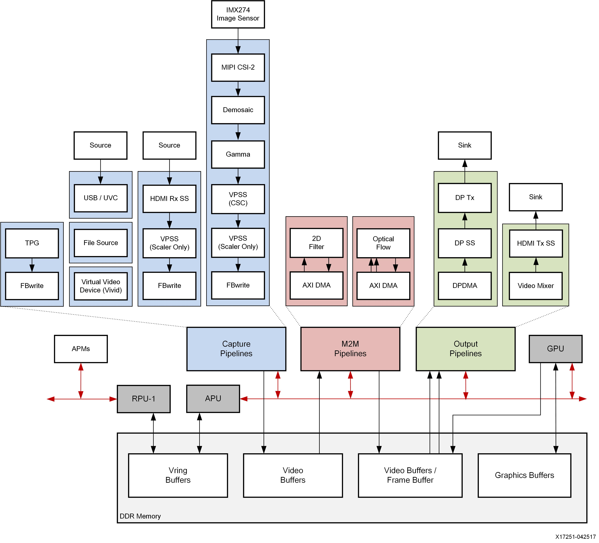

`zcu106`的`vcu_trd`有2022.2版本的, 至少需要在开发板先跑起来再简化.

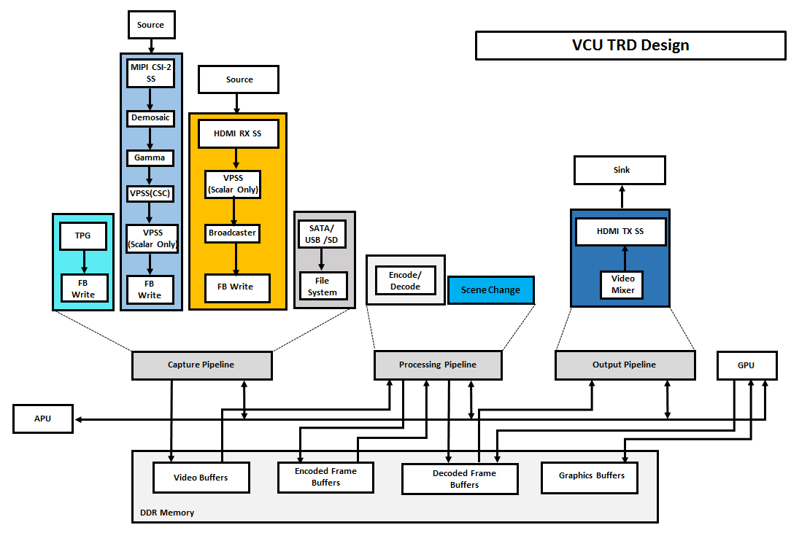


从`rdf0421-zcu102-base-trd-2020-1/petalinux/bsp`复制和添加文件和文件夹, 主要是

`project-spec/configs/rootfs_config`

```bash
CONFIG_openssh-sftp-server=y
CONFIG_imageclass-populate-sdk-qt5=y
CONFIG_packagegroup-trd=y
```

`project-spec/meta-user/conf/user-rootfsconfig`

```bash
CONFIG_packagegroup-trd
```


`project-spec/meta-user/recipes-kernel/linux/linux-xlnx/bsp.cfg`

`project-spec/meta-user/recipes-apps`

报错

```bash
$ petalinux-build
[INFO] Sourcing buildtools
[INFO] Building project
[INFO] Sourcing build environment
[INFO] Generating workspace directory
INFO: bitbake petalinux-image-minimal
NOTE: Started PRServer with DBfile: /home/andy/workdir/zirui/04_hdmi_tx/hdmi_tx_peta/petalinux/build/cache/prserv.sqlite3, Address: 127.0.0.1:43417, PID: 1633412
WARNING: Host distribution "ubuntu-22.04" has not been validated with this version of the build system; you may possibly experience unexpected failures. It is recommended that you use a tested distribution.
Loading cache: 100% |###############################################################################################################################################################################| Time: 0:00:00
Loaded 6355 entries from dependency cache.
Parsing recipes: 100% |#############################################################################################################################################################################| Time: 0:00:03
Parsing of 4466 .bb files complete (4373 cached, 93 parsed). 6502 targets, 577 skipped, 1 masked, 0 errors.
NOTE: Resolving any missing task queue dependencies
ERROR: Nothing RPROVIDES 'packagegroup-trd' (but /home/andy/workdir/zirui/04_hdmi_tx/hdmi_tx_peta/petalinux/components/yocto/layers/meta-petalinux/recipes-core/images/petalinux-image-minimal.bb RDEPENDS on or otherwise requires it)
NOTE: Runtime target 'packagegroup-trd' is unbuildable, removing...
Missing or unbuildable dependency chain was: ['packagegroup-trd']
NOTE: Runtime target 'kernel-modules' is unbuildable, removing...
Missing or unbuildable dependency chain was: ['kernel-modules', 'petalinux-image-minimal', 'packagegroup-trd']
ERROR: Required build target 'petalinux-image-minimal' has no buildable providers.
Missing or unbuildable dependency chain was: ['petalinux-image-minimal', 'packagegroup-trd']


```

`packagegroup-trd`没有了. 很可能是在`components/yocto`定义的, 而本机对于`base_trd`工程的`petalinux-config --silentconfig`这一步失败, 所以没法查看

解决办法, 在`ubuntu18.04`的虚拟机里安装2020.1版本的`petalinux`再导入

```bash
petalinux-config --silentconfig
INFO: sourcing build tools
[INFO] generating Kconfig for project
[INFO] silentconfig project
[INFO] extracting yocto SDK to components/yocto
[INFO] sourcing build environment
[INFO] generating kconfig for Rootfs
[INFO] silentconfig rootfs
[INFO] generating plnxtool conf
[INFO] generating user layers
[INFO] generating workspace directory
[INFO] successfully configured project

```

就导入成功了

接下来就可以搜索借鉴配置和dt描述了, 主要就是在`project-spec` 和 `components` 目录. 例如

`grep -R "packagegroup"`

```bash
project-spec/meta-user/recipes-core/packagegroups/packagegroup-trd.bb:inherit packagegroup
project-spec/meta-user/recipes-core/packagegroups/packagegroup-trd.bb:	packagegroup-core-tools-debug \
project-spec/meta-user/recipes-core/packagegroups/packagegroup-trd.bb:	packagegroup-petalinux-display-debug \
project-spec/meta-user/recipes-core/packagegroups/packagegroup-trd.bb:	packagegroup-petalinux-gstreamer \
project-spec/meta-user/recipes-core/packagegroups/packagegroup-trd.bb:	packagegroup-petalinux-openamp \
project-spec/meta-user/recipes-core/packagegroups/packagegroup-trd.bb:	packagegroup-petalinux-opencv \
project-spec/meta-user/recipes-core/packagegroups/packagegroup-trd.bb:	packagegroup-petalinux-qt \
project-spec/meta-user/recipes-core/packagegroups/packagegroup-trd.bb:	packagegroup-petalinux-v4lutils \
project-spec/meta-user/recipes-core/packagegroups/packagegroup-trd.bb:	packagegroup-petalinux-x11 \
```

其实在这定义的

然后

搜一下：

```bash
grep -R "_append" project-spec/meta-user
grep -R "_prepend" project-spec/meta-user
```

凡是看到：

```bash
xxx_append
xxx_prepend
```

**在新 `bitbake` 里都应该改成：**

```bash
xxx:append
xxx:prepend
```

这样才能迁移成功不报错


## `modetest`检测不到设备

| git commit | xsa md5 | comment |
| ---------- | ------- | ------- |
| c0456202   |         |pll用aresetn复位|


其实还是没有显示, `startx`也没有成功

```bash
root@petalinux:~# modetest       
trying to open device 'i915'...failed
trying to open device 'amdgpu'...failed
trying to open device 'radeon'...failed
trying to open device 'nouveau'...failed
trying to open device 'vmwgfx'...failed
trying to open device 'omapdrm'...failed
trying to open device 'exynos'...failed
trying to open device 'tilcdc'...failed
trying to open device 'msm'...failed
trying to open device 'sti'...failed
trying to open device 'tegra'...failed
trying to open device 'imx-drm'...failed
trying to open device 'rockchip'...failed
trying to open device 'atmel-hlcdc'...failed
trying to open device 'fsl-dcu-drm'...failed
trying to open device 'vc4'...failed
trying to open device 'virtio_gpu'...failed
trying to open device 'mediatek'...failed
trying to open device 'meson'...failed
trying to open device 'pl111'...failed
trying to open device 'stm'...failed
trying to open device 'sun4i-drm'...failed
trying to open device 'armada-drm'...failed
trying to open device 'komeda'...failed
trying to open device 'imx-dcss'...failed
trying to open device 'mxsfb-drm'...failed
no device found
```

`ls /dev/dri`为空

其他

```bash
modetest -M xlnx
modetest -D b00c0000.v_mix

ls -l /dev/dri
dmesg | grep -i drm
dmesg | grep -i xilinx
dmesg | grep -i mix
ls /sys/bus/platform/devices | grep v_mix
ls /sys/bus/platform/devices | grep v

TRD 默认 alias 里就有
alias modetest-hdmi='modetest -D b00c0000.v_mix'

```


```bash
root@petalinux:~# zcat /proc/config.gz | grep DRM_XLNX
CONFIG_DRM_XLNX=y
CONFIG_DRM_XLNX_BRIDGE=y
CONFIG_DRM_XLNX_BRIDGE_DEBUG_FS=y
CONFIG_DRM_XLNX_DPTX=y
CONFIG_DRM_XLNX_DSI=y
CONFIG_DRM_XLNX_HDMITX=y
CONFIG_DRM_XLNX_MIXER=y
CONFIG_DRM_XLNX_PL_DISP=y
CONFIG_DRM_XLNX_SDI=y
CONFIG_DRM_XLNX_BRIDGE_CSC=y
CONFIG_DRM_XLNX_BRIDGE_SCALER=y
CONFIG_DRM_XLNX_BRIDGE_VTC=y
root@petalinux:~# ls /sys/bus/platform/devices | grep v
80080000.v_demosaic
80090000.v_gamma_lut
800a0000.v_tpg
800c0000.v_proc_ss
80100000.v_frmbuf_rd
80110000.v_frmbuf_wr
80120000.v_hdmi_tx_ss
80140000.vid_phy_controller
firmware:zynqmp-firmware:nvmem_firmware
```

接下来咋办? 

再试试加一个 v_mix, `trd`工程里都是这样. 原因如下

在`Xilinx DRM`架构里

```bash
v_mix   		= CRTC / Plane / Primary display, 显示核心（没有它就没显示设备）
v_hdmi_tx_ss  	= Display Encoder
vid_phy 		= PHY
```


***

## 添加一个 v_mix

| git commit | xsa md5                          |
| ---------- | -------------------------------- |
| 620d919a   | 0b7d84be9839665e779817b3c02c6574 |

[620d919a/system.pdf](620d919a/system.pdf)

[620d919a/mipi_csi2_rx.pdf](620d919a/mipi_csi2_rx.pdf)

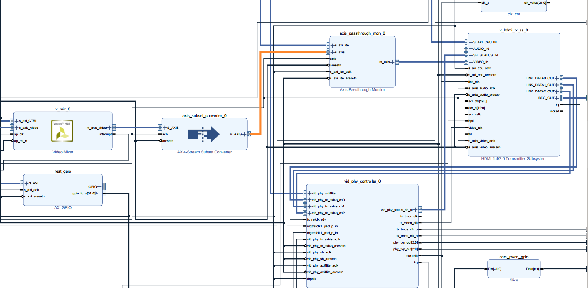

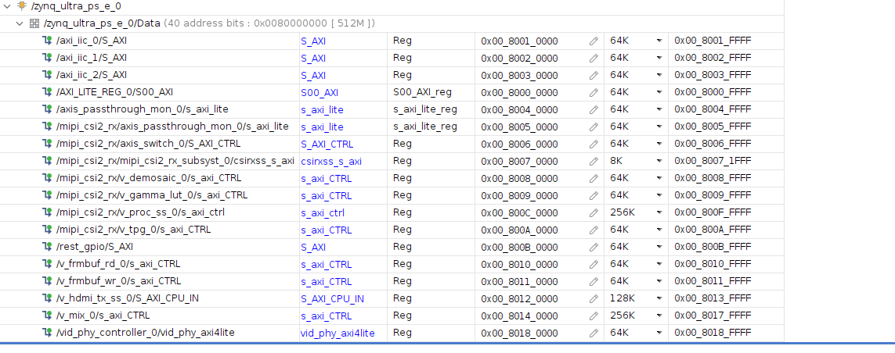

```bash
petalinux-config --silentconfig --get-hw-description=../hardware/
```

修改好`device-tree`和内核`boot`参数

```bash
petalinux-build
petalinux-package --boot --u-boot --fpga --force
```

这次启动之后

```bash
root@petalinux:~# dmesg | grep xlnx-drm
[   13.224122] xlnx-drm-hdmi 80120000.v_hdmi_tx_ss: probe started
[   13.230028] xlnx-drm-hdmi 80120000.v_hdmi_tx_ss: hdmi tx audio disabled in DT
[   13.245027] xlnx-drm-hdmi 80120000.v_hdmi_tx_ss: probe successful
[   13.280032] xlnx-drm xlnx-drm.0: bound 80140000.v_mix (ops 0xffff800008e68fd0)
[   13.287309] xlnx-drm xlnx-drm.0: bound 80120000.v_hdmi_tx_ss (ops xlnx_drm_hdmi_component_ops [xilinx_hdmi_tx])
root@petalinux:~# ls /dev/dri
by-path  card0
root@petalinux:~# modetest -D 80140000.v_mix 45:3840x2160-60@BG24
trying to open device 'i915'...done
Encoders:
id      crtc    type    possible crtcs  possible clones
37      0       TMDS    0x00000001      0x00000001

Connectors:
id      encoder status          name            size (mm)       modes   encoders
38      0       connected       HDMI-A-1        480x270         28      37
  modes:
        index name refresh (Hz) hdisp hss hse htot vdisp vss vse vtot
  #0 3840x2160 59.85 3840 3888 3920 4010 2160 2163 2168 2222 533250 flags: phsync, pvsync; type: preferred, driver
  #1 3840x2160 60.00 3840 4016 4104 4400 2160 2168 2178 2250 594000 flags: phsync, pvsync; type: driver
  #2 3840x2160 59.94 3840 4016 4104 4400 2160 2168 2178 2250 593407 flags: phsync, pvsync; type: driver
  #3 3840x2160 30.00 3840 4016 4104 4400 2160 2168 2178 2250 297000 flags: phsync, pvsync; type: driver
  #4 3840x2160 29.97 3840 4016 4104 4400 2160 2168 2178 2250 296703 flags: phsync, pvsync; type: driver
  #5 3840x2160 29.98 3840 3888 3920 4000 2160 2163 2168 2191 262750 flags: phsync, nvsync; type: driver
  #6 2560x1440 59.95 2560 2608 2640 2720 1440 1443 1448 1481 241500 flags: phsync, nvsync; type: driver
  #7 1920x1080 60.00 1920 2008 2052 2200 1080 1084 1089 1125 148500 flags: phsync, nvsync; type: driver
  #8 1920x1080 60.00 1920 2008 2052 2200 1080 1084 1089 1125 148500 flags: phsync, pvsync; type: driver
  #9 1920x1080 59.94 1920 2008 2052 2200 1080 1084 1089 1125 148352 flags: phsync, pvsync; type: driver
  #10 1920x1080 50.00 1920 2448 2492 2640 1080 1084 1089 1125 148500 flags: phsync, pvsync; type: driver
  #11 1680x1050 59.88 1680 1728 1760 1840 1050 1053 1059 1080 119000 flags: phsync, nvsync; type: driver
  #12 1600x900 60.00 1600 1624 1704 1800 900 901 904 1000 108000 flags: phsync, pvsync; type: driver
  #13 1280x1024 60.02 1280 1328 1440 1688 1024 1025 1028 1066 108000 flags: phsync, pvsync; type: driver
  #14 1440x900 59.90 1440 1488 1520 1600 900 903 909 926 88750 flags: phsync, nvsync; type: driver
  #15 1280x960 60.00 1280 1376 1488 1800 960 961 964 1000 108000 flags: phsync, pvsync; type: driver
  #16 1366x768 59.79 1366 1436 1579 1792 768 771 774 798 85500 flags: phsync, pvsync; type: driver
  #17 1280x800 59.91 1280 1328 1360 1440 800 803 809 823 71000 flags: phsync, nvsync; type: driver
  #18 1280x720 60.00 1280 1390 1430 1650 720 725 730 750 74250 flags: phsync, pvsync; type: driver
  #19 1280x720 59.94 1280 1390 1430 1650 720 725 730 750 74176 flags: phsync, pvsync; type: driver
  #20 1280x720 50.00 1280 1720 1760 1980 720 725 730 750 74250 flags: phsync, pvsync; type: driver
  #21 1024x768 60.00 1024 1048 1184 1344 768 771 777 806 65000 flags: nhsync, nvsync; type: driver
  #22 800x600 60.32 800 840 968 1056 600 601 605 628 40000 flags: phsync, pvsync; type: driver
  #23 720x576 50.00 720 732 796 864 576 581 586 625 27000 flags: nhsync, nvsync; type: driver
  #24 720x480 60.00 720 736 798 858 480 489 495 525 27027 flags: nhsync, nvsync; type: driver
  #25 720x480 59.94 720 736 798 858 480 489 495 525 27000 flags: nhsync, nvsync; type: driver
  #26 640x480 60.00 640 656 752 800 480 490 492 525 25200 flags: nhsync, nvsync; type: driver
  #27 640x480 59.94 640 656 752 800 480 490 492 525 25175 flags: nhsync, nvsync; type: driver
  props:
        1 EDID:
                flags: immutable blob
                blobs:

                value:
                        00ffffffffffff00212b010031303030
                        1f18010380301b782aa220a656489a24
                        12505421080081c0814081809500b300
                        a9c0810001014dd000aaf0703e803020
                        3500dd0c1100001e023a801871382d40
                        582c4500dd0c1100001a000000fc004d
                        585830380a20202020202020000000ff
                        004150574232484130323533303001d3
                        020328b14b9004031f13011202115f61
                        6b030c001000883c2000200167d85dc4
                        01788003e30f0006a36600a0f0701f80
                        302035000f282100001a662156aa5100
                        1e30468f33000f282100001e565e00a0
                        a0a02950302035000f282100001a0000
                        00000000000000000000000000000000
                        000000000000000000000000000000fe
        2 DPMS:
                flags: enum
                enums: On=0 Standby=1 Suspend=2 Off=3
                value: 3
        5 link-status:
                flags: enum
                enums: Good=0 Bad=1
                value: 0
        6 non-desktop:
                flags: immutable range
                values: 0 1
                value: 0
        4 TILE:
                flags: immutable blob
                blobs:

                value:
        8 GEN_HDR_OUTPUT_METADATA:
                flags: blob
                blobs:

                value:
        39 colorspace:
                flags: range
                values: 0 12
                value: 0
        40 ycbcr_enc:
                flags: range
                values: 0 8
                value: 0
        41 xfer_func:
                flags: range
                values: 0 7
                value: 0
        42 quantization:
                flags: range
                values: 0 2
                value: 0
        43 height_out:
                flags: range
                values: 480 2160
                value: 0
        44 width_out:
                flags: range
                values: 640 4096
                value: 0
        45 in_fmt:
                flags: range
                values: 4106 8448
                value: 0
        46 out_fmt:
                flags: range
                values: 4106 8448
                value: 0
        47 aspect_ratio:
                flags: range
                values: 0 3
                value: 0

CRTCs:
id      fb      pos     size
36      0       (0,0)   (0x0)
  #0  nan 0 0 0 0 0 0 0 0 0 flags: ; type: 
  props:
        25 VRR_ENABLED:
                flags: range
                values: 0 1
                value: 0

Planes:
id      crtc    fb      CRTC x,y        x,y     gamma size      possible crtcs
34      0       0       0,0             0,0     0               0x00000001
  formats: RG24
  props:
        9 type:
                flags: immutable enum
                enums: Overlay=0 Primary=1 Cursor=2
                value: 2
        32 scale:
                flags: range
                values: 0 2
                value: 4294934528
        33 alpha:
                flags: range
                values: 0 256
                value: 4294901768
35      0       0       0,0             0,0     0               0x00000001
  formats: BG24
  props:
        9 type:
                flags: immutable enum
                enums: Overlay=0 Primary=1 Cursor=2
                value: 1

Frame buffers:
id      size    pitch

root@petalinux:~# modetest -M xlnx -p
CRTCs:
id      fb      pos     size
36      0       (0,0)   (3840x2160)
  #0 3840x2160 60.00 3840 4016 4104 4400 2160 2168 2178 2250 594000 flags: phsync, pvsync; type: driver
  props:
        25 VRR_ENABLED:
                flags: range
                values: 0 1
                value: 0

Planes:
id      crtc    fb      CRTC x,y        x,y     gamma size      possible crtcs
34      0       0       0,0             0,0     0               0x00000001
  formats: RG24
  props:
        9 type:
                flags: immutable enum
                enums: Overlay=0 Primary=1 Cursor=2
                value: 2
        32 scale:
                flags: range
                values: 0 2
                value: 4294934528
        33 alpha:
                flags: range
                values: 0 256
                value: 4294901768
35      0       0       0,0             0,0     0               0x00000001
  formats: BG24
  props:
        9 type:
                flags: immutable enum
                enums: Overlay=0 Primary=1 Cursor=2
                value: 1

```

### 查看显示能力的命令

```bash
modetest -M xlnx
modetest -M xlnx -p

如果知道v_mix的axi空间地址, 例如 0x80140000
modetest -D 80140000.v_mix  == modetest -M xlnx
```

主要是为了获得 `connect` 号, `crtc` 号 和 `plane`号, 以及支持的`modes`用于命令

比如下面的 `-s 41@39`的意思是 `connector_id@crtc_id`, `-P 38@39`的意思是`-P plane_id@crtc_id`

```bash
modetest -M xlnx -s 41@39:1920x1080-60 -P 38@39:1920x1080@BG24
modetest -D 80140000.v_mix -s 41@39:1920x1080-60 -P 38@39:1920x1080@BG24
```

### `modtest`参数

```bash
root@petalinux:~# modetest --help
usage: modetest [-acDdefMPpsCvrw]

 Query options:

        -c      list connectors
        -e      list encoders
        -f      list framebuffers
        -p      list CRTCs and planes (pipes)

 Test options:

        -P <plane_id>@<crtc_id>:<w>x<h>[+<x>+<y>][*<scale>][@<format>]  set a plane
        -s <connector_id>[,<connector_id>][@<crtc_id>]:[#<mode index>]<mode>[-<vrefresh>][@<format>]    set a mode
        -C      test hw cursor
        -v      test vsynced page flipping
        -r      set the preferred mode for all connectors
        -w <obj_id>:<prop_name>:<value> set property
        -a      use atomic API
        -F pattern1,pattern2    specify fill patterns

 Generic options:

        -d      drop master after mode set
        -M module       use the given driver
        -D device       use the given device

        Default is to dump all info.

```


没弄明白之前尝试了下面命令

```bash
modetest -M xlnx -s 30@28:1920x1080-60@YUYV
modetest -D 80140000.v_mix 45:3840x2160-60@BG24
modetest -M xlnx -s 30@28:1920x1080-60@YUYV
modetest -D 80140000.v_mix
modetest -D 80140000.v_mix 45:3840x2160-60@BG24
```

到这里`hdmi`接口是没有显示的


### 显示彩条

```bash
root@petalinux:~# modetest -M xlnx -s 38@36:3840x2160-60@BG24
setting mode 3840x2160-60.00Hz on connectors 38, crtc 36
[  237.248704] idt8t49n24x 1-007c: idt24x_set_rate. calling idt24x_set_frequency for Q2. rate: 148500000
```
结束彩条后显示纯色blue

```bash
root@petalinux:~# modetest -M xlnx -s 38@36:1920x1080-60@BG24
setting mode 1920x1080-60.00Hz on connectors 38, crtc 36
^C
root@petalinux:~# modetest -M xlnx -s 38@36:3840x2160-60@BG24
setting mode 3840x2160-60.00Hz on connectors 38, crtc 3
```
显示彩条

再次运行modetest -M xlnx -s 38@36:3840x2160-60@BG24之类命令会显示不规则彩条, ctrl+c结束命令之后显示纯蓝
```bash
modetest -M xlnx \
  -s 38@36:1920x1080-60@BG24 \
  -P 31@36:1920x1080+0+0@BG24
```

`startx`也报错没成功

```bash
root@petalinux:~# cat /var/log/Xorg.0.log | grep -E "(EE|drm|kms|plane)"
        (WW) warning, (EE) error, (NI) not implemented, (??) unknown.
[   972.361] (II) xfree86: Adding drm device (/dev/dri/card0)
[   972.361]    falling back to /sys/devices/platform/amba_pl@0/80140000.v_mix/drm/card0
[   972.362] (EE) Failed to load module "glx" (module does not exist, 0)
[   972.647] (EE) ARMSOC(0): ERROR: drm failed to set mode: Invalid argument
[   972.647] (EE) ARMSOC(0): ERROR: xf86SetDesiredModes() failed!
[   972.647] (EE) ARMSOC(0): ERROR: ARMSOCEnterVT() failed!
[   972.651] (EE) 
[   972.651] (EE) AddScreen/ScreenInit failed for driver 0
[   972.651] (EE) 
[   972.651] (EE) 
[   972.651] (EE) Please also check the log file at "/var/log/Xorg.0.log" for additional information.
[   972.651] (EE) 
[   972.903] (EE) Server terminated with error (1). Closing log file.
```


尝试用GStreamer输出彩条之类的图案


```bash
root@petalinux:~# gst-launch-1.0 \
>   videotestsrc pattern=smpte \
>   ! video/x-raw,format=BGRx,width=1920,height=1080,framerate=60/1 \
>   ! videoconvert \
>   ! kmssink driver-name=xlnx sync=false
Setting pipeline to PAUSED ...
Pipeline is PREROLLING ...
[ 1350.116394] [drm:xlnx_mix_plane_atomic_update] *ERROR* failed to mode-set a plane
Pipeline is PREROLLED ...
Setting pipeline to PLAYING ...
New clock: GstSystemClock
[ 1350.143330] [drm:xlnx_mix_plane_atomic_update] *ERROR* failed to mode-set a plane
[ 1350.211866] [drm:xlnx_mix_plane_atomic_update] *ERROR* failed to mode-set a plane
[ 1350.278506] [drm:xlnx_mix_plane_atomic_update] *ERROR* failed to mode-set a plane
[ 1350.345143] [drm:xlnx_mix_plane_atomic_update] *ERROR* failed to mode-set a plane
```
我的`v_mix_0`是设置成0个`overlay layers`的, 很可能是这个原因导致的

***


## 给`v_mix`添加一个`overlay layer`


| git commit | xsa md5                          |
| ---------- | -------------------------------- |
| 03076f8c   | 84661bbbe009421a1a8ec931f36c0057 |

[03076f8c/system.pdf](03076f8c/system.pdf)

[03076f8c/mipi_csi2_rx.pdf](03076f8c/mipi_csi2_rx.pdf)

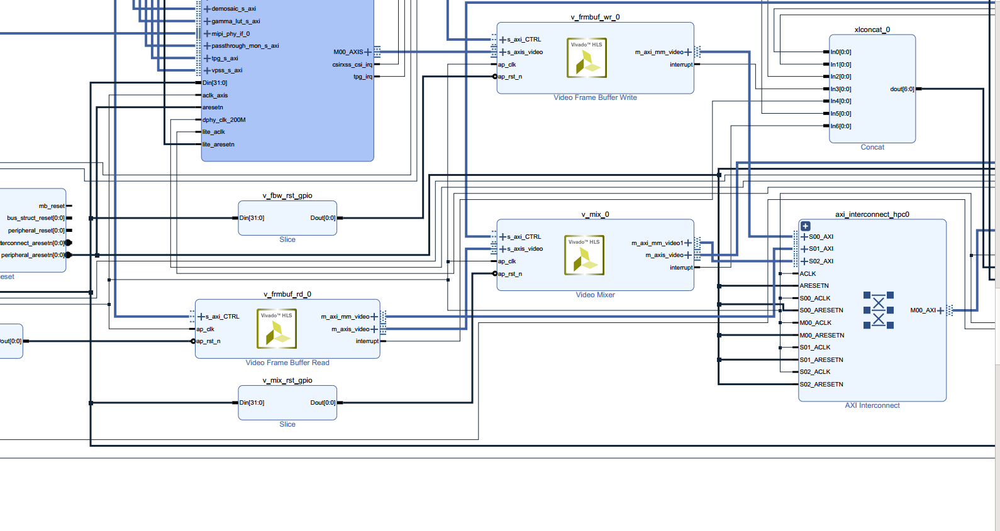

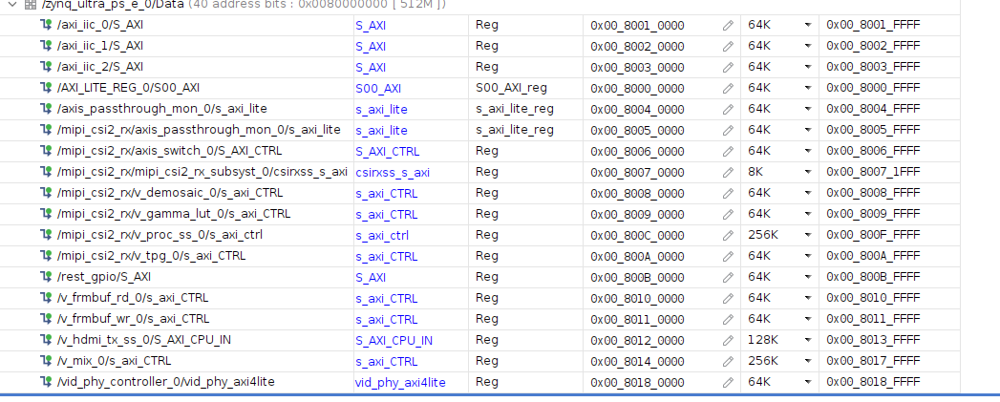

避免报错, 在`vivado`的`bd`中添加之后

```tcl
reset_run synth_1
launch_runs synth_1 -jobs 8
```

确认添加成功

```bash
root@petalinux:~# modetest -M xlnx -p
CRTCs:
id      fb      pos     size
36      0       (0,0)   (0x0)
  #0  nan 0 0 0 0 0 0 0 0 0 flags: ; type: 
  props:
        25 VRR_ENABLED:
                flags: range
                values: 0 1
                value: 0

Planes:
id      crtc    fb      CRTC x,y        x,y     gamma size      possible crtcs
34      0       0       0,0             0,0     0               0x00000001
  formats: NV12
  props:
        9 type:
                flags: immutable enum
                enums: Overlay=0 Primary=1 Cursor=2
                value: 0
35      0       0       0,0             0,0     0               0x00000001
  formats: BG24
  props:
        9 type:
                flags: immutable enum
                enums: Overlay=0 Primary=1 Cursor=2
                value: 1

root@petalinux:~# modetest -M xlnx -s 38@36:3840x2160-60@BG24
setting mode 3840x2160-60.00Hz on connectors 38, crtc 36
[  292.962548] idt8t49n24x 1-007c: idt24x_set_rate. calling idt24x_set_frequency for Q2. rate: 148500000
^C
root@petalinux:~# modetest -M xlnx -p
CRTCs:
id      fb      pos     size
36      0       (0,0)   (3840x2160)
  #0 3840x2160 60.00 3840 4016 4104 4400 2160 2168 2178 2250 594000 flags: phsync, pvsync; type: driver
  props:
        25 VRR_ENABLED:
                flags: range
                values: 0 1
                value: 0

Planes:
id      crtc    fb      CRTC x,y        x,y     gamma size      possible crtcs
34      0       0       0,0             0,0     0               0x00000001
  formats: NV12
  props:
        9 type:
                flags: immutable enum
                enums: Overlay=0 Primary=1 Cursor=2
                value: 0
35      0       0       0,0             0,0     0               0x00000001
  formats: BG24
  props:
        9 type:
                flags: immutable enum
                enums: Overlay=0 Primary=1 Cursor=2
                value: 1

```

`modetest`和`GStreamer`输出彩条之类的图案, 成功

```bash
modetest -M xlnx -s 38@36:3840x2160-60@BG24

gst-launch-1.0 \
  videotestsrc pattern=snow \
  ! video/x-raw,format=BGRx,width=3840,height=2160,framerate=60/1 \
  ! videoconvert \
  ! kmssink driver-name=xlnx sync=false
```


### 用`GStreamer`输出彩条图案常用命令

```
gst-launch-1.0 \
  videotestsrc pattern=smpte \
  ! video/x-raw,format=BGRx,width=1920,height=1080,framerate=60/1 \
  ! videoconvert \
  ! kmssink driver-name=xlnx sync=false
  
gst-launch-1.0 \
  videotestsrc pattern=smpte \
  ! video/x-raw,format=BGRx,width=3840,height=2160,framerate=30/1 \
  ! videoconvert \
  ! kmssink driver-name=xlnx sync=false
  
gst-launch-1.0 \
  videotestsrc pattern=smpte \
  ! video/x-raw,format=BGRx,width=3840,height=2160,framerate=60/1 \
  ! videoconvert \
  ! kmssink driver-name=xlnx sync=false
  
gst-launch-1.0 \
  videotestsrc pattern=gradient \
  ! video/x-raw,format=BGRx,width=3840,height=2160,framerate=60/1 \
  ! videoconvert \
  ! kmssink driver-name=xlnx sync=false
 
```


#### Gstreamer Pattern

| pattern 名称        | 描述               |
| ------------------- | ------------------ |
| `smpte`             | 标准 SMPTE 彩条    |
| `snow`              | 雪花噪声（白噪声） |
| `black`             | 全黑画面           |
| `white`             | 全白画面           |
| `red`               | 红色填充           |
| `green`             | 绿色填充           |
| `blue`              | 蓝色填充           |
| `checkers-1`        | 黑白棋盘格         |
| `checkers-2`        | 彩色棋盘格         |
| `checkers-4`        | 4x4 彩色格         |
| `checkers-8`        | 8x8 彩色格         |
| `circular`          | 圆形渐变           |
| `blink`             | 黑白闪烁（交替）   |
| `gradient`          | 灰度渐变           |
| `ball`              | 滚动小球动画       |
| `pinwheel`          | 风车动画           |
| `zone-plate`        | 高频变化条纹       |
| `gamut`             | 色域测试图         |
| `chroma-zone-plate` | 彩色高频条纹       |


### `startx`依然失败

```bash
(EE) ARMSOC(0): ERROR: drm failed to set mode: Invalid argument
(EE) ARMSOC(0): ERROR: xf86SetDesiredModes() failed!

```

`X11` 要求 `KMS` 创建一个`primary plane + framebuffer`的组合, 但` xlnx-drm` 驱动没法满足它

**当前 DRM 资源结构**

```bash
Planes:
plane-0: NV12   type = Overlay
plane-1: BG24   type = Primary
```


### `tpg`显示没有成功

现在路径准备如下, 
```bash
[TPG] ---> [axis_switch] ---+
                             \
                              -> [v_framebuf_wr] -> PS DDR -> [v_framebuf_rd] -> [v_mix] -> HDMI
[CSI2-RX] -> [axis_switch] -/                                            PS DDR -/
```
现在`modetest -M xlnx -s 38@36:3840x2160-60@BG24`之后, 恢复蓝色背景显示之后

可以执行gst命令并显示在hdmi显示器上

```  bash
 gst-launch-1.0 \
  videotestsrc pattern=smpte \
  ! video/x-raw,format=BGRx,width=3840,height=2160,framerate=30/1 \
  ! videoconvert \
  ! kmssink driver-name=xlnx sync=false
```

后台执行`modetest -M xlnx -s 38@36:3840x2160-60@BG24&`, `cat /sys/kernel/debug/dri/0/state`才有`paddr`, 蓝屏状态没有

tpg_to_hdmi.sh
```bash
#!/bin/sh

# ===============================
# Base addresses
# ===============================
AXIS_SW=0x80060000
TPG=0x800A0000
FBWR=0x80110000

# DRM framebuffer physical address (from /sys/kernel/debug/dri/0/state)
FBADDR=0x37800000

# ===============================
# Stop everything first
# ===============================
echo "Stop TPG"
devmem $TPG 32 0

echo "Stop FBWR"
devmem $FBWR 32 0

# ===============================
# Configure TPG
# ===============================
echo "Configure TPG"

# height
devmem 0x800A0010 32 2160
# width
devmem 0x800A0018 32 3840
# pattern = color bars
devmem 0x800A0020 32 2
# color format = BGR
devmem 0x800A0028 32 2

# ===============================
# AXIS switch: select TPG (S1) -> M0
# ===============================
echo "Configure AXIS switch"

# M0 select S1
devmem 0x80060040 32 1
# enable switch
devmem 0x80060000 32 2

# ===============================
# Configure Framebuffer Writer
# ===============================
echo "Configure FBWR"

# buffer address
devmem 0x80110010 32 $((FBADDR))

# stride (bytes)
devmem 0x80110018 32 11520

# width
devmem 0x80110020 32 3840

# height
devmem 0x80110028 32 2160

# format BG24 (decimal value of 0x34324742)
devmem 0x80110030 32 875713346

# ===============================
# Start pipeline
# ===============================
#echo "Start FBWR"
#devmem 0x80110000 32 1
echo "Start FBWR (auto-restart)"
devmem 0x80110000 32 129   # 0x81 = ap_start | auto_restart

echo "Start TPG (auto-restart)"
devmem 0x800A0000 32 129   # 0x81 = ap_start | auto_restart

echo "Done."
```

运行脚本没有报错

```
root@petalinux:~# modetest -M xlnx -s 38@36:3840x2160-60@BG24&
root@petalinux:~# cat /sys/kernel/debug/dri/0/state | grep paddr
                                paddr=0x0000000037800000
root@petalinux:~# sh tpg_to_hdmi.sh 
Stop TPG
Stop FBWR
Configure TPG
Configure AXIS switch
Configure FBWR
Start FBWR
Start TPG (auto-restart)
Done.
```


但是没有显示tpg的图案,只是保持了modetest的图案

```shell
root@petalinux:~# devmem 0x80110000
0x0000000E
root@petalinux:~# devmem 0x80110000
0x00000004
root@petalinux:~# devmem 0x80110000
0x00000004
root@petalinux:~# devmem 0x800A0000                                                                                                                                                                                
0x0000008B
root@petalinux:~# devmem 0x800A0000
0x00000081
root@petalinux:~# devmem 0x800A0000
0x00000081
root@petalinux:~# devmem 0x800A0000
0x00000081
```

没有 timing，`FBWR` 永远只会写一帧. `v_framebuf_wr` 必须在 **video-timed 模式** 下工作.

`VTC` 提供 **连续、稳定的 timing**

***

## 添加`vtc`

[跳转到问题解决方法](#section1)

### 路径1

参考`base_trd`, 也取消`axis_switch`

```
[VTC] -> [TPG] -> [v_framebuf_wr] -> PS DDR 
[CSI2-RX] -> [v_framebuf_wr] -> PS DDR    
                                                         
PS DDR -> [v_mix] -> HDMI
PS DDR -/

```

| git commit | xsa md5                          |
| ---------- | -------------------------------- |
| 24f27201   | d60a088d909a57e19c45656596ba5eb3 |

[system.pdf](24f27201/system.pdf)

[tpg_input.pdf](24f27201/tpg_input.pdf)

[hdmi_output.pdf](24f27201/hdmi_output.pdf)

[mipi_csi2_rx.pdf](24f27201/mipi_csi2_rx.pdf)

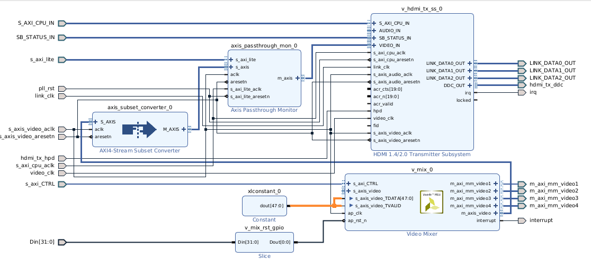

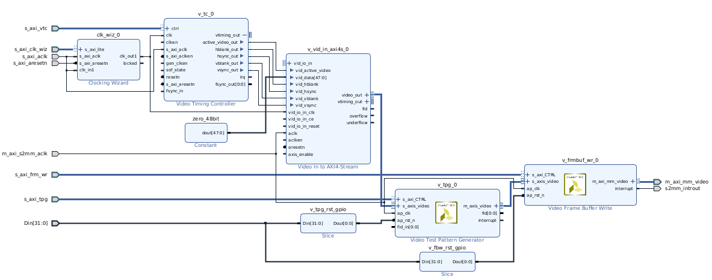

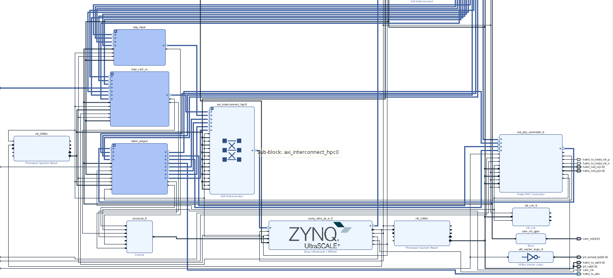

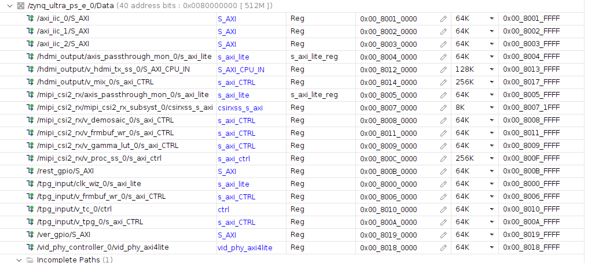

导入xsa, 编译测试

导入xsa硬件, 修改`project-spec/configs/config`, 修改`device-tree`排错

之后`fsbl-firmware`编译报错, 这样处理可以通过

```
petalinux-build -c fsbl-firmware -x do_clean
petalinux-build
```


### 路径2

修改路径如下, 这是参考了`vcu_trd`的

```bash
[VTC] -> [TPG] -> [v_framebuf_wr] -> PS DDR 
[CSI2-RX] -> [v_framebuf_wr] -> PS DDR    
                                                         
PS DDR -> [v_framebuf_rd] -> [v_mix] -> HDMI
                     PS DDR -/

```

| git commit | xsa md5hash                      |
| ---------- | -------------------------------- |
| 09b575e7   | eeff5e5cc68944db8a11f3e11f3d8a92 |

[system.pdf](09b575e7/system.pdf)

[tpg_input.pdf](09b575e7/tpg_input.pdf)

[hdmi_output.pdf](09b575e7/hdmi_output.pdf)	除了这里变化了其他没变

[mipi_csi2_rx.pdf](09b575e7/mipi_csi2_rx.pdf)

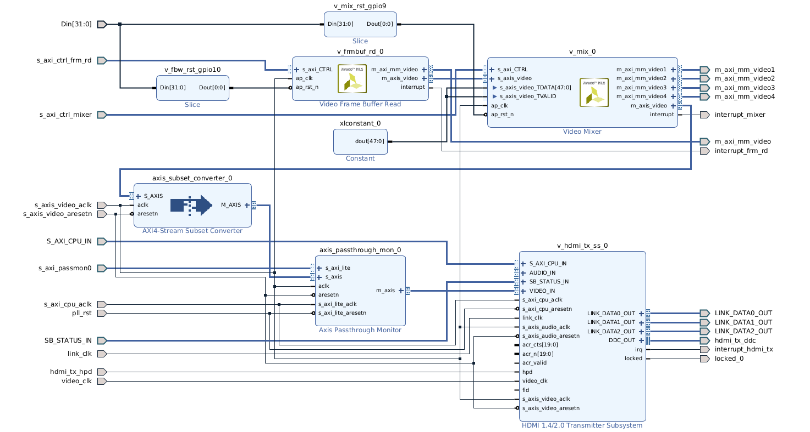

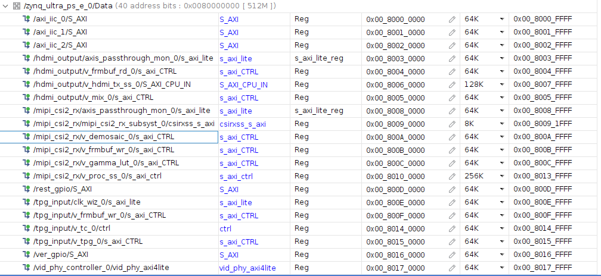


导入xsa硬件, 修改`project-spec/configs/config`, 修改`device-tree`排错

之后`fsbl-firmware`编译报错, 这样处理可以通过

```
petalinux-build -c fsbl-firmware -x do_clean
petalinux-build
```


查看

```
modetest -M xlnx -p
modetest -M xlnx
```

```bash
root@petalinux:~# modetest -M xlnx
Encoders:
id      crtc    type    possible crtcs  possible clones
40      0       TMDS    0x00000001      0x00000001

Connectors:
id      encoder status          name            size (mm)       modes   encoders
41      0       connected       HDMI-A-1        480x270         28      40
  modes:
        index name refresh (Hz) hdisp hss hse htot vdisp vss vse vtot
  #0 3840x2160 59.85 3840 3888 3920 4010 2160 2163 2168 2222 533250 flags: phsync, pvsync; type: preferred, driver
  #1 3840x2160 60.00 3840 4016 4104 4400 2160 2168 2178 2250 594000 flags: phsync, pvsync; type: driver
  #2 3840x2160 59.94 3840 4016 4104 4400 2160 2168 2178 2250 593407 flags: phsync, pvsync; type: driver
  #3 3840x2160 30.00 3840 4016 4104 4400 2160 2168 2178 2250 297000 flags: phsync, pvsync; type: driver
  #4 3840x2160 29.97 3840 4016 4104 4400 2160 2168 2178 2250 296703 flags: phsync, pvsync; type: driver
  #5 3840x2160 29.98 3840 3888 3920 4000 2160 2163 2168 2191 262750 flags: phsync, nvsync; type: driver
  #6 2560x1440 59.95 2560 2608 2640 2720 1440 1443 1448 1481 241500 flags: phsync, nvsync; type: driver
  #7 1920x1080 60.00 1920 2008 2052 2200 1080 1084 1089 1125 148500 flags: phsync, nvsync; type: driver
  #8 1920x1080 60.00 1920 2008 2052 2200 1080 1084 1089 1125 148500 flags: phsync, pvsync; type: driver
  #9 1920x1080 59.94 1920 2008 2052 2200 1080 1084 1089 1125 148352 flags: phsync, pvsync; type: driver
  #10 1920x1080 50.00 1920 2448 2492 2640 1080 1084 1089 1125 148500 flags: phsync, pvsync; type: driver
  #11 1680x1050 59.88 1680 1728 1760 1840 1050 1053 1059 1080 119000 flags: phsync, nvsync; type: driver
  #12 1600x900 60.00 1600 1624 1704 1800 900 901 904 1000 108000 flags: phsync, pvsync; type: driver
  #13 1280x1024 60.02 1280 1328 1440 1688 1024 1025 1028 1066 108000 flags: phsync, pvsync; type: driver
  #14 1440x900 59.90 1440 1488 1520 1600 900 903 909 926 88750 flags: phsync, nvsync; type: driver
  #15 1280x960 60.00 1280 1376 1488 1800 960 961 964 1000 108000 flags: phsync, pvsync; type: driver
  #16 1366x768 59.79 1366 1436 1579 1792 768 771 774 798 85500 flags: phsync, pvsync; type: driver
  #17 1280x800 59.91 1280 1328 1360 1440 800 803 809 823 71000 flags: phsync, nvsync; type: driver
  #18 1280x720 60.00 1280 1390 1430 1650 720 725 730 750 74250 flags: phsync, pvsync; type: driver
  #19 1280x720 59.94 1280 1390 1430 1650 720 725 730 750 74176 flags: phsync, pvsync; type: driver
  #20 1280x720 50.00 1280 1720 1760 1980 720 725 730 750 74250 flags: phsync, pvsync; type: driver
  #21 1024x768 60.00 1024 1048 1184 1344 768 771 777 806 65000 flags: nhsync, nvsync; type: driver
  #22 800x600 60.32 800 840 968 1056 600 601 605 628 40000 flags: phsync, pvsync; type: driver
  #23 720x576 50.00 720 732 796 864 576 581 586 625 27000 flags: nhsync, nvsync; type: driver
  #24 720x480 60.00 720 736 798 858 480 489 495 525 27027 flags: nhsync, nvsync; type: driver
  #25 720x480 59.94 720 736 798 858 480 489 495 525 27000 flags: nhsync, nvsync; type: driver
  #26 640x480 60.00 640 656 752 800 480 490 492 525 25200 flags: nhsync, nvsync; type: driver
  #27 640x480 59.94 640 656 752 800 480 490 492 525 25175 flags: nhsync, nvsync; type: driver
  props:
        1 EDID:
                flags: immutable blob
                blobs:

                value:
                        00ffffffffffff00212b010031303030
                        1f18010380301b782aa220a656489a24
                        12505421080081c0814081809500b300
                        a9c0810001014dd000aaf0703e803020
                        3500dd0c1100001e023a801871382d40
                        582c4500dd0c1100001a000000fc004d
                        585830380a20202020202020000000ff
                        004150574232484130323533303001d3
                        020328b14b9004031f13011202115f61
                        6b030c001000883c2000200167d85dc4
                        01788003e30f0006a36600a0f0701f80
                        302035000f282100001a662156aa5100
                        1e30468f33000f282100001e565e00a0
                        a0a02950302035000f282100001a0000
                        00000000000000000000000000000000
                        000000000000000000000000000000fe
        2 DPMS:
                flags: enum
                enums: On=0 Standby=1 Suspend=2 Off=3
                value: 3
        5 link-status:
                flags: enum
                enums: Good=0 Bad=1
                value: 0
        6 non-desktop:
                flags: immutable range
                values: 0 1
                value: 0
        4 TILE:
                flags: immutable blob
                blobs:

                value:
        8 GEN_HDR_OUTPUT_METADATA:
                flags: blob
                blobs:

                value:
        42 colorspace:
                flags: range
                values: 0 12
                value: 0
        43 ycbcr_enc:
                flags: range
                values: 0 8
                value: 0
        44 xfer_func:
                flags: range
                values: 0 7
                value: 0
        45 quantization:
                flags: range
                values: 0 2
                value: 0
        46 height_out:
                flags: range
                values: 480 2160
                value: 0
        47 width_out:
                flags: range
                values: 640 4096
                value: 0
        48 in_fmt:
                flags: range
                values: 4106 8448
                value: 0
        49 out_fmt:
                flags: range
                values: 4106 8448
                value: 0
        50 aspect_ratio:
                flags: range
                values: 0 3
                value: 0

CRTCs:
id      fb      pos     size
39      0       (0,0)   (0x0)
  #0  nan 0 0 0 0 0 0 0 0 0 flags: ; type: 
  props:
        25 VRR_ENABLED:
                flags: range
                values: 0 1
                value: 0

Planes:
id      crtc    fb      CRTC x,y        x,y     gamma size      possible crtcs
34      0       0       0,0             0,0     0               0x00000001
  formats: NV12
  props:
        9 type:
                flags: immutable enum
                enums: Overlay=0 Primary=1 Cursor=2
                value: 0
35      0       0       0,0             0,0     0               0x00000001
  formats: YUYV
  props:
        9 type:
                flags: immutable enum
                enums: Overlay=0 Primary=1 Cursor=2
                value: 0
36      0       0       0,0             0,0     0               0x00000001
  formats: UYVY
  props:
        9 type:
                flags: immutable enum
                enums: Overlay=0 Primary=1 Cursor=2
                value: 0
37      0       0       0,0             0,0     0               0x00000001
  formats: AB24
  props:
        9 type:
                flags: immutable enum
                enums: Overlay=0 Primary=1 Cursor=2
                value: 0
        33 alpha:
                flags: range
                values: 0 256
                value: 256
38      0       0       0,0             0,0     0               0x00000001
  formats: BG24
  props:
        9 type:
                flags: immutable enum
                enums: Overlay=0 Primary=1 Cursor=2
                value: 1

Frame buffers:
id      size    pitch


```

#### 确定会报错

```
root@petalinux:~# modetest -M xlnx -s 41@39:3840x2160-60@BG24
setting mode 3840x2160-60.00Hz on connectors 41, crtc 39

[  345.471850] [drm:drm_crtc_commit_wait] *ERROR* flip_done timed out
[  345.478050] [drm:drm_atomic_helper_wait_for_dependencies] *ERROR* [CRTC:39:crtc-0] commit wait timed out


[  355.711849] [drm:drm_crtc_commit_wait] *ERROR* flip_done timed out
[  355.718044] [drm:drm_atomic_helper_wait_for_dependencies] *ERROR* [CONNECTOR:41:HDMI-A-1] commit wait timed out
[  365.951860] [drm:drm_crtc_commit_wait] *ERROR* flip_done timed out
[  365.958045] [drm:drm_atomic_helper_wait_for_dependencies] *ERROR* [PLANE:38:plane-4] commit wait timed out
[  366.067853] ------------[ cut here ]------------
[  366.072464] [CRTC:39:crtc-0] vblank wait timed out
[  366.077285] WARNING: CPU: 3 PID: 798 at drivers/gpu/drm/drm_atomic_helper.c:1514 drm_atomic_helper_wait_for_vblanks.part.0+0x278/0x2a0
[  366.089365] Modules linked in: zocl(O) mali(O) xilinx_hdmi_tx(O) dp159(O) xilinx_vphy(O) uio_pdrv_genirq dmaproxy(O)
[  366.099896] CPU: 3 PID: 798 Comm: modetest Tainted: G        W  O      5.15.36-xilinx-v2022.2 #1
[  366.108669] Hardware name: xlnx,zynqmp (DT)
[  366.112836] pstate: 60000005 (nZCv daif -PAN -UAO -TCO -DIT -SSBS BTYPE=--)
[  366.119788] pc : drm_atomic_helper_wait_for_vblanks.part.0+0x278/0x2a0
[  366.126307] lr : drm_atomic_helper_wait_for_vblanks.part.0+0x278/0x2a0
[  366.132826] sp : ffff8000096839f0
[  366.136124] x29: ffff8000096839f0 x28: 000000000000000a x27: 0000000000000000
[  366.143250] x26: 0000000000000001 x25: 0000000000000038 x24: ffff000821d04800
[  366.150377] x23: 0000000000000001 x22: 0000000000000000 x21: ffff0008224dcf00
[  366.157503] x20: ffff00081f14c900 x19: 0000000000000000 x18: ffffffffffffffff
[  366.164629] x17: 0000000000000000 x16: 0000000000000000 x15: ffff800089683717
[  366.171755] x14: 0000000000000000 x13: ffff8000093c6128 x12: 00000000000006f6
[  366.178882] x11: 0000000000000252 x10: ffff8000093c6128 x9 : ffff8000093c6128
[  366.186008] x8 : 00000000fffff7ff x7 : ffff8000093f2128 x6 : 0000000000000001
[  366.193134] x5 : 0000000000000000 x4 : 0000000000000000 x3 : 0000000000000000
[  366.200260] x2 : 0000000000000000 x1 : 0000000000000000 x0 : ffff000821e48fc0
[  366.207387] Call trace:
[  366.209819]  drm_atomic_helper_wait_for_vblanks.part.0+0x278/0x2a0
[  366.215989]  drm_atomic_helper_commit_tail+0x80/0xa0
[  366.220945]  commit_tail+0x128/0x17c
[  366.224513]  drm_atomic_helper_commit+0x148/0x174
[  366.229209]  drm_atomic_commit+0x4c/0x60
[  366.233123]  drm_atomic_helper_set_config+0xa4/0x100
[  366.238079]  drm_mode_setcrtc+0x19c/0x670
[  366.242081]  drm_ioctl_kernel+0xc4/0x11c
[  366.245996]  drm_ioctl+0x214/0x44c
[  366.249390]  __arm64_sys_ioctl+0xb8/0xe0
[  366.253304]  invoke_syscall+0x54/0x124
[  366.257045]  el0_svc_common.constprop.0+0xd4/0xfc
[  366.261742]  do_el0_svc+0x48/0xb0
[  366.265048]  el0_svc+0x28/0x80
[  366.268095]  el0t_64_sync_handler+0xa4/0x130
[  366.272357]  el0t_64_sync+0x1a0/0x1a4
[  366.276011] ---[ end trace a5aedf667084ad22 ]---


[  376.447848] [drm:drm_crtc_commit_wait] *ERROR* flip_done timed out
[  376.454041] [drm:drm_atomic_helper_wait_for_dependencies] *ERROR* [CRTC:39:crtc-0] commit wait timed out
[  386.687849] [drm:drm_crtc_commit_wait] *ERROR* flip_done timed out
[  386.694046] [drm:drm_atomic_helper_wait_for_dependencies] *ERROR* [PLANE:38:plane-4] commit wait timed out
[  386.863846] ------------[ cut here ]------------
[  386.868459] [CRTC:39:crtc-0] vblank wait timed out
[  386.873283] WARNING: CPU: 3 PID: 202 at drivers/gpu/drm/drm_atomic_helper.c:1514 drm_atomic_helper_wait_for_vblanks.part.0+0x278/0x2a0
[  386.885361] Modules linked in: zocl(O) mali(O) xilinx_hdmi_tx(O) dp159(O) xilinx_vphy(O) uio_pdrv_genirq dmaproxy(O)
[  386.895891] CPU: 3 PID: 202 Comm: kworker/3:2 Tainted: G        W  O      5.15.36-xilinx-v2022.2 #1
[  386.904925] Hardware name: xlnx,zynqmp (DT)
[  386.909093] Workqueue: events drm_mode_rmfb_work_fn
[  386.913962] pstate: 60000005 (nZCv daif -PAN -UAO -TCO -DIT -SSBS BTYPE=--)
[  386.920913] pc : drm_atomic_helper_wait_for_vblanks.part.0+0x278/0x2a0
[  386.927432] lr : drm_atomic_helper_wait_for_vblanks.part.0+0x278/0x2a0
[  386.933951] sp : ffff80000abf3b60
[  386.937249] x29: ffff80000abf3b60 x28: 000000000000000b x27: 0000000000000000
[  386.944376] x26: 0000000000000001 x25: 0000000000000038 x24: ffff000821d04800
[  386.951502] x23: 0000000000000001 x22: 0000000000000000 x21: ffff0008230f5e00
[  386.958628] x20: ffff00081f14c900 x19: 0000000000000000 x18: ffffffffffffffff
[  386.965754] x17: 0000000000000000 x16: 0000000000000019 x15: ffff80008abf3887
[  386.972881] x14: 0000000000000000 x13: ffff8000093c6128 x12: 0000000000000774
[  386.980007] x11: 000000000000027c x10: ffff8000093c6128 x9 : ffff8000093c6128
[  386.987133] x8 : 00000000fffff7ff x7 : ffff8000093f2128 x6 : 0000000000000001
[  386.994259] x5 : 0000000000000000 x4 : 0000000000000000 x3 : 0000000000000000
[  387.001386] x2 : 0000000000000000 x1 : 0000000000000000 x0 : ffff000800a12f00
[  387.008513] Call trace:
[  387.010944]  drm_atomic_helper_wait_for_vblanks.part.0+0x278/0x2a0
[  387.017114]  drm_atomic_helper_commit_tail+0x80/0xa0
[  387.022070]  commit_tail+0x128/0x17c
[  387.025638]  drm_atomic_helper_commit+0x148/0x174
[  387.030334]  drm_atomic_commit+0x4c/0x60
[  387.034248]  drm_framebuffer_remove+0x444/0x4d4
[  387.038770]  drm_mode_rmfb_work_fn+0x74/0x9c
[  387.043033]  process_one_work+0x1d8/0x390
[  387.047034]  worker_thread+0x298/0x4e0
[  387.050775]  kthread+0x120/0x130
[  387.053995]  ret_from_fork+0x10/0x20
[  387.057563] ---[ end trace a5aedf667084ad23 ]---
root@petalinux:~# 
root@petalinux:~# 

```


## 按`vcu_trd`更换为`M_AXI_HPM0_FPD`

| git commit | xsa md5                          |
| ---------- | -------------------------------- |
| a4f26721   | fbb9846d15122b881c84e1dae0c5d3bf |


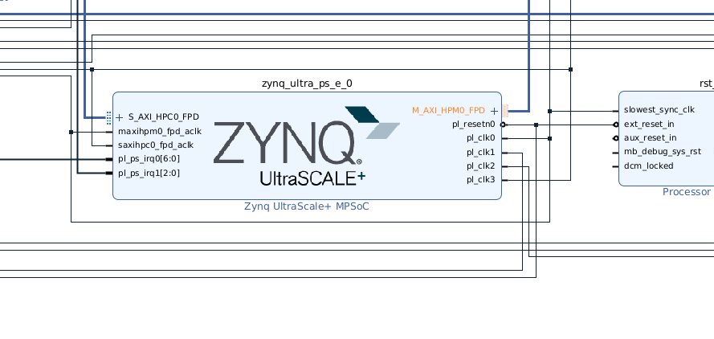

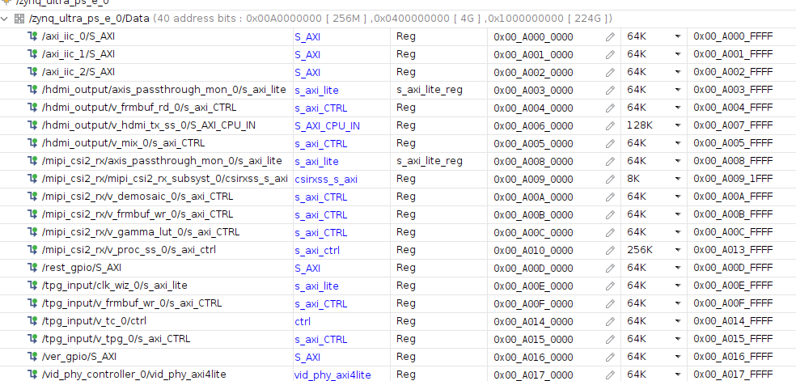

还是报错的.


### <a id="section1">mixer_primary_enable problem</a>

这都已经和`vcu_trd`没有多大区别了呀.  研究一下`vcu_trd`预编译的镜像, 发现

```bash
rdf0428-zcu106-vcu-trd-2022-2/images/vcu_llp2_hdmi_nv12/autostart.sh
```

里面

```bash
#!/bin/sh

# Source environment for init script
source /etc/profile

# Generate dbus machine ID
dbus-uuidgen > /var/lib/dbus/machine-id

# Config VCU QOS
source /media/card/vcu/configure_qos.sh

# load IRQ balancing script
source /media/card/vcu/llp2_irq_balancing.sh

# Disable primary plane
echo N > /sys/module/xlnx_mixer/parameters/mixer_primary_enable

# HDMI-Tx Link up for 4kp60
sleep 2
modetest -D a0070000.v_mix -s 39:3840x2160-60@BG24

/sbin/sysctl -w net.core.rmem_default=60000000
/sbin/sysctl -w net.core.rmem_max=60000000
/sbin/sysctl -w net.core.wmem_default=60000000
/sbin/sysctl -w net.core.wmem_max=60000000
```


有一句

```bash
# Disable primary plane
echo N > /sys/module/xlnx_mixer/parameters/mixer_primary_enable

```


另外, 根据

https://xilinx-wiki.atlassian.net/wiki/spaces/A/pages/37486769/Zynq+UltraScale+MPSoC+VCU+TRD+2018.3+-+Run+and+Build+Flow#ZynqUltraScale+MPSoCVCUTRD2018.3-RunandBuildFlow-3BuildFlow

提到有

```bash
0004-drm_atomic_helper-Supress-vblank-timeout-warning-mes.patch
0005-drm-xlnx_mixer-Dont-enable-primary-plane-by-default.patch
```

等文件

应该是要默认关闭 `mixer` 的 `stream in`, 即使悬空都要关闭才行.

```bash
echo N > /sys/module/xlnx_mixer/parameters/mixer_primary_enable
```

然后`modetest`

```bash
modetest -M xlnx -s 41@39:3840x2160-60@BG24
modetest -M xlnx \
  -s 41@39:3840x2160-60@BG24 \
  -P 38@39:3840x2160+0+0@BG24
  
modetest -D a0050000.v_mix -s 41:3840x2160-60@BG24
```

这里仅显示蓝色背景, 没有什么其他图案

这样的状态运行`gst`是有图案的

```bash
gst-launch-1.0 \
  videotestsrc pattern=smpte \
  ! video/x-raw,format=BGRx,width=3840,height=2160,framerate=30/1 \
  ! videoconvert \
  ! kmssink driver-name=xlnx sync=false
  
```


其实查看`kernel`源码

能确认默认是打开的.

<https://github.com/Xilinx/linux-xlnx/blob/xlnx_rebase_v5.15_LTS/drivers/gpu/drm/xlnx/xlnx_mixer.c>

```c
MODULE_PARM_DESC(mixer_primary_enable, "Enable mixer primary plane (default: 1)");
```

告警`vblank wait timed out`还是在源码里的.

<https://github.com/Xilinx/linux-xlnx/blob/xlnx_rebase_v5.15_LTS/drivers/gpu/drm/drm_atomic_helper.c>

```c
		WARN(!ret, "[CRTC:%d:%s] vblank wait timed out\n",
		     crtc->base.id, crtc->name);
```

而2020.1版本2018.3的版本的`vcu_trd`都给patch, 现在2022.2版本的`vcu_trd`没有给patch, 而是在初始化脚本修改.

本质原因还是 `hdmi-txss`的`vtc`和独立`vtc`出现冲突

而 `dp-txss`有 `xlnx,vtc-offset`属性, 应该不会出现这样的问题.

<https://github.com/Xilinx/linux-xlnx/blob/xlnx_rebase_v5.15_LTS/Documentation/devicetree/bindings/display/xlnx/xlnx%2Cdp-tx.yaml>


### 尝试运行 `X-server`

修改 `rdf0421-zcu102-base-trd-2020-1/petalinux/bsp/project-spec/meta-user/recipes-apps/trd-files/files`

`trd-utils.sh`

```
# return DRICard number
function detect_screen() {
	MONITOR_DP="/sys/class/drm/card*-DP*/status"
	MONITOR_HDMI="/sys/class/drm/card*-HDMI*/status"

	# Need to return 2 values from this script
	# Return value-0 is device number for video_qt2 app
	#   device number = 0 for DP-Tx, device number = 1 for HDMI-Tx for video_qt2
	# Return value-1 is X11 DRI-card number
	#   X11 DRI-card number = 0 for DP-Tx, X11 DRI-card number = 2 for HDMI-Tx
	if [ $(cat ${MONITOR_DP} 2>/dev/null) = "connected" ]; then
		echo "0" "0"
	elif [ $(cat ${MONITOR_HDMI} 2>/dev/null) = "connected" ]; then
		# echo "1" "2"
		echo "0" "0"
	fi
}
```

`MONITOR_HDMI`分支这里要修改成 `0 0`, 否则就被意外修改为`/dev/dri/card2`. 因为目前我这个设计还没有`dp`口.


`run_video.sh`

```
source /etc/trd/trd-utils.sh
```

要修改为实际位置, 因为我没有把`trd-utils.sh`放文件系统里.

**如果用默认的armsoc**

日志分析为

> 现在不是“找不到显卡”问题了，而是：armsoc 选了一个 DRM/KMS 根本不支持的显示模式，`drmModeSetCrtc()` 直接被内核拒绝（EINVAL）。

```
(EE) ARMSOC(0): ERROR: drm failed to set mode: Invalid argument
(EE) ARMSOC(0): ERROR: xf86SetDesiredModes() failed!

```

这不是 Xorg 配置错，也不是 EDID 问题，而是：

> **armsoc 试图用一个它“以为可以”的 mode，去驱动 Xilinx DRM，但内核 DRM 驱动明确说：不行。**

**如果用`modesetting`**

### `/etc/X11/xorg.conf`

```
Section "Device"
    Identifier  "ZynqMP"
    Driver      "modesetting"
    Option      "kmsdev" "/dev/dri/card0"
EndSection

Section "Screen"
    Identifier "DefaultScreen"
    Device     "ZynqMP"
EndSection
```

禁用 armsoc

```
mv /usr/lib/xorg/modules/drivers/armsoc_drv.so \
   /usr/lib/xorg/modules/drivers/armsoc_drv.so.bak
```

重启 X

```
startx
```

报glx 模块不存在（不是警告，是致命前兆）

```
(II) LoadModule: "glx"
(WW) Warning, couldn't open module glx
(EE) Failed to load module "glx" (module does not exist, 0)
```

配置文件系统应该选

```
packagegroup-petalinux-graphics
packagegroup-petalinux-x11
packagegroup-petalinux-opencv (可选)

```

而`2022.2`版本有的已经没有这个选项了, 能选的已经选了.

继续用这个路线只有降级工程版本到`2020.1`, 再比较`zcu102 base_trd`. 其实可以另外按照`zcu106 vcu_trd`这条线也继续下去.

为了在`host`使用`petalinux 2020.1`, 尝试用容器运行, 实际上也不行. 只能在虚拟机里搞了. 

### 尝试用容器运行`petalinux 2020.1`

`docker`拉取的加速不在这里记录, 中国大陆不能直接连. `podman`却可以拉这些镜像, 基本想等的.

````
$ docker pull ubuntu:18.04

$ docker run -d --name ubuntu_container --restart always -v /opt/:/opt/ -v /home/andy/:/home/andy/ -i -t ubuntu:18.04 bash
$ docker exec -it ubuntu_container /bin/bash


# dpkg --add-architecture i386
# apt update
# apt install lsb-release xvfb x11-utils dbus-x11 rlwrap locales libtinfo5 aptitude git make net-tools libncurses5-dev tftpd zlib1g-dev libssl-dev flex bison libselinux1 gnupg wget diffstat chrpath socat xterm autoconf libtool tar unzip texinfo zlib1g-dev gcc-multilib build-essential libsdl1.2-dev libglib2.0-dev screen pax gzip libboost-dev libboost-tools-dev libboost-timer-dev libcoinutils-dev libboost-all-dev libgtk-3-dev gtk3-nocsd sudo
# dpkg-reconfigure locales
> choose en_US.UTF-8 UTF-8, at about number 159
> and choose num 3, en_US.UTF-8
# dpkg-reconfigure dash
> choose no
# adduser andy
# usermod -a -G sudo andy
> ...
# su andy

sudo apt-get install u-boot-tools lrzsz minicom nfs-kernel-server tftpd xinetd libncurses5-dev vim ctags cscope
  


sudo dpkg-reconfigure dash # choose no


## 配置tftp

/etc/xinetd.d/tftp

```
service tftp
{
protocol = udp
port = 69
socket_type = dgram
wait = yes
user = nobody
server = /usr/sbin/in.tftpd
server_args = /tftpboot
disable = no
}
```

tftp目录权限修改

```
sudo mkdir -p /tftpboot
sudo chmod 777 /tftpboot
sudo chown nobody /tftpboot
```

启动tftp服务

```
sudo /etc/init.d/xinetd stop
sleep 1
sudo /etc/init.d/xinetd start
```
容器内继续安装一些软件和设置, 这里不记录

Processing triggers for libc-bin (2.27-3ubuntu1.6) ...
andy@6c65ba62f798:~$ sudo vim /etc/xinetd.d/tftp
andy@6c65ba62f798:~$ sudo mkdir -p /tftpboot
andy@6c65ba62f798:~$ sudo chmod 777 /tftpboot
andy@6c65ba62f798:~$ sudo chown nobody /tftpboot
andy@6c65ba62f798:~$ sudo /etc/init.d/xinetd start
 * Starting internet superserver xinetd                                                                                                                                                                     [ OK ] 
andy@6c65ba62f798:~$ cd workdir/zirui/06_vcu_trd_port/
base_trd_block_diagram.jpg      rdf0421-zcu102-base-trd-2020-1/ rdf0428-zcu106-vcu-trd-2020.1/  ug1221-zcu102-base-trd.pdf      vcu_trd_block_diagram.png       
P11/                            rdf0428-zcu106-vcu-trd-2018-3/  rdf0428-zcu106-vcu-trd-2022-2/  ug1250-zcu106-vcu-trd.pdf       
andy@6c65ba62f798:~$ cd workdir/zirui/06_vcu_trd_port/rdf0421-zcu102-base-trd-2020-1/
IMPORTANT_NOTICE_CONCERNING_THIRD_PARTY_CONTENT.txt  sd_card/                                             zcu102_base_trd/
petalinux/                                           vivado/                                              
README.txt                                           workspaces/                                          
andy@6c65ba62f798:~$ cd workdir/zirui/06_vcu_trd_port/rdf0421-zcu102-base-trd-2020-1/petalinux/bsp
andy@6c65ba62f798:~/workdir/zirui/06_vcu_trd_port/rdf0421-zcu102-base-trd-2020-1/petalinux/bsp$ source /opt/Xilinx/PetaLinux/2020.1/tool/settings.sh
PetaLinux environment set to '/opt/Xilinx/PetaLinux/2020.1/tool'
WARNING: This is not a supported OS
INFO: Checking free disk space
INFO: Checking installed tools
INFO: Checking installed development libraries
INFO: Checking network and other services


andy@34a2afc24b31:~/workdir/zirui/06_vcu_trd_port/rdf0421-zcu102-base-trd-2020-1/petalinux/bsp$ petalinux-config 
INFO: sourcing build tools
[INFO] generating Kconfig for project
[INFO] menuconfig project
ERROR: Failed to menu config project component 
ERROR: Failed to config project.

andy@6c65ba62f798:~/workdir/zirui/06_vcu_trd_port/rdf0421-zcu102-base-trd-2020-1/petalinux/bsp$ cat build/config.log
[INFO] menuconfig project
env: ‘mconf’: No such file or directory
ERROR: Failed to config project.


````

`mconf`是`petalinux`内部的工具

```
$ cd /opt/Xilinx/PetaLinux/2020.1/tool
andy@andy-zirui:/opt/Xilinx/PetaLinux/2020.1/tool
$ find . -name "mconf"
./components/yocto/buildtools/sysroots/x86_64-petalinux-linux/usr/bin/mconf
andy@andy-zirui:/opt/Xilinx/PetaLinux/2020.1/tool
$ ./components/yocto/buildtools/sysroots/x86_64-petalinux-linux/usr/bin/mconf
bash: ./components/yocto/buildtools/sysroots/x86_64-petalinux-linux/usr/bin/mconf: No such file or directory
andy@andy-zirui:/opt/Xilinx/PetaLinux/2020.1/tool
$ file ./components/yocto/buildtools/sysroots/x86_64-petalinux-linux/usr/bin/mconf
./components/yocto/buildtools/sysroots/x86_64-petalinux-linux/usr/bin/mconf: symbolic link to kconfig-mconf
andy@andy-zirui:/opt/Xilinx/PetaLinux/2020.1/tool
$ ll ./components/yocto/buildtools/sysroots/x86_64-petalinux-linux/usr/bin/mconf
lrwxrwxrwx 1 andy andy 13 Jun  9  2023 ./components/yocto/buildtools/sysroots/x86_64-petalinux-linux/usr/bin/mconf -> kconfig-mconf*
andy@andy-zirui:/opt/Xilinx/PetaLinux/2020.1/tool
$ ./components/yocto/buildtools/sysroots/x86_64-petalinux-linux/usr/bin/kconfig-mconf
bash: ./components/yocto/buildtools/sysroots/x86_64-petalinux-linux/usr/bin/kconfig-mconf: No such file or directory
```


尝试失败. 还是用虚拟机?

实际上虚拟机用复制的办法也一样报没有`mconf`, 虚拟机确认之前是可以用的, 唯一的差别是之前是直接安装, 这次是安装后的复制, 差别是路径.

## **`petalinux2020.1`出问题的真相**

`petalinux`安装的时候指定了路径, 会给里面不仅是给大量文本文件添加绝对路径, 而且给大量二进制文件也添加了绝对路径, 所以, 用剪切复制的办法放到非原始位置, 就会出错. 一个办法是确定安装位置, 以后一直都用这个位置, 比如我这里都定义为`/opt/Xilinx/PetaLinux/xxxx/tool`, 用到的每个版本都这样. 云存储的备份也是默认这个位置, 迁移其他位置就直接用安装文件安装就是, 没有必要去大量修改文本二进制混合文件的内容.


## `petalinux`最终解决方案

`docker` / `podman` 或 `distrobox`使用`petalinux`版本推荐的`os`版本的容器. 可以避免工具链不兼容比如要求安装特定`gcc`版本, 新 `glibc` / 新 `gcc`环境下的导致编译失败问题.


## 仿照`zcu102 base_trd`的`base_trd`工程

这个只出到2020.1的版本, 可以基于这个来搞视频流`v4l2`路径. 这样可以排除 `zcu106 vcu_trd`的深度绑定`vcu`的情况.

### 测试版本1

`vivado`实际工程和原工程的主要区别是

* 去掉了`hdmi-rx`

* 简化了 `csi-rx`路径

* 没有添加`dp-tx`

* 中断系统原设计用的`axi-intr`控制器, 这里直接用常规的`ps`的中断控制器

* 取消原设计`vphy`的`dru-clk`

* 地址分布变化

  

#### 关于`vphy`的`dru-clk`

`dru-clk` —— DRU（数字时钟恢复）的工作时钟

用途：

- 给 **DRU 数字逻辑**跑算法用
- 只在 **RX + 异步输入** 场景存在
- TX-only的场景, **`dru-clk` 不需要、也不应该出现**


自动产生的`device-tree`和`port`进来的标签`label`有冲突

```
Subprocess output:
/home/andy/Downloads/tmp/peta_p11/petalinux/project-spec/configs/../../components/plnx_workspace/device-tree/device-tree/pl.dtsi:14.27-24.5: ERROR (duplicate_label): /amba_pl@0/i2c@a0030000: Duplicate label 'axi_iic_0' on /amba_pl@0/i2c@a0030000 and /amba/i2c@a0030000
/home/andy/Downloads/tmp/peta_p11/petalinux/project-spec/configs/../../components/plnx_workspace/device-tree/device-tree/pl.dtsi:25.27-35.5: ERROR (duplicate_label): /amba_pl@0/i2c@a0080000: Duplicate label 'axi_iic_1' on /amba_pl@0/i2c@a0080000 and /amba/i2c@a0080000
/home/andy/Downloads/tmp/peta_p11/petalinux/project-spec/configs/../../components/plnx_workspace/device-tree/device-tree/pl.dtsi:36.27-46.5: ERROR (duplicate_label): /amba_pl@0/i2c@a0090000: Duplicate label 'axi_iic_2' on /amba_pl@0/i2c@a0090000 and /amba/i2c@a0090000
/home/andy/Downloads/tmp/peta_p11/petalinux/project-spec/configs/../../components/plnx_workspace/device-tree/device-tree/pl.dtsi:342.28-344.6: ERROR (duplicate_label): /amba_pl@0/vid_phy_controller@a0150000/vphy_lane@0: Duplicate label 'vphy_lane0' on /amba_pl@0/vid_phy_controller@a0150000/vphy_lane@0 and /amba/vphy@a0150000/vphy_lane@0
/home/andy/Downloads/tmp/peta_p11/petalinux/project-spec/configs/../../components/plnx_workspace/device-tree/device-tree/pl.dtsi:345.28-347.6: ERROR (duplicate_label): /amba_pl@0/vid_phy_controller@a0150000/vphy_lane@1: Duplicate label 'vphy_lane1' on /amba_pl@0/vid_phy_controller@a0150000/vphy_lane@1 and /amba/vphy@a0150000/vphy_lane@1
/home/andy/Downloads/tmp/peta_p11/petalinux/project-spec/configs/../../components/plnx_workspace/device-tree/device-tree/pl.dtsi:348.28-350.6: ERROR (duplicate_label): /amba_pl@0/vid_phy_controller@a0150000/vphy_lane@2: Duplicate label 'vphy_lane2' on /amba_pl@0/vid_phy_controller@a0150000/vphy_lane@2 and /amba/vphy@a0150000/vphy_lane@2
/home/andy/Downloads/tmp/peta_p11/petalinux/project-spec/configs/../../components/plnx_workspace/device-tree/device-tree/pl.dtsi:351.28-353.6: ERROR (duplicate_label): /amba_pl@0/vid_phy_controller@a0150000/vphy_lane@3: Duplicate label 'vphy_lane3' on /amba_pl@0/vid_phy_controller@a0150000/vphy_lane@3 and /amba/vphy@a0150000/vphy_lane@3
ERROR: Input tree has errors, aborting (use -f to force output)
```


删节点, 可以在顶层使用`&label`, 也可以在父节点中使用节点名称

```dtd
在&amba{}外
/delete-node/ &i2c1;

在&amba{}内
/delete-node/ i2c1;
/delete-node/ axis_broadcasterhdmi_input_axis_broadcaster_0@0;

要删除的节点全称像这样
/amba_pl@0/vid_phy_controller@a0150000

```


#### 运行镜像

没有产生`boot.scr`. 暂时用原来的`boot.scr`引导`sd`启动镜像, 这次启动设备节点有问题

```bash
[   25.743330] usb 2-1: new SuperSpeed Gen 1 USB device number 4 using xhci-hcd
[   25.753579] xilinx-video amba:vcap_tpg: /amba/vcap_tpg/ports/port@0 initialization failed
[   25.761752] xilinx-video amba:vcap_tpg: DMA initialization failed
[   25.770855] usb 2-1: New USB device found, idVendor=05e3, idProduct=0620, bcdDevice= 5.20
[   25.779033] usb 2-1: New USB device strings: Mfr=1, Product=2, SerialNumber=0
[   25.786166] usb 2-1: Product: USB3.0 Hub
[   25.790078] usb 2-1: Manufacturer: GenesysLogic
[   25.823826] hub 2-1:1.0: USB hub found
[   25.827883] hub 2-1:1.0: 4 ports detected
[   25.833409] xilinx-video amba:vcap_tpg: /amba/vcap_tpg/ports/port@0 initialization failed
[   25.841582] xilinx-video amba:vcap_tpg: DMA initialization failed
udhcpc: no lease, forking to background
done.
Starting system message bus: dbus.
Starting haveged: haveged: listening socket at 3
haveged: haveged starting up


Starting Dropbear SSH server: dropbear.
Starting bluetooth: bluetoothd.
Starting internet superserver: inetd.
Starting syslogd/klogd: done
[ ok ]rting Avahi mDNS/DNS-SD Daemon: avahi-daemon
Starting Telephony daemon
Starting tcf-agent: [   29.081900] random: crng init done
OK
Setting console loglevel to 0 ...

PetaLinux 2020.1 petalinux ttyPS0


root@petalinux:~# 
root@petalinux:~# ****************************************************
** Zynq UltraScale+ MPSoC Base TRD Qt Application **
****************************************************
/etc/trd/trd-utils.sh: line 11: [: =: unary operator expected
/etc/trd/trd-utils.sh: line 13: [: =: unary operator expected
ERROR: No display device found

root@petalinux:~# 
root@petalinux:~# 
root@petalinux:~# 
root@petalinux:~# 
root@petalinux:~# 
root@petalinux:~# 
root@petalinux:~# 
root@petalinux:~# 
root@petalinux:~# 
root@petalinux:~# echo N > /sys/module/xlnx_mixer/parameters/mixer_primary_enable
-sh: /sys/module/xlnx_mixer/parameters/mixer_primary_enable: No such file or directory
root@petalinux:~# ls /sys/module/                                                
Display all 112 possibilities? (y or n)
8250/                    bridge/                  cfg80211/                hci_uart/                mmcblk/                  rcutree/                 tcp_cubic/               wlcore_sdio/
8250_core/               btbcm/                   configfs/                hci_vhci/                module/                  rfcomm/                  uio_pdrv_genirq/         workqueue/
ahci_ceva/               btintel/                 cpufreq/                 hid/                     mtdoops/                 rfkill/                  usb_storage/             xhci_hcd/
asix/                    btmrvl/                  cpuidle/                 hidp/                    nf_conntrack/            scsi_mod/                usbcore/                 xilinx_hdmi_tx/
ath3k/                   btmrvl_sdio/             cryptomgr/               i2c_algo_bit/            nfs/                     sdhci/                   usbhid/                  xilinx_multi_scaler/
auth_rpcgss/             btqca/                   dmaproxy/                ipv6/                    nfs_layout_nfsv41_files/ sit/                     uvcvideo/                xilinx_uartps/
bcm203x/                 btrtl/                   dmatest/                 kernel/                  nfsv4/                   snd/                     v4l2_mem2mem/            xilinx_video/
bfusb/                   btsdio/                  dns_resolver/            keyboard/                of_xilinx_wdt/           snd_pcm/                 videobuf2_common/        xilinx_vphy/
blk_cgroup/              btusb/                   dp159/                   libahci/                 overlay/                 snd_timer/               videobuf2_v4l2/          xlnx_drm/
block/                   btwilink/                drm/                     libata/                  pktgen/                  snd_usb_audio/           vivid/                   xz_dec/
bluetooth/               cadence_wdt/             drm_kms_helper/          lockd/                   printk/                  spurious/                vt/                      zocl/
bnep/                    can/                     edac_core/               loop/                    psmouse/                 srcutree/                watchdog/                zynqmp_dpsub/
bpa10x/                  can_gw/                  fb/                      mac80211/                random/                  sunrpc/                  wl18xx/                  zynqmp_fpga/
brd/                     cdc_ncm/                 firmware_class/          mali/                    rcupdate/                sysrq/                   wlcore/                  zynqmp_r5_remoteproc/
root@petalinux:~# ls /sys/module/x
xhci_hcd/            xilinx_hdmi_tx/      xilinx_multi_scaler/ xilinx_uartps/       xilinx_video/        xilinx_vphy/         xlnx_drm/            xz_dec/              
root@petalinux:~# ls /sys/module/x
xhci_hcd/            xilinx_hdmi_tx/      xilinx_multi_scaler/ xilinx_uartps/       xilinx_video/        xilinx_vphy/         xlnx_drm/            xz_dec/              
root@petalinux:~# dmesg | grep mix
[   14.212036] OF: /amba/v_mix@a00b0000: #gpio-cells = 3 found -1
[   14.217634] xlnx-mixer a00b0000.v_mix: No reset gpio info from dts for mixer
[   14.224636] xlnx-mixer a00b0000.v_mix: Failed to probe mixer
[   14.230261] xlnx-mixer: probe of a00b0000.v_mix failed with error -22
root@petalinux:~# dmesg | grep gpio
[   14.212036] OF: /amba/v_mix@a00b0000: #gpio-cells = 3 found -1
[   14.217634] xlnx-mixer a00b0000.v_mix: No reset gpio info from dts for mixer
[   14.821999] XGpio: gpio@a00f0000: registered, base is 480
[   14.830957] XGpio: gpio@a0140000: registered, base is 448
[   14.953109] OF: /amba/fb_wr@a0110000: #gpio-cells = 3 found -1
[   15.416494] OF: /amba/tpg@a0130000: #gpio-cells = 3 found -
```

这个可能和`amba`和`amba_pl`这样的标签差异有关系, 把`amba`换成`amba_pl`大概可以解决`reset-gpio`的问题 [不是的]

实际上是 `axi-gpio` 是 3 个 cell

这 3 个 cell 的含义是：

```dtd
<&gpio  gpio-number  flags  channel>
```

| cell | 含义                                 |
| ---- | ------------------------------------ |
| 0    | GPIO index                           |
| 1    | GPIO flags（0 / GPIO_ACTIVE_LOW 等） |
| 2    | **通道号（channel）**                |

正确写法（AXI GPIO）

```dtd
reset-gpios = <&rest_gpio 9 GPIO_ACTIVE_LOW 0>;
```

或更明确一点：

```dtd
reset-gpios = <&rest_gpio 9 1 0>;
```

还是报错

```bash
[   17.865709] [drm] Probing for xlnx,zocl
[   17.869555] zocl-drm amba_pl@0:zyxclmm_drm: IRQ index 0 not found
[   17.875716] [drm] FPGA programming device pcap founded.
[   17.880935] [drm] PR Isolation addr 0x0
[   17.881210] [drm] Initialized zocl 2018.2.1 20180313 for amba_pl@0:zyxclmm_drm on minor 0
[   17.893544] xilinx-frmbuf a0110000.fb_wr: Probe deferred due to GPIO reset defer
Running postinst /etc/rpm-postinsts/104-sysvinit-inittab...
[   17.901576] xilinx-video amba_pl@0:vcap_tpg: /amba_pl@0/vcap_tpg/ports/port@0 initialization failed
[   17.915393] xilinx-video amba_pl@0:vcap_tpg: DMA initialization failed
update-rc.d: /etc/init.d/run-postinsts exists during rc.d purge (continuing)
INIT: Entering runlevel: 5
Configuring network interfaces... [   18.009115] pps pps0: new PPS source ptp0
[   18.013136] macb ff0e0000.ethernet: gem-ptp-timer ptp clock registered.
udhcpc: started, v1.31.0
udhcpc: sending discover
udhcpc: sending discover
udhcpc: sending discover
[   25.771151] usb 1-1: new high-speed USB device number 4 using xhci-hcd
[   25.928800] usb 1-1: New USB device found, idVendor=05e3, idProduct=0610, bcdDevice= 5.20
[   25.936970] usb 1-1: New USB device strings: Mfr=1, Product=2, SerialNumber=0
[   25.944104] usb 1-1: Product: USB2.0 Hub
[   25.948016] usb 1-1: Manufacturer: GenesysLogic
[   26.017546] hub 1-1:1.0: USB hub found
[   26.021839] hub 1-1:1.0: 4 ports detected
[   26.081104] usb 2-1: new SuperSpeed Gen 1 USB device number 4 using xhci-hcd
[   26.091036] xilinx-frmbuf a0110000.fb_wr: Probe deferred due to GPIO reset defer
[   26.098963] xilinx-video amba_pl@0:vcap_tpg: /amba_pl@0/vcap_tpg/ports/port@0 initialization failed
[   26.108012] xilinx-video amba_pl@0:vcap_tpg: DMA initialization failed
[   26.117643] usb 2-1: New USB device found, idVendor=05e3, idProduct=0620, bcdDevice= 5.20
[   26.125820] usb 2-1: New USB device strings: Mfr=1, Product=2, SerialNumber=0
[   26.132951] usb 2-1: Product: USB3.0 Hub
[   26.136869] usb 2-1: Manufacturer: GenesysLogic
[   26.161593] hub 2-1:1.0: USB hub found
[   26.165643] hub 2-1:1.0: 4 ports detected
[   26.171034] xilinx-frmbuf a0110000.fb_wr: Probe deferred due to GPIO reset defer
[   26.178979] xilinx-video amba_pl@0:vcap_tpg: /amba_pl@0/vcap_tpg/ports/port@0 initialization failed
[   26.188020] xilinx-video amba_pl@0:vcap_tpg: DMA initialization failed

root@petalinux:~# dmesg | grep gpio
[   14.796161] XGpio: gpio@a00f0000: registered, base is 480
[   14.805129] XGpio: gpio@a0140000: registered, base is 448

root@petalinux:~# dmesg | grep reset
[   14.919206] xilinx-frmbuf a00a0000.v_frmbuf_rd: Unable to locate reset property in dt
[   14.934455] xilinx-frmbuf a00d0000.v_frmbuf_wr: Unable to locate reset property in dt
[   14.949615] xilinx-frmbuf a0110000.fb_wr: Probe deferred due to GPIO reset defer
[   15.466087] xilinx-frmbuf a0110000.fb_wr: Probe deferred due to GPIO reset defer
[   15.489778] xilinx-frmbuf a0110000.fb_wr: Probe deferred due to GPIO reset defer
[   15.617640] xilinx-frmbuf a0110000.fb_wr: Probe deferred due to GPIO reset defer
[   16.005090] xilinx-frmbuf a0110000.fb_wr: Probe deferred due to GPIO reset defer
[   16.050952] xilinx-frmbuf a0110000.fb_wr: Probe deferred due to GPIO reset defer
[   16.059821] xilinx-frmbuf a0110000.fb_wr: Probe deferred due to GPIO reset defer
[   16.065455] xilinx-frmbuf a0110000.fb_wr: Probe deferred due to GPIO reset defer
[   16.196763] xilinx-frmbuf a0110000.fb_wr: Probe deferred due to GPIO reset defer
[   16.238502] xilinx-frmbuf a0110000.fb_wr: Probe deferred due to GPIO reset defer
[   17.893544] xilinx-frmbuf a0110000.fb_wr: Probe deferred due to GPIO reset defer
[   26.091036] xilinx-frmbuf a0110000.fb_wr: Probe deferred due to GPIO reset defer
[   26.171034] xilinx-frmbuf a0110000.fb_wr: Probe deferred due to GPIO reset defer

```

换成这样也试了

```dtd
	reset-gpios = <&rest_gpio 9 1 1>; 
```

也可以定义

```dtd
rest_gpio: gpio@a00f0000 {
		#gpio-cells = <2>;
		...


reset-gpios = <&rest_gpio 9 1>; 
```


反正编译能通过, 启动过程还是看到一样的报错. 目前无法解决

操作`GPIO`看起来没问题

```
ls /sys/class/gpio
echo 489 > /sys/class/gpio/export   # 480 + 9
cat /sys/class/gpio/gpio489/value

```

注意到

```bash
[   14.792763] GPIO IRQ not connected
[   14.796161] XGpio: gpio@a00f0000: registered, base is 480
[   14.801728] GPIO IRQ not connected
[   14.805129] XGpio: gpio@a0140000: registered, base is 448
```


### 测试版本2

这样, 再改`vivado`工程, 

* 中断系统原设计用的`axi-intr`控制器, 这里也改成一样的

* `reset-gpio`改成也用`ps gpio`

* 主要器件地址保持原设计


#### 这次都没有进系统就挂了

```bash
[   14.735344] xilinx-zynqmp-dma fd500000.dma: ZynqMP DMA driver Probe success
[   14.742451] xilinx-zynqmp-dma fd510000.dma: ZynqMP DMA driver Probe success
[   14.749555] xilinx-zynqmp-dma fd520000.dma: ZynqMP DMA driver Probe success
[   14.756655] xilinx-zynqmp-dma fd530000.dma: ZynqMP DMA driver Probe success
[   14.763749] xilinx-zynqmp-dma fd540000.dma: ZynqMP DMA driver Probe success
[   14.770846] xilinx-zynqmp-dma fd550000.dma: ZynqMP DMA driver Probe success
[   14.777949] xilinx-zynqmp-dma fd560000.dma: ZynqMP DMA driver Probe success
[   14.785047] xilinx-zynqmp-dma fd570000.dma: ZynqMP DMA driver Probe success
[   14.792213] xilinx-zynqmp-dma ffa80000.dma: ZynqMP DMA driver Probe success
[   14.799318] xilinx-zynqmp-dma ffa90000.dma: ZynqMP DMA driver Probe success
[   14.806420] xilinx-zynqmp-dma ffaa0000.dma: ZynqMP DMA driver Probe success
[   14.813513] xilinx-zynqmp-dma ffab0000.dma: ZynqMP DMA driver Probe success
[   14.820608] xilinx-zynqmp-dma ffac0000.dma: ZynqMP DMA driver Probe success
[   14.827706] xilinx-zynqmp-dma ffad0000.dma: ZynqMP DMA driver Probe success
[   14.834811] xilinx-zynqmp-dma ffae0000.dma: ZynqMP DMA driver Probe success
[   14.841907] xilinx-zynqmp-dma ffaf0000.dma: ZynqMP DMA driver Probe success
[   41.071128] rcu: INFO: rcu_sched detected stalls on CPUs/tasks:
[   41.077035] rcu:     0-...0: (23 ticks this GP) idle=99a/1/0x4000000000000000 softirq=79/80 fqs=2254 
[   41.085980]  (detected by 2, t=5277 jiffies, g=3593, q=2)
[   41.091361] Task dump for CPU 0:
[   41.094572] kworker/0:1     R  running task        0    38      2 0x0000000a
[   41.101620] Workqueue: events deferred_probe_work_func
[   41.106741] Call trace:
[   41.109176]  __switch_to+0x1c4/0x288
[   41.112742]  proc_register+0x38/0x1a0
[   41.116395]  proc_mkdir_data+0x6c/0x90
[   41.120127]  proc_mkdir+0x18/0x20
[   41.123427]  register_handler_proc+0x124/0x150
[   41.127862]  __setup_irq+0x56c/0x7f0
[   41.131420]  request_threaded_irq+0xd4/0x190
[   41.135673]  devm_request_threaded_irq+0x74/0xe8
[   41.140275]  gpiod_set_value+0x48/0x60
[   41.144016]  xilinx_frmbuf_chan_reset+0x38/0x78
[   41.148537]  xilinx_frmbuf_probe+0x300/0x850
[   41.152791]  platform_drv_probe+0x50/0xa0
[   41.156783]  really_probe+0xd8/0x2f8
[   41.160342]  driver_probe_device+0x54/0xe8
[   41.164422]  __device_attach_driver+0x80/0xb8
[   41.168761]  bus_for_each_drv+0x74/0xc0
[   41.172580]  __device_attach+0xdc/0x138
[   41.176400]  device_initial_probe+0x10/0x18
[   41.180566]  bus_probe_device+0x90/0x98
[   41.184385]  deferred_probe_work_func+0x6c/0xa0
[   41.188899]  process_one_work+0x1c4/0x338
[   41.192891]  worker_thread+0x260/0x488
[   41.196625]  kthread+0x120/0x128
[   41.199836]  ret_from_fork+0x10/0x18
[  104.095128] rcu: INFO: rcu_sched detected stalls on CPUs/tasks:
[  104.101038] rcu:     0-...0: (23 ticks this GP) idle=99a/1/0x4000000000000000 softirq=79/80 fqs=2859 
[  104.109984]  (detected by 3, t=21033 jiffies, g=3593, q=2)
[  104.115451] Task dump for CPU 0:
[  104.118663] kworker/0:1     R  running task        0    38      2 0x0000000a
[  104.125705] Workqueue: events deferred_probe_work_func
[  104.130832] Call trace:
[  104.133265]  __switch_to+0x1c4/0x288
[  104.136823]  proc_register+0x38/0x1a0
[  104.140469]  proc_mkdir_data+0x6c/0x90
[  104.144201]  proc_mkdir+0x18/0x20
[  104.147499]  register_handler_proc+0x124/0x150
[  104.151926]  __setup_irq+0x56c/0x7f0
[  104.155485]  request_threaded_irq+0xd4/0x190
[  104.159738]  devm_request_threaded_irq+0x74/0xe8
[  104.164339]  gpiod_set_value+0x48/0x60
[  104.168071]  xilinx_frmbuf_chan_reset+0x38/0x78
[  104.172585]  xilinx_frmbuf_probe+0x300/0x850
[  104.176838]  platform_drv_probe+0x50/0xa0
[  104.180831]  really_probe+0xd8/0x2f8
[  104.184390]  driver_probe_device+0x54/0xe8
[  104.188469]  __device_attach_driver+0x80/0xb8
[  104.192809]  bus_for_each_drv+0x74/0xc0
[  104.196628]  __device_attach+0xdc/0x138
[  104.200448]  device_initial_probe+0x10/0x18
[  104.204614]  bus_probe_device+0x90/0x98
[  104.208433]  deferred_probe_work_func+0x6c/0xa0
[  104.212946]  process_one_work+0x1c4/0x338
[  104.216939]  worker_thread+0x260/0x488
[  104.220672]  kthread+0x120/0x128
[  104.223883]  ret_from_fork+0x10/0x18
```

必然挂在`xilinx-zynqmp-dma ffaf0000.dma: ZynqMP DMA driver Probe success`, 后面系统炸了的信息不一定每次都爆出来.

#### 大概的原因看到这里

```bash
[   14.067916] Freeing initrd memory: 210500K
[   14.068408] hw perfevents: no interrupt-affinity property for /pmu, guessing.
[   14.073650] hw perfevents: enabled with armv8_pmuv3 PMU driver, 7 counters available
[   14.082070] Initialise system trusted keyrings
[   14.085713] workingset: timestamp_bits=46 max_order=20 bucket_order=0
[   14.092793] NFS: Registering the id_resolver key type
[   14.097017] Key type id_resolver registered
[   14.101159] Key type id_legacy registered
[   14.105141] nfs4filelayout_init: NFSv4 File Layout Driver Registering...
[   14.111809] jffs2: version 2.2. (NAND) © 2001-2006 Red Hat, Inc.
[   14.133477] NET: Registered protocol family 38
[   14.133520] Key type asymmetric registered
[   14.136349] Asymmetric key parser 'x509' registered
[   14.141212] Block layer SCSI generic (bsg) driver version 0.4 loaded (major 247)
[   14.148543] io scheduler mq-deadline registered
[   14.153039] io scheduler kyber registered
[   14.159050] xilinx-frmbuf b0020000.v_frmbuf_wr: failed to get ap_clk (-517)
[   14.163985] xilinx-frmbuf b0050000.v_frmbuf_wr: failed to get ap_clk (-517)
[   14.194344] Serial: 8250/16550 driver, 4 ports, IRQ sharing disabled
[   14.198334] xlnx,csc-bridge b0060000.v_proc_ss: failed to get aclk -517
[   14.201773] xlnx,scaler-bridge b0080000.v_proc_ss: failed to get axi lite clk -517
[   14.209156] xlnx,scaler-bridge b0080000.v_proc_ss: parse_of failed
[   14.215836] cacheinfo: Unable to detect cache hierarchy for CPU 0
[   14.225439] brd: module loaded
[   14.229761] loop: module loaded
[   14.230533] mtdoops: mtd device (mtddev=name/number) must be supplied
[   14.235028] libphy: Fixed MDIO Bus: probed
[   14.238877] tun: Universal TUN/TAP device driver, 1.6
[   14.243047] CAN device driver interface
[   14.247747] usbcore: registered new interface driver asix
[   14.252186] usbcore: registered new interface driver ax88179_178a
[   14.258216] usbcore: registered new interface driver cdc_ether
[   14.264011] usbcore: registered new interface driver net1080
[   14.269635] usbcore: registered new interface driver cdc_subset
[   14.275516] usbcore: registered new interface driver zaurus
[   14.281062] usbcore: registered new interface driver cdc_ncm
[   14.287501] usbcore: registered new interface driver uas
[   14.291961] usbcore: registered new interface driver usb-storage
[   14.298460] rtc_zynqmp ffa60000.rtc: registered as rtc0
[   14.303149] i2c /dev entries driver
[   14.306986] vivid-000: using single planar format API
[   14.313094] vivid-000: V4L2 capture device registered as video0
[   14.317519] vivid-000: V4L2 output device registered as video1
[   14.323326] vivid-000: V4L2 capture device registered as vbi0, supports raw and sliced VBI
[   14.331529] vivid-000: V4L2 output device registered as vbi1, supports raw and sliced VBI
[   14.339662] vivid-000: V4L2 capture device registered as swradio0
[   14.345711] vivid-000: V4L2 receiver device registered as radio0
[   14.351682] vivid-000: V4L2 transmitter device registered as radio1
[   14.358029] xilinx-video amba_pl@0:vcap_tpg: /amba_pl@0/vcap_tpg/ports/port@0 initialization failed
[   14.366848] xilinx-video amba_pl@0:vcap_tpg: DMA initialization failed
[   14.373373] xilinx-video amba_pl@0:vcap_csi: /amba_pl@0/vcap_csi/ports/port@0 initialization failed
[   14.382329] xilinx-video amba_pl@0:vcap_csi: DMA initialization failed
[   14.389186] xilinx-csi2rxss a0060000.mipi_csi2_rx_subsystem: failed to get lite_aclk (-517)
[   14.398364] xilinx-vpss-scaler b0080000.v_proc_ss: xlnx,v-vpss-scaler-2.2 - compatible string is getting deprecated!
[   14.407592] xilinx-vpss-scaler b0080000.v_proc_ss: failed to get aclk_axis (-517)
[   14.415187] usbcore: registered new interface driver uvcvideo
[   14.420733] USB Video Class driver (1.1.1)
[   14.425189] Bluetooth: HCI UART driver ver 2.3
[   14.429212] Bluetooth: HCI UART protocol H4 registered
[   14.434312] Bluetooth: HCI UART protocol BCSP registered
[   14.439605] Bluetooth: HCI UART protocol LL registered
[   14.444693] Bluetooth: HCI UART protocol ATH3K registered
[   14.450066] Bluetooth: HCI UART protocol Three-wire (H5) registered
[   14.456318] Bluetooth: HCI UART protocol Intel registered
[   14.461659] Bluetooth: HCI UART protocol QCA registered
[   14.466858] usbcore: registered new interface driver bcm203x
[   14.472484] usbcore: registered new interface driver bpa10x
[   14.478017] usbcore: registered new interface driver bfusb
[   14.483470] usbcore: registered new interface driver btusb
[   14.488932] usbcore: registered new interface driver ath3k
[   14.494453] EDAC MC: ECC not enabled
[   14.498045] EDAC DEVICE0: Giving out device to module zynqmp-ocm-edac controller zynqmp_ocm: DEV ff960000.memory-controller (INTERRUPT)
[   14.510391] sdhci: Secure Digital Host Controller Interface driver
[   14.516142] sdhci: Copyright(c) Pierre Ossman
[   14.520465] sdhci-pltfm: SDHCI platform and OF driver helper
[   14.526462] ledtrig-cpu: registered to indicate activity on CPUs
[   14.532099] zynqmp_firmware_probe Platform Management API v1.1
[   14.537855] zynqmp_firmware_probe Trustzone version v1.0
[   14.567904] alg: No test for xilinx-zynqmp-aes (zynqmp-aes)
[   14.569735] zynqmp_aes zynqmp_aes: AES Successfully Registered
[   14.569735] 
[   14.575459] alg: No test for xilinx-keccak-384 (zynqmp-keccak-384)
[   14.583008] alg: No test for xilinx-zynqmp-rsa (zynqmp-rsa)
[   14.588431] usbcore: registered new interface driver usbhid
[   14.592407] usbhid: USB HID core driver
[   14.598771] fpga_manager fpga0: Xilinx ZynqMP FPGA Manager registered
[   14.602942] usbcore: registered new interface driver snd-usb-audio
[   14.609635] pktgen: Packet Generator for packet performance testing. Version: 2.75
[   14.616803] Initializing XFRM netlink socket
[   14.620593] NET: Registered protocol family 10
[   14.625305] Segment Routing with IPv6
[   14.628669] sit: IPv6, IPv4 and MPLS over IPv4 tunneling driver
[   14.634756] NET: Registered protocol family 17
[   14.638864] NET: Registered protocol family 15
[   14.643275] bridge: filtering via arp/ip/ip6tables is no longer available by default. Update your scripts to load br_netfilter if you need this.
[   14.656151] can: controller area network core (rev 20170425 abi 9)
[   14.662315] NET: Registered protocol family 29
[   14.666705] can: raw protocol (rev 20170425)
[   14.670943] can: broadcast manager protocol (rev 20170425 t)
[   14.676568] can: netlink gateway (rev 20190810) max_hops=1
[   14.682090] Bluetooth: RFCOMM TTY layer initialized
[   14.686864] Bluetooth: RFCOMM socket layer initialized
[   14.691971] Bluetooth: RFCOMM ver 1.11
[   14.695688] Bluetooth: BNEP (Ethernet Emulation) ver 1.3
[   14.700957] Bluetooth: BNEP filters: protocol multicast
[   14.706147] Bluetooth: BNEP socket layer initialized
[   14.711076] Bluetooth: HIDP (Human Interface Emulation) ver 1.2
[   14.716965] Bluetooth: HIDP socket layer initialized
[   14.722003] 9pnet: Installing 9P2000 support
[   14.726145] Key type dns_resolver registered
[   14.730606] registered taskstats version 1
[   14.734437] Loading compiled-in X.509 certificates
[   14.739579] Btrfs loaded, crc32c=crc32c-generic
[   14.752251] ff000000.serial: ttyPS0 at MMIO 0xff000000 (irq = 41, base_baud = 6249999) is a xuartps
[   14.761266] printk: console [ttyPS0] enabled
[   14.761266] printk: console [ttyPS0] enabled
[   14.765561] printk: bootconsole [cdns0] disabled
[   14.765561] printk: bootconsole [cdns0] disabled
[   14.774726] of-fpga-region fpga-full: FPGA Region probed

```

> `xilinx-frmbuf` 在 deferred probe 里死循环，占住 `CPU0`，导致 `RCU stall`，看起来像“卡死”. **把内核拖进了一个“无限 deferred-probe + GPIO reset 死循环”**，最终把 `rcu_sched` 卡死了。

目前的 `device-tree` 的 `delete-node`很纠结. 还是再调整`vivado`工程


### 测试版本3

这次修改是

* 中断系统原设计用的`axi-intr`控制器, 这里也改成一样的
* 中断号顺序和数量也保持一致. 缺的不能悬空(把`tpg`和`pl_iic1`的填悬空的中断输入)
* `reset-gpio`改成也用`ps gpio`, 而且进一步的, 序号也保持原设计.
* 主要器件地址保持原设计. 这里`vpss`也照抄原设计.
* `ps`接口能抄的也抄(开发板资料里的). 具体就是添加`ps_iic1`和`USB31`的`PHY`, `system-top.dts`这里有点要观察的

然后, `CONFIG_SUBSYSTEM_AUTOCONFIG_DEVICE__TREE=y`且清除自定义, 的情况下产生`device-tree`基本节点.

```bash
root@petalinux:~# dmesg | grep reset 
[   14.215244] xlnx-mixer b00c0000.v_mix: No reset gpio info from dts for mixer
[   14.943564] xilinx-frmbuf b0020000.v_frmbuf_wr: Unable to locate reset property in dt
[   14.958875] xilinx-frmbuf b0050000.v_frmbuf_wr: Unable to locate reset property in dt
```


再然后, 关闭`CONFIG_SUBSYSTEM_AUTOCONFIG_DEVICE__TREE`, 然后再调整`device-tree`的`label`命名等问题.

直接上`dm10`会挂, 从`dm1`逐步打开自定义的文件, 直到`dm6`这样的

```dtd
/include/ "system-conf.dtsi"
/ {
};

/* Define design */
#define DESIGN_BASE_TRD
#define PLATFORM_ZIRUI7EV

/* Define configuration */
#define CONFIG_USE_TPG
//#define CONFIG_USE_CSI
#define CONFIG_USE_HDMI_TX

/* Includes */
#include "base_trd/pl.dtsi"
#include "base_trd/qos.dtsi"

```


#### PL全不设置的情况

```dtd
/include/ "system-conf.dtsi"
/{
};

/* Define design */
//#define PLATFORM_ZIRUI7EV
//#define DESIGN_BASE_TRD

/* Define configuration */
// #define CONFIG_USE_TPG
//#define CONFIG_USE_CSI
//#define CONFIG_USE_HDMI_TX

/* Includes */
//#include "base_trd/pl.dtsi"
```

能进入系统.反正先试试也没啥.


#### 仅把PL基本路径加进来

```dtd
/include/ "system-conf.dtsi"
/{
};

/* Define design */
#define PLATFORM_ZIRUI7EV
#define DESIGN_BASE_TRD

/* Define configuration */
// #define CONFIG_USE_TPG
//#define CONFIG_USE_CSI
//#define CONFIG_USE_HDMI_TX

/* Includes */
#include "base_trd/pl.dtsi"
```


#### 再加显示路径

```dtd
/include/ "system-conf.dtsi"
/{
};

/* Define design */
#define PLATFORM_ZIRUI7EV
#define DESIGN_BASE_TRD

/* Define configuration */
// #define CONFIG_USE_TPG
//#define CONFIG_USE_CSI
#define CONFIG_USE_HDMI_TX

/* Includes */
#include "base_trd/pl.dtsi"
```

不能进入`shell`, 这里记录启动信息

```
Starting kernel ...

[    0.000000] Booting Linux on physical CPU 0x0000000000 [0x410fd034]
[    0.000000] Linux version 5.4.0-xilinx-v2020.1 (oe-user@oe-host) (gcc version 9.2.0 (GCC)) #1 SMP Thu Jan 29 01:41:21 UTC 2026
[    0.000000] Machine model: xlnx,zynqmp
[    0.000000] earlycon: cdns0 at MMIO 0x00000000ff000000 (options '115200n8')
[    0.000000] printk: bootconsole [cdns0] enabled
[    0.000000] efi: Getting EFI parameters from FDT:
[    0.000000] efi: UEFI not found.
[    0.000000] cma: Reserved 700 MiB at 0x0000000040400000
[    0.000000] psci: probing for conduit method from DT.
[    0.000000] psci: PSCIv1.1 detected in firmware.
[    0.000000] psci: Using standard PSCI v0.2 function IDs
[    0.000000] psci: MIGRATE_INFO_TYPE not supported.
[    0.000000] psci: SMC Calling Convention v1.1
[    0.000000] percpu: Embedded 21 pages/cpu s48856 r8192 d28968 u86016
[    0.000000] Detected VIPT I-cache on CPU0
[    0.000000] CPU features: detected: ARM erratum 845719
[    0.000000] Speculative Store Bypass Disable mitigation not required
[    0.000000] Built 1 zonelists, mobility grouping on.  Total pages: 1031940
[    0.000000] Kernel command line: earlycon console=ttyPS0,115200 clk_ignore_unused root=/dev/ram0 rw earlyprintk uio_pdrv_genirq.of_id=xlnx,generic-uio cma=700M cpuidle.off=1 cpufreq.off=1
[    0.000000] Dentry cache hash table entries: 524288 (order: 10, 4194304 bytes, linear)
[    0.000000] Inode-cache hash table entries: 262144 (order: 9, 2097152 bytes, linear)
[    0.000000] mem auto-init: stack:off, heap alloc:off, heap free:off
[    0.000000] software IO TLB: mapped [mem 0x7bf00000-0x7ff00000] (64MB)
[    0.000000] Memory: 3102416K/4193280K available (11580K kernel code, 672K rwdata, 3648K rodata, 704K init, 502K bss, 374064K reserved, 716800K cma-reserved)
[    0.000000] rcu: Hierarchical RCU implementation.
[    0.000000] rcu:     RCU event tracing is enabled.
[    0.000000] rcu:     RCU restricting CPUs from NR_CPUS=8 to nr_cpu_ids=4.
[    0.000000] rcu: RCU calculated value of scheduler-enlistment delay is 25 jiffies.
[    0.000000] rcu: Adjusting geometry for rcu_fanout_leaf=16, nr_cpu_ids=4
[    0.000000] NR_IRQS: 64, nr_irqs: 64, preallocated irqs: 0
[    0.000000] GIC: Adjusting CPU interface base to 0x00000000f902f000
[    0.000000] GIC: Using split EOI/Deactivate mode
[    0.000000] irq-xilinx: /amba/interrupt-controller@a0010000: num_irq=10, sw_irq=0, edge=0x1
[    0.000000] random: get_random_bytes called from start_kernel+0x2a8/0x42c with crng_init=0
[    0.000000] arch_timer: cp15 timer(s) running at 100.00MHz (phys).
[    0.000000] clocksource: arch_sys_counter: mask: 0xffffffffffffff max_cycles: 0x171024e7e0, max_idle_ns: 440795205315 ns
[    0.000003] sched_clock: 56 bits at 100MHz, resolution 10ns, wraps every 4398046511100ns
[    0.008368] Console: colour dummy device 80x25
[    0.012476] Calibrating delay loop (skipped), value calculated using timer frequency.. 200.00 BogoMIPS (lpj=400000)
[    0.022840] pid_max: default: 32768 minimum: 301
[    0.027567] Mount-cache hash table entries: 8192 (order: 4, 65536 bytes, linear)
[    0.034787] Mountpoint-cache hash table entries: 8192 (order: 4, 65536 bytes, linear)
[    0.043480] ASID allocator initialised with 32768 entries
[    0.047982] rcu: Hierarchical SRCU implementation.
[    0.052878] EFI services will not be available.
[    0.057316] smp: Bringing up secondary CPUs ...
[    0.062011] Detected VIPT I-cache on CPU1
[    0.062041] CPU1: Booted secondary processor 0x0000000001 [0x410fd034]
[    0.062388] Detected VIPT I-cache on CPU2
[    0.062408] CPU2: Booted secondary processor 0x0000000002 [0x410fd034]
[    0.062728] Detected VIPT I-cache on CPU3
[    0.062747] CPU3: Booted secondary processor 0x0000000003 [0x410fd034]
[    0.062794] smp: Brought up 1 node, 4 CPUs
[    0.097143] SMP: Total of 4 processors activated.
[    0.101815] CPU features: detected: 32-bit EL0 Support
[    0.106919] CPU features: detected: CRC32 instructions
[    0.112051] CPU: All CPU(s) started at EL2
[    0.116099] alternatives: patching kernel code
[    0.121575] devtmpfs: initialized
[    0.128381] clocksource: jiffies: mask: 0xffffffff max_cycles: 0xffffffff, max_idle_ns: 7645041785100000 ns
[    0.133487] futex hash table entries: 1024 (order: 4, 65536 bytes, linear)
[    0.156570] xor: measuring software checksum speed
[    0.196421]    8regs     :  2375.000 MB/sec
[    0.236450]    32regs    :  2725.000 MB/sec
[    0.276481]    arm64_neon:  2365.000 MB/sec
[    0.276518] xor: using function: 32regs (2725.000 MB/sec)
[    0.280386] pinctrl core: initialized pinctrl subsystem
[    0.286170] NET: Registered protocol family 16
[    0.291030] DMA: preallocated 256 KiB pool for atomic allocations
[    0.296060] audit: initializing netlink subsys (disabled)
[    0.301521] audit: type=2000 audit(0.240:1): state=initialized audit_enabled=0 res=1
[    0.301957] hw-breakpoint: found 6 breakpoint and 4 watchpoint registers.
[    0.327980] HugeTLB registered 1.00 GiB page size, pre-allocated 0 pages
[    0.329029] HugeTLB registered 32.0 MiB page size, pre-allocated 0 pages
[    0.335699] HugeTLB registered 2.00 MiB page size, pre-allocated 0 pages
[    0.342368] HugeTLB registered 64.0 KiB page size, pre-allocated 0 pages
[    1.422605] DRBG: Continuing without Jitter RNG
[    1.498368] raid6: neonx8   gen()  1544 MB/s
[    1.566419] raid6: neonx8   xor()  1452 MB/s
[    1.634488] raid6: neonx4   gen()  1477 MB/s
[    1.702511] raid6: neonx4   xor()  1419 MB/s
[    1.770588] raid6: neonx2   gen()  1124 MB/s
[    1.838613] raid6: neonx2   xor()  1173 MB/s
[    1.906685] raid6: neonx1   gen()   729 MB/s
[    1.974717] raid6: neonx1   xor()   880 MB/s
[    2.042768] raid6: int64x8  gen()  1162 MB/s
[    2.110791] raid6: int64x8  xor()   756 MB/s
[    2.178884] raid6: int64x4  gen()   977 MB/s
[    2.246908] raid6: int64x4  xor()   733 MB/s
[    2.314922] raid6: int64x2  gen()   676 MB/s
[    2.382997] raid6: int64x2  xor()   591 MB/s
[    2.451069] raid6: int64x1  gen()   449 MB/s
[    2.519091] raid6: int64x1  xor()   449 MB/s
[    2.519128] raid6: using algorithm neonx8 gen() 1544 MB/s
[    2.523087] raid6: .... xor() 1452 MB/s, rmw enabled
[    2.528018] raid6: using neon recovery algorithm
[    2.532850] iommu: Default domain type: Translated 
[    2.537650] SCSI subsystem initialized
[    2.541292] usbcore: registered new interface driver usbfs
[    2.546640] usbcore: registered new interface driver hub
[    2.551915] usbcore: registered new device driver usb
[    2.556950] mc: Linux media interface: v0.10
[    2.561164] videodev: Linux video capture interface: v2.00
[    2.566612] pps_core: LinuxPPS API ver. 1 registered
[    2.571527] pps_core: Software ver. 5.3.6 - Copyright 2005-2007 Rodolfo Giometti <giometti@linux.it>
[    2.580622] PTP clock support registered
[    2.584511] EDAC MC: Ver: 3.0.0
[    2.587988] zynqmp-ipi-mbox mailbox@ff990400: Registered ZynqMP IPI mbox with TX/RX channels.
[    2.596264] FPGA manager framework
[    2.599584] Advanced Linux Sound Architecture Driver Initialized.
[    2.605773] Bluetooth: Core ver 2.22
[    2.609083] NET: Registered protocol family 31
[    2.613481] Bluetooth: HCI device and connection manager initialized
[    2.619797] Bluetooth: HCI socket layer initialized
[    2.624640] Bluetooth: L2CAP socket layer initialized
[    2.629661] Bluetooth: SCO socket layer initialized
[    2.634874] clocksource: Switched to clocksource arch_sys_counter
[    2.640644] VFS: Disk quotas dquot_6.6.0
[    2.644488] VFS: Dquot-cache hash table entries: 512 (order 0, 4096 bytes)
[    2.655167] NET: Registered protocol family 2
[    2.655939] tcp_listen_portaddr_hash hash table entries: 2048 (order: 3, 32768 bytes, linear)
[    2.664131] TCP established hash table entries: 32768 (order: 6, 262144 bytes, linear)
[    2.672156] TCP bind hash table entries: 32768 (order: 7, 524288 bytes, linear)
[    2.679599] TCP: Hash tables configured (established 32768 bind 32768)
[    2.685772] UDP hash table entries: 2048 (order: 4, 65536 bytes, linear)
[    2.692442] UDP-Lite hash table entries: 2048 (order: 4, 65536 bytes, linear)
[    2.699612] NET: Registered protocol family 1
[    2.704042] RPC: Registered named UNIX socket transport module.
[    2.709676] RPC: Registered udp transport module.
[    2.714342] RPC: Registered tcp transport module.
[    2.719013] RPC: Registered tcp NFSv4.1 backchannel transport module.
[    2.725639] PCI: CLS 0 bytes, default 64
[    2.729404] Trying to unpack rootfs image as initramfs...
[   14.055520] Freeing initrd memory: 210500K
[   14.056067] hw perfevents: no interrupt-affinity property for /pmu, guessing.
[   14.061248] hw perfevents: enabled with armv8_pmuv3 PMU driver, 7 counters available
[   14.069580] Initialise system trusted keyrings
[   14.073316] workingset: timestamp_bits=46 max_order=20 bucket_order=0
[   14.080389] NFS: Registering the id_resolver key type
[   14.084613] Key type id_resolver registered
[   14.088754] Key type id_legacy registered
[   14.092737] nfs4filelayout_init: NFSv4 File Layout Driver Registering...
[   14.099404] jffs2: version 2.2. (NAND) © 2001-2006 Red Hat, Inc.
[   14.119952] NET: Registered protocol family 38
[   14.119994] Key type asymmetric registered
[   14.122820] Asymmetric key parser 'x509' registered
[   14.127695] Block layer SCSI generic (bsg) driver version 0.4 loaded (major 247)
[   14.135023] io scheduler mq-deadline registered
[   14.139519] io scheduler kyber registered
[   14.169119] Serial: 8250/16550 driver, 4 ports, IRQ sharing disabled
[   14.172710] cacheinfo: Unable to detect cache hierarchy for CPU 0
[   14.179989] brd: module loaded
[   14.184287] loop: module loaded
[   14.184930] mtdoops: mtd device (mtddev=name/number) must be supplied
[   14.189465] libphy: Fixed MDIO Bus: probed
[   14.193421] tun: Universal TUN/TAP device driver, 1.6
[   14.197584] CAN device driver interface
[   14.201999] usbcore: registered new interface driver asix
[   14.206718] usbcore: registered new interface driver ax88179_178a
[   14.212754] usbcore: registered new interface driver cdc_ether
[   14.218547] usbcore: registered new interface driver net1080
[   14.224170] usbcore: registered new interface driver cdc_subset
[   14.230052] usbcore: registered new interface driver zaurus
[   14.235601] usbcore: registered new interface driver cdc_ncm
[   14.241866] usbcore: registered new interface driver uas
[   14.246496] usbcore: registered new interface driver usb-storage
[   14.252956] rtc_zynqmp ffa60000.rtc: registered as rtc0
[   14.257675] i2c /dev entries driver
[   14.261461] vivid-000: using single planar format API
[   14.267655] vivid-000: V4L2 capture device registered as video0
[   14.272057] vivid-000: V4L2 output device registered as video1
[   14.277857] vivid-000: V4L2 capture device registered as vbi0, supports raw and sliced VBI
[   14.286065] vivid-000: V4L2 output device registered as vbi1, supports raw and sliced VBI
[   14.294196] vivid-000: V4L2 capture device registered as swradio0
[   14.300257] vivid-000: V4L2 receiver device registered as radio0
[   14.306218] vivid-000: V4L2 transmitter device registered as radio1
[   14.313662] usbcore: registered new interface driver uvcvideo
[   14.318093] USB Video Class driver (1.1.1)
[   14.322483] Bluetooth: HCI UART driver ver 2.3
[   14.326572] Bluetooth: HCI UART protocol H4 registered
[   14.331671] Bluetooth: HCI UART protocol BCSP registered
[   14.336964] Bluetooth: HCI UART protocol LL registered
[   14.342051] Bluetooth: HCI UART protocol ATH3K registered
[   14.347425] Bluetooth: HCI UART protocol Three-wire (H5) registered
[   14.353674] Bluetooth: HCI UART protocol Intel registered
[   14.359018] Bluetooth: HCI UART protocol QCA registered
[   14.364218] usbcore: registered new interface driver bcm203x
[   14.369842] usbcore: registered new interface driver bpa10x
[   14.375376] usbcore: registered new interface driver bfusb
[   14.380825] usbcore: registered new interface driver btusb
[   14.386288] usbcore: registered new interface driver ath3k
[   14.391810] EDAC MC: ECC not enabled
[   14.395383] EDAC DEVICE0: Giving out device to module zynqmp-ocm-edac controller zynqmp_ocm: DEV ff960000.memory-controller (INTERRUPT)
[   14.407712] sdhci: Secure Digital Host Controller Interface driver
[   14.413502] sdhci: Copyright(c) Pierre Ossman
[   14.417824] sdhci-pltfm: SDHCI platform and OF driver helper
[   14.423752] ledtrig-cpu: registered to indicate activity on CPUs
[   14.429459] zynqmp_firmware_probe Platform Management API v1.1
[   14.435219] zynqmp_firmware_probe Trustzone version v1.0
[   14.464596] alg: No test for xilinx-zynqmp-aes (zynqmp-aes)
[   14.466435] zynqmp_aes zynqmp_aes: AES Successfully Registered
[   14.466435] 
[   14.472116] alg: No test for xilinx-keccak-384 (zynqmp-keccak-384)
[   14.479666] alg: No test for xilinx-zynqmp-rsa (zynqmp-rsa)
[   14.485083] usbcore: registered new interface driver usbhid
[   14.489096] usbhid: USB HID core driver
[   14.495364] fpga_manager fpga0: Xilinx ZynqMP FPGA Manager registered
[   14.499581] usbcore: registered new interface driver snd-usb-audio
[   14.506218] pktgen: Packet Generator for packet performance testing. Version: 2.75
[   14.513503] Initializing XFRM netlink socket
[   14.517286] NET: Registered protocol family 10
[   14.521996] Segment Routing with IPv6
[   14.525357] sit: IPv6, IPv4 and MPLS over IPv4 tunneling driver
[   14.531451] NET: Registered protocol family 17
[   14.535557] NET: Registered protocol family 15
[   14.539970] bridge: filtering via arp/ip/ip6tables is no longer available by default. Update your scripts to load br_netfilter if you need this.
[   14.552843] can: controller area network core (rev 20170425 abi 9)
[   14.559008] NET: Registered protocol family 29
[   14.563398] can: raw protocol (rev 20170425)
[   14.567634] can: broadcast manager protocol (rev 20170425 t)
[   14.573260] can: netlink gateway (rev 20190810) max_hops=1
[   14.578776] Bluetooth: RFCOMM TTY layer initialized
[   14.583557] Bluetooth: RFCOMM socket layer initialized
[   14.588662] Bluetooth: RFCOMM ver 1.11
[   14.592377] Bluetooth: BNEP (Ethernet Emulation) ver 1.3
[   14.597650] Bluetooth: BNEP filters: protocol multicast
[   14.602841] Bluetooth: BNEP socket layer initialized
[   14.607769] Bluetooth: HIDP (Human Interface Emulation) ver 1.2
[   14.613654] Bluetooth: HIDP socket layer initialized
[   14.618683] 9pnet: Installing 9P2000 support
[   14.622839] Key type dns_resolver registered
[   14.627396] registered taskstats version 1
[   14.631131] Loading compiled-in X.509 certificates
[   14.636273] Btrfs loaded, crc32c=crc32c-generic
[   14.648781] ff000000.serial: ttyPS0 at MMIO 0xff000000 (irq = 41, base_baud = 6249999) is a xuartps
[   14.657796] printk: console [ttyPS0] enabled
[   14.657796] printk: console [ttyPS0] enabled
[   14.662091] printk: bootconsole [cdns0] disabled
[   14.662091] printk: bootconsole [cdns0] disabled
[   14.671262] of-fpga-region fpga-full: FPGA Region probed
[   14.682491] xilinx-zynqmp-dma fd500000.dma: ZynqMP DMA driver Probe success
[   14.689591] xilinx-zynqmp-dma fd510000.dma: ZynqMP DMA driver Probe success
[   14.696689] xilinx-zynqmp-dma fd520000.dma: ZynqMP DMA driver Probe success
[   14.703785] xilinx-zynqmp-dma fd530000.dma: ZynqMP DMA driver Probe success
[   14.710888] xilinx-zynqmp-dma fd540000.dma: ZynqMP DMA driver Probe success
[   14.717986] xilinx-zynqmp-dma fd550000.dma: ZynqMP DMA driver Probe success
[   14.725080] xilinx-zynqmp-dma fd560000.dma: ZynqMP DMA driver Probe success
[   14.732185] xilinx-zynqmp-dma fd570000.dma: ZynqMP DMA driver Probe success
[   14.739351] xilinx-zynqmp-dma ffa80000.dma: ZynqMP DMA driver Probe success
[   14.746449] xilinx-zynqmp-dma ffa90000.dma: ZynqMP DMA driver Probe success
[   14.753543] xilinx-zynqmp-dma ffaa0000.dma: ZynqMP DMA driver Probe success
[   14.760643] xilinx-zynqmp-dma ffab0000.dma: ZynqMP DMA driver Probe success
[   14.767742] xilinx-zynqmp-dma ffac0000.dma: ZynqMP DMA driver Probe success
[   14.774851] xilinx-zynqmp-dma ffad0000.dma: ZynqMP DMA driver Probe success
[   14.781953] xilinx-zynqmp-dma ffae0000.dma: ZynqMP DMA driver Probe success
[   14.789053] xilinx-zynqmp-dma ffaf0000.dma: ZynqMP DMA driver Probe success
[   14.796187] xlnx-mixer b00c0000.v_mix: vtc bridge property not present
[   14.802806] xlnx-mixer b00c0000.v_mix: Xilinx Mixer driver probed success
[   14.809961] spi_master spi0: cannot find modalias for /amba/spi@ff0f0000/flash@0
[   14.817361] spi_master spi0: Failed to create SPI device for /amba/spi@ff0f0000/flash@0
[   14.825646] macb ff0e0000.ethernet: Not enabling partial store and forward
[   14.833024] libphy: MACB_mii_bus: probed
[   14.839154] Generic PHY ff0e0000.ethernet-ffffffff:07: attached PHY driver [Generic PHY] (mii_bus:phy_addr=ff0e0000.ethernet-ffffffff:07, irq=POLL)
[   14.852373] macb ff0e0000.ethernet eth0: Cadence GEM rev 0x50070106 at 0xff0e0000 irq 30 (00:0a:35:00:22:01)
[   14.862626] zynqmp_pll_disable() clock disable failed for apll_int, ret = -13
[   14.869870] xilinx-axipmon ffa00000.perf-monitor: Probed Xilinx APM
[   14.876407] xilinx-axipmon fd0b0000.perf-monitor: Probed Xilinx APM
[   14.882900] xilinx-axipmon fd490000.perf-monitor: Probed Xilinx APM
[   14.889377] xilinx-axipmon ffa10000.perf-monitor: Probed Xilinx APM
[   14.896282] dwc3 fe200000.dwc3: Failed to get clk 'ref': -2
[   14.902057] xilinx-psgtr fd400000.zynqmp_phy: Lane:1 type:0 protocol:3 pll_locked:yes
[   14.912268] xhci-hcd xhci-hcd.0.auto: xHCI Host Controller
[   14.917760] xhci-hcd xhci-hcd.0.auto: new USB bus registered, assigned bus number 1
[   14.925511] xhci-hcd xhci-hcd.0.auto: hcc params 0x0238f625 hci version 0x100 quirks 0x0000000202010810
[   14.934918] xhci-hcd xhci-hcd.0.auto: irq 48, io mem 0xfe200000
[   14.941106] usb usb1: New USB device found, idVendor=1d6b, idProduct=0002, bcdDevice= 5.04
[   14.949365] usb usb1: New USB device strings: Mfr=3, Product=2, SerialNumber=1
[   14.956586] usb usb1: Product: xHCI Host Controller
[   14.961459] usb usb1: Manufacturer: Linux 5.4.0-xilinx-v2020.1 xhci-hcd
[   14.968064] usb usb1: SerialNumber: xhci-hcd.0.auto
[   14.973203] hub 1-0:1.0: USB hub found
[   14.976964] hub 1-0:1.0: 1 port detected
[   14.981052] xhci-hcd xhci-hcd.0.auto: xHCI Host Controller
[   14.986532] xhci-hcd xhci-hcd.0.auto: new USB bus registered, assigned bus number 2
[   14.994188] xhci-hcd xhci-hcd.0.auto: Host supports USB 3.0 SuperSpeed
[   15.000913] usb usb2: New USB device found, idVendor=1d6b, idProduct=0003, bcdDevice= 5.04
[   15.009176] usb usb2: New USB device strings: Mfr=3, Product=2, SerialNumber=1
[   15.016396] usb usb2: Product: xHCI Host Controller
[   15.021264] usb usb2: Manufacturer: Linux 5.4.0-xilinx-v2020.1 xhci-hcd
[   15.027869] usb usb2: SerialNumber: xhci-hcd.0.auto
[   15.032969] hub 2-0:1.0: USB hub found
[   15.036732] hub 2-0:1.0: 1 port detected
[   15.041275] cdns-i2c ff030000.i2c: 400 kHz mmio ff030000 irq 32
[   15.047645] idt8t49n24x 2-007c: idt24x_probe
[   15.135396] idt8t49n24x 2-007c: idt24x_read_from_hw: initial values read from chip successfully
[   15.144894] idt8t49n24x 2-007c: probe success. input freq: 40000000Hz (XTAL), settings string? true
[   15.154525] cpufreq-dt cpufreq-dt: failed register driver: -19
[   15.192017] mmc0: SDHCI controller on ff160000.mmc [ff160000.mmc] using ADMA 64-bit
[   15.231244] mmc1: SDHCI controller on ff170000.mmc [ff170000.mmc] using ADMA 64-bit
[   15.241306] rtc_zynqmp ffa60000.rtc: setting system clock to 2026-01-29T07:05:05 UTC (1769670305)
[   15.250179] of_cfs_init
[   15.252639] of_cfs_init: OK
[   15.255559] cfg80211: Loading compiled-in X.509 certificates for regulatory database
[   15.309468] mmc0: new HS200 MMC card at address 0001
[   15.314847] mmcblk0: mmc0:0001 8GUF4R 7.28 GiB 
[   15.319558] mmcblk0boot0: mmc0:0001 8GUF4R partition 1 31.9 MiB
[   15.325658] mmcblk0boot1: mmc0:0001 8GUF4R partition 2 31.9 MiB
[   15.331662] mmcblk0rpmb: mmc0:0001 8GUF4R partition 3 4.00 MiB, chardev (245:0)
[   15.339812]  mmcblk0: p1 p2
[   15.360843] mmc1: error -110 whilst initialising SD card
[   15.397765] cfg80211: Loaded X.509 cert 'sforshee: 00b28ddf47aef9cea7'
[   15.404299] clk: Not disabling unused clocks
[   15.408565] ALSA device list:
[   15.411523]   No soundcards found.
[   15.415205] platform regulatory.0: Direct firmware load for regulatory.db failed with error -2
[   15.423812] cfg80211: failed to load regulatory.db
[   15.428780] Freeing unused kernel memory: 704K
[   15.446906] Run /init as init process
INIT: version 2.88 booting
[   15.531390] random: fast init done
[   15.556707] FAT-fs (mmcblk0p1): Volume was not properly unmounted. Some data may be corrupt. Please run fsck.
Starting udev
[   15.601589] udevd[163]: starting version 3.2.8
[   15.606395] random: udevd: uninitialized urandom read (16 bytes read)
[   15.612877] random: udevd: uninitialized urandom read (16 bytes read)
[   15.619337] random: udevd: uninitialized urandom read (16 bytes read)
[   15.646249] udevd[164]: starting eudev-3.2.8
[   15.687488] xilinx_vphy: loading out-of-tree module taints kernel.
[   15.692346] mali: loading out-of-tree module taints kernel.
[   15.700001] xilinx-vphy a0000000.vphy: probe started
[   15.707035] dp159 3-005e: probed
[   15.711296] xilinx-vphy a0000000.vphy: VPhy version : 02.02 (0000)
[   15.718093] xilinx-vphy a0000000.vphy: probe successful
[   15.724121] dp159 3-005e: probe successful
[   15.728925] xlnx-drm-hdmi a0080000.hdmi_txss: probe started
[   15.734589] xlnx-drm-hdmi a0080000.hdmi_txss: hdmi tx audio disabled in DT
[   15.744889] xlnx-drm-hdmi a0080000.hdmi_txss: probe successful
[   15.750887] [drm] Supports vblank timestamp caching Rev 2 (21.10.2013).
[   15.757520] [drm] No driver support for vblank timestamp query.

```

启动参数给 `xlnx_mixer.mixer_primary_enable=0` 也一样卡在这里

另外`gpt`说要添加启动参数 `init=/bin/sh nomodeset`, 实际上根据没有加`CONFIG_USE_HDMI_TX`的能进`shell`的情况, 大概无关.

这样就只有修改`/project-spec/meta-user/recipes-apps/trd-files/files/autostart.sh`, 全注释掉, 目的是不要自动运行`modetest`之类的命令.  也不行

返回来检查发现启动参数没有变化

```
[    0.000000] Kernel command line: earlycon console=ttyPS0,115200 clk_ignore_unused root=/dev/ram0 rw xlnx_mixer.mixer_primary_enable=0
```

需要执行 `petalinux-build -c device-tree -x clean` 和 `petalinux-build -c u-boot -x clean` 


那么再注释掉其余几个脚本, 添加启动参数`init=/bin/sh nomodeset`, 不行

分析结论是

> 现在的系统已经是“可用的 Linux”，只是被 `HDMI DRM` 抢走了前台控制权


启动参数换成下面这样的

```
console=ttyPS0,115200 earlycon root=/dev/ram0 rw init=/bin/sh \
fbcon=map:off modprobe.blacklist=xlnx_drm,xlnx_drm_hdmi
```

可以在 `uboot`给出

```
setenv bootargs 'console=ttyPS0,115200 earlycon fbcon=map:off modprobe.blacklist=xlnx_drm,xlnx_drm_hdmi'
```

也不行, 还是卡在`drm`

> `xlnx_drm` 是 **built-in (=y)** ,那么`modprobe.blacklist`完全无效

再审查设备树, 发现`vphy`的参考时钟还没有配置对. 改了之后试试看

```diff
 		xlnx,rx-pll-selection = <0x0>;
 		xlnx,rx-protocol = <0x1>;
-		xlnx,rx-refclk-sel = <0x1>;
+		xlnx,rx-refclk-sel = <0x0>;
 		xlnx,tx-no-of-channels = <0x3>;
 		xlnx,tx-pll-selection = <0x6>;
 		xlnx,tx-protocol = <0x1>;
-		xlnx,tx-refclk-sel = <0x0>;
+		xlnx,tx-refclk-sel = <0x1>;
 		xlnx,hdmi-fast-switch = <0x1>;
```

我艹! 还不行.

那么打开`CONFIG_SUBSYSTEM_AUTOCONFIG_DEVICE__TREE`, 补`reset-gpio`和`endpoint`. 这样再试试.

这里启动过程报`clock provider`错误, 用`clocks = <&zynqmp_clk 74>;`或者套一层定义的`axi_stream_clk`, 都一样

```
[   14.159050] xilinx-frmbuf b0020000.v_frmbuf_wr: failed to get ap_clk (-517)
[   14.163985] xilinx-frmbuf b0050000.v_frmbuf_wr: failed to get ap_clk (-517)
[   14.194344] Serial: 8250/16550 driver, 4 ports, IRQ sharing disabled
[   14.198334] xlnx,csc-bridge b0060000.v_proc_ss: failed to get aclk -517
[   14.201773] xlnx,scaler-bridge b0080000.v_proc_ss: failed to get axi lite clk -517
[   14.209156] xlnx,scaler-bridge b0080000.v_proc_ss: parse_of failed

[   14.358029] xilinx-video amba_pl@0:vcap_tpg: /amba_pl@0/vcap_tpg/ports/port@0 initialization failed
[   14.366848] xilinx-video amba_pl@0:vcap_tpg: DMA initialization failed
[   14.373373] xilinx-video amba_pl@0:vcap_csi: /amba_pl@0/vcap_csi/ports/port@0 initialization failed
[   14.382329] xilinx-video amba_pl@0:vcap_csi: DMA initialization failed
[   14.389186] xilinx-csi2rxss a0060000.mipi_csi2_rx_subsystem: failed to get lite_aclk (-517)
[   14.398364] xilinx-vpss-scaler b0080000.v_proc_ss: xlnx,v-vpss-scaler-2.2 - compatible string is getting deprecated!
[   14.407592] xilinx-vpss-scaler b0080000.v_proc_ss: failed to get aclk_axis (-517)

```

到这里, 基本和测试版本2差不多了


### tips: 没有产生`boot.scr`的问题处理

简单修改`project-spec/configs/rootfs_config`和`project-spec/configs/config`没有效果.

两个办法, 一个是编译`zcu102 base_trd`看有没有, 另一个是不添加任何`project-spec`的东西, 导入`xsa`就直接编译出一个镜像看有没有`boot.scr`

* 导入`xsa`就直接编译镜像有`boot.scr`

  **从这个版本逐渐添加修改**

  

* 编译`zcu102 base_trd`(`zcu102-base-dm1.dtsi`)也有`boot.scr`

  处理个小问题

  ```bash
  ERROR: Fetcher failure for URL: 'git://anongit.freedesktop.org/gstreamer/common;destsuffix=git/common;name=common'. Unable to fetch URL from any source.
  ```

  找找在哪定义的

  ```bash
  $ find ./components/yocto -name "*plugins-good*" | xargs grep "freedesktop"
  ```

  改 recipe

  ```bash
  $ cp -r components/yocto/layers/meta-petalinux/recipes-multimedia/gstreamer \
     project-spec/meta-user/recipes-multimedia/
  ```

  修改 `project-spec/meta-user/recipes-multimedia/gstreamer1.0-plugins-good_%.bbappend`

  ```bash
  git://anongit.freedesktop.org/gstreamer/common;destsuffix=git/common;name=common \
  >>
  git://gitlab.freedesktop.org/gstreamer/common.git;protocol=https;name=common \
  ```

  
### 还是找找前面两个失效信息的原因

#### 仿`base_trd`的`dt`的失效定位

其实, 仿`base_trd`的`dt`, 经过逐步对比, 发现`project-spec/meta-user/recipes-core/packagegroups/packagegroup-trd.bb`的`kernel-module-hdmi`的选择是导致不能启动的原因.

但又必须要选才能用, 那么估计是要修改`drm`和`mixer`有关内核源码. 根据之前怀疑的

参照`rdf0428-zcu106-vcu-trd-2018-3/apu/vcu_petalinux_bsp/xilinx-vcu-trd-zcu106-v2018.3-final/project-spec/meta-user/recipes-kernel/linux/linux-xlnx/0005-drm-xlnx_mixer-Dont-enable-primary-plane-by-default.patch`, 在内核源码层面`disable`掉`mix_primary`

* 修改内核源码(2020.1)

   在 `PetaLinux 2020.1`：

  > `devshell` = 看源码
  > `bbappend + patch` = 改源码
  
  `ug1144`会提供当前版本的`Creating and Adding Patches for Software Components within a PetaLinux Project`章节描述.  参考下面几个命令
  
  ```
  petalinux-build -c <recipe-name> -x modify == petalinux-config -c <recipe-name> -x modify
  git add <filename>
  git commit -s
  petalinux-build -c <recipe-name> -x finish
  petalinux-build -c <recipe-name> -x update-recipe
  devtool reset <recipe-name>
  ```
  
  有的`recipe`的`bb`文件没有暴露 `modify`, 实际上可以进入`devshell`查看. 修改之后导出`patch`, 之后再实际添加.
  
  
  
  比如解开`kernel-module-hdmi`的源码
  
  ```bash
  petalinux-build -c kernel-module-hdmi -x devshell
  ```
  
  源码就在`petalinux/build/tmp/work/zynqmp-xilinx-linux/kernel-module-hdmi/5.4.0-r0/git`. 留着后面再搜索
  
  
  
  解开内核源码
  
  ```bash
  petalinux-build -c kernel -x devshell
  ```
  
  `petalinux/build/tmp/work-shared/zynqmp-generic/kernel-source/drivers/gpu/drm/xlnx/xlnx_mixer.c`
  
  ```diff
   	DRM_FORMAT_XV20,
   };
   
  +static bool xlnx_mixer_primary_enable = false;
  +module_param_named(mixer_primary_enable, xlnx_mixer_primary_enable, bool, 0600);
  +MODULE_PARM_DESC(mixer_primary_enable, "Enable mixer primary plane (default: 0)");
  +
  +
   /*********************** Inline Functions/Macros *****************************/
   #define to_mixer_hw(p) (&((p)->mixer->mixer_hw))
   #define to_xlnx_crtc(x)	container_of(x, struct xlnx_crtc, crtc)
   
   
    	 * may be written to otherwise inactive layers in lieu of, eventually,
   	 * turning them on.
   	 */
  +
  +	if (id == 0) {
  +		if (!xlnx_mixer_primary_enable)
  +		return;
  +	}
   	layer_data = xlnx_mix_get_layer_data(mixer, id);
   	if (!layer_data) {
   		DRM_ERROR("Invalid layer id %d\n", id);
  ```
  
  
  
  修改完毕之后退出 `devshell`命令是`exit`, 然后

  ```bash
  petalinux-build -c kernel
  petalinux-build
  ```
  
  还`TM`在

  ```bash
  [   15.781247] [drm] Supports vblank timestamp caching Rev 2 (21.10.2013).
  [   15.787875] [drm] No driver support for vblank timestamp query.
  ```
  
  搜索`grep -R "vblank timestamp"`, 最后打印的信息在这个文件
  
  ```bash
  drm_vblank.c:		DRM_INFO("No driver support for vblank timestamp query.\n");
  ```
  
  即`petalinux/build/tmp/work-shared/zynqmp-generic/kernel-source/drivers/gpu/drm/drm_vblank.c`, 看起来也就是`drm_vblank_init()`, 既然都打印这个信息了, 返回也就是0了. 现在还是没辙.
  
  从报错信息看, 类似于下面这个连接的
  
  <https://adaptivesupport.amd.com/s/question/0D52E00006iHjRZSA0/vblank-wait-timed-out-due-to-xilinx-dma-driver?language=en_US>
  
  
  
  
  
  确认看看修改生效了没有
  
  比如简单修改
  
  ```bash
  drm_vblank.c:		DRM_INFO("No driver support for vblank timestamp query. Mark!\n");
  ```
  
  没有生效. Why?  `work-shared`目录的是仅观看不是真正的工作副本, 修改了也不起作用, 但是可以制作`patch`
  
  ```bash
  git diff > 0001-drm-vblank-mark.patch
  ```
  
  放到
  
  ```bash
  project-spec/meta-user/recipes-kernel/linux/linux-xlnx/
  ├── linux-xlnx_%.bbappend
  └── files/
      └── 0001-drm-vblank-mark.patch
  
  ```
  
  `bbappend `内容
  
  ```bash
  FILESEXTRAPATHS:prepend := "${THISDIR}/files:"
  
  SRC_URI += "file://0001-drm-vblank-mark.patch"
  
  ```
  
  ```bash
  SRC_URI += "file://bsp.cfg"
  
  SRC_URI_append = " \
  	file://0001-drm-vblank-mark.patch \
  "
  
  KERNEL_FEATURES_append = " bsp.cfg"
  FILESEXTRAPATHS_prepend := "${THISDIR}/${PN}:"
  
  ```
  
  编译
  
  ```bash
  petalinux-build -c kernel -x cleansstate
  petalinux-build
  
  ```
  
  
  
  到最后, 如果再开一路比如`vcap-tpg`, 就也会有时钟`-517`错误. 必须探究是怎么来的


#### 为啥`dt`老是时钟有`-517`错误

方法是关自动产生`dt`,一个一个节点撸. 

其实, 是`frame_wr`的路径存在问题. 


#### tips: 反汇编`dtb`

```
dtc -I dtb -O dts -@ -o system.dts system.dtb

grep -R "b0050000" system.dts
grep -R "ap_clk" system.dts
grep -R "zynqmp_clk" system.dts


dtc -I dts -O dtb -o new.dtb system.dts
```


那么什么是`-517`错误?

> 不是 `clk ID` 错，也不是 `DT` 写错
>  而是：`zynqmp_clk` 在 `frmbuf probe` 的时候“还没 `ready`”
>
> ### `zynqmp_clk` 本身是 **firmware clock provider**
>
> - 由 **ZynqMP PMU / firmware** 提供
> - 注册时间 **很晚**
> - 而 `xilinx-frmbuf` probe 很早
>
> 👉 **完全可能：frmbuf 先 probe，clock 还没出来**

解决办法（✅ 推荐）

>  PS → clk_wiz → PL IP

那么再制作一个`vivado`版本


### 测试版本4

这次修改是

* `ps clk` -> `clk_wiz` -> `ap_clk`


### 放弃`port base_trd to P11`之后的归档

这周结束还不行就放弃模仿`zcu102 base_trd`. 

`port_p11_base_trd_test2_tmp.git.tar.bz2`: 临时的`repo`, `master repo`里包含了这个. 这里只是存档一个.

`port_p11_base_trd_master.git.tar.bz2`: 前面的测试1~测试3都在这里, 是`port base_trd to P11`的`master repo`.


### 总结

目的是迁移(`port`)`xilinx`提供的参考设计`base_trd`到`P11`开发板. 

测试版本2的情况是几个实验的最好的情况, 链路`IP`从启动信息看都配置好了, 只是`drm`层面挂了.

测试版本1和测试版本3都属于共同的现象,   时钟的`-517`错误表示在 `probe` 时根本还没 `ready`.

已经做了一些尝试都不能解决.


***

## 仿照`zcu106 vcu_trd`添加 `VCU`的`vcu_trd`工程

`zcu106 vcu_trd` 基本都是围绕 `VCU` 来配置`input.cfg`,进而使用`vcu_gst_app`

### 测试1

实际工程和原工程的主要区别是

* 去掉了`hdmi-rx`
* 简化了 `csi-rx`路径
* 取消原设计`vphy`的`dru-clk`
* 地址分布尽量少变化

