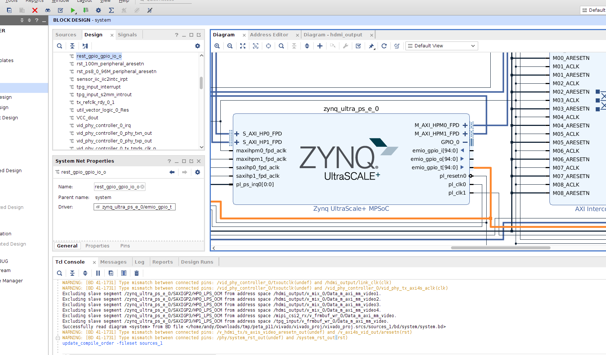

# 一般流程

## 进入容器

这里可以是`docker`, `podman`运行的容器, 或者是`distrobox`调用的`podman`容器, 为什么及怎么创建的不在这里记录了.

```bash
docker exec -it ubuntu_container /bin/bash

distrobox enter ubuntu1804 -- bash
distrobox enter ubuntu1804 -- bash --noprofile
```

切换成普通用户然后切换到目标目录

`podman`试下来很容易崩.


## 环境变量设置

```bash
source /opt/Xilinx/PetaLinux/2022.2/tool/settings.sh
```

## `xsa` 位置

```bash
mkdir hardware
# mv xsa to hardware folder
```

## 产生项目文件(工作目录)

```bash
petalinux-create -t project -n petalinux --template zynqMP
```

## 导入硬件信息

petalinux是工作目录

```bash
cd petalinux/
petalinux-config --get-hw-description ../vivado/xsa/
```

如果不想修改`project-spec/configs/config`, 也可以跳过`menuconfig`

```bash
petalinux-config --silentconfig --get-hw-description=../vivado/xsa/
```

更新 `xsa` 文件后，**一定要这样**

```bash
petalinux-build -x mrproper
petalinux-build										# == petalinux-build petalinux-image-minimal 
```
避免旧缓存导致 `DTS` 不更新的问题.

下面这样可以用于验证`dts`的修改

```
petalinux-build -c bootloader -x cleansstate
petalinux-build -c fsbl-firmware -x cleansstate
petalinux-build -c pmu-firmware -x cleansstate
petalinux-build -c u-boot -x cleansstate
petalinux-build -c linux-xlnx -x cleansstate
petalinux-build -c device-tree -x cleansstate
```

一次性执行

```
petalinux-build -c bootloader -x cleansstate && \
petalinux-build -c fsbl-firmware -x cleansstate && \
petalinux-build -c pmu-firmware -x cleansstate && \
petalinux-build -c u-boot -x cleansstate && \
petalinux-build -c linux-xlnx -x cleansstate && \
petalinux-build -c device-tree -x cleansstate
```

或者

```
for c in bootloader fsbl-firmware pmu-firmware u-boot linux-xlnx device-tree; do
    petalinux-build -c $c -x cleansstate
done
```

也可以`distclean`

```
petalinux-build -c bootloader -x distclean
```

这样还不行, 可以检查是否打开了内核等源码编译但没有提交patch的情况

```
petalinux-devtool status
petalinux-devtool update-recipe linux-xlnx -a ${PWD}/project-spec/meta-user
petalinux-devtool reset linux-xlnx
petalinux-devtool modify linux-xlnx -n
```


## 配置本地 `sstate` 和 `downloads` 目录

```bash
petalinux-config
```

```bash
Yocto Settings  --->
    Local sstate feeds settings  --->
        (file:///opt/Xilinx/PetaLinux/2022.2/sstate-cache) Local sstate feeds URL
    Add pre-mirror url  --->
        (file:///opt/Xilinx/PetaLinux/2022.2/downloads) Add pre-mirror url
```

原来的 pre-mirror url 是 `http://petalinux.xilinx.com/sswreleases/rel-v${PETALINUX_MAJOR_VER}/downloads`

体现在

```bash
build/conf/plnxtool.conf
```


## proxy等其他环境变量

```bash
export http_proxy="127.0.0.1:8118"
export https_proxy="127.0.0.1:8118"
export PETALINUX_SSTATE_LOC=/opt/Xilinx/PetaLinux/2022.2/sstate-cache
export PETALINUX_DOWNLOADS_LOC=/opt/Xilinx/PetaLinux/2022.2/downloads
//export YOCTO_NO_NETWORK=1
```


## 进一步配置
```bash
petalinux-config -c u-boot
petalinux-config -c kernel
petalinux-config -c rootfs
```

## 直接产生device-tree

这样可以基于自动生成的 device-tree 去编辑 `project-spec/meta-user/recipes-bsp/device-tree`

```
petalinux-config -c device-tree

or

petalinux-build -c device-tree -x do_configure
```

输出位于`components/plnx_workspace/device-tree/device-tree`


## 开始构建

```bash
petalinux-build

==
petalinux-build -c petalinux-image-minimal -x do_compile
```
单独编译某个软件

```
petalinux-build -c device-tree -x cleansstate
petalinux-build -c device-tree -x do_compile	== petalinux-build -c device-tree
```

### **构建加打包**

```
petalinux-build && petalinux-package --boot --u-boot --fpga --force
```


并行处理数量在`project-spec/configs/config`里配置

```bash
CONFIG_YOCTO_BB_NUMBER_THREADS=""
CONFIG_YOCTO_PARALLEL_MAKE=""
```

也可以在`project-spec/meta-user/conf/petalinuxbsp.conf`强行设置并行处理数量

```bash
BB_NUMBER_THREADS = "2"
PARALLEL_MAKE = "-j2"
```


清理

```bash
petalinux-build -x clean
petalinux-build -x cleansstate
petalinux-build -x mrproper             # 觉得最彻底

petalinux-build -x cleansstate  == bitbake petalinux-image-minimal -c cleansstate
```


## **构建完毕后产生目标文件**

```bash
petalinux-package --boot --u-boot --fpga --force

==
petalinux-package --boot \
 --fsbl images/linux/zynqmp_fsbl.elf \
 --u-boot \
 --pmufw images/linux/pmufw.elf \
 --fpga images/linux/system.bit \
 --force
 
 ls -lh images/linux/BOOT.BIN		# 检查BOOT.BIN的时间戳
```

默认就是`sd`卡启动`ramfs`

`petalinux/images/linux`目录下的这三个文件放到`vfat`格式的`sd/tf`卡就可以。记得启动拨码给对。

```bash
boot.scr
BOOT.BIN
image.ub
```

## 产生`sdk`
```bash
petalinux-build --sdk
```
输出在
```bash
build/tmp/deploy/sdk
```


## 产生`BSP`文件

`PetaLinux BSP` 是什么?  本质是一个 **`tar.gz`**，里面包含：

- 硬件描述（`XSA`）:	`project-spec/hw-description/`
- `PetaLinux` 配置:  	`project-spec/configs/config`, `project-spec/configs/rootfs_config`
- `Yocto layer / recipe` 的改动:   	`project-spec/meta-user/`
- 可选的预构建产物（一般不带）
- 可选的源码快照
- `BSP` 元信息:     `bsp.conf`, `README`等

BSP 是怎么“做”出来的?

* 准备一个“干净可用”的工程

  ```bash
  petalinux-create -t project -n my_board
  cd my_board
  ```

* 导入硬件

  ```bash
  petalinux-config --get-hw-description=path/to/xsa
  ```

* 配置系统

  ```bash
  petalinux-config
  petalinux-config -c rootfs
  ```

* 做所有定制

  这一阶段是 `BSP` 的“核心价值”, 比如：

  - 改设备树（meta-user）
  - 加驱动
  - 改 kernel config
  - 改 rootfs 包
  - 加应用

* 完整编译一次

  ```bash
  petalinux-build
  ```

  不 `build` 也能制作 `BSP`，但容易埋坑

* 打包 `BSP`

  ```bash
  petalinux-package --bsp
  
  # 可以指定名字
  petalinux-package --bsp --output my_board_2022_2.bsp
  ```

  

怎么用 `BSP `?

* 确保`petalinux`版本和产生`BSP`的一致

* 导入`BSP`

  ```bash
  petalinux-create -t project -s xxx.bsp
  cd xxx
  petalinux-build
  ```

* `BSP`不等于 build 产物, 是“能复现、能交付、能协作”的最小单位, 一块板子对应一个 `BSP`


## 直接修改已生成的 rootfs 镜像

### 情况 A：如果使用的是 CPIO 格式 (rootfs.cpio.gz)

‌**进入输出目录**

```
cd <plnx-proj-root>/images/linux
```

**解压 rootfs**

```
mkdir temp_rootfs
cd temp_rootfs
gunzip -c ../rootfs.cpio.gz | cpio -idmv
```

**修改文件**

‌**重新打包**

```
find . | cpio -H newc -o | gzip -9 > ../rootfs.cpio.gz.new
mv ../rootfs.cpio.gz.new ../rootfs.cpio.gz
cd ..
rm -rf temp_rootfs
```

**重新生成镜像**

如果 `BOOT.BIN` 或 `image.ub` 包含了旧的 rootfs，需要重新打包启动镜像

```
petalinux-package --boot --fsbl --fpga --u-boot --force
```

### 情况 B：如果使用的是 EXT4 格式 (rootfs.ext4)

**挂载镜像**

```
sudo mkdir /mnt/rootfs
sudo mount -o loop <plnx-proj-root>/images/linux/rootfs.ext4 /mnt/rootfs
```

**修改文件**

**卸载镜像**

```
sudo umount /mnt/rootfs
```

‌**重新打包**

```
petalinux-package --boot --fsbl --fpga --u-boot --force
```


# `minicom`

可以在`minicom -s`里去设置存储log文件

也可以通过参数产生log文件

`sudo minicom -C /path/to/logfile.txt`

用`tee`追加

`sudo minicom -C /tmp/minicom_log.txt | tee -a /tmp/minicom_log.txt`

那么, 可以这样. 直接tee保存终端输出

```
cd ~
sudo minicom ttyUSB0-115200 -c on | tee minicom.log							# 这里ttyUSB0-115200是一个保存好的串口配置
```


# 运行时查看设备树和内核选项

```
zcat /proc/config.gz | grep -i xxx

cd /sys/firmware/devicetree/base
cat ....
xxd ....

dtc -I fs -O dts -o myboard.dts /sys/firmware/devicetree/base
cat myboard.dts
```


# 问题处理1: PL设备节点名修正

`petalinux/components/plnx_workspace/device-tree/device-tree/pl.dtsi`自动产生endpoint名称有错误，

```bash
/home/andy/workdir/zirui/04_hdmi_tx/hdmi_tx_vdma_peta/petalinux/project-spec/configs/../../components/plnx_workspace/device-tree/device-tree/pl.dtsi:104.66-106.8: ERROR (phandle_references): /amba_pl@0/mipi_csi2_rx_subsystem@80050000/ports/port@1/endpoint: Reference to non-existent node or label "mipi_csi2_rx_axis_passthrough_mon_0mipi_csi2_rx_mipi_csi2_rx_subsyst_0"

/home/andy/workdir/zirui/04_hdmi_tx/hdmi_tx_vdma_peta/petalinux/project-spec/configs/../../components/plnx_workspace/device-tree/device-tree/pl.dtsi:206.48-208.8: ERROR (phandle_references): /amba_pl@0/v_proc_ss@80080000/ports/port@1/endpoint: Reference to non-existent node or label "mipi_csi2_rx_axis_switch_0mipi_csi2_rx_v_proc_ss_0"

/home/andy/workdir/zirui/04_hdmi_tx/hdmi_tx_vdma_peta/petalinux/project-spec/configs/../../components/plnx_workspace/device-tree/device-tree/pl.dtsi:243.44-245.8: ERROR (phandle_references): /amba_pl@0/v_tpg@800c0000/ports/port@1/endpoint: Reference to non-existent node or label "mipi_csi2_rx_axis_switch_0mipi_csi2_rx_v_tpg_0"
```

修改为正确的，继续编译，怎么修改呢？


## test0: 启用`dt overlay`
```bash
petalinux-build -c device-tree -x cleansstate
petalinux-build -c device-tree -x do_compile

petalinux-build -x cleansstate  == bitbake petalinux-image-minimal -c cleansstate
```

能编译通过，但是有啥作用呢？ 还是关闭掉，重置默认关闭

修改petalinux-config之后最有效的重置方法
```
petalinux-build -x clean        == bitbake petalinux-image-minimal -c clean
```

按理说只是device-tree这样也应该是彻底重置

```
petalinux-build -c device-tree -x clean
```


## test1: 先去掉`endpoint`
petalinux/project-spec/meta-user/recipes-bsp/device-tree/files/system-user.dtsi
```dtd
/*Add pl custom nodes for pl.dtsi which is generated from base xsa file.
Changes in this file reflects only when enabled the FPGA manager/Device tree overlay.*/
/ {
    user_test_property = <12345>;
};

&mipi_csi2_rx_mipi_csi2_rx_subsyst_0 {
    ports {
        // 覆盖 port@1（去掉 remote-endpoint 和 endpoint）
        port@1 {
            reg = <1>;
            xlnx,cfa-pattern = "rggb";
            xlnx,video-format = <12>;
            xlnx,video-width = <8>;
        };

        // 保留 port@0 并保持 data-lanes
        port@0 {
            reg = <0>;
            xlnx,cfa-pattern = "rggb";
            xlnx,video-format = <12>;
            xlnx,video-width = <8>;

            mipi_csi_in: endpoint {
                data-lanes = <1 2>;
            };
        };
    };
};
```

有命令
```shell
petalinux-build -c device-tree -x cleansstate
petalinux-build -c device-tree == petalinux-build -c device-tree -x do_compile
petalinux-build

grep -R "mipi" build/tmp/work/*/device-tree/*/system-top.dtb
find . -type f -name "system-top.dtb"
```

## test2: 补全`endpoint`
在git内体现


# 问题处理2: 没有检测到i2c设备
```bash
root@petalinux:~# i2cdetect -y 0  
     0  1  2  3  4  5  6  7  8  9  a  b  c  d  e  f
00:                         -- -- -- -- -- -- -- -- 
10: -- -- -- -- -- -- -- -- -- -- -- -- -- -- -- -- 
20: -- -- -- -- -- -- -- -- -- -- -- -- -- -- -- -- 
30: -- -- -- -- -- -- -- -- -- -- -- -- -- -- -- -- 
40: -- -- -- -- -- -- -- -- -- -- -- -- -- -- -- -- 
50: -- -- -- -- -- -- -- -- -- -- -- -- -- -- -- -- 
60: -- -- -- -- -- -- -- -- -- -- -- -- -- -- -- -- 
70: -- -- -- -- -- -- -- --                         
root@petalinux:~# i2cdetect -y 1  
     0  1  2  3  4  5  6  7  8  9  a  b  c  d  e  f
00:                         -- -- -- -- -- -- -- -- 
10: -- -- -- -- -- -- -- -- -- -- -- -- -- -- -- -- 
20: -- -- -- -- -- -- -- -- -- -- -- -- -- -- -- -- 
30: -- -- -- -- -- -- -- -- -- -- -- -- -- -- -- -- 
40: -- -- -- -- -- -- -- -- -- -- -- -- -- -- -- -- 
50: -- -- -- -- -- -- -- -- -- -- -- -- -- -- -- -- 
60: -- -- -- -- -- -- -- -- -- -- -- -- -- -- -- -- 
70: -- -- -- -- -- -- -- --                         
root@petalinux:~# i2cdetect -y 2
     0  1  2  3  4  5  6  7  8  9  a  b  c  d  e  f
00:                         -- -- -- -- -- -- -- -- 
10: -- -- -- -- -- -- -- -- -- -- -- -- -- -- -- -- 
20: -- -- -- -- -- -- -- -- -- -- -- -- -- -- -- -- 
30: -- -- -- -- -- -- -- -- -- -- -- -- -- -- -- -- 
40: -- -- -- -- -- -- -- -- -- -- -- -- -- -- -- -- 
50: -- -- -- -- -- -- -- -- -- -- -- -- -- -- -- -- 
60: -- -- -- -- -- -- -- -- -- -- -- -- -- -- -- -- 
70: -- -- -- -- -- -- -- --        

root@petalinux:~# i2cdetect -l  
i2c-0   i2c             i2c-gpio-0                              I2C adapter
i2c-1   i2c             i2c-gpio-1                              I2C adapter
i2c-2   i2c             i2c-gpio-2                              I2C adapter

oot@petalinux:~# ls -l /sys/class/i2c-adapter/                                                                                 
lrwxrwxrwx    1 root     root             0 May  8 09:13 i2c-0 -> ../../devices/platform/i2c-gpio-0/i2c-0
lrwxrwxrwx    1 root     root             0 May  8 09:13 i2c-1 -> ../../devices/platform/i2c-gpio-1/i2c-1
lrwxrwxrwx    1 root     root             0 May  8 09:13 i2c-2 -> ../../devices/platform/i2c-gpio-2/i2c-2

root@petalinux:~# dmesg | grep i2c-gpio
[    4.672369] i2c-gpio i2c-gpio-0: using lines 470 (SDA) and 471 (SCL)
[    4.682554] i2c-gpio i2c-gpio-1: using lines 472 (SDA) and 473 (SCL)
[    4.690846] i2c-gpio i2c-gpio-2: using lines 474 (SDA) and 475 (SCL)

zcat /proc/config.gz | grep -i i2c_gpio
cat /sys/kernel/debug/gpio
ls /proc/device-tree/i2c-gpio-0

i2cdetect -y -a 0
i2cdetect -y -a 1
i2cdetect -y -a 2
```

目前的`dts`

```dtd
    /* 创建 bit-banged I2C 总线 */
    i2c_gpio0: i2c-gpio-0 {
        compatible = "i2c-gpio";

        /* GPIO 引脚定义：SDA, SCL 必须是 input/output 皆可的 GPIO */
        /* SDA = GPIO0, SCL = GPIO1 */
        sda-gpios = <&xgpio_i2c_0_axi_gpio_0 0 GPIO_ACTIVE_HIGH>;
        scl-gpios = <&xgpio_i2c_0_axi_gpio_0 1 GPIO_ACTIVE_HIGH>;

        /* 可选：I2C 总线速度 (us)，100kHz = 5us，400kHz = 1.25us */
        i2c-gpio,delay-us = <5>;

        /* 可选：允许 SDA 读回，用于 bitbanging 协议正确性 */
        i2c-gpio,sda-open-drain;
        i2c-gpio,scl-open-drain;

        /* 允许 clock stretching: **默认支持！** 
             如需强制等待 SCL 释放，可写：
        */
        i2c-gpio,stretch-timeout-us = <50000>; /* 50ms */

        #address-cells = <1>;
        #size-cells = <0>;
    };

    i2c_gpio1: i2c-gpio-1 {
        compatible = "i2c-gpio";

        /* SDA = GPIO2, SCL = GPIO3 */
        sda-gpios = <&xgpio_i2c_0_axi_gpio_0 2 GPIO_ACTIVE_HIGH>;
        scl-gpios = <&xgpio_i2c_0_axi_gpio_0 3 GPIO_ACTIVE_HIGH>;

        /* 可选：I2C 总线速度 (us)，100kHz = 5us，400kHz = 1.25us */
        i2c-gpio,delay-us = <5>;

        /* 可选：允许 SDA 读回，用于 bitbanging 协议正确性 */
        i2c-gpio,sda-open-drain;
        i2c-gpio,scl-open-drain;

        /* 允许 clock stretching: **默认支持！** 
             如需强制等待 SCL 释放，可写：
        */
        i2c-gpio,stretch-timeout-us = <50000>; /* 50ms */

        #address-cells = <1>;
        #size-cells = <0>;
    };

    i2c_gpio2: i2c-gpio-2 {
        compatible = "i2c-gpio";

        /* SDA = GPIO4, SCL = GPIO5 */
        sda-gpios = <&xgpio_i2c_0_axi_gpio_0 4 GPIO_ACTIVE_HIGH>;
        scl-gpios = <&xgpio_i2c_0_axi_gpio_0 5 GPIO_ACTIVE_HIGH>;

        /* 可选：I2C 总线速度 (us)，100kHz = 5us，400kHz = 1.25us */
        i2c-gpio,delay-us = <5>;

        /* 可选：允许 SDA 读回，用于 bitbanging 协议正确性 */
        i2c-gpio,sda-open-drain;
        i2c-gpio,scl-open-drain;

        /* 允许 clock stretching: **默认支持！** 
             如需强制等待 SCL 释放，可写：
        */
        i2c-gpio,stretch-timeout-us = <50000>; /* 50ms */

        #address-cells = <1>;
        #size-cells = <0>;
    };
```


下面修改无效

```bash
&xgpio_i2c_0_axi_gpio_0 {
    xlnx,all-inputs = <0x0>;
    xlnx,all-outputs = <0xFFFFFFFF>;    /* 全部配置为输出 */
    xlnx,dout-default = <0xFFFFFFFF>;   /* 上电后的默认电平为高 */
    xlnx,tri-default = <0x0>;
};
```

```bash
&xgpio_i2c_0_axi_gpio_0 {
    #gpio-cells = <2>;
    gpio-controller;

    compatible = "xlnx,axi-gpio-2.0", "xlnx,xps-gpio-1.00.a";
    reg = <0x0 0x80110000 0x0 0x10000>;

    xlnx,gpio-width = <6>;
    xlnx,is-dual = <0>;

    /* 必须：全部 input，允许 i2c-gpio 控制 */
    xlnx,tri-default = <0xFFFFFFFF>;
};
```


有关命令
```bash
i2cdetect -y 1
i2cget -f -y 1 <addr> <reg>
i2cset -f -y 1 <addr> <reg> <val>
i2ctransfer -f -y 1 w1@<addr> <reg> r1
i2ctransfer -f -y 1 w2@0x6c 0x00 0x00 r1

```


板子上暂时也查看不了波形，放弃使用`gpio-i2c`. [**后面设置成功了!**]


# 更换为`axi-i2c`

## 问题1: 没有出现i2c节点
```bash
root@petalinux:~# i2cdetect -l
root@petalinux:~# i2cdetect -l
root@petalinux:~# ls /dev/i* -l
crw-------    1 root     root      246,   0 Mar 24 10:32 /dev/iio:device0
lrwxrwxrwx    1 root     root            12 Mar 24 10:32 /dev/initctl -> /run/initc
```

```bash
root@petalinux:~# dmesg | grep i2c
[    4.931796] i2c_dev: i2c /dev entries driver
[    5.580322] xiic-i2c 80010000.i2c: IRQ index 0 not found
[    5.591610] xiic-i2c 80020000.i2c: IRQ index 0 not found
[    5.604501] xiic-i2c 80030000.i2c: IRQ index 0 not found
```

看起来是缺少中断号，那么vivado把中断连上

测试`ok`，能检测到


# 从开发板到目标板

目标板没有tf卡插口，所以，设想先从qspi_flash启动ramfs。64MB的大小，需要55MB，能装下。

这个qspi启动的版本，可以用来mount usb设备然后刷emmc，emmc也分区，刷好后从emmc启动即可。比没有sd卡的其实费事一点。


## 一些文件的作用
```bash
image.ub: 包括内核、ramdisk、设备树dtb
u-boot.elf: 通用boot文件，负责将image.ub从flash、sd卡等load到DDR中
zynqmp_fsbl.elf: 加载bitstream，初始化DDR，初始化时钟PLL等，加载u-boot
```

## 打包产生BOOT.bin
```bash
petalinux-package --boot --fsbl --fpga --u-boot --kernel --force
```

### 报错
```bash
$ petalinux-package --boot --fsbl --fpga --u-boot --kernel --force
[INFO] Sourcing buildtools
INFO: Getting system flash information...
INFO: File in BOOT BIN: "/home/andy/workdir/zirui/04_hdmi_tx/hdmi_tx_vdma_peta1/petalinux/images/linux/zynqmp_fsbl.elf"
INFO: File in BOOT BIN: "/home/andy/workdir/zirui/04_hdmi_tx/hdmi_tx_vdma_peta1/petalinux/images/linux/pmufw.elf"
INFO: File in BOOT BIN: "/home/andy/workdir/zirui/04_hdmi_tx/hdmi_tx_vdma_peta1/petalinux/project-spec/hw-description/system_wrapper.bit"
INFO: File in BOOT BIN: "/home/andy/workdir/zirui/04_hdmi_tx/hdmi_tx_vdma_peta1/petalinux/images/linux/bl31.elf"
INFO: File in BOOT BIN: "/home/andy/workdir/zirui/04_hdmi_tx/hdmi_tx_vdma_peta1/petalinux/images/linux/system.dtb"
INFO: File in BOOT BIN: "/home/andy/workdir/zirui/04_hdmi_tx/hdmi_tx_vdma_peta1/petalinux/images/linux/u-boot.elf"
INFO: File in BOOT BIN: "/home/andy/workdir/zirui/04_hdmi_tx/hdmi_tx_vdma_peta1/petalinux/images/linux/image.ub"
INFO: File in BOOT BIN: "/home/andy/workdir/zirui/04_hdmi_tx/hdmi_tx_vdma_peta1/petalinux/images/linux/boot.scr"
INFO: Generating zynqmp binary package BOOT.BIN...


****** Xilinx Bootgen v2022.2
  **** Build date : Sep 26 2022-06:24:42
    ** Copyright 1986-2022 Xilinx, Inc. All Rights Reserved.

[ERROR]  : Section image.ub.0 offset of 0x100000 overlaps with prior section end address of 0xCD5880
ERROR: Fail to create BOOT image
```


修改flash分区配置
```bash
petalinux-config
```
增加到`0xD00000`,然后
```bash
petalinux-build
```

生成烧写文件
```bash
petalinux-package --boot --fsbl --fpga --u-boot --kernel --force
du -b images/linux/BOOT.BIN | awk '{print substr($1,$2)}' | xargs -I {} printf "%x\n" {} 
3e80adc
```

烧写, 新开一个terminal
```bash
source /opt/Xilinx/Vitis/2022.2/settings64.sh
program_flash -f images/linux/BOOT.BIN -offset 0 -flash_type qspi-x8-dual_parallel -fsbl images/linux/zynqmp_fsbl.elf -url TCP:127.0.0.1:3121 
```

板卡输出, 超出了?
```bash
SF: Detected w25q256fw with page size 512 Bytes, erase size 128 KiB, total 64 MiB
Size exceeds partition or device limit
sf - SPI flash sub-system

Usage:
sf probe [[bus:]cs] [hz] [mode] - init flash device on given SPI bus
                                  and chip select
sf read addr offset|partition len       - read `len' bytes starting at
                                          `offset' or from start of mtd
                                          `partition'to memory at `addr'
sf write addr offset|partition len      - write `len' bytes from memory
                                          at `addr' to flash at `offset'
                                          or to start of mtd `partition'
sf erase offset|partition [+]len        - erase `len' bytes from `offset'
                                          or from start of mtd `partition'
                                         `+len' round up `len' to block size
sf update addr offset|partition len     - erase and write `len' bytes from memory
                                          at `addr' to flash at `offset'
                                          or to start of mtd `partition'
sf protect lock/unlock sector len       - protect/unprotect 'len' bytes starting
                                          at address 'sector'

```

`64×1024×1024=0x4000000`, 没有超出

自动产生的bootgen.bif文件
```
the_ROM_image:
{
	[bootloader, destination_cpu=a53-0] /home/andy/workdir/zirui/04_hdmi_tx/hdmi_tx_vdma_peta1/petalinux/images/linux/zynqmp_fsbl.elf
	[pmufw_image] /home/andy/workdir/zirui/04_hdmi_tx/hdmi_tx_vdma_peta1/petalinux/images/linux/pmufw.elf
	[destination_device=pl] /home/andy/workdir/zirui/04_hdmi_tx/hdmi_tx_vdma_peta1/petalinux/project-spec/hw-description/system_wrapper.bit
	[destination_cpu=a53-0, exception_level=el-3, trustzone] /home/andy/workdir/zirui/04_hdmi_tx/hdmi_tx_vdma_peta1/petalinux/images/linux/bl31.elf
	[destination_cpu=a53-0, load=0x00100000] /home/andy/workdir/zirui/04_hdmi_tx/hdmi_tx_vdma_peta1/petalinux/images/linux/system.dtb
	[destination_cpu=a53-0, exception_level=el-2] /home/andy/workdir/zirui/04_hdmi_tx/hdmi_tx_vdma_peta1/petalinux/images/linux/u-boot.elf
	[destination_cpu=a53-0, offset=0xd00000, partition_owner=uboot] /home/andy/workdir/zirui/04_hdmi_tx/hdmi_tx_vdma_peta1/petalinux/images/linux/image.ub
	[destination_cpu=a53-0, offset=0x3E80000, partition_owner=uboot] /home/andy/workdir/zirui/04_hdmi_tx/hdmi_tx_vdma_peta1/petalinux/images/linux/boot.scr
}
```

其实qspi里面的工程不需要pl部分的, 新建一个最小系统来放到qspi_flash吧


# 最小系统

`zirui/04_hdmi_tx/mini`工程产生和验证了`xsa`文件

先按一般流程进行编译

然后生成烧写文件

## 打包命令

```bash
petalinux-package --boot --fsbl --u-boot --kernel --force
```

~~需要修改 `CONFIG_SUBSYSTEM_FLASH_PSU_QSPI_0_BANKLESS_PART0_SIZE=0x1B0000`~~

```bash
$ petalinux-package --boot --fsbl --u-boot --kernel --force
[INFO] Sourcing buildtools
INFO: Getting system flash information...
INFO: File in BOOT BIN: "/home/andy/workdir/zirui/04_hdmi_tx/mini_peta/petalinux/images/linux/zynqmp_fsbl.elf"
INFO: File in BOOT BIN: "/home/andy/workdir/zirui/04_hdmi_tx/mini_peta/petalinux/images/linux/pmufw.elf"
INFO: File in BOOT BIN: "/home/andy/workdir/zirui/04_hdmi_tx/mini_peta/petalinux/images/linux/bl31.elf"
INFO: File in BOOT BIN: "/home/andy/workdir/zirui/04_hdmi_tx/mini_peta/petalinux/images/linux/system.dtb"
INFO: File in BOOT BIN: "/home/andy/workdir/zirui/04_hdmi_tx/mini_peta/petalinux/images/linux/u-boot.elf"
INFO: File in BOOT BIN: "/home/andy/workdir/zirui/04_hdmi_tx/mini_peta/petalinux/images/linux/image.ub"
INFO: File in BOOT BIN: "/home/andy/workdir/zirui/04_hdmi_tx/mini_peta/petalinux/images/linux/boot.scr"
INFO: Generating zynqmp binary package BOOT.BIN...


****** Xilinx Bootgen v2022.2
  **** Build date : Sep 26 2022-06:24:42
    ** Copyright 1986-2022 Xilinx, Inc. All Rights Reserved.

[ERROR]  : Section image.ub.0 offset of 0x100000 overlaps with prior section end address of 0x1A4880
ERROR: Fail to create BOOT image
```
~~其实还是超大, 怎么还是和前面那个一样大呢?~~

```bash
du -b images/linux/BOOT.BIN | awk '{print substr($1,$2)}' | xargs -I {} printf "0x%x\n" {} 
0x3e80adc
```

~~计算一下~~

```bash
zynqmp_fsbl.elf     462.4KB
pmufw.elf           496.6KB
bl31.elf            152.5KB
system.dtb           37.7KB
u-boot.elf            9.3MB
image.ub             35.4MB
boot.scr              2.8KB
```
~~总大小肯定没有超过~~

~~自动产生的bootgen.bif文件~~

```bash
the_ROM_image:
{
	[bootloader, destination_cpu=a53-0] /home/andy/workdir/zirui/04_hdmi_tx/mini_peta/petalinux/images/linux/zynqmp_fsbl.elf
	[pmufw_image] /home/andy/workdir/zirui/04_hdmi_tx/mini_peta/petalinux/images/linux/pmufw.elf
	[destination_cpu=a53-0, exception_level=el-3, trustzone] /home/andy/workdir/zirui/04_hdmi_tx/mini_peta/petalinux/images/linux/bl31.elf
	[destination_cpu=a53-0, load=0x00100000] /home/andy/workdir/zirui/04_hdmi_tx/mini_peta/petalinux/images/linux/system.dtb
	[destination_cpu=a53-0, exception_level=el-2] /home/andy/workdir/zirui/04_hdmi_tx/mini_peta/petalinux/images/linux/u-boot.elf
	[destination_cpu=a53-0, offset=0x1b0000, partition_owner=uboot] /home/andy/workdir/zirui/04_hdmi_tx/mini_peta/petalinux/images/linux/image.ub
	[destination_cpu=a53-0, offset=0x3E80000, partition_owner=uboot] /home/andy/workdir/zirui/04_hdmi_tx/mini_peta/petalinux/images/linux/boot.scr
}
```
~~最后那个boot.scr给的地址太大了~~

## 计算并显示某文件的十六进制大小

```bash
du -b images/linux/image.ub | awk '{print substr($1,$2)}' | xargs -I {} printf "0x%x\n" {} 
0x21ba510
```

~~计算boot.scr偏移~~

```bash
1b0000+21ba510=236A510
```
~~取0x2400000~~

~~修改bootgen.bif文件~~

```bash
the_ROM_image:
{
	[bootloader, destination_cpu=a53-0] /home/andy/workdir/zirui/04_hdmi_tx/mini_peta/petalinux/images/linux/zynqmp_fsbl.elf
	[pmufw_image] /home/andy/workdir/zirui/04_hdmi_tx/mini_peta/petalinux/images/linux/pmufw.elf
	[destination_cpu=a53-0, exception_level=el-3, trustzone] /home/andy/workdir/zirui/04_hdmi_tx/mini_peta/petalinux/images/linux/bl31.elf
	[destination_cpu=a53-0, load=0x00100000] /home/andy/workdir/zirui/04_hdmi_tx/mini_peta/petalinux/images/linux/system.dtb
	[destination_cpu=a53-0, exception_level=el-2] /home/andy/workdir/zirui/04_hdmi_tx/mini_peta/petalinux/images/linux/u-boot.elf
	[destination_cpu=a53-0, offset=0x1b0000, partition_owner=uboot] /home/andy/workdir/zirui/04_hdmi_tx/mini_peta/petalinux/images/linux/image.ub
	[destination_cpu=a53-0, offset=0x2400000, partition_owner=uboot] /home/andy/workdir/zirui/04_hdmi_tx/mini_peta/petalinux/images/linux/boot.scr
}

```


## 关键设置

修改project-spec/configs/config里这几个

```bash
CONFIG_SUBSYSTEM_FLASH_PSU_QSPI_0_BANKLESS_PART0_SIZE=0x1B0000
CONFIG_SUBSYSTEM_UBOOT_QSPI_FIT_IMAGE_OFFSET=0x1B0000
CONFIG_SUBSYSTEM_UBOOT_QSPI_FIT_IMAGE_SIZE=0x2200000
```

最终限制是`qspi falsh`的容量, 这样就要根据原始大小调整文件地址分布


## 通过vitis命令产生 BOOT.BIN

新开一个terminal

```bash
source /opt/Xilinx/Vitis/2022.2/settings64.sh
bootgen -image images/linux/bootgen.bif -arch zynqmp -o images/linux/BOOT.BIN
du -b images/linux/BOOT.BIN | awk '{print substr($1,$2)}' | xargs -I {} printf "0x%x\n" {} 
0x2400adc
```
这次大小总算合适了


## 通过vitis命令烧写

新开一个terminal

```bash
source /opt/Xilinx/Vitis/2022.2/settings64.sh
program_flash -f images/linux/BOOT.BIN -offset 0 -flash_type qspi-x8-dual_parallel -fsbl images/linux/zynqmp_fsbl.elf -url TCP:127.0.0.1:3121 
```

这次显示的
```bash
Xilinx Zynq MP First Stage Boot Loader 
Release 2022.2   Oct  7 2022  -  04:56:16
NOTICE:  BL31: v2.6(release):xlnx_rebase_v2.6_2022.1_update3-18-g0897efd45
NOTICE:  BL31: Built : 03:55:03, Sep  9 2022

```

正常应该
```bash
Xilinx Zynq MP First Stage Boot Loader 
Release 2022.2   Oct  7 2022  -  04:56:16
NOTICE:  BL31: v2.6(release):xlnx_rebase_v2.6_2022.1_update3-18-g0897efd45
NOTICE:  BL31: Built : 03:55:03, Sep  9 2022


U-Boot 2022.01 (Sep 20 2022 - 06:35:33 +0000)

CPU:   ZynqMP
Silicon: v3
Board: Xilinx ZynqMP
DRAM:  4 GiB
PMUFW:  v1.1
PMUFW no permission to change config object
EL Level:       EL2
Chip ID:        zu7ev
NAND:  0 MiB
MMC:   mmc@ff160000: 0, mmc@ff170000: 1
Loading Environment from SPIFlash...
```
也就是 u-boot 没有启动


对比bootgen.bif文件发现0x3E80000是固定的, `grep -R 3E80000` 

```bash
build/tmp/work/x86_64-linux/qemu-xilinx-system-native/v6.1.0-xilinx-v2022.2+gitAUTOINC+74d70f8008-r0/git/roms/u-boot/board/xilinx/Kconfig:	default 0x3E80000 if ARCH_ZYNQMP
build/tmp/work/zynqmp_generic-xilinx-linux/u-boot-xlnx/v2021.01-xilinx-v2022.2+gitAUTOINC+b31476685d-r0/build/source/board/xilinx/Kconfig:	default 0x3E80000 if ARCH_ZYNQMP
build/tmp/work/zynqmp_generic-xilinx-linux/u-boot-xlnx/v2021.01-xilinx-v2022.2+gitAUTOINC+b31476685d-r0/build/include/generated/autoconf.h:#define CONFIG_BOOT_SCRIPT_OFFSET 0x3E80000
build/tmp/work/zynqmp_generic-xilinx-linux/u-boot-xlnx/v2021.01-xilinx-v2022.2+gitAUTOINC+b31476685d-r0/build/include/config/auto.conf:CONFIG_BOOT_SCRIPT_OFFSET=0x3E80000
build/tmp/work/zynqmp_generic-xilinx-linux/u-boot-xlnx/v2021.01-xilinx-v2022.2+gitAUTOINC+b31476685d-r0/build/.config.old:CONFIG_BOOT_SCRIPT_OFFSET=0x3E80000
build/tmp/work/zynqmp_generic-xilinx-linux/u-boot-xlnx/v2021.01-xilinx-v2022.2+gitAUTOINC+b31476685d-r0/build/spl/u-boot.cfg:#define CONFIG_BOOT_SCRIPT_OFFSET 0x3E80000
build/tmp/work/zynqmp_generic-xilinx-linux/u-boot-xlnx/v2021.01-xilinx-v2022.2+gitAUTOINC+b31476685d-r0/build/.config:CONFIG_BOOT_SCRIPT_OFFSET=0x3E80000
build/tmp/work/zynqmp_generic-xilinx-linux/u-boot-xlnx/v2021.01-xilinx-v2022.2+gitAUTOINC+b31476685d-r0/build/u-boot.cfg:#define CONFIG_BOOT_SCRIPT_OFFSET 0x3E80000
build/tmp/work/zynqmp_generic-xilinx-linux/u-boot-xlnx/v2021.01-xilinx-v2022.2+gitAUTOINC+b31476685d-r0/git/board/xilinx/Kconfig:	default 0x3E80000 if ARCH_ZYNQMP

```
可见, u-boot 的 CONFIG_BOOT_SCRIPT_OFFSET 是关键 ( abort )

```bash
petalinux-config -c u-boot
```
修改`Boot script offset`为`0x2400000`


```bash
petalinux-build -c u-boot -x clean
petalinux-build -c u-boot -x do_compile
petalinux-package --boot --fsbl --u-boot --kernel --force
```
bootgen.bif文件没有变


```bash
petalinux-build -x mrproper
petalinux-build

```

bootgen.bif文件还是没有变

实际上`0x3E80000`也没有超出`64MB`的范围, 再分析启动过程

```bash
Hit any key to stop autoboot:  0 
SF: Detected w25q256fw with page size 512 Bytes, erase size 128 KiB, total 64 MiB
device 0 offset 0x3e80000, size 0x80000
SF: 524288 bytes @ 0x3e80000 Read: OK
QSPI: Trying to boot script at 20000000
## Executing script at 20000000
Trying to load boot images from qspi0
SF: Detected w25q256fw with page size 512 Bytes, erase size 128 KiB, total 64 MiB
Size exceeds partition or device limit
sf - SPI flash sub-system

Usage:
sf probe [[bus:]cs] [hz] [mode] - init flash device on given SPI bus
                                  and chip select
sf read addr offset|partition len       - read `len' bytes starting at
                                          `offset' or from start of mtd
                                          `partition'to memory at `addr'
sf write addr offset|partition len      - write `len' bytes from memory
                                          at `addr' to flash at `offset'
                                          or to start of mtd `partition'
sf erase offset|partition [+]len        - erase `len' bytes from `offset'
                                          or from start of mtd `partition'
                                         `+len' round up `len' to block size
sf update addr offset|partition len     - erase and write `len' bytes from memory
                                          at `addr' to flash at `offset'
                                          or to start of mtd `partition'
sf protect lock/unlock sector len       - protect/unprotect 'len' bytes starting
                                          at address 'sector'

sf test offset len              - run a very basic destructive test
Wrong Image Format for bootm command
ERROR: can't get kernel image!
Booting using Fit image failed
device 0 offset 0xf00000, size 0x1d00000
SF: 30408704 bytes @ 0xf00000 Read: OK
Offset exceeds device limit
```

再看 `boot.scr`

```bash
	if test "${boot_target}" = "xspi0" || test "${boot_target}" = "qspi" || test "${boot_target}" = "qspi0"; then
		sf probe 0 0 0;
		sf read 0x10000000 0xF40000 0x6400000
		bootm 0x10000000;
		echo "Booting using Fit image failed"

		sf read 0x00200000 0xF00000 0x1D00000
		sf read 0x04000000 0x4000000 0x4000000
		booti 0x00200000 0x04000000 0x00100000;
		echo "Booting using Separate images failed"
	fi
```

也就是说, 修改config的u-boot菜单里的偏移量就可以呗

## 可以通过u-boot命令进行验证`boot.scr`

```bash
		sf probe 0 0 0;
		sf read 0x10000000 0x1B0000 0x2200000
		bootm 0x10000000;
```

验证通过

## 总结

打包命令 会产生 `petalinux/images/linux/bootgen.bif` 文件, 核对其中偏移量

一般需要修改project-spec/configs/config里这几个
```bash
CONFIG_SUBSYSTEM_FLASH_PSU_QSPI_0_BANKLESS_PART0_SIZE=0x1B0000
CONFIG_SUBSYSTEM_UBOOT_QSPI_FIT_IMAGE_OFFSET=0x1B0000
CONFIG_SUBSYSTEM_UBOOT_QSPI_FIT_IMAGE_SIZE=0x2200000
```
`u-boot`的`Boot script offset`在2022.2这个版本覆盖定义之后似乎没有起作用. 如果实在要重定义, 手动用`vitis`命令配合修改的`bootgen.bif`产生打包文件

`fitimage_name=image.ub`, 而且要核对`petalinux/images/linux/boot.scr`对应启动方式的偏移量和大小. 可以通过`u-boot`有关命令进行验证

通过前面的几个步骤就可以产生最终的单一烧写镜像文件. 可以烧写到`qspi flash`, 启动之后可以对`emmc`进行刷写(目标板子没有留`sd`卡接口).

如果`emmc`的系统挂了, 这个办法去抢救是最好的了.


## Zynq UltraScale+ MPSoC 启动模式  — 4‑bit BOOT_MODE[3:0] 拨码表

| 4‑bit BOOT_MODE | 启动源名称   | 说明                                                    |
| --------------- | ------------ | ------------------------------------------------------- |
| `0000`          | JTAG         | Host JTAG 下载或调试启动                                |
| `0001`          | QSPI24       | Quad‑SPI Flash, 24‑bit 地址                             |
| `0010`          | QSPI32       | Quad‑SPI Flash, 32‑bit 地址                             |
| `0011`          | SD0 (2.0)    | SD 卡接口 0 (SD 2.0)                                    |
| `0100`          | NAND         | NAND Flash 启动                                         |
| `0101`          | SD1 (2.0)    | SD 卡接口 1 (SD 2.0)                                    |
| `0110`          | eMMC (1.8V)  | eMMC 启动 (1.8V signaling)                              |
| `0111`          | USB (2.0)    | USB DFU 设备引导                                        |
| `1000`          | PJTAG MIO#0  | Parallel/JTAG through MIO #0 (特定板载选择，用于 debug) |
| `1001`          | PJTAG MIO#1  | Parallel/JTAG through MIO #1                            |
| `1010`          | (保留)       | 未定义/保留                                             |
| `1011`          | (保留)       | 未定义/保留                                             |
| `1100`          | SD1 (3.0 LS) | SD 3.0 with level shifter                               |
| `1101`          | (保留)       | 未定义/扩展                                             |
| `1110`          | (保留)       | 未定义/扩展                                             |
| `1111`          | (保留)       | 未定义/扩展                                             |

> 1. **低 3 位（BOOT_MODE[2:0]）是 Boot ROM 真正读取的核心引脚数值**，高位 BOOT_MODE[3] 是用于板级扩展/记录不同接口选择。  
> 2. QSPI24/32 → 表示不同宽度的 QSPI Flash 地址宽度模式（24‑bit / 32‑bit），对于生成 Boot 镜像和 Bootgen 参数不同。 :contentReference[oaicite:1]{index=1}  
> 3. SD0/SD1 对应板子上不同 SD 接口的 MIO 引脚组合。 `SD1 (3.0 LS)` 是带电平转换支持 SD 3.0 卡的模式。 :contentReference[oaicite:2]{index=2}  
> 4. USB 引导是采用 DFU（device firmware upgrade）标准方式。 :contentReference[oaicite:3]{index=3}

## 示例拨码说明（常见板子/跳线）

| 设备/板子          | 4‑bit 设置 | 启动模式    | 备注             |
| ------------------ | ---------- | ----------- | ---------------- |
| 默认 SD 卡启动     | `0011`     | SD0 Boot    | SD 卡接口 0      |
| 用 QSPI Flash 启动 | `0010`     | QSPI32 Boot | 32‑bit 地址 QSPI |
| JTAG 调试下载      | `0000`     | JTAG Boot   | BootROM 等待下载 |
| eMMC 启动          | `0110`     | eMMC Boot   | 通常用于产品固化 |

> 实际硬件上，根据板载开关/SW6/SW8 标识，将 BOOT_MODE[3:0] 连接到 PS MODE 引脚（MIO25/MIO … 等）即可。不同板子标注可能略微不同，按上表理解最核心的低 3 位即可。 :contentReference[oaicite:4]{index=4}

# `IDT_8T49N241`地址问题

`datasheet`中有这样的描述

```
These values are specific to the device configuration and can be customized when ordering. Generic dash codes -900 through -902,
-998 and -999 are available and programmed with the default I2C address of 1111100b. Please refer to the FemtoClock NG Universal
Frequency Translator Ordering Product Information guide for more details.
```

那么默认地址就是 7-bit 的 0x7c

规范上属于`reserved for future use`，但 `Renesas`故意选这个地址来避免总线冲突。合法，但不建议普通设备使用。


## `xgpio`引脚进行复位

### 先确定引脚号

```bash
root@petalinux:~# ls -l /sys/class/gpio
total 0
--w-------    1 root     root          4096 Mar 26 05:03 export
lrwxrwxrwx    1 root     root             0 Mar 26 05:03 gpiochip302 -> ../../devices/platform/axi/ff0a0000.gpio/gpio/gpiochip302
lrwxrwxrwx    1 root     root             0 Mar 26 05:03 gpiochip476 -> ../../devices/platform/amba_pl@0/80100000.gpio/gpio/gpiochip476
lrwxrwxrwx    1 root     root             0 Mar 26 05:03 gpiochip508 -> ../../devices/platform/firmware:zynqmp-firmware/firmware:zynqmp-firmware:gpio/gpio/gpiochip508
--w-------    1 root     root          4096 Mar 26 05:03 unexport


ls /proc/device-tree/amba_pl\@0/gpio\@80100000/


hexdump -C /proc/device-tree/amba_pl\@0/gpio\@80100000/xlnx\,tri-default
hexdump -C /proc/device-tree/amba_pl\@0/gpio\@80100000/xlnx\,all-outputs


ls /proc/device-tree/amba_pl@0/ | grep gpio


grep -R "80100000" /proc/device-tree/__symbols__                                                                               
/proc/device-tree/__symbols__/rest_gpio:/amba_pl@0/gpio@80100000


root@petalinux:~# cat /sys/class/gpio/gpiochip476/label 
80100000.gpio


for c in gpiochip470 gpiochip476 gpiochip508 gpiochip296; do
  echo "=== $c ==="
  cat /sys/class/gpio/$c/base
  cat /sys/class/gpio/$c/ngpio
  cat /sys/class/gpio/$c/label 2>/dev/null || true
  readlink -f /sys/class/gpio/$c/device
  echo
done


=== gpiochip476 ===
476
32
80100000.gpio
/sys/devices/platform/amba_pl@0/80100000.gpio

```


### 导出节点

导出节点（如果还没导出）到用户空间

```bash
echo 476 > /sys/class/gpio/export
```

这样就生成了`/sys/class/gpio/gpio476`节点

```bash
root@petalinux:~# ls /sys/class/gpio
export       gpio476      gpiochip302  gpiochip476  gpiochip508  unexport
```

### 设置输入输出方向

```bash
echo out > /sys/class/gpio/gpio476/direction

cat /sys/class/gpio/gpio476/direction
```

### 设置输出值

```bash
echo 1 > /sys/class/gpio/gpio476/value   # 拉高
echo 0 > /sys/class/gpio/gpio476/value   # 拉低

cat /sys/class/gpio/gpio476/value
```

## 其他的几个复位 pin

```bash
echo 477 > /sys/class/gpio/export
echo 478 > /sys/class/gpio/export
echo out > /sys/class/gpio/gpio477/direction
echo out > /sys/class/gpio/gpio478/direction
echo 1 > /sys/class/gpio/gpio477/value
echo 1 > /sys/class/gpio/gpio478/value
cat /sys/class/gpio/gpio477/direction
cat /sys/class/gpio/gpio477/value
cat /sys/class/gpio/gpio478/direction
cat /sys/class/gpio/gpio478/value
```

## 扫描总线

复位设备之后扫描总线

地址是0x7c, 这样i2cdetect是访问不了吗? `-a` 就可以访问了

```bash
root@petalinux:/sys/class/gpio# i2cdetect -y -a 0
     0  1  2  3  4  5  6  7  8  9  a  b  c  d  e  f
00: -- -- -- -- -- -- -- -- -- -- -- -- -- -- -- -- 
10: -- -- -- -- -- -- -- -- -- -- -- -- -- -- -- -- 
20: -- -- -- -- -- -- -- -- -- -- -- -- -- -- -- -- 
30: -- -- -- -- -- -- -- -- -- -- -- -- 3c -- -- -- 
40: -- -- -- -- -- -- -- -- -- -- -- -- -- -- -- -- 
50: -- -- -- -- -- -- -- -- -- -- -- -- -- -- -- -- 
60: -- -- -- -- -- -- -- -- -- -- -- -- -- -- -- -- 
70: -- -- -- -- -- -- -- -- -- -- -- -- -- -- -- -- 
root@petalinux:/sys/class/gpio# i2cdetect -y -a 1
     0  1  2  3  4  5  6  7  8  9  a  b  c  d  e  f
00: -- -- -- -- -- -- -- -- -- -- -- -- -- -- -- -- 
10: -- -- -- -- -- -- -- -- -- -- -- -- -- -- -- -- 
20: -- -- -- -- -- -- -- -- -- -- -- -- -- -- -- -- 
30: -- -- -- -- -- -- -- -- -- -- -- -- -- -- -- -- 
40: -- -- -- -- -- -- -- -- -- -- -- -- -- -- -- -- 
50: -- -- -- -- -- -- -- -- -- -- -- -- -- -- -- -- 
60: -- -- -- -- -- -- -- -- -- -- -- -- -- -- -- -- 
70: -- -- -- -- -- -- -- -- -- -- -- -- 7c -- -- -- 
root@petalinux:/sys/class/gpio# i2cdetect -y -a 2
     0  1  2  3  4  5  6  7  8  9  a  b  c  d  e  f
00: -- -- -- -- -- -- -- -- -- -- -- -- -- -- -- -- 
10: -- -- -- -- -- -- -- -- -- -- -- -- -- -- -- -- 
20: -- -- -- -- -- -- -- -- -- -- -- -- -- -- -- -- 
30: -- -- -- -- -- -- -- -- -- -- -- -- -- -- -- -- 
40: -- -- -- -- -- -- -- -- -- -- -- -- -- -- -- -- 
50: -- -- -- -- -- -- -- -- -- -- -- -- 5c -- 5e -- 
60: -- -- -- -- -- -- -- -- -- -- -- -- -- -- -- -- 
70: -- -- -- -- -- -- -- -- -- -- -- -- -- -- -- -- 
```

## 访问设备

```bash
root@petalinux:~# i2cdetect -y -a 1
     0  1  2  3  4  5  6  7  8  9  a  b  c  d  e  f
00: -- -- -- -- -- -- -- -- -- -- -- -- -- -- -- -- 
10: -- -- -- -- -- -- -- -- -- -- -- -- -- -- -- -- 
20: -- -- -- -- -- -- -- -- -- -- -- -- -- -- -- -- 
30: -- -- -- -- -- -- -- -- -- -- -- -- -- -- -- -- 
40: -- -- -- -- -- -- -- -- -- -- -- -- -- -- -- -- 
50: -- -- -- -- -- -- -- -- -- -- -- -- -- -- -- -- 
60: -- -- -- -- -- -- -- -- -- -- -- -- -- -- -- -- 
70: -- -- -- -- -- -- -- -- -- -- -- -- UU -- -- --

# 扩展到0x7f总线地址, 且强制访问(无论是否和驱动绑定), 像下面这样用就行
i2ctransfer -y -a -f 1 w2@0x7c 0x00 0x70 r1
i2ctransfer -y -a -f 1 w3@0x7c 0x00 0x70 0x05
```


## 用`i2ctransfer`而不是`i2cget/i2cset`

读 16-bit 地址 + 8-bit 数据

```bash
root@petalinux:/sys/class/gpio# i2ctransfer -y -a -f 1 w2@0x7c 0x00 0x03 r1
0x60
```

读 **16-bit 地址 + 16-bit 数据**

```bash
root@petalinux:/sys/class/gpio# i2ctransfer -y -a -f 1 w2@0x7c 0x00 0x02 r2
0x00 0x60
```

读 寄存器地址 `0x0020` 起的长度 4字节

```bash
i2ctransfer -y -a -f 1 w2@0x7c 0x00 0x20 r4
```

16-bit寄存器地址写单字节

```bash
i2ctransfer -y -a -f 1 w3@0x7c 0x00 0x20 0x5A
```

16-bit寄存器地址写双字节

```bash
i2ctransfer -y -a -f 1 w4@0x7c 0x00 0x20 0x12 0x34
```

i2cget 只能发送 8-bit寄存器地址, 无法发送 16-bit寄存器地址。 所以

```bash
root@petalinux:/sys/class/gpio# i2cget -f -y -a 1 0x7c 0x00 0x03
Error: Invalid mode!
Usage: i2cget [-f] [-y] [-a] I2CBUS CHIP-ADDRESS [DATA-ADDRESS [MODE [LENGTH]]]
  I2CBUS is an integer or an I2C bus name
  ADDRESS is an integer (0x08 - 0x77, or 0x00 - 0x7f if -a is given)
  MODE is one of:
    b (read byte data, default)
    w (read word data)
    c (write byte/read byte)
    s (read SMBus block data)
    i (read I2C block data)
    Append p for SMBus PEC
  LENGTH is the I2C block data length (between 1 and 32, default 32)
```

目标板上也进行类似操作即可

```bash
root@petalinux:~# echo 476 > /sys/class/gpio/export
root@petalinux:~# echo out > /sys/class/gpio/gpio476/direction
root@petalinux:~# echo 1 > /sys/class/gpio/gpio476/value
root@petalinux:~# i2cdetect -y -a 1
     0  1  2  3  4  5  6  7  8  9  a  b  c  d  e  f
00: -- -- -- -- -- -- -- -- -- -- -- -- -- -- -- -- 
10: -- -- -- -- -- -- -- -- -- -- -- -- -- -- -- -- 
20: -- -- -- -- -- -- -- -- -- -- -- -- -- -- -- -- 
30: -- -- -- -- -- -- -- -- -- -- -- -- -- -- -- -- 
40: -- -- -- -- -- -- -- -- -- -- -- -- -- -- -- -- 
50: -- -- -- -- -- -- -- -- -- -- -- -- -- -- -- -- 
60: -- -- -- -- -- -- -- -- -- -- -- -- -- -- -- -- 
70: -- -- -- -- -- -- -- -- -- -- -- -- 7c -- -- -- 
root@petalinux:~# i2cdetect -y -a 2
     0  1  2  3  4  5  6  7  8  9  a  b  c  d  e  f
00: -- -- -- -- -- -- -- -- -- -- -- -- -- -- -- -- 
10: -- -- -- -- -- -- -- -- -- -- -- -- -- -- -- -- 
20: -- -- -- -- -- -- -- -- -- -- -- -- -- -- -- -- 
30: -- -- -- -- -- -- -- -- -- -- -- -- -- -- -- -- 
40: -- -- -- -- -- -- -- -- -- -- -- -- -- -- -- -- 
50: -- -- -- -- -- -- -- -- -- -- -- -- -- -- 5e -- 
60: -- -- -- -- -- -- -- -- -- -- -- -- -- -- -- -- 
70: -- -- -- -- -- -- -- -- -- -- -- -- -- -- -- -- 

```


# Linux图形界面的搭建参考材料


## 参考材料

`zcu102`的`base_trd`

<https://xilinx-wiki.atlassian.net/wiki/spaces/A/pages/18842571/Zynq+UltraScale+MPSoC+Base+TRD>

<https://xilinx-wiki.atlassian.net/wiki/spaces/A/pages/520618122/Zynq%2BUltraScale%2BMPSoC%2BBase%2BTRD%2B2020.1#ZynqUltraScale+MPSoCBaseTRD2020.1-Software>

`zcu106`的`vcu_trd`
<https://xilinx-wiki.atlassian.net/wiki/spaces/A/pages/2428928001/Zynq+UltraScale+MPSoC+VCU+TRD+2022.2#2.1-TRD-Support>

其他的

<https://xilinx.github.io/vck190-base-trd/2020.2/html/build-plnx.html>

非drm框架的

<https://xilinx-wiki.atlassian.net/wiki/spaces/A/pages/767197238/HDMI+FrameBuffer+Example+Design+2020.1>

<https://xilinx-wiki.atlassian.net/wiki/spaces/A/pages/18842526/HDMI+FrameBuffer+Example+Design+2017.3>


实际上, 根据后面展开的`device-tree`有关文件, `base_trd`更有参考价值


下载 `VCU TRD 2022.2 release package`. 大约有 4G

[rdf0428-zcu106-vcu-trd-2022-2.zip](https://www.xilinx.com/member/forms/download/xef.html?filename=rdf0428-zcu106-vcu-trd-2022-2.zip)


下载`Base TRD 2022.2 release package`, 大约有 4.6G

 [rdf0421-zcu102-base-trd-2020-1.zip](https://www.xilinx.com/member/forms/download/design-license-xef.html?filename=rdf0421-zcu102-base-trd-2020-1.zip)

<https://www.xilinx.com/products/board-docs/ek-u1-zcu102-g-docs.html>


## `base_trd`的`vivado`工程

```bash
$ export TRD_HOME=/home/andy/workdir/trd/rdf0421-zcu102-base-trd-2020-1
```

<https://xilinx-wiki.atlassian.net/wiki/spaces/A/pages/524189697/Zynq+UltraScale+MPSoC+Base+TRD+2020.1+-+Design+Module+6>

```bash
$ mkdir -p $TRD_HOME/vivado
$ cd $TRD_HOME/vivado
$ vivado
```

```tcl
% open_hw_platform ../zcu102_base_trd/hw/zcu102_base_trd.xsa
```

恢复的vivado工程位于

```bash
rdf0421-zcu102-base-trd-2020-1/vivado/zcu102_base_trd/prj
```

## `base_trd`的`petalinux`工程

```bash
$ $TRD_HOME/petalinux/sdk.sh -y -d $TRD_HOME/petalinux/sdk
PetaLinux SDK installer version 2020.1
======================================
You are about to install the SDK to "/home/andy/workdir/trd/rdf0421-zcu102-base-trd-2020-1/petalinux/sdk". Proceed [Y/n]? Y
Extracting SDK...................................................................................................................................................................................................................................................................................................................................................................................................................................................................................................................................done
Setting it up...done
Your environment is misconfigured, you probably need to 'unset LD_LIBRARY_PATH'
but please check why this was set in the first place and that it's safe to unset.
The SDK will not operate correctly in most cases when LD_LIBRARY_PATH is set.
For more references see:
  http://tldp.org/HOWTO/Program-Library-HOWTO/shared-libraries.html#AEN80
  http://xahlee.info/UnixResource_dir/_/ldpath.html
/home/andy/workdir/trd/rdf0421-zcu102-base-trd-2020-1/petalinux/sdk/post-relocate-setup.sh: Failed to source /home/andy/workdir/trd/rdf0421-zcu102-base-trd-2020-1/petalinux/sdk/environment-setup-aarch64-xilinx-linux with status 1
SDK has been successfully set up and is ready to be used.
Each time you wish to use the SDK in a new shell session, you need to source the environment setup script e.g.
 $ . /home/andy/workdir/trd/rdf0421-zcu102-base-trd-2020-1/petalinux/sdk/environment-setup-aarch64-xilinx-linux
```

```bash
$ cd $TRD_HOME/petalinux

$ source /opt/Xilinx/PetaLinux/2020.1/tool/settings.sh 
PetaLinux environment set to '/opt-shadow/Xilinx/PetaLinux/2020.1/tool'
WARNING: This is not a supported OS
INFO: Checking free disk space
INFO: Checking installed tools
INFO: Checking installed development libraries
INFO: Checking network and other services

$ petalinux-create -t project -s zcu102-prod-base-dm10.bsp -n bsp
INFO: Create project: bsp
INFO: New project successfully created in /home/andy/workdir/trd/rdf0421-zcu102-base-trd-2020-1/petalinux/bsp

$ cd bsp/

$ petalinux-config --silentconfig	# 这里错误无法解决 [后来找到问题所在, 跳转到问题解决方法(`petalinux2020.1`出问题的真相)]
INFO: sourcing build tools
[INFO] generating Kconfig for project
[INFO] silentconfig project
ERROR: Failed to silentconfig project component 
ERROR: Failed to config project.

$ ls $TRD_HOME/petalinux/bsp/project-spec/meta-user/recipes-bsp/device-tree/files/
base_trd  pl-custom.dtsi    zcu102-base-dm10.dtsi  zcu102-base-dm4.dtsi  zcu102-base-dm6.dtsi  zcu102-base-dm8.dtsi
common    system-user.dtsi  zcu102-base-dm1.dtsi   zcu102-base-dm5.dtsi  zcu102-base-dm7.dtsi  zcu102-base-dm9.dtsi
https://xilinx.github.io/vck190-base-trd/2020.2/html/build-plnx.html
$ rm $TRD_HOME/petalinux/bsp/project-spec/meta-user/recipes-bsp/device-tree/files/system-user.dtsi

$ cp $TRD_HOME/petalinux/bsp/project-spec/meta-user/recipes-bsp/device-tree/files/zcu102-base-dm1.dtsi $TRD_HOME/petalinux/bsp/project-spec/meta-user/recipes-bsp/device-tree/files/system-user.dtsi

$ petalinux-build
```


那么就参考device-tree吧

比如`idt8t49n24x`配置

```bash
#ifdef PLATFORM_ZCU104
		/* idt8t49n241 i2c clock generator */
		idt8t49n24x: clock-generator@6c {
			status = "okay";
			compatible = "idt,idt8t49n24x";
			#clock-cells = <1>;
			reg = <0x6c>;

			/* input clock(s); the XTAL is hard-wired on the ZCU104 board */
			clocks = <&refhdmi>;
			clock-names = "input-xtal";

			settings = [
				09 50 00 60 67 c5 6c 01 03 00 31 00 01 40 00 01 40 00 74 04 00 74 04 77 6d 00 00 00 00 00 00 ff
				ff ff ff 01 3f 00 2e 00 0d 00 00 00 01 00 00 d0 08 00 00 00 00 00 08 00 00 00 00 00 00 44 44 00
				00 00 00 00 00 00 00 00 00 00 00 00 00 00 00 00 00 00 00 00 00 00 00 00 00 00 00 00 00 00 00 00
				00 00 00 00 00 00 00 00 e9 0a 2b 20 00 00 00 0f 00 00 00 0e 00 00 0e 00 00 00 27 00 00 00 00 00
				00 00 00 00 00 00 00 00 00 00 00 00 00 00 00 00 00 00 00 00 00 00 00 00 00 00 00 00 00 00 00 00
				00 00 00 00 00 00 00 00 00 00 00 00 00 00 00 00 00 00 00 00 00 00 00 00 00 00 00 00 00 00 00 00
				00 00 00 00 00 00 00 00 00 00 00 00 00 00 00 00 00 00 00 00 00 00 00 00 00 00 00 00 00 00 00 00
				00 00 00 00 00 00 00 00 00 00 00 00 00 00 00 00 00 00 00 00 00 00 00 00 00 00 00 00 00 00 00 00
				00 00 00 00 00 00 00 00 00 00 00 00 00 00 00 00 00 00 00 00 00 00 00 00 00 00 00 00 00 00 00 00
				00 00 00 00 00 00 00 00 00 00 00 00 00 00 00 00 00 00 00 00 00 00 00 00 00 00 00 00 00 00 00 00
				00 00 00 00 00 00 00 00 00 00 00 00 00 00 00 00 00 00 00 00 00 00 00 00 00 00 00 00 00 00 00 00
				00 00 00 00 00 00 00 00 00 00 00 00 00 00 00 00 00 00 00 00 00 00 00 00 00 00 00 00 00 00 00 00
				00 00 00 00 00 00 00 00 00 00 00 00 00 00 00 00 00 00 00 00 00 00 00 00 00 00 00 00 00 00 00 00
				00 00 00 00 00 00 00 00 00 00 00 00 00 00 00 00 00 00 00 00 00 00 00 00 00 00 00 00 00 00 00 00
				00 00 00 00 00 00 00 00 00 00 00 00 00 00 00 00 00 00 00 00 00 00 00 00 00 00 00 00 00 00 00 00
				00 00 00 00 00 00 00 00 00 00 00 00 00 00 00 00 00 00 00 00 00 00 00 00 00 00 00 00 00 00 00 00
				e3 00 08 01 00 00 00 00 00 00 00 00 00 b0 00 00 00 0a 00 00 00 00 00 00 00 00 00 00 00 00 00 00
				00 00 00 00 00 00 00 00 00 00 00 00 00 00 00 00 00 00 00 00 00 00 00 00 00 00 00 00 00 00 00 00
				00 00 00 00 00 00 00 00 00 00 00 00 00 00 00 00 00 00 00 00 00 00 00 00 00 00 00 00 00 00 00 00
				00 00 00 00 00 00 00 00 00 00 00 00 00 00 00 00 00 00 00 00 00 00 00 00 00 00 00 00 00 00 00 00
				00 00 00 00 00 00 00 00 00 00 00 00 00 00 00 00 00 00 00 00 00 00 00 00 00 00 00 00 00 00 00 00
				00 00 00 00 00 00 00 00 00 00 00 00 00 00 00 00 00 00 00 00 00 00 00 00 00 00 00 00 00 00 00 00
				00 00 00 00 00 00 00 00 00 00 00 00 00 00 00 00 00 00 00 00 00 00 00 00 00 00 00 00 00 00 00 00
				00 00 00 00 00 00 00 00 00 00 00 00 00 00 00 00 00 00 00 00 00 00 00 00 00 00 00 00 00 00 00 00
				00 00 00 00 85 00 00 9c 01 d4 02 71 07 00 00 00 00 83 00 10 02 08 8c
				];
		};
#endif /* PLATFORM_ZCU104 */
```

`DP159`的设置

```bash
		/* DP159 exposes a virtual CCF clock. Upon .set_rate(), it adapts its retiming/driving behaviour */
		dp159: hdmi-retimer@5e {
			status = "okay";
			compatible = "ti,dp159";
			reg = <0x5e>;
			#address-cells = <1>;
			#size-cells = <0>;
			#clock-cells = <0>;
		};
```


## `vcu-trd`的`vivado`工程

```bash
$ export TRD_HOME=/home/andy/workdir/trd/rdf0428-zcu106-vcu-trd-2022-2
$ cd $TRD_HOME/pl
$ vivado -source designs/zcu106_trd/project.tcl		 	# 要确保版本是 2022.2
```

预编译的`xsa`文件在`rdf0428-zcu106-vcu-trd-2022-2/pl/prebuild/zcu106_trd`


## `vcu-trd`的`petalinux`工程

<https://xilinx-wiki.atlassian.net/wiki/spaces/A/pages/2428928250/Zynq+UltraScale+MPSoC+VCU+TRD+2022.2+-+Run+and+Build+Flow#3.2-VCU-PetaLinux-BSP>

```bash
$ source /opt/Xilinx/PetaLinux/2022.2/tool/settings.sh
$ cd $TRD_HOME/apu/vcu_petalinux_bsp
$ petalinux-create -t project -s xilinx-vcu-zcu106-v2022.2-final.bsp
INFO: Create project: 
INFO: Projects: 
INFO: 	* xilinx-vcu-zcu106-v2022.2-final
INFO: Has been successfully installed to /home/andy/workdir/trd/rdf0428-zcu106-vcu-trd-2022-2/apu/vcu_petalinux_bsp/
INFO: New project successfully created in /home/andy/workdir/trd/rdf0428-zcu106-vcu-trd-2022-2/apu/vcu_petalinux_bsp/

$ cd xilinx-vcu-zcu106-v2022.2-final

$ petalinux-config --silentconfig --get-hw-description=../../../pl/prebuild/zcu106_trd
==
$ petalinux-config --silentconfig --get-hw-description=$TRD_HOME/pl/prebuild/zcu106_trd

$ cd project-spec/meta-user/recipes-bsp/device-tree/files/
$ ln -sf vcu_trd.dtsi system-user.dtsi
$ cd ../../../../../

$ petalinux-build

$ petalinux-build --sdk			# This command builds SDK and deploys it at <plnx-proj-root>/images/linux/sdk.sh.
$ petalinux-package --sysroot	# This command installs SDK at <plnx-proj-root>/images/linux/sdk.

$ petalinux-build --esdk 		# This command builds the eSDK and copies it at <proj_root>/images/linux/esdk.sh.

$ petalinux-build --archiver	# To pack all the components of petalinux-build. You can find the archiver tar in <plnx-proj-root>/images/linux.
$ petalinux-build --sdk --archiver  # To pack only the sysroot components, You can find the archiver tar in <plnx-proj-root>/images/linux.

# 更多查 `UG1144`
```


# `Video Frame Buffer`版本

一个问题, 用`VDMA`还是`Video Frame Buffer RW`?

后者可以设置视频流数据格式，适合在 Linux 下使用.

`dp159`的`oe`和`pll`的`rst`, `zcu106_vcu_trd`是对`oe`直接给高电平, `aresetn`直接给`rst`. 暂时维持现在的用`xgpio`复位不变吧.

也就是说, 整体上, 仅对`vdma`版本做了最小修改. 用`vfb`替换`vdma`, 另外`hls_ip`需要单独`reset`, 就这亮点修改.

`vitis`这边裸机验证, `vfb`这边的也好添加, 目的是验证`xsa`可用,就不加入`bsp`了.

##  `petalinux`碰到的问题, label错误或重复

`components/plnx_workspace/device-tree/device-tree/pl.dtsi` 里面有

```bash

		mipi_csi2_rx_axis_switch_0: axis_switch@80060000 {
			clock-names = "aclk", "s_axi_ctrl_aclk";
			clocks = <&zynqmp_clk 74>, <&zynqmp_clk 71>;
			compatible = "xlnx,axis-switch-1.1";
			reg = <0x0 0x80060000 0x0 0x10000>;
			xlnx,num-mi-slots = <1>;
			xlnx,num-si-slots = <2>;
			xlnx,routing-mode = <1>;
			axis_switch_portsmipi_csi2_rx_axis_switch_0: ports {
				#address-cells = <1>;
				#size-cells = <0>;
				axis_switch_port1mipi_csi2_rx_axis_switch_0: port@1 {
					reg = <1>;
					axis_switch_out1mipi_csi2_rx_axis_switch_0: endpoint {
						remote-endpoint = <&v_frmbuf_wr_0mipi_csi2_rx_axis_switch_0>;
					};
				};
				axis_switch_port0mipi_csi2_rx_axis_switch_0: port@0 {
					reg = <0>;
				};
			};
		};
```

我想在 `project-spec/meta-user/recipes-bsp/device-tree/files/system-user.dtsi` 覆盖定义
```bash
&mipi_csi2_rx_axis_switch_0 {
    ports {
        #address-cells = <1>;
        #size-cells = <0>;

        /* port@0 用作 v_proc_ss 的 remote-endpoint 目标（根据 pl.dtsi 的引用） */
        port@0 {
            reg = <0>;
            mipi_csi2_rx_axis_switch_0mipi_csi2_rx_v_proc_ss_0: endpoint {
            };
        };

        /* port@1 用作 v_tpg 的 remote-endpoint 目标 */
        port@1 {
            reg = <1>;
            mipi_csi2_rx_axis_switch_0mipi_csi2_rx_v_tpg_0: endpoint {
            };
        };
	
	port@2 {
            reg = <2>;
            axis_switch_out1mipi_csi2_rx_axis_switch_0: endpoint {
	        remote-endpoint = <&v_frmbuf_wr_0mipi_csi2_rx_axis_switch_0>;
            };
        };
    };
};
```

出现报错

```bash
Subprocess output:
/home/andy/workdir/zirui/04_hdmi_tx/hdmi_tx_peta/petalinux/build/tmp/work/zynqmp_generic-xilinx-linux/device-tree/xilinx-v2022.2+gitAUTOINC+24d29888d0-r0/system-user.dtsi:63.66-65.15: ERROR (duplicate_label): /amba_pl@0/axis_switch@80060000/ports/port@2/endpoint: Duplicate label 'axis_switch_out1mipi_csi2_rx_axis_switch_0' on /amba_pl@0/axis_switch@80060000/ports/port@2/endpoint and /amba_pl@0/axis_switch@80060000/ports/port@1/endpoint

```

### 问题的处理 

用 /delete-node/ 删除原节点再重建

```bash
&mipi_csi2_rx_axis_switch_0 {
    ports {
        #address-cells = <1>;
        #size-cells = <0>;

        /delete-node/ port@1;
        /delete-node/ port@0;
        
        /* port@0 用作 v_proc_ss 的 remote-endpoint 目标（根据 pl.dtsi 的引用） */
        port@0 {
            reg = <0>;
            mipi_csi2_rx_axis_switch_0mipi_csi2_rx_v_proc_ss_0: endpoint {
            };
        };

        /* port@1 用作 v_tpg 的 remote-endpoint 目标 */
        port@1 {
            reg = <1>;
            mipi_csi2_rx_axis_switch_0mipi_csi2_rx_v_tpg_0: endpoint {
            };
        };
	
	port@2 {
            reg = <2>;
            axis_switch_out1mipi_csi2_rx_axis_switch_0: endpoint {
	        remote-endpoint = <&v_frmbuf_wr_0mipi_csi2_rx_axis_switch_0>;
            };
        };
    };
};

```

# `IDT8T49N24X` 驱动及`dtg`配置

`IDT8T49N24X`驱动默认是包含的

```bash
$ petalinux-config -c kernel
-> Device Drivers                                                                                                               -> Common Clock Framework 
```


`reset-gpios`

```bash
reset-gpios = <&rest_gpio 0 1>;
reset-delay-us = <10000>;        // 延迟10ms

reset-gpios = <&rest_gpio 0 1>;
reset-delay-ms = <10>;        // 延迟10ms

<&GPIO控制器节点 GPIO编号 GPIO标志>

GPIO flags 常见数值
值	宏定义	解释
0	GPIO_ACTIVE_HIGH	高电平有效
1	GPIO_ACTIVE_LOW	低电平有效
2	GPIO_OPEN_DRAIN	开漏
3	GPIO_OPEN_SOURCE	开源
```

总线1设置

```bash
&axi_iic_1 {
    /* idt8t49n241 i2c clock generator */
    idt8t49n24x: clock-generator@7c {
        status = "okay";
        compatible = "idt,idt8t49n24x";
        #clock-cells = <1>;
        reg = <0x7c>;
        reset-gpios = <&rest_gpio 0 1>;
        reset-delay-ms = <200>;

        /* input clock(s); the XTAL is hard-wired on the board */
        clocks = <&refhdmi>;
        clock-names = "input-xtal";

        settings = [
            09 50 00 60 67 c5 6c 01 03 00 31 00 01 40 00 01 40 00 74 04 00 74 04 77 6d 00 00 00 00 00 00 ff
            ff ff ff 01 3f 00 2e 00 0d 00 00 00 01 00 00 d0 08 00 00 00 00 00 08 00 00 00 00 00 00 44 44 00
            00 00 00 00 00 00 00 00 00 00 00 00 00 00 00 00 00 00 00 00 00 00 00 00 00 00 00 00 00 00 00 00
            00 00 00 00 00 00 00 00 e9 0a 2b 20 00 00 00 0f 00 00 00 0e 00 00 0e 00 00 00 27 00 00 00 00 00
            00 00 00 00 00 00 00 00 00 00 00 00 00 00 00 00 00 00 00 00 00 00 00 00 00 00 00 00 00 00 00 00
            00 00 00 00 00 00 00 00 00 00 00 00 00 00 00 00 00 00 00 00 00 00 00 00 00 00 00 00 00 00 00 00
            00 00 00 00 00 00 00 00 00 00 00 00 00 00 00 00 00 00 00 00 00 00 00 00 00 00 00 00 00 00 00 00
            00 00 00 00 00 00 00 00 00 00 00 00 00 00 00 00 00 00 00 00 00 00 00 00 00 00 00 00 00 00 00 00
            00 00 00 00 00 00 00 00 00 00 00 00 00 00 00 00 00 00 00 00 00 00 00 00 00 00 00 00 00 00 00 00
            00 00 00 00 00 00 00 00 00 00 00 00 00 00 00 00 00 00 00 00 00 00 00 00 00 00 00 00 00 00 00 00
            00 00 00 00 00 00 00 00 00 00 00 00 00 00 00 00 00 00 00 00 00 00 00 00 00 00 00 00 00 00 00 00
            00 00 00 00 00 00 00 00 00 00 00 00 00 00 00 00 00 00 00 00 00 00 00 00 00 00 00 00 00 00 00 00
            00 00 00 00 00 00 00 00 00 00 00 00 00 00 00 00 00 00 00 00 00 00 00 00 00 00 00 00 00 00 00 00
            00 00 00 00 00 00 00 00 00 00 00 00 00 00 00 00 00 00 00 00 00 00 00 00 00 00 00 00 00 00 00 00
            00 00 00 00 00 00 00 00 00 00 00 00 00 00 00 00 00 00 00 00 00 00 00 00 00 00 00 00 00 00 00 00
            00 00 00 00 00 00 00 00 00 00 00 00 00 00 00 00 00 00 00 00 00 00 00 00 00 00 00 00 00 00 00 00
            e3 00 08 01 00 00 00 00 00 00 00 00 00 b0 00 00 00 0a 00 00 00 00 00 00 00 00 00 00 00 00 00 00
            00 00 00 00 00 00 00 00 00 00 00 00 00 00 00 00 00 00 00 00 00 00 00 00 00 00 00 00 00 00 00 00
            00 00 00 00 00 00 00 00 00 00 00 00 00 00 00 00 00 00 00 00 00 00 00 00 00 00 00 00 00 00 00 00
            00 00 00 00 00 00 00 00 00 00 00 00 00 00 00 00 00 00 00 00 00 00 00 00 00 00 00 00 00 00 00 00
            00 00 00 00 00 00 00 00 00 00 00 00 00 00 00 00 00 00 00 00 00 00 00 00 00 00 00 00 00 00 00 00
            00 00 00 00 00 00 00 00 00 00 00 00 00 00 00 00 00 00 00 00 00 00 00 00 00 00 00 00 00 00 00 00
            00 00 00 00 00 00 00 00 00 00 00 00 00 00 00 00 00 00 00 00 00 00 00 00 00 00 00 00 00 00 00 00
            00 00 00 00 00 00 00 00 00 00 00 00 00 00 00 00 00 00 00 00 00 00 00 00 00 00 00 00 00 00 00 00
            00 00 00 00 85 00 00 9c 01 d4 02 71 07 00 00 00 00 83 00 10 02 08 8c
            ];
    };
};
```

## 问题: 看起来复位没有起作用

```bash
root@petalinux:~# dmesg | grep idt
[    4.924305] idt8t49n24x 1-007c: idt24x_probe
[    5.025710] idt8t49n24x 1-007c: error writing all settings to chip (-5)
[    5.040539] idt8t49n24x: probe of 1-007c failed with error -5
```

进入板子的系统后有
```bash
root@petalinux:~# dmesg | grep idt
[    4.924305] idt8t49n24x 1-007c: idt24x_probe
[    5.025710] idt8t49n24x 1-007c: error writing all settings to chip (-5)
[    5.040539] idt8t49n24x: probe of 1-007c failed with error -5
root@petalinux:~# dmesg | grep xgpio 
root@petalinux:~# dmesg | grep reset
root@petalinux:~# grep -R "800b0000" -n /proc/device-tree
/proc/device-tree/__symbols__/rest_gpio:1:/amba_pl@0/gpio@800b0000
root@petalinux:~# cat /sys/kernel/debug/gpio
gpiochip2: GPIOs 302-475, parent: platform/ff0a0000.gpio, zynqmp_gpio:

gpiochip1: GPIOs 476-507, parent: platform/800b0000.gpio, 800b0000.gpio:
 gpio-479 (                    |reset               ) out lo 
 gpio-480 (                    |reset               ) out hi ACTIVE LOW
 gpio-483 (                    |reset               ) out hi ACTIVE LOW
 gpio-484 (                    |reset               ) out hi ACTIVE LOW

gpiochip0: GPIOs 508-511, parent: platform/firmware:zynqmp-firmware:gpio, firmware:zynqmp-firmware:gpio:
 gpio-509 (                    |reset               ) out hi ACTIVE LOW


```


sysfs操作后可以访问
```bash
echo 476 > /sys/class/gpio/export
echo 0 > /sys/class/gpio/gpio476/value 
echo 1 > /sys/class/gpio/gpio476/value
i2cdetect -y -a 1

     0  1  2  3  4  5  6  7  8  9  a  b  c  d  e  f
00: -- -- -- -- -- -- -- -- -- -- -- -- -- -- -- -- 
10: -- -- -- -- -- -- -- -- -- -- -- -- -- -- -- -- 
20: -- -- -- -- -- -- -- -- -- -- -- -- -- -- -- -- 
30: -- -- -- -- -- -- -- -- -- -- -- -- -- -- -- -- 
40: -- -- -- -- -- -- -- -- -- -- -- -- -- -- -- -- 
50: -- -- -- -- -- -- -- -- -- -- -- -- -- -- -- -- 
60: -- -- -- -- -- -- -- -- -- -- -- -- -- -- -- -- 
70: -- -- -- -- -- -- -- -- -- -- -- -- 7c -- -- -- 
```


确实有驱动
```bash
root@petalinux:~# grep -R "idt8t49n24x" -n /lib/modules/*              
/lib/modules/5.15.36-xilinx-v2022.2/modules.builtin.modinfo:1:sha1_ce.alias=crypto-sha1sha1_ce.alias=sha1sha1_ce.license=GPL v2sha1_ce.file=arch/arm64/crypto/sha1-cesha1_ce.author=Ard Biesheuvel <ard.biesheuvel.
� opyareacfbcopyareaillrectcfbfillrectmgbltcfbimgbltci�z����cfi_cmdset_0001cfi_cmdset_0001013@�@00cfi_cmdset_0001mdset_002��(robecfi_probetilcfi_util_cu�C�Y�pbi ʠ�neonchacha_neon0__��chacha_neon                *
/lib/modules/5.15.36-xilinx-v2022.2/modules.builtin:156:kernel/drivers/clk/idt/clk-idt8t49n24x.ko
```

```bash
root@petalinux:~# dtc -I fs /proc/device-tree/amba_pl@0/i2c@80020000/clock-generator@7c -O dts                                                                                                                  
<stdout>: ERROR (name_properties): /: "name" property is incorrect ("clock-generator" instead of base node name)
ERROR: Input tree has errors, aborting (use -f to force output)
root@petalinux:~# ls /proc/device-tree/amba_pl@0/i2c@80020000/clock-generator@7c
#clock-cells    clock-names     clocks          compatible      name            phandle         reg             reset-delay-ms  reset-gpios     settings        status

root@petalinux:~# dtc -I fs /proc/device-tree -O dts | grep -n "clock-generator@7c"
```

### 解出源码

```bash
$ petalinux-devtool modify linux-xlnx
```

查看
```bash
petalinux/components/yocto/workspace/sources/linux-xlnx/drivers/clk/idt/clk-idt8t49n24x.c
```
也可以在

<https://github.com/Xilinx/linux-xlnx/tree/xlnx_rebase_v5.15_LTS >找对应的文件查看

`ug1144`会提供当前版本的`Creating and Adding Patches for Software Components within a PetaLinux Project`章节描述.


没有任何关于 GPIO 或 reset 的调用，例如没有 gpiod_get() / devm_gpiod_get_optional()、没有 gpiod_set_value() / gpiod_set_value_cansleep()、也没有 gpio_request() / gpio_direction_output() 等。

也没有使用通用的 reset API（reset_control_get() / reset_control_assert() 等）。

### 解决方案

1. 补丁实现

```c
/* 在 clk-idt8t49n24x-core.h 或此文件的 chip 结构里加入 */
struct clk_idt24x_chip {
    ...
    struct gpio_desc *reset_gpiod; /* optional reset gpio */
    ...
};

```

在 `probe()` 中（在 `chip = devm_kzalloc(...)` 之后，regmap 初始化之前是合适的时机）加入：

```c
#include <linux/gpio/consumer.h>
#include <linux/delay.h>

    /* get optional reset gpio named "reset" in DT (reset-gpios) */
    chip->reset_gpiod = devm_gpiod_get_optional(&client->dev, "reset", GPIOD_OUT_HIGH);
    if (IS_ERR(chip->reset_gpiod)) {
        dev_err(&client->dev, "failed to get reset gpio\n");
        return PTR_ERR(chip->reset_gpiod);
    }

    /* If present, pulse reset: assert (active low) then deassert */
    if (chip->reset_gpiod) {
        /* adjust depending on wiring: if active_low, gpiod_get_optional with GPIOD_OUT_HIGH
           has set it to inactive state. Here we produce a reset pulse: */
        gpiod_set_value_cansleep(chip->reset_gpiod, 0); /* assert reset */
        msleep(20);
        gpiod_set_value_cansleep(chip->reset_gpiod, 1); /* deassert reset */
        msleep(50); /* wait for device to be ready */
    }

```


2. 仿照`vcu_trd`用`aresetn`复位

好处是不用给内核源码打补丁. 打补丁也需要进行测试, 太费事.


### 问题的处理

选择方案2, 不去修改内核源码为补丁.

新的`xsa`文件在`vitis`裸机测试`ok`.

```bash
rm -rf components/
rm -rf images/
petalinux-config --silentconfig --get-hw-description=../hardware/
petalinux-build -x mrproper
petalinux-build
petalinux-package --boot --u-boot --fpga --force
```


这次

```bash
root@petalinux:~# dmesg | grep idt
[    4.927039] idt8t49n24x 1-007c: idt24x_probe
[    5.069060] idt8t49n24x 1-007c: error writing all settings to chip (-5)
[    5.075718] idt8t49n24x: probe of 1-007c failed with error -5
root@petalinux:~# i2cdetect -y -a 1
     0  1  2  3  4  5  6  7  8  9  a  b  c  d  e  f
00: -- -- -- -- -- -- -- -- -- -- -- -- -- -- -- -- 
10: -- -- -- -- -- -- -- -- -- -- -- -- -- -- -- -- 
20: -- -- -- -- -- -- -- -- -- -- -- -- -- -- -- -- 
30: -- -- -- -- -- -- -- -- -- -- -- -- -- -- -- -- 
40: -- -- -- -- -- -- -- -- -- -- -- -- -- -- -- -- 
50: -- -- -- -- -- -- -- -- -- -- -- -- -- -- -- -- 
60: -- -- -- -- -- -- -- -- -- -- -- -- 6c -- -- -- 
70: -- -- -- -- -- -- -- -- -- -- -- -- -- -- -- -- 

```

艹, 从`7c`修改为`6c`, 再来

这次

```bash
root@petalinux:~# dmesg | grep idt
[    4.927039] idt8t49n24x 1-007c: idt24x_probe
[    5.069060] idt8t49n24x 1-007c: error writing all settings to chip (-5)
[    5.075718] idt8t49n24x: probe of 1-007c failed with error -5

root@petalinux:~# i2cdetect -y -a 1
     0  1  2  3  4  5  6  7  8  9  a  b  c  d  e  f
00: -- -- -- -- -- -- -- -- -- -- -- -- -- -- -- -- 
10: -- -- -- -- -- -- -- -- -- -- -- -- -- -- -- -- 
20: -- -- -- -- -- -- -- -- -- -- -- -- -- -- -- -- 
30: -- -- -- -- -- -- -- -- -- -- -- -- -- -- -- -- 
40: -- -- -- -- -- -- -- -- -- -- -- -- -- -- -- -- 
50: -- -- -- -- -- -- -- -- -- -- -- -- -- -- -- -- 
60: -- -- -- -- -- -- -- -- -- -- -- -- -- -- -- -- 
70: -- -- -- -- -- -- -- -- -- -- -- -- 7c -- -- -- 
```

也就是要避免`0006`寄存器被修改为`6c`,保持`7c`

那么总线1设置

```bash
&axi_iic_1 {
    /* idt8t49n241 i2c clock generator */
    idt8t49n24x: clock-generator@7c {
        status = "okay";
        compatible = "idt,idt8t49n24x";
        #clock-cells = <1>;
        reg = <0x7c>;

        /* input clock(s); the XTAL is hard-wired on the board */
        clocks = <&refhdmi>;
        clock-names = "input-xtal";

        settings = [
            09 50 00 60 67 c5 7c 01 03 00 31 00 01 40 00 01 40 00 74 04 00 74 04 77 6d 00 00 00 00 00 00 ff
            ff ff ff 01 3f 00 2e 00 0d 00 00 00 01 00 00 d0 08 00 00 00 00 00 08 00 00 00 00 00 00 44 44 00
            00 00 00 00 00 00 00 00 00 00 00 00 00 00 00 00 00 00 00 00 00 00 00 00 00 00 00 00 00 00 00 00
            00 00 00 00 00 00 00 00 e9 0a 2b 20 00 00 00 0f 00 00 00 0e 00 00 0e 00 00 00 27 00 00 00 00 00
            00 00 00 00 00 00 00 00 00 00 00 00 00 00 00 00 00 00 00 00 00 00 00 00 00 00 00 00 00 00 00 00
            00 00 00 00 00 00 00 00 00 00 00 00 00 00 00 00 00 00 00 00 00 00 00 00 00 00 00 00 00 00 00 00
            00 00 00 00 00 00 00 00 00 00 00 00 00 00 00 00 00 00 00 00 00 00 00 00 00 00 00 00 00 00 00 00
            00 00 00 00 00 00 00 00 00 00 00 00 00 00 00 00 00 00 00 00 00 00 00 00 00 00 00 00 00 00 00 00
            00 00 00 00 00 00 00 00 00 00 00 00 00 00 00 00 00 00 00 00 00 00 00 00 00 00 00 00 00 00 00 00
            00 00 00 00 00 00 00 00 00 00 00 00 00 00 00 00 00 00 00 00 00 00 00 00 00 00 00 00 00 00 00 00
            00 00 00 00 00 00 00 00 00 00 00 00 00 00 00 00 00 00 00 00 00 00 00 00 00 00 00 00 00 00 00 00
            00 00 00 00 00 00 00 00 00 00 00 00 00 00 00 00 00 00 00 00 00 00 00 00 00 00 00 00 00 00 00 00
            00 00 00 00 00 00 00 00 00 00 00 00 00 00 00 00 00 00 00 00 00 00 00 00 00 00 00 00 00 00 00 00
            00 00 00 00 00 00 00 00 00 00 00 00 00 00 00 00 00 00 00 00 00 00 00 00 00 00 00 00 00 00 00 00
            00 00 00 00 00 00 00 00 00 00 00 00 00 00 00 00 00 00 00 00 00 00 00 00 00 00 00 00 00 00 00 00
            00 00 00 00 00 00 00 00 00 00 00 00 00 00 00 00 00 00 00 00 00 00 00 00 00 00 00 00 00 00 00 00
            e3 00 08 01 00 00 00 00 00 00 00 00 00 b0 00 00 00 0a 00 00 00 00 00 00 00 00 00 00 00 00 00 00
            00 00 00 00 00 00 00 00 00 00 00 00 00 00 00 00 00 00 00 00 00 00 00 00 00 00 00 00 00 00 00 00
            00 00 00 00 00 00 00 00 00 00 00 00 00 00 00 00 00 00 00 00 00 00 00 00 00 00 00 00 00 00 00 00
            00 00 00 00 00 00 00 00 00 00 00 00 00 00 00 00 00 00 00 00 00 00 00 00 00 00 00 00 00 00 00 00
            00 00 00 00 00 00 00 00 00 00 00 00 00 00 00 00 00 00 00 00 00 00 00 00 00 00 00 00 00 00 00 00
            00 00 00 00 00 00 00 00 00 00 00 00 00 00 00 00 00 00 00 00 00 00 00 00 00 00 00 00 00 00 00 00
            00 00 00 00 00 00 00 00 00 00 00 00 00 00 00 00 00 00 00 00 00 00 00 00 00 00 00 00 00 00 00 00
            00 00 00 00 00 00 00 00 00 00 00 00 00 00 00 00 00 00 00 00 00 00 00 00 00 00 00 00 00 00 00 00
            00 00 00 00 85 00 00 9c 01 d4 02 71 07 00 00 00 00 83 00 10 02 08 8c
            ];
    };
};

```


这次

```bash
root@petalinux:~# dmesg | grep idt
[    4.928271] idt8t49n24x 1-007c: idt24x_probe
[    5.142424] idt8t49n24x 1-007c: idt24x_read_from_hw: initial values read from chip successfully
[    5.152024] idt8t49n24x 1-007c: probe success. input freq: 40000000Hz (XTAL), settings string? true

```

对了, lock灯也亮了.


# `vid_phy`的`dtg`配置

参考材料

<rdf0428-zcu106-vcu-trd-2022-2/apu/vcu_petalinux_bsp/xilinx-vcu-zcu106-v2022.2-final/project-spec/meta-user/recipes-bsp/device-tree/files>

<https://github.com/Xilinx/hdmi-modules/blob/xlnx_rel_v2022.1/Documentation/devicetree/bindings/xlnx%2Cvphy.txt>

<https://xilinx-wiki.atlassian.net/wiki/spaces/A/pages/18841797/Xilinx+Phy+VideoPhy+Driver>

<https://xilinx-wiki.atlassian.net/wiki/spaces/A/pages/124747853/Understanding+clock+connection+in+Video+PHY+Device+Tree>


目前lock灯亮的, 说明`IDT8T49N24X`配置输出了一个时钟, 应该是`148.5MHz`,  但是现在`clk_cnt_0`计数为0. 接下来, 应配置`vid_phy_controller_0`节点使`clk_cnt_0`计数为2970000左右.


其实可以这样

```bash
&vid_phy_controller_0 {
    /delete-property/ clock-names;
    /delete-property/ clocks;
    
    clock-names = "mgtrefclk1_pad_p_in", "mgtrefclk1_pad_n_in", "vid_phy_tx_axi4s_aclk", "vid_phy_sb_aclk", "vid_phy_axi4lite_aclk", "drpclk";
    clocks = <&misc_clk_0>, <&misc_clk_0>, <&misc_clk_1>, <&zynqmp_clk 71>, <&zynqmp_clk 71>, <&zynqmp_clk 71>;
};
```

其中, `misc_clk_0`是`148500000`, `misc_clk_1`是`297000000`,`ynqmp_clk`的71口是`PL0_REF`

在 <components/plnx_workspace/device-tree/device-tree/include/dt-bindings/clock/xlnx-zynqmp-clk.h> 定义的

参考<components/plnx_workspace/device-tree/device-tree/zynqmp-clk-ccf.dtsi>


然后还是`clk_cnt_0`计数为0. 那么检查`idt8t49n24x`的配置序列, 初始化序列好像没有提供输出频率

<https://adaptivesupport.amd.com/s/question/0D52E00006hpkjJSAQ/idt8t49n241-linux-driver?language=en_US>

```bash
root@petalinux:~# cd /sys/kernel/debug/idt24x

root@petalinux:/sys/kernel/debug/idt24x# echo 148500000 > q2
root@petalinux:/sys/kernel/debug/idt24x# echo 1 > action
[ 1456.957854] idt8t49n24x 1-007c: idt24x_set_rate. calling idt24x_set_frequency for Q2. rate: 148500000

```

可在系统动态修改. 


<https://github.com/Xilinx/linux-xlnx/blob/master/Documentation/devicetree/bindings/clock/idt%2Cidt8t49n24x.txt>


```bash
&vid_phy_controller_0 {
    /delete-property/ clock-names;
    /delete-property/ clocks;

    clock-names = "mgtrefclk1_pad_p_in",
                  "mgtrefclk1_pad_n_in",
                  "vid_phy_tx_axi4s_aclk",
                  "vid_phy_sb_aclk",
                  "vid_phy_axi4lite_aclk",
                  "drpclk";

    clocks = <&idt8t49n24x 2>, <&idt8t49n24x 2>,
             <&misc_clk_1>,
             <&zynqmp_clk 71>, <&zynqmp_clk 71>, <&zynqmp_clk 71>;

    assigned-clocks = <&idt8t49n24x 2>;
    assigned-clock-rates = <148500000>;
};

```

实际上也没有在`ila`看到`clk_cnt`计数呢


基本上下面配置应该要有, 但是`vphy`没有运行, 所以没有检测到`297MHz`, 是否需要添加x-server之类的东西?

```bash
&amba {
    refhdmi: refhdmi {
        compatible = "fixed-clock";
        #clock-cells = <0>;
        clock-frequency = <40000000>;
    };
    hdmi_dru_clk: hdmi_dru_clk {
        compatible = "fixed-clock";
        #clock-cells = <0>;
        clock-frequency = <100000000>;
    };

    axi_lite_clk: axi_lite_clk {
        compatible = "fixed-factor-clock";
        clocks = <&zynqmp_clk 71>;
        #clock-cells = <0>;
        clock-div = <1>;
        clock-mult = <1>;
    };
    axi_stream_clk: axi_stream_clk {
        compatible = "fixed-factor-clock";
        clocks = <&zynqmp_clk 74>;
        #clock-cells = <0>;
        clock-div = <1>;
        clock-mult = <1>;
    };
};

&axi_iic_1 {
    /* idt8t49n241 i2c clock generator */
    idt8t49n24x: clock-generator@7c {
        status = "okay";
        compatible = "idt,idt8t49n24x";
        #clock-cells = <1>;
        reg = <0x7c>;

        /* input clock(s); the XTAL is hard-wired on the board */
        clocks = <&refhdmi>;
        clock-names = "input-xtal";

        settings = [
            09 50 00 60 67 c5 7c 01 03 00 31 00 01 40 00 01 40 00 74 04 00 74 04 77 6d 00 00 00 00 00 00 ff
            ff ff ff 01 3f 00 2e 00 0d 00 00 00 01 00 00 d0 08 00 00 00 00 00 08 00 00 00 00 00 00 44 44 00
            00 00 00 00 00 00 00 00 00 00 00 00 00 00 00 00 00 00 00 00 00 00 00 00 00 00 00 00 00 00 00 00
            00 00 00 00 00 00 00 00 e9 0a 2b 20 00 00 00 0f 00 00 00 0e 00 00 0e 00 00 00 27 00 00 00 00 00
            00 00 00 00 00 00 00 00 00 00 00 00 00 00 00 00 00 00 00 00 00 00 00 00 00 00 00 00 00 00 00 00
            00 00 00 00 00 00 00 00 00 00 00 00 00 00 00 00 00 00 00 00 00 00 00 00 00 00 00 00 00 00 00 00
            00 00 00 00 00 00 00 00 00 00 00 00 00 00 00 00 00 00 00 00 00 00 00 00 00 00 00 00 00 00 00 00
            00 00 00 00 00 00 00 00 00 00 00 00 00 00 00 00 00 00 00 00 00 00 00 00 00 00 00 00 00 00 00 00
            00 00 00 00 00 00 00 00 00 00 00 00 00 00 00 00 00 00 00 00 00 00 00 00 00 00 00 00 00 00 00 00
            00 00 00 00 00 00 00 00 00 00 00 00 00 00 00 00 00 00 00 00 00 00 00 00 00 00 00 00 00 00 00 00
            00 00 00 00 00 00 00 00 00 00 00 00 00 00 00 00 00 00 00 00 00 00 00 00 00 00 00 00 00 00 00 00
            00 00 00 00 00 00 00 00 00 00 00 00 00 00 00 00 00 00 00 00 00 00 00 00 00 00 00 00 00 00 00 00
            00 00 00 00 00 00 00 00 00 00 00 00 00 00 00 00 00 00 00 00 00 00 00 00 00 00 00 00 00 00 00 00
            00 00 00 00 00 00 00 00 00 00 00 00 00 00 00 00 00 00 00 00 00 00 00 00 00 00 00 00 00 00 00 00
            00 00 00 00 00 00 00 00 00 00 00 00 00 00 00 00 00 00 00 00 00 00 00 00 00 00 00 00 00 00 00 00
            00 00 00 00 00 00 00 00 00 00 00 00 00 00 00 00 00 00 00 00 00 00 00 00 00 00 00 00 00 00 00 00
            e3 00 08 01 00 00 00 00 00 00 00 00 00 b0 00 00 00 0a 00 00 00 00 00 00 00 00 00 00 00 00 00 00
            00 00 00 00 00 00 00 00 00 00 00 00 00 00 00 00 00 00 00 00 00 00 00 00 00 00 00 00 00 00 00 00
            00 00 00 00 00 00 00 00 00 00 00 00 00 00 00 00 00 00 00 00 00 00 00 00 00 00 00 00 00 00 00 00
            00 00 00 00 00 00 00 00 00 00 00 00 00 00 00 00 00 00 00 00 00 00 00 00 00 00 00 00 00 00 00 00
            00 00 00 00 00 00 00 00 00 00 00 00 00 00 00 00 00 00 00 00 00 00 00 00 00 00 00 00 00 00 00 00
            00 00 00 00 00 00 00 00 00 00 00 00 00 00 00 00 00 00 00 00 00 00 00 00 00 00 00 00 00 00 00 00
            00 00 00 00 00 00 00 00 00 00 00 00 00 00 00 00 00 00 00 00 00 00 00 00 00 00 00 00 00 00 00 00
            00 00 00 00 00 00 00 00 00 00 00 00 00 00 00 00 00 00 00 00 00 00 00 00 00 00 00 00 00 00 00 00
            00 00 00 00 85 00 00 9c 01 d4 02 71 07 00 00 00 00 83 00 10 02 08 8c
            ];
    };
};

&axi_iic_2 {
    /* DP159 exposes a virtual CCF clock. Upon .set_rate(), it adapts its retiming/driving behaviour */
    dp159: hdmi-retimer@5e {
        status = "okay";
        compatible = "ti,dp159";
        reg = <0x5e>;
        #address-cells = <1>;
        #size-cells = <0>;
        #clock-cells = <0>;
    };
};


&vid_phy_controller_0 {
    clocks = <&axi_lite_clk>, <&hdmi_dru_clk>;
    clock-names = "vid_phy_axi4lite_aclk", "dru-clk";
};

&v_hdmi_tx_ss_0{
    clocks = <&axi_lite_clk>, <&axi_stream_clk>, <&idt8t49n24x 2>, <&dp159>;
    clock-names = "s_axi_cpu_aclk", "s_axis_video_aclk", "txref-clk", "retimer-clk";
};


```

# 尝试借鉴base_trd和vcu_trd

`zcu102`的`base_trd`比较老, 没有2022.2版本的, 目前只能通过虚拟机来编译.  结构上最接近目标板设计, 除了vcu.


`zcu106`的`vcu_trd`有2022.2版本的, 至少需要在开发板先跑起来再简化.


从`rdf0421-zcu102-base-trd-2020-1/petalinux/bsp`复制和添加文件和文件夹, 主要是

`project-spec/configs/rootfs_config`

```bash
CONFIG_openssh-sftp-server=y
CONFIG_imageclass-populate-sdk-qt5=y
CONFIG_packagegroup-trd=y
```

`project-spec/meta-user/conf/user-rootfsconfig`

```bash
CONFIG_packagegroup-trd
```


`project-spec/meta-user/recipes-kernel/linux/linux-xlnx/bsp.cfg`

`project-spec/meta-user/recipes-apps`

报错

```bash
$ petalinux-build
[INFO] Sourcing buildtools
[INFO] Building project
[INFO] Sourcing build environment
[INFO] Generating workspace directory
INFO: bitbake petalinux-image-minimal
NOTE: Started PRServer with DBfile: /home/andy/workdir/zirui/04_hdmi_tx/hdmi_tx_peta/petalinux/build/cache/prserv.sqlite3, Address: 127.0.0.1:43417, PID: 1633412
WARNING: Host distribution "ubuntu-22.04" has not been validated with this version of the build system; you may possibly experience unexpected failures. It is recommended that you use a tested distribution.
Loading cache: 100% |###############################################################################################################################################################################| Time: 0:00:00
Loaded 6355 entries from dependency cache.
Parsing recipes: 100% |#############################################################################################################################################################################| Time: 0:00:03
Parsing of 4466 .bb files complete (4373 cached, 93 parsed). 6502 targets, 577 skipped, 1 masked, 0 errors.
NOTE: Resolving any missing task queue dependencies
ERROR: Nothing RPROVIDES 'packagegroup-trd' (but /home/andy/workdir/zirui/04_hdmi_tx/hdmi_tx_peta/petalinux/components/yocto/layers/meta-petalinux/recipes-core/images/petalinux-image-minimal.bb RDEPENDS on or otherwise requires it)
NOTE: Runtime target 'packagegroup-trd' is unbuildable, removing...
Missing or unbuildable dependency chain was: ['packagegroup-trd']
NOTE: Runtime target 'kernel-modules' is unbuildable, removing...
Missing or unbuildable dependency chain was: ['kernel-modules', 'petalinux-image-minimal', 'packagegroup-trd']
ERROR: Required build target 'petalinux-image-minimal' has no buildable providers.
Missing or unbuildable dependency chain was: ['petalinux-image-minimal', 'packagegroup-trd']


```

`packagegroup-trd`没有了. 很可能是在`components/yocto`定义的, 而本机对于`base_trd`工程的`petalinux-config --silentconfig`这一步失败, 所以没法查看

解决办法, 在`ubuntu18.04`的虚拟机里安装2020.1版本的`petalinux`再导入

```bash
petalinux-config --silentconfig
INFO: sourcing build tools
[INFO] generating Kconfig for project
[INFO] silentconfig project
[INFO] extracting yocto SDK to components/yocto
[INFO] sourcing build environment
[INFO] generating kconfig for Rootfs
[INFO] silentconfig rootfs
[INFO] generating plnxtool conf
[INFO] generating user layers
[INFO] generating workspace directory
[INFO] successfully configured project

```

就导入成功了

接下来就可以搜索借鉴配置和dt描述了, 主要就是在`project-spec` 和 `components` 目录. 例如

`grep -R "packagegroup"`

```bash
project-spec/meta-user/recipes-core/packagegroups/packagegroup-trd.bb:inherit packagegroup
project-spec/meta-user/recipes-core/packagegroups/packagegroup-trd.bb:	packagegroup-core-tools-debug \
project-spec/meta-user/recipes-core/packagegroups/packagegroup-trd.bb:	packagegroup-petalinux-display-debug \
project-spec/meta-user/recipes-core/packagegroups/packagegroup-trd.bb:	packagegroup-petalinux-gstreamer \
project-spec/meta-user/recipes-core/packagegroups/packagegroup-trd.bb:	packagegroup-petalinux-openamp \
project-spec/meta-user/recipes-core/packagegroups/packagegroup-trd.bb:	packagegroup-petalinux-opencv \
project-spec/meta-user/recipes-core/packagegroups/packagegroup-trd.bb:	packagegroup-petalinux-qt \
project-spec/meta-user/recipes-core/packagegroups/packagegroup-trd.bb:	packagegroup-petalinux-v4lutils \
project-spec/meta-user/recipes-core/packagegroups/packagegroup-trd.bb:	packagegroup-petalinux-x11 \
```

其实在这定义的

然后

搜一下：

```bash
grep -R "_append" project-spec/meta-user
grep -R "_prepend" project-spec/meta-user
```

凡是看到：

```bash
xxx_append
xxx_prepend
```

**在新 `bitbake` 里都应该改成：**

```bash
xxx:append
xxx:prepend
```

这样才能迁移成功不报错


## `modetest`检测不到设备

| git commit | xsa md5 | comment |
| ---------- | ------- | ------- |
| c0456202   |         |pll用aresetn复位|


其实还是没有显示, `startx`也没有成功

```bash
root@petalinux:~# modetest       
trying to open device 'i915'...failed
trying to open device 'amdgpu'...failed
trying to open device 'radeon'...failed
trying to open device 'nouveau'...failed
trying to open device 'vmwgfx'...failed
trying to open device 'omapdrm'...failed
trying to open device 'exynos'...failed
trying to open device 'tilcdc'...failed
trying to open device 'msm'...failed
trying to open device 'sti'...failed
trying to open device 'tegra'...failed
trying to open device 'imx-drm'...failed
trying to open device 'rockchip'...failed
trying to open device 'atmel-hlcdc'...failed
trying to open device 'fsl-dcu-drm'...failed
trying to open device 'vc4'...failed
trying to open device 'virtio_gpu'...failed
trying to open device 'mediatek'...failed
trying to open device 'meson'...failed
trying to open device 'pl111'...failed
trying to open device 'stm'...failed
trying to open device 'sun4i-drm'...failed
trying to open device 'armada-drm'...failed
trying to open device 'komeda'...failed
trying to open device 'imx-dcss'...failed
trying to open device 'mxsfb-drm'...failed
no device found
```

`ls /dev/dri`为空

其他

```bash
modetest -M xlnx
modetest -D b00c0000.v_mix

ls -l /dev/dri
dmesg | grep -i drm
dmesg | grep -i xilinx
dmesg | grep -i mix
ls /sys/bus/platform/devices | grep v_mix
ls /sys/bus/platform/devices | grep v

TRD 默认 alias 里就有
alias modetest-hdmi='modetest -D b00c0000.v_mix'

```


```bash
root@petalinux:~# zcat /proc/config.gz | grep DRM_XLNX
CONFIG_DRM_XLNX=y
CONFIG_DRM_XLNX_BRIDGE=y
CONFIG_DRM_XLNX_BRIDGE_DEBUG_FS=y
CONFIG_DRM_XLNX_DPTX=y
CONFIG_DRM_XLNX_DSI=y
CONFIG_DRM_XLNX_HDMITX=y
CONFIG_DRM_XLNX_MIXER=y
CONFIG_DRM_XLNX_PL_DISP=y
CONFIG_DRM_XLNX_SDI=y
CONFIG_DRM_XLNX_BRIDGE_CSC=y
CONFIG_DRM_XLNX_BRIDGE_SCALER=y
CONFIG_DRM_XLNX_BRIDGE_VTC=y
root@petalinux:~# ls /sys/bus/platform/devices | grep v
80080000.v_demosaic
80090000.v_gamma_lut
800a0000.v_tpg
800c0000.v_proc_ss
80100000.v_frmbuf_rd
80110000.v_frmbuf_wr
80120000.v_hdmi_tx_ss
80140000.vid_phy_controller
firmware:zynqmp-firmware:nvmem_firmware
```

接下来咋办? 

再试试加一个 v_mix, `trd`工程里都是这样. 原因如下

在`Xilinx DRM`架构里

```bash
v_mix   		= CRTC / Plane / Primary display, 显示核心（没有它就没显示设备）
v_hdmi_tx_ss  	= Display Encoder
vid_phy 		= PHY
```


***

## 添加一个 v_mix

| git commit | xsa md5                          |
| ---------- | -------------------------------- |
| 620d919a   | 0b7d84be9839665e779817b3c02c6574 |

[620d919a/system.pdf](620d919a/system.pdf)

[620d919a/mipi_csi2_rx.pdf](620d919a/mipi_csi2_rx.pdf)


```bash
petalinux-config --silentconfig --get-hw-description=../hardware/
```

修改好`device-tree`和内核`boot`参数

```bash
petalinux-build
petalinux-package --boot --u-boot --fpga --force
```

这次启动之后

```bash
root@petalinux:~# dmesg | grep xlnx-drm
[   13.224122] xlnx-drm-hdmi 80120000.v_hdmi_tx_ss: probe started
[   13.230028] xlnx-drm-hdmi 80120000.v_hdmi_tx_ss: hdmi tx audio disabled in DT
[   13.245027] xlnx-drm-hdmi 80120000.v_hdmi_tx_ss: probe successful
[   13.280032] xlnx-drm xlnx-drm.0: bound 80140000.v_mix (ops 0xffff800008e68fd0)
[   13.287309] xlnx-drm xlnx-drm.0: bound 80120000.v_hdmi_tx_ss (ops xlnx_drm_hdmi_component_ops [xilinx_hdmi_tx])
root@petalinux:~# ls /dev/dri
by-path  card0
root@petalinux:~# modetest -D 80140000.v_mix 45:3840x2160-60@BG24
trying to open device 'i915'...done
Encoders:
id      crtc    type    possible crtcs  possible clones
37      0       TMDS    0x00000001      0x00000001

Connectors:
id      encoder status          name            size (mm)       modes   encoders
38      0       connected       HDMI-A-1        480x270         28      37
  modes:
        index name refresh (Hz) hdisp hss hse htot vdisp vss vse vtot
  #0 3840x2160 59.85 3840 3888 3920 4010 2160 2163 2168 2222 533250 flags: phsync, pvsync; type: preferred, driver
  #1 3840x2160 60.00 3840 4016 4104 4400 2160 2168 2178 2250 594000 flags: phsync, pvsync; type: driver
  #2 3840x2160 59.94 3840 4016 4104 4400 2160 2168 2178 2250 593407 flags: phsync, pvsync; type: driver
  #3 3840x2160 30.00 3840 4016 4104 4400 2160 2168 2178 2250 297000 flags: phsync, pvsync; type: driver
  #4 3840x2160 29.97 3840 4016 4104 4400 2160 2168 2178 2250 296703 flags: phsync, pvsync; type: driver
  #5 3840x2160 29.98 3840 3888 3920 4000 2160 2163 2168 2191 262750 flags: phsync, nvsync; type: driver
  #6 2560x1440 59.95 2560 2608 2640 2720 1440 1443 1448 1481 241500 flags: phsync, nvsync; type: driver
  #7 1920x1080 60.00 1920 2008 2052 2200 1080 1084 1089 1125 148500 flags: phsync, nvsync; type: driver
  #8 1920x1080 60.00 1920 2008 2052 2200 1080 1084 1089 1125 148500 flags: phsync, pvsync; type: driver
  #9 1920x1080 59.94 1920 2008 2052 2200 1080 1084 1089 1125 148352 flags: phsync, pvsync; type: driver
  #10 1920x1080 50.00 1920 2448 2492 2640 1080 1084 1089 1125 148500 flags: phsync, pvsync; type: driver
  #11 1680x1050 59.88 1680 1728 1760 1840 1050 1053 1059 1080 119000 flags: phsync, nvsync; type: driver
  #12 1600x900 60.00 1600 1624 1704 1800 900 901 904 1000 108000 flags: phsync, pvsync; type: driver
  #13 1280x1024 60.02 1280 1328 1440 1688 1024 1025 1028 1066 108000 flags: phsync, pvsync; type: driver
  #14 1440x900 59.90 1440 1488 1520 1600 900 903 909 926 88750 flags: phsync, nvsync; type: driver
  #15 1280x960 60.00 1280 1376 1488 1800 960 961 964 1000 108000 flags: phsync, pvsync; type: driver
  #16 1366x768 59.79 1366 1436 1579 1792 768 771 774 798 85500 flags: phsync, pvsync; type: driver
  #17 1280x800 59.91 1280 1328 1360 1440 800 803 809 823 71000 flags: phsync, nvsync; type: driver
  #18 1280x720 60.00 1280 1390 1430 1650 720 725 730 750 74250 flags: phsync, pvsync; type: driver
  #19 1280x720 59.94 1280 1390 1430 1650 720 725 730 750 74176 flags: phsync, pvsync; type: driver
  #20 1280x720 50.00 1280 1720 1760 1980 720 725 730 750 74250 flags: phsync, pvsync; type: driver
  #21 1024x768 60.00 1024 1048 1184 1344 768 771 777 806 65000 flags: nhsync, nvsync; type: driver
  #22 800x600 60.32 800 840 968 1056 600 601 605 628 40000 flags: phsync, pvsync; type: driver
  #23 720x576 50.00 720 732 796 864 576 581 586 625 27000 flags: nhsync, nvsync; type: driver
  #24 720x480 60.00 720 736 798 858 480 489 495 525 27027 flags: nhsync, nvsync; type: driver
  #25 720x480 59.94 720 736 798 858 480 489 495 525 27000 flags: nhsync, nvsync; type: driver
  #26 640x480 60.00 640 656 752 800 480 490 492 525 25200 flags: nhsync, nvsync; type: driver
  #27 640x480 59.94 640 656 752 800 480 490 492 525 25175 flags: nhsync, nvsync; type: driver
  props:
        1 EDID:
                flags: immutable blob
                blobs:

                value:
                        00ffffffffffff00212b010031303030
                        1f18010380301b782aa220a656489a24
                        12505421080081c0814081809500b300
                        a9c0810001014dd000aaf0703e803020
                        3500dd0c1100001e023a801871382d40
                        582c4500dd0c1100001a000000fc004d
                        585830380a20202020202020000000ff
                        004150574232484130323533303001d3
                        020328b14b9004031f13011202115f61
                        6b030c001000883c2000200167d85dc4
                        01788003e30f0006a36600a0f0701f80
                        302035000f282100001a662156aa5100
                        1e30468f33000f282100001e565e00a0
                        a0a02950302035000f282100001a0000
                        00000000000000000000000000000000
                        000000000000000000000000000000fe
        2 DPMS:
                flags: enum
                enums: On=0 Standby=1 Suspend=2 Off=3
                value: 3
        5 link-status:
                flags: enum
                enums: Good=0 Bad=1
                value: 0
        6 non-desktop:
                flags: immutable range
                values: 0 1
                value: 0
        4 TILE:
                flags: immutable blob
                blobs:

                value:
        8 GEN_HDR_OUTPUT_METADATA:
                flags: blob
                blobs:

                value:
        39 colorspace:
                flags: range
                values: 0 12
                value: 0
        40 ycbcr_enc:
                flags: range
                values: 0 8
                value: 0
        41 xfer_func:
                flags: range
                values: 0 7
                value: 0
        42 quantization:
                flags: range
                values: 0 2
                value: 0
        43 height_out:
                flags: range
                values: 480 2160
                value: 0
        44 width_out:
                flags: range
                values: 640 4096
                value: 0
        45 in_fmt:
                flags: range
                values: 4106 8448
                value: 0
        46 out_fmt:
                flags: range
                values: 4106 8448
                value: 0
        47 aspect_ratio:
                flags: range
                values: 0 3
                value: 0

CRTCs:
id      fb      pos     size
36      0       (0,0)   (0x0)
  #0  nan 0 0 0 0 0 0 0 0 0 flags: ; type: 
  props:
        25 VRR_ENABLED:
                flags: range
                values: 0 1
                value: 0

Planes:
id      crtc    fb      CRTC x,y        x,y     gamma size      possible crtcs
34      0       0       0,0             0,0     0               0x00000001
  formats: RG24
  props:
        9 type:
                flags: immutable enum
                enums: Overlay=0 Primary=1 Cursor=2
                value: 2
        32 scale:
                flags: range
                values: 0 2
                value: 4294934528
        33 alpha:
                flags: range
                values: 0 256
                value: 4294901768
35      0       0       0,0             0,0     0               0x00000001
  formats: BG24
  props:
        9 type:
                flags: immutable enum
                enums: Overlay=0 Primary=1 Cursor=2
                value: 1

Frame buffers:
id      size    pitch

root@petalinux:~# modetest -M xlnx -p
CRTCs:
id      fb      pos     size
36      0       (0,0)   (3840x2160)
  #0 3840x2160 60.00 3840 4016 4104 4400 2160 2168 2178 2250 594000 flags: phsync, pvsync; type: driver
  props:
        25 VRR_ENABLED:
                flags: range
                values: 0 1
                value: 0

Planes:
id      crtc    fb      CRTC x,y        x,y     gamma size      possible crtcs
34      0       0       0,0             0,0     0               0x00000001
  formats: RG24
  props:
        9 type:
                flags: immutable enum
                enums: Overlay=0 Primary=1 Cursor=2
                value: 2
        32 scale:
                flags: range
                values: 0 2
                value: 4294934528
        33 alpha:
                flags: range
                values: 0 256
                value: 4294901768
35      0       0       0,0             0,0     0               0x00000001
  formats: BG24
  props:
        9 type:
                flags: immutable enum
                enums: Overlay=0 Primary=1 Cursor=2
                value: 1

```

### 查看显示能力的命令

```bash
modetest -M xlnx
modetest -M xlnx -p

如果知道v_mix的axi空间地址, 例如 0x80140000
modetest -D 80140000.v_mix  == modetest -M xlnx
```

主要是为了获得 `connect` 号, `crtc` 号 和 `plane`号, 以及支持的`modes`用于命令

比如下面的 `-s 41@39`的意思是 `connector_id@crtc_id`, `-P 38@39`的意思是`-P plane_id@crtc_id`

```bash
modetest -M xlnx -s 41@39:1920x1080-60 -P 38@39:1920x1080@BG24
modetest -D 80140000.v_mix -s 41@39:1920x1080-60 -P 38@39:1920x1080@BG24
```

### `modtest`参数

```bash
root@petalinux:~# modetest --help
usage: modetest [-acDdefMPpsCvrw]

 Query options:

        -c      list connectors
        -e      list encoders
        -f      list framebuffers
        -p      list CRTCs and planes (pipes)

 Test options:

        -P <plane_id>@<crtc_id>:<w>x<h>[+<x>+<y>][*<scale>][@<format>]  set a plane
        -s <connector_id>[,<connector_id>][@<crtc_id>]:[#<mode index>]<mode>[-<vrefresh>][@<format>]    set a mode
        -C      test hw cursor
        -v      test vsynced page flipping
        -r      set the preferred mode for all connectors
        -w <obj_id>:<prop_name>:<value> set property
        -a      use atomic API
        -F pattern1,pattern2    specify fill patterns

 Generic options:

        -d      drop master after mode set
        -M module       use the given driver
        -D device       use the given device

        Default is to dump all info.

```


没弄明白之前尝试了下面命令

```bash
modetest -M xlnx -s 30@28:1920x1080-60@YUYV
modetest -D 80140000.v_mix 45:3840x2160-60@BG24
modetest -M xlnx -s 30@28:1920x1080-60@YUYV
modetest -D 80140000.v_mix
modetest -D 80140000.v_mix 45:3840x2160-60@BG24
```

到这里`hdmi`接口是没有显示的


### 显示彩条

```bash
root@petalinux:~# modetest -M xlnx -s 38@36:3840x2160-60@BG24
setting mode 3840x2160-60.00Hz on connectors 38, crtc 36
[  237.248704] idt8t49n24x 1-007c: idt24x_set_rate. calling idt24x_set_frequency for Q2. rate: 148500000
```
结束彩条后显示纯色blue

```bash
root@petalinux:~# modetest -M xlnx -s 38@36:1920x1080-60@BG24
setting mode 1920x1080-60.00Hz on connectors 38, crtc 36
^C
root@petalinux:~# modetest -M xlnx -s 38@36:3840x2160-60@BG24
setting mode 3840x2160-60.00Hz on connectors 38, crtc 3
```
显示彩条

再次运行modetest -M xlnx -s 38@36:3840x2160-60@BG24之类命令会显示不规则彩条, ctrl+c结束命令之后显示纯蓝
```bash
modetest -M xlnx \
  -s 38@36:1920x1080-60@BG24 \
  -P 31@36:1920x1080+0+0@BG24
```

`startx`也报错没成功

```bash
root@petalinux:~# cat /var/log/Xorg.0.log | grep -E "(EE|drm|kms|plane)"
        (WW) warning, (EE) error, (NI) not implemented, (??) unknown.
[   972.361] (II) xfree86: Adding drm device (/dev/dri/card0)
[   972.361]    falling back to /sys/devices/platform/amba_pl@0/80140000.v_mix/drm/card0
[   972.362] (EE) Failed to load module "glx" (module does not exist, 0)
[   972.647] (EE) ARMSOC(0): ERROR: drm failed to set mode: Invalid argument
[   972.647] (EE) ARMSOC(0): ERROR: xf86SetDesiredModes() failed!
[   972.647] (EE) ARMSOC(0): ERROR: ARMSOCEnterVT() failed!
[   972.651] (EE) 
[   972.651] (EE) AddScreen/ScreenInit failed for driver 0
[   972.651] (EE) 
[   972.651] (EE) 
[   972.651] (EE) Please also check the log file at "/var/log/Xorg.0.log" for additional information.
[   972.651] (EE) 
[   972.903] (EE) Server terminated with error (1). Closing log file.
```


尝试用GStreamer输出彩条之类的图案


```bash
root@petalinux:~# gst-launch-1.0 \
>   videotestsrc pattern=smpte \
>   ! video/x-raw,format=BGRx,width=1920,height=1080,framerate=60/1 \
>   ! videoconvert \
>   ! kmssink driver-name=xlnx sync=false
Setting pipeline to PAUSED ...
Pipeline is PREROLLING ...
[ 1350.116394] [drm:xlnx_mix_plane_atomic_update] *ERROR* failed to mode-set a plane
Pipeline is PREROLLED ...
Setting pipeline to PLAYING ...
New clock: GstSystemClock
[ 1350.143330] [drm:xlnx_mix_plane_atomic_update] *ERROR* failed to mode-set a plane
[ 1350.211866] [drm:xlnx_mix_plane_atomic_update] *ERROR* failed to mode-set a plane
[ 1350.278506] [drm:xlnx_mix_plane_atomic_update] *ERROR* failed to mode-set a plane
[ 1350.345143] [drm:xlnx_mix_plane_atomic_update] *ERROR* failed to mode-set a plane
```
我的`v_mix_0`是设置成0个`overlay layers`的, 很可能是这个原因导致的

***


## 给`v_mix`添加一个`overlay layer`


| git commit | xsa md5                          |
| ---------- | -------------------------------- |
| 03076f8c   | 84661bbbe009421a1a8ec931f36c0057 |

[03076f8c/system.pdf](03076f8c/system.pdf)

[03076f8c/mipi_csi2_rx.pdf](03076f8c/mipi_csi2_rx.pdf)


避免报错, 在`vivado`的`bd`中添加之后

```tcl
reset_run synth_1
launch_runs synth_1 -jobs 8
```

确认添加成功

```bash
root@petalinux:~# modetest -M xlnx -p
CRTCs:
id      fb      pos     size
36      0       (0,0)   (0x0)
  #0  nan 0 0 0 0 0 0 0 0 0 flags: ; type: 
  props:
        25 VRR_ENABLED:
                flags: range
                values: 0 1
                value: 0

Planes:
id      crtc    fb      CRTC x,y        x,y     gamma size      possible crtcs
34      0       0       0,0             0,0     0               0x00000001
  formats: NV12
  props:
        9 type:
                flags: immutable enum
                enums: Overlay=0 Primary=1 Cursor=2
                value: 0
35      0       0       0,0             0,0     0               0x00000001
  formats: BG24
  props:
        9 type:
                flags: immutable enum
                enums: Overlay=0 Primary=1 Cursor=2
                value: 1

root@petalinux:~# modetest -M xlnx -s 38@36:3840x2160-60@BG24
setting mode 3840x2160-60.00Hz on connectors 38, crtc 36
[  292.962548] idt8t49n24x 1-007c: idt24x_set_rate. calling idt24x_set_frequency for Q2. rate: 148500000
^C
root@petalinux:~# modetest -M xlnx -p
CRTCs:
id      fb      pos     size
36      0       (0,0)   (3840x2160)
  #0 3840x2160 60.00 3840 4016 4104 4400 2160 2168 2178 2250 594000 flags: phsync, pvsync; type: driver
  props:
        25 VRR_ENABLED:
                flags: range
                values: 0 1
                value: 0

Planes:
id      crtc    fb      CRTC x,y        x,y     gamma size      possible crtcs
34      0       0       0,0             0,0     0               0x00000001
  formats: NV12
  props:
        9 type:
                flags: immutable enum
                enums: Overlay=0 Primary=1 Cursor=2
                value: 0
35      0       0       0,0             0,0     0               0x00000001
  formats: BG24
  props:
        9 type:
                flags: immutable enum
                enums: Overlay=0 Primary=1 Cursor=2
                value: 1

```

`modetest`和`GStreamer`输出彩条之类的图案, 成功

```bash
modetest -M xlnx -s 38@36:3840x2160-60@BG24

gst-launch-1.0 \
  videotestsrc pattern=snow \
  ! video/x-raw,format=BGRx,width=3840,height=2160,framerate=60/1 \
  ! videoconvert \
  ! kmssink driver-name=xlnx sync=false
```


### 用`GStreamer`输出彩条图案常用命令

```
gst-launch-1.0 \
  videotestsrc pattern=smpte \
  ! video/x-raw,format=BGRx,width=1920,height=1080,framerate=60/1 \
  ! videoconvert \
  ! kmssink driver-name=xlnx sync=false
  
gst-launch-1.0 \
  videotestsrc pattern=smpte \
  ! video/x-raw,format=BGRx,width=3840,height=2160,framerate=30/1 \
  ! videoconvert \
  ! kmssink driver-name=xlnx sync=false
  
gst-launch-1.0 \
  videotestsrc pattern=smpte \
  ! video/x-raw,format=BGRx,width=3840,height=2160,framerate=60/1 \
  ! videoconvert \
  ! kmssink driver-name=xlnx sync=false
  
gst-launch-1.0 \
  videotestsrc pattern=gradient \
  ! video/x-raw,format=BGRx,width=3840,height=2160,framerate=60/1 \
  ! videoconvert \
  ! kmssink driver-name=xlnx sync=false
 
```


#### Gstreamer Pattern

| pattern 名称        | 描述               |
| ------------------- | ------------------ |
| `smpte`             | 标准 SMPTE 彩条    |
| `snow`              | 雪花噪声（白噪声） |
| `black`             | 全黑画面           |
| `white`             | 全白画面           |
| `red`               | 红色填充           |
| `green`             | 绿色填充           |
| `blue`              | 蓝色填充           |
| `checkers-1`        | 黑白棋盘格         |
| `checkers-2`        | 彩色棋盘格         |
| `checkers-4`        | 4x4 彩色格         |
| `checkers-8`        | 8x8 彩色格         |
| `circular`          | 圆形渐变           |
| `blink`             | 黑白闪烁（交替）   |
| `gradient`          | 灰度渐变           |
| `ball`              | 滚动小球动画       |
| `pinwheel`          | 风车动画           |
| `zone-plate`        | 高频变化条纹       |
| `gamut`             | 色域测试图         |
| `chroma-zone-plate` | 彩色高频条纹       |


### `startx`依然失败

```bash
(EE) ARMSOC(0): ERROR: drm failed to set mode: Invalid argument
(EE) ARMSOC(0): ERROR: xf86SetDesiredModes() failed!

```

`X11` 要求 `KMS` 创建一个`primary plane + framebuffer`的组合, 但` xlnx-drm` 驱动没法满足它

**当前 DRM 资源结构**

```bash
Planes:
plane-0: NV12   type = Overlay
plane-1: BG24   type = Primary
```


### `tpg`显示没有成功

现在路径准备如下, 
```bash
[TPG] ---> [axis_switch] ---+
                             \
                              -> [v_framebuf_wr] -> PS DDR -> [v_framebuf_rd] -> [v_mix] -> HDMI
[CSI2-RX] -> [axis_switch] -/                                            PS DDR -/
```
现在`modetest -M xlnx -s 38@36:3840x2160-60@BG24`之后, 恢复蓝色背景显示之后

可以执行gst命令并显示在hdmi显示器上

```  bash
 gst-launch-1.0 \
  videotestsrc pattern=smpte \
  ! video/x-raw,format=BGRx,width=3840,height=2160,framerate=30/1 \
  ! videoconvert \
  ! kmssink driver-name=xlnx sync=false
```

后台执行`modetest -M xlnx -s 38@36:3840x2160-60@BG24&`, `cat /sys/kernel/debug/dri/0/state`才有`paddr`, 蓝屏状态没有

tpg_to_hdmi.sh
```bash
#!/bin/sh

# ===============================
# Base addresses
# ===============================
AXIS_SW=0x80060000
TPG=0x800A0000
FBWR=0x80110000

# DRM framebuffer physical address (from /sys/kernel/debug/dri/0/state)
FBADDR=0x37800000

# ===============================
# Stop everything first
# ===============================
echo "Stop TPG"
devmem $TPG 32 0

echo "Stop FBWR"
devmem $FBWR 32 0

# ===============================
# Configure TPG
# ===============================
echo "Configure TPG"

# height
devmem 0x800A0010 32 2160
# width
devmem 0x800A0018 32 3840
# pattern = color bars
devmem 0x800A0020 32 2
# color format = BGR
devmem 0x800A0028 32 2

# ===============================
# AXIS switch: select TPG (S1) -> M0
# ===============================
echo "Configure AXIS switch"

# M0 select S1
devmem 0x80060040 32 1
# enable switch
devmem 0x80060000 32 2

# ===============================
# Configure Framebuffer Writer
# ===============================
echo "Configure FBWR"

# buffer address
devmem 0x80110010 32 $((FBADDR))

# stride (bytes)
devmem 0x80110018 32 11520

# width
devmem 0x80110020 32 3840

# height
devmem 0x80110028 32 2160

# format BG24 (decimal value of 0x34324742)
devmem 0x80110030 32 875713346

# ===============================
# Start pipeline
# ===============================
#echo "Start FBWR"
#devmem 0x80110000 32 1
echo "Start FBWR (auto-restart)"
devmem 0x80110000 32 129   # 0x81 = ap_start | auto_restart

echo "Start TPG (auto-restart)"
devmem 0x800A0000 32 129   # 0x81 = ap_start | auto_restart

echo "Done."
```

运行脚本没有报错

```
root@petalinux:~# modetest -M xlnx -s 38@36:3840x2160-60@BG24&
root@petalinux:~# cat /sys/kernel/debug/dri/0/state | grep paddr
                                paddr=0x0000000037800000
root@petalinux:~# sh tpg_to_hdmi.sh 
Stop TPG
Stop FBWR
Configure TPG
Configure AXIS switch
Configure FBWR
Start FBWR
Start TPG (auto-restart)
Done.
```


但是没有显示tpg的图案,只是保持了modetest的图案

```shell
root@petalinux:~# devmem 0x80110000
0x0000000E
root@petalinux:~# devmem 0x80110000
0x00000004
root@petalinux:~# devmem 0x80110000
0x00000004
root@petalinux:~# devmem 0x800A0000                                                                                                                                                                                
0x0000008B
root@petalinux:~# devmem 0x800A0000
0x00000081
root@petalinux:~# devmem 0x800A0000
0x00000081
root@petalinux:~# devmem 0x800A0000
0x00000081
```

没有 timing，`FBWR` 永远只会写一帧. `v_framebuf_wr` 必须在 **video-timed 模式** 下工作.

`VTC` 提供 **连续、稳定的 timing**

***

## 添加`vtc`

[跳转到问题解决方法](#section1)

### 路径1

参考`base_trd`, 也取消`axis_switch`

```
[VTC] -> [TPG] -> [v_framebuf_wr] -> PS DDR 
[CSI2-RX] -> [v_framebuf_wr] -> PS DDR    
                                                         
PS DDR -> [v_mix] -> HDMI
PS DDR -/

```

| git commit | xsa md5                          |
| ---------- | -------------------------------- |
| 24f27201   | d60a088d909a57e19c45656596ba5eb3 |

[system.pdf](24f27201/system.pdf)

[tpg_input.pdf](24f27201/tpg_input.pdf)

[hdmi_output.pdf](24f27201/hdmi_output.pdf)

[mipi_csi2_rx.pdf](24f27201/mipi_csi2_rx.pdf)


导入xsa, 编译测试

导入xsa硬件, 修改`project-spec/configs/config`, 修改`device-tree`排错

之后`fsbl-firmware`编译报错, 这样处理可以通过

```
petalinux-build -c fsbl-firmware -x do_clean
petalinux-build
```


### 路径2

修改路径如下, 这是参考了`vcu_trd`的

```bash
[VTC] -> [TPG] -> [v_framebuf_wr] -> PS DDR 
[CSI2-RX] -> [v_framebuf_wr] -> PS DDR    
                                                         
PS DDR -> [v_framebuf_rd] -> [v_mix] -> HDMI
                     PS DDR -/

```

| git commit | xsa md5hash                      |
| ---------- | -------------------------------- |
| 09b575e7   | eeff5e5cc68944db8a11f3e11f3d8a92 |

[system.pdf](09b575e7/system.pdf)

[tpg_input.pdf](09b575e7/tpg_input.pdf)

[hdmi_output.pdf](09b575e7/hdmi_output.pdf)	除了这里变化了其他没变

[mipi_csi2_rx.pdf](09b575e7/mipi_csi2_rx.pdf)


导入xsa硬件, 修改`project-spec/configs/config`, 修改`device-tree`排错

之后`fsbl-firmware`编译报错, 这样处理可以通过

```
petalinux-build -c fsbl-firmware -x do_clean
petalinux-build
```


查看

```
modetest -M xlnx -p
modetest -M xlnx
```

```bash
root@petalinux:~# modetest -M xlnx
Encoders:
id      crtc    type    possible crtcs  possible clones
40      0       TMDS    0x00000001      0x00000001

Connectors:
id      encoder status          name            size (mm)       modes   encoders
41      0       connected       HDMI-A-1        480x270         28      40
  modes:
        index name refresh (Hz) hdisp hss hse htot vdisp vss vse vtot
  #0 3840x2160 59.85 3840 3888 3920 4010 2160 2163 2168 2222 533250 flags: phsync, pvsync; type: preferred, driver
  #1 3840x2160 60.00 3840 4016 4104 4400 2160 2168 2178 2250 594000 flags: phsync, pvsync; type: driver
  #2 3840x2160 59.94 3840 4016 4104 4400 2160 2168 2178 2250 593407 flags: phsync, pvsync; type: driver
  #3 3840x2160 30.00 3840 4016 4104 4400 2160 2168 2178 2250 297000 flags: phsync, pvsync; type: driver
  #4 3840x2160 29.97 3840 4016 4104 4400 2160 2168 2178 2250 296703 flags: phsync, pvsync; type: driver
  #5 3840x2160 29.98 3840 3888 3920 4000 2160 2163 2168 2191 262750 flags: phsync, nvsync; type: driver
  #6 2560x1440 59.95 2560 2608 2640 2720 1440 1443 1448 1481 241500 flags: phsync, nvsync; type: driver
  #7 1920x1080 60.00 1920 2008 2052 2200 1080 1084 1089 1125 148500 flags: phsync, nvsync; type: driver
  #8 1920x1080 60.00 1920 2008 2052 2200 1080 1084 1089 1125 148500 flags: phsync, pvsync; type: driver
  #9 1920x1080 59.94 1920 2008 2052 2200 1080 1084 1089 1125 148352 flags: phsync, pvsync; type: driver
  #10 1920x1080 50.00 1920 2448 2492 2640 1080 1084 1089 1125 148500 flags: phsync, pvsync; type: driver
  #11 1680x1050 59.88 1680 1728 1760 1840 1050 1053 1059 1080 119000 flags: phsync, nvsync; type: driver
  #12 1600x900 60.00 1600 1624 1704 1800 900 901 904 1000 108000 flags: phsync, pvsync; type: driver
  #13 1280x1024 60.02 1280 1328 1440 1688 1024 1025 1028 1066 108000 flags: phsync, pvsync; type: driver
  #14 1440x900 59.90 1440 1488 1520 1600 900 903 909 926 88750 flags: phsync, nvsync; type: driver
  #15 1280x960 60.00 1280 1376 1488 1800 960 961 964 1000 108000 flags: phsync, pvsync; type: driver
  #16 1366x768 59.79 1366 1436 1579 1792 768 771 774 798 85500 flags: phsync, pvsync; type: driver
  #17 1280x800 59.91 1280 1328 1360 1440 800 803 809 823 71000 flags: phsync, nvsync; type: driver
  #18 1280x720 60.00 1280 1390 1430 1650 720 725 730 750 74250 flags: phsync, pvsync; type: driver
  #19 1280x720 59.94 1280 1390 1430 1650 720 725 730 750 74176 flags: phsync, pvsync; type: driver
  #20 1280x720 50.00 1280 1720 1760 1980 720 725 730 750 74250 flags: phsync, pvsync; type: driver
  #21 1024x768 60.00 1024 1048 1184 1344 768 771 777 806 65000 flags: nhsync, nvsync; type: driver
  #22 800x600 60.32 800 840 968 1056 600 601 605 628 40000 flags: phsync, pvsync; type: driver
  #23 720x576 50.00 720 732 796 864 576 581 586 625 27000 flags: nhsync, nvsync; type: driver
  #24 720x480 60.00 720 736 798 858 480 489 495 525 27027 flags: nhsync, nvsync; type: driver
  #25 720x480 59.94 720 736 798 858 480 489 495 525 27000 flags: nhsync, nvsync; type: driver
  #26 640x480 60.00 640 656 752 800 480 490 492 525 25200 flags: nhsync, nvsync; type: driver
  #27 640x480 59.94 640 656 752 800 480 490 492 525 25175 flags: nhsync, nvsync; type: driver
  props:
        1 EDID:
                flags: immutable blob
                blobs:

                value:
                        00ffffffffffff00212b010031303030
                        1f18010380301b782aa220a656489a24
                        12505421080081c0814081809500b300
                        a9c0810001014dd000aaf0703e803020
                        3500dd0c1100001e023a801871382d40
                        582c4500dd0c1100001a000000fc004d
                        585830380a20202020202020000000ff
                        004150574232484130323533303001d3
                        020328b14b9004031f13011202115f61
                        6b030c001000883c2000200167d85dc4
                        01788003e30f0006a36600a0f0701f80
                        302035000f282100001a662156aa5100
                        1e30468f33000f282100001e565e00a0
                        a0a02950302035000f282100001a0000
                        00000000000000000000000000000000
                        000000000000000000000000000000fe
        2 DPMS:
                flags: enum
                enums: On=0 Standby=1 Suspend=2 Off=3
                value: 3
        5 link-status:
                flags: enum
                enums: Good=0 Bad=1
                value: 0
        6 non-desktop:
                flags: immutable range
                values: 0 1
                value: 0
        4 TILE:
                flags: immutable blob
                blobs:

                value:
        8 GEN_HDR_OUTPUT_METADATA:
                flags: blob
                blobs:

                value:
        42 colorspace:
                flags: range
                values: 0 12
                value: 0
        43 ycbcr_enc:
                flags: range
                values: 0 8
                value: 0
        44 xfer_func:
                flags: range
                values: 0 7
                value: 0
        45 quantization:
                flags: range
                values: 0 2
                value: 0
        46 height_out:
                flags: range
                values: 480 2160
                value: 0
        47 width_out:
                flags: range
                values: 640 4096
                value: 0
        48 in_fmt:
                flags: range
                values: 4106 8448
                value: 0
        49 out_fmt:
                flags: range
                values: 4106 8448
                value: 0
        50 aspect_ratio:
                flags: range
                values: 0 3
                value: 0

CRTCs:
id      fb      pos     size
39      0       (0,0)   (0x0)
  #0  nan 0 0 0 0 0 0 0 0 0 flags: ; type: 
  props:
        25 VRR_ENABLED:
                flags: range
                values: 0 1
                value: 0

Planes:
id      crtc    fb      CRTC x,y        x,y     gamma size      possible crtcs
34      0       0       0,0             0,0     0               0x00000001
  formats: NV12
  props:
        9 type:
                flags: immutable enum
                enums: Overlay=0 Primary=1 Cursor=2
                value: 0
35      0       0       0,0             0,0     0               0x00000001
  formats: YUYV
  props:
        9 type:
                flags: immutable enum
                enums: Overlay=0 Primary=1 Cursor=2
                value: 0
36      0       0       0,0             0,0     0               0x00000001
  formats: UYVY
  props:
        9 type:
                flags: immutable enum
                enums: Overlay=0 Primary=1 Cursor=2
                value: 0
37      0       0       0,0             0,0     0               0x00000001
  formats: AB24
  props:
        9 type:
                flags: immutable enum
                enums: Overlay=0 Primary=1 Cursor=2
                value: 0
        33 alpha:
                flags: range
                values: 0 256
                value: 256
38      0       0       0,0             0,0     0               0x00000001
  formats: BG24
  props:
        9 type:
                flags: immutable enum
                enums: Overlay=0 Primary=1 Cursor=2
                value: 1

Frame buffers:
id      size    pitch


```

#### 确定会报错

```
root@petalinux:~# modetest -M xlnx -s 41@39:3840x2160-60@BG24
setting mode 3840x2160-60.00Hz on connectors 41, crtc 39

[  345.471850] [drm:drm_crtc_commit_wait] *ERROR* flip_done timed out
[  345.478050] [drm:drm_atomic_helper_wait_for_dependencies] *ERROR* [CRTC:39:crtc-0] commit wait timed out


[  355.711849] [drm:drm_crtc_commit_wait] *ERROR* flip_done timed out
[  355.718044] [drm:drm_atomic_helper_wait_for_dependencies] *ERROR* [CONNECTOR:41:HDMI-A-1] commit wait timed out
[  365.951860] [drm:drm_crtc_commit_wait] *ERROR* flip_done timed out
[  365.958045] [drm:drm_atomic_helper_wait_for_dependencies] *ERROR* [PLANE:38:plane-4] commit wait timed out
[  366.067853] ------------[ cut here ]------------
[  366.072464] [CRTC:39:crtc-0] vblank wait timed out
[  366.077285] WARNING: CPU: 3 PID: 798 at drivers/gpu/drm/drm_atomic_helper.c:1514 drm_atomic_helper_wait_for_vblanks.part.0+0x278/0x2a0
[  366.089365] Modules linked in: zocl(O) mali(O) xilinx_hdmi_tx(O) dp159(O) xilinx_vphy(O) uio_pdrv_genirq dmaproxy(O)
[  366.099896] CPU: 3 PID: 798 Comm: modetest Tainted: G        W  O      5.15.36-xilinx-v2022.2 #1
[  366.108669] Hardware name: xlnx,zynqmp (DT)
[  366.112836] pstate: 60000005 (nZCv daif -PAN -UAO -TCO -DIT -SSBS BTYPE=--)
[  366.119788] pc : drm_atomic_helper_wait_for_vblanks.part.0+0x278/0x2a0
[  366.126307] lr : drm_atomic_helper_wait_for_vblanks.part.0+0x278/0x2a0
[  366.132826] sp : ffff8000096839f0
[  366.136124] x29: ffff8000096839f0 x28: 000000000000000a x27: 0000000000000000
[  366.143250] x26: 0000000000000001 x25: 0000000000000038 x24: ffff000821d04800
[  366.150377] x23: 0000000000000001 x22: 0000000000000000 x21: ffff0008224dcf00
[  366.157503] x20: ffff00081f14c900 x19: 0000000000000000 x18: ffffffffffffffff
[  366.164629] x17: 0000000000000000 x16: 0000000000000000 x15: ffff800089683717
[  366.171755] x14: 0000000000000000 x13: ffff8000093c6128 x12: 00000000000006f6
[  366.178882] x11: 0000000000000252 x10: ffff8000093c6128 x9 : ffff8000093c6128
[  366.186008] x8 : 00000000fffff7ff x7 : ffff8000093f2128 x6 : 0000000000000001
[  366.193134] x5 : 0000000000000000 x4 : 0000000000000000 x3 : 0000000000000000
[  366.200260] x2 : 0000000000000000 x1 : 0000000000000000 x0 : ffff000821e48fc0
[  366.207387] Call trace:
[  366.209819]  drm_atomic_helper_wait_for_vblanks.part.0+0x278/0x2a0
[  366.215989]  drm_atomic_helper_commit_tail+0x80/0xa0
[  366.220945]  commit_tail+0x128/0x17c
[  366.224513]  drm_atomic_helper_commit+0x148/0x174
[  366.229209]  drm_atomic_commit+0x4c/0x60
[  366.233123]  drm_atomic_helper_set_config+0xa4/0x100
[  366.238079]  drm_mode_setcrtc+0x19c/0x670
[  366.242081]  drm_ioctl_kernel+0xc4/0x11c
[  366.245996]  drm_ioctl+0x214/0x44c
[  366.249390]  __arm64_sys_ioctl+0xb8/0xe0
[  366.253304]  invoke_syscall+0x54/0x124
[  366.257045]  el0_svc_common.constprop.0+0xd4/0xfc
[  366.261742]  do_el0_svc+0x48/0xb0
[  366.265048]  el0_svc+0x28/0x80
[  366.268095]  el0t_64_sync_handler+0xa4/0x130
[  366.272357]  el0t_64_sync+0x1a0/0x1a4
[  366.276011] ---[ end trace a5aedf667084ad22 ]---


[  376.447848] [drm:drm_crtc_commit_wait] *ERROR* flip_done timed out
[  376.454041] [drm:drm_atomic_helper_wait_for_dependencies] *ERROR* [CRTC:39:crtc-0] commit wait timed out
[  386.687849] [drm:drm_crtc_commit_wait] *ERROR* flip_done timed out
[  386.694046] [drm:drm_atomic_helper_wait_for_dependencies] *ERROR* [PLANE:38:plane-4] commit wait timed out
[  386.863846] ------------[ cut here ]------------
[  386.868459] [CRTC:39:crtc-0] vblank wait timed out
[  386.873283] WARNING: CPU: 3 PID: 202 at drivers/gpu/drm/drm_atomic_helper.c:1514 drm_atomic_helper_wait_for_vblanks.part.0+0x278/0x2a0
[  386.885361] Modules linked in: zocl(O) mali(O) xilinx_hdmi_tx(O) dp159(O) xilinx_vphy(O) uio_pdrv_genirq dmaproxy(O)
[  386.895891] CPU: 3 PID: 202 Comm: kworker/3:2 Tainted: G        W  O      5.15.36-xilinx-v2022.2 #1
[  386.904925] Hardware name: xlnx,zynqmp (DT)
[  386.909093] Workqueue: events drm_mode_rmfb_work_fn
[  386.913962] pstate: 60000005 (nZCv daif -PAN -UAO -TCO -DIT -SSBS BTYPE=--)
[  386.920913] pc : drm_atomic_helper_wait_for_vblanks.part.0+0x278/0x2a0
[  386.927432] lr : drm_atomic_helper_wait_for_vblanks.part.0+0x278/0x2a0
[  386.933951] sp : ffff80000abf3b60
[  386.937249] x29: ffff80000abf3b60 x28: 000000000000000b x27: 0000000000000000
[  386.944376] x26: 0000000000000001 x25: 0000000000000038 x24: ffff000821d04800
[  386.951502] x23: 0000000000000001 x22: 0000000000000000 x21: ffff0008230f5e00
[  386.958628] x20: ffff00081f14c900 x19: 0000000000000000 x18: ffffffffffffffff
[  386.965754] x17: 0000000000000000 x16: 0000000000000019 x15: ffff80008abf3887
[  386.972881] x14: 0000000000000000 x13: ffff8000093c6128 x12: 0000000000000774
[  386.980007] x11: 000000000000027c x10: ffff8000093c6128 x9 : ffff8000093c6128
[  386.987133] x8 : 00000000fffff7ff x7 : ffff8000093f2128 x6 : 0000000000000001
[  386.994259] x5 : 0000000000000000 x4 : 0000000000000000 x3 : 0000000000000000
[  387.001386] x2 : 0000000000000000 x1 : 0000000000000000 x0 : ffff000800a12f00
[  387.008513] Call trace:
[  387.010944]  drm_atomic_helper_wait_for_vblanks.part.0+0x278/0x2a0
[  387.017114]  drm_atomic_helper_commit_tail+0x80/0xa0
[  387.022070]  commit_tail+0x128/0x17c
[  387.025638]  drm_atomic_helper_commit+0x148/0x174
[  387.030334]  drm_atomic_commit+0x4c/0x60
[  387.034248]  drm_framebuffer_remove+0x444/0x4d4
[  387.038770]  drm_mode_rmfb_work_fn+0x74/0x9c
[  387.043033]  process_one_work+0x1d8/0x390
[  387.047034]  worker_thread+0x298/0x4e0
[  387.050775]  kthread+0x120/0x130
[  387.053995]  ret_from_fork+0x10/0x20
[  387.057563] ---[ end trace a5aedf667084ad23 ]---
root@petalinux:~# 
root@petalinux:~# 

```


## 按`vcu_trd`更换为`M_AXI_HPM0_FPD`

| git commit | xsa md5                          |
| ---------- | -------------------------------- |
| a4f26721   | fbb9846d15122b881c84e1dae0c5d3bf |


还是报错的.


### <a id="section1">mixer_primary_enable problem</a>

这都已经和`vcu_trd`没有多大区别了呀.  研究一下`vcu_trd`预编译的镜像, 发现

```bash
rdf0428-zcu106-vcu-trd-2022-2/images/vcu_llp2_hdmi_nv12/autostart.sh
```

里面

```bash
#!/bin/sh

# Source environment for init script
source /etc/profile

# Generate dbus machine ID
dbus-uuidgen > /var/lib/dbus/machine-id

# Config VCU QOS
source /media/card/vcu/configure_qos.sh

# load IRQ balancing script
source /media/card/vcu/llp2_irq_balancing.sh

# Disable primary plane
echo N > /sys/module/xlnx_mixer/parameters/mixer_primary_enable

# HDMI-Tx Link up for 4kp60
sleep 2
modetest -D a0070000.v_mix -s 39:3840x2160-60@BG24

/sbin/sysctl -w net.core.rmem_default=60000000
/sbin/sysctl -w net.core.rmem_max=60000000
/sbin/sysctl -w net.core.wmem_default=60000000
/sbin/sysctl -w net.core.wmem_max=60000000
```


有一句

```bash
# Disable primary plane
echo N > /sys/module/xlnx_mixer/parameters/mixer_primary_enable

```


另外, 根据

https://xilinx-wiki.atlassian.net/wiki/spaces/A/pages/37486769/Zynq+UltraScale+MPSoC+VCU+TRD+2018.3+-+Run+and+Build+Flow#ZynqUltraScale+MPSoCVCUTRD2018.3-RunandBuildFlow-3BuildFlow

提到有

```bash
0004-drm_atomic_helper-Supress-vblank-timeout-warning-mes.patch
0005-drm-xlnx_mixer-Dont-enable-primary-plane-by-default.patch
```

等文件

应该是要默认关闭 `mixer` 的 `stream in`, 即使悬空都要关闭才行.

```bash
echo N > /sys/module/xlnx_mixer/parameters/mixer_primary_enable
```

然后`modetest`

```bash
modetest -M xlnx -s 41@39:3840x2160-60@BG24
modetest -M xlnx \
  -s 41@39:3840x2160-60@BG24 \
  -P 38@39:3840x2160+0+0@BG24
  
modetest -D a0050000.v_mix -s 41@39:3840x2160-60@BG24
```

这里仅显示蓝色背景, 没有什么其他图案

这样的状态运行`gst`是有图案的

```bash
gst-launch-1.0 \
  videotestsrc pattern=smpte \
  ! video/x-raw,format=BGRx,width=3840,height=2160,framerate=30/1 \
  ! videoconvert \
  ! kmssink driver-name=xlnx sync=false
  
```


其实查看`kernel`源码

能确认默认是打开的.

<https://github.com/Xilinx/linux-xlnx/blob/xlnx_rebase_v5.15_LTS/drivers/gpu/drm/xlnx/xlnx_mixer.c>

```c
MODULE_PARM_DESC(mixer_primary_enable, "Enable mixer primary plane (default: 1)");
```

告警`vblank wait timed out`还是在源码里的.

<https://github.com/Xilinx/linux-xlnx/blob/xlnx_rebase_v5.15_LTS/drivers/gpu/drm/drm_atomic_helper.c>

```c
		WARN(!ret, "[CRTC:%d:%s] vblank wait timed out\n",
		     crtc->base.id, crtc->name);
```

而2020.1版本2018.3的版本的`vcu_trd`都给patch, 现在2022.2版本的`vcu_trd`没有给patch, 而是在初始化脚本修改.

本质原因还是 `hdmi-txss`的`vtc`和独立`vtc`出现冲突

而 `dp-txss`有 `xlnx,vtc-offset`属性, 应该不会出现这样的问题.

<https://github.com/Xilinx/linux-xlnx/blob/xlnx_rebase_v5.15_LTS/Documentation/devicetree/bindings/display/xlnx/xlnx%2Cdp-tx.yaml>


#### **修改内核源码**

```bash
petalinux-devtool modify linux-xlnx

vim components/yocto/workspace/sources/linux-xlnx/drivers/gpu/drm/xlnx/xlnx_mixer.c

cd components/yocto/workspace/sources/linux-xlnx/
git add .
git commit -m "update: set xlnx_mixer_primary_enable to false"
cd -

# 修改完毕, 不会自动删掉源码目录
petalinux-devtool finish linux-xlnx	${PWD}/project-spec/meta-user	# 修改过程中最好是 update-recipe

petalinux-devtool status		
# 如果 No recipes currently in your workspace, 就可以安全删除解出来的源码, 一般不删除, 可以移出去, 反正要保持之前的git提交
rm -rf components/yocto/workspace/sources/linux-xlnx

# or 修改过程中最好是
petalinux-devtool update-recipe linux-xlnx -a ${PWD}/project-spec/meta-user	# 每次commit会产生一个patch
# + 修改完毕
petalinux-devtool reset linux-xlnx 	# 这里让源码不生效而已, 但是不会自动删掉源码目录, 建议这里把`components/yocto/workspace/appends/linux-xlnx_2022.2.bbappend`自己备份一下, 如果需要载再修改, 就基于这个源码的修改的git, 再解开就是生效, 且之前的git提交还在

# 再次从已经关闭的 modify 修改, 之需要加 -n 参数, 虽然已经reset或finish, 但是还没有删除, 就不能再释放
petalinux-devtool modify linux-xlnx -n

# if needed
petalinux-build -x mrproper
petalinux-build

```

```diff
diff --git a/drivers/gpu/drm/xlnx/xlnx_mixer.c b/drivers/gpu/drm/xlnx/xlnx_mixer.c
index f7549f917603..8c4e159be42e 100644
--- a/drivers/gpu/drm/xlnx/xlnx_mixer.c
+++ b/drivers/gpu/drm/xlnx/xlnx_mixer.c
@@ -242,9 +242,9 @@ static const u32 color_table[] = {
 	DRM_FORMAT_XV20,
 };
 
-static bool xlnx_mixer_primary_enable = true;
+static bool xlnx_mixer_primary_enable = false;
 module_param_named(mixer_primary_enable, xlnx_mixer_primary_enable, bool, 0600);
-MODULE_PARM_DESC(mixer_primary_enable, "Enable mixer primary plane (default: 1)");
+MODULE_PARM_DESC(mixer_primary_enable, "Enable mixer primary plane (default: 0)");
 
 /*********************** Inline Functions/Macros *****************************/
 #define to_mixer_hw(p) (&((p)->mixer->mixer_hw))
```


### 尝试运行 `X-server`

修改 `rdf0421-zcu102-base-trd-2020-1/petalinux/bsp/project-spec/meta-user/recipes-apps/trd-files/files`

`trd-utils.sh`

```
# return DRICard number
function detect_screen() {
	MONITOR_DP="/sys/class/drm/card*-DP*/status"
	MONITOR_HDMI="/sys/class/drm/card*-HDMI*/status"

	# Need to return 2 values from this script
	# Return value-0 is device number for video_qt2 app
	#   device number = 0 for DP-Tx, device number = 1 for HDMI-Tx for video_qt2
	# Return value-1 is X11 DRI-card number
	#   X11 DRI-card number = 0 for DP-Tx, X11 DRI-card number = 2 for HDMI-Tx
	if [ $(cat ${MONITOR_DP} 2>/dev/null) = "connected" ]; then
		echo "0" "0"
	elif [ $(cat ${MONITOR_HDMI} 2>/dev/null) = "connected" ]; then
		# echo "1" "2"
		echo "0" "0"
	fi
}
```

`MONITOR_HDMI`分支这里要修改成 `0 0`, 否则就被意外修改为`/dev/dri/card2`. 因为目前我这个设计还没有`dp`口.


`run_video.sh`

```
source /etc/trd/trd-utils.sh
```

要修改为实际位置, 因为我没有把`trd-utils.sh`放文件系统里.

**如果用默认的armsoc**

日志分析为

> 现在不是“找不到显卡”问题了，而是：armsoc 选了一个 DRM/KMS 根本不支持的显示模式，`drmModeSetCrtc()` 直接被内核拒绝（EINVAL）。

```
(EE) ARMSOC(0): ERROR: drm failed to set mode: Invalid argument
(EE) ARMSOC(0): ERROR: xf86SetDesiredModes() failed!

```

这不是 Xorg 配置错，也不是 EDID 问题，而是：

> **armsoc 试图用一个它“以为可以”的 mode，去驱动 Xilinx DRM，但内核 DRM 驱动明确说：不行。**

**如果用`modesetting`**

### `/etc/X11/xorg.conf`

```
Section "Device"
    Identifier  "ZynqMP"
    Driver      "modesetting"
    Option      "kmsdev" "/dev/dri/card0"
EndSection

Section "Screen"
    Identifier "DefaultScreen"
    Device     "ZynqMP"
EndSection
```

禁用 armsoc

```
mv /usr/lib/xorg/modules/drivers/armsoc_drv.so \
   /usr/lib/xorg/modules/drivers/armsoc_drv.so.bak
```

重启 X

```
startx
```

报glx 模块不存在（不是警告，是致命前兆）

```
(II) LoadModule: "glx"
(WW) Warning, couldn't open module glx
(EE) Failed to load module "glx" (module does not exist, 0)
```

配置文件系统应该选

```
packagegroup-petalinux-graphics
packagegroup-petalinux-x11
packagegroup-petalinux-opencv (可选)

```

而`2022.2`版本有的已经没有这个选项了, 能选的已经选了.

继续用这个路线只有降级工程版本到`2020.1`, 再比较`zcu102 base_trd`. 其实可以另外按照`zcu106 vcu_trd`这条线也继续下去.

为了在`host`使用`petalinux 2020.1`, 尝试用容器运行, 实际上也不行. 只能在虚拟机里搞了. 

### 尝试用容器运行`petalinux 2020.1`

`docker`拉取的加速不在这里记录, 中国大陆不能直接连. `podman`却可以拉这些镜像, 基本想等的.

````
$ docker pull ubuntu:18.04

$ docker run -d --name ubuntu_container --restart always -v /opt/:/opt/ -v /home/andy/:/home/andy/ -i -t ubuntu:18.04 bash
$ docker exec -it ubuntu_container /bin/bash


# dpkg --add-architecture i386
# apt update
# apt install lsb-release xvfb x11-utils dbus-x11 rlwrap locales libtinfo5 aptitude git make net-tools libncurses5-dev tftpd zlib1g-dev libssl-dev flex bison libselinux1 gnupg wget diffstat chrpath socat xterm autoconf libtool tar unzip texinfo zlib1g-dev gcc-multilib build-essential libsdl1.2-dev libglib2.0-dev screen pax gzip libboost-dev libboost-tools-dev libboost-timer-dev libcoinutils-dev libboost-all-dev libgtk-3-dev gtk3-nocsd sudo
# dpkg-reconfigure locales
> choose en_US.UTF-8 UTF-8, at about number 159
> and choose num 3, en_US.UTF-8
# dpkg-reconfigure dash
> choose no
# adduser andy
# usermod -a -G sudo andy
> ...
# su andy

sudo apt-get install u-boot-tools lrzsz minicom nfs-kernel-server tftpd xinetd libncurses5-dev vim ctags cscope
  


sudo dpkg-reconfigure dash # choose no


## 配置tftp

/etc/xinetd.d/tftp

```
service tftp
{
protocol = udp
port = 69
socket_type = dgram
wait = yes
user = nobody
server = /usr/sbin/in.tftpd
server_args = /tftpboot
disable = no
}
```

tftp目录权限修改

```
sudo mkdir -p /tftpboot
sudo chmod 777 /tftpboot
sudo chown nobody /tftpboot
```

启动tftp服务

```
sudo /etc/init.d/xinetd stop
sleep 1
sudo /etc/init.d/xinetd start
```
容器内继续安装一些软件和设置, 这里不记录

Processing triggers for libc-bin (2.27-3ubuntu1.6) ...
andy@6c65ba62f798:~$ sudo vim /etc/xinetd.d/tftp
andy@6c65ba62f798:~$ sudo mkdir -p /tftpboot
andy@6c65ba62f798:~$ sudo chmod 777 /tftpboot
andy@6c65ba62f798:~$ sudo chown nobody /tftpboot
andy@6c65ba62f798:~$ sudo /etc/init.d/xinetd start
 * Starting internet superserver xinetd                                                                                                                                                                     [ OK ] 
andy@6c65ba62f798:~$ cd workdir/zirui/06_vcu_trd_port/
base_trd_block_diagram.jpg      rdf0421-zcu102-base-trd-2020-1/ rdf0428-zcu106-vcu-trd-2020.1/  ug1221-zcu102-base-trd.pdf      vcu_trd_block_diagram.png       
P11/                            rdf0428-zcu106-vcu-trd-2018-3/  rdf0428-zcu106-vcu-trd-2022-2/  ug1250-zcu106-vcu-trd.pdf       
andy@6c65ba62f798:~$ cd workdir/zirui/06_vcu_trd_port/rdf0421-zcu102-base-trd-2020-1/
IMPORTANT_NOTICE_CONCERNING_THIRD_PARTY_CONTENT.txt  sd_card/                                             zcu102_base_trd/
petalinux/                                           vivado/                                              
README.txt                                           workspaces/                                          
andy@6c65ba62f798:~$ cd workdir/zirui/06_vcu_trd_port/rdf0421-zcu102-base-trd-2020-1/petalinux/bsp
andy@6c65ba62f798:~/workdir/zirui/06_vcu_trd_port/rdf0421-zcu102-base-trd-2020-1/petalinux/bsp$ source /opt/Xilinx/PetaLinux/2020.1/tool/settings.sh
PetaLinux environment set to '/opt/Xilinx/PetaLinux/2020.1/tool'
WARNING: This is not a supported OS
INFO: Checking free disk space
INFO: Checking installed tools
INFO: Checking installed development libraries
INFO: Checking network and other services


andy@34a2afc24b31:~/workdir/zirui/06_vcu_trd_port/rdf0421-zcu102-base-trd-2020-1/petalinux/bsp$ petalinux-config 
INFO: sourcing build tools
[INFO] generating Kconfig for project
[INFO] menuconfig project
ERROR: Failed to menu config project component 
ERROR: Failed to config project.

andy@6c65ba62f798:~/workdir/zirui/06_vcu_trd_port/rdf0421-zcu102-base-trd-2020-1/petalinux/bsp$ cat build/config.log
[INFO] menuconfig project
env: ‘mconf’: No such file or directory
ERROR: Failed to config project.


````

`mconf`是`petalinux`内部的工具

```
$ cd /opt/Xilinx/PetaLinux/2020.1/tool
andy@andy-zirui:/opt/Xilinx/PetaLinux/2020.1/tool
$ find . -name "mconf"
./components/yocto/buildtools/sysroots/x86_64-petalinux-linux/usr/bin/mconf
andy@andy-zirui:/opt/Xilinx/PetaLinux/2020.1/tool
$ ./components/yocto/buildtools/sysroots/x86_64-petalinux-linux/usr/bin/mconf
bash: ./components/yocto/buildtools/sysroots/x86_64-petalinux-linux/usr/bin/mconf: No such file or directory
andy@andy-zirui:/opt/Xilinx/PetaLinux/2020.1/tool
$ file ./components/yocto/buildtools/sysroots/x86_64-petalinux-linux/usr/bin/mconf
./components/yocto/buildtools/sysroots/x86_64-petalinux-linux/usr/bin/mconf: symbolic link to kconfig-mconf
andy@andy-zirui:/opt/Xilinx/PetaLinux/2020.1/tool
$ ll ./components/yocto/buildtools/sysroots/x86_64-petalinux-linux/usr/bin/mconf
lrwxrwxrwx 1 andy andy 13 Jun  9  2023 ./components/yocto/buildtools/sysroots/x86_64-petalinux-linux/usr/bin/mconf -> kconfig-mconf*
andy@andy-zirui:/opt/Xilinx/PetaLinux/2020.1/tool
$ ./components/yocto/buildtools/sysroots/x86_64-petalinux-linux/usr/bin/kconfig-mconf
bash: ./components/yocto/buildtools/sysroots/x86_64-petalinux-linux/usr/bin/kconfig-mconf: No such file or directory
```


尝试失败. 还是用虚拟机?

实际上虚拟机用复制的办法也一样报没有`mconf`, 虚拟机确认之前是可以用的, 唯一的差别是之前是直接安装, 这次是安装后的复制, 差别是路径.

## **`petalinux2020.1`出问题的真相**

`petalinux`安装的时候指定了路径, 会给里面不仅是给大量文本文件添加绝对路径, 而且给大量二进制文件也添加了绝对路径, 所以, 用剪切复制的办法放到非原始位置, 就会出错. 一个办法是确定安装位置, 以后一直都用这个位置, 比如我这里都定义为`/opt/Xilinx/PetaLinux/xxxx/tool`, 用到的每个版本都这样. 云存储的备份也是默认这个位置, 迁移其他位置就直接用安装文件安装就是, 没有必要去大量修改文本二进制混合文件的内容.


## `petalinux`最终解决方案

`docker` / `podman` 或 `distrobox`使用`petalinux`版本推荐的`os`版本的容器. 可以避免工具链不兼容比如要求安装特定`gcc`版本, 新 `glibc` / 新 `gcc`环境下的导致编译失败问题.


## 仿照`zcu102 base_trd`的`base_trd`工程

这个只出到2020.1的版本, 可以基于这个来搞视频流`v4l2`路径. 这样可以排除 `zcu106 vcu_trd`的深度绑定`vcu`的情况.

### 测试版本1

`vivado`实际工程和原工程的主要区别是

* 去掉了`hdmi-rx`

* 简化了 `csi-rx`路径

* 没有添加`dp-tx`

* 中断系统原设计用的`axi-intr`控制器, 这里直接用常规的`ps`的中断控制器

* 取消原设计`vphy`的`dru-clk`

* 地址分布变化

  

#### 关于`vphy`的`dru-clk`

`dru-clk` —— DRU（数字时钟恢复）的工作时钟

用途：

- 给 **DRU 数字逻辑**跑算法用
- 只在 **RX + 异步输入** 场景存在
- TX-only的场景, **`dru-clk` 不需要、也不应该出现**


自动产生的`device-tree`和`port`进来的标签`label`有冲突

```
Subprocess output:
/home/andy/Downloads/tmp/peta_p11/petalinux/project-spec/configs/../../components/plnx_workspace/device-tree/device-tree/pl.dtsi:14.27-24.5: ERROR (duplicate_label): /amba_pl@0/i2c@a0030000: Duplicate label 'axi_iic_0' on /amba_pl@0/i2c@a0030000 and /amba/i2c@a0030000
/home/andy/Downloads/tmp/peta_p11/petalinux/project-spec/configs/../../components/plnx_workspace/device-tree/device-tree/pl.dtsi:25.27-35.5: ERROR (duplicate_label): /amba_pl@0/i2c@a0080000: Duplicate label 'axi_iic_1' on /amba_pl@0/i2c@a0080000 and /amba/i2c@a0080000
/home/andy/Downloads/tmp/peta_p11/petalinux/project-spec/configs/../../components/plnx_workspace/device-tree/device-tree/pl.dtsi:36.27-46.5: ERROR (duplicate_label): /amba_pl@0/i2c@a0090000: Duplicate label 'axi_iic_2' on /amba_pl@0/i2c@a0090000 and /amba/i2c@a0090000
/home/andy/Downloads/tmp/peta_p11/petalinux/project-spec/configs/../../components/plnx_workspace/device-tree/device-tree/pl.dtsi:342.28-344.6: ERROR (duplicate_label): /amba_pl@0/vid_phy_controller@a0150000/vphy_lane@0: Duplicate label 'vphy_lane0' on /amba_pl@0/vid_phy_controller@a0150000/vphy_lane@0 and /amba/vphy@a0150000/vphy_lane@0
/home/andy/Downloads/tmp/peta_p11/petalinux/project-spec/configs/../../components/plnx_workspace/device-tree/device-tree/pl.dtsi:345.28-347.6: ERROR (duplicate_label): /amba_pl@0/vid_phy_controller@a0150000/vphy_lane@1: Duplicate label 'vphy_lane1' on /amba_pl@0/vid_phy_controller@a0150000/vphy_lane@1 and /amba/vphy@a0150000/vphy_lane@1
/home/andy/Downloads/tmp/peta_p11/petalinux/project-spec/configs/../../components/plnx_workspace/device-tree/device-tree/pl.dtsi:348.28-350.6: ERROR (duplicate_label): /amba_pl@0/vid_phy_controller@a0150000/vphy_lane@2: Duplicate label 'vphy_lane2' on /amba_pl@0/vid_phy_controller@a0150000/vphy_lane@2 and /amba/vphy@a0150000/vphy_lane@2
/home/andy/Downloads/tmp/peta_p11/petalinux/project-spec/configs/../../components/plnx_workspace/device-tree/device-tree/pl.dtsi:351.28-353.6: ERROR (duplicate_label): /amba_pl@0/vid_phy_controller@a0150000/vphy_lane@3: Duplicate label 'vphy_lane3' on /amba_pl@0/vid_phy_controller@a0150000/vphy_lane@3 and /amba/vphy@a0150000/vphy_lane@3
ERROR: Input tree has errors, aborting (use -f to force output)
```


删节点, 可以在顶层使用`&label`, 也可以在父节点中使用节点名称

```dtd
在&amba{}外
/delete-node/ &i2c1;

在&amba{}内
/delete-node/ i2c1;
/delete-node/ axis_broadcasterhdmi_input_axis_broadcaster_0@0;

要删除的节点全称像这样
/amba_pl@0/vid_phy_controller@a0150000

```


#### 运行镜像

没有产生`boot.scr`. 暂时用原来的`boot.scr`引导`sd`启动镜像, 这次启动设备节点有问题

```bash
[   25.743330] usb 2-1: new SuperSpeed Gen 1 USB device number 4 using xhci-hcd
[   25.753579] xilinx-video amba:vcap_tpg: /amba/vcap_tpg/ports/port@0 initialization failed
[   25.761752] xilinx-video amba:vcap_tpg: DMA initialization failed
[   25.770855] usb 2-1: New USB device found, idVendor=05e3, idProduct=0620, bcdDevice= 5.20
[   25.779033] usb 2-1: New USB device strings: Mfr=1, Product=2, SerialNumber=0
[   25.786166] usb 2-1: Product: USB3.0 Hub
[   25.790078] usb 2-1: Manufacturer: GenesysLogic
[   25.823826] hub 2-1:1.0: USB hub found
[   25.827883] hub 2-1:1.0: 4 ports detected
[   25.833409] xilinx-video amba:vcap_tpg: /amba/vcap_tpg/ports/port@0 initialization failed
[   25.841582] xilinx-video amba:vcap_tpg: DMA initialization failed
udhcpc: no lease, forking to background
done.
Starting system message bus: dbus.
Starting haveged: haveged: listening socket at 3
haveged: haveged starting up


Starting Dropbear SSH server: dropbear.
Starting bluetooth: bluetoothd.
Starting internet superserver: inetd.
Starting syslogd/klogd: done
[ ok ]rting Avahi mDNS/DNS-SD Daemon: avahi-daemon
Starting Telephony daemon
Starting tcf-agent: [   29.081900] random: crng init done
OK
Setting console loglevel to 0 ...

PetaLinux 2020.1 petalinux ttyPS0


root@petalinux:~# 
root@petalinux:~# ****************************************************
** Zynq UltraScale+ MPSoC Base TRD Qt Application **
****************************************************
/etc/trd/trd-utils.sh: line 11: [: =: unary operator expected
/etc/trd/trd-utils.sh: line 13: [: =: unary operator expected
ERROR: No display device found

root@petalinux:~# 
root@petalinux:~# 
root@petalinux:~# 
root@petalinux:~# 
root@petalinux:~# 
root@petalinux:~# 
root@petalinux:~# 
root@petalinux:~# 
root@petalinux:~# 
root@petalinux:~# echo N > /sys/module/xlnx_mixer/parameters/mixer_primary_enable
-sh: /sys/module/xlnx_mixer/parameters/mixer_primary_enable: No such file or directory
root@petalinux:~# ls /sys/module/                                                
Display all 112 possibilities? (y or n)
8250/                    bridge/                  cfg80211/                hci_uart/                mmcblk/                  rcutree/                 tcp_cubic/               wlcore_sdio/
8250_core/               btbcm/                   configfs/                hci_vhci/                module/                  rfcomm/                  uio_pdrv_genirq/         workqueue/
ahci_ceva/               btintel/                 cpufreq/                 hid/                     mtdoops/                 rfkill/                  usb_storage/             xhci_hcd/
asix/                    btmrvl/                  cpuidle/                 hidp/                    nf_conntrack/            scsi_mod/                usbcore/                 xilinx_hdmi_tx/
ath3k/                   btmrvl_sdio/             cryptomgr/               i2c_algo_bit/            nfs/                     sdhci/                   usbhid/                  xilinx_multi_scaler/
auth_rpcgss/             btqca/                   dmaproxy/                ipv6/                    nfs_layout_nfsv41_files/ sit/                     uvcvideo/                xilinx_uartps/
bcm203x/                 btrtl/                   dmatest/                 kernel/                  nfsv4/                   snd/                     v4l2_mem2mem/            xilinx_video/
bfusb/                   btsdio/                  dns_resolver/            keyboard/                of_xilinx_wdt/           snd_pcm/                 videobuf2_common/        xilinx_vphy/
blk_cgroup/              btusb/                   dp159/                   libahci/                 overlay/                 snd_timer/               videobuf2_v4l2/          xlnx_drm/
block/                   btwilink/                drm/                     libata/                  pktgen/                  snd_usb_audio/           vivid/                   xz_dec/
bluetooth/               cadence_wdt/             drm_kms_helper/          lockd/                   printk/                  spurious/                vt/                      zocl/
bnep/                    can/                     edac_core/               loop/                    psmouse/                 srcutree/                watchdog/                zynqmp_dpsub/
bpa10x/                  can_gw/                  fb/                      mac80211/                random/                  sunrpc/                  wl18xx/                  zynqmp_fpga/
brd/                     cdc_ncm/                 firmware_class/          mali/                    rcupdate/                sysrq/                   wlcore/                  zynqmp_r5_remoteproc/
root@petalinux:~# ls /sys/module/x
xhci_hcd/            xilinx_hdmi_tx/      xilinx_multi_scaler/ xilinx_uartps/       xilinx_video/        xilinx_vphy/         xlnx_drm/            xz_dec/              
root@petalinux:~# ls /sys/module/x
xhci_hcd/            xilinx_hdmi_tx/      xilinx_multi_scaler/ xilinx_uartps/       xilinx_video/        xilinx_vphy/         xlnx_drm/            xz_dec/              
root@petalinux:~# dmesg | grep mix
[   14.212036] OF: /amba/v_mix@a00b0000: #gpio-cells = 3 found -1
[   14.217634] xlnx-mixer a00b0000.v_mix: No reset gpio info from dts for mixer
[   14.224636] xlnx-mixer a00b0000.v_mix: Failed to probe mixer
[   14.230261] xlnx-mixer: probe of a00b0000.v_mix failed with error -22
root@petalinux:~# dmesg | grep gpio
[   14.212036] OF: /amba/v_mix@a00b0000: #gpio-cells = 3 found -1
[   14.217634] xlnx-mixer a00b0000.v_mix: No reset gpio info from dts for mixer
[   14.821999] XGpio: gpio@a00f0000: registered, base is 480
[   14.830957] XGpio: gpio@a0140000: registered, base is 448
[   14.953109] OF: /amba/fb_wr@a0110000: #gpio-cells = 3 found -1
[   15.416494] OF: /amba/tpg@a0130000: #gpio-cells = 3 found -
```

这个可能和`amba`和`amba_pl`这样的标签差异有关系, 把`amba`换成`amba_pl`大概可以解决`reset-gpio`的问题 [不是的]

实际上是 `axi-gpio` 是 3 个 cell

这 3 个 cell 的含义是：

```dtd
<&gpio  gpio-number  flags  channel>
```

| cell | 含义                                 |
| ---- | ------------------------------------ |
| 0    | GPIO index                           |
| 1    | GPIO flags（0 / GPIO_ACTIVE_LOW 等） |
| 2    | **通道号（channel）**                |

正确写法（AXI GPIO）

```dtd
reset-gpios = <&rest_gpio 9 GPIO_ACTIVE_LOW 0>;
```

或更明确一点：

```dtd
reset-gpios = <&rest_gpio 9 1 0>;
```

还是报错

```bash
[   17.865709] [drm] Probing for xlnx,zocl
[   17.869555] zocl-drm amba_pl@0:zyxclmm_drm: IRQ index 0 not found
[   17.875716] [drm] FPGA programming device pcap founded.
[   17.880935] [drm] PR Isolation addr 0x0
[   17.881210] [drm] Initialized zocl 2018.2.1 20180313 for amba_pl@0:zyxclmm_drm on minor 0
[   17.893544] xilinx-frmbuf a0110000.fb_wr: Probe deferred due to GPIO reset defer
Running postinst /etc/rpm-postinsts/104-sysvinit-inittab...
[   17.901576] xilinx-video amba_pl@0:vcap_tpg: /amba_pl@0/vcap_tpg/ports/port@0 initialization failed
[   17.915393] xilinx-video amba_pl@0:vcap_tpg: DMA initialization failed
update-rc.d: /etc/init.d/run-postinsts exists during rc.d purge (continuing)
INIT: Entering runlevel: 5
Configuring network interfaces... [   18.009115] pps pps0: new PPS source ptp0
[   18.013136] macb ff0e0000.ethernet: gem-ptp-timer ptp clock registered.
udhcpc: started, v1.31.0
udhcpc: sending discover
udhcpc: sending discover
udhcpc: sending discover
[   25.771151] usb 1-1: new high-speed USB device number 4 using xhci-hcd
[   25.928800] usb 1-1: New USB device found, idVendor=05e3, idProduct=0610, bcdDevice= 5.20
[   25.936970] usb 1-1: New USB device strings: Mfr=1, Product=2, SerialNumber=0
[   25.944104] usb 1-1: Product: USB2.0 Hub
[   25.948016] usb 1-1: Manufacturer: GenesysLogic
[   26.017546] hub 1-1:1.0: USB hub found
[   26.021839] hub 1-1:1.0: 4 ports detected
[   26.081104] usb 2-1: new SuperSpeed Gen 1 USB device number 4 using xhci-hcd
[   26.091036] xilinx-frmbuf a0110000.fb_wr: Probe deferred due to GPIO reset defer
[   26.098963] xilinx-video amba_pl@0:vcap_tpg: /amba_pl@0/vcap_tpg/ports/port@0 initialization failed
[   26.108012] xilinx-video amba_pl@0:vcap_tpg: DMA initialization failed
[   26.117643] usb 2-1: New USB device found, idVendor=05e3, idProduct=0620, bcdDevice= 5.20
[   26.125820] usb 2-1: New USB device strings: Mfr=1, Product=2, SerialNumber=0
[   26.132951] usb 2-1: Product: USB3.0 Hub
[   26.136869] usb 2-1: Manufacturer: GenesysLogic
[   26.161593] hub 2-1:1.0: USB hub found
[   26.165643] hub 2-1:1.0: 4 ports detected
[   26.171034] xilinx-frmbuf a0110000.fb_wr: Probe deferred due to GPIO reset defer
[   26.178979] xilinx-video amba_pl@0:vcap_tpg: /amba_pl@0/vcap_tpg/ports/port@0 initialization failed
[   26.188020] xilinx-video amba_pl@0:vcap_tpg: DMA initialization failed

root@petalinux:~# dmesg | grep gpio
[   14.796161] XGpio: gpio@a00f0000: registered, base is 480
[   14.805129] XGpio: gpio@a0140000: registered, base is 448

root@petalinux:~# dmesg | grep reset
[   14.919206] xilinx-frmbuf a00a0000.v_frmbuf_rd: Unable to locate reset property in dt
[   14.934455] xilinx-frmbuf a00d0000.v_frmbuf_wr: Unable to locate reset property in dt
[   14.949615] xilinx-frmbuf a0110000.fb_wr: Probe deferred due to GPIO reset defer
[   15.466087] xilinx-frmbuf a0110000.fb_wr: Probe deferred due to GPIO reset defer
[   15.489778] xilinx-frmbuf a0110000.fb_wr: Probe deferred due to GPIO reset defer
[   15.617640] xilinx-frmbuf a0110000.fb_wr: Probe deferred due to GPIO reset defer
[   16.005090] xilinx-frmbuf a0110000.fb_wr: Probe deferred due to GPIO reset defer
[   16.050952] xilinx-frmbuf a0110000.fb_wr: Probe deferred due to GPIO reset defer
[   16.059821] xilinx-frmbuf a0110000.fb_wr: Probe deferred due to GPIO reset defer
[   16.065455] xilinx-frmbuf a0110000.fb_wr: Probe deferred due to GPIO reset defer
[   16.196763] xilinx-frmbuf a0110000.fb_wr: Probe deferred due to GPIO reset defer
[   16.238502] xilinx-frmbuf a0110000.fb_wr: Probe deferred due to GPIO reset defer
[   17.893544] xilinx-frmbuf a0110000.fb_wr: Probe deferred due to GPIO reset defer
[   26.091036] xilinx-frmbuf a0110000.fb_wr: Probe deferred due to GPIO reset defer
[   26.171034] xilinx-frmbuf a0110000.fb_wr: Probe deferred due to GPIO reset defer

```

换成这样也试了

```dtd
	reset-gpios = <&rest_gpio 9 1 1>; 
```

也可以定义

```dtd
rest_gpio: gpio@a00f0000 {
		#gpio-cells = <2>;
		...


reset-gpios = <&rest_gpio 9 1>; 
```


反正编译能通过, 启动过程还是看到一样的报错. 目前无法解决

操作`GPIO`看起来没问题

```
ls /sys/class/gpio
echo 489 > /sys/class/gpio/export   # 480 + 9
cat /sys/class/gpio/gpio489/value

```

注意到

```bash
[   14.792763] GPIO IRQ not connected
[   14.796161] XGpio: gpio@a00f0000: registered, base is 480
[   14.801728] GPIO IRQ not connected
[   14.805129] XGpio: gpio@a0140000: registered, base is 448
```


### 测试版本2

这样, 再改`vivado`工程, 

* 中断系统原设计用的`axi-intr`控制器, 这里也改成一样的

* `reset-gpio`改成也用`ps gpio`

* 主要器件地址保持原设计


#### 这次都没有进系统就挂了

```bash
[   14.735344] xilinx-zynqmp-dma fd500000.dma: ZynqMP DMA driver Probe success
[   14.742451] xilinx-zynqmp-dma fd510000.dma: ZynqMP DMA driver Probe success
[   14.749555] xilinx-zynqmp-dma fd520000.dma: ZynqMP DMA driver Probe success
[   14.756655] xilinx-zynqmp-dma fd530000.dma: ZynqMP DMA driver Probe success
[   14.763749] xilinx-zynqmp-dma fd540000.dma: ZynqMP DMA driver Probe success
[   14.770846] xilinx-zynqmp-dma fd550000.dma: ZynqMP DMA driver Probe success
[   14.777949] xilinx-zynqmp-dma fd560000.dma: ZynqMP DMA driver Probe success
[   14.785047] xilinx-zynqmp-dma fd570000.dma: ZynqMP DMA driver Probe success
[   14.792213] xilinx-zynqmp-dma ffa80000.dma: ZynqMP DMA driver Probe success
[   14.799318] xilinx-zynqmp-dma ffa90000.dma: ZynqMP DMA driver Probe success
[   14.806420] xilinx-zynqmp-dma ffaa0000.dma: ZynqMP DMA driver Probe success
[   14.813513] xilinx-zynqmp-dma ffab0000.dma: ZynqMP DMA driver Probe success
[   14.820608] xilinx-zynqmp-dma ffac0000.dma: ZynqMP DMA driver Probe success
[   14.827706] xilinx-zynqmp-dma ffad0000.dma: ZynqMP DMA driver Probe success
[   14.834811] xilinx-zynqmp-dma ffae0000.dma: ZynqMP DMA driver Probe success
[   14.841907] xilinx-zynqmp-dma ffaf0000.dma: ZynqMP DMA driver Probe success
[   41.071128] rcu: INFO: rcu_sched detected stalls on CPUs/tasks:
[   41.077035] rcu:     0-...0: (23 ticks this GP) idle=99a/1/0x4000000000000000 softirq=79/80 fqs=2254 
[   41.085980]  (detected by 2, t=5277 jiffies, g=3593, q=2)
[   41.091361] Task dump for CPU 0:
[   41.094572] kworker/0:1     R  running task        0    38      2 0x0000000a
[   41.101620] Workqueue: events deferred_probe_work_func
[   41.106741] Call trace:
[   41.109176]  __switch_to+0x1c4/0x288
[   41.112742]  proc_register+0x38/0x1a0
[   41.116395]  proc_mkdir_data+0x6c/0x90
[   41.120127]  proc_mkdir+0x18/0x20
[   41.123427]  register_handler_proc+0x124/0x150
[   41.127862]  __setup_irq+0x56c/0x7f0
[   41.131420]  request_threaded_irq+0xd4/0x190
[   41.135673]  devm_request_threaded_irq+0x74/0xe8
[   41.140275]  gpiod_set_value+0x48/0x60
[   41.144016]  xilinx_frmbuf_chan_reset+0x38/0x78
[   41.148537]  xilinx_frmbuf_probe+0x300/0x850
[   41.152791]  platform_drv_probe+0x50/0xa0
[   41.156783]  really_probe+0xd8/0x2f8
[   41.160342]  driver_probe_device+0x54/0xe8
[   41.164422]  __device_attach_driver+0x80/0xb8
[   41.168761]  bus_for_each_drv+0x74/0xc0
[   41.172580]  __device_attach+0xdc/0x138
[   41.176400]  device_initial_probe+0x10/0x18
[   41.180566]  bus_probe_device+0x90/0x98
[   41.184385]  deferred_probe_work_func+0x6c/0xa0
[   41.188899]  process_one_work+0x1c4/0x338
[   41.192891]  worker_thread+0x260/0x488
[   41.196625]  kthread+0x120/0x128
[   41.199836]  ret_from_fork+0x10/0x18
[  104.095128] rcu: INFO: rcu_sched detected stalls on CPUs/tasks:
[  104.101038] rcu:     0-...0: (23 ticks this GP) idle=99a/1/0x4000000000000000 softirq=79/80 fqs=2859 
[  104.109984]  (detected by 3, t=21033 jiffies, g=3593, q=2)
[  104.115451] Task dump for CPU 0:
[  104.118663] kworker/0:1     R  running task        0    38      2 0x0000000a
[  104.125705] Workqueue: events deferred_probe_work_func
[  104.130832] Call trace:
[  104.133265]  __switch_to+0x1c4/0x288
[  104.136823]  proc_register+0x38/0x1a0
[  104.140469]  proc_mkdir_data+0x6c/0x90
[  104.144201]  proc_mkdir+0x18/0x20
[  104.147499]  register_handler_proc+0x124/0x150
[  104.151926]  __setup_irq+0x56c/0x7f0
[  104.155485]  request_threaded_irq+0xd4/0x190
[  104.159738]  devm_request_threaded_irq+0x74/0xe8
[  104.164339]  gpiod_set_value+0x48/0x60
[  104.168071]  xilinx_frmbuf_chan_reset+0x38/0x78
[  104.172585]  xilinx_frmbuf_probe+0x300/0x850
[  104.176838]  platform_drv_probe+0x50/0xa0
[  104.180831]  really_probe+0xd8/0x2f8
[  104.184390]  driver_probe_device+0x54/0xe8
[  104.188469]  __device_attach_driver+0x80/0xb8
[  104.192809]  bus_for_each_drv+0x74/0xc0
[  104.196628]  __device_attach+0xdc/0x138
[  104.200448]  device_initial_probe+0x10/0x18
[  104.204614]  bus_probe_device+0x90/0x98
[  104.208433]  deferred_probe_work_func+0x6c/0xa0
[  104.212946]  process_one_work+0x1c4/0x338
[  104.216939]  worker_thread+0x260/0x488
[  104.220672]  kthread+0x120/0x128
[  104.223883]  ret_from_fork+0x10/0x18
```

必然挂在`xilinx-zynqmp-dma ffaf0000.dma: ZynqMP DMA driver Probe success`, 后面系统炸了的信息不一定每次都爆出来.

#### 大概的原因看到这里

```bash
[   14.067916] Freeing initrd memory: 210500K
[   14.068408] hw perfevents: no interrupt-affinity property for /pmu, guessing.
[   14.073650] hw perfevents: enabled with armv8_pmuv3 PMU driver, 7 counters available
[   14.082070] Initialise system trusted keyrings
[   14.085713] workingset: timestamp_bits=46 max_order=20 bucket_order=0
[   14.092793] NFS: Registering the id_resolver key type
[   14.097017] Key type id_resolver registered
[   14.101159] Key type id_legacy registered
[   14.105141] nfs4filelayout_init: NFSv4 File Layout Driver Registering...
[   14.111809] jffs2: version 2.2. (NAND) © 2001-2006 Red Hat, Inc.
[   14.133477] NET: Registered protocol family 38
[   14.133520] Key type asymmetric registered
[   14.136349] Asymmetric key parser 'x509' registered
[   14.141212] Block layer SCSI generic (bsg) driver version 0.4 loaded (major 247)
[   14.148543] io scheduler mq-deadline registered
[   14.153039] io scheduler kyber registered
[   14.159050] xilinx-frmbuf b0020000.v_frmbuf_wr: failed to get ap_clk (-517)
[   14.163985] xilinx-frmbuf b0050000.v_frmbuf_wr: failed to get ap_clk (-517)
[   14.194344] Serial: 8250/16550 driver, 4 ports, IRQ sharing disabled
[   14.198334] xlnx,csc-bridge b0060000.v_proc_ss: failed to get aclk -517
[   14.201773] xlnx,scaler-bridge b0080000.v_proc_ss: failed to get axi lite clk -517
[   14.209156] xlnx,scaler-bridge b0080000.v_proc_ss: parse_of failed
[   14.215836] cacheinfo: Unable to detect cache hierarchy for CPU 0
[   14.225439] brd: module loaded
[   14.229761] loop: module loaded
[   14.230533] mtdoops: mtd device (mtddev=name/number) must be supplied
[   14.235028] libphy: Fixed MDIO Bus: probed
[   14.238877] tun: Universal TUN/TAP device driver, 1.6
[   14.243047] CAN device driver interface
[   14.247747] usbcore: registered new interface driver asix
[   14.252186] usbcore: registered new interface driver ax88179_178a
[   14.258216] usbcore: registered new interface driver cdc_ether
[   14.264011] usbcore: registered new interface driver net1080
[   14.269635] usbcore: registered new interface driver cdc_subset
[   14.275516] usbcore: registered new interface driver zaurus
[   14.281062] usbcore: registered new interface driver cdc_ncm
[   14.287501] usbcore: registered new interface driver uas
[   14.291961] usbcore: registered new interface driver usb-storage
[   14.298460] rtc_zynqmp ffa60000.rtc: registered as rtc0
[   14.303149] i2c /dev entries driver
[   14.306986] vivid-000: using single planar format API
[   14.313094] vivid-000: V4L2 capture device registered as video0
[   14.317519] vivid-000: V4L2 output device registered as video1
[   14.323326] vivid-000: V4L2 capture device registered as vbi0, supports raw and sliced VBI
[   14.331529] vivid-000: V4L2 output device registered as vbi1, supports raw and sliced VBI
[   14.339662] vivid-000: V4L2 capture device registered as swradio0
[   14.345711] vivid-000: V4L2 receiver device registered as radio0
[   14.351682] vivid-000: V4L2 transmitter device registered as radio1
[   14.358029] xilinx-video amba_pl@0:vcap_tpg: /amba_pl@0/vcap_tpg/ports/port@0 initialization failed
[   14.366848] xilinx-video amba_pl@0:vcap_tpg: DMA initialization failed
[   14.373373] xilinx-video amba_pl@0:vcap_csi: /amba_pl@0/vcap_csi/ports/port@0 initialization failed
[   14.382329] xilinx-video amba_pl@0:vcap_csi: DMA initialization failed
[   14.389186] xilinx-csi2rxss a0060000.mipi_csi2_rx_subsystem: failed to get lite_aclk (-517)
[   14.398364] xilinx-vpss-scaler b0080000.v_proc_ss: xlnx,v-vpss-scaler-2.2 - compatible string is getting deprecated!
[   14.407592] xilinx-vpss-scaler b0080000.v_proc_ss: failed to get aclk_axis (-517)
[   14.415187] usbcore: registered new interface driver uvcvideo
[   14.420733] USB Video Class driver (1.1.1)
[   14.425189] Bluetooth: HCI UART driver ver 2.3
[   14.429212] Bluetooth: HCI UART protocol H4 registered
[   14.434312] Bluetooth: HCI UART protocol BCSP registered
[   14.439605] Bluetooth: HCI UART protocol LL registered
[   14.444693] Bluetooth: HCI UART protocol ATH3K registered
[   14.450066] Bluetooth: HCI UART protocol Three-wire (H5) registered
[   14.456318] Bluetooth: HCI UART protocol Intel registered
[   14.461659] Bluetooth: HCI UART protocol QCA registered
[   14.466858] usbcore: registered new interface driver bcm203x
[   14.472484] usbcore: registered new interface driver bpa10x
[   14.478017] usbcore: registered new interface driver bfusb
[   14.483470] usbcore: registered new interface driver btusb
[   14.488932] usbcore: registered new interface driver ath3k
[   14.494453] EDAC MC: ECC not enabled
[   14.498045] EDAC DEVICE0: Giving out device to module zynqmp-ocm-edac controller zynqmp_ocm: DEV ff960000.memory-controller (INTERRUPT)
[   14.510391] sdhci: Secure Digital Host Controller Interface driver
[   14.516142] sdhci: Copyright(c) Pierre Ossman
[   14.520465] sdhci-pltfm: SDHCI platform and OF driver helper
[   14.526462] ledtrig-cpu: registered to indicate activity on CPUs
[   14.532099] zynqmp_firmware_probe Platform Management API v1.1
[   14.537855] zynqmp_firmware_probe Trustzone version v1.0
[   14.567904] alg: No test for xilinx-zynqmp-aes (zynqmp-aes)
[   14.569735] zynqmp_aes zynqmp_aes: AES Successfully Registered
[   14.569735] 
[   14.575459] alg: No test for xilinx-keccak-384 (zynqmp-keccak-384)
[   14.583008] alg: No test for xilinx-zynqmp-rsa (zynqmp-rsa)
[   14.588431] usbcore: registered new interface driver usbhid
[   14.592407] usbhid: USB HID core driver
[   14.598771] fpga_manager fpga0: Xilinx ZynqMP FPGA Manager registered
[   14.602942] usbcore: registered new interface driver snd-usb-audio
[   14.609635] pktgen: Packet Generator for packet performance testing. Version: 2.75
[   14.616803] Initializing XFRM netlink socket
[   14.620593] NET: Registered protocol family 10
[   14.625305] Segment Routing with IPv6
[   14.628669] sit: IPv6, IPv4 and MPLS over IPv4 tunneling driver
[   14.634756] NET: Registered protocol family 17
[   14.638864] NET: Registered protocol family 15
[   14.643275] bridge: filtering via arp/ip/ip6tables is no longer available by default. Update your scripts to load br_netfilter if you need this.
[   14.656151] can: controller area network core (rev 20170425 abi 9)
[   14.662315] NET: Registered protocol family 29
[   14.666705] can: raw protocol (rev 20170425)
[   14.670943] can: broadcast manager protocol (rev 20170425 t)
[   14.676568] can: netlink gateway (rev 20190810) max_hops=1
[   14.682090] Bluetooth: RFCOMM TTY layer initialized
[   14.686864] Bluetooth: RFCOMM socket layer initialized
[   14.691971] Bluetooth: RFCOMM ver 1.11
[   14.695688] Bluetooth: BNEP (Ethernet Emulation) ver 1.3
[   14.700957] Bluetooth: BNEP filters: protocol multicast
[   14.706147] Bluetooth: BNEP socket layer initialized
[   14.711076] Bluetooth: HIDP (Human Interface Emulation) ver 1.2
[   14.716965] Bluetooth: HIDP socket layer initialized
[   14.722003] 9pnet: Installing 9P2000 support
[   14.726145] Key type dns_resolver registered
[   14.730606] registered taskstats version 1
[   14.734437] Loading compiled-in X.509 certificates
[   14.739579] Btrfs loaded, crc32c=crc32c-generic
[   14.752251] ff000000.serial: ttyPS0 at MMIO 0xff000000 (irq = 41, base_baud = 6249999) is a xuartps
[   14.761266] printk: console [ttyPS0] enabled
[   14.761266] printk: console [ttyPS0] enabled
[   14.765561] printk: bootconsole [cdns0] disabled
[   14.765561] printk: bootconsole [cdns0] disabled
[   14.774726] of-fpga-region fpga-full: FPGA Region probed

```

> `xilinx-frmbuf` 在 deferred probe 里死循环，占住 `CPU0`，导致 `RCU stall`，看起来像“卡死”. **把内核拖进了一个“无限 deferred-probe + GPIO reset 死循环”**，最终把 `rcu_sched` 卡死了。

目前的 `device-tree` 的 `delete-node`很纠结. 还是再调整`vivado`工程


### 测试版本3

这次修改是

* 中断系统原设计用的`axi-intr`控制器, 这里也改成一样的
* 中断号顺序和数量也保持一致. 缺的不能悬空(把`tpg`和`pl_iic1`的填悬空的中断输入)
* `reset-gpio`改成也用`ps gpio`, 而且进一步的, 序号也保持原设计.
* 主要器件地址保持原设计. 这里`vpss`也照抄原设计.
* `ps`接口能抄的也抄(开发板资料里的). 具体就是添加`ps_iic1`和`USB31`的`PHY`, `system-top.dts`这里有点要观察的

然后, `CONFIG_SUBSYSTEM_AUTOCONFIG_DEVICE__TREE=y`且清除自定义, 的情况下产生`device-tree`基本节点.

```bash
root@petalinux:~# dmesg | grep reset 
[   14.215244] xlnx-mixer b00c0000.v_mix: No reset gpio info from dts for mixer
[   14.943564] xilinx-frmbuf b0020000.v_frmbuf_wr: Unable to locate reset property in dt
[   14.958875] xilinx-frmbuf b0050000.v_frmbuf_wr: Unable to locate reset property in dt
```


再然后, 关闭`CONFIG_SUBSYSTEM_AUTOCONFIG_DEVICE__TREE`, 然后再调整`device-tree`的`label`命名等问题.

直接上`dm10`会挂, 从`dm1`逐步打开自定义的文件, 直到`dm6`这样的

```dtd
/include/ "system-conf.dtsi"
/ {
};

/* Define design */
#define DESIGN_BASE_TRD
#define PLATFORM_ZIRUI7EV

/* Define configuration */
#define CONFIG_USE_TPG
//#define CONFIG_USE_CSI
#define CONFIG_USE_HDMI_TX

/* Includes */
#include "base_trd/pl.dtsi"
#include "base_trd/qos.dtsi"

```


#### PL全不设置的情况

```dtd
/include/ "system-conf.dtsi"
/{
};

/* Define design */
//#define PLATFORM_ZIRUI7EV
//#define DESIGN_BASE_TRD

/* Define configuration */
// #define CONFIG_USE_TPG
//#define CONFIG_USE_CSI
//#define CONFIG_USE_HDMI_TX

/* Includes */
//#include "base_trd/pl.dtsi"
```

能进入系统.反正先试试也没啥.


#### 仅把PL基本路径加进来

```dtd
/include/ "system-conf.dtsi"
/{
};

/* Define design */
#define PLATFORM_ZIRUI7EV
#define DESIGN_BASE_TRD

/* Define configuration */
// #define CONFIG_USE_TPG
//#define CONFIG_USE_CSI
//#define CONFIG_USE_HDMI_TX

/* Includes */
#include "base_trd/pl.dtsi"
```


#### 再加显示路径

```dtd
/include/ "system-conf.dtsi"
/{
};

/* Define design */
#define PLATFORM_ZIRUI7EV
#define DESIGN_BASE_TRD

/* Define configuration */
// #define CONFIG_USE_TPG
//#define CONFIG_USE_CSI
#define CONFIG_USE_HDMI_TX

/* Includes */
#include "base_trd/pl.dtsi"
```

不能进入`shell`, 这里记录启动信息

```
Starting kernel ...

[    0.000000] Booting Linux on physical CPU 0x0000000000 [0x410fd034]
[    0.000000] Linux version 5.4.0-xilinx-v2020.1 (oe-user@oe-host) (gcc version 9.2.0 (GCC)) #1 SMP Thu Jan 29 01:41:21 UTC 2026
[    0.000000] Machine model: xlnx,zynqmp
[    0.000000] earlycon: cdns0 at MMIO 0x00000000ff000000 (options '115200n8')
[    0.000000] printk: bootconsole [cdns0] enabled
[    0.000000] efi: Getting EFI parameters from FDT:
[    0.000000] efi: UEFI not found.
[    0.000000] cma: Reserved 700 MiB at 0x0000000040400000
[    0.000000] psci: probing for conduit method from DT.
[    0.000000] psci: PSCIv1.1 detected in firmware.
[    0.000000] psci: Using standard PSCI v0.2 function IDs
[    0.000000] psci: MIGRATE_INFO_TYPE not supported.
[    0.000000] psci: SMC Calling Convention v1.1
[    0.000000] percpu: Embedded 21 pages/cpu s48856 r8192 d28968 u86016
[    0.000000] Detected VIPT I-cache on CPU0
[    0.000000] CPU features: detected: ARM erratum 845719
[    0.000000] Speculative Store Bypass Disable mitigation not required
[    0.000000] Built 1 zonelists, mobility grouping on.  Total pages: 1031940
[    0.000000] Kernel command line: earlycon console=ttyPS0,115200 clk_ignore_unused root=/dev/ram0 rw earlyprintk uio_pdrv_genirq.of_id=xlnx,generic-uio cma=700M cpuidle.off=1 cpufreq.off=1
[    0.000000] Dentry cache hash table entries: 524288 (order: 10, 4194304 bytes, linear)
[    0.000000] Inode-cache hash table entries: 262144 (order: 9, 2097152 bytes, linear)
[    0.000000] mem auto-init: stack:off, heap alloc:off, heap free:off
[    0.000000] software IO TLB: mapped [mem 0x7bf00000-0x7ff00000] (64MB)
[    0.000000] Memory: 3102416K/4193280K available (11580K kernel code, 672K rwdata, 3648K rodata, 704K init, 502K bss, 374064K reserved, 716800K cma-reserved)
[    0.000000] rcu: Hierarchical RCU implementation.
[    0.000000] rcu:     RCU event tracing is enabled.
[    0.000000] rcu:     RCU restricting CPUs from NR_CPUS=8 to nr_cpu_ids=4.
[    0.000000] rcu: RCU calculated value of scheduler-enlistment delay is 25 jiffies.
[    0.000000] rcu: Adjusting geometry for rcu_fanout_leaf=16, nr_cpu_ids=4
[    0.000000] NR_IRQS: 64, nr_irqs: 64, preallocated irqs: 0
[    0.000000] GIC: Adjusting CPU interface base to 0x00000000f902f000
[    0.000000] GIC: Using split EOI/Deactivate mode
[    0.000000] irq-xilinx: /amba/interrupt-controller@a0010000: num_irq=10, sw_irq=0, edge=0x1
[    0.000000] random: get_random_bytes called from start_kernel+0x2a8/0x42c with crng_init=0
[    0.000000] arch_timer: cp15 timer(s) running at 100.00MHz (phys).
[    0.000000] clocksource: arch_sys_counter: mask: 0xffffffffffffff max_cycles: 0x171024e7e0, max_idle_ns: 440795205315 ns
[    0.000003] sched_clock: 56 bits at 100MHz, resolution 10ns, wraps every 4398046511100ns
[    0.008368] Console: colour dummy device 80x25
[    0.012476] Calibrating delay loop (skipped), value calculated using timer frequency.. 200.00 BogoMIPS (lpj=400000)
[    0.022840] pid_max: default: 32768 minimum: 301
[    0.027567] Mount-cache hash table entries: 8192 (order: 4, 65536 bytes, linear)
[    0.034787] Mountpoint-cache hash table entries: 8192 (order: 4, 65536 bytes, linear)
[    0.043480] ASID allocator initialised with 32768 entries
[    0.047982] rcu: Hierarchical SRCU implementation.
[    0.052878] EFI services will not be available.
[    0.057316] smp: Bringing up secondary CPUs ...
[    0.062011] Detected VIPT I-cache on CPU1
[    0.062041] CPU1: Booted secondary processor 0x0000000001 [0x410fd034]
[    0.062388] Detected VIPT I-cache on CPU2
[    0.062408] CPU2: Booted secondary processor 0x0000000002 [0x410fd034]
[    0.062728] Detected VIPT I-cache on CPU3
[    0.062747] CPU3: Booted secondary processor 0x0000000003 [0x410fd034]
[    0.062794] smp: Brought up 1 node, 4 CPUs
[    0.097143] SMP: Total of 4 processors activated.
[    0.101815] CPU features: detected: 32-bit EL0 Support
[    0.106919] CPU features: detected: CRC32 instructions
[    0.112051] CPU: All CPU(s) started at EL2
[    0.116099] alternatives: patching kernel code
[    0.121575] devtmpfs: initialized
[    0.128381] clocksource: jiffies: mask: 0xffffffff max_cycles: 0xffffffff, max_idle_ns: 7645041785100000 ns
[    0.133487] futex hash table entries: 1024 (order: 4, 65536 bytes, linear)
[    0.156570] xor: measuring software checksum speed
[    0.196421]    8regs     :  2375.000 MB/sec
[    0.236450]    32regs    :  2725.000 MB/sec
[    0.276481]    arm64_neon:  2365.000 MB/sec
[    0.276518] xor: using function: 32regs (2725.000 MB/sec)
[    0.280386] pinctrl core: initialized pinctrl subsystem
[    0.286170] NET: Registered protocol family 16
[    0.291030] DMA: preallocated 256 KiB pool for atomic allocations
[    0.296060] audit: initializing netlink subsys (disabled)
[    0.301521] audit: type=2000 audit(0.240:1): state=initialized audit_enabled=0 res=1
[    0.301957] hw-breakpoint: found 6 breakpoint and 4 watchpoint registers.
[    0.327980] HugeTLB registered 1.00 GiB page size, pre-allocated 0 pages
[    0.329029] HugeTLB registered 32.0 MiB page size, pre-allocated 0 pages
[    0.335699] HugeTLB registered 2.00 MiB page size, pre-allocated 0 pages
[    0.342368] HugeTLB registered 64.0 KiB page size, pre-allocated 0 pages
[    1.422605] DRBG: Continuing without Jitter RNG
[    1.498368] raid6: neonx8   gen()  1544 MB/s
[    1.566419] raid6: neonx8   xor()  1452 MB/s
[    1.634488] raid6: neonx4   gen()  1477 MB/s
[    1.702511] raid6: neonx4   xor()  1419 MB/s
[    1.770588] raid6: neonx2   gen()  1124 MB/s
[    1.838613] raid6: neonx2   xor()  1173 MB/s
[    1.906685] raid6: neonx1   gen()   729 MB/s
[    1.974717] raid6: neonx1   xor()   880 MB/s
[    2.042768] raid6: int64x8  gen()  1162 MB/s
[    2.110791] raid6: int64x8  xor()   756 MB/s
[    2.178884] raid6: int64x4  gen()   977 MB/s
[    2.246908] raid6: int64x4  xor()   733 MB/s
[    2.314922] raid6: int64x2  gen()   676 MB/s
[    2.382997] raid6: int64x2  xor()   591 MB/s
[    2.451069] raid6: int64x1  gen()   449 MB/s
[    2.519091] raid6: int64x1  xor()   449 MB/s
[    2.519128] raid6: using algorithm neonx8 gen() 1544 MB/s
[    2.523087] raid6: .... xor() 1452 MB/s, rmw enabled
[    2.528018] raid6: using neon recovery algorithm
[    2.532850] iommu: Default domain type: Translated 
[    2.537650] SCSI subsystem initialized
[    2.541292] usbcore: registered new interface driver usbfs
[    2.546640] usbcore: registered new interface driver hub
[    2.551915] usbcore: registered new device driver usb
[    2.556950] mc: Linux media interface: v0.10
[    2.561164] videodev: Linux video capture interface: v2.00
[    2.566612] pps_core: LinuxPPS API ver. 1 registered
[    2.571527] pps_core: Software ver. 5.3.6 - Copyright 2005-2007 Rodolfo Giometti <giometti@linux.it>
[    2.580622] PTP clock support registered
[    2.584511] EDAC MC: Ver: 3.0.0
[    2.587988] zynqmp-ipi-mbox mailbox@ff990400: Registered ZynqMP IPI mbox with TX/RX channels.
[    2.596264] FPGA manager framework
[    2.599584] Advanced Linux Sound Architecture Driver Initialized.
[    2.605773] Bluetooth: Core ver 2.22
[    2.609083] NET: Registered protocol family 31
[    2.613481] Bluetooth: HCI device and connection manager initialized
[    2.619797] Bluetooth: HCI socket layer initialized
[    2.624640] Bluetooth: L2CAP socket layer initialized
[    2.629661] Bluetooth: SCO socket layer initialized
[    2.634874] clocksource: Switched to clocksource arch_sys_counter
[    2.640644] VFS: Disk quotas dquot_6.6.0
[    2.644488] VFS: Dquot-cache hash table entries: 512 (order 0, 4096 bytes)
[    2.655167] NET: Registered protocol family 2
[    2.655939] tcp_listen_portaddr_hash hash table entries: 2048 (order: 3, 32768 bytes, linear)
[    2.664131] TCP established hash table entries: 32768 (order: 6, 262144 bytes, linear)
[    2.672156] TCP bind hash table entries: 32768 (order: 7, 524288 bytes, linear)
[    2.679599] TCP: Hash tables configured (established 32768 bind 32768)
[    2.685772] UDP hash table entries: 2048 (order: 4, 65536 bytes, linear)
[    2.692442] UDP-Lite hash table entries: 2048 (order: 4, 65536 bytes, linear)
[    2.699612] NET: Registered protocol family 1
[    2.704042] RPC: Registered named UNIX socket transport module.
[    2.709676] RPC: Registered udp transport module.
[    2.714342] RPC: Registered tcp transport module.
[    2.719013] RPC: Registered tcp NFSv4.1 backchannel transport module.
[    2.725639] PCI: CLS 0 bytes, default 64
[    2.729404] Trying to unpack rootfs image as initramfs...
[   14.055520] Freeing initrd memory: 210500K
[   14.056067] hw perfevents: no interrupt-affinity property for /pmu, guessing.
[   14.061248] hw perfevents: enabled with armv8_pmuv3 PMU driver, 7 counters available
[   14.069580] Initialise system trusted keyrings
[   14.073316] workingset: timestamp_bits=46 max_order=20 bucket_order=0
[   14.080389] NFS: Registering the id_resolver key type
[   14.084613] Key type id_resolver registered
[   14.088754] Key type id_legacy registered
[   14.092737] nfs4filelayout_init: NFSv4 File Layout Driver Registering...
[   14.099404] jffs2: version 2.2. (NAND) © 2001-2006 Red Hat, Inc.
[   14.119952] NET: Registered protocol family 38
[   14.119994] Key type asymmetric registered
[   14.122820] Asymmetric key parser 'x509' registered
[   14.127695] Block layer SCSI generic (bsg) driver version 0.4 loaded (major 247)
[   14.135023] io scheduler mq-deadline registered
[   14.139519] io scheduler kyber registered
[   14.169119] Serial: 8250/16550 driver, 4 ports, IRQ sharing disabled
[   14.172710] cacheinfo: Unable to detect cache hierarchy for CPU 0
[   14.179989] brd: module loaded
[   14.184287] loop: module loaded
[   14.184930] mtdoops: mtd device (mtddev=name/number) must be supplied
[   14.189465] libphy: Fixed MDIO Bus: probed
[   14.193421] tun: Universal TUN/TAP device driver, 1.6
[   14.197584] CAN device driver interface
[   14.201999] usbcore: registered new interface driver asix
[   14.206718] usbcore: registered new interface driver ax88179_178a
[   14.212754] usbcore: registered new interface driver cdc_ether
[   14.218547] usbcore: registered new interface driver net1080
[   14.224170] usbcore: registered new interface driver cdc_subset
[   14.230052] usbcore: registered new interface driver zaurus
[   14.235601] usbcore: registered new interface driver cdc_ncm
[   14.241866] usbcore: registered new interface driver uas
[   14.246496] usbcore: registered new interface driver usb-storage
[   14.252956] rtc_zynqmp ffa60000.rtc: registered as rtc0
[   14.257675] i2c /dev entries driver
[   14.261461] vivid-000: using single planar format API
[   14.267655] vivid-000: V4L2 capture device registered as video0
[   14.272057] vivid-000: V4L2 output device registered as video1
[   14.277857] vivid-000: V4L2 capture device registered as vbi0, supports raw and sliced VBI
[   14.286065] vivid-000: V4L2 output device registered as vbi1, supports raw and sliced VBI
[   14.294196] vivid-000: V4L2 capture device registered as swradio0
[   14.300257] vivid-000: V4L2 receiver device registered as radio0
[   14.306218] vivid-000: V4L2 transmitter device registered as radio1
[   14.313662] usbcore: registered new interface driver uvcvideo
[   14.318093] USB Video Class driver (1.1.1)
[   14.322483] Bluetooth: HCI UART driver ver 2.3
[   14.326572] Bluetooth: HCI UART protocol H4 registered
[   14.331671] Bluetooth: HCI UART protocol BCSP registered
[   14.336964] Bluetooth: HCI UART protocol LL registered
[   14.342051] Bluetooth: HCI UART protocol ATH3K registered
[   14.347425] Bluetooth: HCI UART protocol Three-wire (H5) registered
[   14.353674] Bluetooth: HCI UART protocol Intel registered
[   14.359018] Bluetooth: HCI UART protocol QCA registered
[   14.364218] usbcore: registered new interface driver bcm203x
[   14.369842] usbcore: registered new interface driver bpa10x
[   14.375376] usbcore: registered new interface driver bfusb
[   14.380825] usbcore: registered new interface driver btusb
[   14.386288] usbcore: registered new interface driver ath3k
[   14.391810] EDAC MC: ECC not enabled
[   14.395383] EDAC DEVICE0: Giving out device to module zynqmp-ocm-edac controller zynqmp_ocm: DEV ff960000.memory-controller (INTERRUPT)
[   14.407712] sdhci: Secure Digital Host Controller Interface driver
[   14.413502] sdhci: Copyright(c) Pierre Ossman
[   14.417824] sdhci-pltfm: SDHCI platform and OF driver helper
[   14.423752] ledtrig-cpu: registered to indicate activity on CPUs
[   14.429459] zynqmp_firmware_probe Platform Management API v1.1
[   14.435219] zynqmp_firmware_probe Trustzone version v1.0
[   14.464596] alg: No test for xilinx-zynqmp-aes (zynqmp-aes)
[   14.466435] zynqmp_aes zynqmp_aes: AES Successfully Registered
[   14.466435] 
[   14.472116] alg: No test for xilinx-keccak-384 (zynqmp-keccak-384)
[   14.479666] alg: No test for xilinx-zynqmp-rsa (zynqmp-rsa)
[   14.485083] usbcore: registered new interface driver usbhid
[   14.489096] usbhid: USB HID core driver
[   14.495364] fpga_manager fpga0: Xilinx ZynqMP FPGA Manager registered
[   14.499581] usbcore: registered new interface driver snd-usb-audio
[   14.506218] pktgen: Packet Generator for packet performance testing. Version: 2.75
[   14.513503] Initializing XFRM netlink socket
[   14.517286] NET: Registered protocol family 10
[   14.521996] Segment Routing with IPv6
[   14.525357] sit: IPv6, IPv4 and MPLS over IPv4 tunneling driver
[   14.531451] NET: Registered protocol family 17
[   14.535557] NET: Registered protocol family 15
[   14.539970] bridge: filtering via arp/ip/ip6tables is no longer available by default. Update your scripts to load br_netfilter if you need this.
[   14.552843] can: controller area network core (rev 20170425 abi 9)
[   14.559008] NET: Registered protocol family 29
[   14.563398] can: raw protocol (rev 20170425)
[   14.567634] can: broadcast manager protocol (rev 20170425 t)
[   14.573260] can: netlink gateway (rev 20190810) max_hops=1
[   14.578776] Bluetooth: RFCOMM TTY layer initialized
[   14.583557] Bluetooth: RFCOMM socket layer initialized
[   14.588662] Bluetooth: RFCOMM ver 1.11
[   14.592377] Bluetooth: BNEP (Ethernet Emulation) ver 1.3
[   14.597650] Bluetooth: BNEP filters: protocol multicast
[   14.602841] Bluetooth: BNEP socket layer initialized
[   14.607769] Bluetooth: HIDP (Human Interface Emulation) ver 1.2
[   14.613654] Bluetooth: HIDP socket layer initialized
[   14.618683] 9pnet: Installing 9P2000 support
[   14.622839] Key type dns_resolver registered
[   14.627396] registered taskstats version 1
[   14.631131] Loading compiled-in X.509 certificates
[   14.636273] Btrfs loaded, crc32c=crc32c-generic
[   14.648781] ff000000.serial: ttyPS0 at MMIO 0xff000000 (irq = 41, base_baud = 6249999) is a xuartps
[   14.657796] printk: console [ttyPS0] enabled
[   14.657796] printk: console [ttyPS0] enabled
[   14.662091] printk: bootconsole [cdns0] disabled
[   14.662091] printk: bootconsole [cdns0] disabled
[   14.671262] of-fpga-region fpga-full: FPGA Region probed
[   14.682491] xilinx-zynqmp-dma fd500000.dma: ZynqMP DMA driver Probe success
[   14.689591] xilinx-zynqmp-dma fd510000.dma: ZynqMP DMA driver Probe success
[   14.696689] xilinx-zynqmp-dma fd520000.dma: ZynqMP DMA driver Probe success
[   14.703785] xilinx-zynqmp-dma fd530000.dma: ZynqMP DMA driver Probe success
[   14.710888] xilinx-zynqmp-dma fd540000.dma: ZynqMP DMA driver Probe success
[   14.717986] xilinx-zynqmp-dma fd550000.dma: ZynqMP DMA driver Probe success
[   14.725080] xilinx-zynqmp-dma fd560000.dma: ZynqMP DMA driver Probe success
[   14.732185] xilinx-zynqmp-dma fd570000.dma: ZynqMP DMA driver Probe success
[   14.739351] xilinx-zynqmp-dma ffa80000.dma: ZynqMP DMA driver Probe success
[   14.746449] xilinx-zynqmp-dma ffa90000.dma: ZynqMP DMA driver Probe success
[   14.753543] xilinx-zynqmp-dma ffaa0000.dma: ZynqMP DMA driver Probe success
[   14.760643] xilinx-zynqmp-dma ffab0000.dma: ZynqMP DMA driver Probe success
[   14.767742] xilinx-zynqmp-dma ffac0000.dma: ZynqMP DMA driver Probe success
[   14.774851] xilinx-zynqmp-dma ffad0000.dma: ZynqMP DMA driver Probe success
[   14.781953] xilinx-zynqmp-dma ffae0000.dma: ZynqMP DMA driver Probe success
[   14.789053] xilinx-zynqmp-dma ffaf0000.dma: ZynqMP DMA driver Probe success
[   14.796187] xlnx-mixer b00c0000.v_mix: vtc bridge property not present
[   14.802806] xlnx-mixer b00c0000.v_mix: Xilinx Mixer driver probed success
[   14.809961] spi_master spi0: cannot find modalias for /amba/spi@ff0f0000/flash@0
[   14.817361] spi_master spi0: Failed to create SPI device for /amba/spi@ff0f0000/flash@0
[   14.825646] macb ff0e0000.ethernet: Not enabling partial store and forward
[   14.833024] libphy: MACB_mii_bus: probed
[   14.839154] Generic PHY ff0e0000.ethernet-ffffffff:07: attached PHY driver [Generic PHY] (mii_bus:phy_addr=ff0e0000.ethernet-ffffffff:07, irq=POLL)
[   14.852373] macb ff0e0000.ethernet eth0: Cadence GEM rev 0x50070106 at 0xff0e0000 irq 30 (00:0a:35:00:22:01)
[   14.862626] zynqmp_pll_disable() clock disable failed for apll_int, ret = -13
[   14.869870] xilinx-axipmon ffa00000.perf-monitor: Probed Xilinx APM
[   14.876407] xilinx-axipmon fd0b0000.perf-monitor: Probed Xilinx APM
[   14.882900] xilinx-axipmon fd490000.perf-monitor: Probed Xilinx APM
[   14.889377] xilinx-axipmon ffa10000.perf-monitor: Probed Xilinx APM
[   14.896282] dwc3 fe200000.dwc3: Failed to get clk 'ref': -2
[   14.902057] xilinx-psgtr fd400000.zynqmp_phy: Lane:1 type:0 protocol:3 pll_locked:yes
[   14.912268] xhci-hcd xhci-hcd.0.auto: xHCI Host Controller
[   14.917760] xhci-hcd xhci-hcd.0.auto: new USB bus registered, assigned bus number 1
[   14.925511] xhci-hcd xhci-hcd.0.auto: hcc params 0x0238f625 hci version 0x100 quirks 0x0000000202010810
[   14.934918] xhci-hcd xhci-hcd.0.auto: irq 48, io mem 0xfe200000
[   14.941106] usb usb1: New USB device found, idVendor=1d6b, idProduct=0002, bcdDevice= 5.04
[   14.949365] usb usb1: New USB device strings: Mfr=3, Product=2, SerialNumber=1
[   14.956586] usb usb1: Product: xHCI Host Controller
[   14.961459] usb usb1: Manufacturer: Linux 5.4.0-xilinx-v2020.1 xhci-hcd
[   14.968064] usb usb1: SerialNumber: xhci-hcd.0.auto
[   14.973203] hub 1-0:1.0: USB hub found
[   14.976964] hub 1-0:1.0: 1 port detected
[   14.981052] xhci-hcd xhci-hcd.0.auto: xHCI Host Controller
[   14.986532] xhci-hcd xhci-hcd.0.auto: new USB bus registered, assigned bus number 2
[   14.994188] xhci-hcd xhci-hcd.0.auto: Host supports USB 3.0 SuperSpeed
[   15.000913] usb usb2: New USB device found, idVendor=1d6b, idProduct=0003, bcdDevice= 5.04
[   15.009176] usb usb2: New USB device strings: Mfr=3, Product=2, SerialNumber=1
[   15.016396] usb usb2: Product: xHCI Host Controller
[   15.021264] usb usb2: Manufacturer: Linux 5.4.0-xilinx-v2020.1 xhci-hcd
[   15.027869] usb usb2: SerialNumber: xhci-hcd.0.auto
[   15.032969] hub 2-0:1.0: USB hub found
[   15.036732] hub 2-0:1.0: 1 port detected
[   15.041275] cdns-i2c ff030000.i2c: 400 kHz mmio ff030000 irq 32
[   15.047645] idt8t49n24x 2-007c: idt24x_probe
[   15.135396] idt8t49n24x 2-007c: idt24x_read_from_hw: initial values read from chip successfully
[   15.144894] idt8t49n24x 2-007c: probe success. input freq: 40000000Hz (XTAL), settings string? true
[   15.154525] cpufreq-dt cpufreq-dt: failed register driver: -19
[   15.192017] mmc0: SDHCI controller on ff160000.mmc [ff160000.mmc] using ADMA 64-bit
[   15.231244] mmc1: SDHCI controller on ff170000.mmc [ff170000.mmc] using ADMA 64-bit
[   15.241306] rtc_zynqmp ffa60000.rtc: setting system clock to 2026-01-29T07:05:05 UTC (1769670305)
[   15.250179] of_cfs_init
[   15.252639] of_cfs_init: OK
[   15.255559] cfg80211: Loading compiled-in X.509 certificates for regulatory database
[   15.309468] mmc0: new HS200 MMC card at address 0001
[   15.314847] mmcblk0: mmc0:0001 8GUF4R 7.28 GiB 
[   15.319558] mmcblk0boot0: mmc0:0001 8GUF4R partition 1 31.9 MiB
[   15.325658] mmcblk0boot1: mmc0:0001 8GUF4R partition 2 31.9 MiB
[   15.331662] mmcblk0rpmb: mmc0:0001 8GUF4R partition 3 4.00 MiB, chardev (245:0)
[   15.339812]  mmcblk0: p1 p2
[   15.360843] mmc1: error -110 whilst initialising SD card
[   15.397765] cfg80211: Loaded X.509 cert 'sforshee: 00b28ddf47aef9cea7'
[   15.404299] clk: Not disabling unused clocks
[   15.408565] ALSA device list:
[   15.411523]   No soundcards found.
[   15.415205] platform regulatory.0: Direct firmware load for regulatory.db failed with error -2
[   15.423812] cfg80211: failed to load regulatory.db
[   15.428780] Freeing unused kernel memory: 704K
[   15.446906] Run /init as init process
INIT: version 2.88 booting
[   15.531390] random: fast init done
[   15.556707] FAT-fs (mmcblk0p1): Volume was not properly unmounted. Some data may be corrupt. Please run fsck.
Starting udev
[   15.601589] udevd[163]: starting version 3.2.8
[   15.606395] random: udevd: uninitialized urandom read (16 bytes read)
[   15.612877] random: udevd: uninitialized urandom read (16 bytes read)
[   15.619337] random: udevd: uninitialized urandom read (16 bytes read)
[   15.646249] udevd[164]: starting eudev-3.2.8
[   15.687488] xilinx_vphy: loading out-of-tree module taints kernel.
[   15.692346] mali: loading out-of-tree module taints kernel.
[   15.700001] xilinx-vphy a0000000.vphy: probe started
[   15.707035] dp159 3-005e: probed
[   15.711296] xilinx-vphy a0000000.vphy: VPhy version : 02.02 (0000)
[   15.718093] xilinx-vphy a0000000.vphy: probe successful
[   15.724121] dp159 3-005e: probe successful
[   15.728925] xlnx-drm-hdmi a0080000.hdmi_txss: probe started
[   15.734589] xlnx-drm-hdmi a0080000.hdmi_txss: hdmi tx audio disabled in DT
[   15.744889] xlnx-drm-hdmi a0080000.hdmi_txss: probe successful
[   15.750887] [drm] Supports vblank timestamp caching Rev 2 (21.10.2013).
[   15.757520] [drm] No driver support for vblank timestamp query.

```

启动参数给 `xlnx_mixer.mixer_primary_enable=0` 也一样卡在这里

另外`gpt`说要添加启动参数 `init=/bin/sh nomodeset`, 实际上根据没有加`CONFIG_USE_HDMI_TX`的能进`shell`的情况, 大概无关.

这样就只有修改`/project-spec/meta-user/recipes-apps/trd-files/files/autostart.sh`, 全注释掉, 目的是不要自动运行`modetest`之类的命令.  也不行

返回来检查发现启动参数没有变化

```
[    0.000000] Kernel command line: earlycon console=ttyPS0,115200 clk_ignore_unused root=/dev/ram0 rw xlnx_mixer.mixer_primary_enable=0
```

需要执行 `petalinux-build -c device-tree -x clean` 和 `petalinux-build -c u-boot -x clean` 


那么再注释掉其余几个脚本, 添加启动参数`init=/bin/sh nomodeset`, 不行

分析结论是

> 现在的系统已经是“可用的 Linux”，只是被 `HDMI DRM` 抢走了前台控制权


启动参数换成下面这样的

```
console=ttyPS0,115200 earlycon root=/dev/ram0 rw init=/bin/sh \
fbcon=map:off modprobe.blacklist=xlnx_drm,xlnx_drm_hdmi
```

可以在 `uboot`给出

```
setenv bootargs 'console=ttyPS0,115200 earlycon fbcon=map:off modprobe.blacklist=xlnx_drm,xlnx_drm_hdmi'
```

也不行, 还是卡在`drm`

> `xlnx_drm` 是 **built-in (=y)** ,那么`modprobe.blacklist`完全无效

再审查设备树, 发现`vphy`的参考时钟还没有配置对. 改了之后试试看

```diff
 		xlnx,rx-pll-selection = <0x0>;
 		xlnx,rx-protocol = <0x1>;
-		xlnx,rx-refclk-sel = <0x1>;
+		xlnx,rx-refclk-sel = <0x0>;
 		xlnx,tx-no-of-channels = <0x3>;
 		xlnx,tx-pll-selection = <0x6>;
 		xlnx,tx-protocol = <0x1>;
-		xlnx,tx-refclk-sel = <0x0>;
+		xlnx,tx-refclk-sel = <0x1>;
 		xlnx,hdmi-fast-switch = <0x1>;
```

我艹! 还不行.

那么打开`CONFIG_SUBSYSTEM_AUTOCONFIG_DEVICE__TREE`, 补`reset-gpio`和`endpoint`. 这样再试试.

这里启动过程报`clock provider`错误, 用`clocks = <&zynqmp_clk 74>;`或者套一层定义的`axi_stream_clk`, 都一样

```
[   14.159050] xilinx-frmbuf b0020000.v_frmbuf_wr: failed to get ap_clk (-517)
[   14.163985] xilinx-frmbuf b0050000.v_frmbuf_wr: failed to get ap_clk (-517)
[   14.194344] Serial: 8250/16550 driver, 4 ports, IRQ sharing disabled
[   14.198334] xlnx,csc-bridge b0060000.v_proc_ss: failed to get aclk -517
[   14.201773] xlnx,scaler-bridge b0080000.v_proc_ss: failed to get axi lite clk -517
[   14.209156] xlnx,scaler-bridge b0080000.v_proc_ss: parse_of failed

[   14.358029] xilinx-video amba_pl@0:vcap_tpg: /amba_pl@0/vcap_tpg/ports/port@0 initialization failed
[   14.366848] xilinx-video amba_pl@0:vcap_tpg: DMA initialization failed
[   14.373373] xilinx-video amba_pl@0:vcap_csi: /amba_pl@0/vcap_csi/ports/port@0 initialization failed
[   14.382329] xilinx-video amba_pl@0:vcap_csi: DMA initialization failed
[   14.389186] xilinx-csi2rxss a0060000.mipi_csi2_rx_subsystem: failed to get lite_aclk (-517)
[   14.398364] xilinx-vpss-scaler b0080000.v_proc_ss: xlnx,v-vpss-scaler-2.2 - compatible string is getting deprecated!
[   14.407592] xilinx-vpss-scaler b0080000.v_proc_ss: failed to get aclk_axis (-517)

```

到这里, 基本和测试版本2差不多了


### tips: 没有产生`boot.scr`的问题处理

简单修改`project-spec/configs/rootfs_config`和`project-spec/configs/config`没有效果.

两个办法, 一个是编译`zcu102 base_trd`看有没有, 另一个是不添加任何`project-spec`的东西, 导入`xsa`就直接编译出一个镜像看有没有`boot.scr`

* 导入`xsa`就直接编译镜像有`boot.scr`

  **从这个版本逐渐添加修改**

  

* 编译`zcu102 base_trd`(`zcu102-base-dm1.dtsi`)也有`boot.scr`

  处理个小问题

  ```bash
  ERROR: Fetcher failure for URL: 'git://anongit.freedesktop.org/gstreamer/common;destsuffix=git/common;name=common'. Unable to fetch URL from any source.
  ```

  找找在哪定义的

  ```bash
  $ find ./components/yocto -name "*plugins-good*" | xargs grep "freedesktop"
  ```

  改 recipe

  ```bash
  $ cp -r components/yocto/layers/meta-petalinux/recipes-multimedia/gstreamer \
     project-spec/meta-user/recipes-multimedia/
  ```

  修改 `project-spec/meta-user/recipes-multimedia/gstreamer1.0-plugins-good_%.bbappend`

  ```bash
  git://anongit.freedesktop.org/gstreamer/common;destsuffix=git/common;name=common \
  >>
  git://gitlab.freedesktop.org/gstreamer/common.git;protocol=https;name=common \
  ```

  
### 还是找找前面两个失效信息的原因

#### 仿`base_trd`的`dt`的失效定位

其实, 仿`base_trd`的`dt`, 经过逐步对比, 发现`project-spec/meta-user/recipes-core/packagegroups/packagegroup-trd.bb`的`kernel-module-hdmi`的选择是导致不能启动的原因.

但又必须要选才能用, 那么估计是要修改`drm`和`mixer`有关内核源码. 根据之前怀疑的

参照`rdf0428-zcu106-vcu-trd-2018-3/apu/vcu_petalinux_bsp/xilinx-vcu-trd-zcu106-v2018.3-final/project-spec/meta-user/recipes-kernel/linux/linux-xlnx/0005-drm-xlnx_mixer-Dont-enable-primary-plane-by-default.patch`, 在内核源码层面`disable`掉`mix_primary`

* 修改内核源码(2020.1)

   在 `PetaLinux 2020.1`：

  > `devshell` = 看源码
  > `bbappend + patch` = 改源码
  
  `ug1144`会提供当前版本的`Creating and Adding Patches for Software Components within a PetaLinux Project`章节描述.  参考下面几个命令
  
  ```
  petalinux-build -c <recipe-name> -x modify == petalinux-config -c <recipe-name> -x modify
  git add <filename>
  git commit -s
  petalinux-build -c <recipe-name> -x finish
  petalinux-build -c <recipe-name> -x update-recipe
  devtool reset <recipe-name>
  ```
  
  有的`recipe`的`bb`文件没有暴露 `modify`, 实际上可以进入`devshell`查看. 修改之后导出`patch`, 之后再实际添加.
  
  
  
  比如解开`kernel-module-hdmi`的源码
  
  ```bash
  petalinux-build -c kernel-module-hdmi -x devshell
  ```
  
  源码就在`petalinux/build/tmp/work/zynqmp-xilinx-linux/kernel-module-hdmi/5.4.0-r0/git`. 留着后面再搜索
  
  
  
  解开内核源码
  
  ```bash
  petalinux-build -c kernel -x devshell
  ```
  
  `petalinux/build/tmp/work-shared/zynqmp-generic/kernel-source/drivers/gpu/drm/xlnx/xlnx_mixer.c`
  
  ```diff
   	DRM_FORMAT_XV20,
   };
   
  +static bool xlnx_mixer_primary_enable = false;
  +module_param_named(mixer_primary_enable, xlnx_mixer_primary_enable, bool, 0600);
  +MODULE_PARM_DESC(mixer_primary_enable, "Enable mixer primary plane (default: 0)");
  +
  +
   /*********************** Inline Functions/Macros *****************************/
   #define to_mixer_hw(p) (&((p)->mixer->mixer_hw))
   #define to_xlnx_crtc(x)	container_of(x, struct xlnx_crtc, crtc)
   
   
    	 * may be written to otherwise inactive layers in lieu of, eventually,
   	 * turning them on.
   	 */
  +
  +	if (id == 0) {
  +		if (!xlnx_mixer_primary_enable)
  +		return;
  +	}
   	layer_data = xlnx_mix_get_layer_data(mixer, id);
   	if (!layer_data) {
   		DRM_ERROR("Invalid layer id %d\n", id);
  ```
  
  
  
  修改完毕之后退出 `devshell`命令是`exit`, 然后

  ```bash
  petalinux-build -c kernel
  petalinux-build
  ```
  
  还`TM`在

  ```bash
  [   15.781247] [drm] Supports vblank timestamp caching Rev 2 (21.10.2013).
  [   15.787875] [drm] No driver support for vblank timestamp query.
  ```
  
  搜索`grep -R "vblank timestamp"`, 最后打印的信息在这个文件
  
  ```bash
  drm_vblank.c:		DRM_INFO("No driver support for vblank timestamp query.\n");
  ```
  
  即`petalinux/build/tmp/work-shared/zynqmp-generic/kernel-source/drivers/gpu/drm/drm_vblank.c`, 看起来也就是`drm_vblank_init()`, 既然都打印这个信息了, 返回也就是0了. 现在还是没辙.
  
  从报错信息看, 类似于下面这个连接的
  
  <https://adaptivesupport.amd.com/s/question/0D52E00006iHjRZSA0/vblank-wait-timed-out-due-to-xilinx-dma-driver?language=en_US>
  
  
  
  
  
  确认看看修改生效了没有
  
  比如简单修改
  
  ```bash
  drm_vblank.c:		DRM_INFO("No driver support for vblank timestamp query. Mark!\n");
  ```
  
  没有生效. Why?  `work-shared`目录的是仅观看不是真正的工作副本, 修改了也不起作用, 但是可以制作`patch`
  
  ```bash
  git diff > 0001-drm-vblank-mark.patch
  ```
  
  放到
  
  ```bash
  project-spec/meta-user/recipes-kernel/linux/linux-xlnx/
  ├── linux-xlnx_%.bbappend
  └── files/
      └── 0001-drm-vblank-mark.patch
  
  ```
  
  `bbappend `内容
  
  ```bash
  FILESEXTRAPATHS:prepend := "${THISDIR}/files:"
  
  SRC_URI += "file://0001-drm-vblank-mark.patch"
  
  ```
  
  ```bash
  SRC_URI += "file://bsp.cfg"
  
  SRC_URI_append = " \
  	file://0001-drm-vblank-mark.patch \
  "
  
  KERNEL_FEATURES_append = " bsp.cfg"
  FILESEXTRAPATHS_prepend := "${THISDIR}/${PN}:"
  
  ```
  
  编译
  
  ```bash
  petalinux-build -c kernel -x cleansstate
  petalinux-build
  
  ```
  
  
  
  到最后, 如果再开一路比如`vcap-tpg`, 就也会有时钟`-517`错误. 必须探究是怎么来的


#### 为啥`dt`老是时钟有`-517`错误

方法是关自动产生`dt`,一个一个节点撸. 

其实, 是`frame_wr`的路径存在问题. 


#### tips: 反汇编`dtb`

```
dtc -I dtb -O dts -@ -o system.dts system.dtb

grep -R "b0050000" system.dts
grep -R "ap_clk" system.dts
grep -R "zynqmp_clk" system.dts


dtc -I dts -O dtb -o new.dtb system.dts
```


那么什么是`-517`错误?

> 不是 `clk ID` 错，也不是 `DT` 写错
>  而是：`zynqmp_clk` 在 `frmbuf probe` 的时候“还没 `ready`”
>
> ### `zynqmp_clk` 本身是 **firmware clock provider**
>
> - 由 **ZynqMP PMU / firmware** 提供
> - 注册时间 **很晚**
> - 而 `xilinx-frmbuf` probe 很早
>
> **完全可能：frmbuf 先 probe，clock 还没出来**

解决办法

>  PS → clk_wiz → PL IP

那么再制作一个`vivado`版本.  [经过测试版本4的试验, 上面的改变也是不行的]


### 测试版本4

这次修改是

* `ps clk` -> `clk_wiz` -> `ap_clk`

还是不行, 依然报`-517`

```
fb_wr_tpg { status = "disabled"; };
tpg_1     { status = "disabled"; };
vcap_tpg  { status = "disabled"; };
```

能启动到shell(如果实在不行就关闭`kernel-module-hdmi`), 看`cat /sys/kernel/debug/clk/clk_summary`几个始终也存在的


```
fb_wr_tpg { status = "okay";};
tpg_1 { status = "disabled"; };
vcap_tpg { status = "disabled"; };
```

报`-517`


```
dmesg | grep -i fpga
```

bit文件加载了


```
ls /lib/firmware
```

确实没有看到`.bit`文件

```
root@petalinux:~# cat /sys/kernel/debug/clk/clk_summary | grep wiz
root@petalinux:~# dmesg | grep -i fpga
[    2.588242] FPGA manager framework
[   14.482767] fpga_manager fpga0: Xilinx ZynqMP FPGA Manager registered
[   14.658583] of-fpga-region fpga-full: FPGA Region probed
[   16.883288] [drm] FPGA programming device pcap founded.
[   19.846786] [drm] FPGA programming device pcap founded.
root@petalinux:~# find /proc/device-tree -name "*wiz*"
root@petalinux:~# ls /lib/firmware
al5d.fw  al5d_b.fw  al5e.fw  al5e_b.fw
root@petalinux:~# 
```


```
of-fpga-region fpga-full: FPGA Region probed
[drm] FPGA programming device pcap founded

```

但是`demsg`里显示`FPGA Region probed`

```
$ strings image.ub | grep clkwiz clkwiz
```

`image.ub` 里只有节点字符串 `clkwiz`

```
root@petalinux:~# ls /proc/device-tree | grep -i clock
root@petalinux:~# grep -R "clocking-wizard" /proc/device-tree
Binary file /proc/device-tree/amba/clock-generator@a0030000/compatible matches
root@petalinux:~# ls /sys/bus/platform/drivers/clk-wizard/
a0030000.clock-generator  bind  uevent  unbind
```

我观察到`cat /sys/kernel/debug/clk/clk_summary`里有

```
                      pl0_ref_mux       1        1        0   399999996          0     0  50000
                         pl0_ref_div1       1        1        0    99999999          0     0  50000
                            pl0_ref_div2       1        1        0    99999999          0     0  50000
                               pl0_ref       4        4        0    99999999          0     0  50000
                                  a0030000.clock-generator_mul       1        1        0 11137499888          0     0  50000
                                     a0030000.clock-generator_mul_div       1        1        0  1113749989          0     0  50000
                                        clk_out1        1        1        0   296999997          0     0  50000
                                        clk_out2        0        0        0  1113749989          0     0  50000
                                        clk_out3        0        0        0  1113749989          0     0  50000
                                        clk_out4        0        0        0  1113749989          0     0  50000
                                        clk_out5        0        0        0  1113749989          0     0  50000
                                        clk_out6        0        0        0  1113749989          0     0  50000
                                        clk_out7        0        0        0  1113749989          0     0  50000
                                  axi_lite_clk       7        9        0    99999999          0     0  50000
                                  axi_dphy_clk       0        0        0   199999998          0     0  50000
                                  axi_stream_clk       5        5        0   299999997          0     0  50000
```


`clkwiz`直接作为`clock provider`, 也一样`fail`

```
	clkwiz1: clk_wiz_1 {
		compatible = "xlnx,clocking-wizard";
		#clock-cells = <1>;

		/* 输入时钟：来自 PS */
		clocks = <&zynqmp_clk 71>;
		clock-names = "clk_in1";

		/* 输出时钟名称，顺序 = Vivado 里 clk_out 顺序 */
		clock-output-names = 
			"clk_50m",   /* 0 */
			"clk_75m",   /* 1 */
			"clk_150m",  /* 2 */
			"clk_300m",  /* 3 */
			"clk_200m",  /* 4 */
			"clk_100m";  /* 5 */
	};

然后类似这样更换
-		clocks = <&axi_lite_clk>;
+		// clocks = <&axi_lite_clk>;
+		clocks = <&clkwiz1 5>;
```


### 当前归档

这周结束还不行就放弃模仿`zcu102 base_trd`. 

`port_p11_base_trd_test2_tmp.git.tar.bz2`: 临时的`repo`, `master repo`里包含了这个. 这里只是存档一个.

`port_p11_base_trd_master.git.tar.bz2`: 前面的测试1~测试3都在这里, 是`port base_trd to P11`的`master repo`.

`base_trd_port.git.tar.bz2`: 测试4


### 当前总结

目的是迁移(`port`)`xilinx`提供的参考设计`base_trd`到`P11`开发板. 

测试版本2的情况是几个实验的最好的情况, 链路`IP`从启动信息看都配置好了, 只是`drm`层面挂了. 如果开`tpg+frwr`其实和测试版本3现象就一样了(`-517`错误).

测试版本1和测试版本3都属于共同的现象,   时钟的`-517`错误表示在 `probe` 时根本还没 `ready`.

测试版本4继续做一些尝试都不能解决`-517`错误.


### 处理`GPIO deferred`问题

从`vcu_trd`的`dt`找到点灵感, 再尝试

```dtd
	axi_stream_clk: axi_stream_clk {
		compatible = "fixed-clock";
		#clock-cells = <0>;
		clock-frequency = <300000000>;
	};

	axi_dphy_clk: axi_dphy_clk {
		compatible = "fixed-clock";
		#clock-cells = <0>;
		clock-frequency = <200000000>;
	};

	axi_lite_clk: axi_lite_clk {
		compatible = "fixed-clock";
		#clock-cells = <0>;
		clock-frequency = <100000000>;
	};

```

这样产生新的问题

```
[   14.141538] xilinx-frmbuf b0050000.fb_wr: Probe deferred due to GPIO reset defer

[   14.414149] xilinx-video amba:vcap_tpg: /amba/vcap_tpg/ports/port@0 initialization failed
[   14.422112] xilinx-video amba:vcap_tpg: DMA initialization failed

```

看起来不报`-517`错误了, 是一个进展. 但是现在是 `gpio reset`出问题了

```
	fb_wr_tpg: fb_wr@b0050000 {
		reg = <0x0 0xb0050000 0x0 0x10000>;
		compatible = "xlnx,axi-frmbuf-wr-v2.1";
		#dma-cells = <1>;
		clock-names = "ap_clk";
		clocks = <&axi_stream_clk>;
		interrupt-names = "interrupt";
		interrupt-parent = <&axi_intc>;
		interrupts = <0 2>;
		xlnx,vid-formats = "yuyv", "uyvy", "y8";
		reset-gpios = <&gpio 81 1>;
		xlnx,dma-addr-width = <32>;
		xlnx,pixels-per-clock = <2>;
		xlnx,max-width = <3840>;
		xlnx,max-height = <2160>;
		xlnx,dma-align = <32>;
		xlnx,s-axi-ctrl-addr-width = <0x7>;
		xlnx,s-axi-ctrl-data-width = <0x20>;
		xlnx,video-width = <8>;
	};
```

这里`reset-gpios = <&gpio 81 1>;`确实是和`vivado`定义的`emio3`一致的.  `GPT`分析问题在于:

> `frmbuf` 在 probe 时，拿不到 `reset-gpios` 对应的 `GPIO controller`
>
> 关键问题不是 “81 对不对”，而是：
>
> 这个 `GPIO controller `在 `frmbuf probe` 时“是否已经 `ready`”

### 

先关闭`fb_wr_tpg: fb_wr@b0050000`的`reset-gpios`. 挂了.

```
[   14.158991] xilinx-frmbuf b0050000.fb_wr: Unable to locate reset property in dt
[   14.164413] xilinx-frmbuf: probe of b0050000.fb_wr failed with error -2

[   14.437964] xilinx-video amba:vcap_tpg: /amba/vcap_tpg/ports/port@0 initialization failed
[   14.445925] xilinx-video amba:vcap_tpg: DMA initialization failed

[   55.946847] rcu: INFO: rcu_sched detected stalls on CPUs/tasks:
[   55.952761] rcu:     0-...0: (10 ticks this GP) idle=fba/1/0x4000000000000000 softirq=8327/8328 fqs=2614 
[   55.962054]  (detected by 1, t=5255 jiffies, g=3645, q=1)
[   55.967434] Task dump for CPU 0:
[   55.970646] kworker/0:1     R  running task        0    38      2 0x0000000a
[   55.977694] Workqueue: events deferred_probe_work_func
[   55.982815] Call trace:
[   55.985249]  __switch_to+0x1c4/0x288
[   55.988813]  0x0
[  118.970846] rcu: INFO: rcu_sched detected stalls on CPUs/tasks:
[  118.976756] rcu:     0-...0: (10 ticks this GP) idle=fba/1/0x4000000000000000 softirq=8327/8328 fqs=10491 
[  118.986136]  (detected by 1, t=21011 jiffies, g=3645, q=1)
[  118.991603] Task dump for CPU 0:
[  118.994815] kworker/0:1     R  running task        0    38      2 0x0000000a
[  119.001857] Workqueue: events deferred_probe_work_func
[  119.006983] Call trace:
[  119.009417]  __switch_to+0x1c4/0x288
[  119.012973]  0x0

```

类似于<https://adaptivesupport.amd.com/s/question/0D52E00006hpmhsSAA/frame-buffer-probe-fail?language=en_US>

> `frmbuf-wr` 驱动 100% 需要 `reset-gpios`属性，但 `gpio provider` 在 `probe` 时不可用

在`components/plnx_workspace/device-tree/device-tree/pcw.dtsi`有
```
grep -R -A 10 -B 10 "ff0a0000"
grep -R -A 10 -B 10 "&gpio"

&gpio {
	emio-gpio-width = <32>;
	gpio-mask-high = <0x0>;
	gpio-mask-low = <0x5600>;
	status = "okay";
};
```

在components/plnx_workspace/device-tree/device-tree/zynqmp-clk-ccf.dtsi有
```
&gpio {
	clocks = <&zynqmp_clk LPD_LSBUS>;
};
```

`components/plnx_workspace/device-tree/device-tree/zynqmp.dtsi`有

```
		gpio: gpio@ff0a0000 {
			compatible = "xlnx,zynqmp-gpio-1.0";
			status = "disabled";
			#gpio-cells = <0x2>;
			gpio-controller;
			interrupt-parent = <&gic>;
			interrupts = <0 16 4>;
			interrupt-controller;
			#interrupt-cells = <2>;
			reg = <0x0 0xff0a0000 0x0 0x1000>;
			power-domains = <&zynqmp_firmware PD_GPIO>;
		};
```

那么为啥还出问题呢?


为了进入shell查看`cat /sys/kernel/debug/gpio | grep 81`

```
ls /sys/bus/platform/drivers/zynqmp_gpio
ls /sys/bus/platform/devices | grep gpio
cat /sys/kernel/debug/gpio
ls /proc/device-tree | grep gpio
ls /proc/device-tree/amba | grep gpio
cat /proc/device-tree/gpio@ff0a0000/status
```

还是保留`reset-gpios`属性, 但是给`fb_wr_tpg`和`vcap_tpg`的`status = "disabled";`

```
[   38.630711] rcu: INFO: rcu_sched detected stalls on CPUs/tasks:
[   38.636619] rcu:     1-...0: (4 ticks this GP) idle=ff2/1/0x4000000000000000 softirq=9162/9163 fqs=202 
[   38.645738]  (detected by 0, t=5255 jiffies, g=2917, q=28)
[   38.651205] Task dump for CPU 1:
[   38.654417] kworker/1:0     R  running task        0    16      2 0x0000000a
[   38.661464] Workqueue: events deferred_probe_work_func
[   38.666586] Call trace:
[   38.669020]  __switch_to+0x1c4/0x288
[   38.672584]  0x0

```

不行. 那么把`tpg`啥的都`disabled`, 总能进系统


我打算在`system-user.dtsi`加上试试看
```
&gpio {
    emio-gpio-width = <32>;
    gpio-mask-high = <0x0>;
    gpio-mask-low = <0x5600>;
    status = "okay";
};
```
也没有用


弃了. **`TMD`**!


后来在参考<https://adaptivesupport.amd.com/s/article/Linux-video?language=en_US>

发现这里, 怎么是t脚呢. 



### `fix gpio` 之后的测试

版本`e10500a2`

```
root@petalinux:~# modetest -M xlnx
[ 1014.117497] [drm] Pid 1059 opened device
[ 1014.121541] [drm] Pid 1059 closed device
Encoders:
id      crtc    type    possible crtcs  possible clones
39      38      TMDS    0x00000001      0x00000000

Connectors:
id      encoder status          name            size (mm)       modes   encoders
40      39      connected       HDMI-A-1        600x340         42      39
  modes:
        name refresh (Hz) hdisp hss hse htot vdisp vss vse vtot)
  3840x2160 60.00 3840 4016 4104 4400 2160 2164 2174 2250 594000 flags: phsync, pvsync; type: preferred, driver
  3840x2160 60.00 3840 4016 4104 4400 2160 2168 2178 2250 594000 flags: phsync, pvsync; type: driver
  3840x2160 59.94 3840 4016 4104 4400 2160 2168 2178 2250 593407 flags: phsync, pvsync; type: driver
  3840x2160 50.00 3840 4896 4984 5280 2160 2168 2178 2250 594000 flags: phsync, pvsync; type: driver
  3840x2160 30.00 3840 3888 3920 4400 2160 2163 2169 2250 297000 flags: phsync, nvsync; type: driver
  3840x2160 30.00 3840 4016 4104 4400 2160 2168 2178 2250 297000 flags: phsync, pvsync; type: driver
  3840x2160 30.00 3840 4016 4104 4400 2160 2168 2178 2250 297000 flags: phsync, pvsync; type: driver
  3840x2160 29.97 3840 4016 4104 4400 2160 2168 2178 2250 296703 flags: phsync, pvsync; type: driver
  3840x2160 25.00 3840 4896 4984 5280 2160 2168 2178 2250 297000 flags: phsync, pvsync; type: driver
  3840x2160 24.00 3840 5116 5204 5500 2160 2168 2178 2250 297000 flags: phsync, pvsync; type: driver
  3840x2160 23.98 3840 5116 5204 5500 2160 2168 2178 2250 296703 flags: phsync, pvsync; type: driver
  1920x2160 60.00 1920 1968 2000 2200 2160 2163 2168 2250 297000 flags: phsync, nvsync; type: driver
  2560x1440 59.95 2560 2608 2640 2720 1440 1443 1448 1481 241500 flags: phsync, nvsync; type: driver
  2560x1080 60.00 2560 2808 2852 3000 1080 1084 1089 1100 198000 flags: phsync, pvsync; type: driver
  2560x1080 59.94 2560 2808 2852 3000 1080 1084 1089 1100 197802 flags: phsync, pvsync; type: driver
  1920x1080 60.00 1920 2008 2052 2200 1080 1084 1089 1125 148500 flags: phsync, pvsync; type: driver
  1920x1080 60.00 1920 2008 2052 2200 1080 1084 1089 1125 148500 flags: phsync, pvsync; type: driver
  1920x1080 59.94 1920 2008 2052 2200 1080 1084 1089 1125 148352 flags: phsync, pvsync; type: driver
  1920x1080 50.00 1920 2448 2492 2640 1080 1084 1089 1125 148500 flags: phsync, pvsync; type: driver
  1600x1200 60.00 1600 1664 1856 2160 1200 1201 1204 1250 162000 flags: phsync, pvsync; type: driver
  1680x1050 59.88 1680 1728 1760 1840 1050 1053 1059 1080 119000 flags: phsync, nvsync; type: driver
  1600x900 60.00 1600 1624 1704 1800 900 901 904 1000 108000 flags: phsync, pvsync; type: driver
  1280x1024 60.02 1280 1328 1440 1688 1024 1025 1028 1066 108000 flags: phsync, pvsync; type: driver
  1440x900 59.90 1440 1488 1520 1600 900 903 909 926 88750 flags: phsync, nvsync; type: driver
  1280x960 60.00 1280 1376 1488 1800 960 961 964 1000 108000 flags: phsync, pvsync; type: driver
  1920x1080i 30.00 1920 2008 2052 2200 540 1084 1094 1125 74250 flags: phsync, pvsync, interlace; type: driver
  1920x1080i 29.97 1920 2008 2052 2200 540 1084 1094 1125 74176 flags: phsync, pvsync, interlace; type: driver
  1280x800 59.91 1280 1328 1360 1440 800 803 809 823 71000 flags: phsync, nvsync; type: driver
  1280x720 60.00 1280 1390 1430 1650 720 725 730 750 74250 flags: phsync, pvsync; type: driver
  1280x720 60.00 1280 1390 1430 1650 720 725 730 750 74250 flags: phsync, pvsync; type: driver
  1280x720 59.94 1280 1390 1430 1650 720 725 730 750 74176 flags: phsync, pvsync; type: driver
  1280x720 50.00 1280 1720 1760 1980 720 725 730 750 74250 flags: phsync, pvsync; type: driver
  1024x768 60.00 1024 1048 1184 1344 768 771 777 806 65000 flags: nhsync, nvsync; type: driver
  800x600 60.32 800 840 968 1056 600 601 605 628 40000 flags: phsync, pvsync; type: driver
  720x576 50.00 720 732 796 864 576 581 586 625 27000 flags: nhsync, nvsync; type: driver
  720x480 60.00 720 736 798 858 480 489 495 525 27027 flags: nhsync, nvsync; type: driver
  720x480 60.00 720 736 798 858 480 489 495 525 27027 flags: nhsync, nvsync; type: driver
  720x480 59.94 720 736 798 858 480 489 495 525 27000 flags: nhsync, nvsync; type: driver
  720x480 59.94 720 736 798 858 480 489 495 525 27000 flags: nhsync, nvsync; type: driver
  640x480 60.00 640 656 752 800 480 490 492 525 25200 flags: nhsync, nvsync; type: driver
  640x480 59.94 640 656 752 800 480 490 492 525 25175 flags: nhsync, nvsync; type: driver
  640x480 59.94 640 656 752 800 480 490 492 525 25175 flags: nhsync, nvsync; type: driver
  props:
        1 EDID:
                flags: immutable blob
                blobs:

                value:
                        00ffffffffffff002613002701000000
                        2b220103803c22782aa785a7534e9d23
                        11505421080081008140818081c0a9c0
                        9500b300a94008e80030f2705a80b058
                        4a005a532100001e000000fd00303c17
                        e13c000a202020202020023a80187138
                        2d40582c450059532100001e000000fc
                        005532373043410a20202020202001cc
                        020347f14d61605a10050403021f1312
                        015f23097f07830100006d030c001000
                        383c20006001020367d85dc401788803
                        681a000001013040ede305e001e20f7e
                        e60607016b534f04740030f2705a8030
                        20360059532100001a0474801871705a
                        803020350059532100001a565e00a0a0
                        a029503020350059532100001a00005e
        2 DPMS:
                flags: enum
                enums: On=0 Standby=1 Suspend=2 Off=3
                value: 0
        5 link-status:
                flags: enum
                enums: Good=0 Bad=1
                value: 0
        6 non-desktop:
                flags: immutable range
                values: 0 1
                value: 0
        4 TILE:
                flags: immutable blob
                blobs:

                value:
        20 CRTC_ID:
                flags: object
                value: 38

CRTCs:
id      fb      pos     size
38      42      (0,0)   (3840x2160)
  3840x2160 60.00 3840 4016 4104 4400 2160 2164 2174 2250 594000 flags: phsync, pvsync; type: preferred, driver
  props:
        22 ACTIVE:
                flags: range
                values: 0 1
                value: 1
        23 MODE_ID:
                flags: blob
                blobs:

                value:
                        50100900000fb00f0810301100007008
                        74087e08ca0800003c00000005000000
                        48000000333834307832313630000000
                        00000000000000000000000000000000
                        00000000
        19 OUT_FENCE_PTR:
                flags: range
                values: 0 18446744073709551615
                value: 0
        24 VRR_ENABLED:
                flags: range
                values: 0 1
                value: 0

Planes:
id      crtc    fb      CRTC x,y        x,y     gamma size      possible crtcs
33      0       0       0,0             0,0     0               0x00000001
  formats: YUYV
  props:
        8 type:
                flags: immutable enum
                enums: Overlay=0 Primary=1 Cursor=2
                value: 0
        17 FB_ID:
                flags: object
                value: 0
        18 IN_FENCE_FD:
                flags: signed range
                values: -1 2147483647
                value: -1
        20 CRTC_ID:
                flags: object
                value: 0
        13 CRTC_X:
                flags: signed range
                values: -2147483648 2147483647
                value: 0
        14 CRTC_Y:
                flags: signed range
                values: -2147483648 2147483647
                value: 0
        15 CRTC_W:
                flags: range
                values: 0 2147483647
                value: 0
        16 CRTC_H:
                flags: range
                values: 0 2147483647
                value: 0
        9 SRC_X:
                flags: range
                values: 0 4294967295
                value: 0
        10 SRC_Y:
                flags: range
                values: 0 4294967295
                value: 0
        11 SRC_W:
                flags: range
                values: 0 4294967295
                value: 0
        12 SRC_H:
                flags: range
                values: 0 4294967295
                value: 0
        32 alpha:
                flags: range
                values: 0 256
                value: 256
34      0       0       0,0             0,0     0               0x00000001
  formats: YUYV
  props:
        8 type:
                flags: immutable enum
                enums: Overlay=0 Primary=1 Cursor=2
                value: 0
        17 FB_ID:
                flags: object
                value: 0
        18 IN_FENCE_FD:
                flags: signed range
                values: -1 2147483647
                value: -1
        20 CRTC_ID:
                flags: object
                value: 0
        13 CRTC_X:
                flags: signed range
                values: -2147483648 2147483647
                value: 0
        14 CRTC_Y:
                flags: signed range
                values: -2147483648 2147483647
                value: 0
        15 CRTC_W:
                flags: range
                values: 0 2147483647
                value: 0
        16 CRTC_H:
                flags: range
                values: 0 2147483647
                value: 0
        9 SRC_X:
                flags: range
                values: 0 4294967295
                value: 0
        10 SRC_Y:
                flags: range
                values: 0 4294967295
                value: 0
        11 SRC_W:
                flags: range
                values: 0 4294967295
                value: 0
        12 SRC_H:
                flags: range
                values: 0 4294967295
                value: 0
        32 alpha:
                flags: range
                values: 0 256
                value: 256
35      0       0       0,0             0,0     0               0x00000001
  formats: UYVY
  props:
        8 type:
                flags: immutable enum
                enums: Overlay=0 Primary=1 Cursor=2
                value: 0
        17 FB_ID:
                flags: object
                value: 0
        18 IN_FENCE_FD:
                flags: signed range
                values: -1 2147483647
                value: -1
        20 CRTC_ID:
                flags: object
                value: 0
        13 CRTC_X:
                flags: signed range
                values: -2147483648 2147483647
                value: 0
        14 CRTC_Y:
                flags: signed range
                values: -2147483648 2147483647
                value: 0
        15 CRTC_W:
                flags: range
                values: 0 2147483647
                value: 0
        16 CRTC_H:
                flags: range
                values: 0 2147483647
                value: 0
        9 SRC_X:
                flags: range
                values: 0 4294967295
                value: 0
        10 SRC_Y:
                flags: range
                values: 0 4294967295
                value: 0
        11 SRC_W:
                flags: range
                values: 0 4294967295
                value: 0
        12 SRC_H:
                flags: range
                values: 0 4294967295
                value: 0
        32 alpha:
                flags: range
                values: 0 256
                value: 256
36      38      42      0,0             0,0     0               0x00000001
  formats: AR24
  props:
        8 type:
                flags: immutable enum
                enums: Overlay=0 Primary=1 Cursor=2
                value: 1
        17 FB_ID:
                flags: object
                value: 42
        18 IN_FENCE_FD:
                flags: signed range
                values: -1 2147483647
                value: -1
        20 CRTC_ID:
                flags: object
                value: 38
        13 CRTC_X:
                flags: signed range
                values: -2147483648 2147483647
                value: 0
        14 CRTC_Y:
                flags: signed range
                values: -2147483648 2147483647
                value: 0
        15 CRTC_W:
                flags: range
                values: 0 2147483647
                value: 3840
        16 CRTC_H:
                flags: range
                values: 0 2147483647
                value: 2160
        9 SRC_X:
                flags: range
                values: 0 4294967295
                value: 0
        10 SRC_Y:
                flags: range
                values: 0 4294967295
                value: 0
        11 SRC_W:
                flags: range
                values: 0 4294967295
                value: 251658240
        12 SRC_H:
                flags: range
                values: 0 4294967295
                value: 141557760
        32 alpha:
                flags: range
                values: 0 256
                value: 256
37      0       0       0,0             0,0     0               0x00000001
  formats: BG24
  props:
        8 type:
                flags: immutable enum
                enums: Overlay=0 Primary=1 Cursor=2
                value: 0
        17 FB_ID:
                flags: object
                value: 0
        18 IN_FENCE_FD:
                flags: signed range
                values: -1 2147483647
                value: -1
        20 CRTC_ID:
                flags: object
                value: 0
        13 CRTC_X:
                flags: signed range
                values: -2147483648 2147483647
                value: 0
        14 CRTC_Y:
                flags: signed range
                values: -2147483648 2147483647
                value: 0
        15 CRTC_W:
                flags: range
                values: 0 2147483647
                value: 0
        16 CRTC_H:
                flags: range
                values: 0 2147483647
                value: 0
        9 SRC_X:
                flags: range
                values: 0 4294967295
                value: 0
        10 SRC_Y:
                flags: range
                values: 0 4294967295
                value: 0
        11 SRC_W:
                flags: range
                values: 0 4294967295
                value: 0
        12 SRC_H:
                flags: range
                values: 0 4294967295
                value: 0

Frame buffers:
id      size    pitch
```


可以的

```
setenv bootargs 'console=ttyPS0,115200 earlycon console=ttyPS0,115200 clk_ignore_unused root=/dev/ram0 rw earlyprintk uio_pdrv_genirq.of_id=xlnx,generic-uio cma=700M cpuidle.off=1 cpufreq.off=1'

modetest -M xlnx -s 40@38:3840x2160-60@AR24

gst-launch-1.0 -v \
  videotestsrc pattern=smpte \
  ! video/x-raw,format=BGRA,width=3840,height=2160,framerate=60/1 \
  ! kmssink driver-name=xlnx plane-id=36 sync=false
```

不可以的

```
modetest -M xlnx -s 40@38:3840x2160-60@XR24

root@petalinux:~# modetest -M xlnx -s 40@38:3840x2160-60@XR24
[  428.697612] [drm] Pid 984 opened device
[  428.701481] [drm] Pid 984 closed device
setting mode 3840x2160-60.00Hz@XR24 on connectors 40, crtc 38
failed to set mode: Function not implemented


root@petalinux:~# gst-launch-1.0 \
>   videotestsrc pattern=smpte \
>   ! video/x-raw,format=BGRx,width=3840,height=2160,framerate=60/1 \
>   ! videoconvert \
>   ! video/x-raw,format=ARGB \
>   ! kmssink driver-name=xlnx sync=false
WARNING: erroneous pipeline: could not link videoconvert0 to kmssink0, kmssink0 can't handle caps video/x-raw, format=(string)ARGB

root@petalinux:~# gst-launch-1.0 \
>   videotestsrc pattern=smpte \
>   ! video/x-raw,format=XRGB,width=3840,height=2160,framerate=60/1 \
>   ! videoconvert \
>   ! video/x-raw,format=XRGB \
>   ! kmssink driver-name=xlnx sync=false
WARNING: erroneous pipeline: could not link videotestsrc0 to videoconvert0, neither element can handle caps video/x-raw, format=(string)XRGB, width=(int)3840, height=(int)2160, framerate=(fraction)60/1

root@petalinux:~# gst-launch-1.0 -v \
>   videotestsrc pattern=smpte \
>   ! video/x-raw,format=BGRx,width=3840,height=2160,framerate=60/1 \
>   ! kmssink driver-name=xlnx plane-id=36 sync=false
Setting pipeline to PAUSED ...
[  950.417630] [drm] Pid 1042 opened device
[  950.424248] [drm] Pid 1042 closed device
Pipeline is PREROLLING ...
/GstPipeline:pipeline0/GstKMSSink:kmssink0: display-width = 3840
/GstPipeline:pipeline0/GstKMSSink:kmssink0: display-height = 2160
ERROR: from element /GstPipeline:pipeline0/GstVideoTestSrc:videotestsrc0: Internal data stream error.
Additional debug info:
../../../../git/libs/gst/base/gstbasesrc.c(3072): gst_base_src_loop (): /GstPipeline:pipeline0/GstVideoTestSrc:videotestsrc0:
streaming stopped, reason not-negotiated (-4)
ERROR: pipeline doesn't want to preroll.
Setting pipeline to NULL ...
Freeing pipeline ...


```


***

## 仿照`zcu106 vcu_trd`添加 `VCU`的`vcu_trd`工程

`zcu106 vcu_trd` 基本都是围绕 `VCU` 来配置`input.cfg`,进而使用`vcu_gst_app`

### 测试版本1

实际工程和原工程的主要区别是

* 去掉了`hdmi-rx`
* 简化了 `csi-rx`路径
* `AIX4`总线地址空间分布不同
* `ip`复位采用`xgpio`而不是`emio`

```
echo N > /sys/module/xlnx_mixer/parameters/mixer_primary_enable
modetest -M xlnx -s 41@39:3840x2160-60@BG24
```

`gst`本身的测试彩条啥的都能显示


也有`tpg`的设备节点了

```
root@petalinux:~# v4l2-ctl -d /dev/video0 --all
Driver Info:
        Driver name      : xilinx-vipp
        Card type        : vcap_tpg_input_v_tpg_0 output 0
        Bus info         : platform:vcap_tpg_input_v_tpg_0
        Driver version   : 5.15.36
        Capabilities     : 0x84201000
                Video Capture Multiplanar
                Streaming
                Extended Pix Format
                Device Capabilities
        Device Caps      : 0x04201000
                Video Capture Multiplanar
                Streaming
                Extended Pix Format
Media Driver Info:
        Driver name      : xilinx-video
        Model            : Xilinx Video Composite Device
        Serial           : 
        Bus info         : 
        Media version    : 5.15.36
        Hardware revision: 0x00000000 (0)
        Driver version   : 5.15.36
Interface Info:
        ID               : 0x03000003
        Type             : V4L Video
Entity Info:
        ID               : 0x00000001 (1)
        Name             : vcap_tpg_input_v_tpg_0 output 0
        Function         : V4L2 I/O
        Pad 0x01000002   : 0: Sink
          Link 0x02000008: from remote pad 0x1000007 of entity 'a0130000.v_tpg': Data, Enabled
Priority: 2
Video input : 0 (a0130000.v_tpg: ok)
Format Video Capture Multiplanar:
        Width/Height      : 3840/2160
        Pixel Format      : 'BGR3' (24-bit BGR 8-8-8)
        Field             : None
        Number of planes  : 1
        Flags             : 
        Colorspace        : sRGB
        Transfer Function : sRGB
        YCbCr/HSV Encoding: Default
        Quantization      : Full Range
        Plane 0           :
           Bytes per Line : 11520
           Size Image     : 24883200
Selection Video Capture: compose, Left 0, Top 0, Width 3840, Height 2160, Flags: 
Selection Video Capture: compose_default, Left 0, Top 0, Width 3840, Height 2160, Flags: 
Selection Video Capture: compose_bounds, Left 0, Top 0, Width 3840, Height 2160, Flags: 
Selection Video Output: crop, Left 0, Top 0, Width 3840, Height 2160, Flags: 
Selection Video Output: crop_default, Left 0, Top 0, Width 3840, Height 2160, Flags: 
Selection Video Output: crop_bounds, Left 0, Top 0, Width 3840, Height 2160, Flags: 

User Controls

        test_pattern_color_mask 0x0098c903 (bitmask): max=0x00000007 default=0x00000000 value=0x00000000
      test_pattern_motion_speed 0x0098c907 (int)    : min=0 max=255 step=1 default=4 value=4 flags=slider
   test_pattern_cross_hairs_row 0x0098c908 (int)    : min=0 max=4095 step=1 default=100 value=100 flags=slider
 test_pattern_cross_hairs_colum 0x0098c909 (int)    : min=0 max=4095 step=1 default=100 value=100 flags=slider
 test_pattern_zplate_horizontal 0x0098c90a (int)    : min=0 max=65535 step=1 default=30 value=30 flags=slider
 test_pattern_zplate_horizontal 0x0098c90b (int)    : min=0 max=65535 step=1 default=0 value=0 flags=slider
 test_pattern_zplate_vertical_s 0x0098c90c (int)    : min=0 max=65535 step=1 default=1 value=1 flags=slider
 test_pattern_zplate_vertical_s 0x0098c90d (int)    : min=0 max=65535 step=1 default=0 value=0 flags=slider
          test_pattern_box_size 0x0098c90e (int)    : min=0 max=4095 step=1 default=50 value=50 flags=slider
 test_pattern_box_color_rgb_ycb 0x0098c90f (int)    : min=0 max=16777215 step=1 default=0 value=0
 test_pattern_foreground_patter 0x0098c912 (menu)   : min=0 max=2 default=0 value=0
                                0: No Overlay
                                1: Moving Box
                                2: Cross Hairs
           low_latency_controls 0x0098ca21 (int)    : min=2 max=8 step=1 default=4 value=4

Image Source Controls

              vertical_blanking 0x009e0901 (int)    : min=3 max=8159 step=1 default=100 value=100
            horizontal_blanking 0x009e0902 (int)    : min=3 max=8159 step=1 default=100 value=100

Image Processing Controls

                   test_pattern 0x009f0903 (menu)   : min=0 max=16 default=9 value=9
                                0: Passthrough
                                1: Horizontal Ramp
                                2: Vertical Ramp
                                3: Temporal Ramp
                                4: Solid Red
                                5: Solid Green
                                6: Solid Blue
                                7: Solid Black
                                8: Solid White
                                9: Color Bars
                                10: Zone Plate
                                11: Tartan Color Bars
                                12: Cross Hatch
                                13: Color Sweep
                                14: Vertical/Horizontal Ramps
                                15: Black/White Checker Board
                                16: PseudoRandom
root@petalinux:~# media-ctl -p
Media controller API version 5.15.36

Media device information
------------------------
driver          xilinx-video
model           Xilinx Video Composite Device
serial          
bus info        
hw revision     0x0
driver version  5.15.36

Device topology
- entity 1: vcap_tpg_input_v_tpg_0 output 0 (1 pad, 1 link)
            type Node subtype V4L flags 0
            device node name /dev/video0
        pad0: Sink
                <- "a0130000.v_tpg":1 [ENABLED]

- entity 5: a0130000.v_tpg (2 pads, 1 link)
            type V4L2 subdev subtype Unknown flags 0
            device node name /dev/v4l-subdev0
        pad0: Sink
                [fmt:RBG888_1X24/0x0@1/30 field:none colorspace:srgb]
        pad1: Source
                [fmt:RBG888_1X24/0x0@1/30 field:none colorspace:srgb]
                -> "vcap_tpg_input_v_tpg_0 output 0":0 [ENABLED]
```


```bash
root@petalinux:~# modetest -M xlnx -s 41@39:3840x2160-60@BG24
root@petalinux:~# modetest -M xlnx
root@petalinux:~# modetest -M xlnx
Encoders:
id      crtc    type    possible crtcs  possible clones
40      39      TMDS    0x00000001      0x00000001

Connectors:
id      encoder status          name            size (mm)       modes   encoders
41      40      connected       HDMI-A-1        600x340         36      40
  modes:
        index name refresh (Hz) hdisp hss hse htot vdisp vss vse vtot
  #0 3840x2160 60.00 3840 4016 4104 4400 2160 2164 2174 2250 594000 flags: phsync, pvsync; type: preferred, driver
  #1 3840x2160 60.00 3840 4016 4104 4400 2160 2168 2178 2250 594000 flags: phsync, pvsync; type: driver
  #2 3840x2160 59.94 3840 4016 4104 4400 2160 2168 2178 2250 593407 flags: phsync, pvsync; type: driver
  #3 3840x2160 50.00 3840 4896 4984 5280 2160 2168 2178 2250 594000 flags: phsync, pvsync; type: driver
  #4 3840x2160 30.00 3840 3888 3920 4400 2160 2163 2169 2250 297000 flags: phsync, nvsync; type: driver
  #5 3840x2160 30.00 3840 4016 4104 4400 2160 2168 2178 2250 297000 flags: phsync, pvsync; type: driver
  #6 3840x2160 29.97 3840 4016 4104 4400 2160 2168 2178 2250 296703 flags: phsync, pvsync; type: driver
  #7 3840x2160 25.00 3840 4896 4984 5280 2160 2168 2178 2250 297000 flags: phsync, pvsync; type: driver
  #8 3840x2160 24.00 3840 5116 5204 5500 2160 2168 2178 2250 297000 flags: phsync, pvsync; type: driver
  #9 3840x2160 23.98 3840 5116 5204 5500 2160 2168 2178 2250 296703 flags: phsync, pvsync; type: driver
  #10 1920x2160 60.00 1920 1968 2000 2200 2160 2163 2168 2250 297000 flags: phsync, nvsync; type: driver
  #11 2560x1440 59.95 2560 2608 2640 2720 1440 1443 1448 1481 241500 flags: phsync, nvsync; type: driver
  #12 2560x1080 60.00 2560 2808 2852 3000 1080 1084 1089 1100 198000 flags: phsync, pvsync; type: driver
  #13 2560x1080 59.94 2560 2808 2852 3000 1080 1084 1089 1100 197802 flags: phsync, pvsync; type: driver
  #14 1920x1080 60.00 1920 2008 2052 2200 1080 1084 1089 1125 148500 flags: phsync, pvsync; type: driver
  #15 1920x1080 59.94 1920 2008 2052 2200 1080 1084 1089 1125 148352 flags: phsync, pvsync; type: driver
  #16 1920x1080 50.00 1920 2448 2492 2640 1080 1084 1089 1125 148500 flags: phsync, pvsync; type: driver
  #17 1600x1200 60.00 1600 1664 1856 2160 1200 1201 1204 1250 162000 flags: phsync, pvsync; type: driver
  #18 1680x1050 59.88 1680 1728 1760 1840 1050 1053 1059 1080 119000 flags: phsync, nvsync; type: driver
  #19 1600x900 60.00 1600 1624 1704 1800 900 901 904 1000 108000 flags: phsync, pvsync; type: driver
  #20 1280x1024 60.02 1280 1328 1440 1688 1024 1025 1028 1066 108000 flags: phsync, pvsync; type: driver
  #21 1440x900 59.90 1440 1488 1520 1600 900 903 909 926 88750 flags: phsync, nvsync; type: driver
  #22 1280x960 60.00 1280 1376 1488 1800 960 961 964 1000 108000 flags: phsync, pvsync; type: driver
  #23 1920x1080i 30.00 1920 2008 2052 2200 540 1084 1094 1125 74250 flags: phsync, pvsync, interlace; type: driver
  #24 1920x1080i 29.97 1920 2008 2052 2200 540 1084 1094 1125 74176 flags: phsync, pvsync, interlace; type: driver
  #25 1280x800 59.91 1280 1328 1360 1440 800 803 809 823 71000 flags: phsync, nvsync; type: driver
  #26 1280x720 60.00 1280 1390 1430 1650 720 725 730 750 74250 flags: phsync, pvsync; type: driver
  #27 1280x720 59.94 1280 1390 1430 1650 720 725 730 750 74176 flags: phsync, pvsync; type: driver
  #28 1280x720 50.00 1280 1720 1760 1980 720 725 730 750 74250 flags: phsync, pvsync; type: driver
  #29 1024x768 60.00 1024 1048 1184 1344 768 771 777 806 65000 flags: nhsync, nvsync; type: driver
  #30 800x600 60.32 800 840 968 1056 600 601 605 628 40000 flags: phsync, pvsync; type: driver
  #31 720x576 50.00 720 732 796 864 576 581 586 625 27000 flags: nhsync, nvsync; type: driver
  #32 720x480 60.00 720 736 798 858 480 489 495 525 27027 flags: nhsync, nvsync; type: driver
  #33 720x480 59.94 720 736 798 858 480 489 495 525 27000 flags: nhsync, nvsync; type: driver
  #34 640x480 60.00 640 656 752 800 480 490 492 525 25200 flags: nhsync, nvsync; type: driver
  #35 640x480 59.94 640 656 752 800 480 490 492 525 25175 flags: nhsync, nvsync; type: driver
  props:
        1 EDID:
                flags: immutable blob
                blobs:

                value:
                        00ffffffffffff002613002701000000
                        2b220103803c22782aa785a7534e9d23
                        11505421080081008140818081c0a9c0
                        9500b300a94008e80030f2705a80b058
                        4a005a532100001e000000fd00303c17
                        e13c000a202020202020023a80187138
                        2d40582c450059532100001e000000fc
                        005532373043410a20202020202001cc
                        020347f14d61605a10050403021f1312
                        015f23097f07830100006d030c001000
                        383c20006001020367d85dc401788803
                        681a000001013040ede305e001e20f7e
                        e60607016b534f04740030f2705a8030
                        20360059532100001a0474801871705a
                        803020350059532100001a565e00a0a0
                        a029503020350059532100001a00005e
        2 DPMS:
                flags: enum
                enums: On=0 Standby=1 Suspend=2 Off=3
                value: 0
        5 link-status:
                flags: enum
                enums: Good=0 Bad=1
                value: 0
        6 non-desktop:
                flags: immutable range
                values: 0 1
                value: 0
        4 TILE:
                flags: immutable blob
                blobs:

                value:
        8 GEN_HDR_OUTPUT_METADATA:
                flags: blob
                blobs:

                value:
                        00000000000000000000000000000000
                        00000000000000000000000000000000
                        00000000000000000000000000000000
                        00000000000000000000000000000000
...

        42 colorspace:
                flags: range
                values: 0 12
                value: 0
        43 ycbcr_enc:
                flags: range
                values: 0 8
                value: 0
        44 xfer_func:
                flags: range
                values: 0 7
                value: 0
        45 quantization:
                flags: range
                values: 0 2
                value: 0
        46 height_out:
                flags: range
                values: 480 2160
                value: 0
        47 width_out:
                flags: range
                values: 640 4096
                value: 0
        48 in_fmt:
                flags: range
                values: 4106 8448
                value: 0
        49 out_fmt:
                flags: range
                values: 4106 8448
                value: 0
        50 aspect_ratio:
                flags: range
                values: 0 3
                value: 0

CRTCs:
id      fb      pos     size
39      0       (0,0)   (3840x2160)
  #0 3840x2160 60.00 3840 4016 4104 4400 2160 2164 2174 2250 594000 flags: phsync, pvsync; type: preferred, driver
  props:
        25 VRR_ENABLED:
                flags: range
                values: 0 1
                value: 0

Planes:
id      crtc    fb      CRTC x,y        x,y     gamma size      possible crtcs
34      0       0       0,0             0,0     0               0x00000001
  formats: NV12
  props:
        9 type:
                flags: immutable enum
                enums: Overlay=0 Primary=1 Cursor=2
                value: 0
35      0       0       0,0             0,0     0               0x00000001
  formats: YUYV
  props:
        9 type:
                flags: immutable enum
                enums: Overlay=0 Primary=1 Cursor=2
                value: 0
36      0       0       0,0             0,0     0               0x00000001
  formats: UYVY
  props:
        9 type:
                flags: immutable enum
                enums: Overlay=0 Primary=1 Cursor=2
                value: 0
37      0       0       0,0             0,0     0               0x00000001
  formats: AB24
  props:
        9 type:
                flags: immutable enum
                enums: Overlay=0 Primary=1 Cursor=2
                value: 0
        33 alpha:
                flags: range
                values: 0 256
                value: 256
38      0       0       0,0             0,0     0               0x00000001
  formats: BG24
  props:
        9 type:
                flags: immutable enum
                enums: Overlay=0 Primary=1 Cursor=2
                value: 1

Frame buffers:
id      size    pitch


root@petalinux:~# modetest -M xlnx -s 41@39:1920x1080-60@BG24
root@petalinux:~# modetest -M xlnx
Encoders:
id      crtc    type    possible crtcs  possible clones
40      39      TMDS    0x00000001      0x00000001

Connectors:
id      encoder status          name            size (mm)       modes   encoders
41      40      connected       HDMI-A-1        600x340         36      40
  modes:
        index name refresh (Hz) hdisp hss hse htot vdisp vss vse vtot
  #0 3840x2160 60.00 3840 4016 4104 4400 2160 2164 2174 2250 594000 flags: phsync, pvsync; type: preferred, driver
  #1 3840x2160 60.00 3840 4016 4104 4400 2160 2168 2178 2250 594000 flags: phsync, pvsync; type: driver
  #2 3840x2160 59.94 3840 4016 4104 4400 2160 2168 2178 2250 593407 flags: phsync, pvsync; type: driver
  #3 3840x2160 50.00 3840 4896 4984 5280 2160 2168 2178 2250 594000 flags: phsync, pvsync; type: driver
  #4 3840x2160 30.00 3840 3888 3920 4400 2160 2163 2169 2250 297000 flags: phsync, nvsync; type: driver
  #5 3840x2160 30.00 3840 4016 4104 4400 2160 2168 2178 2250 297000 flags: phsync, pvsync; type: driver
  #6 3840x2160 29.97 3840 4016 4104 4400 2160 2168 2178 2250 296703 flags: phsync, pvsync; type: driver
  #7 3840x2160 25.00 3840 4896 4984 5280 2160 2168 2178 2250 297000 flags: phsync, pvsync; type: driver
  #8 3840x2160 24.00 3840 5116 5204 5500 2160 2168 2178 2250 297000 flags: phsync, pvsync; type: driver
  #9 3840x2160 23.98 3840 5116 5204 5500 2160 2168 2178 2250 296703 flags: phsync, pvsync; type: driver
  #10 1920x2160 60.00 1920 1968 2000 2200 2160 2163 2168 2250 297000 flags: phsync, nvsync; type: driver
  #11 2560x1440 59.95 2560 2608 2640 2720 1440 1443 1448 1481 241500 flags: phsync, nvsync; type: driver
  #12 2560x1080 60.00 2560 2808 2852 3000 1080 1084 1089 1100 198000 flags: phsync, pvsync; type: driver
  #13 2560x1080 59.94 2560 2808 2852 3000 1080 1084 1089 1100 197802 flags: phsync, pvsync; type: driver
  #14 1920x1080 60.00 1920 2008 2052 2200 1080 1084 1089 1125 148500 flags: phsync, pvsync; type: driver
  #15 1920x1080 59.94 1920 2008 2052 2200 1080 1084 1089 1125 148352 flags: phsync, pvsync; type: driver
  #16 1920x1080 50.00 1920 2448 2492 2640 1080 1084 1089 1125 148500 flags: phsync, pvsync; type: driver
  #17 1600x1200 60.00 1600 1664 1856 2160 1200 1201 1204 1250 162000 flags: phsync, pvsync; type: driver
  #18 1680x1050 59.88 1680 1728 1760 1840 1050 1053 1059 1080 119000 flags: phsync, nvsync; type: driver
  #19 1600x900 60.00 1600 1624 1704 1800 900 901 904 1000 108000 flags: phsync, pvsync; type: driver
  #20 1280x1024 60.02 1280 1328 1440 1688 1024 1025 1028 1066 108000 flags: phsync, pvsync; type: driver
  #21 1440x900 59.90 1440 1488 1520 1600 900 903 909 926 88750 flags: phsync, nvsync; type: driver
  #22 1280x960 60.00 1280 1376 1488 1800 960 961 964 1000 108000 flags: phsync, pvsync; type: driver
  #23 1920x1080i 30.00 1920 2008 2052 2200 540 1084 1094 1125 74250 flags: phsync, pvsync, interlace; type: driver
  #24 1920x1080i 29.97 1920 2008 2052 2200 540 1084 1094 1125 74176 flags: phsync, pvsync, interlace; type: driver
  #25 1280x800 59.91 1280 1328 1360 1440 800 803 809 823 71000 flags: phsync, nvsync; type: driver
  #26 1280x720 60.00 1280 1390 1430 1650 720 725 730 750 74250 flags: phsync, pvsync; type: driver
  #27 1280x720 59.94 1280 1390 1430 1650 720 725 730 750 74176 flags: phsync, pvsync; type: driver
  #28 1280x720 50.00 1280 1720 1760 1980 720 725 730 750 74250 flags: phsync, pvsync; type: driver
  #29 1024x768 60.00 1024 1048 1184 1344 768 771 777 806 65000 flags: nhsync, nvsync; type: driver
  #30 800x600 60.32 800 840 968 1056 600 601 605 628 40000 flags: phsync, pvsync; type: driver
  #31 720x576 50.00 720 732 796 864 576 581 586 625 27000 flags: nhsync, nvsync; type: driver
  #32 720x480 60.00 720 736 798 858 480 489 495 525 27027 flags: nhsync, nvsync; type: driver
  #33 720x480 59.94 720 736 798 858 480 489 495 525 27000 flags: nhsync, nvsync; type: driver
  #34 640x480 60.00 640 656 752 800 480 490 492 525 25200 flags: nhsync, nvsync; type: driver
  #35 640x480 59.94 640 656 752 800 480 490 492 525 25175 flags: nhsync, nvsync; type: driver
  props:
        1 EDID:
                flags: immutable blob
                blobs:

                value:
                        00ffffffffffff002613002701000000
                        2b220103803c22782aa785a7534e9d23
                        11505421080081008140818081c0a9c0
                        9500b300a94008e80030f2705a80b058
                        4a005a532100001e000000fd00303c17
                        e13c000a202020202020023a80187138
                        2d40582c450059532100001e000000fc
                        005532373043410a20202020202001cc
                        020347f14d61605a10050403021f1312
                        015f23097f07830100006d030c001000
                        383c20006001020367d85dc401788803
                        681a000001013040ede305e001e20f7e
                        e60607016b534f04740030f2705a8030
                        20360059532100001a0474801871705a
                        803020350059532100001a565e00a0a0
                        a029503020350059532100001a00005e
        2 DPMS:
                flags: enum
                enums: On=0 Standby=1 Suspend=2 Off=3
                value: 0
        5 link-status:
                flags: enum
                enums: Good=0 Bad=1
                value: 0
        6 non-desktop:
                flags: immutable range
                values: 0 1
                value: 0
        4 TILE:
                flags: immutable blob
                blobs:

                value:
        8 GEN_HDR_OUTPUT_METADATA:
                flags: blob
                blobs:

                value:
                        00000000000000000000000000000000
                        00000000000000000000000000000000
                        00000000000000000000000000000000
                        00000000000000000000000000000000
                        00000000000000000000000000000000
                        00000000000000000000000000000000
  ...
  
        42 colorspace:
                flags: range
                values: 0 12
                value: 0
        43 ycbcr_enc:
                flags: range
                values: 0 8
                value: 0
        44 xfer_func:
                flags: range
                values: 0 7
                value: 0
        45 quantization:
                flags: range
                values: 0 2
                value: 0
        46 height_out:
                flags: range
                values: 480 2160
                value: 0
        47 width_out:
                flags: range
                values: 640 4096
                value: 0
        48 in_fmt:
                flags: range
                values: 4106 8448
                value: 0
        49 out_fmt:
                flags: range
                values: 4106 8448
                value: 0
        50 aspect_ratio:
                flags: range
                values: 0 3
                value: 0

CRTCs:
id      fb      pos     size
39      0       (0,0)   (1920x1080)
  #0 1920x1080 60.00 1920 2008 2052 2200 1080 1084 1089 1125 148500 flags: phsync, pvsync; type: driver
  props:
        25 VRR_ENABLED:
                flags: range
                values: 0 1
                value: 0

Planes:
id      crtc    fb      CRTC x,y        x,y     gamma size      possible crtcs
34      0       0       0,0             0,0     0               0x00000001
  formats: NV12
  props:
        9 type:
                flags: immutable enum
                enums: Overlay=0 Primary=1 Cursor=2
                value: 0
35      0       0       0,0             0,0     0               0x00000001
  formats: YUYV
  props:
        9 type:
                flags: immutable enum
                enums: Overlay=0 Primary=1 Cursor=2
                value: 0
36      0       0       0,0             0,0     0               0x00000001
  formats: UYVY
  props:
        9 type:
                flags: immutable enum
                enums: Overlay=0 Primary=1 Cursor=2
                value: 0
37      0       0       0,0             0,0     0               0x00000001
  formats: AB24
  props:
        9 type:
                flags: immutable enum
                enums: Overlay=0 Primary=1 Cursor=2
                value: 0
        33 alpha:
                flags: range
                values: 0 256
                value: 256
38      0       0       0,0             0,0     0               0x00000001
  formats: BG24
  props:
        9 type:
                flags: immutable enum
                enums: Overlay=0 Primary=1 Cursor=2
                value: 1

Frame buffers:
id      size    pitch


```


我给

```
gst-launch-1.0 \
  v4l2src device=/dev/video0 io-mode=mmap \
  ! video/x-raw,format=BGRx,width=3840,height=2160,framerate=60/1 \
  ! videoconvert \
  ! kmssink driver-name=xlnx sync=false
  
   
gst-launch-1.0 \
  v4l2src device=/dev/video0 io-mode=mmap ! \
  video/x-raw,format=BGR,width=3840,height=2160 ! \
  videoconvert ! \
  autovideosink

gst-launch-1.0 \
  v4l2src device=/dev/video0 io-mode=userptr ! \
  video/x-raw,format=BGR,width=3840,height=2160 ! \
  videoconvert ! \
  autovideosink

```

都不行. 大部分是这样的错误
```
Setting pipeline to PAUSED ...
Pipeline is live and does not need PREROLL ...
Pipeline is PREROLLED ...
Setting pipeline to PLAYING ...
New clock: GstSystemClock
ERROR: from element /GstPipeline:pipeline0/GstV4l2Src:v4l2src0: Failed to allocate required memory.
Additional debug info:
../git/sys/v4l2/gstv4l2src.c(759): gst_v4l2src_decide_allocation (): /GstPipeline:pipeline0/GstV4l2Src:v4l2src0:
Buffer pool activation failed
Execution ended after 0:00:00.090758970
Setting pipeline to NULL ...
ERROR: from element /GstPipeline:pipeline0/GstV4l2Src:v4l2src0: Internal data stream error.
Additional debug info:
../git/libs/gst/base/gstbasesrc.c(3127): gst_base_src_loop (): /GstPipeline:pipeline0/GstV4l2Src:v4l2src0:
streaming stopped, reason not-negotiated (-4)
Freeing pipeline ...

```

`dmesg | grep -i dma`确实有报错

```
[   10.585880] xilinx-video amba_pl@0:vcap_tpg_input_v_tpg_0: DMA initialization failed

```

`cma`看起来没错

```
root@petalinux:~# dmesg | grep cma
[    0.000000] cma: Reserved 1000 MiB at 0x0000000034400000
[    0.000000] Kernel command line:  earlycon console=ttyPS0,115200 clk_ignore_unused root=/dev/ram0 rw cma=1000M init_fatal_sh=1 cma=1000M
[    0.000000] Memory: 2854820K/4193280K available (13888K kernel code, 990K rwdata, 3920K rodata, 2176K init, 573K bss, 314460K reserved, 1024000K cma-reserved)
```


有关`dts`, 其实也看不出有啥明显错误

```dtd
        tpg_input_v_tpg_0: v_tpg@a0130000 {
			clock-names = "ap_clk";
			clocks = <&zynqmp_clk 74>;
			compatible = "xlnx,v-tpg-8.2", "xlnx,v-tpg-8.0";
			reg = <0x0 0xa0130000 0x0 0x10000>;
			reset-gpios = <&rest_gpio 7 1>;
			xlnx,max-height = <2160>;
			xlnx,max-width = <4096>;
			xlnx,ppc = <2>;
			xlnx,s-axi-ctrl-addr-width = <8>;
			xlnx,s-axi-ctrl-data-width = <32>;
			xlnx,vtc = <&tpg_input_v_tc_0>;
			tpg_portstpg_input_v_tpg_0: ports {
				#address-cells = <1>;
				#size-cells = <0>;
				tpg_port1tpg_input_v_tpg_0: port@1 {
					/* Fill the field xlnx,video-format based on user requirement */
					reg = <1>;
					xlnx,video-format = <2>;
					xlnx,video-width = <8>;
					tpg_outtpg_input_v_tpg_0: endpoint {
						remote-endpoint = <&tpg_input_v_frmbuf_wr_0tpg_input_v_tpg_0>;
					};
				};
				tpg_port0tpg_input_v_tpg_0: port@0 {
					/* Fill the field xlnx,video-format based on user requirement */
					reg = <0>;
					xlnx,video-format = <2>;
					xlnx,video-width = <8>;
				};
			};
		};
		
        tpg_input_v_frmbuf_wr_0: v_frmbuf_wr@a0110000 {
			#dma-cells = <1>;
			clock-names = "ap_clk";
			clocks = <&zynqmp_clk 74>;
			compatible = "xlnx,v-frmbuf-wr-2.4", "xlnx,axi-frmbuf-wr-v2.2";
			interrupt-names = "interrupt";
			interrupt-parent = <&gic>;
			interrupts = <0 94 4>;
			reg = <0x0 0xa0110000 0x0 0x10000>;
			reset-gpios = <&rest_gpio 8 1>;
			xlnx,dma-addr-width = <32>;
			xlnx,dma-align = <16>;
			xlnx,max-height = <3000>;
			xlnx,max-width = <4096>;
			xlnx,pixels-per-clock = <2>;
			xlnx,s-axi-ctrl-addr-width = <0x7>;
			xlnx,s-axi-ctrl-data-width = <0x20>;
			xlnx,vid-formats = "rgb888", "bgr888", "uyvy", "vuy888", "yuyv", "nv12", "nv16";
			xlnx,video-width = <8>;
		};
		
    	vcap_tpg_input_v_tpg_0 {
			compatible = "xlnx,video";
			dma-names = "port0";
			dmas = <&tpg_input_v_frmbuf_wr_0 0>;
			vcap_portstpg_input_v_tpg_0: ports {
				#address-cells = <1>;
				#size-cells = <0>;
				vcap_porttpg_input_v_tpg_0: port@0 {
					direction = "input";
					reg = <0>;
					tpg_input_v_frmbuf_wr_0tpg_input_v_tpg_0: endpoint {
						remote-endpoint = <&tpg_outtpg_input_v_tpg_0>;
					};
				};
			};
		};
```


#### `TPG`给出彩条成功

在`63c450a1`版本测试来自下面链接的命令

https://adaptivesupport.amd.com/s/article/Linux-video?language=en_US

```
media-ctl -d /dev/media0 -p
media-ctl -v -d /dev/media0 -V "\"a0130000.v_tpg\":0 [fmt:RGB888_1X24/1920x1080 field:none]"
media-ctl -d /dev/media0 -p
media-ctl -v -d /dev/media0 -V "\"a0130000.v_tpg\":0 [fmt:RGB888_1X24/1920x1080@1/60 field:none]"
media-ctl -d /dev/media0 -p

modetest -M xlnx -s 41@39:1920x1080-60@BG24


gst-launch-1.0 -v v4l2src device="/dev/video0" io-mode=2 ! video/x-raw, width=1920, height=1080, framerate=60/1, format=RGB! queue max-size-bytes=0 ! videoconvert ! kmssink driver-name=xlnx


gst-launch-1.0 -v \
  v4l2src device=/dev/video0 io-mode=2 ! \
  video/x-raw,width=1920,height=1080,framerate=60/1,format=RGB ! \
  videoconvert ! \
  kmssink driver-name=xlnx


modetest -M xlnx -s 41@39:3840x2160-60@BG24

media-ctl -v -d /dev/media0 -V "\"a0130000.v_tpg\":0 [fmt:RGB888_1X24/3840x2160@1/60 field:none]"
media-ctl -d /dev/media0 -p

gst-launch-1.0 -v v4l2src device="/dev/video0" io-mode=2 ! video/x-raw, width=3840, height=2160, framerate=60/1, format=RGB! queue max-size-bytes=0 ! videoconvert ! kmssink driver-name=xlnx


v4l2-ctl -d /dev/video0 --set-ctrl=test_pattern=4
v4l2-ctl -d /dev/video0 --set-ctrl=test_pattern=8
v4l2-ctl -d /dev/video0 --set-ctrl=test_pattern_foreground_patter=1
v4l2-ctl -d /dev/video0 --set-ctrl=test_pattern_motion_speed=40
v4l2-ctl -d /dev/video0 --set-ctrl=test_pattern_box_size=300
```


```
root@petalinux:~# echo N > /sys/module/xlnx_mixer/parameters/mixer_primary_enable
root@petalinux:~# media-ctl -d /dev/media0 -p
Media controller API version 5.15.36

Media device information
------------------------
driver          xilinx-video
model           Xilinx Video Composite Device
serial          
bus info        
hw revision     0x0
driver version  5.15.36

Device topology
- entity 1: vcap_tpg_input_v_tpg_0 output 0 (1 pad, 1 link)
            type Node subtype V4L flags 0
            device node name /dev/video0
        pad0: Sink
                <- "a0130000.v_tpg":1 [ENABLED]

- entity 5: a0130000.v_tpg (2 pads, 1 link)
            type V4L2 subdev subtype Unknown flags 0
            device node name /dev/v4l-subdev0
        pad0: Sink
                [fmt:RBG888_1X24/0x0@1/30 field:none colorspace:srgb]
        pad1: Source
                [fmt:RBG888_1X24/0x0@1/30 field:none colorspace:srgb]
                -> "vcap_tpg_input_v_tpg_0 output 0":0 [ENABLED]

root@petalinux:~# media-ctl -v -d /dev/media0 -V "\"a0130000.v_tpg\":0 [fmt:RGB888_1X24/1920x1080 field:none]"
Opening media device /dev/media0
Enumerating entities
looking up device: 81:0
looking up device: 81:1
Found 2 entities
Enumerating pads and links
Setting up format RGB888_1X24 1920x1080 on pad a0130000.v_tpg/0
Format set: RBG888_1X24 1920x1080
root@petalinux:~# media-ctl -d /dev/media0 -p
Media controller API version 5.15.36

Media device information
------------------------
driver          xilinx-video
model           Xilinx Video Composite Device
serial          
bus info        
hw revision     0x0
driver version  5.15.36

Device topology
- entity 1: vcap_tpg_input_v_tpg_0 output 0 (1 pad, 1 link)
            type Node subtype V4L flags 0
            device node name /dev/video0
        pad0: Sink
                <- "a0130000.v_tpg":1 [ENABLED]

- entity 5: a0130000.v_tpg (2 pads, 1 link)
            type V4L2 subdev subtype Unknown flags 0
            device node name /dev/v4l-subdev0
        pad0: Sink
                [fmt:RBG888_1X24/1920x1080@1/30 field:none colorspace:srgb]
        pad1: Source
                [fmt:RBG888_1X24/1920x1080@1/30 field:none colorspace:srgb]
                -> "vcap_tpg_input_v_tpg_0 output 0":0 [ENABLED]

root@petalinux:~# modetest -M xlnx -s 41@39:1920x1080-60@BG24
setting mode 1920x1080-60.00Hz on connectors 41, crtc 39
[  119.487732] idt8t49n24x 0-007c: idt24x_set_rate. calling idt24x_set_frequency for Q2. rate: 148500000

root@petalinux:~# gst-launch-1.0 -v v4l2src device="/dev/video0" io-mode=5 ! video/x-raw, width=1920, height=1080, framerate=60/1, format=RGB! queue max-size-bytes=0 ! kmssink driver-name=xlnx
Setting pipeline to PAUSED ...
Pipeline is live and does not need PREROLL ...
/GstPipeline:pipeline0/GstKMSSink:kmssink0: display-width = 1920
/GstPipeline:pipeline0/GstKMSSink:kmssink0: display-height = 1080
Pipeline is PREROLLED ...
Setting pipeline to PLAYING ...
ERROR: from element /GstPipeline:pipeline0/GstV4l2Src:v4l2src0: Internal data stream error.
Additional debug info:
../git/libs/gst/base/gstbasesrc.c(3127): gst_base_src_loop (): /GstPipeline:pipeline0/GstV4l2Src:v4l2src0:
streaming stopped, reason not-negotiated (-4)
ERROR: pipeline doesn't want to preroll.
Execution ended after 0:00:00.000399750
Setting pipeline to NULL ...
Freeing pipeline ...


gst-launch-1.0 -v v4l2src device="/dev/video0" io-mode=2 ! video/x-raw, width=1920, height=1080, framerate=60/1, format=RGB! queue max-size-bytes=0 ! videoconvert ! kmssink driver-name=xlnx


modetest -M xlnx -s 41@39:3840x2160-60@BG24
media-ctl -v -d /dev/media0 -V "\"a0130000.v_tpg\":0 [fmt:RGB888_1X24/3840x2160@1/60 field:none]"
media-ctl -d /dev/media0 -p
gst-launch-1.0 -v v4l2src device="/dev/video0" io-mode=2 ! video/x-raw, width=3840, height=2160, framerate=60/1, format=RGB! queue max-size-bytes=0 ! videoconvert ! kmssink driver-name=xlnx

```


```
gst-launch-1.0 -v \
  v4l2src device=/dev/video0 io-mode=2 ! \
  video/x-raw,width=1920,height=1080,format=RGB ! \
  videoconvert ! \
  kmssink driver-name=xlnx

Setting pipeline to PAUSED ...
Pipeline is live and does not need PREROLL ...
/GstPipeline:pipeline0/GstKMSSink:kmssink0: display-width = 1920
/GstPipeline:pipeline0/GstKMSSink:kmssink0: display-height = 1080
Pipeline is PREROLLED ...
Setting pipeline to PLAYING ...
New clock: GstSystemClock
/GstPipeline:pipeline0/GstV4l2Src:v4l2src0.GstPad:src: caps = video/x-raw, width=(int)1920, height=(int)1080, format=(string)RGB, framerate=(fraction)120/1, interlace-mode=(string)progressive, colorimetry=(striB
/GstPipeline:pipeline0/GstCapsFilter:capsfilter0.GstPad:src: caps = video/x-raw, width=(int)1920, height=(int)1080, format=(string)RGB, framerate=(fraction)120/1, interlace-mode=(string)progressive, colorimetryB
/GstPipeline:pipeline0/GstVideoConvert:videoconvert0.GstPad:src: caps = video/x-raw, format=(string)NV12, width=(int)1920, height=(int)1080, framerate=(fraction)120/1, interlace-mode=(string)progressive
/GstPipeline:pipeline0/GstKMSSink:kmssink0.GstPad:sink: caps = video/x-raw, format=(string)NV12, width=(int)1920, height=(int)1080, [ 1101.393185] xilinx-vtc a0120000.v_tc: Failed to set clk rate: 35754000, act8
framerate=(fraction)120/1, interlace-mode=(string)progressive
/GstPipeline:pipeline0/GstVideoConvert:videoconvert0.GstPad:sink: caps = video/x-raw, width=(int)1920, height=(int)1080, format=(string)RGB, framerate=(fraction)120/1, interlace-mode=(string)progressive, coloriB
/GstPipeline:pipeline0/GstCapsFilter:capsfilter0.GstPad:sink: caps = video/x-raw, width=(int)1920, height=(int)1080, format=(string)RGB, framerate=(fraction)120/1, interlace-mode=(string)progressive, colorimetrB
WARNING: from element /GstPipeline:pipeline0/GstKMSSink:kmssink0: A lot of buffers are being dropped.
Additional debug info:
../git/libs/gst/base/gstbasesink.c(3151): gst_base_sink_is_too_late (): /GstPipeline:pipeline0/GstKMSSink:kmssink0:
There may be a timestamping problem, or this computer is too slow.
WARNING: from element /GstPipeline:pipeline0/GstKMSSink:kmssink0: A lot of buffers are being dropped.
Additional debug info:
../git/libs/gst/base/gstbasesink.c(3151): gst_base_sink_is_too_late (): /GstPipeline:pipeline0/GstKMSSink:kmssink0:
There may be a timestamping problem, or this computer is too slow.
WARNING: from element /GstPipeline:pipeline0/GstKMSSink:kmssink0: A lot of buffers are being dropped.
Additional debug info:
../git/libs/gst/base/gstbasesink.c(3151): gst_base_sink_is_too_late (): /GstPipeline:pipeline0/GstKMSSink:kmssink0:
There may be a timestamping problem, or this computer is too slow.
WARNING: from element /GstPipeline:pipeline0/GstKMSSink:kmssink0: A lot of buffers are being dropped.
Additional debug info:
../git/libs/gst/base/gstbasesink.c(3151): gst_base_sink_is_too_late (): /GstPipeline:pipeline0/GstKMSSink:kmssink0:
There may be a timestamping problem, or this computer is too slow.
WARNING: from element /GstPipeline:pipeline0/GstKMSSink:kmssink0: A lot of buffers are being dropped.
Additional debug info:
../git/libs/gst/base/gstbasesink.c(3151): gst_base_sink_is_too_late (): /GstPipeline:pipeline0/GstKMSSink:kmssink0:
There may be a timestamping problem, or this computer is too slow.
WARNING: from element /GstPipeline:pipeline0/GstKMSSink:kmssink0: A lot of buffers are being dropped.
Additional debug info:
../git/libs/gst/base/gstbasesink.c(3151): gst_base_sink_is_too_late (): /GstPipeline:pipeline0/GstKMSSink:kmssink0:
There may be a timestamping problem, or this computer is too slow.
WARNING: from element /GstPipeline:pipeline0/GstKMSSink:kmssink0: A lot of buffers are being dropped.

```

就显示彩条了.


`v4l2src io-mode` 对应关系：

| `io-mode` | 含义             |
| --------- | ---------------- |
| 0         | `auto`✅          |
| 1         | `read`❌❌         |
| 2         | `mmap` ✅         |
| 3         | `userptr`❌       |
| 4         | `dmabuf-import`✅ |
| 5         | `dmabuf `❌       |

❌❌意思是shell无法恢复

❌❌❌系统崩了


原因估计是`DMA initialization failed`

```bash
root@petalinux:~# dmesg | grep -i dma                                                                                                                                                                              
[    0.000000]   DMA32    [mem 0x0000000000000000-0x00000000ffffffff]
[    0.169511] DMA: preallocated 512 KiB GFP_KERNEL pool for atomic allocations
[    0.175613] DMA: preallocated 512 KiB GFP_KERNEL|GFP_DMA32 pool for atomic allocations
[    2.551860] iommu: DMA domain TLB invalidation policy: strict mode 
[    9.895149] xilinx-video amba_pl@0:vcap_mipi_csi2_rx_v_proc_ss_0: DMA initialization failed
[    9.914870] xilinx-video amba_pl@0:vcap_tpg_input_v_tpg_0: DMA initialization failed
[   10.338230] xilinx-zynqmp-dma fd500000.dma-controller: ZynqMP DMA driver Probe success
[   10.346325] xilinx-zynqmp-dma fd510000.dma-controller: ZynqMP DMA driver Probe success
[   10.354410] xilinx-zynqmp-dma fd520000.dma-controller: ZynqMP DMA driver Probe success
[   10.362516] xilinx-zynqmp-dma fd530000.dma-controller: ZynqMP DMA driver Probe success
[   10.370597] xilinx-zynqmp-dma fd540000.dma-controller: ZynqMP DMA driver Probe success
[   10.378678] xilinx-zynqmp-dma fd550000.dma-controller: ZynqMP DMA driver Probe success
[   10.386767] xilinx-zynqmp-dma fd560000.dma-controller: ZynqMP DMA driver Probe success
[   10.394848] xilinx-zynqmp-dma fd570000.dma-controller: ZynqMP DMA driver Probe success
[   10.402996] xilinx-zynqmp-dma ffa80000.dma-controller: ZynqMP DMA driver Probe success
[   10.411080] xilinx-zynqmp-dma ffa90000.dma-controller: ZynqMP DMA driver Probe success
[   10.419159] xilinx-zynqmp-dma ffaa0000.dma-controller: ZynqMP DMA driver Probe success
[   10.427244] xilinx-zynqmp-dma ffab0000.dma-controller: ZynqMP DMA driver Probe success
[   10.435332] xilinx-zynqmp-dma ffac0000.dma-controller: ZynqMP DMA driver Probe success
[   10.443411] xilinx-zynqmp-dma ffad0000.dma-controller: ZynqMP DMA driver Probe success
[   10.451494] xilinx-zynqmp-dma ffae0000.dma-controller: ZynqMP DMA driver Probe success
[   10.459574] xilinx-zynqmp-dma ffaf0000.dma-controller: ZynqMP DMA driver Probe success
[   10.467657] xilinx-frmbuf a0030000.v_frmbuf_rd: Xilinx AXI frmbuf DMA_MEM_TO_DEV
[   10.483784] xilinx-frmbuf a0090000.v_frmbuf_wr: Xilinx AXI frmbuf DMA_DEV_TO_MEM
[   10.499921] xilinx-frmbuf a0110000.v_frmbuf_wr: Xilinx AXI frmbuf DMA_DEV_TO_MEM
[   10.982677] mmc0: SDHCI controller on ff160000.mmc [ff160000.mmc] using ADMA 64-bit
[   10.983128] mmc1: SDHCI controller on ff170000.mmc [ff170000.mmc] using ADMA 64-bit
[   12.202363] dmaproxy: loading out-of-tree module taints kernel.

```


总结

> 不论怎么申请的`buffer`, `v_tpg`-> `v_frbf_wr`->`DDR` --- `DDR`->`v_mixer`->`hdmi-txss`, 是能显示彩条的了
>
> 目前`v4l2src` 申请 `buffer` 的方式5，`driver` 不支持. 需要解决`DMA initialization failed`的报错


### 目前的主要问题

**`DMA initialization failed`可能有隐患**.

`vcap_tpg_input_v_tpg_0`看起来和几个参考设计都差不多的构成, 那么应该不是这里的问题.

其实官方论坛也有不少类似的题问

<https://adaptivesupport.amd.com/s/question/0D54U000071JA9ySAG/during-the-bootup-of-linux-many-of-the-dma-entries-fail-to-initialize?language=en_US>

<https://adaptivesupport.amd.com/s/question/0D52E00007ChjnBSAR/dma-initialization-failure?language=ja>


#### `DMA`问题解决尝试1

`chatGPT`给出的主意: `test0`分支主要节点绑定`dma-coherent`.  结论: **不行!**

```diff
+/ {
+	reserved-memory {
+		#address-cells = <2>;
+		#size-cells = <2>;
+		ranges;
+		cma: cma@34400000 {
+			no-map;
+			reg = <0x0 0x34400000 0x0 0x3E800000>; /* 1000 MiB */
+		};
+	};
+};

...

&tpg_input_v_frmbuf_wr_0 {
     xlnx,dma-align = <32>;
+    xlnx,dma-coherent;
+    memory-region = <&cma>;
};

&amba {
...
         clock-div = <1>;
         clock-mult = <1>;
     };
+    
+	vcap_tpg_input_v_tpg_0 {
+	        xlnx,dma-coherent;
+    		memory-region = <&cma>;
+	};
 };
```

结果是`modetest -M xlnx -s 41@39:3840x2160-60@BG24`都没有内存执行了. 看起来不能这样定义`cma`, 会把内核参数的`cma`干掉.


### milestone: `tpg`显示通过`hdmi-tx`显示

`c717cc3f@port_zr7ev_t1`

关键是`v_mix`的`layer-primary`设置, 其实`layer-streaming`是没有用到的. 实际上`mixer_primary_enable`的`patch`都用不着.

`modetest`彩条`OK`:

```
modetest -M xlnx -s 41@39:1920x1080-60@AR24							# good
modetest -M xlnx -s 41@39:1920x1080-60 -P 38@39:1920x1080@BG24		# no disp
modetest -M xlnx -s 41@39:1920x1080-60 -P 37@39:1920x1080@AR24		# 叠加的disp.
modetest -M xlnx -s 41@39:1920x1080-60 -P 36@39:1920x1080@UYVY      # good
modetest -M xlnx -s 41@39:1920x1080-60 -P 35@39:1920x1080@YUYV      # good
modetest -M xlnx -s 41@39:1920x1080-60 -P 34@39:1920x1080@NV12      # good
```

`tpg`彩条`OK`

```
cat /sys/module/xlnx_mixer/parameters/mixer_primary_enable
Y
modetest -M xlnx -s 41@39:3840x2160-60@AR24

modetest -M xlnx -s 41@39:1920x1080-60@AR24

modetest -M xlnx -s 41@39:1920x1080-60 -P 36@39:1920x1080@UYVY

media-ctl -v -d /dev/media0 \
-V "\"a0130000.v_tpg\":0 [fmt:YUYV8_1X16/1920x1080@1/60 field:none]"

media-ctl -d /dev/media0 -p

gst-launch-1.0 \
v4l2src device=/dev/video0 io-mode=4 ! \
video/x-raw,format=UYVY,width=1920,height=1080,framerate=60/1 ! \
queue max-size-buffers=2 leaky=downstream ! \
kmssink driver-name=xlnx plane-id=36 sync=false &

gst-launch-1.0 -v \
v4l2src device=/dev/video0 io-mode=5 do-timestamp=true ! \
video/x-raw,format=UYVY,width=1920,height=1080,framerate=60/1 ! \
queue max-size-buffers=2 leaky=downstream ! \
kmssink driver-name=xlnx plane-id=36 sync=false &

BASE=0xa0130000

# back ground
devmem $((BASE+0x020)) 32 9
devmem $((BASE+0x020)) 32 1

# box size
devmem $((BASE+0x078)) 32 50

# black box
devmem $((BASE+0x080)) 32 0
devmem $((BASE+0x088)) 32 0
devmem $((BASE+0x090)) 32 0

# Set the speed of the box
devmem $((BASE+0x038)) 32 1

# enable moving box
devmem $((BASE+0x028)) 32 1

# Set the speed of the box
devmem $((BASE+0x038)) 32 5

# Set the speed of the box
devmem $((BASE+0x038)) 32 10

```


关于`startx`

```
root@petalinux:~# startx
xauth:  file /home/root/.serverauth.869 does not exist
xauth:  file /home/root/.Xauthority does not exist
xauth:  file /home/root/.Xauthority does not exist


X.Org X Server 1.20.14
X Protocol Version 11, Revision 0
Build Operating System: Linux 
Current Operating System: Linux petalinux 5.15.36-xilinx-v2022.2 #1 SMP Mon Oct 3 07:50:07 UTC 2022 aarch64
Kernel command line:  earlycon console=ttyPS0,115200 clk_ignore_unused root=/dev/ram0 rw cma=1000M earlyprintk uio_pdrv_genirq.of_id=xlnx,generic-uio cpuidle.off=1 cpufreq.off=1 init_fatal_sh=1
Build Date: 15 December 2021  07:01:48PM
 
Current version of pixman: 0.40.0
        Before reporting problems, check http://wiki.x.org
        to make sure that you have the latest version.
Markers: (--) probed, (**) from config file, (==) default setting,
        (++) from command line, (!!) notice, (II) informational,
        (WW) warning, (EE) error, (NI) not implemented, (??) unknown.
(==) Log file: "/var/log/Xorg.1.log", Time: Tue Feb 10 02:52:40 2026
(==) Using config file: "/etc/X11/xorg.conf"
(==) Using system config directory "/usr/share/X11/xorg.conf.d"
/etc/X11/xinit/xinitrc: line 51: twm: command not found
/etc/X11/xinit/xinitrc: line 52: xclock: command not found
虽然有些小报错, 但确实有显示了 有几个白底的shell终端
```

接`USB`键盘, 无法操作显示器上的几个shell

```
root@petalinux:~# [  291.695809] usb 1-1.3: new low-speed USB device number 3 using xhci-hcd
[  291.809917] usb 1-1.3: New USB device found, idVendor=2a7a, idProduct=8a57, bcdDevice= 0.01
[  291.818285] usb 1-1.3: New USB device strings: Mfr=0, Product=1, SerialNumber=0
[  291.825596] usb 1-1.3: Product: CASUE USB KB
[  291.910225] input: CASUE USB KB as /devices/platform/axi/ff9d0000.usb0/fe200000.usb/xhci-hcd.1.auto/usb1/1-1/1-1.3/1-1.3:1.0/0003:2A7A:8A57.0001/input/input0
[  291.985394] hid-generic 0003:2A7A:8A57.0001: input: USB HID v1.10 Keyboard [CASUE USB KB] on usb-xhci-hcd.1.auto-1.3/input0
[  292.003436] input: CASUE USB KB Consumer Control as /devices/platform/axi/ff9d0000.usb0/fe200000.usb/xhci-hcd.1.auto/usb1/1-1/1-1.3/1-1.3:1.1/0003:2A7A:8A57.0002/input/input1
[  292.076000] input: CASUE USB KB System Control as /devices/platform/axi/ff9d0000.usb0/fe200000.usb/xhci-hcd.1.auto/usb1/1-1/1-1.3/1-1.3:1.1/0003:2A7A:8A57.0002/input/input2
[  292.091477] hid-generic 0003:2A7A:8A57.0002: input: USB HID v1.10 Device [CASUE USB KB] on usb-xhci-hcd.1.auto-1.3/input1
(EE) event0  - CASUE USB KB: client bug: event processing lagging behind by 13ms, your system is too slow
[  383.587225] usb 1-1.3: USB disconnect, device number 3
```

X11 没有启用 evdev / libinput 驱动? 或者在 `/usr/share/X11/xorg.conf.d/` 下的 `10-evdev.conf` 或 `40-libinput.conf`。
 如果没有，X11 就不会接收 USB 键盘事件。Xilinx TRD 镜像默认只配置了显示，没有配置输入。

有关内核选项

```
CONFIG_HID=y
CONFIG_HID_GENERIC=y
CONFIG_HID_DEV=y
CONFIG_HID_USB=y
CONFIG_INPUT=y
CONFIG_INPUT_EVDEV=y
CONFIG_INPUT_KEYBOARD=y
```

tips: `zcat /proc/config.gz | grep xx`

实际上大多数嵌入式项目不需要X11

使用

`Qt → EGLFS(KMS) → DRM → V-Mix → HDMI`

`Qt EGLFS` 在 `V-Mix` 上点亮


### port camera sensor


ref:

<https://github.com/will127534/imx678-v4l2-driver>

<https://github.com/veyeimaging/nvidia_jetson_veye_bsp/tree/dc89d6febf960a43c1b9cfa9a00aac5fe36b9592/drivers_source/cam_drv_src>


#### 直接连接`imx678`的问题

在裸机调摄像头序列的时候就已经发现问题, 这里`linux`系统情况其实也类似: `xiic`访问连接的`imx678`, 访问几次(一般是5以内), `xiic`的`sr`寄存器必报`bus busy`, 实际波形实际上是`scl`和`sda`大部分情况下最终还是拉高了的

```
i2cdetect -y -a 2								# axi_iic_0 在自动产生的system-top.dts被alia为i2c2
i2ctransfer -y -a 2 w2@0x1a 0x30 0x00 r1		# 访问sensor

while true; do i2ctransfer -y -a 2 w2@0x1a 0x30 0x00 r1; done		# 必挂, 挂了之后查询sr寄存器
```

查询`sr`寄存器

```
root@petalinux:/media/card# devmem 0xA0000104
0x000000CC															# bit2: bus busy ? ...
```

复位`IP`

```
root@petalinux:~# devmem 0xA0000100 32 0
root@petalinux:~# devmem 0xA0000100 32 1
root@petalinux:~# devmem 0xA0000104
0x000000C0
root@petalinux:~# i2ctransfer -y -a 2 w2@0x1a 0x30 0x00 r1
0x01
```

确实有概率可以恢复. 如果`scl`也拉低了就无法这样恢复(或借助总线调试工具恢复)

这样直接挂`sensor`好像不行.


#### 直连驱动框架

`2093824c@port_zr7ev_t1`

先给一个`imx678-v4l2-driver`抄过来的一个驱动

````
$ find . -type f -name "imx274*"
./drivers/media/i2c/imx274.c


`drivers/media/i2c/`位置有
```
imx208.c  imx219.c  imx274.c  imx319.c  imx335.c  imx412.c
imx214.c  imx258.c  imx290.c  imx334.c  imx355.c
```
我从哪一个修改比较好?  imx335


````


```
petalinux-devtool modify linux-xlnx

cd components/yocto/workspace/sources/linux-xlnx/
修改Kconfig和Makefile


git add .
git commit -m "imx678 camera support"
cd -


petalinux-build -c linux-xlnx -x cleansstate
petalinux-build -c linux-xlnx


```


```
modify 后，不 finish/reset，就是直接用 workspace 的源码编译


petalinux-devtool reset linux-xlnx


petalinux-devtool finish linux-xlnx	${PWD}/project-spec/meta-user
rm -rf components/yocto/workspace/sources/linux-xlnx
```


```
如果执行过 petalinux-build
只修改内核 
petalinux-build -c linux-xlnx -x cleansstate
petalinux-build -c linux-xlnx
```


记录`dts`里用到的`formats`

````
petalinux/components/yocto/workspace/sources/linux-xlnx/include/dt-bindings/media/xilinx-vip.h
```
#define XVIP_VF_YUV_422			0
#define XVIP_VF_YUV_444			1
#define XVIP_VF_RBG			2
#define XVIP_VF_YUV_420			3
#define XVIP_VF_YUVA_422		4
#define XVIP_VF_YUVA_444		5
#define XVIP_VF_RGBA			6
#define XVIP_VF_YUVA_420		7
#define XVIP_VF_YUVD_422		8
#define XVIP_VF_YUVD_444		9
#define XVIP_VF_RGBD			10
#define XVIP_VF_YUVD_420		11
#define XVIP_VF_MONO_SENSOR		12
#define XVIP_VF_CUSTOM2			13
#define XVIP_VF_CUSTOM3			14
#define XVIP_VF_CUSTOM4			15
#define XVIP_VF_VUY_422			16
#define XVIP_VF_BGRX			17
#define XVIP_VF_YUVX			18
#define XVIP_VF_XBGR			19
#define XVIP_VF_Y_GREY			20
#define XVIP_VF_XRGB			21
```
````


从下面记录看, `sensor probe`是否成功还不确定. `MIPI graph`和`VIPP pipeline`也不太对
```
root@petalinux:~# ls /sys/bus/i2c/devices/2-001a
modalias  name  of_node  power  subsystem  supplier:platform:a0070000.mipi_csi2_rx_subsystem  supplier:platform:a00b0000.gpio  uevent  waiting_for_supplier
root@petalinux:~# cat /sys/bus/i2c/devices/2-001a/uevent  
OF_NAME=sensor
OF_FULLNAME=/amba_pl@0/i2c@a0000000/sensor@1a
OF_COMPATIBLE_0=sony,imx678
OF_COMPATIBLE_N=1
MODALIAS=of:NsensorT(null)Csony,imx678
root@petalinux:~# cat /sys/bus/i2c/devices/2-001a/name  
imx678
root@petalinux:~# dmesg | grep -i err                                                                                                                           
[    0.000000] CPU features: detected: ARM erratum 845719
[    3.420629] armv8-pmu pmu: hw perfevents: no interrupt-affinity property, guessing.
[   11.770408] EDAC DEVICE0: Giving out device to module edac controller cache_err: DEV edac (POLLED)
[   11.779346] EDAC DEVICE1: Giving out device to module zynqmp-ocm-edac controller zynqmp_ocm: DEV ff960000.memory-controller (INTERRUPT)
[   11.797433] sdhci: Copyright(c) Pierre Ossman
[   12.297786] xlnx,scaler-bridge: probe of a00c0000.v_proc_ss failed with error -22
root@petalinux:~# dmesg | grep -i imx
root@petalinux:~# dmesg | grep -i cam
root@petalinux:~# v4l2-ctl --list-devices
vcap_mipi_csi2_rx_v_proc_ss_0 o (platform:vcap_mipi_csi2_rx_v_pr):
        /dev/video0

vcap_tpg_input_v_tpg_0 output 0 (platform:vcap_tpg_input_v_tpg_0):
        /dev/video1

Xilinx Video Composite Device (platform:xilinx-video):
        /dev/media0

root@petalinux:~# v4l2-ctl -d /dev/video0 --all
Driver Info:
        Driver name      : xilinx-vipp
        Card type        : vcap_mipi_csi2_rx_v_proc_ss_0 o
        Bus info         : platform:vcap_mipi_csi2_rx_v_pr
        Driver version   : 5.15.36
        Capabilities     : 0x84201000
                Video Capture Multiplanar
                Streaming
                Extended Pix Format
                Device Capabilities
        Device Caps      : 0x04201000
                Video Capture Multiplanar
                Streaming
                Extended Pix Format
Priority: 2
Video input : 0
Format Video Capture Multiplanar:
        Width/Height      : 1920/0
        Pixel Format      : 'YUYV'
        Field             : None
        Number of planes  : 0
        Flags             : 
        Colorspace        : sRGB
        Transfer Function : Default
        YCbCr/HSV Encoding: Default
        Quantization      : Default
Selection Video Capture: compose, Left 0, Top 0, Width 0, Height 0, Flags: 
Selection Video Capture: compose_default, Left 0, Top 0, Width 1920, Height 0, Flags: 
Selection Video Capture: compose_bounds, Left 0, Top 0, Width 1920, Height 0, Flags: 
Selection Video Output: crop, Left 0, Top 0, Width 0, Height 0, Flags: 
Selection Video Output: crop_default, Left 0, Top 0, Width 1920, Height 0, Flags: 
Selection Video Output: crop_bounds, Left 0, Top 0, Width 1920, Height 0, Flags: 

User Controls

  red_gamma_correction_1_0_1_10 0x0098c9c1 (int)    : min=1 max=40 step=1 default=10 value=10 flags=slider
 blue_gamma_correction_1_0_1_10 0x0098c9c2 (int)    : min=1 max=40 step=1 default=10 value=10 flags=slider
 green_gamma_correction_1_0_1_1 0x0098c9c3 (int)    : min=1 max=40 step=1 default=10 value=10 flags=slider
           low_latency_controls 0x0098ca21 (int)    : min=2 max=8 step=1 default=4 value=4

root@petalinux:~# media-ctl -p
Media controller API version 5.15.36

Media device information
------------------------
driver          xilinx-video
model           Xilinx Video Composite Device
serial          
bus info        
hw revision     0x0
driver version  5.15.36

Device topology
- entity 1: vcap_tpg_input_v_tpg_0 output 0 (1 pad, 1 link)
            type Node subtype V4L flags 0
            device node name /dev/video1
        pad0: Sink
                <- "a0130000.v_tpg":1 [ENABLED]

- entity 5: a0130000.v_tpg (2 pads, 1 link)
            type V4L2 subdev subtype Unknown flags 0
            device node name /dev/v4l-subdev0
        pad0: Sink
                [fmt:UYVY8_1X16/0x0@1/30 field:none colorspace:srgb]
        pad1: Source
                [fmt:UYVY8_1X16/0x0@1/30 field:none colorspace:srgb]
                -> "vcap_tpg_input_v_tpg_0 output 0":0 [ENABLED]

root@petalinux:~# dmesg | grep async
root@petalinux:~# dmesg | grep xilinx
[    0.000000] Linux version 5.15.36-xilinx-v2022.2 (oe-user@oe-host) (aarch64-xilinx-linux-gcc (GCC) 11.2.0, GNU ld (GNU Binutils) 2.37.20210721) #1 SMP Mon Oct 3 07:50:07 UTC 2022
[   11.651916] xilinx-video amba_pl@0:vcap_mipi_csi2_rx_v_proc_ss_0: /amba_pl@0/vcap_mipi_csi2_rx_v_proc_ss_0/ports/port@0 initialization failed
[   11.664048] xilinx-video amba_pl@0:vcap_mipi_csi2_rx_v_proc_ss_0: DMA initialization failed
[   11.672394] xilinx-video amba_pl@0:vcap_tpg_input_v_tpg_0: /amba_pl@0/vcap_tpg_input_v_tpg_0/ports/port@0 initialization failed
[   11.683770] xilinx-video amba_pl@0:vcap_tpg_input_v_tpg_0: DMA initialization failed
[   11.870784] alg: No test for xilinx-zynqmp-aes (zynqmp-aes)
[   11.898035] alg: No test for xilinx-keccak-384 (zynqmp-keccak-384)
[   11.904306] alg: No test for xilinx-zynqmp-rsa (zynqmp-rsa)
[   12.107108] xilinx-zynqmp-dma fd500000.dma-controller: ZynqMP DMA driver Probe success
[   12.115198] xilinx-zynqmp-dma fd510000.dma-controller: ZynqMP DMA driver Probe success
[   12.123284] xilinx-zynqmp-dma fd520000.dma-controller: ZynqMP DMA driver Probe success
[   12.131375] xilinx-zynqmp-dma fd530000.dma-controller: ZynqMP DMA driver Probe success
[   12.139467] xilinx-zynqmp-dma fd540000.dma-controller: ZynqMP DMA driver Probe success
[   12.147552] xilinx-zynqmp-dma fd550000.dma-controller: ZynqMP DMA driver Probe success
[   12.155650] xilinx-zynqmp-dma fd560000.dma-controller: ZynqMP DMA driver Probe success
[   12.163730] xilinx-zynqmp-dma fd570000.dma-controller: ZynqMP DMA driver Probe success
[   12.171882] xilinx-zynqmp-dma ffa80000.dma-controller: ZynqMP DMA driver Probe success
[   12.179971] xilinx-zynqmp-dma ffa90000.dma-controller: ZynqMP DMA driver Probe success
[   12.188055] xilinx-zynqmp-dma ffaa0000.dma-controller: ZynqMP DMA driver Probe success
[   12.196145] xilinx-zynqmp-dma ffab0000.dma-controller: ZynqMP DMA driver Probe success
[   12.204234] xilinx-zynqmp-dma ffac0000.dma-controller: ZynqMP DMA driver Probe success
[   12.212322] xilinx-zynqmp-dma ffad0000.dma-controller: ZynqMP DMA driver Probe success
[   12.220406] xilinx-zynqmp-dma ffae0000.dma-controller: ZynqMP DMA driver Probe success
[   12.228491] xilinx-zynqmp-dma ffaf0000.dma-controller: ZynqMP DMA driver Probe success
[   12.236575] xilinx-frmbuf a0030000.v_frmbuf_rd: Xilinx AXI frmbuf DMA_MEM_TO_DEV
[   12.244031] xilinx-frmbuf a0030000.v_frmbuf_rd: Xilinx AXI FrameBuffer Engine Driver Probed!!
[   12.252711] xilinx-frmbuf a0090000.v_frmbuf_wr: Xilinx AXI frmbuf DMA_DEV_TO_MEM
[   12.260181] xilinx-frmbuf a0090000.v_frmbuf_wr: Xilinx AXI FrameBuffer Engine Driver Probed!!
[   12.268858] xilinx-frmbuf a0110000.v_frmbuf_wr: Xilinx AXI frmbuf DMA_DEV_TO_MEM
[   12.276309] xilinx-frmbuf a0110000.v_frmbuf_wr: Xilinx AXI FrameBuffer Engine Driver Probed!!
[   12.312566] xilinx-vpss-scaler a00c0000.v_proc_ss: Num Hori Taps 8
[   12.318748] xilinx-vpss-scaler a00c0000.v_proc_ss: Num Vert Taps 8
[   12.324918] xilinx-vpss-scaler a00c0000.v_proc_ss: VPSS Scaler Probe Successful
[   12.385965] xilinx-axipmon ffa00000.perf-monitor: Probed Xilinx APM
[   12.392518] xilinx-axipmon fd0b0000.perf-monitor: Probed Xilinx APM
[   12.399013] xilinx-axipmon fd490000.perf-monitor: Probed Xilinx APM
[   12.405501] xilinx-axipmon ffa10000.perf-monitor: Probed Xilinx APM
[   12.496653] usb usb1: Manufacturer: Linux 5.15.36-xilinx-v2022.2 xhci-hcd
[   12.564933] usb usb2: Manufacturer: Linux 5.15.36-xilinx-v2022.2 xhci-hcd
[   12.674536] xilinx-video amba_pl@0:vcap_mipi_csi2_rx_v_proc_ss_0: Entity type for entity a00c0000.v_proc_ss was not initialized!
[   12.686101] xilinx-video amba_pl@0:vcap_mipi_csi2_rx_v_proc_ss_0: device registered
[   12.694030] xilinx-video amba_pl@0:vcap_tpg_input_v_tpg_0: device registered
[   12.701435] xilinx-video amba_pl@0:vcap_mipi_csi2_rx_v_proc_ss_0: Entity type for entity a0070000.mipi_csi2_rx_subsystem was not initialized!
[   12.714400] xilinx-video amba_pl@0:vcap_mipi_csi2_rx_v_proc_ss_0: Entity type for entity a0080000.v_demosaic was not initialized!
[   12.726052] xilinx-demosaic a0080000.v_demosaic: Xilinx Video Demosaic Probe Successful
[   12.734449] xilinx-video amba_pl@0:vcap_mipi_csi2_rx_v_proc_ss_0: Entity type for entity a00a0000.v_gamma_lut was not initialized!
[   12.746181] xilinx-gamma-lut a00a0000.v_gamma_lut: Xilinx 8-bit Video Gamma Correction LUT registered
[   12.756003] xilinx-vtc a0120000.v_tc: device found, version 6.020
[   12.769202] xilinx-video amba_pl@0:vcap_tpg_input_v_tpg_0: Entity type for entity a0130000.v_tpg was not initialized!
[   15.301423] xilinx-vphy a0150000.vid_phy_controller: probe started
[   15.307963] xilinx-vphy a0150000.vid_phy_controller: VPhy version : 02.02 (0000)
[   15.337691] xilinx-vcu a0240000.vcu: could not find xlnx,vcu-settings: trying direct register access
[   15.346983] xilinx-vphy a0150000.vid_phy_controller: probe successful
[   15.467480] xlnx-drm xlnx-drm.0: bound a0040000.v_hdmi_tx_ss (ops xlnx_drm_hdmi_component_ops [xilinx_hdmi_tx])
root@petalinux:~# ls /dev/v4l-subdev*
/dev/v4l-subdev0


```


怎么办? 

A. `bitbang-i2c`方案

如果解出内核源码了, 可以看到文档`Documentation/devicetree/bindings/i2c/i2c-gpio.yaml`

```
andy@andy-zirui:~/workdir/zirui/06_vcu_trd_port/tmp/test/petalinux/components/yocto/workspace/sources/linux-xlnx
$ gedit ./Documentation/devicetree/bindings/i2c/i2c-gpio.yaml
```


提到要这样设置

```
sda-gpios = <&xgpio_i2c_0_axi_gpio_0 0 (GPIO_ACTIVE_HIGH | GPIO_OPEN_DRAIN)>;
scl-gpios = <&xgpio_i2c_0_axi_gpio_0 1 (GPIO_ACTIVE_HIGH | GPIO_OPEN_DRAIN)>;
```

而上一回尝试还是

```
sda-gpios = <&xgpio_i2c_0_axi_gpio_0 0 GPIO_ACTIVE_HIGH>;
scl-gpios = <&xgpio_i2c_0_axi_gpio_0 1 GPIO_ACTIVE_HIGH>;
```

实际是推挽输出（`push-pull`）

> 输出 1 → 强驱动高
>
> 输出 0 → 强驱动低

 I2C 的正确行为应该是：

| 操作   | GPIO 行为      |
| ------ | -------------- |
| 输出 0 | 拉低           |
| 输出 1 | 释放（高阻态） |

可以测试一下. 如果能成功访问总线设备, 那么`gpio`模拟的`i2c`是肯定可以访问`sensor`的.


B. 放弃直连, 先搞通`vbyone serdes`

测了`bitbang-i2c`方案再说了.


#### `bitbang-i2c`**方案再尝试(OK)**

记录1

```
dts是生效了
root@petalinux:/proc/device-tree/i2c-gpio-0# ls
#address-cells  #size-cells  compatible  i2c-gpio,delay-us  i2c-gpio,scl-open-drain  i2c-gpio,sda-open-drain  i2c-gpio,stretch-timeout-us  name  phandle  scl-gpios  sda-gpios sensor@1a  status
root@petalinux:/proc/device-tree/i2c-gpio-0# cat status 

但是看看内核选项
root@petalinux:/proc/device-tree/i2c-gpio-0# zcat /proc/config.gz | grep -i i2c_gpio                   
# CONFIG_I2C_GPIO is not set

为啥没生效呢

project-spec/meta-user/recipes-kernel/linux/linux-xlnx/bsp.cfg
project-spec/meta-user/recipes-kernel/linux/linux-xlnx_%.bbappend
修改之后要在 petalinux-config -c kernel 去确认


cat /sys/kernel/debug/gpio
gpiochip3: GPIOs 438-443, parent: platform/a0000000.gpio, a0000000.gpio:
 gpio-438 (                    |sda                 ) out lo 
 gpio-439 (                    |scl                 ) out lo 
 gpio-440 (                    |sda                 ) out lo 
 gpio-441 (                    |scl                 ) out lo 
 gpio-442 (                    |sda                 ) out lo 
 gpio-443 (                    |scl                 ) out lo


ls /sys/bus/platform/drivers/i2c-gpio/
amba_pl@0:i2c-gpio-0  amba_pl@0:i2c-gpio-1  amba_pl@0:i2c-gpio-2  bind  uevent  unbind

echo amba_pl@0:i2c-gpio-0 > /sys/bus/platform/drivers/i2c-gpio/unbind	# 解绑
cat /sys/kernel/debug/gpio
gpiochip3: GPIOs 438-443, parent: platform/a0000000.gpio, a0000000.gpio:
 gpio-440 (                    |sda                 ) out lo 
 gpio-441 (                    |scl                 ) out lo 
 gpio-442 (                    |sda                 ) out lo 
 gpio-443 (                    |scl                 ) out lo 


echo 438 > /sys/class/gpio/export
echo out > /sys/class/gpio/gpio438/direction
echo 0 > /sys/class/gpio/gpio438/value
echo 1 > /sys/class/gpio/gpio438/value
电平无变化?

echo in > /sys/class/gpio/gpio438/direction
cat /sys/class/gpio/gpio438/value
0
不对!!

echo amba_pl@0:i2c-gpio-0 > /sys/bus/platform/drivers/i2c-gpio/bind		# 重新加载 


root@petalinux:/sys/bus# devmem 0xA0140000                                                                                     0x00000002
root@petalinux:/sys/bus# devmem 0xA0140004
0xFFFFFFFF
root@petalinux:/sys/bus# devmem 0xA00B0004                                                                                     
0xFFFFFFFF
root@petalinux:/sys/bus# devmem 0xA00B0000
0xFFFFFFF7
root@petalinux:/sys/bus# devmem 0xA0000000
0x00000000
root@petalinux:/sys/bus# devmem 0xA0000004
0x00000000
root@petalinux:/sys/bus# devmem 0xA0000000 32 0xffffffff
root@petalinux:/sys/bus# devmem 0xA0000000
0x00000000
root@petalinux:/sys/bus# devmem 0xA0000000 32 0xffffffff
root@petalinux:/sys/bus# devmem 0xA0000000
0x00000000


root@petalinux:/sys/bus# cat /proc/iomem | grep gpio
a0000000-a000ffff : a0000000.gpio gpio@a0000000
a00b0000-a00bffff : a00b0000.gpio gpio@a00b0000
a0140000-a014ffff : a0140000.gpio gpio@a0140000
ff0a0000-ff0a0fff : ff0a0000.gpio gpio@ff0a0000


感觉bitstream文件没有替换成功?? 以后重新制作xsa要给版本号, 导入xsa要执行清理......想省时间却最浪费时间.
```


记录2

```
root@petalinux:/proc/device-tree/i2c-gpio-0# zcat /proc/config.gz | grep -i imx678
# CONFIG_VIDEO_IMX678 is not set
只修改project-spec/meta-user/recipes-kernel/linux/linux-xlnx/*是不会自动生效的.
内核选项对`CONFIG_VIDEO_IMX678`生效情况下, 编译报大量错. IMX678从xilinx的内核源码修改imx335的再修改
现在调试 `gpio i2c`, 暂时不选`CONFIG_VIDEO_IMX678`就是
```


记录3, `a0f871e1@port_zr7ev_t2`

```
艹, 忘了执行`petalinux-package --boot --u-boot --fpga --force`
 
这下可以了
i2cdetect -y -a 0
```

要点: `gpio`的`flag`要设置成`(GPIO_ACTIVE_HIGH | GPIO_OPEN_DRAIN)`

```dtd
&amba_pl {

    /* 创建 bit-banged I2C 总线 */
    i2c_gpio0: i2c-gpio-0 {
        compatible = "i2c-gpio";

        /* GPIO 引脚定义：SDA, SCL 必须是 input/output 皆可的 GPIO */
        /* SDA = GPIO0, SCL = GPIO1 */
        sda-gpios = <&xgpio_i2c_0_axi_gpio_0 0 (GPIO_ACTIVE_HIGH | GPIO_OPEN_DRAIN)>;
        scl-gpios = <&xgpio_i2c_0_axi_gpio_0 1 (GPIO_ACTIVE_HIGH | GPIO_OPEN_DRAIN)>;

        /* 可选：I2C 总线速度 (us)，100kHz = 5us，400kHz = 1.25us */
        i2c-gpio,delay-us = <5>;

        /* 可选：允许 SDA 读回，用于 bitbanging 协议正确性 */
        i2c-gpio,sda-open-drain;
        i2c-gpio,scl-open-drain;

        /* 允许 clock stretching: **默认支持！** 
             如需强制等待 SCL 释放，可写：
        */
        i2c-gpio,stretch-timeout-us = <50000>; /* 50ms */

        #address-cells = <1>;
        #size-cells = <0>;
    };

    i2c_gpio1: i2c-gpio-1 {
        compatible = "i2c-gpio";

        /* SDA = GPIO2, SCL = GPIO3 */
        sda-gpios = <&xgpio_i2c_0_axi_gpio_0 2 (GPIO_ACTIVE_HIGH | GPIO_OPEN_DRAIN)>;
        scl-gpios = <&xgpio_i2c_0_axi_gpio_0 3 (GPIO_ACTIVE_HIGH | GPIO_OPEN_DRAIN)>;

        /* 可选：I2C 总线速度 (us)，100kHz = 5us，400kHz = 1.25us */
        i2c-gpio,delay-us = <5>;

        /* 可选：允许 SDA 读回，用于 bitbanging 协议正确性 */
        i2c-gpio,sda-open-drain;
        i2c-gpio,scl-open-drain;

        /* 允许 clock stretching: **默认支持！** 
             如需强制等待 SCL 释放，可写：
        */
        i2c-gpio,stretch-timeout-us = <50000>; /* 50ms */

        #address-cells = <1>;
        #size-cells = <0>;
    };

    i2c_gpio2: i2c-gpio-2 {
        compatible = "i2c-gpio";

        /* SDA = GPIO4, SCL = GPIO5 */
        sda-gpios = <&xgpio_i2c_0_axi_gpio_0 4 (GPIO_ACTIVE_HIGH | GPIO_OPEN_DRAIN)>;
        scl-gpios = <&xgpio_i2c_0_axi_gpio_0 5 (GPIO_ACTIVE_HIGH | GPIO_OPEN_DRAIN)>;

        /* 可选：I2C 总线速度 (us)，100kHz = 5us，400kHz = 1.25us */
        i2c-gpio,delay-us = <5>;

        /* 可选：允许 SDA 读回，用于 bitbanging 协议正确性 */
        i2c-gpio,sda-open-drain;
        i2c-gpio,scl-open-drain;

        /* 允许 clock stretching: **默认支持！** 
             如需强制等待 SCL 释放，可写：
        */
        i2c-gpio,stretch-timeout-us = <50000>; /* 50ms */

        #address-cells = <1>;
        #size-cells = <0>;
    };
    
};
```

#### 直连` imx678 `驱动调试

常用`i2c`操作命令

```
i2ctransfer -f -y 1 w2@0x6c 0x00 0x00 r1            # 读 16-bit 地址 + 8-bit 数据
i2ctransfer -y -a 1 w2@0x7c 0x00 0x20 r4            # 读 16-bit 地址 + 4-Byte 数据
i2ctransfer -y -a 1 w3@0x7c 0x00 0x20 0x5A          # 16-bit寄存器地址写单字节数据
i2ctransfer -y -a 1 w4@0x7c 0x00 0x20 0x12 0x34     # 16-bit寄存器地址写2字节数据

i2cdetect -y -a 0
i2ctransfer -f -y 0 w2@0x1a 0x39 0x12 r1
```

延后及模块式加载

````
petalinux/components/yocto/workspace/sources/linux-xlnx/Documentation/devicetree/bindings/media/i2c/sony,imx335.yaml

```
    imx678: sensor@1a{
        compatible = "sony,imx678";
        reg = <0x1a>;
        #address-cells = <1>;
        #size-cells = <0>;
        clocks = <&cam0_clk>;
	
        reset-gpios = <&rest_gpio 1 1>;
	
        port@0 {
	    reg = <0>;
	    
	    sensor_out: endpoint {
	        remote-endpoint = <&mipi_csi_inmipi_csi2_rx_mipi_csi2_rx_subsyst_0>;
	        clock-lanes = <0>;
	        data-lanes = <1 2 3 4>;
	        link-frequencies = /bits/ 64 <720000000>;
	        };
        };
    };
```

petalinux-config -c kernel


v4l2-ctl --list-devices

v4l2-ctl -d /dev/video0 --all

media-ctl -p

ls /dev/v4l-subdev*

zcat /proc/config.gz | grep -i imx678


我看dmesg这里有问题, sensor 为什么先于 i2c-gpio 总线进行配置了? 这样不行吧, 怎么让 imx678: probe 向后移动呢
```
[   11.444109] i2c 0-001a: Fixing up cyclic dependency with a0070000.mipi_csi2_rx_subsystem
[   11.456313] imx678 0-001a: failed to find sensor: -5
[   11.461287] imx678: probe of 0-001a failed with error -5
[   11.468359] i2c-gpio amba_pl@0:i2c-gpio-0: using lines 438 (SDA) and 439 (SCL)
[   11.476064] idt8t49n24x 1-007c: idt24x_probe
[   11.582741] idt8t49n24x 1-007c: idt24x_read_from_hw: initial values read from chip successfully
[   11.592377] idt8t49n24x 1-007c: probe success. input freq: 40000000Hz (XTAL), settings string? true
[   11.603272] i2c-gpio amba_pl@0:i2c-gpio-1: using lines 440 (SDA) and 441 (SCL)
[   11.612588] i2c-gpio amba_pl@0:i2c-gpio-2: using lines 442 (SDA) and 443 (SCL)
[   11.619906] of-fpga-region fpga-full: FPGA Region probed
```
修改
```
static int imx678_detect(struct imx678 *imx678)
{
	int ret;
	u32 val;

	ret = imx678_read_reg(imx678, IMX678_REG_ID, 2, &val);
	if (ret) {
        if (ret == -EIO || ret == -ENXIO || ret == -ETIMEDOUT) // +
            return -EPROBE_DEFER;                              // +
        return ret;
    }
    
	if (val != IMX678_ID) {
		dev_err(imx678->dev, "chip id mismatch: %x!=%x",
			IMX678_ID, val);
		return -ENXIO;
	}

	return 0;
}
```
之后
```
root@petalinux:~# i2cdetect -y -a 0
     0  1  2  3  4  5  6  7  8  9  a  b  c  d  e  f
00: -- -- -- -- -- -- -- -- -- -- -- -- -- -- -- -- 
10: -- -- -- -- -- -- -- -- -- -- 1a -- -- -- -- -- 
20: -- -- -- -- -- -- -- -- -- -- -- -- -- -- -- -- 
30: -- -- -- -- -- -- -- -- -- -- -- -- -- -- -- -- 
40: -- -- -- -- -- -- -- -- -- -- -- -- -- -- -- -- 
50: -- -- -- -- -- -- -- -- -- -- -- -- -- -- -- -- 
60: -- -- -- -- -- -- -- -- -- -- -- -- -- -- -- -- 
70: -- -- -- -- -- -- -- -- -- -- -- -- -- -- -- -- 
root@petalinux:~# dmesg | grep -i imx                                                                                                                                                                              
[   11.458544] imx678 0-001a: failed to find sensor: -517
[   12.106924] imx678 0-001a: failed to find sensor: -517
[   12.127964] imx678 0-001a: failed to find sensor: -517
[   12.138248] imx678 0-001a: failed to find sensor: -517
[   12.172914] imx678 0-001a: failed to find sensor: -517
[   12.241864] imx678 0-001a: failed to find sensor: -517
[   12.252187] imx678 0-001a: failed to find sensor: -517
[   12.444684] imx678 0-001a: failed to find sensor: -517
[   12.758183] imx678 0-001a: failed to find sensor: -517
[   12.838752] imx678 0-001a: failed to find sensor: -517
[   13.208113] imx678 0-001a: failed to find sensor: -517
[   13.213963] imx678 0-001a: failed to find sensor: -517
[   14.702788] imx678 0-001a: failed to find sensor: -517
[   14.747531] imx678 0-001a: failed to find sensor: -517
[   14.794948] imx678 0-001a: failed to find sensor: -517
[   14.828972] imx678 0-001a: failed to find sensor: -517
[   14.851863] imx678 0-001a: failed to find sensor: -517
[   14.876799] imx678 0-001a: failed to find sensor: -517
[   16.044347] imx678 0-001a: failed to find sensor: -517
```


删掉：

module_i2c_driver(imx678_driver);   // 等价于 module_init(imx678_init);+module_exit(imx678_exit);

手动写 init/exit
static int __init imx678_init(void)
{
    return i2c_add_driver(&imx678_i2c_driver);
}

static void __exit imx678_exit(void)
{
    i2c_del_driver(&imx678_i2c_driver);
}

late_initcall(imx678_init);
module_exit(imx678_exit);


一样, 启动过程 34地址无ack


检测sensor复位信号:
启动过程拉低了几次...


那么 reset-gpios = <&rest_gpio 1 1>; 的flag是否正确?


strings image.ub | grep -i imx678
dtc -I dtb -O dts -@ -o system.dts system.dtb
grep -R "imx678" system.dts


CONFIG_VIDEO_IMX678=m

modprobe imx678

但是CONFIG_VIDEO_IMX678=m之后,编译出的镜像还是CONFIG_VIDEO_IMX678=y,petalinux-config -c kernel再查看还是y而不是m. 我很确定保存过配置的.


user.cfg 已经修改为 =m 但是

petalinux-build -c kernel -x cleansstate
petalinux-build


cat build/tmp/work/zynqmp_generic-xilinx-linux/linux-xlnx/5.15.36+git999-r0/linux-xlnx-5.15.36+git999/.config | grep IMX678

还是=y


peta目录查找
grep -R "CONFIG_VIDEO_IMX678=y" .

```
./build/tmp/work/zynqmp_generic-xilinx-linux/linux-xlnx/5.15.36+git999-r0/linux-xlnx-5.15.36+git999/source/.kernel-meta/configs/bsp.cfg:CONFIG_VIDEO_IMX678=y
./build/tmp/work/zynqmp_generic-xilinx-linux/linux-xlnx/5.15.36+git999-r0/linux-xlnx-5.15.36+git999/source/.kernel-meta/cfg/merge_config_build.log:New value: CONFIG_VIDEO_IMX678=y
./build/tmp/work/zynqmp_generic-xilinx-linux/linux-xlnx/5.15.36+git999-r0/linux-xlnx-5.15.36+git999/source/.config.new:CONFIG_VIDEO_IMX678=y
./build/tmp/work/zynqmp_generic-xilinx-linux/linux-xlnx/5.15.36+git999-r0/linux-xlnx-5.15.36+git999/source/oe-local-files/bsp.cfg:CONFIG_VIDEO_IMX678=y
./build/tmp/work/zynqmp_generic-xilinx-linux/linux-xlnx/5.15.36+git999-r0/linux-xlnx-5.15.36+git999/source/.config.baseline:CONFIG_VIDEO_IMX678=y
./build/tmp/work/zynqmp_generic-xilinx-linux/linux-xlnx/5.15.36+git999-r0/linux-xlnx-5.15.36+git999/include/config/auto.conf:CONFIG_VIDEO_IMX678=y
./build/tmp/work/zynqmp_generic-xilinx-linux/linux-xlnx/5.15.36+git999-r0/linux-xlnx-5.15.36+git999/.config.old:CONFIG_VIDEO_IMX678=y
./build/tmp/work/zynqmp_generic-xilinx-linux/linux-xlnx/5.15.36+git999-r0/linux-xlnx-5.15.36+git999/.config:CONFIG_VIDEO_IMX678=y
./build/tmp/work/zynqmp_generic-xilinx-linux/linux-xlnx/5.15.36+git999-r0/linux-xlnx-5.15.36+git999/kernel/config_data:CONFIG_VIDEO_IMX678=y
./build/tmp/work/zynqmp_generic-xilinx-linux/linux-xlnx/5.15.36+git999-r0/package/boot/config-5.15.36-xilinx-v2022.2:CONFIG_VIDEO_IMX678=y
./build/tmp/work/zynqmp_generic-xilinx-linux/linux-xlnx/5.15.36+git999-r0/packages-split/kernel-dev/boot/config-5.15.36-xilinx-v2022.2:CONFIG_VIDEO_IMX678=y
./build/tmp/work/zynqmp_generic-xilinx-linux/linux-xlnx/5.15.36+git999-r0/image/boot/config-5.15.36-xilinx-v2022.2:CONFIG_VIDEO_IMX678=y
./build/tmp/work/zynqmp_generic-xilinx-linux/linux-xlnx/5.15.36+git999-r0/bsp.cfg:CONFIG_VIDEO_IMX678=y
./build/tmp/work-shared/zynqmp-generic/kernel-build-artifacts/.config:CONFIG_VIDEO_IMX678=y
./build/tmp/work-shared/zynqmp-generic/kernel-source/.kernel-meta/configs/bsp.cfg:CONFIG_VIDEO_IMX678=y
./build/tmp/work-shared/zynqmp-generic/kernel-source/.kernel-meta/cfg/merge_config_build.log:New value: CONFIG_VIDEO_IMX678=y
./build/tmp/work-shared/zynqmp-generic/kernel-source/.config.new:CONFIG_VIDEO_IMX678=y
./build/tmp/work-shared/zynqmp-generic/kernel-source/oe-workdir/linux-xlnx-5.15.36+git999/include/config/auto.conf:CONFIG_VIDEO_IMX678=y
./build/tmp/work-shared/zynqmp-generic/kernel-source/oe-workdir/linux-xlnx-5.15.36+git999/.config.old:CONFIG_VIDEO_IMX678=y
./build/tmp/work-shared/zynqmp-generic/kernel-source/oe-workdir/linux-xlnx-5.15.36+git999/.config:CONFIG_VIDEO_IMX678=y
./build/tmp/work-shared/zynqmp-generic/kernel-source/oe-workdir/linux-xlnx-5.15.36+git999/kernel/config_data:CONFIG_VIDEO_IMX678=y
./build/tmp/work-shared/zynqmp-generic/kernel-source/oe-workdir/package/boot/config-5.15.36-xilinx-v2022.2:CONFIG_VIDEO_IMX678=y
./build/tmp/work-shared/zynqmp-generic/kernel-source/oe-workdir/packages-split/kernel-dev/boot/config-5.15.36-xilinx-v2022.2:CONFIG_VIDEO_IMX678=y
./build/tmp/work-shared/zynqmp-generic/kernel-source/oe-workdir/image/boot/config-5.15.36-xilinx-v2022.2:CONFIG_VIDEO_IMX678=y
./build/tmp/work-shared/zynqmp-generic/kernel-source/oe-workdir/bsp.cfg:CONFIG_VIDEO_IMX678=y
./build/tmp/work-shared/zynqmp-generic/kernel-source/oe-local-files/bsp.cfg:CONFIG_VIDEO_IMX678=y
./build/tmp/work-shared/zynqmp-generic/kernel-source/.config.baseline:CONFIG_VIDEO_IMX678=y
./components/yocto/workspace/sources/linux-xlnx/.kernel-meta/configs/bsp.cfg:CONFIG_VIDEO_IMX678=y
./components/yocto/workspace/sources/linux-xlnx/.kernel-meta/cfg/merge_config_build.log:New value: CONFIG_VIDEO_IMX678=y
./components/yocto/workspace/sources/linux-xlnx/.config.new:CONFIG_VIDEO_IMX678=y
./components/yocto/workspace/sources/linux-xlnx/oe-workdir/linux-xlnx-5.15.36+git999/include/config/auto.conf:CONFIG_VIDEO_IMX678=y
./components/yocto/workspace/sources/linux-xlnx/oe-workdir/linux-xlnx-5.15.36+git999/.config.old:CONFIG_VIDEO_IMX678=y
./components/yocto/workspace/sources/linux-xlnx/oe-workdir/linux-xlnx-5.15.36+git999/.config:CONFIG_VIDEO_IMX678=y
./components/yocto/workspace/sources/linux-xlnx/oe-workdir/linux-xlnx-5.15.36+git999/kernel/config_data:CONFIG_VIDEO_IMX678=y
./components/yocto/workspace/sources/linux-xlnx/oe-workdir/package/boot/config-5.15.36-xilinx-v2022.2:CONFIG_VIDEO_IMX678=y
./components/yocto/workspace/sources/linux-xlnx/oe-workdir/packages-split/kernel-dev/boot/config-5.15.36-xilinx-v2022.2:CONFIG_VIDEO_IMX678=y
./components/yocto/workspace/sources/linux-xlnx/oe-workdir/image/boot/config-5.15.36-xilinx-v2022.2:CONFIG_VIDEO_IMX678=y
./components/yocto/workspace/sources/linux-xlnx/oe-workdir/bsp.cfg:CONFIG_VIDEO_IMX678=y
./components/yocto/workspace/sources/linux-xlnx/oe-local-files/bsp.cfg:CONFIG_VIDEO_IMX678=y
./components/yocto/workspace/sources/linux-xlnx/.config.baseline:CONFIG_VIDEO_IMX678=y
```


petalinux-build -c linux-xlnx -x cleansstate

petalinux-config -c linux-xlnx


grep -R "CONFIG_VIDEO_IMX678" ./build/tmp/work/zynqmp_generic-xilinx-linux/linux-xlnx/5.15.36+git999-r0
grep -R "CONFIG_VIDEO_IMX678" ./components/yocto/workspace/sources/linux-xlnx/
强制修改吧
petalinux-config -c kernel要能看到是M

petalinux-build

过程中
$ cat build/tmp/work/zynqmp_generic-xilinx-linux/linux-xlnx/5.15.36+git999-r0/linux-xlnx-5.15.36+git999/.config | grep IMX678
CONFIG_VIDEO_IMX678=m


这次确实编译为模块了

zcat /proc/config.gz | grep -i imx678           # 显示为m了

i2ctransfer -f -y 0 w2@0x1a 0x39 0x12 r1        # ok

rmmod imx678
modprobe imx678

加载驱动时候还是无ack, 那么需要看复位信号和i2c波形的时序关系

实际上, i2c序列给出的时候, reset是低信号


/////////////////////////////////////////////

是否flag反了? 代码逻辑上 poweron->fail->poweroff, 确实是有可能看到这样的复位信号波形的

dts的
reset-gpios = <&rest_gpio 1 1>;
改成
reset-gpios = <&rest_gpio 1 0>;
怎么样呢? 更像是正常的, 先读ID, 然后power off, 应该在使用的时候再给power on

实在不行就取消reset-gpio


//////////////////


petalinux-build -c linux-xlnx -x cleansstate
petalinux-build

cat build/tmp/work/zynqmp_generic-xilinx-linux/linux-xlnx/5.15.36+git999-r0/linux-xlnx-5.15.36+git999/.config | grep IMX678

petalinux-package --boot --u-boot --fpga --force


dtc -I dtb -O dts -@ -o system.dts system.dtb
gedit system.dts


去掉 sensor 节点里的
```
#address-cells = <1>;
#size-cells = <0>;
```


petalinux-build -c linux-xlnx -x cleansstate
petalinux-build

petalinux-package --boot --u-boot --fpga --force


///////////////////
上面的两次, i2c检测到上电过程读了sensor id的动作.(先不管是不是ID吧), 然后 XCLR 就拉低了, dmesg也没有给什么有关678的报错. 说不定现在就是对的状态, 操作video0节点才给sensor上电?

记录一些查询结果
```
root@petalinux:~# media-ctl -p
Media controller API version 5.15.36

Media device information
------------------------
driver          xilinx-video
model           Xilinx Video Composite Device
serial          
bus info        
hw revision     0x0
driver version  5.15.36

Device topology
- entity 1: vcap_tpg_input_v_tpg_0 output 0 (1 pad, 1 link)
            type Node subtype V4L flags 0
            device node name /dev/video1
        pad0: Sink
                <- "a0130000.v_tpg":1 [ENABLED]

- entity 5: a0130000.v_tpg (2 pads, 1 link)
            type V4L2 subdev subtype Unknown flags 0
            device node name /dev/v4l-subdev0
        pad0: Sink
                [fmt:UYVY8_1X16/0x0@1/30 field:none colorspace:srgb]
        pad1: Source
                [fmt:UYVY8_1X16/0x0@1/30 field:none colorspace:srgb]
                -> "vcap_tpg_input_v_tpg_0 output 0":0 [ENABLED]

root@petalinux:~# ls /dev/video
video0  video1  
root@petalinux:~# v4l2-ctl --list-devices
vcap_mipi_csi2_rx_v_proc_ss_0 o (platform:vcap_mipi_csi2_rx_v_pr):
        /dev/video0

vcap_tpg_input_v_tpg_0 output 0 (platform:vcap_tpg_input_v_tpg_0):
        /dev/video1

Xilinx Video Composite Device (platform:xilinx-video):
        /dev/media0
        /dev/media1

root@petalinux:~# v4l2-ctl -d /dev/video0 --all
Driver Info:
        Driver name      : xilinx-vipp
        Card type        : vcap_mipi_csi2_rx_v_proc_ss_0 o
        Bus info         : platform:vcap_mipi_csi2_rx_v_pr
        Driver version   : 5.15.36
        Capabilities     : 0x84201000
                Video Capture Multiplanar
                Streaming
                Extended Pix Format
                Device Capabilities
        Device Caps      : 0x04201000
                Video Capture Multiplanar
                Streaming
                Extended Pix Format
Media Driver Info:
        Driver name      : xilinx-video
        Model            : Xilinx Video Composite Device
        Serial           : 
        Bus info         : 
        Media version    : 5.15.36
        Hardware revision: 0x00000000 (0)
        Driver version   : 5.15.36
Interface Info:
        ID               : 0x03000003
        Type             : V4L Video
Entity Info:
        ID               : 0x00000001 (1)
        Name             : vcap_mipi_csi2_rx_v_proc_ss_0 o
        Function         : V4L2 I/O
        Pad 0x01000002   : 0: Sink
          Link 0x0200001b: from remote pad 0x1000007 of entity 'a00c0000.v_proc_ss': Data, Enabled
Priority: 2
Video input : 0 (a00c0000.v_proc_ss: ok)
Format Video Capture Multiplanar:
        Width/Height      : 1920/0
        Pixel Format      : 'YUYV'
        Field             : None
        Number of planes  : 0
        Flags             : 
        Colorspace        : sRGB
        Transfer Function : Default
        YCbCr/HSV Encoding: Default
        Quantization      : Default
Selection Video Capture: compose, Left 0, Top 0, Width 0, Height 0, Flags: 
Selection Video Capture: compose_default, Left 0, Top 0, Width 1920, Height 0, Flags: 
Selection Video Capture: compose_bounds, Left 0, Top 0, Width 1920, Height 0, Flags: 
Selection Video Output: crop, Left 0, Top 0, Width 0, Height 0, Flags: 
Selection Video Output: crop_default, Left 0, Top 0, Width 1920, Height 0, Flags: 
Selection Video Output: crop_bounds, Left 0, Top 0, Width 1920, Height 0, Flags: 

User Controls

                       exposure 0x00980911 (int)    : min=1 max=4497 step=1 default=1608 value=1608
  red_gamma_correction_1_0_1_10 0x0098c9c1 (int)    : min=1 max=40 step=1 default=10 value=10 flags=slider
 blue_gamma_correction_1_0_1_10 0x0098c9c2 (int)    : min=1 max=40 step=1 default=10 value=10 flags=slider
 green_gamma_correction_1_0_1_1 0x0098c9c3 (int)    : min=1 max=40 step=1 default=10 value=10 flags=slider
           low_latency_controls 0x0098ca21 (int)    : min=2 max=8 step=1 default=4 value=4

Image Source Controls

              vertical_blanking 0x009e0901 (int)    : min=2560 max=133060 step=1 default=2560 value=2560
            horizontal_blanking 0x009e0902 (int)    : min=0 max=1048575 step=1 default=342 value=342 flags=read-only
                  analogue_gain 0x009e0903 (int)    : min=0 max=240 step=1 default=0 value=0

Image Processing Controls

                 link_frequency 0x009f0901 (intmenu): min=0 max=0 default=0 value=0 flags=read-only
                                0: 720000000 (0x2aea5400)
                     pixel_rate 0x009f0902 (int64)  : min=396000000 max=396000000 step=1 default=396000000 value=396000000 flags=read-only
root@petalinux:~# ls /dev/v4l-subdev*
/dev/v4l-subdev0  /dev/v4l-subdev1  /dev/v4l-subdev2  /dev/v4l-subdev3  /dev/v4l-subdev4  /dev/v4l-subdev5

root@petalinux:~# media-ctl -p
Media controller API version 5.15.36

Media device information
------------------------
driver          xilinx-video
model           Xilinx Video Composite Device
serial          
bus info        
hw revision     0x0
driver version  5.15.36

Device topology
- entity 1: vcap_tpg_input_v_tpg_0 output 0 (1 pad, 1 link)
            type Node subtype V4L flags 0
            device node name /dev/video1
        pad0: Sink
                <- "a0130000.v_tpg":1 [ENABLED]

- entity 5: a0130000.v_tpg (2 pads, 1 link)
            type V4L2 subdev subtype Unknown flags 0
            device node name /dev/v4l-subdev0
        pad0: Sink
                [fmt:UYVY8_1X16/0x0@1/30 field:none colorspace:srgb]
        pad1: Source
                [fmt:UYVY8_1X16/0x0@1/30 field:none colorspace:srgb]
                -> "vcap_tpg_input_v_tpg_0 output 0":0 [ENABLED]

root@petalinux:~# ls /dev/video
video0  video1  
root@petalinux:~# ls /dev/video
video0  video1  
root@petalinux:~# v4l2-ctl --list-devices
vcap_mipi_csi2_rx_v_proc_ss_0 o (platform:vcap_mipi_csi2_rx_v_pr):
        /dev/video0

vcap_tpg_input_v_tpg_0 output 0 (platform:vcap_tpg_input_v_tpg_0):
        /dev/video1

Xilinx Video Composite Device (platform:xilinx-video):
        /dev/media0
        /dev/media1

root@petalinux:~# v4l2-ctl -d /dev/video0 --all
Driver Info:
        Driver name      : xilinx-vipp
        Card type        : vcap_mipi_csi2_rx_v_proc_ss_0 o
        Bus info         : platform:vcap_mipi_csi2_rx_v_pr
        Driver version   : 5.15.36
        Capabilities     : 0x84201000
                Video Capture Multiplanar
                Streaming
                Extended Pix Format
                Device Capabilities
        Device Caps      : 0x04201000
                Video Capture Multiplanar
                Streaming
                Extended Pix Format
Media Driver Info:
        Driver name      : xilinx-video
        Model            : Xilinx Video Composite Device
        Serial           : 
        Bus info         : 
        Media version    : 5.15.36
        Hardware revision: 0x00000000 (0)
        Driver version   : 5.15.36
Interface Info:
        ID               : 0x03000003
        Type             : V4L Video
Entity Info:
        ID               : 0x00000001 (1)
        Name             : vcap_mipi_csi2_rx_v_proc_ss_0 o
        Function         : V4L2 I/O
        Pad 0x01000002   : 0: Sink
          Link 0x0200001b: from remote pad 0x1000007 of entity 'a00c0000.v_proc_ss': Data, Enabled
Priority: 2
Video input : 0 (a00c0000.v_proc_ss: ok)
Format Video Capture Multiplanar:
        Width/Height      : 1920/0
        Pixel Format      : 'YUYV'
        Field             : None
        Number of planes  : 0
        Flags             : 
        Colorspace        : sRGB
        Transfer Function : Default
        YCbCr/HSV Encoding: Default
        Quantization      : Default
Selection Video Capture: compose, Left 0, Top 0, Width 0, Height 0, Flags: 
Selection Video Capture: compose_default, Left 0, Top 0, Width 1920, Height 0, Flags: 
Selection Video Capture: compose_bounds, Left 0, Top 0, Width 1920, Height 0, Flags: 
Selection Video Output: crop, Left 0, Top 0, Width 0, Height 0, Flags: 
Selection Video Output: crop_default, Left 0, Top 0, Width 1920, Height 0, Flags: 
Selection Video Output: crop_bounds, Left 0, Top 0, Width 1920, Height 0, Flags: 

User Controls

                       exposure 0x00980911 (int)    : min=1 max=4497 step=1 default=1608 value=1608
  red_gamma_correction_1_0_1_10 0x0098c9c1 (int)    : min=1 max=40 step=1 default=10 value=10 flags=slider
 blue_gamma_correction_1_0_1_10 0x0098c9c2 (int)    : min=1 max=40 step=1 default=10 value=10 flags=slider
 green_gamma_correction_1_0_1_1 0x0098c9c3 (int)    : min=1 max=40 step=1 default=10 value=10 flags=slider
           low_latency_controls 0x0098ca21 (int)    : min=2 max=8 step=1 default=4 value=4

Image Source Controls

              vertical_blanking 0x009e0901 (int)    : min=2560 max=133060 step=1 default=2560 value=2560
            horizontal_blanking 0x009e0902 (int)    : min=0 max=1048575 step=1 default=342 value=342 flags=read-only
                  analogue_gain 0x009e0903 (int)    : min=0 max=240 step=1 default=0 value=0

Image Processing Controls

                 link_frequency 0x009f0901 (intmenu): min=0 max=0 default=0 value=0 flags=read-only
                                0: 720000000 (0x2aea5400)
                     pixel_rate 0x009f0902 (int64)  : min=396000000 max=396000000 step=1 default=396000000 value=396000000 flags=read-only
root@petalinux:~# ls /dev/v4l-subdev*
/dev/v4l-subdev0  /dev/v4l-subdev1  /dev/v4l-subdev2  /dev/v4l-subdev3  /dev/v4l-subdev4  /dev/v4l-subdev5


root@petalinux:~# v4l2-ctl -d /dev/video0 --stream-mmap --stream-count=10
[ 2298.755312] ------------[ cut here ]------------
[ 2298.759928] WARNING: CPU: 2 PID: 1011 at drivers/media/common/videobuf2/videobuf2-core.c:807 vb2_core_reqbufs+0x138/0x400
[ 2298.770879] Modules linked in: zocl(O) al5e(O) al5d(O) allegro(O) xilinx_hdmi_tx(O) dp159(O) mali(O) imx678 xlnx_vcu xilinx_vphy(O) uio_pdrv_genirq dmaproxy(O)
[ 2298.785159] CPU: 2 PID: 1011 Comm: v4l2-ctl Tainted: G           O      5.15.36-xilinx-v2022.2 #1
[ 2298.794020] Hardware name: xlnx,zynqmp (DT)
[ 2298.798187] pstate: 60000005 (nZCv daif -PAN -UAO -TCO -DIT -SSBS BTYPE=--)
[ 2298.805139] pc : vb2_core_reqbufs+0x138/0x400
[ 2298.809487] lr : vb2_core_reqbufs+0x100/0x400
[ 2298.813836] sp : ffff80000a37bb10
[ 2298.817134] x29: ffff80000a37bb10 x28: ffff00080016be00 x27: 0000000000000000
[ 2298.824260] x26: 0000000000000000 x25: ffff80000a37bd28 x24: ffff000824828868
[ 2298.831387] x23: ffff0008248289e8 x22: 0000000000000001 x21: ffff80000a37bd28
[ 2298.838513] x20: 0000000000000000 x19: ffff000824828980 x18: 0000000000000000
[ 2298.845639] x17: 0000000000000000 x16: 0000000000000000 x15: 0000ffffcbed31e8
[ 2298.852766] x14: 0000000000000000 x13: 0000000000000000 x12: 0000000000000000
[ 2298.859892] x11: 0000000000000000 x10: 0000000000000000 x9 : 0000000000000000
[ 2298.867018] x8 : ffff000824828a28 x7 : 0000000000000000 x6 : 0000000000000000
[ 2298.874145] x5 : 0000000000000000 x4 : 0000000000000000 x3 : 0000000000000001
[ 2298.881271] x2 : ffff80000a37bb6c x1 : 0000000000000001 x0 : ffff80000a37bb68
[ 2298.888398] Call trace:
[ 2298.890828]  vb2_core_reqbufs+0x138/0x400
[ 2298.894829]  vb2_ioctl_reqbufs+0x84/0xc0
[ 2298.898744]  v4l_reqbufs+0x4c/0x60
[ 2298.902137]  __video_do_ioctl+0x17c/0x3e0
[ 2298.906139]  video_usercopy+0x368/0x720
[ 2298.909967]  video_ioctl2+0x18/0x30
[ 2298.913448]  v4l2_ioctl+0x44/0x64
[ 2298.916755]  __arm64_sys_ioctl+0xb8/0xe0
[ 2298.920669]  invoke_syscall+0x54/0x124
[ 2298.924410]  el0_svc_common.constprop.0+0xd4/0xfc
[ 2298.929106]  do_el0_svc+0x48/0xb0
[ 2298.932413]  el0_svc+0x28/0x80
[ 2298.935460]  el0t_64_sync_handler+0xa4/0x130
[ 2298.939722]  el0t_64_sync+0x1a0/0x1a4
[ 2298.943377] ---[ end trace 430e912597708f92 ]---
                VIDIOC_REQBUFS returned -1 (Invalid argument)


root@petalinux:~# media-ctl -p | grep mipi

root@petalinux:~# dmesg | grep -i vcap                                                                                                                                                                             
[    0.268839] platform amba_pl@0:vcap_mipi_csi2_rx_v_proc_ss_0: Fixing up cyclic dependency with a00c0000.v_proc_ss
[    0.277785] platform amba_pl@0:vcap_tpg_input_v_tpg_0: Fixing up cyclic dependency with a0130000.v_tpg
[   10.996220] xilinx-video amba_pl@0:vcap_mipi_csi2_rx_v_proc_ss_0: /amba_pl@0/vcap_mipi_csi2_rx_v_proc_ss_0/ports/port@0 initialization failed
[   11.008335] xilinx-video amba_pl@0:vcap_mipi_csi2_rx_v_proc_ss_0: DMA initialization failed
[   11.016682] xilinx-video amba_pl@0:vcap_tpg_input_v_tpg_0: /amba_pl@0/vcap_tpg_input_v_tpg_0/ports/port@0 initialization failed
[   11.028056] xilinx-video amba_pl@0:vcap_tpg_input_v_tpg_0: DMA initialization failed
[   11.937415] xilinx-video amba_pl@0:vcap_mipi_csi2_rx_v_proc_ss_0: Entity type for entity a00c0000.v_proc_ss was not initialized!
[   11.948981] xilinx-video amba_pl@0:vcap_mipi_csi2_rx_v_proc_ss_0: device registered
[   11.962416] xilinx-video amba_pl@0:vcap_tpg_input_v_tpg_0: device registered
[   11.977248] xilinx-video amba_pl@0:vcap_mipi_csi2_rx_v_proc_ss_0: Entity type for entity a0070000.mipi_csi2_rx_subsystem was not initialized!
[   11.999141] xilinx-video amba_pl@0:vcap_mipi_csi2_rx_v_proc_ss_0: Entity type for entity a0080000.v_demosaic was not initialized!
[   12.016832] xilinx-video amba_pl@0:vcap_mipi_csi2_rx_v_proc_ss_0: Entity type for entity a00a0000.v_gamma_lut was not initialized!
[   12.079576] xilinx-video amba_pl@0:vcap_tpg_input_v_tpg_0: Entity type for entity a0130000.v_tpg was not initialized!


```

````

26.3.2记录

````

在 probe 最后加一行：

dev_info(dev, "IMX678 PROBE SUCCESS\n");


在：

if (imx678_check_hwcfg(dev, imx678))

前后加：

dev_info(dev, "checking hwcfg\n");

重新编译


```

root@petalinux:~# v4l2-ctl -d /dev/video0 --all
Driver Info:
        Driver name      : xilinx-vipp
        Card type        : vcap_mipi_csi2_rx_v_proc_ss_sca
        Bus info         : platform:vcap_mipi_csi2_rx_v_pr
        Driver version   : 5.15.36
        Capabilities     : 0x84201000
                Video Capture Multiplanar
                Streaming
                Extended Pix Format
                Device Capabilities
        Device Caps      : 0x04201000
                Video Capture Multiplanar
                Streaming
                Extended Pix Format
Media Driver Info:
        Driver name      : xilinx-video
        Model            : Xilinx Video Composite Device
        Serial           : 
        Bus info         : 
        Media version    : 5.15.36
        Hardware revision: 0x00000000 (0)
        Driver version   : 5.15.36
Interface Info:
        ID               : 0x03000003
        Type             : V4L Video
Entity Info:
        ID               : 0x00000001 (1)
        Name             : vcap_mipi_csi2_rx_v_proc_ss_sca
        Function         : V4L2 I/O
        Pad 0x01000002   : 0: Sink
          Link 0x02000020: from remote pad 0x1000015 of entity 'a00c0000.v_proc_ss': Data, Enabled
Priority: 2
Video input : 0 (a00c0000.v_proc_ss: ok)
Format Video Capture Multiplanar:
        Width/Height      : 1920/0
        Pixel Format      : 'YUYV'
        Field             : None
        Number of planes  : 0
        Flags             : 
        Colorspace        : sRGB
        Transfer Function : Default
        YCbCr/HSV Encoding: Default
        Quantization      : Default
Selection Video Capture: compose, Left 0, Top 0, Width 0, Height 0, Flags: 
Selection Video Capture: compose_default, Left 0, Top 0, Width 1920, Height 0, Flags: 
Selection Video Capture: compose_bounds, Left 0, Top 0, Width 1920, Height 0, Flags: 
Selection Video Output: crop, Left 0, Top 0, Width 0, Height 0, Flags: 
Selection Video Output: crop_default, Left 0, Top 0, Width 1920, Height 0, Flags: 
Selection Video Output: crop_bounds, Left 0, Top 0, Width 1920, Height 0, Flags: 

User Controls

                       exposure 0x00980911 (int)    : min=1 max=4497 step=1 default=1608 value=1608
                 csc_brightness 0x0098c9a1 (int)    : min=0 max=100 step=1 default=50 value=50 flags=slider
                   csc_contrast 0x0098c9a2 (int)    : min=0 max=100 step=1 default=50 value=50 flags=slider
                   csc_red_gain 0x0098c9a3 (int)    : min=0 max=100 step=1 default=50 value=50 flags=slider
                 csc_green_gain 0x0098c9a4 (int)    : min=0 max=100 step=1 default=50 value=50 flags=slider
                  csc_blue_gain 0x0098c9a5 (int)    : min=0 max=100 step=1 default=50 value=50 flags=slider
  red_gamma_correction_1_0_1_10 0x0098c9c1 (int)    : min=1 max=40 step=1 default=10 value=10 flags=slider
 blue_gamma_correction_1_0_1_10 0x0098c9c2 (int)    : min=1 max=40 step=1 default=10 value=10 flags=slider
 green_gamma_correction_1_0_1_1 0x0098c9c3 (int)    : min=1 max=40 step=1 default=10 value=10 flags=slider
           low_latency_controls 0x0098ca21 (int)    : min=2 max=8 step=1 default=4 value=4

Image Source Controls

              vertical_blanking 0x009e0901 (int)    : min=90 max=132840 step=1 default=2340 value=2340
            horizontal_blanking 0x009e0902 (int)    : min=0 max=1048575 step=1 default=560 value=560 flags=read-only
                  analogue_gain 0x009e0903 (int)    : min=0 max=240 step=1 default=0 value=0

Image Processing Controls

                 link_frequency 0x009f0901 (intmenu): min=0 max=0 default=0 value=0 flags=read-only
                                0: 720000000 (0x2aea5400)
                     pixel_rate 0x009f0902 (int64)  : min=594000000 max=594000000 step=1 default=594000000 value=594000000 flags=read-only
root@petalinux:~# v4l2-ctl --list-devices
vcap_mipi_csi2_rx_v_proc_ss_sca (platform:vcap_mipi_csi2_rx_v_pr):
        /dev/video0

vcap_tpg_input_v_tpg_0 output 0 (platform:vcap_tpg_input_v_tpg_0):
        /dev/video1

Xilinx Video Composite Device (platform:xilinx-video):
        /dev/media0
        /dev/media1
```


按照你说的简单设置一下, 有报错和不清楚应该怎么设置的地方
```
root@petalinux:~# media-ctl -V '"imx678 0-001a":0 [fmt:SRGGB10_1X10/3840x2160]'                                                                                                                                    
root@petalinux:~# media-ctl -V '"a0070000.mipi_csi2_rx_subsystem":0 [fmt:SRGGB10_1X10/3840x2160]'                                                                                                                  
root@petalinux:~# media-ctl -V '"a00c0000.v_proc_ss":0 [fmt:SRGGB10_1X10/3840x2160]'                                                                                                                               
root@petalinux:~# media-ctl -V '"a0100000.v_proc_ss":0 [fmt:SRGGB10_1X10/3840x2160]'                                                                                                                               
Unable to setup formats: Invalid argument (22)
```
提供给你更精确的信息:
我现在的
imx678设置的是3840x2160@60fps@raw10bit@4lanes # 可以按rggb bayer先设置
mipi_csi2_rx_subsystem设置成SRGGB10_1X10/3840x2160没有报错
输出之后通过axis_subset_converter截断10bit的高8字节提供给后续路径
然后是Demosaic(0xA0080000)
a0100000.v_proc_ss是csc only,我希望输出是yuv422, dts的设置(pl.dtsi是用peta自动产生的)是
```
&mipi_csi2_rx_v_proc_ss_csc {
	compatible = "xlnx,v-vpss-csc";
};
```
a00c0000.v_proc_ss是scaler,并且勾选了csc,我希望缩放比是1:1(保持yuv422). dts的设置是
```
&mipi_csi2_rx_v_proc_ss_scaler {
	compatible = "xlnx,v-vpss-scaler-2.2";
};
```
后面的是frmbuf_wr和axi_data_fifo, 

这里应该怎么给命令

你要求的media-ctl -p 信息在下面
```
root@petalinux:~# media-ctl -p                                                      
Media controller API version 5.15.36

Media device information
------------------------
driver          xilinx-video
model           Xilinx Video Composite Device
serial          
bus info        
hw revision     0x0
driver version  5.15.36

Device topology
- entity 1: vcap_mipi_csi2_rx_v_proc_ss_sca (1 pad, 1 link)
            type Node subtype V4L flags 0
            device node name /dev/video0
        pad0: Sink
                <- "a00c0000.v_proc_ss":1 [ENABLED]

- entity 5: imx678 0-001a (1 pad, 1 link)
            type V4L2 subdev subtype Sensor flags 0
            device node name /dev/v4l-subdev0
        pad0: Source
                [fmt:SRGGB10_1X10/3840x2160 field:none colorspace:raw xfer:none]
                -> "a0070000.mipi_csi2_rx_subsystem":0 [ENABLED]

- entity 7: a0070000.mipi_csi2_rx_subsystem (2 pads, 2 links)
            type V4L2 subdev subtype Unknown flags 0
            device node name /dev/v4l-subdev1
        pad0: Sink
                [fmt:SRGGB10_1X10/3840x2160]
                <- "imx678 0-001a":0 [ENABLED]
        pad1: Source
                [fmt:SRGGB10_1X10/3840x2160]
                -> "a0080000.v_demosaic":0 [ENABLED]

- entity 10: a0080000.v_demosaic (2 pads, 2 links)
             type V4L2 subdev subtype Unknown flags 0
             device node name /dev/v4l-subdev2
        pad0: Sink
                [fmt:SRGGB8_1X8/1280x720 field:none colorspace:srgb]
                <- "a0070000.mipi_csi2_rx_subsystem":1 [ENABLED]
        pad1: Source
                [fmt:RBG888_1X24/1280x720 field:none colorspace:srgb]
                -> "a00a0000.v_gamma_lut":0 [ENABLED]

- entity 13: a00a0000.v_gamma_lut (2 pads, 2 links)
             type V4L2 subdev subtype Unknown flags 0
             device node name /dev/v4l-subdev3
        pad0: Sink
                [fmt:RBG888_1X24/1280x720 field:none colorspace:srgb]
                <- "a0080000.v_demosaic":1 [ENABLED]
        pad1: Source
                [fmt:RBG888_1X24/1280x720 field:none colorspace:srgb]
                -> "a0100000.v_proc_ss":0 [ENABLED]

- entity 16: a0100000.v_proc_ss (2 pads, 2 links)
             type V4L2 subdev subtype Unknown flags 0
             device node name /dev/v4l-subdev4
        pad0: Sink
                [fmt:RBG888_1X24/3840x2160]
                <- "a00a0000.v_gamma_lut":1 [ENABLED]
        pad1: Source
                [fmt:VYYUYY8_1X24/1280x720 field:none colorspace:rec709]
                -> "a00c0000.v_proc_ss":0 [ENABLED]

- entity 19: a00c0000.v_proc_ss (2 pads, 2 links)
             type V4L2 subdev subtype Unknown flags 0
             device node name /dev/v4l-subdev5
        pad0: Sink
                [fmt:SRGGB10_1X10/3840x2160]
                <- "a0100000.v_proc_ss":1 [ENABLED]
        pad1: Source
                [fmt:VYYUYY8_1X24/1920x1080 field:none colorspace:srgb]
                -> "vcap_mipi_csi2_rx_v_proc_ss_sca":0 [ENABLED]

```
重新回答, 包括imx678的路径的每个节点怎么设置


实际上这样才是视频流的路径顺序
```
# 设置IMX678传感器的格式为SRGGB10_1X10，分辨率3840x2160
media-ctl -V '"imx678 0-001a":0 [fmt:SRGGB10_1X10/3840x2160]'

# 设置 MIPI CSI2 RX Subsystem 格式为 SRGGB10_1X10，分辨率3840x2160
media-ctl -V '"a0070000.mipi_csi2_rx_subsystem":0 [fmt:SRGGB10_1X10/3840x2160]'

# 设置 Demosaic 输入格式为 SRGGB10_1X10，输出为 RGB888_1X24
media-ctl -V '"a0080000.v_demosaic":0 [fmt:SRGGB10_1X10/3840x2160]'
media-ctl -V '"a0080000.v_demosaic":1 [fmt:RGB888_1X24/3840x2160]'

# 设置 Gamma LUT 输入和输出格式为 RGB888_1X24
media-ctl -V '"a00a0000.v_gamma_lut":0 [fmt:RGB888_1X24/3840x2160]'
media-ctl -V '"a00a0000.v_gamma_lut":1 [fmt:RGB888_1X24/3840x2160]'

# 设置 CSC 输入格式为RGB888_1X24，输出格式为  YUV422 (UYVY8_1X16)
media-ctl -V '"a0100000.v_proc_ss":0 [fmt:RGB888_1X24/3840x2160]'
media-ctl -V '"a0100000.v_proc_ss":1 [fmt:UYVY8_1X16/3840x2160]'

# 设置 Scaler 输入格式为 YUV422，输出格式为 YUV422 (UYVY8_1X16)
media-ctl -V '"a00c0000.v_proc_ss":0 [fmt:UYVY8_1X16/3840x2160]'
media-ctl -V '"a00c0000.v_proc_ss":1 [fmt:UYVY8_1X16/3840x2160]'
```
我遇到了报错
```
root@petalinux:~# media-ctl -V '"imx678 0-001a":0 [fmt:SRGGB10_1X10/3840x2160]'
root@petalinux:~# media-ctl -V '"a0070000.mipi_csi2_rx_subsystem":0 [fmt:SRGGB10_1X10/3840x2160]'
root@petalinux:~# media-ctl -V '"a0080000.v_demosaic":0 [fmt:SRGGB10_1X10/3840x2160]'
root@petalinux:~# media-ctl -V '"a0080000.v_demosaic":1 [fmt:RGB888_1X24/3840x2160]'
root@petalinux:~# media-ctl -V '"a00a0000.v_gamma_lut":0 [fmt:RGB888_1X24/3840x2160]'
root@petalinux:~# media-ctl -V '"a00a0000.v_gamma_lut":1 [fmt:RGB888_1X24/3840x2160]'
root@petalinux:~# media-ctl -V '"a0100000.v_proc_ss":0 [fmt:RGB888_1X24/3840x2160]'
Unable to setup formats: Invalid argument (22)
root@petalinux:~# media-ctl -V '"a0100000.v_proc_ss":1 [fmt:UYVY8_1X16/3840x2160]'
[ 2322.022827] xilinx-vpss-csc a0100000.v_proc_ss: VPSS CSC color controls reset to defaults
root@petalinux:~# media-ctl -V '"a00c0000.v_proc_ss":0 [fmt:UYVY8_1X16/3840x2160]'
root@petalinux:~# media-ctl -V '"a00c0000.v_proc_ss":1 [fmt:UYVY8_1X16/3840x2160]'


root@petalinux:~# media-ctl -p
Media controller API version 5.15.36

Media device information
------------------------
driver          xilinx-video
model           Xilinx Video Composite Device
serial          
bus info        
hw revision     0x0
driver version  5.15.36

Device topology
- entity 1: vcap_mipi_csi2_rx_v_proc_ss_sca (1 pad, 1 link)
            type Node subtype V4L flags 0
            device node name /dev/video0
        pad0: Sink
                <- "a00c0000.v_proc_ss":1 [ENABLED]

- entity 5: imx678 0-001a (1 pad, 1 link)
            type V4L2 subdev subtype Sensor flags 0
            device node name /dev/v4l-subdev0
        pad0: Source
                [fmt:SRGGB10_1X10/3840x2160 field:none colorspace:raw xfer:none]
                -> "a0070000.mipi_csi2_rx_subsystem":0 [ENABLED]

- entity 7: a0070000.mipi_csi2_rx_subsystem (2 pads, 2 links)
            type V4L2 subdev subtype Unknown flags 0
            device node name /dev/v4l-subdev1
        pad0: Sink
                [fmt:SRGGB10_1X10/3840x2160]
                <- "imx678 0-001a":0 [ENABLED]
        pad1: Source
                [fmt:SRGGB10_1X10/3840x2160]
                -> "a0080000.v_demosaic":0 [ENABLED]

- entity 10: a0080000.v_demosaic (2 pads, 2 links)
             type V4L2 subdev subtype Unknown flags 0
             device node name /dev/v4l-subdev2
        pad0: Sink
                [fmt:SRGGB10_1X10/3840x2160]
                <- "a0070000.mipi_csi2_rx_subsystem":1 [ENABLED]
        pad1: Source
                [fmt:RBG888_1X24/3840x2160]
                -> "a00a0000.v_gamma_lut":0 [ENABLED]

- entity 13: a00a0000.v_gamma_lut (2 pads, 2 links)
             type V4L2 subdev subtype Unknown flags 0
             device node name /dev/v4l-subdev3
        pad0: Sink
                [fmt:RBG888_1X24/3840x2160]
                <- "a0080000.v_demosaic":1 [ENABLED]
        pad1: Source
                [fmt:RBG888_1X24/3840x2160]
                -> "a0100000.v_proc_ss":0 [ENABLED]

- entity 16: a0100000.v_proc_ss (2 pads, 2 links)
             type V4L2 subdev subtype Unknown flags 0
             device node name /dev/v4l-subdev4
        pad0: Sink
                [fmt:RBG888_1X24/3840x2160]
                <- "a00a0000.v_gamma_lut":1 [ENABLED]
        pad1: Source
                [fmt:UYVY8_1X16/3840x2160]
                -> "a00c0000.v_proc_ss":0 [ENABLED]

- entity 19: a00c0000.v_proc_ss (2 pads, 2 links)
             type V4L2 subdev subtype Unknown flags 0
             device node name /dev/v4l-subdev5
        pad0: Sink
                [fmt:UYVY8_1X16/3840x2160]
                <- "a0100000.v_proc_ss":1 [ENABLED]
        pad1: Source
                [fmt:UYVY8_1X16/3840x2160]
                -> "vcap_mipi_csi2_rx_v_proc_ss_sca":0 [ENABLED]

```
这样对了吗? 实际上a0100000的pad0就是RBG888_1X24


```
root@petalinux:~# v4l2-ctl -d /dev/video0 --all
Driver Info:
        Driver name      : xilinx-vipp
        Card type        : vcap_mipi_csi2_rx_v_proc_ss_sca
        Bus info         : platform:vcap_mipi_csi2_rx_v_pr
        Driver version   : 5.15.36
        Capabilities     : 0x84201000
                Video Capture Multiplanar
                Streaming
                Extended Pix Format
                Device Capabilities
        Device Caps      : 0x04201000
                Video Capture Multiplanar
                Streaming
                Extended Pix Format
Media Driver Info:
        Driver name      : xilinx-video
        Model            : Xilinx Video Composite Device
        Serial           : 
        Bus info         : 
        Media version    : 5.15.36
        Hardware revision: 0x00000000 (0)
        Driver version   : 5.15.36
Interface Info:
        ID               : 0x03000003
        Type             : V4L Video
Entity Info:
        ID               : 0x00000001 (1)
        Name             : vcap_mipi_csi2_rx_v_proc_ss_sca
        Function         : V4L2 I/O
        Pad 0x01000002   : 0: Sink
          Link 0x02000020: from remote pad 0x1000015 of entity 'a00c0000.v_proc_ss': Data, Enabled
Priority: 2
Video input : 0 (a00c0000.v_proc_ss: ok)
Format Video Capture Multiplanar:
        Width/Height      : 1920/0
        Pixel Format      : 'YUYV' (YUYV 4:2:2)
        Field             : None
        Number of planes  : 0
        Flags             : 
        Colorspace        : sRGB
        Transfer Function : Default
        YCbCr/HSV Encoding: Default
        Quantization      : Default
Selection Video Capture: compose, Left 0, Top 0, Width 0, Height 0, Flags: 
Selection Video Capture: compose_default, Left 0, Top 0, Width 1920, Height 0, Flags: 
Selection Video Capture: compose_bounds, Left 0, Top 0, Width 1920, Height 0, Flags: 
Selection Video Output: crop, Left 0, Top 0, Width 0, Height 0, Flags: 
Selection Video Output: crop_default, Left 0, Top 0, Width 1920, Height 0, Flags: 
Selection Video Output: crop_bounds, Left 0, Top 0, Width 1920, Height 0, Flags: 

User Controls

                       exposure 0x00980911 (int)    : min=1 max=4497 step=1 default=1608 value=1608
                 csc_brightness 0x0098c9a1 (int)    : min=0 max=100 step=1 default=50 value=50 flags=slider
                   csc_contrast 0x0098c9a2 (int)    : min=0 max=100 step=1 default=50 value=50 flags=slider
                   csc_red_gain 0x0098c9a3 (int)    : min=0 max=100 step=1 default=50 value=50 flags=slider
                 csc_green_gain 0x0098c9a4 (int)    : min=0 max=100 step=1 default=50 value=50 flags=slider
                  csc_blue_gain 0x0098c9a5 (int)    : min=0 max=100 step=1 default=50 value=50 flags=slider
  red_gamma_correction_1_0_1_10 0x0098c9c1 (int)    : min=1 max=40 step=1 default=10 value=10 flags=slider
 blue_gamma_correction_1_0_1_10 0x0098c9c2 (int)    : min=1 max=40 step=1 default=10 value=10 flags=slider
 green_gamma_correction_1_0_1_1 0x0098c9c3 (int)    : min=1 max=40 step=1 default=10 value=10 flags=slider
           low_latency_controls 0x0098ca21 (int)    : min=2 max=8 step=1 default=4 value=4

Image Source Controls

              vertical_blanking 0x009e0901 (int)    : min=90 max=132840 step=1 default=2340 value=2340
            horizontal_blanking 0x009e0902 (int)    : min=0 max=1048575 step=1 default=560 value=560 flags=read-only
                  analogue_gain 0x009e0903 (int)    : min=0 max=240 step=1 default=0 value=0

Image Processing Controls

                 link_frequency 0x009f0901 (intmenu): min=0 max=0 default=0 value=0 flags=read-only
                                0: 720000000 (0x2aea5400)
                     pixel_rate 0x009f0902 (int64)  : min=594000000 max=594000000 step=1 default=594000000 value=594000000 flags=read-only
```


root@petalinux:~# media-ctl -V '"vcap_mipi_csi2_rx_v_proc_ss_sca":0 [fmt:UYVY8_1X16/3840x2160]'
Unable to setup formats: Inappropriate ioctl for device (25)


modetest -M xlnx -s 41@39:3840x2160-60@AR24
modetest -M xlnx -s 41@39:3840x2160-60 -P 36@39:3840x2160@UYVY

media-ctl -v -d /dev/media1 \
-V "\"a0140000.v_tpg\":0 [fmt:YUYV8_1X16/1920x1080@1/60 field:none]"

root@petalinux:~# media-ctl -d /dev/media1 -p                                                                                                                                                                      
Media controller API version 5.15.36

Media device information
------------------------
driver          xilinx-video
model           Xilinx Video Composite Device
serial          
bus info        
hw revision     0x0
driver version  5.15.36

Device topology
- entity 1: vcap_tpg_input_v_tpg_0 output 0 (1 pad, 1 link)
            type Node subtype V4L flags 0
            device node name /dev/video1
        pad0: Sink
                <- "a0140000.v_tpg":1 [ENABLED]

- entity 5: a0140000.v_tpg (2 pads, 1 link)
            type V4L2 subdev subtype Unknown flags 0
            device node name /dev/v4l-subdev6
        pad0: Sink
                [fmt:UYVY8_1X16/1920x1080@1/60 field:none colorspace:srgb]
        pad1: Source
                [fmt:UYVY8_1X16/1920x1080@1/60 field:none colorspace:srgb]
                -> "vcap_tpg_input_v_tpg_0 output 0":0 [ENABLED]


gst-launch-1.0 -v \
v4l2src device=/dev/video1 io-mode=5 do-timestamp=true ! \
video/x-raw,format=UYVY,width=1920,height=1080,framerate=60/1 ! \
queue max-size-buffers=2 leaky=downstream ! \
kmssink driver-name=xlnx plane-id=36 sync=false


media-ctl -v -d /dev/media1 \
-V "\"a0140000.v_tpg\":0 [fmt:YUYV8_1X16/3840x2160@1/60 field:none]"


root@petalinux:~# media-ctl -d /dev/media1 -p
Media controller API version 5.15.36

Media device information
------------------------
driver          xilinx-video
model           Xilinx Video Composite Device
serial          
bus info        
hw revision     0x0
driver version  5.15.36

Device topology
- entity 1: vcap_tpg_input_v_tpg_0 output 0 (1 pad, 1 link)
            type Node subtype V4L flags 0
            device node name /dev/video1
        pad0: Sink
                <- "a0140000.v_tpg":1 [ENABLED]

- entity 5: a0140000.v_tpg (2 pads, 1 link)
            type V4L2 subdev subtype Unknown flags 0
            device node name /dev/v4l-subdev6
        pad0: Sink
                [fmt:UYVY8_1X16/3840x2160@1/60 field:none colorspace:srgb]
        pad1: Source
                [fmt:UYVY8_1X16/3840x2160@1/60 field:none colorspace:srgb]
                -> "vcap_tpg_input_v_tpg_0 output 0":0 [ENABLED]

gst-launch-1.0 -v \
v4l2src device=/dev/video1 io-mode=5 do-timestamp=true ! \
video/x-raw,format=UYVY,width=3840,height=2160,framerate=60/1 ! \
queue max-size-buffers=2 leaky=downstream ! \
kmssink driver-name=xlnx plane-id=36 sync=false


v4l2-ctl -d /dev/video1 \
  --set-fmt-video=width=3840,height=2160,pixelformat=UYVY \
  --stream-mmap --stream-count=1 --stream-to=frame.raw

v4l2-ctl -d /dev/video1 --stream-mmap --stream-count=1 --stream-to=test.raw


root@petalinux:~# media-ctl -d /dev/media0 -p                                                                                                                                                                      
Media controller API version 5.15.36

Media device information
------------------------
driver          xilinx-video
model           Xilinx Video Composite Device
serial          
bus info        
hw revision     0x0
driver version  5.15.36

Device topology
- entity 1: vcap_mipi_csi2_rx_v_proc_ss_sca (1 pad, 1 link)
            type Node subtype V4L flags 0
            device node name /dev/video0
        pad0: Sink
                <- "a00c0000.v_proc_ss":1 [ENABLED]

- entity 5: imx678 0-001a (1 pad, 1 link)
            type V4L2 subdev subtype Sensor flags 0
            device node name /dev/v4l-subdev0
        pad0: Source
                [fmt:SRGGB10_1X10/3840x2160 field:none colorspace:raw xfer:none]
                -> "a0070000.mipi_csi2_rx_subsystem":0 [ENABLED]

- entity 7: a0070000.mipi_csi2_rx_subsystem (2 pads, 2 links)
            type V4L2 subdev subtype Unknown flags 0
            device node name /dev/v4l-subdev1
        pad0: Sink
                [fmt:SRGGB10_1X10/3840x2160]
                <- "imx678 0-001a":0 [ENABLED]
        pad1: Source
                [fmt:SRGGB10_1X10/3840x2160]
                -> "a0080000.v_demosaic":0 [ENABLED]

- entity 10: a0080000.v_demosaic (2 pads, 2 links)
             type V4L2 subdev subtype Unknown flags 0
             device node name /dev/v4l-subdev2
        pad0: Sink
                [fmt:SRGGB10_1X10/3840x2160]
                <- "a0070000.mipi_csi2_rx_subsystem":1 [ENABLED]
        pad1: Source
                [fmt:RBG888_1X24/3840x2160]
                -> "a00a0000.v_gamma_lut":0 [ENABLED]

- entity 13: a00a0000.v_gamma_lut (2 pads, 2 links)
             type V4L2 subdev subtype Unknown flags 0
             device node name /dev/v4l-subdev3
        pad0: Sink
                [fmt:RBG888_1X24/3840x2160]
                <- "a0080000.v_demosaic":1 [ENABLED]
        pad1: Source
                [fmt:RGB888_1X24/3840x2160]
                -> "a0100000.v_proc_ss":0 [ENABLED]

- entity 16: a0100000.v_proc_ss (2 pads, 2 links)
             type V4L2 subdev subtype Unknown flags 0
             device node name /dev/v4l-subdev4
        pad0: Sink
                [fmt:RBG888_1X24/3840x2160]
                <- "a00a0000.v_gamma_lut":1 [ENABLED]
        pad1: Source
                [fmt:UYVY8_1X16/3840x2160]
                -> "a00c0000.v_proc_ss":0 [ENABLED]

- entity 19: a00c0000.v_proc_ss (2 pads, 2 links)
             type V4L2 subdev subtype Unknown flags 0
             device node name /dev/v4l-subdev5
        pad0: Sink
                [fmt:UYVY8_1X16/3840x2160]
                <- "a0100000.v_proc_ss":1 [ENABLED]
        pad1: Source
                [fmt:UYVY8_1X16/3840x2160]
                -> "vcap_mipi_csi2_rx_v_proc_ss_sca":0 [ENABLED]


root@petalinux:~# v4l2-ctl -d /dev/video0 --list-formats-ext
ioctl: VIDIOC_ENUM_FMT
        Type: Video Capture Multiplanar

        [0]: 'YUYV' (YUYV 4:2:2)
        [1]: 'UYVY' (UYVY 4:2:2)
        [2]: 'NM16' (Y/CbCr 4:2:2 (N-C))
        [3]: 'NV16' (Y/CbCr 4:2:2)

root@petalinux:~# v4l2-ctl -d /dev/video0 --get-fmt-video
Format Video Capture Multiplanar:
        Width/Height      : 1920/1080
        Pixel Format      : 'UYVY' (UYVY 4:2:2)
        Field             : None
        Number of planes  : 1
        Flags             : 
        Colorspace        : Rec. 709
        Transfer Function : Rec. 709
        YCbCr/HSV Encoding: Rec. 709
        Quantization      : Limited Range
        Plane 0           :
           Bytes per Line : 3840
           Size Image     : 4147200


media-ctl -V '"imx678 0-001a":0 [fmt:SRGGB10_1X10/3840x2160]'
media-ctl -V '"a0070000.mipi_csi2_rx_subsystem":0 [fmt:SRGGB10_1X10/3840x2160]'
media-ctl -V '"a0080000.v_demosaic":0 [fmt:SRGGB10_1X10/3840x2160]'
media-ctl -V '"a0080000.v_demosaic":1 [fmt:RGB888_1X24/3840x2160]'
media-ctl -V '"a00a0000.v_gamma_lut":0 [fmt:RGB888_1X24/3840x2160]'
media-ctl -V '"a00a0000.v_gamma_lut":1 [fmt:RGB888_1X24/3840x2160]'
media-ctl -V '"a0100000.v_proc_ss":0 [fmt:RGB888_1X24/3840x2160]'
media-ctl -V '"a0100000.v_proc_ss":1 [fmt:UYVY/3840x2160]'
media-ctl -V '"a00c0000.v_proc_ss":0 [fmt:UYVY/3840x2160]'
media-ctl -V '"a00c0000.v_proc_ss":1 [fmt:UYVY/3840x2160]'
media-ctl -V '"vcap_mipi_csi2_rx_v_proc_ss_sca":0 [fmt:UYVY/3840x2160]'


media-ctl -d /dev/media0 -p

v4l2-ctl -d /dev/video0 --stream-mmap --stream-count=1 --stream-to=test.raw

v4l2-ctl -d /dev/video0 \
  --set-fmt-video=width=3840,height=2160,pixelformat=YUYV \
  --stream-mmap --stream-count=1 --stream-to=test.raw

root@petalinux:~# v4l2-ctl -d /dev/video0 --get-fmt-video
Format Video Capture Multiplanar:
        Width/Height      : 3840/2160
        Pixel Format      : 'YUYV' (YUYV 4:2:2)
        Field             : None
        Number of planes  : 1
        Flags             : 
        Colorspace        : Rec. 709
        Transfer Function : Rec. 709
        YCbCr/HSV Encoding: Rec. 709
        Quantization      : Limited Range
        Plane 0           :
           Bytes per Line : 7680
           Size Image     : 16588800

v4l2-ctl -d /dev/video0 \
  --set-fmt-video=width=3840,height=2160,pixelformat=UYVY \
  --stream-mmap --stream-count=1 --stream-to=frame.raw


v4l2-ctl -d /dev/video0 \
  --set-fmt-video=width=3840,height=2160,pixelformat=UYVY
  
root@petalinux:~# v4l2-ctl -d /dev/video0 --get-fmt-video
Format Video Capture Multiplanar:
        Width/Height      : 3840/2160
        Pixel Format      : 'UYVY' (UYVY 4:2:2)
        Field             : None
        Number of planes  : 1
        Flags             : 
        Colorspace        : Rec. 709
        Transfer Function : Rec. 709
        YCbCr/HSV Encoding: Rec. 709
        Quantization      : Limited Range
        Plane 0           :
           Bytes per Line : 7680
           Size Image     : 16588800


```
root@petalinux:~# v4l2-ctl -d /dev/video0 --stream-mmap --stream-count=1 --stream-to=test.raw
                VIDIOC_STREAMON returned -1 (Broken pipe)

```
pipe在哪断了?


gst-launch-1.0 -v \
v4l2src device=/dev/video0 io-mode=5 do-timestamp=true ! \
video/x-raw,format=UYVY,width=3840,height=2160,framerate=60/1 ! \
queue max-size-buffers=2 leaky=downstream ! \
kmssink driver-name=xlnx plane-id=36 sync=false


gst-launch-1.0 -v \
v4l2src device=/dev/video0 io-mode=0 do-timestamp=true ! \
video/x-raw,format=UYVY,width=3840,height=2160,framerate=60/1 ! \
queue max-size-buffers=2 leaky=downstream ! \
kmssink driver-name=xlnx plane-id=36 sync=false


```
root@petalinux:~# dmesg | grep -i imx
[   11.468177] imx678 0-001a: imx678_probe start
[   11.472598] imx678 0-001a: imx678_power_on finished
[   11.505550] imx678 0-001a: imx678_detect finished
[   11.510280] imx678 0-001a: imx678_init_controls finished
[   11.515594] imx678 0-001a: media_entity_pads_init finished
[   11.521082] imx678 0-001a: v4l2_async_register_subdev_sensor finished
[   11.527521] imx678 0-001a: imx678_probe finished
root@petalinux:~#  -d /dev/video0 --stream-mmap --stream-count=1 --stream-to=test.raw
                VIDIOC_STREAMON returned -1 (Broken pipe)

```
i2c总线监测,实际上启动过程读一次sensor id, 后续就没有动作了, 包括执行`v4l2-ctl -d /dev/video0 --stream-mmap --stream-count=1 --stream-to=test.raw`的时候没, 总线上都没有波形

帮我分析驱动代码有没有问题


v4l2-ctl -d /dev/video0 \
  --set-fmt-video=width=3840,height=2160,pixelformat=UYVY
  
v4l2-ctl -d /dev/video0 --get-fmt-video
v4l2-ctl -d /dev/video0 --stream-mmap --stream-count=1 --stream-to=test.raw --verbose

VIDIOC_QUERYCAP: ok
                VIDIOC_REQBUFS returned 0 (Success)
                VIDIOC_QUERYBUF returned 0 (Success)
                VIDIOC_QUERYBUF returned 0 (Success)
                VIDIOC_QUERYBUF returned 0 (Success)
                VIDIOC_QUERYBUF returned 0 (Success)
                VIDIOC_QBUF returned 0 (Success)
                VIDIOC_QBUF returned 0 (Success)
                VIDIOC_QBUF returned 0 (Success)
                VIDIOC_QBUF returned 0 (Success)
                VIDIOC_STREAMON returned -1 (Broken pipe)


root@petalinux:~# dmesg | grep -i imx
[   11.476117] imx678 0-001a: imx678_probe start
[   11.480509] imx678 0-001a: enter imx678_power_on()
[   11.485330] imx678 0-001a: imx678_power_on finished
[   11.517608] imx678 0-001a: imx678_detect finished
[   11.522334] imx678 0-001a: imx678_init_controls finished
[   11.527638] imx678 0-001a: media_entity_pads_init finished
[   11.533120] imx678 0-001a: v4l2_async_register_subdev_sensor finished
[   11.539555] imx678 0-001a: imx678_probe finished
[   11.544566] imx678 0-001a: enter imx678_power_off()


内核认为设备当前空闲，直接调用 power_off 把传感器关掉了, probe 结束部分的 pm_runtime_idle 已经注释掉了, 但是 还是被 power off了.
v4l2-ctl -d /dev/video0 --stream-mmap ... 的时候, 没有触发 s_stream 的调用, 来power on
回到一个根本的问题, 基于imx335修改是否合适? 已知 trd 是给的 imx274, 那么我向 0x1a 地址 imx274 的初始化序列, 起码要看到这些波形, 再来修改序列吧


用imx274修改的也差不多, VIDIOC_STREAMON returned -1, 也就是说还是没有触发 s_stream 的调用


media-ctl -p

media-ctl -V '"imx678 0-001a":0 [fmt:SRGGB10_1X10/3840x2160]'
media-ctl -V '"a0070000.mipi_csi2_rx_subsystem":0 [fmt:SRGGB10_1X10/3840x2160]'
media-ctl -V '"a0080000.v_demosaic":0 [fmt:SRGGB10_1X10/3840x2160]'
media-ctl -V '"a0080000.v_demosaic":1 [fmt:RBG888_1X24/3840x2160]'
media-ctl -V '"a00a0000.v_gamma_lut":0 [fmt:RBG888_1X24/3840x2160]'
media-ctl -V '"a00a0000.v_gamma_lut":1 [fmt:RBG888_1X24/3840x2160]'
media-ctl -V '"a0100000.v_proc_ss":0 [fmt:RBG888_1X24/3840x2160]'
media-ctl -V '"a0100000.v_proc_ss":1 [fmt:UYVY/3840x2160]'
media-ctl -V '"a00c0000.v_proc_ss":0 [fmt:UYVY/3840x2160]'
media-ctl -V '"a00c0000.v_proc_ss":1 [fmt:UYVY/3840x2160]'
media-ctl -V '"vcap_mipi_csi2_rx_v_proc_ss_sca":0 [fmt:UYVY/3840x2160]'

media-ctl -p


modetest -M xlnx -s 41@39:3840x2160-60@AR24
modetest -M xlnx -s 41@39:3840x2160-60 -P 36@39:3840x2160@UYVY
gst-launch-1.0 -v \
v4l2src device=/dev/video0 io-mode=5 do-timestamp=true ! \
video/x-raw,format=UYVY,width=3840,height=2160,framerate=60/1 ! \
queue max-size-buffers=2 leaky=downstream ! \
kmssink driver-name=xlnx plane-id=36 sync=false


dmesg | tail -10


root@petalinux:~# yavta -c10 -f YUYV -s 3840x2160 --skip 7 -F /dev/video0                                                                                                                                          
Device /dev/video0 opened.
Device `vcap_mipi_csi2_rx_v_proc_ss_sca' on `platform:vcap_mipi_csi2_rx_v_pr' is a video output (without mplanes) device.
Video format set: YUYV (56595559) 3840x2160 field none, 1 planes: 
 * Stride 7680, buffer size 16588800
Video format: YUYV (56595559) 3840x2160 field none, 1 planes: 
 * Stride 7680, buffer size 16588800
8 buffers requested.
length: 1 offset: 3590083232 timestamp type/source: mono/EoF
Buffer 0/0 mapped at address 0xffff8d406000.
length: 1 offset: 3590083232 timestamp type/source: mono/EoF
Buffer 1/0 mapped at address 0xffff8c434000.
length: 1 offset: 3590083232 timestamp type/source: mono/EoF
Buffer 2/0 mapped at address 0xffff8b462000.
length: 1 offset: 3590083232 timestamp type/source: mono/EoF
Buffer 3/0 mapped at address 0xffff8a490000.
length: 1 offset: 3590083232 timestamp type/source: mono/EoF
Buffer 4/0 mapped at address 0xffff894be000.
length: 1 offset: 3590083232 timestamp type/source: mono/EoF
Buffer 5/0 mapped at address 0xffff884ec000.
length: 1 offset: 3590083232 timestamp type/source: mono/EoF
Buffer 6/0 mapped at address 0xffff8751a000.
length: 1 offset: 3590083232 timestamp type/source: mono/EoF
Buffer 7/0 mapped at address 0xffff86548000.
Unable to start streaming: Broken pipe (32).
8 buffers released.

````

参考 <https://xilinx-wiki.atlassian.net/wiki/spaces/A/pages/174719104/Zynq+UltraScale+MPSoC+VCU+TRD+-+Debugging+-+MIPI+CSI-2+Rx+Capture+Pipeline>

`media-ctl -p -d /dev/media0`

```
# Sensor
media-ctl -d /dev/media0 -V '"imx678 0-001a":0 [fmt:SRGGB8_1X8/3840x2160 field:none]'
# MIPI CSI2-Rx Subsystem
media-ctl -d /dev/media0 -V '"a0070000.mipi_csi2_rx_subsystem":0 [fmt:SRGGB8_1X8/3840x2160 field:none]'
media-ctl -d /dev/media0 -V '"a0070000.mipi_csi2_rx_subsystem":1 [fmt:SRGGB8_1X8/3840x2160 field:none]'
# Demosaic IP
media-ctl -d /dev/media0 -V '"a0080000.v_demosaic":0 [fmt:SRGGB8_1X8/3840x2160 field:none]'
media-ctl -d /dev/media0 -V '"a0080000.v_demosaic":1 [fmt:RBG888_1X24/3840x2160 field:none]'
# Gamma LUT IP
media-ctl -d /dev/media0 -V '"a00a0000.v_gamma_lut":0 [fmt:RBG888_1X24/3840x2160 field:none]'
media-ctl -d /dev/media0 -V '"a00a0000.v_gamma_lut":1 [fmt:RBG888_1X24/3840x2160 field:none]'
# VPSS: Color Space Conversion (CSC) Only
media-ctl -d /dev/media0 -V '"a0100000.v_proc_ss":0 [fmt:RBG888_1X24/3840x2160 field:none]'
media-ctl -d /dev/media0 -V '"a0100000.v_proc_ss":1 [fmt:RBG888_1X24/3840x2160 field:none]'
#VPSS: Scaler Only with CSC
media-ctl -d /dev/media0 -V '"a00c0000.v_proc_ss":0 [fmt:RBG888_1X24/3840x2160 field:none]'
media-ctl -d /dev/media0 -V '"a00c0000.v_proc_ss":1 [fmt:VYYUYY8_1X24/3840x2160 field:none]'
```
==
```
media-ctl -d /dev/media0 -V "\"imx678 0-001a\":0 [fmt:SRGGB8_1X8/3840x2160 field:none]"
media-ctl -d /dev/media0 -V "\"a0070000.mipi_csi2_rx_subsystem\":0 [fmt:SRGGB8_1X8/3840x2160 field:none]"
media-ctl -d /dev/media0 -V "\"a0070000.mipi_csi2_rx_subsystem\":1 [fmt:SRGGB8_1X8/3840x2160 field:none]"
media-ctl -d /dev/media0 -V "\"a0080000.v_demosaic\":0 [fmt:SRGGB8_1X8/3840x2160 field:none]"
media-ctl -d /dev/media0 -V "\"a0080000.v_demosaic\":1 [fmt:RBG888_1X24/3840x2160 field:none]"
media-ctl -d /dev/media0 -V "\"a00a0000.v_gamma_lut\":0 [fmt:RBG888_1X24/3840x2160 field:none]"
media-ctl -d /dev/media0 -V "\"a00a0000.v_gamma_lut\":1 [fmt:RBG888_1X24/3840x2160 field:none]"
media-ctl -d /dev/media0 -V "\"a0100000.v_proc_ss\":0 [fmt:RBG888_1X24/3840x2160 field:none]"
media-ctl -d /dev/media0 -V "\"a0100000.v_proc_ss\":1 [fmt:RBG888_1X24/3840x2160 field:none]"
media-ctl -d /dev/media0 -V "\"a00c0000.v_proc_ss\":0 [fmt:RBG888_1X24/3840x2160 field:none]"
media-ctl -d /dev/media0 -V "\"a00c0000.v_proc_ss\":1 [fmt:VYYUYY8_1X24/3840x2160 field:none]"
```

```
root@petalinux:~# media-ctl -p -d /dev/media0
Media controller API version 5.15.36

Media device information
------------------------
driver          xilinx-video
model           Xilinx Video Composite Device
serial          
bus info        
hw revision     0x0
driver version  5.15.36

Device topology
- entity 1: vcap_mipi_csi2_rx_v_proc_ss_sca (1 pad, 1 link)
            type Node subtype V4L flags 0
            device node name /dev/video0
        pad0: Sink
                <- "a00c0000.v_proc_ss":1 [ENABLED]

- entity 5: IMX678 0-001a (1 pad, 1 link)
            type V4L2 subdev subtype Sensor flags 0
            device node name /dev/v4l-subdev0
        pad0: Source
                [fmt:SRGGB10_1X10/3840x2160@1/60 field:none colorspace:srgb
                 crop.bounds:(0,0)/3840x2160
                 crop:(0,0)/3840x2160
                 compose.bounds:(0,0)/3840x2160
                 compose:(0,0)/3840x2160]
                -> "a0070000.mipi_csi2_rx_subsystem":0 [ENABLED]

- entity 7: a0070000.mipi_csi2_rx_subsystem (2 pads, 2 links)
            type V4L2 subdev subtype Unknown flags 0
            device node name /dev/v4l-subdev1
        pad0: Sink
                [fmt:SRGGB8_1X8/3840x2160 field:none]
                <- "IMX678 0-001a":0 [ENABLED]
        pad1: Source
                [fmt:SRGGB8_1X8/3840x2160 field:none]
                -> "a0080000.v_demosaic":0 [ENABLED]

- entity 10: a0080000.v_demosaic (2 pads, 2 links)
             type V4L2 subdev subtype Unknown flags 0
             device node name /dev/v4l-subdev2
        pad0: Sink
                [fmt:SRGGB8_1X8/3840x2160 field:none]
                <- "a0070000.mipi_csi2_rx_subsystem":1 [ENABLED]
        pad1: Source
                [fmt:RBG888_1X24/3840x2160 field:none]
                -> "a00a0000.v_gamma_lut":0 [ENABLED]

- entity 13: a00a0000.v_gamma_lut (2 pads, 2 links)
             type V4L2 subdev subtype Unknown flags 0
             device node name /dev/v4l-subdev3
        pad0: Sink
                [fmt:RBG888_1X24/3840x2160 field:none]
                <- "a0080000.v_demosaic":1 [ENABLED]
        pad1: Source
                [fmt:RBG888_1X24/3840x2160 field:none]
                -> "a0100000.v_proc_ss":0 [ENABLED]

- entity 16: a0100000.v_proc_ss (2 pads, 2 links)
             type V4L2 subdev subtype Unknown flags 0
             device node name /dev/v4l-subdev4
        pad0: Sink
                [fmt:RBG888_1X24/3840x2160 field:none]
                <- "a00a0000.v_gamma_lut":1 [ENABLED]
        pad1: Source
                [fmt:RBG888_1X24/3840x2160 field:none]
                -> "a00c0000.v_proc_ss":0 [ENABLED]

- entity 19: a00c0000.v_proc_ss (2 pads, 2 links)
             type V4L2 subdev subtype Unknown flags 0
             device node name /dev/v4l-subdev5
        pad0: Sink
                [fmt:RBG888_1X24/3840x2160 field:none]
                <- "a0100000.v_proc_ss":1 [ENABLED]
        pad1: Source
                [fmt:VYYUYY8_1X24/3840x2160 field:none]
                -> "vcap_mipi_csi2_rx_v_proc_ss_sca":0 [ENABLED]
```

mipi_csi2_rx_subsystem 这里和文章里不一样
```
root@petalinux:~# yavta -l /dev/v4l-subdev1
Device /dev/v4l-subdev1 opened.
--- User Controls (class 0x00980001) ---
control 0x00980911 `Exposure' min 14 max 16666 step 1 default 14 current 14.
control 0x00980913 `Gain' min 256 max 46088 step 1 default 5120 current 5120.
control 0x00980915 `Vertical Flip' min 0 max 1 step 1 default 0 current 0.
control 0x0098c9a1 `CSC Brightness' min 0 max 100 step 1 default 50 current 80.
control 0x0098c9a2 `CSC Contrast' min 0 max 100 step 1 default 50 current 55.
control 0x0098c9a3 `CSC Red Gain' min 0 max 100 step 1 default 50 current 35.
control 0x0098c9a4 `CSC Green Gain' min 0 max 100 step 1 default 50 current 24.
control 0x0098c9a5 `CSC Blue Gain' min 0 max 100 step 1 default 50 current 40.
control 0x0098c9c1 `Red Gamma Correction|1->0.1|10-' min 1 max 40 step 1 default 10 current 10.
control 0x0098c9c2 `Blue Gamma Correction|1->0.1|10' min 1 max 40 step 1 default 10 current 10.
control 0x0098c9c3 `Green Gamma Correction|1->0.1|1' min 1 max 40 step 1 default 10 current 10.
control 0x0098ca21 `Low Latency Controls' min 2 max 8 step 1 default 4 current 4.
--- Image Processing Controls (class 0x009f0001) ---
control 0x009f0903 `Test Pattern' min 0 max 12 step 1 default 0 current 0.
  0: Disabled (*)
  1: All 000h Pattern
  2: All FFFh Pattern
  3: All 555h Pattern
  4: All AAAh Pattern
  5: Vertical Stripe (555h / AAAh)
  6: Vertical Stripe (AAAh / 555h)
  7: Vertical Stripe (000h / 555h)
  8: Vertical Stripe (555h / 000h)
  9: Vertical Stripe (000h / FFFh)
  10: Vertical Stripe (FFFh / 000h)
  11: Vertical Color Bars
  12: Horizontal Color Bars
13 controls found.
Unable to get format: Inappropriate ioctl for device (25).

```

```
root@petalinux:~# yavta -l /dev/v4l-subdev4
Device /dev/v4l-subdev4 opened.
--- User Controls (class 0x00980001) ---
control 0x0098c9a1 `CSC Brightness' min 0 max 100 step 1 default 50 current 50.
control 0x0098c9a2 `CSC Contrast' min 0 max 100 step 1 default 50 current 50.
control 0x0098c9a3 `CSC Red Gain' min 0 max 100 step 1 default 50 current 50.
control 0x0098c9a4 `CSC Green Gain' min 0 max 100 step 1 default 50 current 50.
control 0x0098c9a5 `CSC Blue Gain' min 0 max 100 step 1 default 50 current 50.
5 controls found.
Unable to get format: Inappropriate ioctl for device (25).


yavta -w '0x0098c9a1 80' /dev/v4l-subdev4
yavta -w '0x0098c9a2 55' /dev/v4l-subdev4
yavta -w '0x0098c9a3 35' /dev/v4l-subdev4
yavta -w '0x0098c9a4 24' /dev/v4l-subdev4
yavta -w '0x0098c9a5 40' /dev/v4l-subdev4
```


```
#Make sure modetest is no longer running
$ killall modetest
#Use GStreamer to pipe the output from the MIPI Rx to the HDMI Tx
$ gst-launch-1.0 v4l2src device=/dev/video0 '!' video/x-raw, width=3840, height=2160, framerate=60/1 '!' queue '!' kmssink bus-id=a0060000.v_mix fullscreen-overlay=1
```
闪一下蓝屏
```
root@petalinux:~# gst-launch-1.0 v4l2src device=/dev/video0 '!' video/x-raw, width=3840, height=2160, framerate=60/1 '!' queue '!' kmssink bus-id=a0060000.v_mix fullscreen-overlay=1
Setting pipeline to PAUSED ...
Pipeline is live and does not need PREROLL ...
Pipeline is PREROLLED ...
Setting pipeline to PLAYING ...
New clock: GstSystemClock
ERROR: from element /GstPipeline:pipeline0/GstV4l2Src:v4l2src0: Failed to allocate required memory.
Additional debug info:
../git/sys/v4l2/gstv4l2src.c(759): gst_v4l2src_decide_allocation (): /GstPipeline:pipeline0/GstV4l2Src:v4l2src0:
Buffer pool activation failed
Execution ended after 0:00:00.259607970
Setting pipeline to NULL ...
ERROR: from element /GstPipeline:pipeline0/GstV4l2Src:v4l2src0: Internal data stream error.
Additional debug info:
../git/libs/gst/base/gstbasesrc.c(3127): gst_base_src_loop (): /GstPipeline:pipeline0/GstV4l2Src:v4l2src0:
streaming stopped, reason not-negotiated (-4)
Freeing pipeline ...

```


```
root@petalinux:~# yavta --enum-formats /dev/video1 
Device /dev/video1 opened.
Device `vcap_tpg_input_v_tpg_0 output 0' on `platform:vcap_tpg_input_v_tpg_0' is a video output (without mplanes) device.
- Available formats:
        Format 0: YUYV (56595559)
        Type: Video capture mplanes (9)
        Name: YUYV 4:2:2

        Format 1: UYVY (59565955)
        Type: Video capture mplanes (9)
        Name: UYVY 4:2:2

        Format 2: NV16M (36314d4e)
        Type: Video capture mplanes (9)
        Name: Y/CbCr 4:2:2 (N-C)

        Format 3: NV16 (3631564e)
        Type: Video capture mplanes (9)
        Name: Y/CbCr 4:2:2

Video format: YUYV (56595559) 1920x0 field none, 0 planes: 
root@petalinux:~# yavta --enum-formats /dev/video0 
Device /dev/video0 opened.
Device `vcap_mipi_csi2_rx_v_proc_ss_sca' on `platform:vcap_mipi_csi2_rx_v_pr' is a video output (without mplanes) device.
- Available formats:
        Format 0: NV12M (32314d4e)
        Type: Video capture mplanes (9)
        Name: Y/CbCr 4:2:0 (N-C)

        Format 1: NV12 (3231564e)
        Type: Video capture mplanes (9)
        Name: Y/CbCr 4:2:0

Video format: NV12 (3231564e) 3840x2160 field none, 1 planes: 
 * Stride 3840, buffer size 1244160
 
 root@petalinux:~# v4l2-ctl -d /dev/video0 --list-formats-ext
ioctl: VIDIOC_ENUM_FMT
        Type: Video Capture Multiplanar

        [0]: 'NM12' (Y/CbCr 4:2:0 (N-C))
        [1]: 'NV12' (Y/CbCr 4:2:0)

```


```
root@petalinux:~# yavta -n 3 -c10 -f NV12 -s 3840x2160 --skip 7 -F /dev/video0
Device /dev/video0 opened.
Device `vcap_mipi_csi2_rx_v_proc_ss_sca' on `platform:vcap_mipi_csi2_rx_v_pr' is a video output (without mplanes) device.
Video format set: NV12 (3231564e) 3840x2160 field none, 1 planes: 
 * Stride 3840, buffer size 12441600
Video format: NV12 (3231564e) 3840x2160 field none, 1 planes: 
 * Stride 3840, buffer size 12441600
3 buffers requested.
length: 1 offset: 3883600240 timestamp type/source: mono/EoF
Buffer 0/0 mapped at address 0xffffaed88000.
length: 1 offset: 3883600240 timestamp type/source: mono/EoF
Buffer 1/0 mapped at address 0xffffae1aa000.
length: 1 offset: 3883600240 timestamp type/source: mono/EoF
Buffer 2/0 mapped at address 0xffffad5cc000.
Unable to start streaming: Broken pipe (32).
3 buffers released.
```


对比`tpg`

```
gst-launch-1.0 v4l2src device=/dev/video1 '!' video/x-raw, format=UYVY, width=3840, height=2160, framerate=60/1 '!' queue '!' kmssink bus-id=a0060000.v_mix fullscreen-overlay=1 plane-id=36

gst-launch-1.0 -v \
v4l2src device=/dev/video1 io-mode=5 do-timestamp=true ! \
video/x-raw,format=UYVY,width=3840,height=2160,framerate=60/1 ! \
queue max-size-buffers=2 leaky=downstream ! \
kmssink driver-name=xlnx plane-id=36 sync=false fullscreen-overlay=1


```


`camera`还是没有触发 s_stream 调用


给出`24MHz`的sensor配置, 强制出视频流. 不得行 (`v4l2-ctl -d /dev/video0 --stream-mmap --verbose`)

```
i2ctransfer -f -y 0 w3@0x1A 0x30 0x00 0x01
i2ctransfer -f -y 0 w3@0x1A 0x30 0x01 0x00
i2ctransfer -f -y 0 w3@0x1A 0x30 0x02 0x01
i2ctransfer -f -y 0 w3@0x1A 0x30 0x14 0x04
i2ctransfer -f -y 0 w3@0x1A 0x30 0x15 0x03
i2ctransfer -f -y 0 w3@0x1A 0x30 0x18 0x04
i2ctransfer -f -y 0 w3@0x1A 0x30 0x22 0x00
i2ctransfer -f -y 0 w3@0x1A 0x30 0x23 0x00
i2ctransfer -f -y 0 w3@0x1A 0x30 0x2C 0x26
i2ctransfer -f -y 0 w3@0x1A 0x30 0x2D 0x02
i2ctransfer -f -y 0 w3@0x1A 0x30 0x3C 0x08
i2ctransfer -f -y 0 w3@0x1A 0x30 0x3D 0x00
i2ctransfer -f -y 0 w3@0x1A 0x30 0x3E 0x00
i2ctransfer -f -y 0 w3@0x1A 0x30 0x3F 0x0F
i2ctransfer -f -y 0 w3@0x1A 0x30 0x44 0x14
i2ctransfer -f -y 0 w3@0x1A 0x30 0x45 0x00
i2ctransfer -f -y 0 w3@0x1A 0x30 0x46 0x70
i2ctransfer -f -y 0 w3@0x1A 0x30 0x47 0x08
i2ctransfer -f -y 0 w3@0x1A 0x30 0x40 0x03
i2ctransfer -f -y 0 w3@0x1A 0x30 0x50 0x44
i2ctransfer -f -y 0 w3@0x1A 0x30 0x51 0x00
i2ctransfer -f -y 0 w3@0x1A 0x30 0x52 0x00
i2ctransfer -f -y 0 w3@0x1A 0x30 0xA6 0x00
i2ctransfer -f -y 0 w3@0x1A 0x30 0x70 0x42
i2ctransfer -f -y 0 w3@0x1A 0x30 0xDC 0x10
i2ctransfer -f -y 0 w3@0x1A 0x30 0xDD 0x10
i2ctransfer -f -y 0 w3@0x1A 0x34 0x60 0x22
i2ctransfer -f -y 0 w3@0x1A 0x35 0x5A 0x64
i2ctransfer -f -y 0 w3@0x1A 0x3A 0x02 0x7A
i2ctransfer -f -y 0 w3@0x1A 0x3A 0x10 0xEC
i2ctransfer -f -y 0 w3@0x1A 0x3A 0x12 0x71
i2ctransfer -f -y 0 w3@0x1A 0x3A 0x14 0xDE
i2ctransfer -f -y 0 w3@0x1A 0x3A 0x20 0x2B
i2ctransfer -f -y 0 w3@0x1A 0x3A 0x24 0x22
i2ctransfer -f -y 0 w3@0x1A 0x3A 0x25 0x25
i2ctransfer -f -y 0 w3@0x1A 0x3A 0x26 0x2A
i2ctransfer -f -y 0 w3@0x1A 0x3A 0x27 0x2C
i2ctransfer -f -y 0 w3@0x1A 0x3A 0x28 0x39
i2ctransfer -f -y 0 w3@0x1A 0x3A 0x29 0x38
i2ctransfer -f -y 0 w3@0x1A 0x3A 0x30 0x04
i2ctransfer -f -y 0 w3@0x1A 0x3A 0x31 0x04
i2ctransfer -f -y 0 w3@0x1A 0x3A 0x32 0x03
i2ctransfer -f -y 0 w3@0x1A 0x3A 0x33 0x03
i2ctransfer -f -y 0 w3@0x1A 0x3A 0x34 0x09
i2ctransfer -f -y 0 w3@0x1A 0x3A 0x35 0x06
i2ctransfer -f -y 0 w3@0x1A 0x3A 0x38 0xCD
i2ctransfer -f -y 0 w3@0x1A 0x3A 0x3A 0x4C
i2ctransfer -f -y 0 w3@0x1A 0x3A 0x3C 0xB9
i2ctransfer -f -y 0 w3@0x1A 0x3A 0x3E 0x30
i2ctransfer -f -y 0 w3@0x1A 0x3A 0x40 0x2C
i2ctransfer -f -y 0 w3@0x1A 0x3A 0x42 0x39
i2ctransfer -f -y 0 w3@0x1A 0x3A 0x4E 0x00
i2ctransfer -f -y 0 w3@0x1A 0x3A 0x52 0x00
i2ctransfer -f -y 0 w3@0x1A 0x3A 0x56 0x00
i2ctransfer -f -y 0 w3@0x1A 0x3A 0x5A 0x00
i2ctransfer -f -y 0 w3@0x1A 0x3A 0x5E 0x00
i2ctransfer -f -y 0 w3@0x1A 0x3A 0x62 0x00
i2ctransfer -f -y 0 w3@0x1A 0x3A 0x6E 0xA0
i2ctransfer -f -y 0 w3@0x1A 0x3A 0x70 0x50
i2ctransfer -f -y 0 w3@0x1A 0x3A 0x8C 0x04
i2ctransfer -f -y 0 w3@0x1A 0x3A 0x8D 0x03
i2ctransfer -f -y 0 w3@0x1A 0x3A 0x8E 0x09
i2ctransfer -f -y 0 w3@0x1A 0x3A 0x90 0x38
i2ctransfer -f -y 0 w3@0x1A 0x3A 0x91 0x42
i2ctransfer -f -y 0 w3@0x1A 0x3A 0x92 0x3C
i2ctransfer -f -y 0 w3@0x1A 0x3B 0x0E 0xF3
i2ctransfer -f -y 0 w3@0x1A 0x3B 0x12 0xE5
i2ctransfer -f -y 0 w3@0x1A 0x3B 0x27 0xC0
i2ctransfer -f -y 0 w3@0x1A 0x3B 0x2E 0xEF
i2ctransfer -f -y 0 w3@0x1A 0x3B 0x30 0x6A
i2ctransfer -f -y 0 w3@0x1A 0x3B 0x32 0xF6
i2ctransfer -f -y 0 w3@0x1A 0x3B 0x36 0xE1
i2ctransfer -f -y 0 w3@0x1A 0x3B 0x3A 0xE8
i2ctransfer -f -y 0 w3@0x1A 0x3B 0x5A 0x17
i2ctransfer -f -y 0 w3@0x1A 0x3B 0x5E 0xEF
i2ctransfer -f -y 0 w3@0x1A 0x3B 0x60 0x6A
i2ctransfer -f -y 0 w3@0x1A 0x3B 0x62 0xF6
i2ctransfer -f -y 0 w3@0x1A 0x3B 0x66 0xE1
i2ctransfer -f -y 0 w3@0x1A 0x3B 0x6A 0xE8
i2ctransfer -f -y 0 w3@0x1A 0x3B 0x88 0xEC
i2ctransfer -f -y 0 w3@0x1A 0x3B 0x8A 0xED
i2ctransfer -f -y 0 w3@0x1A 0x3B 0x94 0x71
i2ctransfer -f -y 0 w3@0x1A 0x3B 0x96 0x72
i2ctransfer -f -y 0 w3@0x1A 0x3B 0x98 0xDE
i2ctransfer -f -y 0 w3@0x1A 0x3B 0x9A 0xDF
i2ctransfer -f -y 0 w3@0x1A 0x3C 0x0F 0x06
i2ctransfer -f -y 0 w3@0x1A 0x3C 0x10 0x06
i2ctransfer -f -y 0 w3@0x1A 0x3C 0x11 0x06
i2ctransfer -f -y 0 w3@0x1A 0x3C 0x12 0x06
i2ctransfer -f -y 0 w3@0x1A 0x3C 0x13 0x06
i2ctransfer -f -y 0 w3@0x1A 0x3C 0x18 0x20
i2ctransfer -f -y 0 w3@0x1A 0x3C 0x3A 0x7a
i2ctransfer -f -y 0 w3@0x1A 0x3C 0x40 0xf4
i2ctransfer -f -y 0 w3@0x1A 0x3C 0x48 0xe6
i2ctransfer -f -y 0 w3@0x1A 0x3C 0x54 0xce
i2ctransfer -f -y 0 w3@0x1A 0x3C 0x56 0xd0
i2ctransfer -f -y 0 w3@0x1A 0x3C 0x6C 0x53
i2ctransfer -f -y 0 w3@0x1A 0x3C 0x6E 0x55
i2ctransfer -f -y 0 w3@0x1A 0x3C 0x70 0xc0
i2ctransfer -f -y 0 w3@0x1A 0x3C 0x72 0xc2
i2ctransfer -f -y 0 w3@0x1A 0x3C 0x7E 0xce
i2ctransfer -f -y 0 w3@0x1A 0x3C 0x8C 0xcf
i2ctransfer -f -y 0 w3@0x1A 0x3C 0x8E 0xeb
i2ctransfer -f -y 0 w3@0x1A 0x3C 0x98 0x54
i2ctransfer -f -y 0 w3@0x1A 0x3C 0x9A 0x70
i2ctransfer -f -y 0 w3@0x1A 0x3C 0x9C 0xc1
i2ctransfer -f -y 0 w3@0x1A 0x3C 0x9E 0xdd
i2ctransfer -f -y 0 w3@0x1A 0x3C 0xB0 0x7A
i2ctransfer -f -y 0 w3@0x1A 0x3C 0xB2 0xba
i2ctransfer -f -y 0 w3@0x1A 0x3C 0xC8 0xbc
i2ctransfer -f -y 0 w3@0x1A 0x3C 0xCA 0x7c
i2ctransfer -f -y 0 w3@0x1A 0x3C 0xD4 0xea
i2ctransfer -f -y 0 w3@0x1A 0x3C 0xD5 0x01
i2ctransfer -f -y 0 w3@0x1A 0x3C 0xD6 0x4a
i2ctransfer -f -y 0 w3@0x1A 0x3C 0xD8 0x00
i2ctransfer -f -y 0 w3@0x1A 0x3C 0xD9 0x00
i2ctransfer -f -y 0 w3@0x1A 0x3C 0xDA 0xff
i2ctransfer -f -y 0 w3@0x1A 0x3C 0xDB 0x03
i2ctransfer -f -y 0 w3@0x1A 0x3C 0xDC 0x00
i2ctransfer -f -y 0 w3@0x1A 0x3C 0xDD 0x00
i2ctransfer -f -y 0 w3@0x1A 0x3C 0xDE 0xff
i2ctransfer -f -y 0 w3@0x1A 0x3C 0xDF 0x03
i2ctransfer -f -y 0 w3@0x1A 0x3C 0xE4 0x4c
i2ctransfer -f -y 0 w3@0x1A 0x3C 0xE6 0xec
i2ctransfer -f -y 0 w3@0x1A 0x3C 0xE7 0x01
i2ctransfer -f -y 0 w3@0x1A 0x3C 0xE8 0xff
i2ctransfer -f -y 0 w3@0x1A 0x3C 0xE9 0x03
i2ctransfer -f -y 0 w3@0x1A 0x3C 0xEA 0x00
i2ctransfer -f -y 0 w3@0x1A 0x3C 0xEB 0x00
i2ctransfer -f -y 0 w3@0x1A 0x3C 0xEC 0xff
i2ctransfer -f -y 0 w3@0x1A 0x3C 0xED 0x03
i2ctransfer -f -y 0 w3@0x1A 0x3C 0xEE 0x00
i2ctransfer -f -y 0 w3@0x1A 0x3C 0xEF 0x00
i2ctransfer -f -y 0 w3@0x1A 0x3E 0x28 0x82
i2ctransfer -f -y 0 w3@0x1A 0x3E 0x2A 0x80
i2ctransfer -f -y 0 w3@0x1A 0x3E 0x30 0x85
i2ctransfer -f -y 0 w3@0x1A 0x3E 0x32 0x7d
i2ctransfer -f -y 0 w3@0x1A 0x3E 0x5C 0xce
i2ctransfer -f -y 0 w3@0x1A 0x3E 0x5E 0xd3
i2ctransfer -f -y 0 w3@0x1A 0x3E 0x70 0x53
i2ctransfer -f -y 0 w3@0x1A 0x3E 0x72 0x58
i2ctransfer -f -y 0 w3@0x1A 0x3E 0x74 0xc0
i2ctransfer -f -y 0 w3@0x1A 0x3E 0x76 0xc5
i2ctransfer -f -y 0 w3@0x1A 0x3E 0x78 0xc0
i2ctransfer -f -y 0 w3@0x1A 0x3E 0x79 0x01
i2ctransfer -f -y 0 w3@0x1A 0x3E 0x7A 0xd4
i2ctransfer -f -y 0 w3@0x1A 0x3E 0x7B 0x01
i2ctransfer -f -y 0 w3@0x1A 0x3E 0xB4 0x0b
i2ctransfer -f -y 0 w3@0x1A 0x3E 0xB5 0x02
i2ctransfer -f -y 0 w3@0x1A 0x3E 0xB6 0x4d
i2ctransfer -f -y 0 w3@0x1A 0x3E 0xEC 0xf3
i2ctransfer -f -y 0 w3@0x1A 0x3E 0xEE 0xe7
i2ctransfer -f -y 0 w3@0x1A 0x3F 0x01 0x01
i2ctransfer -f -y 0 w3@0x1A 0x3F 0x24 0x10
i2ctransfer -f -y 0 w3@0x1A 0x3F 0x28 0x2d
i2ctransfer -f -y 0 w3@0x1A 0x3F 0x2A 0x2d
i2ctransfer -f -y 0 w3@0x1A 0x3F 0x2C 0x2d
i2ctransfer -f -y 0 w3@0x1A 0x3F 0x2E 0x2d
i2ctransfer -f -y 0 w3@0x1A 0x3F 0x30 0x23
i2ctransfer -f -y 0 w3@0x1A 0x3F 0x38 0x2d
i2ctransfer -f -y 0 w3@0x1A 0x3F 0x3A 0x2d
i2ctransfer -f -y 0 w3@0x1A 0x3F 0x3C 0x2d
i2ctransfer -f -y 0 w3@0x1A 0x3F 0x3E 0x28
i2ctransfer -f -y 0 w3@0x1A 0x3F 0x40 0x1e
i2ctransfer -f -y 0 w3@0x1A 0x3F 0x48 0x2d
i2ctransfer -f -y 0 w3@0x1A 0x3F 0x4A 0x2d
i2ctransfer -f -y 0 w3@0x1A 0x40 0x04 0xe4
i2ctransfer -f -y 0 w3@0x1A 0x40 0x06 0xff
i2ctransfer -f -y 0 w3@0x1A 0x40 0x18 0x69
i2ctransfer -f -y 0 w3@0x1A 0x40 0x1A 0x84
i2ctransfer -f -y 0 w3@0x1A 0x40 0x1C 0xd6
i2ctransfer -f -y 0 w3@0x1A 0x40 0x1E 0xf1
i2ctransfer -f -y 0 w3@0x1A 0x40 0x38 0xde
i2ctransfer -f -y 0 w3@0x1A 0x40 0x3A 0x00
i2ctransfer -f -y 0 w3@0x1A 0x40 0x3B 0x01
i2ctransfer -f -y 0 w3@0x1A 0x40 0x4C 0x63
i2ctransfer -f -y 0 w3@0x1A 0x40 0x4E 0x85
i2ctransfer -f -y 0 w3@0x1A 0x40 0x50 0xd0
i2ctransfer -f -y 0 w3@0x1A 0x40 0x52 0xf2
i2ctransfer -f -y 0 w3@0x1A 0x41 0x08 0xdd
i2ctransfer -f -y 0 w3@0x1A 0x41 0x0A 0xf7
i2ctransfer -f -y 0 w3@0x1A 0x41 0x1C 0x62
i2ctransfer -f -y 0 w3@0x1A 0x41 0x1E 0x7c
i2ctransfer -f -y 0 w3@0x1A 0x41 0x20 0xcf
i2ctransfer -f -y 0 w3@0x1A 0x41 0x22 0xe9
i2ctransfer -f -y 0 w3@0x1A 0x41 0x38 0xe6
i2ctransfer -f -y 0 w3@0x1A 0x41 0x3A 0xf1
i2ctransfer -f -y 0 w3@0x1A 0x41 0x4C 0x6b
i2ctransfer -f -y 0 w3@0x1A 0x41 0x4E 0x76
i2ctransfer -f -y 0 w3@0x1A 0x41 0x50 0xd8
i2ctransfer -f -y 0 w3@0x1A 0x41 0x52 0xe3
i2ctransfer -f -y 0 w3@0x1A 0x41 0x7E 0x03
i2ctransfer -f -y 0 w3@0x1A 0x41 0x7F 0x01
i2ctransfer -f -y 0 w3@0x1A 0x41 0x86 0xe0
i2ctransfer -f -y 0 w3@0x1A 0x41 0x90 0xf3
i2ctransfer -f -y 0 w3@0x1A 0x41 0x92 0xf7
i2ctransfer -f -y 0 w3@0x1A 0x41 0x9C 0x78
i2ctransfer -f -y 0 w3@0x1A 0x41 0x9E 0x7c
i2ctransfer -f -y 0 w3@0x1A 0x41 0xA0 0xe5
i2ctransfer -f -y 0 w3@0x1A 0x41 0xA2 0xe9
i2ctransfer -f -y 0 w3@0x1A 0x41 0xC8 0xe2
i2ctransfer -f -y 0 w3@0x1A 0x41 0xCA 0xfd
i2ctransfer -f -y 0 w3@0x1A 0x41 0xDC 0x67
i2ctransfer -f -y 0 w3@0x1A 0x41 0xDE 0x82
i2ctransfer -f -y 0 w3@0x1A 0x41 0xE0 0xd4
i2ctransfer -f -y 0 w3@0x1A 0x41 0xE2 0xef
i2ctransfer -f -y 0 w3@0x1A 0x42 0x00 0xde
i2ctransfer -f -y 0 w3@0x1A 0x42 0x02 0xda
i2ctransfer -f -y 0 w3@0x1A 0x42 0x18 0x63
i2ctransfer -f -y 0 w3@0x1A 0x42 0x1A 0x5f
i2ctransfer -f -y 0 w3@0x1A 0x42 0x1C 0xd0
i2ctransfer -f -y 0 w3@0x1A 0x42 0x1E 0xcc
i2ctransfer -f -y 0 w3@0x1A 0x42 0x5A 0x82
i2ctransfer -f -y 0 w3@0x1A 0x42 0x5C 0xef
i2ctransfer -f -y 0 w3@0x1A 0x43 0x48 0xfe
i2ctransfer -f -y 0 w3@0x1A 0x43 0x49 0x06
i2ctransfer -f -y 0 w3@0x1A 0x43 0x52 0xce
i2ctransfer -f -y 0 w3@0x1A 0x44 0x20 0x0b
i2ctransfer -f -y 0 w3@0x1A 0x44 0x21 0x02
i2ctransfer -f -y 0 w3@0x1A 0x44 0x22 0x4d
i2ctransfer -f -y 0 w3@0x1A 0x44 0x26 0xf5
i2ctransfer -f -y 0 w3@0x1A 0x44 0x2A 0xe7
i2ctransfer -f -y 0 w3@0x1A 0x44 0x32 0xf5
i2ctransfer -f -y 0 w3@0x1A 0x44 0x36 0xe7
i2ctransfer -f -y 0 w3@0x1A 0x44 0x66 0xb4
i2ctransfer -f -y 0 w3@0x1A 0x44 0x6E 0x32
i2ctransfer -f -y 0 w3@0x1A 0x44 0x9F 0x1c
i2ctransfer -f -y 0 w3@0x1A 0x44 0xA4 0x2c
i2ctransfer -f -y 0 w3@0x1A 0x44 0xA6 0x2c
i2ctransfer -f -y 0 w3@0x1A 0x44 0xA8 0x2c
i2ctransfer -f -y 0 w3@0x1A 0x44 0xAA 0x2c
i2ctransfer -f -y 0 w3@0x1A 0x44 0xB4 0x2c
i2ctransfer -f -y 0 w3@0x1A 0x44 0xB6 0x2c
i2ctransfer -f -y 0 w3@0x1A 0x44 0xB8 0x2c
i2ctransfer -f -y 0 w3@0x1A 0x44 0xBA 0x2c
i2ctransfer -f -y 0 w3@0x1A 0x44 0xC4 0x2c
i2ctransfer -f -y 0 w3@0x1A 0x44 0xC6 0x2c
i2ctransfer -f -y 0 w3@0x1A 0x44 0xC8 0x2c
i2ctransfer -f -y 0 w3@0x1A 0x45 0x06 0xf3
i2ctransfer -f -y 0 w3@0x1A 0x45 0x0E 0xe5
i2ctransfer -f -y 0 w3@0x1A 0x45 0x16 0xf3
i2ctransfer -f -y 0 w3@0x1A 0x45 0x22 0xe5
i2ctransfer -f -y 0 w3@0x1A 0x45 0x24 0xf3
i2ctransfer -f -y 0 w3@0x1A 0x45 0x2C 0xe5
i2ctransfer -f -y 0 w3@0x1A 0x45 0x3C 0x22
i2ctransfer -f -y 0 w3@0x1A 0x45 0x3D 0x1b
i2ctransfer -f -y 0 w3@0x1A 0x45 0x3E 0x1b
i2ctransfer -f -y 0 w3@0x1A 0x45 0x3F 0x15
i2ctransfer -f -y 0 w3@0x1A 0x45 0x40 0x15
i2ctransfer -f -y 0 w3@0x1A 0x45 0x41 0x15
i2ctransfer -f -y 0 w3@0x1A 0x45 0x42 0x15
i2ctransfer -f -y 0 w3@0x1A 0x45 0x43 0x15
i2ctransfer -f -y 0 w3@0x1A 0x45 0x44 0x15
i2ctransfer -f -y 0 w3@0x1A 0x45 0x48 0x00
i2ctransfer -f -y 0 w3@0x1A 0x45 0x49 0x01
i2ctransfer -f -y 0 w3@0x1A 0x45 0x4A 0x01
i2ctransfer -f -y 0 w3@0x1A 0x45 0x4B 0x06
i2ctransfer -f -y 0 w3@0x1A 0x45 0x4C 0x06
i2ctransfer -f -y 0 w3@0x1A 0x45 0x4D 0x06
i2ctransfer -f -y 0 w3@0x1A 0x45 0x4E 0x06
i2ctransfer -f -y 0 w3@0x1A 0x45 0x4F 0x06
i2ctransfer -f -y 0 w3@0x1A 0x45 0x50 0x06
i2ctransfer -f -y 0 w3@0x1A 0x45 0x54 0x55
i2ctransfer -f -y 0 w3@0x1A 0x45 0x55 0x02
i2ctransfer -f -y 0 w3@0x1A 0x45 0x56 0x42
i2ctransfer -f -y 0 w3@0x1A 0x45 0x57 0x05
i2ctransfer -f -y 0 w3@0x1A 0x45 0x58 0xfd
i2ctransfer -f -y 0 w3@0x1A 0x45 0x59 0x05
i2ctransfer -f -y 0 w3@0x1A 0x45 0x5A 0x94
i2ctransfer -f -y 0 w3@0x1A 0x45 0x5B 0x06
i2ctransfer -f -y 0 w3@0x1A 0x45 0x5D 0x06
i2ctransfer -f -y 0 w3@0x1A 0x45 0x5E 0x49
i2ctransfer -f -y 0 w3@0x1A 0x45 0x5F 0x07
i2ctransfer -f -y 0 w3@0x1A 0x45 0x60 0x7f
i2ctransfer -f -y 0 w3@0x1A 0x45 0x61 0x07
i2ctransfer -f -y 0 w3@0x1A 0x45 0x62 0xa5
i2ctransfer -f -y 0 w3@0x1A 0x45 0x64 0x55
i2ctransfer -f -y 0 w3@0x1A 0x45 0x65 0x02
i2ctransfer -f -y 0 w3@0x1A 0x45 0x66 0x42
i2ctransfer -f -y 0 w3@0x1A 0x45 0x67 0x05
i2ctransfer -f -y 0 w3@0x1A 0x45 0x68 0xfd
i2ctransfer -f -y 0 w3@0x1A 0x45 0x69 0x05
i2ctransfer -f -y 0 w3@0x1A 0x45 0x6A 0x94
i2ctransfer -f -y 0 w3@0x1A 0x45 0x6B 0x06
i2ctransfer -f -y 0 w3@0x1A 0x45 0x6D 0x06
i2ctransfer -f -y 0 w3@0x1A 0x45 0x6E 0x49
i2ctransfer -f -y 0 w3@0x1A 0x45 0x6F 0x07
i2ctransfer -f -y 0 w3@0x1A 0x45 0x72 0xa5
i2ctransfer -f -y 0 w3@0x1A 0x46 0x0C 0x7d
i2ctransfer -f -y 0 w3@0x1A 0x46 0x0E 0xb1
i2ctransfer -f -y 0 w3@0x1A 0x46 0x14 0xa8
i2ctransfer -f -y 0 w3@0x1A 0x46 0x16 0xb2
i2ctransfer -f -y 0 w3@0x1A 0x46 0x1C 0x7e
i2ctransfer -f -y 0 w3@0x1A 0x46 0x1E 0xa7
i2ctransfer -f -y 0 w3@0x1A 0x46 0x24 0xa8
i2ctransfer -f -y 0 w3@0x1A 0x46 0x26 0xb2
i2ctransfer -f -y 0 w3@0x1A 0x46 0x2C 0x7e
i2ctransfer -f -y 0 w3@0x1A 0x46 0x2E 0x8a
i2ctransfer -f -y 0 w3@0x1A 0x46 0x30 0x94
i2ctransfer -f -y 0 w3@0x1A 0x46 0x32 0xa7
i2ctransfer -f -y 0 w3@0x1A 0x46 0x34 0xfb
i2ctransfer -f -y 0 w3@0x1A 0x46 0x36 0x2f
i2ctransfer -f -y 0 w3@0x1A 0x46 0x38 0x81
i2ctransfer -f -y 0 w3@0x1A 0x46 0x39 0x01
i2ctransfer -f -y 0 w3@0x1A 0x46 0x3A 0xb5
i2ctransfer -f -y 0 w3@0x1A 0x46 0x3B 0x01
i2ctransfer -f -y 0 w3@0x1A 0x46 0x3C 0x26
i2ctransfer -f -y 0 w3@0x1A 0x46 0x3E 0x30
i2ctransfer -f -y 0 w3@0x1A 0x46 0x40 0xac
i2ctransfer -f -y 0 w3@0x1A 0x46 0x41 0x01
i2ctransfer -f -y 0 w3@0x1A 0x46 0x42 0xb6
i2ctransfer -f -y 0 w3@0x1A 0x46 0x43 0x01
i2ctransfer -f -y 0 w3@0x1A 0x46 0x44 0xfc
i2ctransfer -f -y 0 w3@0x1A 0x46 0x46 0x25
i2ctransfer -f -y 0 w3@0x1A 0x46 0x48 0x82
i2ctransfer -f -y 0 w3@0x1A 0x46 0x49 0x01
i2ctransfer -f -y 0 w3@0x1A 0x46 0x4A 0xab
i2ctransfer -f -y 0 w3@0x1A 0x46 0x4B 0x01
i2ctransfer -f -y 0 w3@0x1A 0x46 0x4C 0x26
i2ctransfer -f -y 0 w3@0x1A 0x46 0x4E 0x30
i2ctransfer -f -y 0 w3@0x1A 0x46 0x54 0xfc
i2ctransfer -f -y 0 w3@0x1A 0x46 0x56 0x08
i2ctransfer -f -y 0 w3@0x1A 0x46 0x58 0x12
i2ctransfer -f -y 0 w3@0x1A 0x46 0x5A 0x25
i2ctransfer -f -y 0 w3@0x1A 0x46 0x62 0xfc
i2ctransfer -f -y 0 w3@0x1A 0x46 0xA2 0xfb
i2ctransfer -f -y 0 w3@0x1A 0x46 0xD6 0xf3
i2ctransfer -f -y 0 w3@0x1A 0x46 0xE6 0x00
i2ctransfer -f -y 0 w3@0x1A 0x46 0xE8 0xff
i2ctransfer -f -y 0 w3@0x1A 0x46 0xE9 0x03
i2ctransfer -f -y 0 w3@0x1A 0x46 0xEC 0x7a
i2ctransfer -f -y 0 w3@0x1A 0x46 0xEE 0xe5
i2ctransfer -f -y 0 w3@0x1A 0x46 0xF4 0xee
i2ctransfer -f -y 0 w3@0x1A 0x46 0xF6 0xf2
i2ctransfer -f -y 0 w3@0x1A 0x47 0x0C 0xff
i2ctransfer -f -y 0 w3@0x1A 0x47 0x0D 0x03
i2ctransfer -f -y 0 w3@0x1A 0x47 0x0E 0x00
i2ctransfer -f -y 0 w3@0x1A 0x47 0x14 0xe0
i2ctransfer -f -y 0 w3@0x1A 0x47 0x16 0xe4
i2ctransfer -f -y 0 w3@0x1A 0x47 0x1E 0xed
i2ctransfer -f -y 0 w3@0x1A 0x47 0x2E 0x00
i2ctransfer -f -y 0 w3@0x1A 0x47 0x30 0xff
i2ctransfer -f -y 0 w3@0x1A 0x47 0x31 0x03
i2ctransfer -f -y 0 w3@0x1A 0x47 0x34 0x7b
i2ctransfer -f -y 0 w3@0x1A 0x47 0x36 0xdf
i2ctransfer -f -y 0 w3@0x1A 0x47 0x54 0x7d
i2ctransfer -f -y 0 w3@0x1A 0x47 0x56 0x8b
i2ctransfer -f -y 0 w3@0x1A 0x47 0x58 0x93
i2ctransfer -f -y 0 w3@0x1A 0x47 0x5A 0xb1
i2ctransfer -f -y 0 w3@0x1A 0x47 0x5C 0xfb
i2ctransfer -f -y 0 w3@0x1A 0x47 0x5E 0x09
i2ctransfer -f -y 0 w3@0x1A 0x47 0x60 0x11
i2ctransfer -f -y 0 w3@0x1A 0x47 0x62 0x2f
i2ctransfer -f -y 0 w3@0x1A 0x47 0x66 0xcc
i2ctransfer -f -y 0 w3@0x1A 0x47 0x76 0xcb
i2ctransfer -f -y 0 w3@0x1A 0x47 0x7E 0x4a
i2ctransfer -f -y 0 w3@0x1A 0x47 0x8E 0x49
i2ctransfer -f -y 0 w3@0x1A 0x47 0x94 0x7c
i2ctransfer -f -y 0 w3@0x1A 0x47 0x96 0x8f
i2ctransfer -f -y 0 w3@0x1A 0x47 0x98 0xb3
i2ctransfer -f -y 0 w3@0x1A 0x47 0x99 0x00
i2ctransfer -f -y 0 w3@0x1A 0x47 0x9A 0xcc
i2ctransfer -f -y 0 w3@0x1A 0x47 0x9C 0xc1
i2ctransfer -f -y 0 w3@0x1A 0x47 0x9E 0xcb
i2ctransfer -f -y 0 w3@0x1A 0x47 0xA4 0x7d
i2ctransfer -f -y 0 w3@0x1A 0x47 0xA6 0x8e
i2ctransfer -f -y 0 w3@0x1A 0x47 0xA8 0xb4
i2ctransfer -f -y 0 w3@0x1A 0x47 0xA9 0x00
i2ctransfer -f -y 0 w3@0x1A 0x47 0xAA 0xc0
i2ctransfer -f -y 0 w3@0x1A 0x47 0xAC 0xfa
i2ctransfer -f -y 0 w3@0x1A 0x47 0xAE 0x0d
i2ctransfer -f -y 0 w3@0x1A 0x47 0xB0 0x31
i2ctransfer -f -y 0 w3@0x1A 0x47 0xB1 0x01
i2ctransfer -f -y 0 w3@0x1A 0x47 0xB2 0x4a
i2ctransfer -f -y 0 w3@0x1A 0x47 0xB3 0x01
i2ctransfer -f -y 0 w3@0x1A 0x47 0xB4 0x3f
i2ctransfer -f -y 0 w3@0x1A 0x47 0xB6 0x49
i2ctransfer -f -y 0 w3@0x1A 0x47 0xBC 0xfb
i2ctransfer -f -y 0 w3@0x1A 0x47 0xBE 0x0c
i2ctransfer -f -y 0 w3@0x1A 0x47 0xC0 0x32
i2ctransfer -f -y 0 w3@0x1A 0x47 0xC1 0x01
i2ctransfer -f -y 0 w3@0x1A 0x47 0xC2 0x3e
i2ctransfer -f -y 0 w3@0x1A 0x47 0xC3 0x01
i2ctransfer -f -y 0 w3@0x1A 0x30 0x00 0x00
i2ctransfer -f -y 0 w3@0x1A 0x30 0x02 0x00
```


```
#############NG VIDIOC_STREAMON returned -1 (Broken pipe)
media-ctl -d /dev/media0 -V "\"imx678 0-001a\":0 [fmt:SRGGB8_1X8/3840x2160 field:none]"
media-ctl -d /dev/media0 -V "\"a0070000.mipi_csi2_rx_subsystem\":0 [fmt:SRGGB8_1X8/3840x2160 field:none]"
media-ctl -d /dev/media0 -V "\"a0070000.mipi_csi2_rx_subsystem\":1 [fmt:SRGGB8_1X8/3840x2160 field:none]"
media-ctl -d /dev/media0 -V "\"a0080000.v_demosaic\":0 [fmt:SRGGB8_1X8/3840x2160 field:none]"
media-ctl -d /dev/media0 -V "\"a0080000.v_demosaic\":1 [fmt:RBG888_1X24/3840x2160 field:none]"
media-ctl -d /dev/media0 -V "\"a00a0000.v_gamma_lut\":0 [fmt:RBG888_1X24/3840x2160 field:none]"
media-ctl -d /dev/media0 -V "\"a00a0000.v_gamma_lut\":1 [fmt:RBG888_1X24/3840x2160 field:none]"
media-ctl -d /dev/media0 -V "\"a0100000.v_proc_ss\":0 [fmt:RBG888_1X24/3840x2160 field:none]"
media-ctl -d /dev/media0 -V "\"a0100000.v_proc_ss\":1 [fmt:VYYUYY8_1X24/3840x2160 field:none]"
media-ctl -d /dev/media0 -V "\"a00c0000.v_proc_ss\":0 [fmt:VYYUYY8_1X24/3840x2160 field:none]"
media-ctl -d /dev/media0 -V "\"a00c0000.v_proc_ss\":1 [fmt:VYYUYY8_1X24/3840x2160 field:none]"


#############NG VIDIOC_REQBUFS returned -1 (Invalid argument)
media-ctl -d /dev/media0 -V "\"imx678 0-001a\":0 [fmt:SRGGB10_1X10/3840x2160 field:none]"
media-ctl -d /dev/media0 -V "\"a0070000.mipi_csi2_rx_subsystem\":0 [fmt:SRGGB10_1X10/3840x2160 field:none]"
media-ctl -d /dev/media0 -V "\"a0070000.mipi_csi2_rx_subsystem\":1 [fmt:SRGGB10_1X10/3840x2160 field:none]"
media-ctl -d /dev/media0 -V "\"a0080000.v_demosaic\":0 [fmt:SRGGB8_1X8/3840x2160 field:none]"
media-ctl -d /dev/media0 -V "\"a0080000.v_demosaic\":1 [fmt:RBG888_1X24/3840x2160 field:none]"
media-ctl -d /dev/media0 -V "\"a00a0000.v_gamma_lut\":0 [fmt:RBG888_1X24/3840x2160 field:none]"
media-ctl -d /dev/media0 -V "\"a00a0000.v_gamma_lut\":1 [fmt:RBG888_1X24/3840x2160 field:none]"
media-ctl -d /dev/media0 -V "\"a0100000.v_proc_ss\":0 [fmt:RBG888_1X24/3840x2160 field:none]"
media-ctl -d /dev/media0 -V "\"a0100000.v_proc_ss\":1 [fmt:VYYUYY8_1X24/3840x2160 field:none]"
media-ctl -d /dev/media0 -V "\"a00c0000.v_proc_ss\":0 [fmt:VYYUYY8_1X24/3840x2160 field:none]"
media-ctl -d /dev/media0 -V "\"a00c0000.v_proc_ss\":1 [fmt:VYYUYY8_1X24/3840x2160 field:none]"


#############NG VIDIOC_STREAMON returned -1 (Broken pipe)
media-ctl -d /dev/media0 -V "\"imx678 0-001a\":0 [fmt:SRGGB8_1X8/3840x2160 field:none]"
media-ctl -d /dev/media0 -V "\"a0070000.mipi_csi2_rx_subsystem\":0 [fmt:SRGGB8_1X8/3840x2160 field:none]"
media-ctl -d /dev/media0 -V "\"a0070000.mipi_csi2_rx_subsystem\":1 [fmt:SRGGB8_1X8/3840x2160 field:none]"
media-ctl -d /dev/media0 -V "\"a0080000.v_demosaic\":0 [fmt:SRGGB8_1X8/3840x2160 field:none]"
media-ctl -d /dev/media0 -V "\"a0080000.v_demosaic\":1 [fmt:RBG888_1X24/3840x2160 field:none]"
media-ctl -d /dev/media0 -V "\"a00a0000.v_gamma_lut\":0 [fmt:RBG888_1X24/3840x2160 field:none]"
media-ctl -d /dev/media0 -V "\"a00a0000.v_gamma_lut\":1 [fmt:RBG888_1X24/3840x2160 field:none]"
media-ctl -d /dev/media0 -V "\"a0100000.v_proc_ss\":0 [fmt:RBG888_1X24/3840x2160 field:none]"
media-ctl -d /dev/media0 -V "\"a0100000.v_proc_ss\":1 [fmt:VYYUYY8_1X24/3840x2160 field:none]"
media-ctl -d /dev/media0 -V "\"a00c0000.v_proc_ss\":0 [fmt:VYYUYY8_1X24/3840x2160 field:none]"
media-ctl -d /dev/media0 -V "\"a00c0000.v_proc_ss\":1 [fmt:VYYUYY8_1X24/3840x2160 field:none]"

#############NG 系统挂了
media-ctl -d /dev/media0 -V "\"imx678 0-001a\":0 [fmt:SRGGB10_1X10/3840x2160 field:none]"
media-ctl -d /dev/media0 -V "\"a0070000.mipi_csi2_rx_subsystem\":0 [fmt:SRGGB10_1X10/3840x2160 field:none]"
media-ctl -d /dev/media0 -V "\"a0070000.mipi_csi2_rx_subsystem\":1 [fmt:SRGGB10_1X10/3840x2160 field:none]"
media-ctl -d /dev/media0 -V "\"a0080000.v_demosaic\":0 [fmt:SRGGB10_1X10/3840x2160 field:none]"
media-ctl -d /dev/media0 -V "\"a0080000.v_demosaic\":1 [fmt:RBG888_1X24/3840x2160 field:none]"
media-ctl -d /dev/media0 -V "\"a00a0000.v_gamma_lut\":0 [fmt:RBG888_1X24/3840x2160 field:none]"
media-ctl -d /dev/media0 -V "\"a00a0000.v_gamma_lut\":1 [fmt:RBG888_1X24/3840x2160 field:none]"
media-ctl -d /dev/media0 -V "\"a0100000.v_proc_ss\":0 [fmt:RBG888_1X24/3840x2160 field:none]"
media-ctl -d /dev/media0 -V "\"a0100000.v_proc_ss\":1 [fmt:VYYUYY8_1X24/3840x2160 field:none]"
media-ctl -d /dev/media0 -V "\"a00c0000.v_proc_ss\":0 [fmt:VYYUYY8_1X24/3840x2160 field:none]"
media-ctl -d /dev/media0 -V "\"a00c0000.v_proc_ss\":1 [fmt:VYYUYY8_1X24/3840x2160 field:none]"

```

最后一组, 如果再执行

```
gst-launch-1.0 v4l2src device=/dev/video0 '!' video/x-raw, format=NV12, width=3840, height=2160, framerate=60/1 '!' queue '!' kmssink bus-id=a0060000.v_mix fullscreen-overlay=1

v4l2-ctl -d /dev/video0 --stream-mmap --verbose

media-ctl -p -d /dev/media0
```

会卡死, `i2c`总线也没有出波形


#### 查哪一个`s_stream`返回非0

```
petalinux/components/yocto/workspace/sources/linux-xlnx/drivers/media
$ grep -R VIDIOC_STREAMON
v4l2-core/v4l2-dev.c:		SET_VALID_IOCTL(ops, VIDIOC_STREAMON, vidioc_streamon);
v4l2-core/v4l2-ioctl.c:	IOCTL_INFO(VIDIOC_STREAMON, v4l_streamon, v4l_print_buftype, INFO_FL_PRIO | INFO_FL_QUEUE),
v4l2-core/v4l2-ioctl.c:	    (cmd == VIDIOC_STREAMON || cmd == VIDIOC_STREAMOFF)) {
common/saa7146/saa7146_video.c:	DEB_D("VIDIOC_STREAMON, type:%d\n", type);
test-drivers/vivid/vivid-ctrls.c:	.name = "Inject VIDIOC_STREAMON Error",
pci/bt8xx/bttv-driver.c:   VIDEO_STREAM VIDIOC_STREAMON             VIDIOC_STREAMOFF
pci/bt8xx/bttv-driver.c:   VBI		 VIDIOC_STREAMON             VIDIOC_STREAMOFF
pci/bt8xx/bttv-driver.c:   4) This is a continuous read, implies VIDIOC_STREAMON.
usb/cpia2/cpia2_v4l.c:	DBG("VIDIOC_STREAMON, streaming=%d\n", cam->streaming);

$ grep -R ".s_stream =" .
./i2c/imx219.c:	.s_stream = imx219_set_stream,
./i2c/imx258.c:	.s_stream = imx258_set_stream,
./i2c/tvp514x.c:	.s_stream = tvp514x_s_stream,
./i2c/imx335.c:	.s_stream = imx335_set_stream,
./i2c/ov7740.c:	.s_stream = ov7740_set_stream,
./i2c/imx678.c:	.s_stream = imx678_s_stream,
./i2c/ks0127.c:	.s_stream = ks0127_s_stream,
./i2c/tvp7002.c:	.s_stream = tvp7002_s_stream,
./i2c/saa717x.c:	.s_stream = saa717x_s_stream,
./i2c/ov5645.c:	.s_stream = ov5645_s_stream,
./i2c/adv7511-v4l2.c:	.s_stream = adv7511_s_stream,
./i2c/adv7511-v4l2.c:	.s_stream = adv7511_s_audio_stream,
./i2c/bt819.c:	.s_stream = bt819_s_stream,
./i2c/ov5640.c:	.s_stream = ov5640_s_stream,
./i2c/ov5670.c:	.s_stream = ov5670_set_stream,
./i2c/ov2659.c:	.s_stream = ov2659_s_stream,
./i2c/saa7110.c:	.s_stream = saa7110_s_stream,
./i2c/tc358743.c:	.s_stream = tc358743_s_stream,
./i2c/imx290.c:	.s_stream = imx290_set_stream,
./i2c/imx334.c:	.s_stream = imx334_set_stream,
./i2c/imx319.c:	.s_stream = imx319_set_stream,
./i2c/saa7127.c:	.s_stream = saa7127_s_stream,
./i2c/ov5695.c:	.s_stream = ov5695_s_stream,
./i2c/ov5647.c:	.s_stream =		ov5647_s_stream,
./i2c/ov9282.c:	.s_stream = ov9282_set_stream,
./i2c/ov2685.c:	.s_stream = ov2685_s_stream,
./i2c/imx214.c:	.s_stream = imx214_s_stream,
./i2c/imx355.c:	.s_stream = imx355_set_stream,
./i2c/ccs/ccs-core.c:	.s_stream = ccs_set_stream,
./i2c/ov9734.c:	.s_stream = ov9734_set_stream,
./i2c/tvp5150.c:	.s_stream = tvp5150_s_stream,
./i2c/mt9m032.c:	.s_stream = mt9m032_s_stream,
./i2c/vs6624.c:	.s_stream = vs6624_s_stream,
./i2c/ov02a10.c:	.s_stream = ov02a10_s_stream,
./i2c/hi556.c:	.s_stream = hi556_set_stream,
./i2c/vpx3220.c:	.s_stream = vpx3220_s_stream,
./i2c/mt9t001.c:	.s_stream = mt9t001_s_stream,
./i2c/ov8856.c:	.s_stream = ov8856_set_stream,
./i2c/et8ek8/et8ek8_driver.c:	.s_stream = et8ek8_s_stream,
./i2c/cx25840/cx25840-core.c:	.s_stream = cx25840_s_audio_stream,
./i2c/cx25840/cx25840-core.c:	.s_stream = cx25840_s_stream,
./i2c/ov13858.c:	.s_stream = ov13858_set_stream,
./i2c/ap1302.c:	.s_stream = ap1302_s_stream,
./i2c/ov2740.c:	.s_stream = ov2740_set_stream,
./i2c/saa7115.c:	.s_stream = saa711x_s_stream,
./i2c/s5k4ecgx.c:	.s_stream = s5k4ecgx_s_stream,
./i2c/ov5675.c:	.s_stream = ov5675_set_stream,
./i2c/imx274.c:	.s_stream = imx274_s_stream,
./i2c/imx412.c:	.s_stream = imx412_set_stream,
./i2c/ths8200.c:	.s_stream = ths8200_s_stream,
./i2c/adv7180.c:	.s_stream = adv7180_s_stream,
./i2c/st-mipid02.c:	.s_stream = mipid02_s_stream,
./i2c/ov7251.c:	.s_stream = ov7251_s_stream,
./i2c/imx208.c:	.s_stream = imx208_set_stream,
./i2c/adv7183.c:	.s_stream = adv7183_s_stream,
./i2c/adv748x/adv748x-afe.c:	.s_stream = adv748x_afe_s_stream,
./i2c/adv748x/adv748x-hdmi.c:	.s_stream = adv748x_hdmi_s_stream,
./i2c/adv748x/adv748x-csi2.c:	.s_stream = adv748x_csi2_s_stream,
./i2c/ov2640.c:	.s_stream = ov2640_s_stream,
./i2c/ad9389b.c:	.s_stream = ad9389b_s_stream,
./i2c/ad9389b.c:	.s_stream = ad9389b_s_audio_stream,
./i2c/ov9650.c:	.s_stream = ov965x_s_stream,
./spi/gs1662.c:	.s_stream = gs_s_stream,
./platform/rcar-vin/rcar-csi2.c:	.s_stream = rcsi2_s_stream,
./platform/xilinx/xilinx-gamma.c:	.s_stream = xg_s_stream,
./platform/xilinx/xilinx-hls.c:	.s_stream = xhls_s_stream,
./platform/xilinx/xilinx-vpss-csc.c:	.s_stream = xcsc_s_stream,
./platform/xilinx/xilinx-switch.c:	.s_stream = xsw_s_stream,
./platform/xilinx/xilinx-axis-broadcaster.c:	.s_stream = xvbr_s_stream,
./platform/xilinx/xilinx-rgb2yuv.c:	.s_stream = xrgb2yuv_s_stream,
./platform/xilinx/xilinx-sdirxss.c:		xsdirxss->s_stream = true;
./platform/xilinx/xilinx-sdirxss.c:		xsdirxss->s_stream = false;
./platform/xilinx/xilinx-sdirxss.c:	.s_stream = xsdirxss_s_stream,
./platform/xilinx/xilinx-sdirxss.c:	xsdirxss->s_stream = false;
./platform/xilinx/xilinx-vpss-scaler.c:	.s_stream = xscaler_s_stream,
./platform/xilinx/xilinx-demosaic.c:	.s_stream = xdmsc_s_stream,
./platform/xilinx/xilinx-scenechange-channel.c:	.s_stream = xscd_s_stream,
./platform/xilinx/xilinx-cfa.c:	.s_stream = xcfa_s_stream,
./platform/xilinx/xilinx-axis-switch.c:	.s_stream = xvsw_s_stream,
./platform/xilinx/xilinx-cresample.c:	.s_stream = xcresample_s_stream,
./platform/xilinx/xilinx-tpg.c:	.s_stream = xtpg_s_stream,
./platform/xilinx/xilinx-scaler.c:	.s_stream = xscaler_s_stream,
./platform/xilinx/xilinx-csi2rxss.c:	.s_stream = xcsi2rxss_s_stream
./platform/exynos4-is/fimc-isp.c:	.s_stream = fimc_isp_subdev_s_stream,
./platform/exynos4-is/mipi-csis.c:	.s_stream = s5pcsis_s_stream,
./platform/exynos4-is/fimc-lite.c:	.s_stream = fimc_lite_subdev_s_stream,
./platform/qcom/camss/camss-ispif.c:	.s_stream = ispif_set_stream,
./platform/qcom/camss/camss-csiphy.c:	.s_stream = csiphy_set_stream,
./platform/qcom/camss/camss-vfe.c:	.s_stream = vfe_set_stream,
./platform/qcom/camss/camss-csid.c:	.s_stream = csid_set_stream,
./platform/video-mux.c:	.s_stream = video_mux_s_stream,
./platform/ti-vpe/cal-camerarx.c:	.s_stream = cal_camerarx_sd_s_stream,
./platform/omap3isp/ispccp2.c:	.s_stream = ccp2_s_stream,
./platform/omap3isp/isphist.c:	.s_stream = omap3isp_stat_s_stream,
./platform/omap3isp/isph3a_aewb.c:	.s_stream = omap3isp_stat_s_stream,
./platform/omap3isp/ispcsi2.c:	.s_stream = csi2_set_stream,
./platform/omap3isp/ispresizer.c:	.s_stream = resizer_set_stream,
./platform/omap3isp/isph3a_af.c:	.s_stream = omap3isp_stat_s_stream,
./platform/omap3isp/isppreview.c:	.s_stream = preview_set_stream,
./platform/omap3isp/ispccdc.c:	.s_stream = ccdc_set_stream,
./platform/rockchip/rkisp1/rkisp1-resizer.c:	.s_stream = rkisp1_rsz_s_stream,
./platform/rockchip/rkisp1/rkisp1-isp.c:	.s_stream = rkisp1_isp_s_stream,
./platform/vsp1/vsp1_wpf.c:	.s_stream = wpf_s_stream,
./test-drivers/vimc/vimc-sensor.c:	.s_stream = vimc_sen_s_stream,
./test-drivers/vimc/vimc-scaler.c:	.s_stream = vimc_sca_s_stream,
./test-drivers/vimc/vimc-debayer.c:	.s_stream = vimc_deb_s_stream,
./pci/cx18/cx18-av-core.c:	.s_stream = cx18_av_s_stream,
./dvb-frontends/au8522_decoder.c:	.s_stream = au8522_s_stream,

grep -R "entity.function"

xvip_graph_entity_start_stop()
调用栈：
xdmsc_s_stream
  xvip_graph_entity_start_stop
    xvip_graph_pipeline_start_stop
      xvip_dma_start_streaming
        vb2_start_streaming
          vb2_core_streamon
            VIDIOC_STREAMON
```


```
root@petalinux:~# ls -l /sys/class/video4linux/v4l-subdev*/device/driver                                                                                                                                           
lrwxrwxrwx 1 root root 0 Nov 19 18:20 /sys/class/video4linux/v4l-subdev0/device/driver -> ../../../../../../bus/i2c/drivers/IMX274
lrwxrwxrwx 1 root root 0 Nov 19 18:19 /sys/class/video4linux/v4l-subdev1/device/driver -> ../../../../bus/platform/drivers/xilinx-csi2rxss
lrwxrwxrwx 1 root root 0 Nov 19 18:19 /sys/class/video4linux/v4l-subdev2/device/driver -> ../../../../bus/platform/drivers/xilinx-demosaic
lrwxrwxrwx 1 root root 0 Nov 19 18:20 /sys/class/video4linux/v4l-subdev3/device/driver -> ../../../../bus/platform/drivers/xilinx-gamma-lut
lrwxrwxrwx 1 root root 0 Nov 19 18:20 /sys/class/video4linux/v4l-subdev4/device/driver -> ../../../../bus/platform/drivers/xilinx-vpss-csc
lrwxrwxrwx 1 root root 0 Nov 19 18:20 /sys/class/video4linux/v4l-subdev5/device/driver -> ../../../../bus/platform/drivers/xilinx-vpss-scaler
lrwxrwxrwx 1 root root 0 Nov 19 18:20 /sys/class/video4linux/v4l-subdev6/device/driver -> ../../../../bus/platform/drivers/xilinx-tpg
```


在`xcsi2rxss_s_stream()@xilinx-csi2rxss.c` 添加

```
    dev_info(xcsi2rxss->dev, "%s@%s : Stream %s", __func__,__FILE__,
		enable ? "On" : "Off");
```

在`xdmsc_s_stream()@xilinx-demosaic.c`添加

```
    dev_info(xdmsc->xvip.dev, "%s@%s : Stream %s", __func__,__FILE__,
		enable ? "On" : "Off");
```

以次类推, `xilinx-gamma.c`,`xilinx-vpss-csc.c`,`xilinx-vpss-scaler.c`


运行结果

```
root@petalinux:~# media-ctl -d /dev/media0 -V "\"imx678 0-001a\":0 [fmt:SRGGB10_1X10/3840x2160 field:none]"
0_1X10/3840x2160 field:none]"
media-ctl -d /dev/media0 -Unable to setup formats: Invalid argument (22)
V "\"a0070000.mipi_csi2_rx_subsystem\":1 [fmt:SRGGB10_1X10/3840x2160 field:none]"
media-ctl -d /dev/media0 -V "\"a0080000.v_demosaic\":0 [fmt:SRGGB10_1X10/3840x2160 field:none]"
media-ctl -d /dev/media0 -V "\"a0080000.v_demosaic\":1 [fmt:RBG888_1X24/3840x2160 field:none]"
media-ctl -d /dev/media0 -V "\"a00a0000.v_gamma_lut\":0 [fmt:RBG888_1X24/3840x2160 field:none]"
media-ctl -d /dev/media0 -V "\"a00a0000.v_gamma_lut\":1 [fmt:RBG888_1X24/3840x2160 field:none]"
media-ctl -d /dev/media0 -V "\"a0100000.v_proc_ss\":0 [fmt:RBG888_1X24/3840x2160 field:none]"
media-ctl -d /dev/media0 -V "\"a0100000.v_proc_ss\":1 [fmt:VYYUYY8_1X24/3840x2160 field:none]"
media-ctl -d /dev/media0 -V "\"a00c0000.v_proc_ss\":0 [fmt:VYYUYY8_1X24/38root@petalinux:~# media-ctl -d /dev/media0 -V "\"a0070000.mipi_csi2_rx_subsystem\":0 [fmt:SRGGB10_1X10/3840x2160 field:none]"
root@petalinux:~# media-ctl -d /dev/media0 -V "\"a0070000.mipi_csi2_rx_subsystem\":1 [fmt:SRGGB10_1X10/3840x2160 field:none]"
root@petalinux:~# media-ctl -d /dev/media0 -V "\"a0080000.v_demosaic\":0 [fmt:SRGGB10_1X10/3840x2160 field:none]"
root@petalinux:~# media-ctl -d /dev/media0 -V "\"a0080000.v_demosaic\":1 [fmt:RBG888_1X24/3840x2160 field:none]"
root@petalinux:~# media-ctl -d /dev/media0 -V "\"a00a0000.v_gamma_lut\":0 [fmt:RBG888_1X24/3840x2160 field:none]"
root@petalinux:~# media-ctl -d /dev/media0 -V "\"a00a0000.v_gamma_lut\":1 [fmt:RBG888_1X24/3840x2160 field:none]"
[  368.489331] xilinx-vpss-csc a0100000.v_proc_ss: VPSS CSC color controls reset to defaults
root@petalinux:~# media-ctl -d /dev/media0 -V "\"a0100000.v_proc_ss\":0 [fmt:RBG888_1X24/3840x2160 field:none]"
[  368.521399] xilinx-vpss-csc a0100000.v_proc_ss: VPSS CSC color controls reset to defaults
root@petalinux:~# media-ctl -d /dev/media0 -V "\"a0100000.v_proc_ss\":1 [fmt:VYYUYY8_1X24/3840x2160 field:none]"
[  368.553324] xilinx-vpss-csc a0100000.v_proc_ss: VPSS CSC color controls reset to defaults
root@petalinux:~# media-ctl -d /dev/media0 -V "\"a00c0000.v_proc_ss\":0 [fmt:VYYUYY8_1X24/3840x2160 field:none]"
root@petalinux:~# media-ctl -d /dev/media0 -V "\"a00c0000.v_proc_ss\":1 [fmt:VYYUYY8_1X24/3840x2160 field:none]"
root@petalinux:~# media-ctl -p -d /dev/media0
Media controller API version 5.15.36

Media device information
------------------------
driver          xilinx-video
model           Xilinx Video Composite Device
serial          
bus info        
hw revision     0x0
driver version  5.15.36

Device topology
- entity 1: vcap_mipi_csi2_rx_v_proc_ss_sca (1 pad, 1 link)
            type Node subtype V4L flags 0
            device node name /dev/video0
        pad0: Sink
                <- "a00c0000.v_proc_ss":1 [ENABLED]

- entity 5: IMX274 0-001a (1 pad, 1 link)
            type V4L2 subdev subtype Sensor flags 0
            device node name /dev/v4l-subdev0
        pad0: Source
                [fmt:SRGGB10_1X10/3840x2160@1/60 field:none colorspace:srgb
                 crop.bounds:(0,0)/3840x2160
                 crop:(0,0)/3840x2160
                 compose.bounds:(0,0)/3840x2160
                 compose:(0,0)/3840x2160]
                -> "a0070000.mipi_csi2_rx_subsystem":0 [ENABLED]

- entity 7: a0070000.mipi_csi2_rx_subsystem (2 pads, 2 links)
            type V4L2 subdev subtype Unknown flags 0
            device node name /dev/v4l-subdev1
        pad0: Sink
                [fmt:SRGGB10_1X10/3840x2160 field:none]
                <- "IMX274 0-001a":0 [ENABLED]
        pad1: Source
                [fmt:SRGGB10_1X10/3840x2160 field:none]
                -> "a0080000.v_demosaic":0 [ENABLED]

- entity 10: a0080000.v_demosaic (2 pads, 2 links)
             type V4L2 subdev subtype Unknown flags 0
             device node name /dev/v4l-subdev2
        pad0: Sink
                [fmt:SRGGB10_1X10/3840x2160 field:none]
                <- "a0070000.mipi_csi2_rx_subsystem":1 [ENABLED]
        pad1: Source
                [fmt:RBG888_1X24/3840x2160 field:none]
                -> "a00a0000.v_gamma_lut":0 [ENABLED]

- entity 13: a00a0000.v_gamma_lut (2 pads, 2 links)
             type V4L2 subdev subtype Unknown flags 0
             device node name /dev/v4l-subdev3
        pad0: Sink
                [fmt:RBG888_1X24/3840x2160 field:none]
                <- "a0080000.v_demosaic":1 [ENABLED]
        pad1: Source
                [fmt:RBG888_1X24/3840x2160 field:none]
                -> "a0100000.v_proc_ss":0 [ENABLED]

- entity 16: a0100000.v_proc_ss (2 pads, 2 links)
             type V4L2 subdev subtype Unknown flags 0
             device node name /dev/v4l-subdev4
        pad0: Sink
                [fmt:RBG888_1X24/3840x2160 field:none]
                <- "a00a0000.v_gamma_lut":1 [ENABLED]
        pad1: Source
                [fmt:VYYUYY8_1X24/3840x2160 field:none]
                -> "a00c0000.v_proc_ss":0 [ENABLED]

- entity 19: a00c0000.v_proc_ss (2 pads, 2 links)
             type V4L2 subdev subtype Unknown flags 0
             device node name /dev/v4l-subdev5
        pad0: Sink
                [fmt:VYYUYY8_1X24/3840x2160 field:none]
                <- "a0100000.v_proc_ss":1 [ENABLED]
        pad1: Source
                [fmt:VYYUYY8_1X24/3840x2160 field:none]
                -> "vcap_mipi_csi2_rx_v_proc_ss_sca":0 [ENABLED]

root@petalinux:~# v4l2-ctl -d /dev/video0 --stream-mmap --verbose
VIDIOC_QUERYCAP: ok
                VIDIOC_REQBUFS returned 0 (Success)
                VIDIOC_QUERYBUF returned 0 (S[  391.385918] xilinx-vpss-scaler a00c0000.v_proc_ss: xscaler_s_stream@drivers/media/platform/xilinx/xilinx-vpss-scaler.c: Stream On
uccess)
                VIDIOC_QUERYBUF returned 0 (Success)
                VIDIOC_QUERYB[  391.404194] xilinx-vpss-csc a0100000.v_proc_ss: xcsc_s_stream@drivers/media/platform/xilinx/xilinx-vpss-csc.c : Stream On
UF returned 0 (Success)
[  391.419607] xilinx-gamma-lut a00a0000.v_gamma_lut: xg_s_stream@drivers/media/platform/xilinx/xilinx-gamma.c : Stream On

                VIDIOC_QBUF returned 0 (Success)
                VIDIOC_QBUF returned 0 (S[  391.436052] xilinx-demosaic a0080000.v_demosaic: xdmsc_s_stream@drivers/media/platform/xilinx/xilinx-demosaic.c : Stream On
uccess)
                VIDIOC_QBUF returned 0 (Success)
                VIDIOC_QBUF returned 0 (Success)
[  412.432748] rcu: INFO: rcu_sched detected stalls on CPUs/tasks:
[  412.438658] rcu:     1-...!: (4 ticks this GP) idle=7cf/1/0x4000000000000000 softirq=5455/5455 fqs=7 
[  412.447614]  (detected by 3, t=5263 jiffies, g=6221, q=82)
[  412.453091] Task dump for CPU 1:
[  412.456302] task:v4l2-ctl        state:R  running task     stack:    0 pid:  989 ppid:   918 flags:0x00000202
[  412.466206] Call trace:
[  412.468636]  __switch_to+0x10c/0x18c
[  412.472204]  exit_el1_irq_or_nmi.isra.0+0x10/0x20
[  412.476899]  el1_interrupt+0x3c/0x50
[  412.480467]  el1h_64_irq_handler+0x18/0x24
[  412.484555]  el1h_64_irq+0x78/0x7c
[  412.487949]  console_unlock+0x2ec/0x460
[  412.491777]  vprintk_emit+0xf8/0x240
[  412.495344]  dev_vprintk_emit+0x138/0x170
[  412.499346]  dev_printk_emit+0x58/0x80
[  412.503087]  __dev_printk+0x4c/0x68
[  412.506567]  _dev_info+0x60/0x88
[  412.509788]  xdmsc_s_stream+0x50/0xd0
[  412.513442]  xvip_graph_entity_start_stop+0x338/0x3e0
[  412.518485]  xvip_graph_pipeline_start_stop+0x6c/0xb0
[  412.523528]  xvip_dma_start_streaming+0x2fc/0x370
[  412.528224]  vb2_start_streaming+0x9c/0x190
[  412.532399]  vb2_core_streamon+0x90/0x190
[  412.536401]  vb2_ioctl_streamon+0x5c/0xb0
[  412.540402]  v4l_streamon+0x28/0x34
[  412.543883]  __video_do_ioctl+0x17c/0x3e0
[  412.547884]  video_usercopy+0x368/0x720
[  412.551712]  video_ioctl2+0x18/0x30
[  412.555193]  v4l2_ioctl+0x44/0x64
[  412.558500]  __arm64_sys_ioctl+0xb8/0xe0
[  412.562415]  invoke_syscall+0x54/0x124
[  412.566156]  el0_svc_common.constprop.0+0xd4/0xfc
[  412.570852]  do_el0_svc+0x48/0xb0
[  412.574159]  el0_svc+0x28/0x80
[  412.577205]  el0t_64_sync_handler+0xa4/0x130
[  412.581467]  el0t_64_sync+0x1a0/0x1a4
[  412.585122] rcu: rcu_sched kthread timer wakeup didn't happen for 5246 jiffies! g6221 f0x0 RCU_GP_WAIT_FQS(5) ->state=0x402
[  412.596240] rcu:     Possible timer handling issue on cpu=2 timer-softirq=5047
[  412.603185] rcu: rcu_sched kthread starved for 5247 jiffies! g6221 f0x0 RCU_GP_WAIT_FQS(5) ->state=0x402 ->cpu=2
[  412.613349] rcu:     Unless rcu_sched kthread gets sufficient CPU time, OOM is now expected behavior.
[  412.622289] rcu: RCU grace-period kthread stack dump:
[  412.627324] task:rcu_sched       state:I stack:    0 pid:   11 ppid:     2 flags:0x00000008
[  412.635665] Call trace:
[  412.638095]  __switch_to+0x10c/0x18c
[  412.641663]  __schedule+0x320/0x720
[  412.645144]  schedule+0x48/0xd0
[  412.648277]  schedule_timeout+0x80/0xf0
[  412.652105]  rcu_gp_fqs_loop+0xf0/0x2b4
[  412.655933]  rcu_gp_kthread+0xe8/0x100
[  412.659674]  kthread+0x120/0x130
[  412.662894]  ret_from_fork+0x10/0x20
[  412.666462] rcu: Stack dump where RCU GP kthread last ran:
[  412.671930] Task dump for CPU 2:
[  412.675142] task:swapper/2       state:R  running task     stack:    0 pid:    0 ppid:     1 flags:0x00000008
[  412.685046] Call trace:
[  412.687476]  __switch_to+0x10c/0x18c
[  412.691043]  __schedule+0x320/0x720
[  412.694524]  schedule_idle+0x28/0x50
[  412.698092]  do_idle+0x138/0x15c
[  412.701312]  cpu_startup_entry+0x28/0x60
[  412.705226]  secondary_start_kernel+0x13c/0x150
[  412.709749]  __secondary_switched+0x94/0x98

```

```
root@petalinux:~# gst-launch-1.0 v4l2src device=/dev/video0 '!' video/x-raw, format=NV12, width=3840, height=2160, framerate=60/1 '!' queue '!' kmssink bus-id=a0060000.v_mix fullscreen-overlay=1
Setting pipeline to PAUSED ...
Pipeline is live and does not need PREROLL ...
Pipeline is PREROLLED ...
Setting pipeline to PLAYING ...
New clock: GstSystemClock
[  320.538400] xilinx-vpss-scaler a00c0000.v_proc_ss: xscaler_s_stream@drivers/media/platform/xilinx/xilinx-vpss-scaler.c: Stream On
[  320.551169] xilinx-vpss-csc a0100000.v_proc_ss: xcsc_s_stream@drivers/media/platform/xilinx/xilinx-vpss-csc.c : Stream On
[  320.562141] xilinx-gamma-lut a00a0000.v_gamma_lut: xg_s_stream@drivers/media/platform/xilinx/xilinx-gamma.c : Stream On
[  320.573062] xilinx-demosaic a0080000.v_demosaic: xdmsc_s_stream@drivers/media/platform/xilinx/xilinx-demosaic.c : Stream On

```

逐步排查, 到`xdmsc_write()`调用造成系统挂掉

`xvip->iomem` 看起来不是固定的, 是虚拟内存地址? 

```
[  210.076998] xilinx-gamma-lut a00a0000.v_gamma_lut: Writing 0xf100f0 to reg offset 0x19e0, base=0x0b1c0000, *base=0x00000004
[  210.088126] xilinx-gamma-lut a00a0000.v_gamma_lut: Writing 0xf300f2 to reg offset 0x19e4, base=0x0b1c0000, *base=0x00000004
[  210.099254] xilinx-gamma-lut a00a0000.v_gamma_lut: Writing 0xf500f4 to reg offset 0x19e8, base=0x0b1c0000, *base=0x00000004
[  210.110385] xilinx-gamma-lut a00a0000.v_gamma_lut: Writing 0xf700f6 to reg offset 0x19ec, base=0x0b1c0000, *base=0x00000004
[  210.121518] xilinx-gamma-lut a00a0000.v_gamma_lut: Writing 0xf900f8 to reg offset 0x19f0, base=0x0b1c0000, *base=0x00000004
[  210.132646] xilinx-gamma-lut a00a0000.v_gamma_lut: Writing 0xfb00fa to reg offset 0x19f4, base=0x0b1c0000, *base=0x00000004
[  210.143774] xilinx-gamma-lut a00a0000.v_gamma_lut: Writing 0xfd00fc to reg offset 0x19f8, base=0x0b1c0000, *base=0x00000004
[  210.154901] xilinx-gamma-lut a00a0000.v_gamma_lut: Writing 0xff00fe to reg offset 0x19fc, base=0x0b1c0000, *base=0x00000004
[  210.166029] xilinx-gamma-lut a00a0000.v_gamma_lut: Writing 0x81 to reg offset 0x0, base=0x0b1c0000, *base=0x00000004
[  210.176549] xilinx-gamma-lut a00a0000.v_gamma_lut: xg_s_stream@drivers/media/platform/xilinx/xilinx-gamma.c : after Start GAMMA
[  210.188028] xilinx-demosaic a0080000.v_demosaic: xdmsc_s_stream@drivers/media/platform/xilinx/xilinx-demosaic.c : Stream On
[  210.199151] xilinx-demosaic a0080000.v_demosaic: xdmsc_s_stream@drivers/media/platform/xilinx/xilinx-demosaic.c : width = 1920, height= 1080, bayer_fmt = 0
[  210.213056] xilinx-demosaic a0080000.v_demosaic: calling xvip_write(), offset=0x00000010, base_addr=0x0b160000, data=0x00000780

```


是的, `xvip->iomem`是 **ioremap 后的内核虚拟地址**

如果`reset-gpios`状态不对, 也可能访问地址的时候挂掉.

看`dts`里面`demosaic`的`reset-gpios = <&rest_gpio 3 0 1>;` 和 其他`ip`的比如`reset-gpios = <&rest_gpio 7 1>;`这样的稍有不同,  修改了再试试看.


##### 排查`DTS`里面`demosaic`的`reset-gpios`

`system-user.dtsi`添加

```
&mipi_csi2_rx_v_demosaic_0 {
    reset-gpios = <&rest_gpio 3 1>;
};
```


```
#查看内存映射
root@petalinux:~# cat /proc/iomem | grep demosaic
a0080000-a008ffff : a0080000.v_demosaic v_demosaic@a0080000


#设置graph
media-ctl -p -d /dev/media0
media-ctl -d /dev/media0 -V "\"IMX274 0-001a\":0  [fmt:SRGGB8_1X8/1920x1080 field:none]"
media-ctl -d /dev/media0 -V "\"a0070000.mipi_csi2_rx_subsystem\":0  [fmt:SRGGB8_1X8/1920x1080 field:none]"
media-ctl -d /dev/media0 -V "\"a0070000.mipi_csi2_rx_subsystem\":1  [fmt:SRGGB8_1X8/1920x1080 field:none]"
media-ctl -d /dev/media0 -V "\"a0080000.v_demosaic\":0  [fmt:SRGGB8_1X8/1920x1080 field:none]"
media-ctl -d /dev/media0 -V "\"a0080000.v_demosaic\":1  [fmt:RBG888_1X24/1920x1080 field:none]"
media-ctl -d /dev/media0 -V "\"a00a0000.v_gamma_lut\":0  [fmt:RBG888_1X24/1920x1080 field:none]"
media-ctl -d /dev/media0 -V "\"a00a0000.v_gamma_lut\":1  [fmt:RBG888_1X24/1920x1080 field:none]"
media-ctl -d /dev/media0 -V "\"a0100000.v_proc_ss\":0  [fmt:RBG888_1X24/1920x1080 field:none]"
media-ctl -d /dev/media0 -V "\"a0100000.v_proc_ss\":1  [fmt:RBG888_1X24/1920x1080 field:none]"
media-ctl -d /dev/media0 -V "\"a00c0000.v_proc_ss\":0  [fmt:RBG888_1X24/1920x1080 field:none]"
media-ctl -d /dev/media0 -V "\"a00c0000.v_proc_ss\":1  [fmt:VYYUYY8_1X24/1920x1080 field:none]"
media-ctl -p -d /dev/media0

#执行
v4l2-ctl -d /dev/video0 --set-fmt-video=width=1920,height=1080,pixelformat=NV12
v4l2-ctl -d /dev/video0 --stream-mmap --stream-count=1


```


##### 结果: `stream on` 流程正常了

哈哈, 这次`csi2rxss`有了

```
[  521.248120] xilinx-gamma-lut a00a0000.v_gamma_lut: Writing 0xf900f8 to reg offset 0x19f0, base=0x0b120000, *base=0x00000004
[  521.259249] xilinx-gamma-lut a00a0000.v_gamma_lut: Writing 0xfb00fa to reg offset 0x19f4, base=0x0b120000, *base=0x00000004
[  521.270375] xilinx-gamma-lut a00a0000.v_gamma_lut: Writing 0xfd00fc to reg offset 0x19f8, base=0x0b120000, *base=0x00000004
[  521.281503] xilinx-gamma-lut a00a0000.v_gamma_lut: Writing 0xff00fe to reg offset 0x19fc, base=0x0b120000, *base=0x00000004
[  521.292631] xilinx-gamma-lut a00a0000.v_gamma_lut: Writing 0x81 to reg offset 0x0, base=0x0b120000, *base=0x00000004
[  521.303150] xilinx-gamma-lut a00a0000.v_gamma_lut: xg_s_stream@drivers/media/platform/xilinx/xilinx-gamma.c : after Start GAMMA
[  521.314632] xilinx-demosaic a0080000.v_demosaic: xdmsc_s_stream@drivers/media/platform/xilinx/xilinx-demosaic.c : Stream On
[  521.325763] xilinx-demosaic a0080000.v_demosaic: xdmsc_s_stream@drivers/media/platform/xilinx/xilinx-demosaic.c : width = 1920, height= 1080, bayer_fmt = 0
[  521.339672] xilinx-demosaic a0080000.v_demosaic: calling xvip_write(), offset=0x00000010, base_addr=0x0b100000, data=0x00000780
[  521.351153] xilinx-demosaic a0080000.v_demosaic: xdmsc->xvip.iomem=0x0b100000, *base=0x00000004
[  521.359849] xilinx-demosaic a0080000.v_demosaic: Writing 0x780 to reg offset 0x10
[  521.367332] xilinx-demosaic a0080000.v_demosaic: calling xvip_write(), offset=0x00000018, base_addr=0x0b100000, data=0x00000438
[  521.378805] xilinx-demosaic a0080000.v_demosaic: xdmsc->xvip.iomem=0x0b100000, *base=0x00000004
[  521.387502] xilinx-demosaic a0080000.v_demosaic: Writing 0x438 to reg offset 0x18
[  521.394985] xilinx-demosaic a0080000.v_demosaic: calling xvip_write(), offset=0x00000028, base_addr=0x0b100000, data=0x00000000
[  521.406461] xilinx-demosaic a0080000.v_demosaic: xdmsc->xvip.iomem=0x0b100000, *base=0x00000004
[  521.415157] xilinx-demosaic a0080000.v_demosaic: Writing 0x0 to reg offset 0x28
[  521.422467] xilinx-demosaic a0080000.v_demosaic: xdmsc_s_stream@drivers/media/platform/xilinx/xilinx-demosaic.c : before start Demosaic
[  521.434636] xilinx-demosaic a0080000.v_demosaic: calling xvip_write(), offset=0x00000000, base_addr=0x0b100000, data=0x00000081
[  521.446111] xilinx-demosaic a0080000.v_demosaic: xdmsc->xvip.iomem=0x0b100000, *base=0x00000004
[  521.454807] xilinx-demosaic a0080000.v_demosaic: Writing 0x81 to reg offset 0x0
[  521.462117] xilinx-demosaic a0080000.v_demosaic: xdmsc_s_stream@drivers/media/platform/xilinx/xilinx-demosaic.c : after start Demosaic
[  521.474206] xilinx-csi2rxss a0070000.mipi_csi2_rx_subsystem: xcsi2rxss_s_stream@drivers/media/platform/xilinx/xilinx-csi2rxss.c : Stream On

^C[  536.108921] xilinx-csi2rxss a0070000.mipi_csi2_rx_subsystem: xcsi2rxss_s_stream@drivers/media/platform/xilinx/xilinx-csi2rxss.c : Stream Off
[  536.122041] xilinx-demosaic a0080000.v_demosaic: xdmsc_s_stream@drivers/media/platform/xilinx/xilinx-demosaic.c : Stream Off
[  536.133267] xilinx-gamma-lut a00a0000.v_gamma_lut: xg_s_stream@drivers/media/platform/xilinx/xilinx-gamma.c : Stream Off
[  536.144148] xilinx-vpss-csc a0100000.v_proc_ss: xcsc_s_stream@drivers/media/platform/xilinx/xilinx-vpss-csc.c : Stream Off
[  536.155197] xilinx-vpss-scaler a00c0000.v_proc_ss: xscaler_s_stream@drivers/media/platform/xilinx/xilinx-vpss-scaler.c: Stream On

```

看看总线波形, 发出了`imx274`的序列

#### `DTS`里更换摄像头更换为`IMX678`

```
media-ctl -d /dev/media0 -V "\"imx678 0-001a\":0 [fmt:SRGGB10_1X10/3840x2160 field:none]"
media-ctl -d /dev/media0 -V "\"a0070000.mipi_csi2_rx_subsystem\":0 [fmt:SRGGB10_1X10/3840x2160 field:none]"
media-ctl -d /dev/media0 -V "\"a0070000.mipi_csi2_rx_subsystem\":1 [fmt:SRGGB10_1X10/3840x2160 field:none]"
media-ctl -d /dev/media0 -V "\"a0080000.v_demosaic\":0 [fmt:SRGGB10_1X10/3840x2160 field:none]"
media-ctl -d /dev/media0 -V "\"a0080000.v_demosaic\":1 [fmt:RBG888_1X24/3840x2160 field:none]"
media-ctl -d /dev/media0 -V "\"a00a0000.v_gamma_lut\":0 [fmt:RBG888_1X24/3840x2160 field:none]"
media-ctl -d /dev/media0 -V "\"a00a0000.v_gamma_lut\":1 [fmt:RBG888_1X24/3840x2160 field:none]"
media-ctl -d /dev/media0 -V "\"a0100000.v_proc_ss\":0 [fmt:RBG888_1X24/3840x2160 field:none]"
media-ctl -d /dev/media0 -V "\"a0100000.v_proc_ss\":1 [fmt:VYYUYY8_1X24/3840x2160 field:none]"
media-ctl -d /dev/media0 -V "\"a00c0000.v_proc_ss\":0 [fmt:VYYUYY8_1X24/3840x2160 field:none]"
media-ctl -d /dev/media0 -V "\"a00c0000.v_proc_ss\":1 [fmt:VYYUYY8_1X24/3840x2160 field:none]"
media-ctl -p -d /dev/media0
v4l2-ctl -d /dev/video0 --set-fmt-video=width=3840,height=2160,pixelformat=NV12
v4l2-ctl -d /dev/video0 --stream-mmap --stream-count=1
v4l2-ctl -d /dev/video0 --stream-mmap --stream-count=10
gst-launch-1.0 v4l2src device=/dev/video0 '!' video/x-raw, width=3840, height=2160, framerate=60/1 '!' queue '!' kmssink bus-id=a0060000.v_mix fullscreen-overlay=1
gst-launch-1.0 v4l2src device=/dev/video0 '!' video/x-raw, format=NV12, width=3840, height=2160, framerate=60/1 '!' queue '!' kmssink bus-id=a0060000.v_mix fullscreen-overlay=1
```

`poweron`有, 初始化序列有. 摄像头的图像能显示


#### `VBO`方式连接摄像头

参考

<https://github.com/veyeimaging/nvidia_jetson_veye_bsp/blob/dc89d6febf960a43c1b9cfa9a00aac5fe36b9592/drivers_source/cam_drv_src/veye%2Cvbyone.txt>

<https://github.com/veyeimaging/rk35xx_veye_bsp/blob/6328698ad01738baf592d06f42532045c714a383/linux/drivers/kernel_v5.10/veye%2Cvbyone.txt#L2>

<https://github.com/realsenseai/realsense_mipi_platform_driver/blob/master/hardware/realsense/tegra194-camera-d4xx.dtsi>

<https://github.com/atmark-techno/linux-5.10-at/tree/33433174975c6c64a69edd29255416f1ad325f0d/drivers/media/i2c>

<https://github.com/atmark-techno/linux-5.10-at/commit/33433174975c6c64a69edd29255416f1ad325f0d#diff-1bdf0287089c8dff1b0e5b54f1121c4f8ed5477a86d1dd32a0c460149018a4ed>

<https://github.com/TexasInstruments/ti-linux-kernel/blob/da3c0f0a33ac00f7138c695a16d90301cf7ec02b/arch/arm64/boot/dts/ti/k3-j721e-evm-ub954.dtso#L4>

<https://github.com/TexasInstruments/ti-linux-kernel/blob/da3c0f0a33ac00f7138c695a16d90301cf7ec02b/Documentation/devicetree/bindings/media/i2c/ti%2Cds90ub960.yaml>

<https://github.com/TexasInstruments/ti-linux-kernel/blob/da3c0f0a33ac00f7138c695a16d90301cf7ec02b/Documentation/devicetree/bindings/media/i2c/thine%2Cthp7312.yaml>


<https://linux.googlesource.com/linux/kernel/git/torvalds/linux/+/refs/heads/master/drivers/media/i2c/max96714.c>

<https://linux.googlesource.com/linux/kernel/git/torvalds/linux/+/refs/heads/master/drivers/media/i2c/max96717.c>

<https://linux.googlesource.com/linux/kernel/git/torvalds/linux/+/refs/heads/master/Documentation/devicetree/bindings/media/i2c/maxim%2Cmax96714.yaml>

<https://linux.googlesource.com/linux/kernel/git/torvalds/linux/+/refs/heads/master/Documentation/devicetree/bindings/media/i2c/maxim%2Cmax96717.yaml>


实现思路

1. 借鉴`max96714-max96717`, 实质上是`I2C_MUX`方式保证先初始化`serdes`再`probe`或配置摄像头.
2. 利用 regulator / clock 依赖, 实际上摄像头的时钟也是由`serdes`提供, 这样摄像头 probe 会 **自动 defer** `serdes`.
3. 特殊化摄像头头驱动, s_stream调用传到sensor直接再配置`vbo`

思路2比较好实现, 修改`veye_vbyone`这个驱动就是.

在`components/yocto/workspace/sources/linux-xlnx/drivers/media/i2c/Kconfig`的`Miscellaneous helper chips`菜单下添加(放在`endmenu`之前)

```
config VIDEO_VBYONE
       tristate "VEYE V-by-One hs toolkit support."
       depends on I2C && VIDEO_V4L2 && VIDEO_V4L2_SUBDEV_API
       depends on MEDIA_CAMERA_SUPPORT
       help
               Driver for V-by-One hs toolkit .
```

在`components/yocto/workspace/sources/linux-xlnx/drivers/media/i2c/Makefile`的`st-mipid02.o`后面一行添加

```
obj-$(CONFIG_VIDEO_VBYONE) += thcv24xap.o
```

`thcv24xap.c`根据`veye_vbyone`修改

确认内核选项开启了

```
zcat /proc/config.gz | grep -i vbyone
```


调试序列

```
i2ctransfer -f -y 0 w3@0x0B 0x00 0x50 0x36
i2ctransfer -f -y 0 w3@0x0B 0x00 0x04 0x03
i2ctransfer -f -y 0 w3@0x0B 0x00 0x10 0x33
i2ctransfer -f -y 0 w3@0x0B 0x17 0x04 0x03
i2ctransfer -f -y 0 w3@0x0B 0x01 0x02 0x0a
i2ctransfer -f -y 0 w3@0x0B 0x01 0x03 0x0a
i2ctransfer -f -y 0 w3@0x0B 0x01 0x04 0x0a
i2ctransfer -f -y 0 w3@0x0B 0x01 0x05 0x0a
i2ctransfer -f -y 0 w3@0x0B 0x01 0x00 0x03
i2ctransfer -f -y 0 w3@0x0B 0x01 0x0F 0x25
i2ctransfer -f -y 0 w3@0x0B 0x01 0x0A 0x15
i2ctransfer -f -y 0 w3@0x0B 0x00 0x31 0x02
i2ctransfer -f -y 0 w3@0x0B 0x00 0x32 0x10
i2ctransfer -f -y 0 w3@0x0B 0x00 0xe4 0x01
i2ctransfer -f -y 0 w3@0x36 0x00 0xF3 0x22
i2ctransfer -f -y 0 w3@0x36 0x00 0xF2 0x22
i2ctransfer -f -y 0 w3@0x36 0x00 0xF0 0x03
i2ctransfer -f -y 0 w3@0x36 0x00 0xFF 0x19
i2ctransfer -f -y 0 w3@0x36 0x00 0xF6 0x15
i2ctransfer -f -y 0 w3@0x36 0x00 0xC9 0x05
i2ctransfer -f -y 0 w3@0x36 0x00 0xCA 0x05
i2ctransfer -f -y 0 w3@0x36 0x10 0x76 0x10
i2ctransfer -f -y 0 w3@0x36 0x10 0x0F 0x01
i2ctransfer -f -y 0 w3@0x36 0x10 0x0E 0xFE
i2ctransfer -f -y 0 w3@0x36 0x10 0x11 0x2E
i2ctransfer -f -y 0 w3@0x36 0x10 0x12 0xE0
i2ctransfer -f -y 0 w3@0x36 0x10 0x13 0x00
i2ctransfer -f -y 0 w3@0x36 0x10 0x14 0x00
i2ctransfer -f -y 0 w3@0x36 0x10 0x15 0x62
i2ctransfer -f -y 0 w3@0x36 0x10 0x16 0x01
i2ctransfer -f -y 0 w3@0x36 0x10 0x00 0x01
i2ctransfer -f -y 0 w3@0x36 0x10 0x01 0x00
i2ctransfer -f -y 0 w3@0x36 0x10 0x02 0x00
i2ctransfer -f -y 0 w3@0x36 0x10 0x55 0x00
i2ctransfer -f -y 0 w3@0x36 0x10 0x04 0x00
i2ctransfer -f -y 0 w3@0x36 0x10 0x2B 0x04
i2ctransfer -f -y 0 w3@0x36 0x10 0x2F 0x00
i2ctransfer -f -y 0 w3@0x36 0x10 0x2D 0x13
i2ctransfer -f -y 0 w3@0x36 0x10 0x2C 0x01
i2ctransfer -f -y 0 w3@0x36 0x10 0x05 0x01
i2ctransfer -f -y 0 w3@0x36 0x10 0x06 0x01
i2ctransfer -f -y 0 w3@0x36 0x10 0x27 0x00
i2ctransfer -f -y 0 w3@0x36 0x10 0x1D 0x00
i2ctransfer -f -y 0 w3@0x36 0x10 0x1E 0x00
i2ctransfer -f -y 0 w3@0x36 0x10 0x3D 0x00
i2ctransfer -f -y 0 w3@0x36 0x10 0x3E 0x10
i2ctransfer -f -y 0 w3@0x36 0x10 0x3F 0x01
i2ctransfer -f -y 0 w3@0x0B 0x00 0x32 0x10
i2ctransfer -f -y 0 w3@0x0B 0x00 0x10 0x33
i2ctransfer -f -y 0 w3@0x0B 0x10 0x12 0x00
i2ctransfer -f -y 0 w3@0x0B 0x10 0x10 0xA1
i2ctransfer -f -y 0 w3@0x0B 0x10 0x11 0x06
i2ctransfer -f -y 0 w3@0x0B 0x10 0x14 0xA1
i2ctransfer -f -y 0 w3@0x0B 0x10 0x15 0x06
i2ctransfer -f -y 0 w3@0x0B 0x10 0x21 0x20
i2ctransfer -f -y 0 w3@0x0B 0x10 0x22 0x02
i2ctransfer -f -y 0 w3@0x0B 0x10 0x23 0x11
i2ctransfer -f -y 0 w3@0x0B 0x10 0x24 0x00
i2ctransfer -f -y 0 w3@0x0B 0x10 0x25 0x00
i2ctransfer -f -y 0 w3@0x0B 0x10 0x26 0x00
i2ctransfer -f -y 0 w3@0x0B 0x10 0x27 0x07
i2ctransfer -f -y 0 w3@0x0B 0x10 0x28 0x00
i2ctransfer -f -y 0 w3@0x0B 0x10 0x30 0x00
i2ctransfer -f -y 0 w3@0x0B 0x11 0x00 0x01
i2ctransfer -f -y 0 w3@0x0B 0x11 0x01 0x01
i2ctransfer -f -y 0 w3@0x0B 0x11 0x02 0x01
i2ctransfer -f -y 0 w3@0x0B 0x12 0x00 0x01
i2ctransfer -f -y 0 w3@0x0B 0x12 0x01 0x01
i2ctransfer -f -y 0 w3@0x0B 0x12 0x02 0x01
i2ctransfer -f -y 0 w3@0x0B 0x16 0x00 0x1a
i2ctransfer -f -y 0 w3@0x0B 0x16 0x05 0x2b
i2ctransfer -f -y 0 w3@0x0B 0x16 0x06 0x44
i2ctransfer -f -y 0 w3@0x0B 0x16 0x0d 0x10
i2ctransfer -f -y 0 w3@0x0B 0x16 0x18 0x10
i2ctransfer -f -y 0 w3@0x0B 0x16 0x0c 0x01
i2ctransfer -f -y 0 w3@0x0B 0x16 0x17 0x01
i2ctransfer -f -y 0 w3@0x0B 0x16 0x0b 0x0c
i2ctransfer -f -y 0 w3@0x0B 0x16 0x16 0x0c
i2ctransfer -f -y 0 w3@0x0B 0x16 0x09 0x08
i2ctransfer -f -y 0 w3@0x0B 0x16 0x14 0x08
i2ctransfer -f -y 0 w3@0x0B 0x16 0x0a 0x32
i2ctransfer -f -y 0 w3@0x0B 0x16 0x15 0x32
i2ctransfer -f -y 0 w3@0x0B 0x16 0x0e 0x10
i2ctransfer -f -y 0 w3@0x0B 0x16 0x19 0x10
i2ctransfer -f -y 0 w3@0x0B 0x16 0x10 0x0a
i2ctransfer -f -y 0 w3@0x0B 0x16 0x1b 0x0a
i2ctransfer -f -y 0 w3@0x0B 0x16 0x11 0x10
i2ctransfer -f -y 0 w3@0x0B 0x16 0x1c 0x10
i2ctransfer -f -y 0 w3@0x0B 0x16 0x12 0x0c
i2ctransfer -f -y 0 w3@0x0B 0x16 0x1d 0x0c
i2ctransfer -f -y 0 w3@0x0B 0x16 0x0f 0x0a
i2ctransfer -f -y 0 w3@0x0B 0x16 0x1a 0x0a
i2ctransfer -f -y 0 w3@0x0B 0x15 0x01 0x08
i2ctransfer -f -y 0 w3@0x0B 0x17 0x03 0x01
i2ctransfer -f -y 0 w3@0x0B 0x17 0x04 0x33
i2ctransfer -f -y 0 w3@0x0B 0x17 0x00 0x03
i2ctransfer -f -y 0 w3@0x0B 0x17 0x20 0xff
i2ctransfer -f -y 0 w3@0x0B 0x17 0x25 0xff
i2ctransfer -f -y 0 w3@0x0B 0x17 0x26 0xff
i2ctransfer -f -y 0 w3@0x0B 0x10 0x03 0x00
i2ctransfer -f -y 0 w3@0x0B 0x10 0x04 0x03
i2ctransfer -f -y 0 w3@0x0B 0x00 0x1b 0x18
i2ctransfer -f -y 0 w3@0x0B 0x00 0x32 0x10
i2ctransfer -f -y 0 w3@0x0B 0x10 0x05 0x22
i2ctransfer -f -y 0 w3@0x0B 0x10 0x06 0x22
i2ctransfer -f -y 0 w3@0x0B 0x10 0x0c 0x11
i2ctransfer -f -y 0 w3@0x0B 0x10 0x0d 0x34
i2ctransfer -f -y 0 w3@0x0B 0x00 0x40 0x1A
i2ctransfer -f -y 0 w3@0x0B 0x00 0x41 0x1A
```


总结

1. 目前板子上电`thcv24xap_probe`时会给`VBO serde`初始化配置序列, 摄像头在调用`s_stream`才上电和进行配置.

实际上产品化应该做成`serdes`的配置序列也在调用`s_stream`才上电和进行配置. 也就是说后续要给摄像头驱动加东西, 或者仿照摄像头驱动做`vbo`的驱动

2. `htcv241`在`2byte`模式下不能读, 写入是没问题的.
3. `htcv241`的晶振配置影响极大, 务必确认清楚.


#### `VBO+IMX678`合并到一个驱动

前面的`vbyone`驱动两个器件单独由一个驱动去上电配置一次,  摄像头是`stream on`才上电和配置(不是一次性配置).

物理上, `ser+camera`是外部可以随时拿掉的部分, 而`des`可以上电配置. 

也就是说最好是把`vbyone`驱动作为`v4l`节点, 仿照摄像头驱动去实现, 传递`stream on`, 且在摄像头的后一级(相当于数据流上插入了一级)

那么一个简单的做法是合并为一个驱动,  摄像头`stream on`就配置一次`serdes`, 逻辑上就相当于没有插入一级`v4l2`的`graph`, 实际上也能达到目标.

```
media-ctl -d /dev/media0 -V "\"thcv24xap_imx678 0-001a\":0 [fmt:SRGGB10_1X10/3840x2160 field:none]"
media-ctl -d /dev/media0 -V "\"a0070000.mipi_csi2_rx_subsystem\":0 [fmt:SRGGB10_1X10/3840x2160 field:none]"
media-ctl -d /dev/media0 -V "\"a0070000.mipi_csi2_rx_subsystem\":1 [fmt:SRGGB10_1X10/3840x2160 field:none]"
media-ctl -d /dev/media0 -V "\"a0080000.v_demosaic\":0 [fmt:SRGGB10_1X10/3840x2160 field:none]"
media-ctl -d /dev/media0 -V "\"a0080000.v_demosaic\":1 [fmt:RBG888_1X24/3840x2160 field:none]"
media-ctl -d /dev/media0 -V "\"a00a0000.v_gamma_lut\":0 [fmt:RBG888_1X24/3840x2160 field:none]"
media-ctl -d /dev/media0 -V "\"a00a0000.v_gamma_lut\":1 [fmt:RBG888_1X24/3840x2160 field:none]"
media-ctl -d /dev/media0 -V "\"a0100000.v_proc_ss\":0 [fmt:RBG888_1X24/3840x2160 field:none]"
media-ctl -d /dev/media0 -V "\"a0100000.v_proc_ss\":1 [fmt:VYYUYY8_1X24/3840x2160 field:none]"
media-ctl -d /dev/media0 -V "\"a00c0000.v_proc_ss\":0 [fmt:VYYUYY8_1X24/3840x2160 field:none]"
media-ctl -d /dev/media0 -V "\"a00c0000.v_proc_ss\":1 [fmt:VYYUYY8_1X24/3840x2160 field:none]"

gst-launch-1.0 v4l2src device=/dev/video0 '!' video/x-raw, format=NV12, width=3840, height=2160, framerate=60/1 '!' queue '!' kmssink bus-id=a0060000.v_mix fullscreen-overlay=1
```


### `VCU`


### `DMA`报错的处理

```
root@petalinux:~# dmesg | grep -i vcap
[    0.277514] platform amba_pl@0:vcap_mipi_csi2_rx_v_proc_ss_scaler: Fixing up cyclic dependency with a00c0000.v_proc_ss
[    0.286860] platform amba_pl@0:vcap_tpg_input_v_tpg_0: Fixing up cyclic dependency with a0140000.v_tpg
[   11.007295] xilinx-video amba_pl@0:vcap_mipi_csi2_rx_v_proc_ss_scaler: /amba_pl@0/vcap_mipi_csi2_rx_v_proc_ss_scaler/ports/port@0 initialization failed
[   11.020297] xilinx-video amba_pl@0:vcap_mipi_csi2_rx_v_proc_ss_scaler: DMA initialization failed
[   11.029077] xilinx-video amba_pl@0:vcap_tpg_input_v_tpg_0: /amba_pl@0/vcap_tpg_input_v_tpg_0/ports/port@0 initialization failed
[   11.040450] xilinx-video amba_pl@0:vcap_tpg_input_v_tpg_0: DMA initialization failed
[   11.948497] xilinx-video amba_pl@0:vcap_mipi_csi2_rx_v_proc_ss_scaler: device registered
[   11.956910] xilinx-video amba_pl@0:vcap_tpg_input_v_tpg_0: device registered
[   11.976889] xilinx-video amba_pl@0:vcap_mipi_csi2_rx_v_proc_ss_scaler: Entity type for entity a0070000.mipi_csi2_rx_subsystem was not initialized!
[   11.999639] xilinx-video amba_pl@0:vcap_mipi_csi2_rx_v_proc_ss_scaler: Entity type for entity a0080000.v_demosaic was not initialized!
[   12.017770] xilinx-video amba_pl@0:vcap_mipi_csi2_rx_v_proc_ss_scaler: Entity type for entity a00a0000.v_gamma_lut was not initialized!
[   12.053586] xilinx-video amba_pl@0:vcap_mipi_csi2_rx_v_proc_ss_scaler: Entity type for entity a0100000.v_proc_ss was not initialized!
[   12.090959] xilinx-video amba_pl@0:vcap_mipi_csi2_rx_v_proc_ss_scaler: Entity type for entity a00c0000.v_proc_ss was not initialized!
[   12.158498] xilinx-video amba_pl@0:vcap_tpg_input_v_tpg_0: Entity type for entity a0140000.v_tpg was not initialized!


```


可能在这些文件打印的`DMA initialization failed`

```
andy@andy-zirui:~/workdir/zirui/06_vcu_trd_port/tmp/test/petalinux/components/yocto/workspace/sources/linux-xlnx/drivers/media/platform/xilinx

$ grep -R "initialization failed" .
./xilinx-vipp.c:		dev_err(xdev->dev, "%pOF initialization failed\n", node);
./xilinx-vipp.c:		dev_err(xdev->dev, "DMA initialization failed\n");
./xilinx-m2m.c:		dev_err(xdev->dev, "DMA initialization failed\n");
./xilinx-m2m.c:		dev_err(xdev->dev, "DMA initialization failed\n");

$ grep -R "xlnx,video" .
./xilinx-gamma.c:			rval = of_property_read_u32(port, "xlnx,video-width",
./xilinx-vipp.c:	{ .compatible = "xlnx,video" },
./xilinx-vpss-csc.c:			rval = of_property_read_u32(port, "xlnx,video-width",
./xilinx-vpss-csc.c:					"DT Port%d xlnx,video-width not found",
./xilinx-vip.c: * Read the xlnx,video-format, xlnx,video-width and xlnx,cfa-pattern properties
./xilinx-vip.c:	ret = of_property_read_u32(node, "xlnx,video-format", &vf_code);
./xilinx-vip.c:	ret = of_property_read_u32(node, "xlnx,video-width", &width);
./xilinx-remapper.c:	ret = of_property_read_u32(node, "xlnx,video-width",
./xilinx-remapper.c:			"xlnx,video-width");


```

`xilinx-vipp.c`

```
static int xvip_graph_init(struct xvip_composite_device *xdev)
{
	int ret;

	/* Init the DMA channels. */
	ret = xvip_graph_dma_init(xdev);
	if (ret < 0) {
		//dev_err(xdev->dev, "DMA initialization failed\n");
		dev_err(xdev->dev, "%s-%s-%s, DMA initialization failed\n",__FILE__, __LINE__, __FUNCTION__);  // ++ by me
		goto done;
	}

	/* Parse the graph to extract a list of subdevice DT nodes. */
	ret = xvip_graph_parse(xdev);
	if (ret < 0) {
		dev_err(xdev->dev, "graph parsing failed\n");
		goto done;
	}

	if (list_empty(&xdev->notifier.asd_list)) {
		dev_err(xdev->dev, "no subdev found in graph\n");
		ret = -ENOENT;
		goto done;
	}

	/* Register the subdevices notifier. */
	xdev->notifier.ops = &xvip_graph_notify_ops;

	ret = v4l2_async_notifier_register(&xdev->v4l2_dev, &xdev->notifier);
	if (ret < 0) {
		dev_err(xdev->dev, "notifier registration failed\n");
		goto done;
	}

	ret = 0;

done:
	if (ret < 0)
		xvip_graph_cleanup(xdev);

	return ret;
}
```

修改一下打印, 编译一个试试

```
petalinux-build -c linux-xlnx -x cleansstate
petalinux-build
petalinux-package --boot --u-boot --fpga --force
```

这次板子上打印

```
root@petalinux:~# dmesg | grep -i vcap
[    0.277513] platform amba_pl@0:vcap_mipi_csi2_rx_v_proc_ss_scaler: Fixing up cyclic dependency with a00c0000.v_proc_ss
[    0.286861] platform amba_pl@0:vcap_tpg_input_v_tpg_0: Fixing up cyclic dependency with a0140000.v_tpg
[   11.009447] xilinx-video amba_pl@0:vcap_mipi_csi2_rx_v_proc_ss_scaler: /amba_pl@0/vcap_mipi_csi2_rx_v_proc_ss_scaler/ports/port@0 initialization failed
[   11.022453] xilinx-video amba_pl@0:vcap_mipi_csi2_rx_v_proc_ss_scaler: drivers/media/platform/xilinx/xilinx-vipp.c-(efault)-xvip_graph_init, DMA initialization failed
[   11.037285] xilinx-video amba_pl@0:vcap_tpg_input_v_tpg_0: /amba_pl@0/vcap_tpg_input_v_tpg_0/ports/port@0 initialization failed
[   11.048659] xilinx-video amba_pl@0:vcap_tpg_input_v_tpg_0: drivers/media/platform/xilinx/xilinx-vipp.c-(efault)-xvip_graph_init, DMA initialization failed
[   11.964542] xilinx-video amba_pl@0:vcap_mipi_csi2_rx_v_proc_ss_scaler: device registered
[   11.973127] xilinx-video amba_pl@0:vcap_tpg_input_v_tpg_0: device registered
[   11.985529] xilinx-video amba_pl@0:vcap_mipi_csi2_rx_v_proc_ss_scaler: Entity type for entity a0070000.mipi_csi2_rx_subsystem was not initialized!
[   12.006179] xilinx-video amba_pl@0:vcap_mipi_csi2_rx_v_proc_ss_scaler: Entity type for entity a0080000.v_demosaic was not initialized!
[   12.041695] xilinx-video amba_pl@0:vcap_mipi_csi2_rx_v_proc_ss_scaler: Entity type for entity a00a0000.v_gamma_lut was not initialized!
[   12.078880] xilinx-video amba_pl@0:vcap_mipi_csi2_rx_v_proc_ss_scaler: Entity type for entity a0100000.v_proc_ss was not initialized!
[   12.110368] xilinx-video amba_pl@0:vcap_mipi_csi2_rx_v_proc_ss_scaler: Entity type for entity a00c0000.v_proc_ss was not initialized!
[   12.187384] xilinx-video amba_pl@0:vcap_tpg_input_v_tpg_0: Entity type for entity a0140000.v_tpg was not initialized!

```

追踪到`xvip_graph_dma_init_one()`, 添加一些打印信息, 依次追踪下去

-> `xvip_dma_init()`@`xilinx-dma.c` -> `dma_request_chan()`

```
root@petalinux:~# dmesg | grep -i xilinx-video
[   11.009389] xilinx-video amba_pl@0:vcap_mipi_csi2_rx_v_proc_ss_scaler: drivers/media/platform/xilinx/xilinx-vipp.c-xvip_graph_dma_init_one
[   11.021306] xilinx-video amba_pl@0:vcap_mipi_csi2_rx_v_proc_ss_scaler: drivers/media/platform/xilinx/xilinx-dma.c-xvip_dma_init
[   11.032737] xilinx-video amba_pl@0:vcap_mipi_csi2_rx_v_proc_ss_scaler: drivers/media/platform/xilinx/xilinx-dma.c-xvip_dma_init, port0
[   11.044745] xilinx-video amba_pl@0:vcap_mipi_csi2_rx_v_proc_ss_scaler: drivers/media/platform/xilinx/xilinx-dma.c-xvip_dma_init, dma_request_chan() failed, ret=-517
[   11.059360] xilinx-video amba_pl@0:vcap_mipi_csi2_rx_v_proc_ss_scaler: drivers/media/platform/xilinx/xilinx-dma.c-xvip_dma_init, ret != 0
[   11.071641] xilinx-video amba_pl@0:vcap_mipi_csi2_rx_v_proc_ss_scaler: drivers/media/platform/xilinx/xilinx-vipp.c-xvip_graph_dma_init_one, /amba_pl@0/vcap_mipi_csi2_rx_v_proc_ss_scaler/ports/port@0 initialid
[   11.091103] xilinx-video amba_pl@0:vcap_mipi_csi2_rx_v_proc_ss_scaler: xvip_graph_dma_init_one faild
[   11.100186] xilinx-video amba_pl@0:vcap_mipi_csi2_rx_v_proc_ss_scaler: drivers/media/platform/xilinx/xilinx-vipp.c-xvip_graph_init, DMA initialization failed
[   11.114231] xilinx-video amba_pl@0:vcap_tpg_input_v_tpg_0: drivers/media/platform/xilinx/xilinx-vipp.c-xvip_graph_dma_init_one
[   11.125538] xilinx-video amba_pl@0:vcap_tpg_input_v_tpg_0: drivers/media/platform/xilinx/xilinx-dma.c-xvip_dma_init
[   11.135919] xilinx-video amba_pl@0:vcap_tpg_input_v_tpg_0: drivers/media/platform/xilinx/xilinx-dma.c-xvip_dma_init, port0
[   11.146899] xilinx-video amba_pl@0:vcap_tpg_input_v_tpg_0: drivers/media/platform/xilinx/xilinx-dma.c-xvip_dma_init, dma_request_chan() failed, ret=-517
[   11.160477] xilinx-video amba_pl@0:vcap_tpg_input_v_tpg_0: drivers/media/platform/xilinx/xilinx-dma.c-xvip_dma_init, ret != 0
[   11.171721] xilinx-video amba_pl@0:vcap_tpg_input_v_tpg_0: drivers/media/platform/xilinx/xilinx-vipp.c-xvip_graph_dma_init_one, /amba_pl@0/vcap_tpg_input_v_tpg_0/ports/port@0 initialization failed
[   11.189107] xilinx-video amba_pl@0:vcap_tpg_input_v_tpg_0: xvip_graph_dma_init_one faild
[   11.197151] xilinx-video amba_pl@0:vcap_tpg_input_v_tpg_0: drivers/media/platform/xilinx/xilinx-vipp.c-xvip_graph_init, DMA initialization failed
[   12.107768] xilinx-video amba_pl@0:vcap_mipi_csi2_rx_v_proc_ss_scaler: drivers/media/platform/xilinx/xilinx-vipp.c-xvip_graph_dma_init_one
[   12.120205] xilinx-video amba_pl@0:vcap_mipi_csi2_rx_v_proc_ss_scaler: drivers/media/platform/xilinx/xilinx-dma.c-xvip_dma_init
[   12.131705] xilinx-video amba_pl@0:vcap_mipi_csi2_rx_v_proc_ss_scaler: drivers/media/platform/xilinx/xilinx-dma.c-xvip_dma_init, port0
[   12.143907] xilinx-video amba_pl@0:vcap_mipi_csi2_rx_v_proc_ss_scaler: /amba_pl@0/vcap_mipi_csi2_rx_v_proc_ss_scaler/ports/port@0 initializationed
[   12.157130] xilinx-video amba_pl@0:vcap_mipi_csi2_rx_v_proc_ss_scaler: device registered
[   12.170772] xilinx-video amba_pl@0:vcap_tpg_input_v_tpg_0: drivers/media/platform/xilinx/xilinx-vipp.c-xvip_graph_dma_init_one
[   12.189638] xilinx-video amba_pl@0:vcap_tpg_input_v_tpg_0: drivers/media/platform/xilinx/xilinx-dma.c-xvip_dma_init
[   12.209456] xilinx-video amba_pl@0:vcap_tpg_input_v_tpg_0: drivers/media/platform/xilinx/xilinx-dma.c-xvip_dma_init, port0
[   12.226620] xilinx-video amba_pl@0:vcap_tpg_input_v_tpg_0: /amba_pl@0/vcap_tpg_input_v_tpg_0/ports/port@0 initializationed
[   12.245684] xilinx-video amba_pl@0:vcap_tpg_input_v_tpg_0: device registered
[   12.260300] xilinx-video amba_pl@0:vcap_mipi_csi2_rx_v_proc_ss_scaler: Entity type for entity a0070000.mipi_csi2_rx_subsystem was not initialized!
[   12.278179] xilinx-video amba_pl@0:vcap_mipi_csi2_rx_v_proc_ss_scaler: Entity type for entity a0080000.v_demosaic was not initialized!
[   12.310029] xilinx-video amba_pl@0:vcap_mipi_csi2_rx_v_proc_ss_scaler: Entity type for entity a00a0000.v_gamma_lut was not initialized!
[   12.326177] xilinx-video amba_pl@0:vcap_mipi_csi2_rx_v_proc_ss_scaler: Entity type for entity a0100000.v_proc_ss was not initialized!
[   12.356401] xilinx-video amba_pl@0:vcap_mipi_csi2_rx_v_proc_ss_scaler: Entity type for entity a00c0000.v_proc_ss was not initialized!
[   12.440743] xilinx-video amba_pl@0:vcap_tpg_input_v_tpg_0: Entity type for entity a0140000.v_tpg was not initialized!

```

```
dma_request_chan() failed, ret = -517
```

`-517` 是：`-EPROBE_DEFER`. 含义是：

> 依赖的 DMA provider 还没有准备好，让驱动稍后再试。

这 **不是配置错误**。这是 Linux 设备模型的正常依赖处理机制。

时间线：

```
11.009  xvip 开始 probe
11.032  dma_request_chan() → -517
11.100  xvip probe 失败

11.698  zynqmp-dma controller probe success
11.844  frmbuf probe success
11.985  xvip 第二次 probe 成功
12.012  device registered
```

说明：

 ✔ 第一次 `probe` 失败（因为 `DMA controller `还没加载）
 ✔ 内核自动延迟
 ✔ `DMA controller` 加载
 ✔ `xvip` 再次 `probe `成功

这`DMA`状态完全正常, `Entity`这几个才有疑问, 但官方文档也`type V4L2 subdev subtype Unknown`, 正常的`warning`而已.


## `GUI` 图形层

### `DTS`修改

比如产生的原始节点
```
		crtc_hier_v_mix_0: v_mix@a0060000 {
			clock-names = "ap_clk";
			clocks = <&zynqmp_clk 74>;
			compatible = "xlnx,v-mix-5.2", "xlnx,mixer-3.0", "xlnx,mixer-4.0", "xlnx,mixer-5.0";
			interrupt-names = "interrupt";
			interrupt-parent = <&gic>;
			interrupts = <0 95 4>;
			reg = <0x0 0xa0060000 0x0 0x10000>;
			reset-gpios = <&processor_subsystem_rest_gpio 10 1>;
			xlnx,bpc = <10>;
			xlnx,dma-addr-width = <32>;
			xlnx,num-layers = <5>;
			xlnx,ppc = <2>;
			crtc_mixer_portcrtc_hier_v_mix_0: port@0 {
				reg = <0>;
				mixer_crtccrtc_hier_v_mix_0: endpoint {
					remote-endpoint = <&hdmi_output_v_hdmi_tx_ss_0crtc_hier_v_mix_0>;
				};
			};
			xx_mix_mastercrtc_hier_v_mix_0: layer_0 {
				dma-names = "dma0";
				dmas = <&crtc_hier_v_frmbuf_rd_0 0>;
				xlnx,layer-id = <0>;
				xlnx,layer-max-height = <2160>;
				xlnx,layer-max-width = <3840>;
				xlnx,layer-primary ;
				xlnx,layer-streaming ;
				xlnx,vformat = "BG24";
			};
			xx_mix_overlay_1crtc_hier_v_mix_0: layer_1 {
				xlnx,layer-id = <1>;
				xlnx,layer-max-width = <1920>;
				xlnx,vformat = "XV20";
			};
			xx_mix_overlay_2crtc_hier_v_mix_0: layer_2 {
				xlnx,layer-id = <2>;
				xlnx,layer-max-width = <1920>;
				xlnx,vformat = "YUYV";
			};
			xx_mix_overlay_3crtc_hier_v_mix_0: layer_3 {
				xlnx,layer-id = <3>;
				xlnx,layer-max-width = <1920>;
				xlnx,vformat = "UYVY";
			};
			xx_mix_overlay_4crtc_hier_v_mix_0: layer_4 {
				xlnx,layer-alpha ;
				xlnx,layer-id = <4>;
				xlnx,layer-max-width = <1920>;
				xlnx,layer-scale ;
				xlnx,vformat = "AR24";
			};
			xx_mix_logocrtc_hier_v_mix_0: logo {
				xlnx,layer-id = <5>;
				xlnx,logo-height = <64>;
				xlnx,logo-width = <64>;
			};
		};
```


怎么写 取消 `xlnx,layer-primary`? 使用 `delete-property` 删除属性
```
&xx_mix_mastercrtc_hier_v_mix_0 {
    delete-property = "xlnx,layer-primary";
};
```
怎么写 添加 `xlnx,layer-primary`? 直接写属性名即可
```
&xx_mix_overlay_4crtc_hier_v_mix_0 {
    xlnx,layer-primary;
};
```

怎么写 修改 `xlnx,layer-max-width`? 普通属性直接重新赋值即可，不需要 `delete-property`。
```
&xx_mix_overlay_4crtc_hier_v_mix_0 {
    xlnx,layer-max-width = <3840>;
};
```


### 关于各图层输出`tpg`或`cam`的一些记录

首先, 修正`v_mix`,  `AB24->AR24`.

其次, `dts`修正. 不用修改那么多

默认 `/sys/module/xlnx_mixer/parameters/mixer_primary_enable` 是 `Y`就可以, 不用改, 只和显示不显示彩条有关. 实际上, 关掉的话`primary layer`就只有蓝色背景而不显示其他. 所以, 最好保持默认一直打开!

补: 关于`layer0`, 要开`dma`选项, 才能有显示

如果`xlnx,layer-primary`设置到比如`AR24`这一层

```
echo Y > /sys/module/xlnx_mixer/parameters/mixer_primary_enable		# mixer_primary 有竖条图案

modetest -M xlnx -s 41@39:3840x2160-60@AR24							# good
modetest -M xlnx -s 41@39:3840x2160-60 -P 38@39:3840x2160@BG24		# no disp
modetest -M xlnx -s 41@39:3840x2160-60 -P 37@39:3840x2160@AR24		# 叠加的disp.
modetest -M xlnx -s 41@39:3840x2160-60 -P 36@39:3840x2160@UYVY      # good
modetest -M xlnx -s 41@39:3840x2160-60 -P 35@39:3840x2160@YUYV      # good
modetest -M xlnx -s 41@39:3840x2160-60 -P 34@39:3840x2160@NV12      # good
```

默认`xlnx,layer-primary`是`xlnx,layer-streaming`

```
echo Y > /sys/module/xlnx_mixer/parameters/mixer_primary_enable		# mixer_primary 有竖条图案

modetest -M xlnx -s 41@39:3840x2160-60@AR24							 # no disp(如果blue就不变)
modetest -M xlnx -s 41:3840x2160-60@BG24							 # good 竖条	要先执行, 否则都 no disp
modetest -M xlnx -s 41@39:3840x2160-60@BG24	                        # good 竖条  要先执行, 否则都 no disp
modetest -M xlnx -s 41@39:3840x2160-60 -P 38@39:3840x2160@BG24		# good 斜条
modetest -M xlnx -s 41@39:3840x2160-60 -P 37@39:3840x2160@AR24		# 斜条 叠加半透明区.
modetest -M xlnx -s 41@39:3840x2160-60 -P 36@39:3840x2160@UYVY      # good 斜条
modetest -M xlnx -s 41@39:3840x2160-60 -P 35@39:3840x2160@YUYV      # good 斜条
modetest -M xlnx -s 41@39:3840x2160-60 -P 34@39:3840x2160@NV12      # good 斜条
```


```
echo N > /sys/module/xlnx_mixer/parameters/mixer_primary_enable		# mixer_primary 无竖条图案

modetest -M xlnx -s 41@39:3840x2160-60@AR24							 # no disp(如果blue就不变)
modetest -M xlnx -s 41:3840x2160-60@BG24							 # blue  要先执行, 否则都 no disp
modetest -M xlnx -s 41@39:3840x2160-60@BG24	                        # blue  要先执行, 否则都 no disp
modetest -M xlnx -s 41@39:3840x2160-60 -P 38@39:3840x2160@BG24		# no disp(如果blue就不变)
modetest -M xlnx -s 41@39:3840x2160-60 -P 37@39:3840x2160@AR24		# 斜条 叠加半透明区.
modetest -M xlnx -s 41@39:3840x2160-60 -P 36@39:3840x2160@UYVY      # good 斜条
modetest -M xlnx -s 41@39:3840x2160-60 -P 35@39:3840x2160@YUYV      # good 斜条
modetest -M xlnx -s 41@39:3840x2160-60 -P 34@39:3840x2160@NV12      # good 斜条


modetest -M xlnx -s 41@39:3840x2160-60 -P 34@39:1920x1080@NV12      # good 居中
modetest -M xlnx -s 41@39:1920x1080-60 -P 34@39:3840x2160@NV12      # 会黑屏(crash)
modetest -M xlnx -s 41@39:3840x2160-60 -P 38@39:1920x1080@BG24      # 会黑屏, 但能设置`mixer_primary`起时序回复


```


先设置`mixer_primary`起时序, 然后

```
modetest -M xlnx -s 41@39:3840x2160-60@BG24			# 要对应`xlnx,layer-primary`设置的层的格式,在`dts`查看
modetest -M xlnx -P 34@39:3840x2160@NV12			# == modetest -M xlnx -s 41@39:3840x2160-60 -P 34@39:3840x2160@NV12
modetest -M xlnx -w 34:scale:1		# 如果34对应层选了scale
modetest -M xlnx -w 34:alpha:0		# 如果34对应层选了alpha, 默认值是256
modetest -M xlnx -w 34:alpha:256	# 如果34对应层选了alpha
modetest -M xlnx -w 34:bg_color:255	# 某些RBG格式图层有`background color`这个属性
```

```
modetest -M xlnx -w 37:alpha:0
```


摄像头走`NV12`
```
media-ctl -d /dev/media0 -V "\"thcv24xap_imx678 0-001a\":0 [fmt:SRGGB10_1X10/3840x2160 field:none]"
media-ctl -d /dev/media0 -V "\"a0070000.mipi_csi2_rx_subsystem\":0 [fmt:SRGGB10_1X10/3840x2160 field:none]"
media-ctl -d /dev/media0 -V "\"a0070000.mipi_csi2_rx_subsystem\":1 [fmt:SRGGB10_1X10/3840x2160 field:none]"
media-ctl -d /dev/media0 -V "\"a0080000.v_demosaic\":0 [fmt:SRGGB10_1X10/3840x2160 field:none]"
media-ctl -d /dev/media0 -V "\"a0080000.v_demosaic\":1 [fmt:RBG888_1X24/3840x2160 field:none]"
media-ctl -d /dev/media0 -V "\"a00a0000.v_gamma_lut\":0 [fmt:RBG888_1X24/3840x2160 field:none]"
media-ctl -d /dev/media0 -V "\"a00a0000.v_gamma_lut\":1 [fmt:RBG888_1X24/3840x2160 field:none]"
media-ctl -d /dev/media0 -V "\"a0100000.v_proc_ss\":0 [fmt:RBG888_1X24/3840x2160 field:none]"
media-ctl -d /dev/media0 -V "\"a0100000.v_proc_ss\":1 [fmt:VYYUYY8_1X24/3840x2160 field:none]"
media-ctl -d /dev/media0 -V "\"a00c0000.v_proc_ss\":0 [fmt:VYYUYY8_1X24/3840x2160 field:none]"
media-ctl -d /dev/media0 -V "\"a00c0000.v_proc_ss\":1 [fmt:VYYUYY8_1X24/3840x2160 field:none]"

gst-launch-1.0 v4l2src device=/dev/video0 '!' video/x-raw, format=NV12, width=3840, height=2160, framerate=60/1 '!' queue '!' kmssink bus-id=a0060000.v_mix fullscreen-overlay=2    # 非法值
gst-launch-1.0 v4l2src device=/dev/video0 '!' video/x-raw, format=NV12, width=3840, height=2160, framerate=60/1 '!' queue '!' kmssink bus-id=a0060000.v_mix fullscreen-overlay=1    # 能显示
gst-launch-1.0 v4l2src device=/dev/video0 '!' video/x-raw, format=NV12, width=3840, height=2160, framerate=60/1 '!' queue '!' kmssink bus-id=a0060000.v_mix fullscreen-overlay=0    # 能显示

#OK
gst-launch-1.0 -v \
v4l2src device=/dev/video0 io-mode=0 do-timestamp=true ! \
video/x-raw,format=NV12,width=3840,height=2160,framerate=60/1 ! \
queue max-size-buffers=2 leaky=downstream ! \
kmssink driver-name=xlnx plane-id=34 sync=false

#OK
gst-launch-1.0 -v \
v4l2src device=/dev/video0 io-mode=4 do-timestamp=true ! \
video/x-raw,format=NV12,width=3840,height=2160,framerate=60/1 ! \
queue max-size-buffers=2 leaky=downstream ! \
kmssink driver-name=xlnx plane-id=34 sync=false

#OK
gst-launch-1.0 -v \
v4l2src device=/dev/video0 io-mode=5 do-timestamp=true ! \
video/x-raw,format=NV12,width=3840,height=2160,framerate=60/1 ! \
queue max-size-buffers=2 leaky=downstream ! \
kmssink driver-name=xlnx plane-id=34 sync=false

#NG
gst-launch-1.0 -v \
v4l2src device=/dev/video0 io-mode=0 do-timestamp=true ! \
video/x-raw,format=NV12,width=3840,height=2160,framerate=60/1 ! \
queue max-size-buffers=2 leaky=downstream ! \
kmssink driver-name=xlnx plane-id=35 sync=false

#NG
gst-launch-1.0 -v \
v4l2src device=/dev/video0 io-mode=0 do-timestamp=true ! \
video/x-raw,format=NV12,width=3840,height=2160,framerate=60/1 ! \
queue max-size-buffers=2 leaky=downstream ! \
kmssink driver-name=xlnx plane-id=36 sync=false

#NG
gst-launch-1.0 -v \
v4l2src device=/dev/video0 io-mode=0 do-timestamp=true ! \
video/x-raw,format=NV12,width=3840,height=2160,framerate=60/1 ! \
queue max-size-buffers=2 leaky=downstream ! \
kmssink driver-name=xlnx plane-id=37 sync=false

#NG
gst-launch-1.0 -v \
v4l2src device=/dev/video0 io-mode=0 do-timestamp=true ! \
video/x-raw,format=NV12,width=3840,height=2160,framerate=60/1 ! \
queue max-size-buffers=2 leaky=downstream ! \
kmssink driver-name=xlnx plane-id=38 sync=false
```


彩条走`UVYV`
```
modetest -M xlnx -s 41@39:3840x2160-60@BG24
v4l2-ctl -d /dev/video1 --all
media-ctl -d /dev/media1 -p
media-ctl -v -d /dev/media1 -V "\"a0140000.v_tpg\":0 [fmt:RGB888_1X24/3840x2160@1/60 field:none]"       # dts写死了UYVY, 不能动态修改
media-ctl -d /dev/media1 -p
v4l2-ctl -d /dev/video1 --set-ctrl=test_pattern=4   # red
v4l2-ctl -d /dev/video1 --set-ctrl=test_pattern=8   # white
v4l2-ctl -d /dev/video1 --set-ctrl=test_pattern_foreground_patter=1
v4l2-ctl -d /dev/video1 --set-ctrl=test_pattern_motion_speed=1
v4l2-ctl -d /dev/video1 --set-ctrl=test_pattern_box_size=50

# dts写死了UYVY, 不能动态修改
gst-launch-1.0 -v v4l2src device="/dev/video1" io-mode=4 ! video/x-raw, width=3840, height=2160, framerate=60/1, format=RGB! queue max-size-bytes=0 ! videoconvert ! kmssink driver-name=xlnx

# dts写死了UYVY, 不能动态修改, 下面的可用
gst-launch-1.0 -v v4l2src device="/dev/video1" io-mode=4 ! video/x-raw, width=3840, height=2160, framerate=60/1, format=UYVY! queue max-size-bytes=0 ! videoconvert ! kmssink driver-name=xlnx plane-id=36
gst-launch-1.0 -v v4l2src device="/dev/video1" io-mode=4 ! video/x-raw, width=3840, height=2160, framerate=60/1, format=UYVY! queue max-size-bytes=0 ! queue ! kmssink driver-name=xlnx plane-id=36
gst-launch-1.0 -v v4l2src device="/dev/video1" io-mode=4 ! video/x-raw, width=3840, height=2160, framerate=60/1, format=UYVY! queue max-size-bytes=0 ! kmssink driver-name=xlnx plane-id=36
gst-launch-1.0 \
v4l2src device=/dev/video1 io-mode=4 ! \
video/x-raw,format=UYVY,width=3840,height=2160,framerate=60/1 ! \
queue max-size-buffers=2 leaky=downstream ! \
kmssink driver-name=xlnx plane-id=36 sync=false
```


摄像头走`BG24`

```

v4l2-ctl -d /dev/video0 --all
media-ctl -d /dev/media0 -p
media-ctl -d /dev/media0 -V "\"thcv24xap_imx678 0-001a\":0 [fmt:SRGGB10_1X10/3840x2160 field:none]"
media-ctl -d /dev/media0 -V "\"a0070000.mipi_csi2_rx_subsystem\":0 [fmt:SRGGB10_1X10/3840x2160 field:none]"
media-ctl -d /dev/media0 -V "\"a0070000.mipi_csi2_rx_subsystem\":1 [fmt:SRGGB10_1X10/3840x2160 field:none]"
media-ctl -d /dev/media0 -V "\"a0080000.v_demosaic\":0 [fmt:SRGGB10_1X10/3840x2160 field:none]"
media-ctl -d /dev/media0 -V "\"a0080000.v_demosaic\":1 [fmt:RBG888_1X24/3840x2160 field:none]"
media-ctl -d /dev/media0 -V "\"a00a0000.v_gamma_lut\":0 [fmt:RBG888_1X24/3840x2160 field:none]"
media-ctl -d /dev/media0 -V "\"a00a0000.v_gamma_lut\":1 [fmt:RBG888_1X24/3840x2160 field:none]"
media-ctl -d /dev/media0 -V "\"a0100000.v_proc_ss\":0 [fmt:RBG888_1X24/3840x2160 field:none]"
media-ctl -d /dev/media0 -V "\"a0100000.v_proc_ss\":1 [fmt:RBG888_1X24/3840x2160 field:none]"
media-ctl -d /dev/media0 -V "\"a00c0000.v_proc_ss\":0 [fmt:RBG888_1X24/3840x2160 field:none]"
media-ctl -d /dev/media0 -V "\"a00c0000.v_proc_ss\":1 [fmt:RBG888_1X24/3840x2160 field:none]"
media-ctl -d /dev/media0 -p
v4l2-ctl -d /dev/video0 --list-formats-ext
v4l2-ctl -d /dev/video0 --set-fmt-video=width=3840,height=2160,pixelformat=RGB3
v4l2-ctl -d /dev/video0 --all

echo Y > /sys/module/xlnx_mixer/parameters/mixer_primary_enable

#OK(不管分量问题)
gst-launch-1.0 -v \
v4l2src device=/dev/video0 io-mode=4 do-timestamp=true ! \
video/x-raw,format=RGB,width=3840,height=2160,framerate=60/1 ! \
queue max-size-buffers=2 leaky=downstream ! \
kmssink driver-name=xlnx plane-id=38 sync=false	

#NG
v4l2-ctl -d /dev/video0 --set-fmt-video=width=3840,height=2160,pixelformat=XR24 # 对gst而言没有意义
gst-launch-1.0 -v \
v4l2src device=/dev/video0 io-mode=4 do-timestamp=true ! \
video/x-raw,format=BGRx,width=3840,height=2160,framerate=60/1 ! \
queue max-size-buffers=2 leaky=downstream ! \
kmssink driver-name=xlnx plane-id=37 sync=false
#NG
v4l2src device=/dev/video0 io-mode=4 do-timestamp=true ! \
video/x-raw,format=RGBx,width=3840,height=2160,framerate=60/1 ! \
queue max-size-buffers=2 leaky=downstream ! \
kmssink driver-name=xlnx plane-id=37 sync=false
```
至少能通过 stream layer 显示摄像头, 先不管`RBG`到`RGB`或`BGR`的分量顺序问题.


### `10bit pipeline tips`:

```

Bayer（RAW）阶段: SRGGB10_1X10
Demosaic之后: RBG101010_1X30(axis) 或 RGB101010_1X30
YUV pipeline: VYYUYY10_1X30 （Xilinx 特有打包格式）或 UYVY10_1X20   （4:2:2 10bit）
```


### 叠加图层测试

下面这样验证`AR24`叠加图层到video层

```
media-ctl -d /dev/media0 -V "\"thcv24xap_imx678 0-001a\":0 [fmt:SRGGB10_1X10/3840x2160 field:none]"
media-ctl -d /dev/media0 -V "\"a0070000.mipi_csi2_rx_subsystem\":0 [fmt:SRGGB10_1X10/3840x2160 field:none]"
media-ctl -d /dev/media0 -V "\"a0070000.mipi_csi2_rx_subsystem\":1 [fmt:SRGGB10_1X10/3840x2160 field:none]"
media-ctl -d /dev/media0 -V "\"a0080000.v_demosaic\":0 [fmt:SRGGB10_1X10/3840x2160 field:none]"
media-ctl -d /dev/media0 -V "\"a0080000.v_demosaic\":1 [fmt:RBG888_1X24/3840x2160 field:none]"
media-ctl -d /dev/media0 -V "\"a00a0000.v_gamma_lut\":0 [fmt:RBG888_1X24/3840x2160 field:none]"
media-ctl -d /dev/media0 -V "\"a00a0000.v_gamma_lut\":1 [fmt:RBG888_1X24/3840x2160 field:none]"
media-ctl -d /dev/media0 -V "\"a0100000.v_proc_ss\":0 [fmt:RBG888_1X24/3840x2160 field:none]"
media-ctl -d /dev/media0 -V "\"a0100000.v_proc_ss\":1 [fmt:VYYUYY8_1X24/3840x2160 field:none]"
media-ctl -d /dev/media0 -V "\"a00c0000.v_proc_ss\":0 [fmt:VYYUYY8_1X24/3840x2160 field:none]"
media-ctl -d /dev/media0 -V "\"a00c0000.v_proc_ss\":1 [fmt:VYYUYY8_1X24/3840x2160 field:none]"
# 显示OK
gst-launch-1.0 v4l2src device=/dev/video0 ! \
  video/x-raw,format=NV12,width=3840,height=2160 ! \
  kmssink plane-id=34


modetest -M xlnx -s 41@39:3840x2160-60@BG24	        # 蓝色背景
modetest -M xlnx -P 37@39:800x600+100+100@AR24 &      # 小窗口显示

modetest -M xlnx -P 34@39:800x600+1000+100@NV12     # 再显示个小窗口
# 替代NV12的那个小窗口, 显示摄像头的, 在AR这个图层的下面
gst-launch-1.0 v4l2src device=/dev/video0 ! \
  video/x-raw,format=NV12,width=3840,height=2160 ! \
  kmssink plane-id=34
# 透明一些
modetest -M xlnx -w 37:alpha:200
# 全透明
modetest -M xlnx -w 37:alpha:0
# 还原
modetest -M xlnx -w 37:alpha:256


modetest -M xlnx -P 36@39:800x600+1000+100@UYVY &

modetest -M xlnx -P 38@39:800x600+1000+100@BG24     # 挂了!
```

也就是`qt`等界面应用程序走`AR24`图层,  叠加到video层上. 如果video要走非压缩的, 前面已经试验过摄像头走`BG24`. 目前都基于`8bit`色深实验的.


#### 避免**交互式命令**

如果在脚本里要这样避免**交互式命令**,‌ 直接出时序并不显示彩条

```
echo "" | modetest -D a0060000.v_mix -s 41@39:3840x2160-60@AR24
```


### 摄像头走`YUV-8bit`链路

`7ce81a9f@yuv-10bit_dataflow`

````
```
modetest -M xlnx -s 41@39:1920x1080-60@AR24
modetest -M xlnx -s 41@39:1920x1080-60 -P 38@39:1920x1080@BG24
modetest -M xlnx -s 41@39:1920x1080-60 -P 37@39:1920x1080@AR24
modetest -M xlnx -s 41@39:1920x1080-60 -P 36@39:1920x1080@UYVY
modetest -M xlnx -s 41@39:1920x1080-60 -P 35@39:1920x1080@YUYV
modetest -M xlnx -s 41@39:1920x1080-60 -P 34@39:1920x1080@XV20

modetest -M xlnx -s 41@39:3840x2160-60@AR24
modetest -M xlnx -s 41@39:3840x2160-60 -P 38@39:3840x2160@BG24
modetest -M xlnx -s 41@39:3840x2160-60 -P 37@39:3840x2160@AR24
modetest -M xlnx -s 41@39:3840x2160-60 -P 36@39:3840x2160@UYVY
modetest -M xlnx -s 41@39:3840x2160-60 -P 35@39:3840x2160@YUYV
modetest -M xlnx -s 41@39:3840x2160-60 -P 34@39:3840x2160@XV20


v4l2-ctl --list-devices
v4l2-ctl -d /dev/video1 --all
media-ctl -d /dev/media1 -p
media-ctl -v -d /dev/media1 -V "\"a0140000.v_tpg\":0 [fmt:UYVY8_1X16/1920x1080@1/60 field:none]"
media-ctl -v -d /dev/media1 -V "\"a0140000.v_tpg\":0 [fmt:UYVY8_1X16/3840x2160@1/60 field:none]"
media-ctl -d /dev/media1 -p

gst-launch-1.0 \
v4l2src device=/dev/video1 io-mode=4 ! \
video/x-raw,format=UYVY,width=1920,height=1080,framerate=60/1 ! \
queue max-size-buffers=2 leaky=downstream ! \
kmssink driver-name=xlnx plane-id=36 sync=false

gst-launch-1.0 \
v4l2src device=/dev/video1 io-mode=4 ! \
video/x-raw,format=UYVY,width=3840,height=2160,framerate=60/1 ! \
queue max-size-buffers=2 leaky=downstream ! \
kmssink driver-name=xlnx plane-id=36 sync=false

GST_DEBUG=3 gst-launch-1.0 -v v4l2src device="/dev/video1" io-mode=4 ! video/x-raw, width=3840, height=2160, framerate=60/1, format=UYVY! queue max-size-bytes=0 ! kmssink bus-id=a0060000.v_mix plane-id=36 fullscreen-overlay=0

v4l2-ctl -d /dev/video1 --set-ctrl=test_pattern=8

v4l2-ctl -d /dev/video1 --set-ctrl=test_pattern_foreground_patter=1
v4l2-ctl -d /dev/video1 --set-ctrl=test_pattern_motion_speed=1
v4l2-ctl -d /dev/video1 --set-ctrl=test_pattern_box_size=50


v4l2-ctl -d /dev/video1 --get-fmt-video
v4l2-ctl -d /dev/video1 --list-formats-ext
v4l2-ctl -d /dev/video1 --set-fmt-video=width=1920,height=1080,pixelformat=UYVY
v4l2-ctl -d /dev/video1 --set-fmt-video=width=3840,height=2160,pixelformat=UYVY
v4l2-ctl -d /dev/video1 --stream-mmap --stream-count=1 --stream-to=test.raw --verbose
v4l2-ctl -d /dev/video1 --stream-mmap --verbose
v4l2-ctl -d /dev/video1 --stream-mmap --stream-count=1
v4l2-ctl -d /dev/video1 --stream-mmap --stream-count=10


modetest -M xlnx -s 41@39:3840x2160-60@AR24

media-ctl -d /dev/media0 -p
media-ctl -d /dev/media0 -V "\"thcv24xap_imx678 0-001a\":0 [fmt:SRGGB10_1X10/3840x2160 field:none]"
media-ctl -d /dev/media0 -V "\"a0070000.mipi_csi2_rx_subsystem\":0 [fmt:SRGGB10_1X10/3840x2160 field:none]"
media-ctl -d /dev/media0 -V "\"a0070000.mipi_csi2_rx_subsystem\":1 [fmt:SRGGB10_1X10/3840x2160 field:none]"
media-ctl -d /dev/media0 -V "\"a0080000.v_demosaic\":0 [fmt:SRGGB10_1X10/3840x2160 field:none]"
media-ctl -d /dev/media0 -V "\"a0080000.v_demosaic\":1 [fmt:RBG888_1X24/3840x2160 field:none]"
media-ctl -d /dev/media0 -V "\"a00a0000.v_gamma_lut\":0 [fmt:RBG888_1X24/3840x2160 field:none]"
media-ctl -d /dev/media0 -V "\"a00a0000.v_gamma_lut\":1 [fmt:RBG888_1X24/3840x2160 field:none]"
media-ctl -d /dev/media0 -V "\"a0100000.v_proc_ss":0 [fmt:RBG888_1X24/3840x2160]'
media-ctl -d /dev/media0 -V "\"a0100000.v_proc_ss":1 [fmt:UYVY/3840x2160]'
media-ctl -d /dev/media0 -V "\"a0100000.v_proc_ss\":0 [fmt:RBG888_1X24/3840x2160 field:none]"
media-ctl -d /dev/media0 -V "\"a0100000.v_proc_ss\":1 [fmt:UYVY/3840x2160 field:none]"
media-ctl -d /dev/media0 -V "\"a00c0000.v_proc_ss":0 [fmt:UYVY/3840x2160]'
media-ctl -d /dev/media0 -V "\"a00c0000.v_proc_ss":1 [fmt:UYVY/3840x2160]'
media-ctl -d /dev/media0 -V "\"a00c0000.v_proc_ss\":0 [fmt:UYVY/3840x2160 field:none]"
media-ctl -d /dev/media0 -V "\"a00c0000.v_proc_ss\":1 [fmt:UYVY/3840x2160 field:none]"
media-ctl -d /dev/media0 -p


media-ctl -d /dev/media0 -V "\"a00c0000.v_proc_ss\":1 [fmt:UYVY/1920x1080 field:none]"
gst-launch-1.0 -v v4l2src device="/dev/video0" io-mode=4 ! video/x-raw, width=1920, height=1080, framerate=60/1, format=UYVY! queue max-size-bytes=0 ! kmssink bus-id=a0060000.v_mix plane-id=36 fullscreen-overlay=0


media-ctl -d /dev/media0 -V "\"a00c0000.v_proc_ss\":1 [fmt:UYVY/640x480 field:none]"
gst-launch-1.0 -v v4l2src device="/dev/video0" io-mode=4 ! video/x-raw, width=640, height=480, framerate=60/1, format=UYVY! queue max-size-bytes=0 ! kmssink bus-id=a0060000.v_mix plane-id=36 fullscreen-overlay=0


update-alternatives --install /usr/lib/libMali.so.9.0 libmali /usr/lib/wayland/libMali.so.9.0 90
export QT_QPA_PLATFORM="eglfs"
export QT_QPA_EGLFS_KMS_ATOMIC=1
export QT_QPA_EGLFS_INTEGRATION="eglfs_kms"
export QT_QPA_EGLFS_DEBUG="1"
export QT_QPA_EGLFS_FORCE888=1
export DISPLAY=:0.0

GST_DEBUG=3 gst-launch-1.0 -v v4l2src device="/dev/video0" io-mode=4 ! video/x-raw, width=3840, height=2160, framerate=60/1, format=UYVY! queue max-size-bytes=0 ! kmssink bus-id=a0060000.v_mix plane-id=36 fullscreen-overlay=0

./qt_button_on_ar24_layer 


```

如果需要`/etc/qt_kms.json`
```
{
  "device": "/dev/dri/card0",
  "outputs": [
    {
      "name": "HDMI-A-1",
      "mode": "3840x2160",
      "format": "argb8888"
    }
  ],
  "planes": [
    {
      "planeId": 37,
      "zpos": 1
    }
  ]
}
export QT_QPA_EGLFS_KMS_CONFIG=/etc/qt_kms.json
```


````


### 导出`sdk`包含`Qt`库

```
WARNING: qtserialbus-5.15.2+gitAUTOINC+1aa9b03756-r0 do_fetch: Failed to fetch URL git://code.qt.io/qt/qtserialbus.git;name=qtserialbus;branch=5.15.2;protocol=git, attempting MIRRORS if available
WARNING: qt3d-5.15.2+gitAUTOINC+34171b1d99-r0 do_fetch: Failed to fetch URL git://code.qt.io/qt/qt3d.git;name=qt3d;branch=5.15.2;protocol=git, attempting MIRRORS if available
ERROR: qtserialbus-5.15.2+gitAUTOINC+1aa9b03756-r0 do_fetch: Fetcher failure: Unable to find revision 1aa9b03756baead139943712839af5ecedeb2989 in branch 5.15.2 even from upstream
ERROR: qtserialbus-5.15.2+gitAUTOINC+1aa9b03756-r0 do_fetch: Fetcher failure for URL: 'git://code.qt.io/qt/qtserialbus.git;name=qtserialbus;branch=5.15.2;protocol=git'. Unable to fetch URL from any source.
ERROR: Logfile of failure stored in: /home/andy/workdir/zirui/06_vcu_trd_port/tmp/test1/petalinux/build/tmp/work/cortexa72-cortexa53-xilinx-linux/qtserialbus/5.15.2+gitAUTOINC+1aa9b03756-r0/temp/log.do_fetch.1980594
ERROR: Task (/home/andy/workdir/zirui/06_vcu_trd_port/tmp/test1/petalinux/components/yocto/layers/meta-qt5/recipes-qt/qt5/qtserialbus_git.bb:do_fetch) failed with exit code '1'
ERROR: qt3d-5.15.2+gitAUTOINC+34171b1d99-r0 do_fetch: Fetcher failure: Unable to find revision 34171b1d99f55fde1627df3c57eed50480ab2ae7 in branch 5.15.2 even from upstream
ERROR: qt3d-5.15.2+gitAUTOINC+34171b1d99-r0 do_fetch: Fetcher failure for URL: 'git://code.qt.io/qt/qt3d.git;name=qt3d;branch=5.15.2;protocol=git'. Unable to fetch URL from any source.
ERROR: Logfile of failure stored in: /home/andy/workdir/zirui/06_vcu_trd_port/tmp/test1/petalinux/build/tmp/work/cortexa72-cortexa53-xilinx-linux/qt3d/5.15.2+gitAUTOINC+34171b1d99-r0/temp/log.do_fetch.1980593
ERROR: Task (/home/andy/workdir/zirui/06_vcu_trd_port/tmp/test1/petalinux/components/yocto/layers/meta-qt5/recipes-qt/qt5/qt3d_git.bb:do_fetch) failed with exit code '1'
WARNING: qt3d-native-5.15.2+gitAUTOINC+34171b1d99-r0 do_fetch: Failed to fetch URL git://code.qt.io/qt/qt3d.git;name=qt3d;branch=5.15.2;protocol=git, attempting MIRRORS if available
ERROR: qt3d-native-5.15.2+gitAUTOINC+34171b1d99-r0 do_fetch: Fetcher failure: Unable to find revision 34171b1d99f55fde1627df3c57eed50480ab2ae7 in branch 5.15.2 even from upstream
ERROR: qt3d-native-5.15.2+gitAUTOINC+34171b1d99-r0 do_fetch: Fetcher failure for URL: 'git://code.qt.io/qt/qt3d.git;name=qt3d;branch=5.15.2;protocol=git'. Unable to fetch URL from any source.
ERROR: Logfile of failure stored in: /home/andy/workdir/zirui/06_vcu_trd_port/tmp/test1/petalinux/build/tmp/work/x86_64-linux/qt3d-native/5.15.2+gitAUTOINC+34171b1d99-r0/temp/log.do_fetch.1980592
ERROR: Task (virtual:native:/home/andy/workdir/zirui/06_vcu_trd_port/tmp/test1/petalinux/components/yocto/layers/meta-qt5/recipes-qt/qt5/qt3d_git.bb:do_fetch) failed with exit code '1'
NOTE: Tasks Summary: Attempted 4696 tasks of which 4693 didn't need to be rerun and 3 failed.
```


````
git clone https://github.com/meta-qt5/meta-qt5
对比
components/yocto/layers/meta-qt5

不是直接recipe, 不好直接替换


再看
https://code.qt.io/cgit/qt/qtserialbus.git/浏览器还是能访问
https://code.qt.io/qt/qtserialbus.git浏览器看是404

直接试试
git clone git://code.qt.io/qt/qtserialbus.git
可以的


peta尝试翻墙呢不行
原因, git://code.qt.io/qt/qtserialbus.git的 branch不存在5.15.2只有5.15没有5.15.2, 但是有v5.15.2的tag


project-spec/meta-user/recipes-qt/qt5/qtserialbus_git.bbappend
```
QT_MODULE_BRANCH = "5.15"
QT_MODULE_BRANCH_PARAM = "branch=${QT_MODULE_BRANCH}"
```
````

```
也不行

我需要针对比如qtserialbus,不使用branch,而是用tag来找

```


````
petalinux/project-spec/meta-user/recipes-qt/qt5/qtserialbus_git.bbappend
```
QT_MODULE_BRANCH = ""
QT_MODULE_BRANCH_PARAM = ""
SRC_URI = "git://code.qt.io/qt/qtserialbus.git"
SRCREV = "1aa9b03756baead139943712839af5ecedeb2989"
```
````
然后取消代理
```
petalinux-build
```
可以
```
petalinux-build --sdk
```
还是拉取不了

```
ERROR: qtserialbus-5.15.2+gitAUTOINC+1aa9b03756-r0 do_fetch: Fetcher failure: Unable to find revision 1aa9b03756baead139943712839af5ecedeb2989 in branch master even from upstream
ERROR: qtserialbus-5.15.2+gitAUTOINC+1aa9b03756-r0 do_fetch: Fetcher failure for URL: 'git://code.qt.io/qt/qtserialbus.git'. Unable to fetch URL from any source.
ERROR: Logfile of failure stored in: /home/andy/workdir/zirui/06_vcu_trd_port/tmp/test1/petalinux/build/tmp/work/cortexa72-cortexa53-xilinx-linux/qtserialbus/5.15.2+gitAUTOINC+1aa9b03756-r0/temp/log.do_fetch.1517311
ERROR: Task (/home/andy/workdir/zirui/06_vcu_trd_port/tmp/test1/petalinux/components/yocto/layers/meta-qt5/recipes-qt/qt5/qtserialbus_git.bb:do_fetch) failed with exit code '1'

```

最后解决的办法, 参考 

<https://adaptivesupport.amd.com/s/question/0D54U000061f1A9SAI/build-sdk-error-about-petalinux-qt5?language=zh_CN>

<https://adaptivesupport.amd.com/s/article/000034834?language=en_US>

```
vim project-spec/meta-user/recipes-qt/qt5/qt3d_%.bbappend

SRC_URI = "git://code.qt.io/qt/qt3d.git;name=qt3d;branch=5.15;protocol=git"
SRCREV = "92853c6e1aa95dfb7d605959ff44ccc124fbd62c"

step3:

vim project-spec/meta-user/recipes-qt/qt5/qtserialbus_%.bbappend

SRC_URI = "git://code.qt.io/qt/qtserialbus.git;name=qt3d;branch=5.15;protocol=git"
SRCREV = "d3394c81f10e5d5c40663e88e185335549e4bc12"

step4:petalinux-build --sdk
```
确实可行


实际上我自己也在branch里选了一个认为接近的commit
````
project-spec/meta-user/recipes-qt/qt5/qtserialbus_git.bbappend
```
QT_MODULE_BRANCH = ""
QT_MODULE_BRANCH_PARAM = ""
SRC_URI = "git://code.qt.io/qt/qt3d.git;name=qt3d;branch=5.15;protocol=git"
SRCREV = "92853c6e1aa95dfb7d605959ff44ccc124fbd62c"
```
````
也可以的.

最后, 在`images/linux`产生了`sdk.sh`


### 安装`sdk.sh`

安装和加载`SDK`, 都要先`unset LD_LIBRARY_PATH`

```
andy@andy-zirui:~/workdir/zirui/06_vcu_trd_port/tmp/test1/petalinux/images/linux
$ unset LD_LIBRARY_PATH

andy@andy-zirui:~/workdir/zirui/06_vcu_trd_port/tmp/test1/petalinux/images/linux
$ ./sdk.sh 
PetaLinux SDK installer version 2022.2
======================================
Enter target directory for SDK (default: /opt/petalinux/2022.2): 
You are about to install the SDK to "/opt-shadow/petalinux/2022.2". Proceed [Y/n]? y
Extracting SDK....................................................................................................................................................................................................................................................................................................................................................................................................................................................................................................................done
Setting it up...done
SDK has been successfully set up and is ready to be used.
Each time you wish to use the SDK in a new shell session, you need to source the environment setup script e.g.
 $ . /opt-shadow/petalinux/2022.2/environment-setup-cortexa72-cortexa53-xilinx-linux

andy@andy-zirui:~/workdir/zirui/06_vcu_trd_port/tmp/test1/petalinux/images/linux
$ . /opt-shadow/petalinux/2022.2/environment-setup-cortexa72-cortexa53-xilinx-linux

```


### 在摄像头视频上叠加一个带`alpha`的按钮控件

`qt_button_on_ar24_layer/main.cpp`

```
#include <QApplication>
#include <QPushButton>

int main(int argc, char *argv[])
{
    QApplication app(argc, argv);

    QPushButton btn("Hello");

    // ❗关键：设置“内容区域”大小
    btn.setFixedSize(300, 150);

    // ❗关键：让按钮作为子控件放到透明窗口中
    QWidget window;
    window.resize(3840, 2160);
    window.setWindowFlags(Qt::FramelessWindowHint);
    window.setAttribute(Qt::WA_TranslucentBackground);

    btn.setParent(&window);

    // 居中
    btn.move((3840-300)/2, (2160-150)/2);

    window.show();

    return app.exec();
}

```

`qmake -project` 之后给`pro`文件进行添加

```
QT += core gui widgets
```

然后`qmake`产生`Makefile`, 然后`make`

这个代码可在`host pc`上也编译一份的, 方便预览效果

目标代码复制到板子上, 比如用`tf`卡


#### 关于`AR24`层必须设置为`primary layer`

Qt 主流方法使用 EGLFS + KMS
```
export QT_QPA_PLATFORM=eglfs
```

配置 KMS JSON(无效)

`/etc/qt_kms.json`
```
{
  "device": "/dev/dri/card0",
  "outputs": [
    {
      "name": "HDMI-A-1",
      "mode": "3840x2160",
      "format": "argb8888"
    }
  ],
  "planes": [
    {
      "planeId": 37,
      "zpos": 1
    }
  ]
}
```
然后
```
export QT_QPA_EGLFS_KMS_CONFIG=/etc/qt_kms.json
```


在板子无法运行


```
root@petalinux:/run/media/sda1# export DISPLAY=:0.0
root@petalinux:/run/media/sda1# ./qt_button_on_ar24_layer                                                                                                                                   
Could not open display
[  165.649680] audit: type=1701 audit(1637342512.520:6): auid=4294967295 uid=0 gid=0 ses=4294967295 pid=959 comm="qt_button_on_ar" exe="/run/media/sda1/qt_button_on_ar24_layer" sig=6 res=1
Aborted
root@petalinux:/run/media/sda1# export DISPLAY=:0  
root@petalinux:/run/media/sda1# ./qt_button_on_ar24_layer 
Could not open display
[  176.821608] audit: type=1701 audit(1637342523.692:7): auid=4294967295 uid=0 gid=0 ses=4294967295 pid=960 comm="qt_button_on_ar" exe="/run/media/sda1/qt_button_on_ar24_layer" sig=6 res=1
Aborted
root@petalinux:/run/media/sda1# export QT_QPA_PLATFORM=eglfs
root@petalinux:/run/media/sda1# export QT_QPA_GENERIC_PLUGINS=libinput
root@petalinux:/run/media/sda1# export QT_QPA_ENABLE_TERMINAL_KEYBOARD=1
root@petalinux:/run/media/sda1# export QT_QPA_EGLFS_INTEGRATION=eglfs_x11
root@petalinux:/run/media/sda1# export DISPLAY=:0.0 
root@petalinux:/run/media/sda1# ./qt_button_on_ar24_layer 
Could not open display
[  205.293557] audit: type=1701 audit(1637342552.164:8): auid=4294967295 uid=0 gid=0 ses=4294967295 pid=961 comm="qt_button_on_ar" exe="/run/media/sda1/qt_button_on_ar24_layer" sig=6 res=1
Aborted
root@petalinux:/run/media/sda1# ldd qt_button_on_ar24_layer 
        linux-vdso.so.1 (0x0000ffff99e37000)
        libQt5Widgets.so.5 => /usr/lib/libQt5Widgets.so.5 (0x0000ffff996de000)
        libQt5Core.so.5 => /usr/lib/libQt5Core.so.5 (0x0000ffff99099000)
        libstdc++.so.6 => /usr/lib/libstdc++.so.6 (0x0000ffff98e7f000)
        libgcc_s.so.1 => /lib/libgcc_s.so.1 (0x0000ffff98e5a000)
        libc.so.6 => /lib/libc.so.6 (0x0000ffff98cb3000)
        /lib/ld-linux-aarch64.so.1 (0x0000ffff99e03000)
        libQt5Gui.so.5 => /usr/lib/libQt5Gui.so.5 (0x0000ffff98620000)
        libm.so.6 => /lib/libm.so.6 (0x0000ffff9858b000)
        libz.so.1 => /lib/libz.so.1 (0x0000ffff98564000)
        libpcre2-16.so.0 => /usr/lib/libpcre2-16.so.0 (0x0000ffff98507000)
        libzstd.so.1 => /usr/lib/libzstd.so.1 (0x0000ffff98407000)
        libglib-2.0.so.0 => /usr/lib/libglib-2.0.so.0 (0x0000ffff982b7000)
        libMali.so.9 => /usr/lib/libMali.so.9 (0x0000ffff98106000)
        libpng16.so.16 => /usr/lib/libpng16.so.16 (0x0000ffff980c1000)
        libpcre.so.1 => /usr/lib/libpcre.so.1 (0x0000ffff9804b000)
        libpthread.so.0 => /lib/libpthread.so.0 (0x0000ffff98039000)
        libX11.so.6 => /usr/lib/libX11.so.6 (0x0000ffff97ee6000)
        libdrm.so.2 => /usr/lib/libdrm.so.2 (0x0000ffff97ebe000)
        libXfixes.so.3 => /usr/lib/libXfixes.so.3 (0x0000ffff97ea7000)
        libXext.so.6 => /usr/lib/libXext.so.6 (0x0000ffff97e83000)
        libXdamage.so.1 => /usr/lib/libXdamage.so.1 (0x0000ffff97e70000)
        libdl.so.2 => /lib/libdl.so.2 (0x0000ffff97e5e000)
        librt.so.1 => /lib/librt.so.1 (0x0000ffff97e4c000)
        libxcb.so.1 => /usr/lib/libxcb.so.1 (0x0000ffff97e10000)
        libXau.so.6 => /usr/lib/libXau.so.6 (0x0000ffff97dfc000)
        libXdmcp.so.6 => /usr/lib/libXdmcp.so.6 (0x0000ffff97de5000)

```

```
xinit /etc/X11/Xsession -- /usr/bin/Xorg :0 -br -pn


xinit /etc/X11/xinit/xinitrc -- /usr/bin/X :1
export DISPLAY=:1
cd /run/media/sda1/
./qt_button_on_ar24_layer

cat /var/log/Xorg.0.log
```

```
[  1018.196] (EE) ARMSOC(0): ERROR: drm failed to set mode: Invalid argument
[  1018.196] (EE) ARMSOC(0): ERROR: xf86SetDesiredModes() failed!
[  1018.196] (EE) ARMSOC(0): ERROR: ARMSOCEnterVT() failed!
[  1018.200] (EE) 
[  1018.200] (EE) AddScreen/ScreenInit failed for driver 0
[  1018.200] (EE) 
[  1018.200] (EE) 
[  1018.200] (EE) Please also check the log file at "/var/log/Xorg.0.log" for additional information.
[  1018.200] (EE) 
[  1018.447] (EE) Server terminated with error (1). Closing log file.

```

```
export QT_QPA_PLATFORM=eglfs
export QT_QPA_EGLFS_INTEGRATION=eglfs_kms
export QT_QPA_EGLFS_KMS_CONFIG=./qt_kms.json
```

都不行, 再分析之前有关`startx`的研究,  差异是目前的`stream`层是`primary layer`(20fb7702), 而能运行`startx`的`primary layer`是`AR24`层.


对比分析 几个`trd`, 结论是, 要设置有`alpha`通道的层是`primary layer`,对好就是`AR24`, 这样`mali gpu`驱动才能输出就能对应上, 才能启动`xorg`, `qt`应用程序才能显示


那么修改`dts`, `ar24`为`mixer`主层, `startx`有显示(4eed14fc)

```
modetest -M xlnx -s 41@39:3840x2160-60@AR24


media-ctl -d /dev/media0 -V "\"thcv24xap_imx678 0-001a\":0 [fmt:SRGGB10_1X10/3840x2160 field:none]"
media-ctl -d /dev/media0 -V "\"a0070000.mipi_csi2_rx_subsystem\":0 [fmt:SRGGB10_1X10/3840x2160 field:none]"
media-ctl -d /dev/media0 -V "\"a0070000.mipi_csi2_rx_subsystem\":1 [fmt:SRGGB10_1X10/3840x2160 field:none]"
media-ctl -d /dev/media0 -V "\"a0080000.v_demosaic\":0 [fmt:SRGGB10_1X10/3840x2160 field:none]"
media-ctl -d /dev/media0 -V "\"a0080000.v_demosaic\":1 [fmt:RBG888_1X24/3840x2160 field:none]"
media-ctl -d /dev/media0 -V "\"a00a0000.v_gamma_lut\":0 [fmt:RBG888_1X24/3840x2160 field:none]"
media-ctl -d /dev/media0 -V "\"a00a0000.v_gamma_lut\":1 [fmt:RBG888_1X24/3840x2160 field:none]"
media-ctl -d /dev/media0 -V "\"a0100000.v_proc_ss\":0 [fmt:RBG888_1X24/3840x2160 field:none]"
media-ctl -d /dev/media0 -V "\"a0100000.v_proc_ss\":1 [fmt:VYYUYY8_1X24/3840x2160 field:none]"
media-ctl -d /dev/media0 -V "\"a00c0000.v_proc_ss\":0 [fmt:VYYUYY8_1X24/3840x2160 field:none]"
media-ctl -d /dev/media0 -V "\"a00c0000.v_proc_ss\":1 [fmt:VYYUYY8_1X24/3840x2160 field:none]"
gst-launch-1.0 v4l2src device=/dev/video0 '!' video/x-raw, format=NV12, width=3840, height=2160, framerate=60/1 '!' queue '!' kmssink bus-id=a0060000.v_mix fullscreen-overlay=0 &

```

这里`gst`的`overlay`必须是0,否则`gui`显示不了.

```
xinit /etc/X11/xinit/xinitrc -- /usr/bin/X :1 &
export DISPLAY=:1
cd /run/media/sda1/
./qt_button_on_ar24_layer &
gst-launch-1.0 v4l2src device=/dev/video0 '!' video/x-raw, format=NV12, width=3840, height=2160, framerate=60/1 '!' queue '!' kmssink bus-id=a0060000.v_mix fullscreen-overlay=0 &
```

`ps`这个 `xinit /etc/X11/Xsession -- /usr/bin/Xorg :0 -br -pn`的`PID`

```
kill -9 [pid]
```


会出现图形界面, 这里的`USB`鼠标啥的可以用(`04984b57`版本肯定可以)

```
killall vcu_qt
killall Xorg
好像杀不了, xinit会自己再次运行起来
```

```
export DISPLAY=:0
./qt_button_on_ar24_layer &
也可以显示一下就黑, 不要这样做.
```


所以 `base_trd` 的参考价值现在回顾, 很高. v_mix的结构, 还是抄`base_trd`比较合适


```
rm /etc/rc5.d/S*xserver-nodm

modetest -D a0060000.v_mix
```


### 是否要选`libmali-xlnx`?

<https://xilinx.github.io/Embedded-Design-Tutorials/docs/2023.1/build/html/docs/Design_Tutorials/MPSoC_Graphic_Subsystem/README.html?utm_source=chatgpt.com>

```
Enable GPU Libraries and Other Packages in RootFS¶
In this section, you will use the PetaLinux RootFS configuration wizard to add the Mali GPU libraries. PetaLinux is shipped with Mali GPU libraries and device drivers for the Mali GPU. By default, the Mali driver is enabled in the kernel tree, but Mali user libraries need to be configured (on an as-needed basis) in the root file system. In addition to this, you will use the same wizard to include the X Window System libraries.

Open the PetaLinux RootFS Configuration wizard:

$ petalinux-config -c rootfs

Navigate to and enable the following packages:

Filesystem Packages ---> libs ---> libmali-xlnx ---> libmali-xlnx
Filesystem Packages ---> libs ---> libmali-xlnx ---> libmali-xlnx-dev
These packages enable you to build and run OpenGLES applications targeted for Mali GPU in the Zynq UltraScale+ MPSoC device.

Add the X11 package groups to add X Window related packages:

Petalinux Package Groups > packagegroup-petalinux-x11 >packagegrouppetalinux-
x11
Petalinux Package Groups > packagegroup-petalinux-x11 >
packagegroup-petalinux-x11-dev
Add the OpenGLES application created in the earlier section:

User Packages \-\--\ \[\*\]tricube

After enabling all the packages, save the config file and exit the RootFS configuration settings.

Build the Linux images using the following command:

$ petalinux-build

Note: If the PetaLinux build fails, use the following commands to build again:

Verify that the image.ub Linux image file is generated in the images/linux directory.

Generate the boot image for this design example as follows:

$ petalinux-package --boot --fsbl images/linux/zynqmp_fsbl.elf --pmufw images/linux/pmufw.elf --atf images/linux/bl31.elf --fpga images/linux/system.bit
--u-boot images/linux/u-boot.elf
A BOOT.BIN Boot image is created. It is composed of the FSBL boot loader, the PL bitstream, PMU firmware, ATF, and U-Boot.

IMPORTANT!: This example uses GPU packages based on the X Window System, which is the default setting in PetaLinux 2019.2. To enable Frame Buffer fbdev based GPU packages in PetaLinux 2019.2, add the following line in /project-spec/meta-user/conf/petalinuxbsp.conf:

DISTRO_FEATURES_remove_zynqmp = “ x11”

See the example eglfbdev application (based on fdev) available in the Design Files for This Tutorial. For more information, see Xilinx Answer Record 68821.
```


# `hdmi 2.1 tx`

https://xilinx-wiki.atlassian.net/wiki/spaces/A/pages/2915205121/Xilinx+DRM+KMS+HDMI+2.1+TX+Subsystem+Driver

https://xilinx-wiki.atlassian.net/wiki/spaces/A/pages/2335670297/Xilinx+HDMI+2.1+PHY+driver

https://xilinx-wiki.atlassian.net/wiki/spaces/A/pages/3291185224/HDMI+2.1+Tx+Subsystem+standalone+driver

https://xilinx-wiki.atlassian.net/wiki/spaces/A/pages/3291185254/HDMI+2.1+PHY+GT+Controller+standalone+driver

目前板子上`retimer`物理上不支持. abort


# 视频复制(abort)


为了添加 `dp` 和 `sdi`, 要做一些准备工作

* 整理`hier`
* 验证`vphy`是否可以置于`hier`中


关于`vphy`, 设置下面这个, 好像不起作用. 

```
set_property DONT_TOUCH true [get_cells -hier -filter {NAME =~ *vphy*}]
```


观察`dts`修改是否生效

```
zcat /proc/config.gz | grep mix
ls /proc/device-tree/amba_pl@0/ | grep mix
dtc -I fs /proc/device-tree -O dts | grep -n mix
```


一般要

```
petalinux-build -c fsbl-firmware -x cleansstate
petalinux-build -c pmu-firmware -x cleansstate
petalinux-build -c device-tree -x cleansstate

petalinux-build -c bootloader -x distclean
```


## 添加`s2v`转`native video`再复制( 目前报错 )

碰到几个问题

* `dts`自动产生失败. 可以关闭自动`dtg`, 直接用之前的版本, 能通过编译

* 但是板子不能显示, 目前复制和不复制都试了, 只要是转`native video`, 都不能显示. `refclk`参考灯没有亮. 极大可能是破坏了 `Xilinx Video Framework` 的`graph`结构, 驱动不去配置外部`pll`

  

```
killall Xorg
modetest -D a0060000.v_mix -s 41@39:3840x2160-60@AR24

devmem 0xa0000000								# 查看hw_ver
modetest -M xlnx  -s 41@39:3840x2160-60@AR24

dmesg | grep hdmi
dmesg | grep xlinx
cat /sys/kernel/debug/clk/clk_summary | grep -i hdmi

```


为验证 `v_mix`到`hdmi_txss`的耦合程度. 中间插入`axis_fifo`, 看是否视频输出会挂. (不会挂, 能显示)

接下来, 用`broadcaster`分三, 两个先悬空, 一个接`axis_fifo`到`hdmi_txss`, 看能不能显示 (`dts自动产生失败`, 改为静态`dts`才编译出目标文件 )

```
[   20.578756] xlnx-mixer a0060000.v_mix: vtc bridge property not present
[   20.585388] xlnx-mixer a0060000.v_mix: Xilinx Mixer driver probed success

[   23.464417] xlnx-drm-hdmi a0040000.v_hdmi_tx_ss: probe started
[   23.470330] xlnx-drm-hdmi a0040000.v_hdmi_tx_ss: hdmi tx audio disabled in DT
[   23.511056] xlnx-drm-hdmi a0040000.v_hdmi_tx_ss: probe successful
[   23.517653] xlnx-mixer a0060000.v_mix: disp bridge property not present
[   23.522216] Not sending HOTPLUG event because drm device is NULL as drm_connector_init is not called yet.
[   23.524472] xlnx-mixer a0060000.v_mix: Registered mixer CRTC with id: 39
[   23.540603] xlnx-drm xlnx-drm.0: bound a0060000.v_mix (ops 0xffff800008e79668)
[   23.547889] xlnx-drm xlnx-drm.0: bound a0040000.v_hdmi_tx_ss (ops xlnx_drm_hdmi_driver_exit [xilinx_hdmi_tx])
```

这里的`disp bridge property`哪来的?


接下来, 用`broadcaster`分三, 两个多的接`terminator`, 这次能显示.


接下来, 实验自定义的`axis ip`比如`passthrough_monitor`, 放在`v_mix`和`hdmi_txss`之间, 看看是否能点亮屏幕(可以!)


接下来, 用`broadcaster`分三的版本, 去掉`hdmi_tx`实现一个`sdi_tx`.


# `SDI 12G TX`


从hdmi-tx的peta工程和sdi-tx的裸机工程合并来的, 系统启动后无法运行或报错.

关键的dts参考

<https://xilinx-wiki.atlassian.net/wiki/spaces/A/pages/18841950/Xilinx+DRM+KMS+SDI-Tx+Driver>

`linux-xlnx/Documentation/devicetree/bindings/display/xlnx/xlnx,sdi-tx.txt`

```
&sdi_tx_hier_v_smpte_uhdsdi_tx_ss {
    clock-names = "sdi_tx_clk", "video_in_clk", "s_axi_aclk";
    clocks = <&idt8t49n24x 1>, <&zynqmp_clk 74>, <&zynqmp_clk 71>;
    //phy-reset-gpio = <&processor_subsystem_rest_gpio 13 0>;
    phy-reset-gpio = <&processor_subsystem_rest_gpio 13 0 0>;
    //reset-gpios = <&processor_subsystem_rest_gpio 13 0 1>;
    //reset-gpios = <&processor_subsystem_rest_gpio 13 1>;
    //reset-gpios = <&processor_subsystem_rest_gpio 13 0>;
    xlnx,qpll1_enabled;
};
```

具体报错类似

```
[   20.600853] idt8t49n24x 1-007c: idt24x_set_rate. calling idt24x_set_frequency for Q1. rate: 148500000
[   20.612090] zynqmp_pll_disable() clock disable failed for apll_int, ret = -13
[   20.647791] xlnx-mixer a0060000.v_mix: disp bridge property not present
[   20.654489] xlnx-mixer a0060000.v_mix: Registered mixer CRTC with id: 39
[   20.661201] xlnx-drm xlnx-drm.0: bound a0060000.v_mix (ops 0xffff800008e79668)
[   20.668446] xlnx-drm xlnx-drm.0: bound a0040000.v_smpte_uhdsdi_tx_ss (ops 0xffff800008e79ef0)
[   20.695275] xlnx-sdi-tx a0040000.v_smpte_uhdsdi_tx_ss: clkrate = 148500000 is_frac = 0
[   20.750325] xlnx-sdi-tx a0040000.v_smpte_uhdsdi_tx_ss: AXI-4 Stream Underflow error
[   20.815048] xlnx-sdi-tx a0040000.v_smpte_uhdsdi_tx_ss: Timeout: GT interrupt not received
[   20.919047] ------------[ cut here ]------------
[   20.919050] [CRTC:39:crtc-0] vblank wait timed out
[   20.919089] WARNING: CPU: 1 PID: 8 at drivers/gpu/drm/drm_atomic_helper.c:1514 drm_atomic_helper_wait_for_vblanks.part.0+0x278/0x2a0
[   20.919105] Modules linked in:
[   20.919113] CPU: 1 PID: 8 Comm: kworker/u8:0 Not tainted 5.15.36-xilinx-v2022.2 #1
[   20.919119] Hardware name: xlnx,zynqmp (DT)
[   20.919124] Workqueue: events_unbound deferred_probe_work_func
[   20.919133] pstate: 60000005 (nZCv daif -PAN -UAO -TCO -DIT -SSBS BTYPE=--)
[   20.919140] pc : drm_atomic_helper_wait_for_vblanks.part.0+0x278/0x2a0
[   20.919148] lr : drm_atomic_helper_wait_for_vblanks.part.0+0x278/0x2a0
[   20.919154] sp : ffff8000095fb410
[   20.919157] x29: ffff8000095fb410 x28: 0000000000000001 x27: 0000000000000000
[   20.919167] x26: 0000000000000001 x25: 0000000000000038 x24: ffff00084562c000
[   20.919176] x23: 0000000000000001 x22: 0000000000000000 x21: ffff0008455f5e00
[   20.919185] x20: ffff00084562a100 x19: 0000000000000000 x18: ffffffffffffffff
[   20.919194] x17: 0000000000000004 x16: 0000000000000004 x15: ffff8000094b93f0
[   20.919203] x14: 0000000000000000 x13: 0a74756f2064656d x12: 6974207469617720
[   20.919212] x11: 656820747563205b x10: 000000000000003a x9 : 0000000000000027
[   20.919221] x8 : 00000000ffffffff x7 : ffff800009404210 x6 : 0000000000000000
[   20.919230] x5 : 00000000fffff95f x4 : 0000000000000000 x3 : 0000000000000000
[   20.919239] x2 : 0000000000000000 x1 : 0000000000000000 x0 : ffff0008000e0100
[   20.919248] Call trace:
[   20.919251]  drm_atomic_helper_wait_for_vblanks.part.0+0x278/0x2a0
[   20.919259]  drm_atomic_helper_commit_tail+0x80/0xa0
[   20.919266]  commit_tail+0x128/0x17c
[   20.919272]  drm_atomic_helper_commit+0x148/0x174
[   20.919279]  drm_atomic_commit+0x4c/0x60
[   20.919287]  drm_client_modeset_commit_atomic+0x20c/0x250
[   20.919294]  drm_client_modeset_commit_locked+0x5c/0x1a0
[   20.919300]  drm_client_modeset_commit+0x30/0x60
[   20.919306]  drm_fb_helper_set_par+0xc8/0x120
[   20.919313]  fbcon_init+0x3b8/0x504
[   20.919320]  visual_init+0xb4/0x104
[   20.919327]  do_bind_con_driver.isra.0+0x1c4/0x394
[   20.919334]  do_take_over_console+0x144/0x1fc
[   20.919341]  do_fbcon_takeover+0x70/0xe0
[   20.919347]  fbcon_fb_registered+0x100/0x11c
[   20.919353]  register_framebuffer+0x210/0x32c
[   20.919362]  __drm_fb_helper_initial_config_and_unlock+0x334/0x540


xlnx_stc_disable
xlnx_stc_reset
导致系统崩溃
```

简单反转reset属性甚至都无法启动完毕.

必须找一个sdi-tx的peta工程例子, 官网论坛有个`ZCU106 SDI-TX reference design`

<https://adaptivesupport.amd.com/s/article/1170471>

很遗憾, 这个是裸机例子

那么能找到的例子也就只有`rdf0428-zcu106-vcu-trd-2022-2/pl/build/zcu106_picxo_llp2_sdi`

和`https://xilinx-wiki.atlassian.net/wiki/spaces/A/pages/541688160/Zynq+UltraScale+MPSoC+VCU+TRD+2020.1+-+SDI+Video+Display`

看起来2020.1的这个vcu_trd里面这个`sditx`比较符合需要. 先看看这个和我的区别

打开`vivado 2020.1`在`rdf0428-zcu106-vcu-trd-2020.1/pl`目录运行

```
source designs/zcu106_sditx/project.tcl
```

参考这个工程, 修改我的工程

(版本6113ae3b@sdi_txss_only)启动过程没啥卡住的, 执行类似这样的命令

```
modetest -M xlnx -s 37:3840x2160-60@XV20  -w 37:sdi_mode:5 -w 37:sdi_data_stream:8 -w 37:is_frac:0

modetest -M xlnx -s 37:3840x2160-60@XV20
```

操作系统就挂掉了, 无法恢复

```
root@petalinux:~# modetest -M xlnx -s 37:3840x2160-60@XV20
setting mode 3840x2160-60.00Hz on connectors 37, crtc 33
[   55.261471] xlnx-sdi-tx a0040000.v_smpte_uhdsdi_tx_ss: clkrate = 148500000 is_frac = 0
[   55.324328] SError Interrupt on CPU1, code 0xbf000002 -- SError
[   55.324338] CPU: 1 PID: 805 Comm: modetest Tainted: G           O      5.15.36-xilinx-v2022.2 #1
[   55.324345] Hardware name: xlnx,zynqmp (DT)
[   55.324348] pstate: 00000005 (nzcv daif -PAN -UAO -TCO -DIT -SSBS BTYPE=--)
[   55.324355] pc : el1_abort+0x30/0x6c
[   55.324366] lr : el1_abort+0x24/0x6c
[   55.324373] sp : ffff800009c43820
[   55.324375] x29: ffff800009c43820 x28: ffff0008009a90c0 x27: ffff000847271e18
[   55.324385] x26: ffff000847271e90 x25: ffff000847682a00 x24: ffff80000908afe8
[   55.324393] x23: 0000000060000005 x22: ffff80000874d9d4 x21: ffff80000b050000
[   55.324402] x20: 0000000096000210 x19: ffff800009c43860 x18: ffffffffffffffff
[   55.324410] x17: 6920303030303035 x16: 383431203d206574 x15: 61726b6c63203a73
[   55.324419] x14: 735f78745f696473 x13: ffff8000093d6128 x12: 00000000000005b8
[   55.324427] x11: 00000000000001e8 x10: ffff8000093d6128 x9 : ffff8000093d6128
[   55.324435] x8 : 00000000fffff7ff x7 : ffff800009402128 x6 : 00000000001220a0
[   55.324443] x5 : ffff800009c43860 x4 : 0000002000000000 x3 : 0000000000000025
[   55.324451] x2 : 0000002200000000 x1 : 0000000096000210 x0 : 0000000000000000
[   55.324460] Kernel panic - not syncing: Asynchronous SError Interrupt
[   55.324464] CPU: 1 PID: 805 Comm: modetest Tainted: G           O      5.15.36-xilinx-v2022.2 #1
[   55.324470] Hardware name: xlnx,zynqmp (DT)
[   55.324473] Call trace:
[   55.324474]  dump_backtrace+0x0/0x190
[   55.324484]  show_stack+0x18/0x30
[   55.324491]  dump_stack_lvl+0x7c/0xa0
[   55.324498]  dump_stack+0x18/0x34
[   55.324504]  panic+0x14c/0x30c
[   55.324509]  add_taint+0x0/0xb0
[   55.324515]  arm64_serror_panic+0x6c/0x7c
[   55.324521]  do_serror+0x28/0x60
[   55.324525]  el1h_64_error_handler+0x30/0x50
[   55.324532]  el1h_64_error+0x78/0x7c
[   55.324537]  el1_abort+0x30/0x6c
[   55.324544]  el1h_64_sync_handler+0xa4/0xd0
[   55.324551]  el1h_64_sync+0x78/0x7c
[   55.324556]  xlnx_stc_reset+0x14/0x40
[   55.324562]  crtc_set_mode.constprop.0+0x140/0x1a0
[   55.324570]  drm_atomic_helper_commit_tail+0x40/0xa0
[   55.324577]  commit_tail+0x128/0x17c
[   55.324583]  drm_atomic_helper_commit+0x148/0x174
[   55.324589]  drm_atomic_commit+0x4c/0x60
[   55.324597]  drm_atomic_helper_set_config+0xa4/0x100
[   55.324603]  drm_mode_setcrtc+0x19c/0x670
[   55.324612]  drm_ioctl_kernel+0xc4/0x11c
[   55.324618]  drm_ioctl+0x214/0x44c
[   55.324624]  __arm64_sys_ioctl+0xb8/0xe0
[   55.324632]  invoke_syscall+0x54/0x124
[   55.324639]  el0_svc_common.constprop.0+0xd4/0xfc
[   55.324645]  do_el0_svc+0x48/0xb0
[   55.324651]  el0_svc+0x28/0x80
[   55.324658]  el0t_64_sync_handler+0xa4/0x130
[   55.324665]  el0t_64_sync+0x1a0/0x1a4
[   55.324671] SMP: stopping secondary CPUs
[   55.324677] Kernel Offset: disabled
[   55.324678] CPU features: 0x00002001,00000842
[   55.324681] Memory Limit: none
[   55.582835] ---[ end Kernel panic - not syncing: Asynchronous SError Interrupt ]---

```

记录`modetest -M xlnx `输出

```
root@petalinux:~# modetest -M xlnx
Encoders:
id      crtc    type    possible crtcs  possible clones
36      0       TMDS    0x00000001      0x00000001

Connectors:
id      encoder status          name            size (mm)       modes   encoders
37      0       connected       unknown-1       0x0             64      36
  modes:
        index name refresh (Hz) hdisp hss hse htot vdisp vss vse vtot
  #0 4096x2160 60.00 4096 4184 4272 4400 2160 2168 2178 2250 594000 flags: phsync, pvsync; type: driver
  #1 4096x2160 59.94 4096 4184 4272 4400 2160 2168 2178 2250 593408 flags: phsync, pvsync; type: driver
  #2 4096x2160 50.00 4096 5064 5152 5280 2160 2168 2178 2250 594000 flags: phsync, pvsync; type: driver
  #3 4096x2160 48.00 4096 5116 5204 5500 2160 2168 2178 2250 594000 flags: phsync, pvsync; type: driver
  #4 4096x2160 47.95 4096 5116 5204 5500 2160 2168 2178 2250 593406 flags: phsync, pvsync; type: driver
  #5 4096x2160 30.00 4096 4184 4272 4400 2160 2168 2178 2250 297000 flags: phsync, pvsync; type: driver
  #6 4096x2160 29.97 4096 4184 4272 4400 2160 2168 2178 2250 296704 flags: phsync, pvsync; type: driver
  #7 4096x2160 25.00 4096 5064 5152 5280 2160 2168 2178 2250 297000 flags: phsync, pvsync; type: driver
  #8 4096x2160 24.00 4096 5116 5204 5500 2160 2168 2178 2250 297000 flags: phsync, pvsync; type: driver
  #9 4096x2160 23.98 4096 5116 5204 5500 2160 2168 2178 2250 296704 flags: phsync, pvsync; type: driver
  #10 3840x2160 60.00 3840 4016 4104 4400 2160 2168 2178 2250 594000 flags: phsync, pvsync; type: driver
  #11 3840x2160 59.94 3840 4016 4104 4400 2160 2168 2178 2250 593406 flags: phsync, pvsync; type: driver
  #12 3840x2160 50.00 3840 4896 4984 5280 2160 2168 2178 2250 594000 flags: phsync, pvsync; type: driver
  #13 3840x2160 48.00 3840 5116 5204 5500 2160 2168 2178 2250 594000 flags: phsync, pvsync; type: driver
  #14 3840x2160 30.00 3840 4016 4104 4400 2160 2168 2178 2250 297000 flags: phsync, pvsync; type: driver
  #15 3840x2160 29.97 3840 4016 4104 4400 2160 2168 2178 2250 296704 flags: phsync, pvsync; type: driver
  #16 3840x2160 25.00 3840 4896 4984 5280 2160 2168 2178 2250 297000 flags: phsync, pvsync; type: driver
  #17 3840x2160 24.00 3840 5116 5204 5500 2160 2168 2178 2250 297000 flags: phsync, pvsync; type: driver
  #18 3840x2160 23.98 3840 5116 5204 5500 2160 2168 2178 2250 296704 flags: phsync, pvsync; type: driver
  #19 2048x1080 120.00 2048 2136 2180 2200 1080 1084 1089 1125 297000 flags: phsync, pvsync; type: driver
  #20 2048x1080 119.88 2048 2136 2180 2200 1080 1084 1089 1125 296703 flags: phsync, pvsync; type: driver
  #21 2048x1080 100.00 2048 2448 2492 2640 1080 1084 1089 1125 297000 flags: phsync, pvsync; type: driver
  #22 2048x1080 60.00 2048 2136 2180 2200 1080 1084 1089 1125 148500 flags: phsync, pvsync; type: driver
  #23 2048x1080 50.00 2048 2448 2492 2640 1080 1084 1089 1125 148500 flags: phsync, pvsync; type: driver
  #24 2048x1080 48.00 2048 2558 2602 2750 1080 1084 1089 1125 148500 flags: phsync, pvsync; type: driver
  #25 2048x1080 30.00 2048 2114 2134 2200 1080 1084 1089 1125 74250 flags: phsync, pvsync; type: driver
  #26 2048x1080 25.00 2048 2448 2492 2640 1080 1084 1089 1125 74250 flags: phsync, pvsync; type: driver
  #27 2048x1080 24.00 2048 2558 2602 2750 1080 1084 1089 1125 74250 flags: phsync, pvsync; type: driver
  #28 1920x1080 120.00 1920 2008 2052 2200 1080 1084 1089 1125 297000 flags: phsync, pvsync; type: driver
  #29 1920x1080 119.88 1920 2008 2052 2200 1080 1084 1089 1125 296703 flags: phsync, pvsync; type: driver
  #30 1920x1080 100.00 1920 2448 2492 2640 1080 1084 1089 1125 297000 flags: phsync, pvsync; type: driver
  #31 1920x1080 60.00 1920 2008 2052 2200 1080 1084 1089 1125 148500 flags: phsync, pvsync; type: driver
  #32 1920x1080 59.94 1920 2008 2052 2200 1080 1084 1089 1125 148350 flags: phsync, pvsync; type: driver
  #33 1920x1080 50.00 1920 2448 2492 2640 1080 1084 1089 1125 148500 flags: phsync, pvsync; type: driver
  #34 1920x1080 48.00 1920 2558 2602 2750 1080 1084 1089 1125 148500 flags: phsync, pvsync; type: driver
  #35 1920x1080 30.00 1920 2008 2052 2200 1080 1084 1089 1125 74250 flags: phsync, pvsync; type: driver
  #36 1920x1080 25.00 1920 2448 2492 2640 1080 1084 1089 1125 74250 flags: phsync, pvsync; type: driver
  #37 1920x1080 24.00 1920 2558 2602 2750 1080 1084 1089 1125 74250 flags: phsync, pvsync; type: driver
  #38 2048x1080i 60.00 2048 2114 2134 2200 540 1084 1094 1125 148500 flags: phsync, pvsync, interlace; type: driver
  #39 2048x1080i 50.00 2048 2322 2366 2640 540 1084 1094 1125 148500 flags: phsync, pvsync, interlace; type: driver
  #40 2048x1080i 48.00 2048 2377 2421 2750 540 1084 1094 1125 148500 flags: phsync, pvsync, interlace; type: driver
  #41 2048x1080i 30.00 2048 2114 2134 2200 540 1084 1094 1125 74250 flags: phsync, pvsync, interlace; type: driver
  #42 2048x1080i 25.00 2048 2322 2366 2640 540 1084 1094 1125 74250 flags: phsync, pvsync, interlace; type: driver
  #43 2048x1080i 24.00 2048 2377 2421 2750 540 1084 1094 1125 74250 flags: phsync, pvsync, interlace; type: driver
  #44 2048x1080sf 30.00 2048 2114 2134 2200 540 1084 1094 1125 74250 flags: phsync, pvsync, interlace, dblscan; type: driver
  #45 2048x1080sf 25.00 2048 2322 2366 2640 540 1084 1094 1125 74250 flags: phsync, pvsync, interlace, dblscan; type: driver
  #46 2048x1080sf 24.00 2048 2377 2421 2750 540 1084 1094 1125 74250 flags: phsync, pvsync, interlace, dblscan; type: driver
  #47 1920x1080i 60.00 1920 2008 2052 2200 540 1084 1094 1125 148500 flags: phsync, pvsync, interlace; type: driver
  #48 1920x1080i 50.00 1920 2448 2492 2640 540 1084 1094 1125 148500 flags: phsync, pvsync, interlace; type: driver
  #49 1920x1080i 48.00 1920 2291 2379 2750 540 1084 1094 1125 148500 flags: phsync, pvsync, interlace; type: driver
  #50 1920x1080i 30.00 1920 2008 2052 2200 540 1084 1094 1125 74250 flags: phsync, pvsync, interlace; type: driver
  #51 1920x1080i 29.97 1920 2008 2052 2200 540 1084 1094 1125 74175 flags: phsync, pvsync, interlace; type: driver
  #52 1920x1080i 25.00 1920 2448 2492 2640 540 1084 1094 1125 74250 flags: phsync, pvsync, interlace; type: driver
  #53 1920x1080i 24.00 1920 2291 2379 2750 540 1084 1094 1125 74250 flags: phsync, pvsync, interlace; type: driver
  #54 1920x1080sf 30.00 1920 2008 2052 2200 540 1084 1094 1125 74250 flags: phsync, pvsync, interlace, dblscan; type: driver
  #55 1920x1080sf 25.00 1920 2448 2492 2640 540 1084 1094 1125 74250 flags: phsync, pvsync, interlace, dblscan; type: driver
  #56 1920x1080sf 24.00 1920 2291 2379 2750 540 1084 1094 1125 74250 flags: phsync, pvsync, interlace, dblscan; type: driver
  #57 1280x720 60.00 1280 1390 1430 1650 720 725 730 750 74250 flags: phsync, pvsync; type: driver
  #58 1280x720 50.00 1280 1720 1760 1980 720 725 730 750 74250 flags: phsync, pvsync; type: driver
  #59 1280x720 30.00 1280 2250 2330 3300 720 725 730 750 74250 flags: phsync, pvsync; type: driver
  #60 1280x720 25.00 1280 2250 2990 3960 720 725 730 750 74250 flags: phsync, pvsync; type: driver
  #61 1280x720 24.00 1280 2250 3155 4125 720 725 730 750 74250 flags: phsync, pvsync; type: driver
  #62 720x576i 25.00 720 732 795 864 288 580 586 625 13500 flags: phsync, pvsync, interlace, dblclk; type: driver
  #63 720x486i 29.97 720 739 801 858 243 494 500 525 13500 flags: phsync, pvsync, interlace, dblclk; type: driver
  props:
        1 EDID:
                flags: immutable blob
                blobs:

                value:
        2 DPMS:
                flags: enum
                enums: On=0 Standby=1 Suspend=2 Off=3
                value: 3
        5 link-status:
                flags: enum
                enums: Good=0 Bad=1
                value: 0
        6 non-desktop:
                flags: immutable range
                values: 0 1
                value: 0
        4 TILE:
                flags: immutable blob
                blobs:

                value:
        39 sdi_mode:
                flags: range
                values: 0 5
                value: 0
        40 sdi_data_stream:
                flags: range
                values: 2 8
                value: 0
        41 sdi_420_in:
                flags: range
                values: 0 1
                value: 0
        42 sdi_420_out:
                flags: range
                values: 0 1
                value: 0
        43 sdi_444_out:
                flags: range
                values: 0 1
                value: 0
        38 is_frac:
                flags: range
                values: 0 1
                value: 0
        44 height_out:
                flags: range
                values: 2 4096
                value: 0
        45 width_out:
                flags: range
                values: 2 4096
                value: 0
        46 in_fmt:
                flags: range
                values: 0 16384
                value: 0
        47 out_fmt:
                flags: range
                values: 0 16384
                value: 0
        48 en_st352_c:
                flags: range
                values: 0 1
                value: 0
        49 use_ds2_3ga:
                flags: range
                values: 0 1
                value: 0
        50 c_encoding:
                flags: range
                values: 0 1
                value: 0
        8 GEN_HDR_OUTPUT_METADATA:
                flags: blob
                blobs:

                value:

CRTCs:
id      fb      pos     size
33      0       (0,0)   (0x0)
  #0  nan 0 0 0 0 0 0 0 0 0 flags: ; type: 
  props:
        25 VRR_ENABLED:
                flags: range
                values: 0 1
                value: 0

Planes:
id      crtc    fb      CRTC x,y        x,y     gamma size      possible crtcs
32      0       0       0,0             0,0     0               0x00000001
  formats: XB24 XB30 XR24 XV24 VU24 XV30 YUYV UYVY NV16 NV12 XV15 XV20 BG24 GREY Y10  RG24 YU24 YU24
  props:
        9 type:
                flags: immutable enum
                enums: Overlay=0 Primary=1 Cursor=2
                value: 1
        34 fid_err:
                flags: range
                values: 0 1
                value: 0
        35 fid_out:
                flags: range
                values: 0 1
                value: 0

Frame buffers:
id      size    pitch

root@petalinux:~# devmem 0xa0040000
0x00000000
root@petalinux:~# cat /sys/kernel/debug/clk/clk_summary | grep -i sdi
...
root@petalinux:~# cat /sys/kernel/debug/clk/clk_summary | grep a0040000
root@petalinux:~# devmem 0xa0040000 32 0x1
root@petalinux:~# dmesg | grep xlnx-sdi
root@petalinux:~# dmesg | grep sdi
[    0.226713] platform amba_pl@0:drm-pl-disp-drvsdi_tx_output_v_smpte_uhdsdi_tx_ss: Fixing up cyclic dependency with a0040000.v_smpte_uhdsdi_tx_ss
[   19.150610] xlnx-pl-disp amba_pl@0:drm-pl-disp-drvsdi_tx_output_v_smpte_uhdsdi_tx_ss: failed to request dma channel
[   20.081720] xlnx-pl-disp amba_pl@0:drm-pl-disp-drvsdi_tx_output_v_smpte_uhdsdi_tx_ss: vtc bridge property not present
[   20.092413] xlnx-pl-disp amba_pl@0:drm-pl-disp-drvsdi_tx_output_v_smpte_uhdsdi_tx_ss: Xlnx PL display driver probed
[   20.150192] xlnx-drm xlnx-drm.0: bound amba_pl@0:drm-pl-disp-drvsdi_tx_output_v_smpte_uhdsdi_tx_ss (ops 0xffff800008e79c58)
[   20.161350] xlnx-drm xlnx-drm.0: bound a0040000.v_smpte_uhdsdi_tx_ss (ops 0xffff800008e79ef0)
[   20.169879] xlnx-pl-disp amba_pl@0:drm-pl-disp-drvsdi_tx_output_v_smpte_uhdsdi_tx_ss: fbdev is not initialized
[   20.180093] [drm] Initialized xlnx 1.0.0 20130509 for amba_pl@0:drm-pl-disp-drvsdi_tx_output_v_smpte_uhdsdi_tx_ss on minor 0
root@petalinux:~# ls /sys/bus/i2c/devices/1-0068/
ls: cannot access '/sys/bus/i2c/devices/1-0068/': No such file or directory
root@petalinux:~# ls /sys/bus/i2c/devices/
1-007c  2-005e  i2c-0  i2c-1  i2c-2
root@petalinux:~# ls /sys/bus/i2c/devices/1-007c/
consumer:platform:a0040000.v_smpte_uhdsdi_tx_ss  driver  modalias  name  of_node  power  subsystem  uevent
root@petalinux:~# cat /sys/kernel/debug/clk/clk_summary | grep idt
```

实际上, 官方的vuc_trd是用si570, 而我的是idt8t49n24x的port1

```
&sdi_tx_output_v_smpte_uhdsdi_tx_ss {
    clock-names = "sdi_tx_clk", "video_in_clk", "s_axi_aclk";
    clocks = <&idt8t49n24x 1>, <&zynqmp_clk 74>, <&zynqmp_clk 71>;
    reset-gpio = <&axi_gpio_0 0 0 0>;
    xlnx,qpll1_enabled = <0x1>;
};
```

而LOL指示灯没有亮.  [实际上开机在Q1有频率, 只是LOL没有而已.]

我觉得吧, 还是参考始终没有出现造成的吧......这就不得不吐槽用这个idt8t49n24x的设计太扯鸡巴蛋.....用固定的有源晶振多好啊.......

i2c命令直接配置idt8t49n24x试试呢

绑定了驱动, 不能直接用

```
root@petalinux:~# i2cdetect -y -a 1
     0  1  2  3  4  5  6  7  8  9  a  b  c  d  e  f
00: -- -- -- -- -- -- -- -- -- -- -- -- -- -- -- -- 
10: -- -- -- -- -- -- -- -- -- -- -- -- -- -- -- -- 
20: -- -- -- -- -- -- -- -- -- -- -- -- -- -- -- -- 
30: -- -- -- -- -- -- -- -- -- -- -- -- -- -- -- -- 
40: -- -- -- -- -- -- -- -- -- -- -- -- -- -- -- -- 
50: -- -- -- -- -- -- -- -- -- -- -- -- -- -- -- -- 
60: -- -- -- -- -- -- -- -- -- -- -- -- -- -- -- -- 
70: -- -- -- -- -- -- -- -- -- -- -- -- UU -- -- -- 
root@petalinux:~# i2ctransfer -y -a 1 w2@0x7c 0x00 0x00 r1
Error: Could not set address to 0x7c: Device or resource busy
Error: faulty argument is 'w2@0x7c'
root@petalinux:~# i2ctransfer -y -a 1 w2@0x7c 0x00 0x00 r1
Error: Could not set address to 0x7c: Device or resource busy
Error: faulty argument is 'w2@0x7c'
root@petalinux:~# i2ctransfer -y -a 1 w3@0x7c 0x00 0x00 0x09
Error: Could not set address to 0x7c: Device or resource busy
Error: faulty argument is 'w3@0x7c'
```

chatgtp给的解绑命令,也不行
```
readlink /sys/bus/i2c/devices/1-007c/driver
echo 1-007c > /sys/bus/i2c/drivers/<driver_name>/unbind
```

查到可以用force参数访问

```
root@petalinux:~# i2ctransfer -y -a -f 1 w2@0x7c 0x00 0x00 r1                                                                 
0x09
```

那么就给出配置序列

```
i2ctransfer -y -a -f 1 w3@0x7c 0x00 0x00 0x09
i2ctransfer -y -a -f 1 w3@0x7c 0x00 0x01 0x50
i2ctransfer -y -a -f 1 w3@0x7c 0x00 0x02 0x00
i2ctransfer -y -a -f 1 w3@0x7c 0x00 0x03 0x60
i2ctransfer -y -a -f 1 w3@0x7c 0x00 0x04 0x60
i2ctransfer -y -a -f 1 w3@0x7c 0x00 0x05 0x01
i2ctransfer -y -a -f 1 w3@0x7c 0x00 0x06 0x7c
i2ctransfer -y -a -f 1 w3@0x7c 0x00 0x07 0x01
i2ctransfer -y -a -f 1 w3@0x7c 0x00 0x08 0x03
i2ctransfer -y -a -f 1 w3@0x7c 0x00 0x09 0x00
i2ctransfer -y -a -f 1 w3@0x7c 0x00 0x0a 0x31
i2ctransfer -y -a -f 1 w3@0x7c 0x00 0x0b 0x00
i2ctransfer -y -a -f 1 w3@0x7c 0x00 0x0c 0x02
i2ctransfer -y -a -f 1 w3@0x7c 0x00 0x0d 0x45
i2ctransfer -y -a -f 1 w3@0x7c 0x00 0x0e 0x00
i2ctransfer -y -a -f 1 w3@0x7c 0x00 0x0f 0x00
i2ctransfer -y -a -f 1 w3@0x7c 0x00 0x10 0x01
i2ctransfer -y -a -f 1 w3@0x7c 0x00 0x11 0x00
i2ctransfer -y -a -f 1 w3@0x7c 0x00 0x12 0x63
i2ctransfer -y -a -f 1 w3@0x7c 0x00 0x13 0xdc
i2ctransfer -y -a -f 1 w3@0x7c 0x00 0x14 0x07
i2ctransfer -y -a -f 1 w3@0x7c 0x00 0x15 0x00
i2ctransfer -y -a -f 1 w3@0x7c 0x00 0x16 0x00
i2ctransfer -y -a -f 1 w3@0x7c 0x00 0x17 0x77
i2ctransfer -y -a -f 1 w3@0x7c 0x00 0x18 0x6d
i2ctransfer -y -a -f 1 w3@0x7c 0x00 0x19 0x00
i2ctransfer -y -a -f 1 w3@0x7c 0x00 0x1a 0x00
i2ctransfer -y -a -f 1 w3@0x7c 0x00 0x1b 0x00
i2ctransfer -y -a -f 1 w3@0x7c 0x00 0x1c 0x00
i2ctransfer -y -a -f 1 w3@0x7c 0x00 0x1d 0x00
i2ctransfer -y -a -f 1 w3@0x7c 0x00 0x1e 0x00
i2ctransfer -y -a -f 1 w3@0x7c 0x00 0x1f 0xff
i2ctransfer -y -a -f 1 w3@0x7c 0x00 0x20 0xff
i2ctransfer -y -a -f 1 w3@0x7c 0x00 0x21 0xff
i2ctransfer -y -a -f 1 w3@0x7c 0x00 0x22 0xff
i2ctransfer -y -a -f 1 w3@0x7c 0x00 0x23 0x03
i2ctransfer -y -a -f 1 w3@0x7c 0x00 0x24 0x3f
i2ctransfer -y -a -f 1 w3@0x7c 0x00 0x25 0x00
i2ctransfer -y -a -f 1 w3@0x7c 0x00 0x26 0x28
i2ctransfer -y -a -f 1 w3@0x7c 0x00 0x27 0x00
i2ctransfer -y -a -f 1 w3@0x7c 0x00 0x28 0x10
i2ctransfer -y -a -f 1 w3@0x7c 0x00 0x29 0x00
i2ctransfer -y -a -f 1 w3@0x7c 0x00 0x2a 0x00
i2ctransfer -y -a -f 1 w3@0x7c 0x00 0x2b 0x00
i2ctransfer -y -a -f 1 w3@0x7c 0x00 0x2c 0x01
i2ctransfer -y -a -f 1 w3@0x7c 0x00 0x2d 0x00
i2ctransfer -y -a -f 1 w3@0x7c 0x00 0x2e 0x00
i2ctransfer -y -a -f 1 w3@0x7c 0x00 0x2f 0xd0
i2ctransfer -y -a -f 1 w3@0x7c 0x00 0x30 0x08
i2ctransfer -y -a -f 1 w3@0x7c 0x00 0x31 0x00
i2ctransfer -y -a -f 1 w3@0x7c 0x00 0x32 0x00
i2ctransfer -y -a -f 1 w3@0x7c 0x00 0x33 0x00
i2ctransfer -y -a -f 1 w3@0x7c 0x00 0x34 0x00
i2ctransfer -y -a -f 1 w3@0x7c 0x00 0x35 0x00
i2ctransfer -y -a -f 1 w3@0x7c 0x00 0x36 0x08
i2ctransfer -y -a -f 1 w3@0x7c 0x00 0x37 0x00
i2ctransfer -y -a -f 1 w3@0x7c 0x00 0x38 0x00
i2ctransfer -y -a -f 1 w3@0x7c 0x00 0x39 0x0f
i2ctransfer -y -a -f 1 w3@0x7c 0x00 0x3a 0x00
i2ctransfer -y -a -f 1 w3@0x7c 0x00 0x3b 0x00
i2ctransfer -y -a -f 1 w3@0x7c 0x00 0x3c 0x00
i2ctransfer -y -a -f 1 w3@0x7c 0x00 0x3d 0x44
i2ctransfer -y -a -f 1 w3@0x7c 0x00 0x3e 0x44
i2ctransfer -y -a -f 1 w3@0x7c 0x00 0x3f 0x01
i2ctransfer -y -a -f 1 w3@0x7c 0x00 0x40 0x00
i2ctransfer -y -a -f 1 w3@0x7c 0x00 0x41 0x01
i2ctransfer -y -a -f 1 w3@0x7c 0x00 0x42 0x00
i2ctransfer -y -a -f 1 w3@0x7c 0x00 0x43 0x00
i2ctransfer -y -a -f 1 w3@0x7c 0x00 0x44 0x0a
i2ctransfer -y -a -f 1 w3@0x7c 0x00 0x45 0x00
i2ctransfer -y -a -f 1 w3@0x7c 0x00 0x46 0x00
i2ctransfer -y -a -f 1 w3@0x7c 0x00 0x47 0x0a
i2ctransfer -y -a -f 1 w3@0x7c 0x00 0x48 0x00
i2ctransfer -y -a -f 1 w3@0x7c 0x00 0x49 0x00
i2ctransfer -y -a -f 1 w3@0x7c 0x00 0x4a 0x0a
i2ctransfer -y -a -f 1 w3@0x7c 0x00 0x4b 0x00
i2ctransfer -y -a -f 1 w3@0x7c 0x00 0x4c 0x00
i2ctransfer -y -a -f 1 w3@0x7c 0x00 0x4d 0x00
i2ctransfer -y -a -f 1 w3@0x7c 0x00 0x4e 0x00
i2ctransfer -y -a -f 1 w3@0x7c 0x00 0x4f 0x00
i2ctransfer -y -a -f 1 w3@0x7c 0x00 0x50 0x00
i2ctransfer -y -a -f 1 w3@0x7c 0x00 0x51 0x00
i2ctransfer -y -a -f 1 w3@0x7c 0x00 0x52 0x00
i2ctransfer -y -a -f 1 w3@0x7c 0x00 0x53 0x00
i2ctransfer -y -a -f 1 w3@0x7c 0x00 0x54 0x00
i2ctransfer -y -a -f 1 w3@0x7c 0x00 0x55 0x00
i2ctransfer -y -a -f 1 w3@0x7c 0x00 0x56 0x00
i2ctransfer -y -a -f 1 w3@0x7c 0x00 0x57 0x0e
i2ctransfer -y -a -f 1 w3@0x7c 0x00 0x58 0x8b
i2ctransfer -y -a -f 1 w3@0x7c 0x00 0x59 0xa2
i2ctransfer -y -a -f 1 w3@0x7c 0x00 0x5a 0xe9
i2ctransfer -y -a -f 1 w3@0x7c 0x00 0x5b 0x0e
i2ctransfer -y -a -f 1 w3@0x7c 0x00 0x5c 0x8b
i2ctransfer -y -a -f 1 w3@0x7c 0x00 0x5d 0xa2
i2ctransfer -y -a -f 1 w3@0x7c 0x00 0x5e 0xe9
i2ctransfer -y -a -f 1 w3@0x7c 0x00 0x5f 0x0e
i2ctransfer -y -a -f 1 w3@0x7c 0x00 0x60 0x8b
i2ctransfer -y -a -f 1 w3@0x7c 0x00 0x61 0xa2
i2ctransfer -y -a -f 1 w3@0x7c 0x00 0x62 0xe9
i2ctransfer -y -a -f 1 w3@0x7c 0x00 0x63 0x00
i2ctransfer -y -a -f 1 w3@0x7c 0x00 0x64 0x00
i2ctransfer -y -a -f 1 w3@0x7c 0x00 0x65 0x00
i2ctransfer -y -a -f 1 w3@0x7c 0x00 0x66 0x00
i2ctransfer -y -a -f 1 w3@0x7c 0x00 0x67 0x00
i2ctransfer -y -a -f 1 w3@0x7c 0x00 0x68 0xe2
i2ctransfer -y -a -f 1 w3@0x7c 0x00 0x69 0x0a
i2ctransfer -y -a -f 1 w3@0x7c 0x00 0x6a 0x2b
i2ctransfer -y -a -f 1 w3@0x7c 0x00 0x6b 0x20
i2ctransfer -y -a -f 1 w3@0x7c 0x00 0x6c 0x00
i2ctransfer -y -a -f 1 w3@0x7c 0x00 0x6d 0x00
i2ctransfer -y -a -f 1 w3@0x7c 0x00 0x6e 0x00
i2ctransfer -y -a -f 1 w3@0x7c 0x00 0x6f 0x00
i2ctransfer -y -a -f 1 w3@0x7c 0x00 0x70 0x00
i2ctransfer -y -a -f 1 w3@0x7c 0x00 0x71 0x00
i2ctransfer -y -a -f 1 w3@0x7c 0x00 0x72 0x00
i2ctransfer -y -a -f 1 w3@0x7c 0x00 0x73 0x00
i2ctransfer -y -a -f 1 w3@0x7c 0x00 0x74 0x00
i2ctransfer -y -a -f 1 w3@0x7c 0x00 0x75 0x00
i2ctransfer -y -a -f 1 w3@0x7c 0x00 0x76 0x00
i2ctransfer -y -a -f 1 w3@0x7c 0x00 0x77 0x00
i2ctransfer -y -a -f 1 w3@0x7c 0x00 0x78 0x00
i2ctransfer -y -a -f 1 w3@0x7c 0x00 0x79 0x00
i2ctransfer -y -a -f 1 w3@0x7c 0x00 0x7a 0x27
i2ctransfer -y -a -f 1 w3@0x7c 0x00 0x7b 0xcc
i2ctransfer -y -a -f 1 w3@0x7c 0x00 0x7c 0x00
i2ctransfer -y -a -f 1 w3@0x7c 0x00 0x7d 0x00
i2ctransfer -y -a -f 1 w3@0x7c 0x00 0x7e 0x00
i2ctransfer -y -a -f 1 w3@0x7c 0x00 0x7f 0x00
i2ctransfer -y -a -f 1 w3@0x7c 0x00 0x80 0x00
i2ctransfer -y -a -f 1 w3@0x7c 0x00 0x81 0x00
i2ctransfer -y -a -f 1 w3@0x7c 0x00 0x82 0x00
i2ctransfer -y -a -f 1 w3@0x7c 0x00 0x83 0x00
i2ctransfer -y -a -f 1 w3@0x7c 0x00 0x84 0x00
i2ctransfer -y -a -f 1 w3@0x7c 0x00 0x85 0x00
i2ctransfer -y -a -f 1 w3@0x7c 0x00 0x86 0x00
i2ctransfer -y -a -f 1 w3@0x7c 0x00 0x87 0x00
i2ctransfer -y -a -f 1 w3@0x7c 0x00 0x88 0x00
i2ctransfer -y -a -f 1 w3@0x7c 0x00 0x89 0x00
i2ctransfer -y -a -f 1 w3@0x7c 0x00 0x8a 0x00
i2ctransfer -y -a -f 1 w3@0x7c 0x00 0x8b 0x00
i2ctransfer -y -a -f 1 w3@0x7c 0x00 0x8c 0x00
i2ctransfer -y -a -f 1 w3@0x7c 0x00 0x8d 0x00
i2ctransfer -y -a -f 1 w3@0x7c 0x00 0x8e 0x00
i2ctransfer -y -a -f 1 w3@0x7c 0x00 0x8f 0x00
i2ctransfer -y -a -f 1 w3@0x7c 0x00 0x90 0x00
i2ctransfer -y -a -f 1 w3@0x7c 0x00 0x91 0x00
i2ctransfer -y -a -f 1 w3@0x7c 0x00 0x92 0x00
i2ctransfer -y -a -f 1 w3@0x7c 0x00 0x93 0x00
i2ctransfer -y -a -f 1 w3@0x7c 0x00 0x94 0x00
i2ctransfer -y -a -f 1 w3@0x7c 0x00 0x95 0x00
i2ctransfer -y -a -f 1 w3@0x7c 0x00 0x96 0x00
i2ctransfer -y -a -f 1 w3@0x7c 0x00 0x97 0x00
i2ctransfer -y -a -f 1 w3@0x7c 0x00 0x98 0x00
i2ctransfer -y -a -f 1 w3@0x7c 0x00 0x99 0x00
i2ctransfer -y -a -f 1 w3@0x7c 0x00 0x9a 0x00
i2ctransfer -y -a -f 1 w3@0x7c 0x00 0x9b 0x00
i2ctransfer -y -a -f 1 w3@0x7c 0x00 0x9c 0x00
i2ctransfer -y -a -f 1 w3@0x7c 0x00 0x9d 0x00
i2ctransfer -y -a -f 1 w3@0x7c 0x00 0x9e 0x00
i2ctransfer -y -a -f 1 w3@0x7c 0x00 0x9f 0x00
i2ctransfer -y -a -f 1 w3@0x7c 0x00 0xa0 0x00
i2ctransfer -y -a -f 1 w3@0x7c 0x00 0xa1 0x00
i2ctransfer -y -a -f 1 w3@0x7c 0x00 0xa2 0x00
i2ctransfer -y -a -f 1 w3@0x7c 0x00 0xa3 0x00
i2ctransfer -y -a -f 1 w3@0x7c 0x00 0xa4 0x00
i2ctransfer -y -a -f 1 w3@0x7c 0x00 0xa5 0x00
i2ctransfer -y -a -f 1 w3@0x7c 0x00 0xa6 0x00
i2ctransfer -y -a -f 1 w3@0x7c 0x00 0xa7 0x00
i2ctransfer -y -a -f 1 w3@0x7c 0x00 0xa8 0x00
i2ctransfer -y -a -f 1 w3@0x7c 0x00 0xa9 0x00
i2ctransfer -y -a -f 1 w3@0x7c 0x00 0xaa 0x00
i2ctransfer -y -a -f 1 w3@0x7c 0x00 0xab 0x00
i2ctransfer -y -a -f 1 w3@0x7c 0x00 0xac 0x00
i2ctransfer -y -a -f 1 w3@0x7c 0x00 0xad 0x00
i2ctransfer -y -a -f 1 w3@0x7c 0x00 0xae 0x00
i2ctransfer -y -a -f 1 w3@0x7c 0x00 0xaf 0x00
i2ctransfer -y -a -f 1 w3@0x7c 0x00 0xb0 0x00
i2ctransfer -y -a -f 1 w3@0x7c 0x00 0xb1 0x00
i2ctransfer -y -a -f 1 w3@0x7c 0x00 0xb2 0x00
i2ctransfer -y -a -f 1 w3@0x7c 0x00 0xb3 0x00
i2ctransfer -y -a -f 1 w3@0x7c 0x00 0xb4 0x00
i2ctransfer -y -a -f 1 w3@0x7c 0x00 0xb5 0x00
i2ctransfer -y -a -f 1 w3@0x7c 0x00 0xb6 0x00
i2ctransfer -y -a -f 1 w3@0x7c 0x00 0xb7 0x00
i2ctransfer -y -a -f 1 w3@0x7c 0x00 0xb8 0x00
i2ctransfer -y -a -f 1 w3@0x7c 0x00 0xb9 0x00
i2ctransfer -y -a -f 1 w3@0x7c 0x00 0xba 0x00
i2ctransfer -y -a -f 1 w3@0x7c 0x00 0xbb 0x00
i2ctransfer -y -a -f 1 w3@0x7c 0x00 0xbc 0x00
i2ctransfer -y -a -f 1 w3@0x7c 0x00 0xbd 0x00
i2ctransfer -y -a -f 1 w3@0x7c 0x00 0xbe 0x00
i2ctransfer -y -a -f 1 w3@0x7c 0x00 0xbf 0x00
i2ctransfer -y -a -f 1 w3@0x7c 0x00 0xc0 0x00
i2ctransfer -y -a -f 1 w3@0x7c 0x00 0xc1 0x00
i2ctransfer -y -a -f 1 w3@0x7c 0x00 0xc2 0x00
i2ctransfer -y -a -f 1 w3@0x7c 0x00 0xc3 0x00
i2ctransfer -y -a -f 1 w3@0x7c 0x00 0xc4 0x00
i2ctransfer -y -a -f 1 w3@0x7c 0x00 0xc5 0x00
i2ctransfer -y -a -f 1 w3@0x7c 0x00 0xc6 0x00
i2ctransfer -y -a -f 1 w3@0x7c 0x00 0xc7 0x00
i2ctransfer -y -a -f 1 w3@0x7c 0x00 0xc8 0x00
i2ctransfer -y -a -f 1 w3@0x7c 0x00 0xc9 0x00
i2ctransfer -y -a -f 1 w3@0x7c 0x00 0xca 0x00
i2ctransfer -y -a -f 1 w3@0x7c 0x00 0xcb 0x00
i2ctransfer -y -a -f 1 w3@0x7c 0x00 0xcc 0x00
i2ctransfer -y -a -f 1 w3@0x7c 0x00 0xcd 0x00
i2ctransfer -y -a -f 1 w3@0x7c 0x00 0xce 0x00
i2ctransfer -y -a -f 1 w3@0x7c 0x00 0xcf 0x00
i2ctransfer -y -a -f 1 w3@0x7c 0x00 0xd0 0x00
i2ctransfer -y -a -f 1 w3@0x7c 0x00 0xd1 0x00
i2ctransfer -y -a -f 1 w3@0x7c 0x00 0xd2 0x00
i2ctransfer -y -a -f 1 w3@0x7c 0x00 0xd3 0x00
i2ctransfer -y -a -f 1 w3@0x7c 0x00 0xd4 0x00
i2ctransfer -y -a -f 1 w3@0x7c 0x00 0xd5 0x00
i2ctransfer -y -a -f 1 w3@0x7c 0x00 0xd6 0x00
i2ctransfer -y -a -f 1 w3@0x7c 0x00 0xd7 0x00
i2ctransfer -y -a -f 1 w3@0x7c 0x00 0xd8 0x00
i2ctransfer -y -a -f 1 w3@0x7c 0x00 0xd9 0x00
i2ctransfer -y -a -f 1 w3@0x7c 0x00 0xda 0x00
i2ctransfer -y -a -f 1 w3@0x7c 0x00 0xdb 0x00
i2ctransfer -y -a -f 1 w3@0x7c 0x00 0xdc 0x00
i2ctransfer -y -a -f 1 w3@0x7c 0x00 0xdd 0x00
i2ctransfer -y -a -f 1 w3@0x7c 0x00 0xde 0x00
i2ctransfer -y -a -f 1 w3@0x7c 0x00 0xdf 0x00
i2ctransfer -y -a -f 1 w3@0x7c 0x00 0xe0 0x00
i2ctransfer -y -a -f 1 w3@0x7c 0x00 0xe1 0x00
i2ctransfer -y -a -f 1 w3@0x7c 0x00 0xe2 0x00
i2ctransfer -y -a -f 1 w3@0x7c 0x00 0xe3 0x00
i2ctransfer -y -a -f 1 w3@0x7c 0x00 0xe4 0x00
i2ctransfer -y -a -f 1 w3@0x7c 0x00 0xe5 0x00
i2ctransfer -y -a -f 1 w3@0x7c 0x00 0xe6 0x00
i2ctransfer -y -a -f 1 w3@0x7c 0x00 0xe7 0x00
i2ctransfer -y -a -f 1 w3@0x7c 0x00 0xe8 0x00
i2ctransfer -y -a -f 1 w3@0x7c 0x00 0xe9 0x00
i2ctransfer -y -a -f 1 w3@0x7c 0x00 0xea 0x00
i2ctransfer -y -a -f 1 w3@0x7c 0x00 0xeb 0x00
i2ctransfer -y -a -f 1 w3@0x7c 0x00 0xec 0x00
i2ctransfer -y -a -f 1 w3@0x7c 0x00 0xed 0x00
i2ctransfer -y -a -f 1 w3@0x7c 0x00 0xee 0x00
i2ctransfer -y -a -f 1 w3@0x7c 0x00 0xef 0x00
i2ctransfer -y -a -f 1 w3@0x7c 0x00 0xf0 0x00
i2ctransfer -y -a -f 1 w3@0x7c 0x00 0xf1 0x00
i2ctransfer -y -a -f 1 w3@0x7c 0x00 0xf2 0x00
i2ctransfer -y -a -f 1 w3@0x7c 0x00 0xf3 0x00
i2ctransfer -y -a -f 1 w3@0x7c 0x00 0xf4 0x00
i2ctransfer -y -a -f 1 w3@0x7c 0x00 0xf5 0x00
i2ctransfer -y -a -f 1 w3@0x7c 0x00 0xf6 0x00
i2ctransfer -y -a -f 1 w3@0x7c 0x00 0xf7 0x00
i2ctransfer -y -a -f 1 w3@0x7c 0x00 0xf8 0x00
i2ctransfer -y -a -f 1 w3@0x7c 0x00 0xf9 0x00
i2ctransfer -y -a -f 1 w3@0x7c 0x00 0xfa 0x00
i2ctransfer -y -a -f 1 w3@0x7c 0x00 0xfb 0x00
i2ctransfer -y -a -f 1 w3@0x7c 0x00 0xfc 0x00
i2ctransfer -y -a -f 1 w3@0x7c 0x00 0xfd 0x00
i2ctransfer -y -a -f 1 w3@0x7c 0x00 0xfe 0x00
i2ctransfer -y -a -f 1 w3@0x7c 0x00 0xff 0x00
i2ctransfer -y -a -f 1 w3@0x7c 0x01 0x00 0x00
i2ctransfer -y -a -f 1 w3@0x7c 0x01 0x01 0x00
i2ctransfer -y -a -f 1 w3@0x7c 0x01 0x02 0x00
i2ctransfer -y -a -f 1 w3@0x7c 0x01 0x03 0x00
i2ctransfer -y -a -f 1 w3@0x7c 0x01 0x04 0x00
i2ctransfer -y -a -f 1 w3@0x7c 0x01 0x05 0x00
i2ctransfer -y -a -f 1 w3@0x7c 0x01 0x06 0x00
i2ctransfer -y -a -f 1 w3@0x7c 0x01 0x07 0x00
i2ctransfer -y -a -f 1 w3@0x7c 0x01 0x08 0x00
i2ctransfer -y -a -f 1 w3@0x7c 0x01 0x09 0x00
i2ctransfer -y -a -f 1 w3@0x7c 0x01 0x0a 0x00
i2ctransfer -y -a -f 1 w3@0x7c 0x01 0x0b 0x00
i2ctransfer -y -a -f 1 w3@0x7c 0x01 0x0c 0x00
i2ctransfer -y -a -f 1 w3@0x7c 0x01 0x0d 0x00
i2ctransfer -y -a -f 1 w3@0x7c 0x01 0x0e 0x00
i2ctransfer -y -a -f 1 w3@0x7c 0x01 0x0f 0x00
i2ctransfer -y -a -f 1 w3@0x7c 0x01 0x10 0x00
i2ctransfer -y -a -f 1 w3@0x7c 0x01 0x11 0x00
i2ctransfer -y -a -f 1 w3@0x7c 0x01 0x12 0x00
i2ctransfer -y -a -f 1 w3@0x7c 0x01 0x13 0x00
i2ctransfer -y -a -f 1 w3@0x7c 0x01 0x14 0x00
i2ctransfer -y -a -f 1 w3@0x7c 0x01 0x15 0x00
i2ctransfer -y -a -f 1 w3@0x7c 0x01 0x16 0x00
i2ctransfer -y -a -f 1 w3@0x7c 0x01 0x17 0x00
i2ctransfer -y -a -f 1 w3@0x7c 0x01 0x18 0x00
i2ctransfer -y -a -f 1 w3@0x7c 0x01 0x19 0x00
i2ctransfer -y -a -f 1 w3@0x7c 0x01 0x1a 0x00
i2ctransfer -y -a -f 1 w3@0x7c 0x01 0x1b 0x00
i2ctransfer -y -a -f 1 w3@0x7c 0x01 0x1c 0x00
i2ctransfer -y -a -f 1 w3@0x7c 0x01 0x1d 0x00
i2ctransfer -y -a -f 1 w3@0x7c 0x01 0x1e 0x00
i2ctransfer -y -a -f 1 w3@0x7c 0x01 0x1f 0x00
i2ctransfer -y -a -f 1 w3@0x7c 0x01 0x20 0x00
i2ctransfer -y -a -f 1 w3@0x7c 0x01 0x21 0x00
i2ctransfer -y -a -f 1 w3@0x7c 0x01 0x22 0x00
i2ctransfer -y -a -f 1 w3@0x7c 0x01 0x23 0x00
i2ctransfer -y -a -f 1 w3@0x7c 0x01 0x24 0x00
i2ctransfer -y -a -f 1 w3@0x7c 0x01 0x25 0x00
i2ctransfer -y -a -f 1 w3@0x7c 0x01 0x26 0x00
i2ctransfer -y -a -f 1 w3@0x7c 0x01 0x27 0x00
i2ctransfer -y -a -f 1 w3@0x7c 0x01 0x28 0x00
i2ctransfer -y -a -f 1 w3@0x7c 0x01 0x29 0x00
i2ctransfer -y -a -f 1 w3@0x7c 0x01 0x2a 0x00
i2ctransfer -y -a -f 1 w3@0x7c 0x01 0x2b 0x00
i2ctransfer -y -a -f 1 w3@0x7c 0x01 0x2c 0x00
i2ctransfer -y -a -f 1 w3@0x7c 0x01 0x2d 0x00
i2ctransfer -y -a -f 1 w3@0x7c 0x01 0x2e 0x00
i2ctransfer -y -a -f 1 w3@0x7c 0x01 0x2f 0x00
i2ctransfer -y -a -f 1 w3@0x7c 0x01 0x30 0x00
i2ctransfer -y -a -f 1 w3@0x7c 0x01 0x31 0x00
i2ctransfer -y -a -f 1 w3@0x7c 0x01 0x32 0x00
i2ctransfer -y -a -f 1 w3@0x7c 0x01 0x33 0x00
i2ctransfer -y -a -f 1 w3@0x7c 0x01 0x34 0x00
i2ctransfer -y -a -f 1 w3@0x7c 0x01 0x35 0x00
i2ctransfer -y -a -f 1 w3@0x7c 0x01 0x36 0x00
i2ctransfer -y -a -f 1 w3@0x7c 0x01 0x37 0x00
i2ctransfer -y -a -f 1 w3@0x7c 0x01 0x38 0x00
i2ctransfer -y -a -f 1 w3@0x7c 0x01 0x39 0x00
i2ctransfer -y -a -f 1 w3@0x7c 0x01 0x3a 0x00
i2ctransfer -y -a -f 1 w3@0x7c 0x01 0x3b 0x00
i2ctransfer -y -a -f 1 w3@0x7c 0x01 0x3c 0x00
i2ctransfer -y -a -f 1 w3@0x7c 0x01 0x3d 0x00
i2ctransfer -y -a -f 1 w3@0x7c 0x01 0x3e 0x00
i2ctransfer -y -a -f 1 w3@0x7c 0x01 0x3f 0x00
i2ctransfer -y -a -f 1 w3@0x7c 0x01 0x40 0x00
i2ctransfer -y -a -f 1 w3@0x7c 0x01 0x41 0x00
i2ctransfer -y -a -f 1 w3@0x7c 0x01 0x42 0x00
i2ctransfer -y -a -f 1 w3@0x7c 0x01 0x43 0x00
i2ctransfer -y -a -f 1 w3@0x7c 0x01 0x44 0x00
i2ctransfer -y -a -f 1 w3@0x7c 0x01 0x45 0x00
i2ctransfer -y -a -f 1 w3@0x7c 0x01 0x46 0x00
i2ctransfer -y -a -f 1 w3@0x7c 0x01 0x47 0x00
i2ctransfer -y -a -f 1 w3@0x7c 0x01 0x48 0x00
i2ctransfer -y -a -f 1 w3@0x7c 0x01 0x49 0x00
i2ctransfer -y -a -f 1 w3@0x7c 0x01 0x4a 0x00
i2ctransfer -y -a -f 1 w3@0x7c 0x01 0x4b 0x00
i2ctransfer -y -a -f 1 w3@0x7c 0x01 0x4c 0x00
i2ctransfer -y -a -f 1 w3@0x7c 0x01 0x4d 0x00
i2ctransfer -y -a -f 1 w3@0x7c 0x01 0x4e 0x00
i2ctransfer -y -a -f 1 w3@0x7c 0x01 0x4f 0x00
i2ctransfer -y -a -f 1 w3@0x7c 0x01 0x50 0x00
i2ctransfer -y -a -f 1 w3@0x7c 0x01 0x51 0x00
i2ctransfer -y -a -f 1 w3@0x7c 0x01 0x52 0x00
i2ctransfer -y -a -f 1 w3@0x7c 0x01 0x53 0x00
i2ctransfer -y -a -f 1 w3@0x7c 0x01 0x54 0x00
i2ctransfer -y -a -f 1 w3@0x7c 0x01 0x55 0x00
i2ctransfer -y -a -f 1 w3@0x7c 0x01 0x56 0x00
i2ctransfer -y -a -f 1 w3@0x7c 0x01 0x57 0x00
i2ctransfer -y -a -f 1 w3@0x7c 0x01 0x58 0x00
i2ctransfer -y -a -f 1 w3@0x7c 0x01 0x59 0x00
i2ctransfer -y -a -f 1 w3@0x7c 0x01 0x5a 0x00
i2ctransfer -y -a -f 1 w3@0x7c 0x01 0x5b 0x00
i2ctransfer -y -a -f 1 w3@0x7c 0x01 0x5c 0x00
i2ctransfer -y -a -f 1 w3@0x7c 0x01 0x5d 0x00
i2ctransfer -y -a -f 1 w3@0x7c 0x01 0x5e 0x00
i2ctransfer -y -a -f 1 w3@0x7c 0x01 0x5f 0x00
i2ctransfer -y -a -f 1 w3@0x7c 0x01 0x60 0x00
i2ctransfer -y -a -f 1 w3@0x7c 0x01 0x61 0x00
i2ctransfer -y -a -f 1 w3@0x7c 0x01 0x62 0x00
i2ctransfer -y -a -f 1 w3@0x7c 0x01 0x63 0x00
i2ctransfer -y -a -f 1 w3@0x7c 0x01 0x64 0x00
i2ctransfer -y -a -f 1 w3@0x7c 0x01 0x65 0x00
i2ctransfer -y -a -f 1 w3@0x7c 0x01 0x66 0x00
i2ctransfer -y -a -f 1 w3@0x7c 0x01 0x67 0x00
i2ctransfer -y -a -f 1 w3@0x7c 0x01 0x68 0x00
i2ctransfer -y -a -f 1 w3@0x7c 0x01 0x69 0x00
i2ctransfer -y -a -f 1 w3@0x7c 0x01 0x6a 0x00
i2ctransfer -y -a -f 1 w3@0x7c 0x01 0x6b 0x00
i2ctransfer -y -a -f 1 w3@0x7c 0x01 0x6c 0x00
i2ctransfer -y -a -f 1 w3@0x7c 0x01 0x6d 0x00
i2ctransfer -y -a -f 1 w3@0x7c 0x01 0x6e 0x00
i2ctransfer -y -a -f 1 w3@0x7c 0x01 0x6f 0x00
i2ctransfer -y -a -f 1 w3@0x7c 0x01 0x70 0x00
i2ctransfer -y -a -f 1 w3@0x7c 0x01 0x71 0x00
i2ctransfer -y -a -f 1 w3@0x7c 0x01 0x72 0x00
i2ctransfer -y -a -f 1 w3@0x7c 0x01 0x73 0x00
i2ctransfer -y -a -f 1 w3@0x7c 0x01 0x74 0x00
i2ctransfer -y -a -f 1 w3@0x7c 0x01 0x75 0x00
i2ctransfer -y -a -f 1 w3@0x7c 0x01 0x76 0x00
i2ctransfer -y -a -f 1 w3@0x7c 0x01 0x77 0x00
i2ctransfer -y -a -f 1 w3@0x7c 0x01 0x78 0x00
i2ctransfer -y -a -f 1 w3@0x7c 0x01 0x79 0x00
i2ctransfer -y -a -f 1 w3@0x7c 0x01 0x7a 0x00
i2ctransfer -y -a -f 1 w3@0x7c 0x01 0x7b 0x00
i2ctransfer -y -a -f 1 w3@0x7c 0x01 0x7c 0x00
i2ctransfer -y -a -f 1 w3@0x7c 0x01 0x7d 0x00
i2ctransfer -y -a -f 1 w3@0x7c 0x01 0x7e 0x00
i2ctransfer -y -a -f 1 w3@0x7c 0x01 0x7f 0x00
i2ctransfer -y -a -f 1 w3@0x7c 0x01 0x80 0x00
i2ctransfer -y -a -f 1 w3@0x7c 0x01 0x81 0x00
i2ctransfer -y -a -f 1 w3@0x7c 0x01 0x82 0x00
i2ctransfer -y -a -f 1 w3@0x7c 0x01 0x83 0x00
i2ctransfer -y -a -f 1 w3@0x7c 0x01 0x84 0x00
i2ctransfer -y -a -f 1 w3@0x7c 0x01 0x85 0x00
i2ctransfer -y -a -f 1 w3@0x7c 0x01 0x86 0x00
i2ctransfer -y -a -f 1 w3@0x7c 0x01 0x87 0x00
i2ctransfer -y -a -f 1 w3@0x7c 0x01 0x88 0x00
i2ctransfer -y -a -f 1 w3@0x7c 0x01 0x89 0x00
i2ctransfer -y -a -f 1 w3@0x7c 0x01 0x8a 0x00
i2ctransfer -y -a -f 1 w3@0x7c 0x01 0x8b 0x00
i2ctransfer -y -a -f 1 w3@0x7c 0x01 0x8c 0x00
i2ctransfer -y -a -f 1 w3@0x7c 0x01 0x8d 0x00
i2ctransfer -y -a -f 1 w3@0x7c 0x01 0x8e 0x00
i2ctransfer -y -a -f 1 w3@0x7c 0x01 0x8f 0x00
i2ctransfer -y -a -f 1 w3@0x7c 0x01 0x90 0x00
i2ctransfer -y -a -f 1 w3@0x7c 0x01 0x91 0x00
i2ctransfer -y -a -f 1 w3@0x7c 0x01 0x92 0x00
i2ctransfer -y -a -f 1 w3@0x7c 0x01 0x93 0x00
i2ctransfer -y -a -f 1 w3@0x7c 0x01 0x94 0x00
i2ctransfer -y -a -f 1 w3@0x7c 0x01 0x95 0x00
i2ctransfer -y -a -f 1 w3@0x7c 0x01 0x96 0x00
i2ctransfer -y -a -f 1 w3@0x7c 0x01 0x97 0x00
i2ctransfer -y -a -f 1 w3@0x7c 0x01 0x98 0x00
i2ctransfer -y -a -f 1 w3@0x7c 0x01 0x99 0x00
i2ctransfer -y -a -f 1 w3@0x7c 0x01 0x9a 0x00
i2ctransfer -y -a -f 1 w3@0x7c 0x01 0x9b 0x00
i2ctransfer -y -a -f 1 w3@0x7c 0x01 0x9c 0x00
i2ctransfer -y -a -f 1 w3@0x7c 0x01 0x9d 0x00
i2ctransfer -y -a -f 1 w3@0x7c 0x01 0x9e 0x00
i2ctransfer -y -a -f 1 w3@0x7c 0x01 0x9f 0x00
i2ctransfer -y -a -f 1 w3@0x7c 0x01 0xa0 0x00
i2ctransfer -y -a -f 1 w3@0x7c 0x01 0xa1 0x00
i2ctransfer -y -a -f 1 w3@0x7c 0x01 0xa2 0x00
i2ctransfer -y -a -f 1 w3@0x7c 0x01 0xa3 0x00
i2ctransfer -y -a -f 1 w3@0x7c 0x01 0xa4 0x00
i2ctransfer -y -a -f 1 w3@0x7c 0x01 0xa5 0x00
i2ctransfer -y -a -f 1 w3@0x7c 0x01 0xa6 0x00
i2ctransfer -y -a -f 1 w3@0x7c 0x01 0xa7 0x00
i2ctransfer -y -a -f 1 w3@0x7c 0x01 0xa8 0x00
i2ctransfer -y -a -f 1 w3@0x7c 0x01 0xa9 0x00
i2ctransfer -y -a -f 1 w3@0x7c 0x01 0xaa 0x00
i2ctransfer -y -a -f 1 w3@0x7c 0x01 0xab 0x00
i2ctransfer -y -a -f 1 w3@0x7c 0x01 0xac 0x00
i2ctransfer -y -a -f 1 w3@0x7c 0x01 0xad 0x00
i2ctransfer -y -a -f 1 w3@0x7c 0x01 0xae 0x00
i2ctransfer -y -a -f 1 w3@0x7c 0x01 0xaf 0x00
i2ctransfer -y -a -f 1 w3@0x7c 0x01 0xb0 0x00
i2ctransfer -y -a -f 1 w3@0x7c 0x01 0xb1 0x00
i2ctransfer -y -a -f 1 w3@0x7c 0x01 0xb2 0x00
i2ctransfer -y -a -f 1 w3@0x7c 0x01 0xb3 0x00
i2ctransfer -y -a -f 1 w3@0x7c 0x01 0xb4 0x00
i2ctransfer -y -a -f 1 w3@0x7c 0x01 0xb5 0x00
i2ctransfer -y -a -f 1 w3@0x7c 0x01 0xb6 0x00
i2ctransfer -y -a -f 1 w3@0x7c 0x01 0xb7 0x00
i2ctransfer -y -a -f 1 w3@0x7c 0x01 0xb8 0x00
i2ctransfer -y -a -f 1 w3@0x7c 0x01 0xb9 0x00
i2ctransfer -y -a -f 1 w3@0x7c 0x01 0xba 0x00
i2ctransfer -y -a -f 1 w3@0x7c 0x01 0xbb 0x00
i2ctransfer -y -a -f 1 w3@0x7c 0x01 0xbc 0x00
i2ctransfer -y -a -f 1 w3@0x7c 0x01 0xbd 0x00
i2ctransfer -y -a -f 1 w3@0x7c 0x01 0xbe 0x00
i2ctransfer -y -a -f 1 w3@0x7c 0x01 0xbf 0x00
i2ctransfer -y -a -f 1 w3@0x7c 0x01 0xc0 0x00
i2ctransfer -y -a -f 1 w3@0x7c 0x01 0xc1 0x00
i2ctransfer -y -a -f 1 w3@0x7c 0x01 0xc2 0x00
i2ctransfer -y -a -f 1 w3@0x7c 0x01 0xc3 0x00
i2ctransfer -y -a -f 1 w3@0x7c 0x01 0xc4 0x00
i2ctransfer -y -a -f 1 w3@0x7c 0x01 0xc5 0x00
i2ctransfer -y -a -f 1 w3@0x7c 0x01 0xc6 0x00
i2ctransfer -y -a -f 1 w3@0x7c 0x01 0xc7 0x00
i2ctransfer -y -a -f 1 w3@0x7c 0x01 0xc8 0x00
i2ctransfer -y -a -f 1 w3@0x7c 0x01 0xc9 0x00
i2ctransfer -y -a -f 1 w3@0x7c 0x01 0xca 0x00
i2ctransfer -y -a -f 1 w3@0x7c 0x01 0xcb 0x00
i2ctransfer -y -a -f 1 w3@0x7c 0x01 0xcc 0x00
i2ctransfer -y -a -f 1 w3@0x7c 0x01 0xcd 0x00
i2ctransfer -y -a -f 1 w3@0x7c 0x01 0xce 0x00
i2ctransfer -y -a -f 1 w3@0x7c 0x01 0xcf 0x00
i2ctransfer -y -a -f 1 w3@0x7c 0x01 0xd0 0x00
i2ctransfer -y -a -f 1 w3@0x7c 0x01 0xd1 0x00
i2ctransfer -y -a -f 1 w3@0x7c 0x01 0xd2 0x00
i2ctransfer -y -a -f 1 w3@0x7c 0x01 0xd3 0x00
i2ctransfer -y -a -f 1 w3@0x7c 0x01 0xd4 0x00
i2ctransfer -y -a -f 1 w3@0x7c 0x01 0xd5 0x00
i2ctransfer -y -a -f 1 w3@0x7c 0x01 0xd6 0x00
i2ctransfer -y -a -f 1 w3@0x7c 0x01 0xd7 0x00
i2ctransfer -y -a -f 1 w3@0x7c 0x01 0xd8 0x00
i2ctransfer -y -a -f 1 w3@0x7c 0x01 0xd9 0x00
i2ctransfer -y -a -f 1 w3@0x7c 0x01 0xda 0x00
i2ctransfer -y -a -f 1 w3@0x7c 0x01 0xdb 0x00
i2ctransfer -y -a -f 1 w3@0x7c 0x01 0xdc 0x00
i2ctransfer -y -a -f 1 w3@0x7c 0x01 0xdd 0x00
i2ctransfer -y -a -f 1 w3@0x7c 0x01 0xde 0x00
i2ctransfer -y -a -f 1 w3@0x7c 0x01 0xdf 0x00
i2ctransfer -y -a -f 1 w3@0x7c 0x01 0xe0 0x00
i2ctransfer -y -a -f 1 w3@0x7c 0x01 0xe1 0x00
i2ctransfer -y -a -f 1 w3@0x7c 0x01 0xe2 0x00
i2ctransfer -y -a -f 1 w3@0x7c 0x01 0xe3 0x00
i2ctransfer -y -a -f 1 w3@0x7c 0x01 0xe4 0x00
i2ctransfer -y -a -f 1 w3@0x7c 0x01 0xe5 0x00
i2ctransfer -y -a -f 1 w3@0x7c 0x01 0xe6 0x00
i2ctransfer -y -a -f 1 w3@0x7c 0x01 0xe7 0x00
i2ctransfer -y -a -f 1 w3@0x7c 0x01 0xe8 0x00
i2ctransfer -y -a -f 1 w3@0x7c 0x01 0xe9 0x00
i2ctransfer -y -a -f 1 w3@0x7c 0x01 0xea 0x00
i2ctransfer -y -a -f 1 w3@0x7c 0x01 0xeb 0x00
i2ctransfer -y -a -f 1 w3@0x7c 0x01 0xec 0x00
i2ctransfer -y -a -f 1 w3@0x7c 0x01 0xed 0x00
i2ctransfer -y -a -f 1 w3@0x7c 0x01 0xee 0x00
i2ctransfer -y -a -f 1 w3@0x7c 0x01 0xef 0x00
i2ctransfer -y -a -f 1 w3@0x7c 0x01 0xf0 0x00
i2ctransfer -y -a -f 1 w3@0x7c 0x01 0xf1 0x00
i2ctransfer -y -a -f 1 w3@0x7c 0x01 0xf2 0x00
i2ctransfer -y -a -f 1 w3@0x7c 0x01 0xf3 0x00
i2ctransfer -y -a -f 1 w3@0x7c 0x01 0xf4 0x00
i2ctransfer -y -a -f 1 w3@0x7c 0x01 0xf5 0x00
i2ctransfer -y -a -f 1 w3@0x7c 0x01 0xf6 0x00
i2ctransfer -y -a -f 1 w3@0x7c 0x01 0xf7 0x00
i2ctransfer -y -a -f 1 w3@0x7c 0x01 0xf8 0x00
i2ctransfer -y -a -f 1 w3@0x7c 0x01 0xf9 0x00
i2ctransfer -y -a -f 1 w3@0x7c 0x01 0xfa 0x00
i2ctransfer -y -a -f 1 w3@0x7c 0x01 0xfb 0x00
i2ctransfer -y -a -f 1 w3@0x7c 0x01 0xfc 0x00
i2ctransfer -y -a -f 1 w3@0x7c 0x01 0xfd 0x00
i2ctransfer -y -a -f 1 w3@0x7c 0x01 0xfe 0x00
i2ctransfer -y -a -f 1 w3@0x7c 0x01 0xff 0x00
i2ctransfer -y -a -f 1 w3@0x7c 0x02 0x00 0x00
i2ctransfer -y -a -f 1 w3@0x7c 0x02 0x01 0x00
i2ctransfer -y -a -f 1 w3@0x7c 0x02 0x02 0x00
i2ctransfer -y -a -f 1 w3@0x7c 0x02 0x03 0x00
i2ctransfer -y -a -f 1 w3@0x7c 0x02 0x04 0x00
i2ctransfer -y -a -f 1 w3@0x7c 0x02 0x05 0x00
i2ctransfer -y -a -f 1 w3@0x7c 0x02 0x06 0x00
i2ctransfer -y -a -f 1 w3@0x7c 0x02 0x07 0x00
i2ctransfer -y -a -f 1 w3@0x7c 0x02 0x08 0x00
i2ctransfer -y -a -f 1 w3@0x7c 0x02 0x09 0x00
i2ctransfer -y -a -f 1 w3@0x7c 0x02 0x0a 0x00
i2ctransfer -y -a -f 1 w3@0x7c 0x02 0x0b 0x00
i2ctransfer -y -a -f 1 w3@0x7c 0x02 0x0c 0x00
i2ctransfer -y -a -f 1 w3@0x7c 0x02 0x0d 0x00
i2ctransfer -y -a -f 1 w3@0x7c 0x02 0x0e 0x00
i2ctransfer -y -a -f 1 w3@0x7c 0x02 0x0f 0x00
i2ctransfer -y -a -f 1 w3@0x7c 0x02 0x10 0x00
i2ctransfer -y -a -f 1 w3@0x7c 0x02 0x11 0x00
i2ctransfer -y -a -f 1 w3@0x7c 0x02 0x12 0x00
i2ctransfer -y -a -f 1 w3@0x7c 0x02 0x13 0x00
i2ctransfer -y -a -f 1 w3@0x7c 0x02 0x14 0x00
i2ctransfer -y -a -f 1 w3@0x7c 0x02 0x15 0x00
i2ctransfer -y -a -f 1 w3@0x7c 0x02 0x16 0x00
i2ctransfer -y -a -f 1 w3@0x7c 0x02 0x17 0x00
i2ctransfer -y -a -f 1 w3@0x7c 0x02 0x18 0x00
i2ctransfer -y -a -f 1 w3@0x7c 0x02 0x19 0x00
i2ctransfer -y -a -f 1 w3@0x7c 0x02 0x1a 0x00
i2ctransfer -y -a -f 1 w3@0x7c 0x02 0x1b 0x00
i2ctransfer -y -a -f 1 w3@0x7c 0x02 0x1c 0x00
i2ctransfer -y -a -f 1 w3@0x7c 0x02 0x1d 0x00
i2ctransfer -y -a -f 1 w3@0x7c 0x02 0x1e 0x00
i2ctransfer -y -a -f 1 w3@0x7c 0x02 0x1f 0x00
i2ctransfer -y -a -f 1 w3@0x7c 0x02 0x20 0x00
i2ctransfer -y -a -f 1 w3@0x7c 0x02 0x21 0x00
i2ctransfer -y -a -f 1 w3@0x7c 0x02 0x22 0x00
i2ctransfer -y -a -f 1 w3@0x7c 0x02 0x23 0x00
i2ctransfer -y -a -f 1 w3@0x7c 0x02 0x24 0x00
i2ctransfer -y -a -f 1 w3@0x7c 0x02 0x25 0x00
i2ctransfer -y -a -f 1 w3@0x7c 0x02 0x26 0x00
i2ctransfer -y -a -f 1 w3@0x7c 0x02 0x27 0x00
i2ctransfer -y -a -f 1 w3@0x7c 0x02 0x28 0x00
i2ctransfer -y -a -f 1 w3@0x7c 0x02 0x29 0x00
i2ctransfer -y -a -f 1 w3@0x7c 0x02 0x2a 0x00
i2ctransfer -y -a -f 1 w3@0x7c 0x02 0x2b 0x00
i2ctransfer -y -a -f 1 w3@0x7c 0x02 0x2c 0x00
i2ctransfer -y -a -f 1 w3@0x7c 0x02 0x2d 0x00
i2ctransfer -y -a -f 1 w3@0x7c 0x02 0x2e 0x00
i2ctransfer -y -a -f 1 w3@0x7c 0x02 0x2f 0x00
i2ctransfer -y -a -f 1 w3@0x7c 0x02 0x30 0x00
i2ctransfer -y -a -f 1 w3@0x7c 0x02 0x31 0x00
i2ctransfer -y -a -f 1 w3@0x7c 0x02 0x32 0x00
i2ctransfer -y -a -f 1 w3@0x7c 0x02 0x33 0x00
i2ctransfer -y -a -f 1 w3@0x7c 0x02 0x34 0x00
i2ctransfer -y -a -f 1 w3@0x7c 0x02 0x35 0x00
i2ctransfer -y -a -f 1 w3@0x7c 0x02 0x36 0x00
i2ctransfer -y -a -f 1 w3@0x7c 0x02 0x37 0x00
i2ctransfer -y -a -f 1 w3@0x7c 0x02 0x38 0x00
i2ctransfer -y -a -f 1 w3@0x7c 0x02 0x39 0x00
i2ctransfer -y -a -f 1 w3@0x7c 0x02 0x3a 0x00
i2ctransfer -y -a -f 1 w3@0x7c 0x02 0x3b 0x00
i2ctransfer -y -a -f 1 w3@0x7c 0x02 0x3c 0x00
i2ctransfer -y -a -f 1 w3@0x7c 0x02 0x3d 0x00
i2ctransfer -y -a -f 1 w3@0x7c 0x02 0x3e 0x00
i2ctransfer -y -a -f 1 w3@0x7c 0x02 0x3f 0x00
i2ctransfer -y -a -f 1 w3@0x7c 0x02 0x40 0x00
i2ctransfer -y -a -f 1 w3@0x7c 0x02 0x41 0x00
i2ctransfer -y -a -f 1 w3@0x7c 0x02 0x42 0x00
i2ctransfer -y -a -f 1 w3@0x7c 0x02 0x43 0x00
i2ctransfer -y -a -f 1 w3@0x7c 0x02 0x44 0x00
i2ctransfer -y -a -f 1 w3@0x7c 0x02 0x45 0x00
i2ctransfer -y -a -f 1 w3@0x7c 0x02 0x46 0x00
i2ctransfer -y -a -f 1 w3@0x7c 0x02 0x47 0x00
i2ctransfer -y -a -f 1 w3@0x7c 0x02 0x48 0x00
i2ctransfer -y -a -f 1 w3@0x7c 0x02 0x49 0x00
i2ctransfer -y -a -f 1 w3@0x7c 0x02 0x4a 0x00
i2ctransfer -y -a -f 1 w3@0x7c 0x02 0x4b 0x00
i2ctransfer -y -a -f 1 w3@0x7c 0x02 0x4c 0x00
i2ctransfer -y -a -f 1 w3@0x7c 0x02 0x4d 0x00
i2ctransfer -y -a -f 1 w3@0x7c 0x02 0x4e 0x00
i2ctransfer -y -a -f 1 w3@0x7c 0x02 0x4f 0x00
i2ctransfer -y -a -f 1 w3@0x7c 0x02 0x50 0x00
i2ctransfer -y -a -f 1 w3@0x7c 0x02 0x51 0x00
i2ctransfer -y -a -f 1 w3@0x7c 0x02 0x52 0x00
i2ctransfer -y -a -f 1 w3@0x7c 0x02 0x53 0x00
i2ctransfer -y -a -f 1 w3@0x7c 0x02 0x54 0x00
i2ctransfer -y -a -f 1 w3@0x7c 0x02 0x55 0x00
i2ctransfer -y -a -f 1 w3@0x7c 0x02 0x56 0x00
i2ctransfer -y -a -f 1 w3@0x7c 0x02 0x57 0x00
i2ctransfer -y -a -f 1 w3@0x7c 0x02 0x58 0x00
i2ctransfer -y -a -f 1 w3@0x7c 0x02 0x59 0x00
i2ctransfer -y -a -f 1 w3@0x7c 0x02 0x5a 0x00
i2ctransfer -y -a -f 1 w3@0x7c 0x02 0x5b 0x00
i2ctransfer -y -a -f 1 w3@0x7c 0x02 0x5c 0x00
i2ctransfer -y -a -f 1 w3@0x7c 0x02 0x5d 0x00
i2ctransfer -y -a -f 1 w3@0x7c 0x02 0x5e 0x00
i2ctransfer -y -a -f 1 w3@0x7c 0x02 0x5f 0x00
i2ctransfer -y -a -f 1 w3@0x7c 0x02 0x60 0x00
i2ctransfer -y -a -f 1 w3@0x7c 0x02 0x61 0x00
i2ctransfer -y -a -f 1 w3@0x7c 0x02 0x62 0x00
i2ctransfer -y -a -f 1 w3@0x7c 0x02 0x63 0x00
i2ctransfer -y -a -f 1 w3@0x7c 0x02 0x64 0x00
i2ctransfer -y -a -f 1 w3@0x7c 0x02 0x65 0x00
i2ctransfer -y -a -f 1 w3@0x7c 0x02 0x66 0x00
i2ctransfer -y -a -f 1 w3@0x7c 0x02 0x67 0x00
i2ctransfer -y -a -f 1 w3@0x7c 0x02 0x68 0x00
i2ctransfer -y -a -f 1 w3@0x7c 0x02 0x69 0x00
i2ctransfer -y -a -f 1 w3@0x7c 0x02 0x6a 0x00
i2ctransfer -y -a -f 1 w3@0x7c 0x02 0x6b 0x00
i2ctransfer -y -a -f 1 w3@0x7c 0x02 0x6c 0x00
i2ctransfer -y -a -f 1 w3@0x7c 0x02 0x6d 0x00
i2ctransfer -y -a -f 1 w3@0x7c 0x02 0x6e 0x00
i2ctransfer -y -a -f 1 w3@0x7c 0x02 0x6f 0x00
i2ctransfer -y -a -f 1 w3@0x7c 0x02 0x70 0x00
i2ctransfer -y -a -f 1 w3@0x7c 0x02 0x71 0x00
i2ctransfer -y -a -f 1 w3@0x7c 0x02 0x72 0x00
i2ctransfer -y -a -f 1 w3@0x7c 0x02 0x73 0x00
i2ctransfer -y -a -f 1 w3@0x7c 0x02 0x74 0x00
i2ctransfer -y -a -f 1 w3@0x7c 0x02 0x75 0x00
i2ctransfer -y -a -f 1 w3@0x7c 0x02 0x76 0x00
i2ctransfer -y -a -f 1 w3@0x7c 0x02 0x77 0x00
i2ctransfer -y -a -f 1 w3@0x7c 0x02 0x78 0x00
i2ctransfer -y -a -f 1 w3@0x7c 0x02 0x79 0x00
i2ctransfer -y -a -f 1 w3@0x7c 0x02 0x7a 0x00
i2ctransfer -y -a -f 1 w3@0x7c 0x02 0x7b 0x00
i2ctransfer -y -a -f 1 w3@0x7c 0x02 0x7c 0x00
i2ctransfer -y -a -f 1 w3@0x7c 0x02 0x7d 0x00
i2ctransfer -y -a -f 1 w3@0x7c 0x02 0x7e 0x00
i2ctransfer -y -a -f 1 w3@0x7c 0x02 0x7f 0x00
i2ctransfer -y -a -f 1 w3@0x7c 0x02 0x80 0x00
i2ctransfer -y -a -f 1 w3@0x7c 0x02 0x81 0x00
i2ctransfer -y -a -f 1 w3@0x7c 0x02 0x82 0x00
i2ctransfer -y -a -f 1 w3@0x7c 0x02 0x83 0x00
i2ctransfer -y -a -f 1 w3@0x7c 0x02 0x84 0x00
i2ctransfer -y -a -f 1 w3@0x7c 0x02 0x85 0x00
i2ctransfer -y -a -f 1 w3@0x7c 0x02 0x86 0x00
i2ctransfer -y -a -f 1 w3@0x7c 0x02 0x87 0x00
i2ctransfer -y -a -f 1 w3@0x7c 0x02 0x88 0x00
i2ctransfer -y -a -f 1 w3@0x7c 0x02 0x89 0x00
i2ctransfer -y -a -f 1 w3@0x7c 0x02 0x8a 0x00
i2ctransfer -y -a -f 1 w3@0x7c 0x02 0x8b 0x00
i2ctransfer -y -a -f 1 w3@0x7c 0x02 0x8c 0x00
i2ctransfer -y -a -f 1 w3@0x7c 0x02 0x8d 0x00
i2ctransfer -y -a -f 1 w3@0x7c 0x02 0x8e 0x00
i2ctransfer -y -a -f 1 w3@0x7c 0x02 0x8f 0x00
i2ctransfer -y -a -f 1 w3@0x7c 0x02 0x90 0x00
i2ctransfer -y -a -f 1 w3@0x7c 0x02 0x91 0x00
i2ctransfer -y -a -f 1 w3@0x7c 0x02 0x92 0x00
i2ctransfer -y -a -f 1 w3@0x7c 0x02 0x93 0x00
i2ctransfer -y -a -f 1 w3@0x7c 0x02 0x94 0x00
i2ctransfer -y -a -f 1 w3@0x7c 0x02 0x95 0x00
i2ctransfer -y -a -f 1 w3@0x7c 0x02 0x96 0x00
i2ctransfer -y -a -f 1 w3@0x7c 0x02 0x97 0x00
i2ctransfer -y -a -f 1 w3@0x7c 0x02 0x98 0x00
i2ctransfer -y -a -f 1 w3@0x7c 0x02 0x99 0x00
i2ctransfer -y -a -f 1 w3@0x7c 0x02 0x9a 0x00
i2ctransfer -y -a -f 1 w3@0x7c 0x02 0x9b 0x00
i2ctransfer -y -a -f 1 w3@0x7c 0x02 0x9c 0x00
i2ctransfer -y -a -f 1 w3@0x7c 0x02 0x9d 0x00
i2ctransfer -y -a -f 1 w3@0x7c 0x02 0x9e 0x00
i2ctransfer -y -a -f 1 w3@0x7c 0x02 0x9f 0x00
i2ctransfer -y -a -f 1 w3@0x7c 0x02 0xa0 0x00
i2ctransfer -y -a -f 1 w3@0x7c 0x02 0xa1 0x00
i2ctransfer -y -a -f 1 w3@0x7c 0x02 0xa2 0x00
i2ctransfer -y -a -f 1 w3@0x7c 0x02 0xa3 0x00
i2ctransfer -y -a -f 1 w3@0x7c 0x02 0xa4 0x00
i2ctransfer -y -a -f 1 w3@0x7c 0x02 0xa5 0x00
i2ctransfer -y -a -f 1 w3@0x7c 0x02 0xa6 0x00
i2ctransfer -y -a -f 1 w3@0x7c 0x02 0xa7 0x00
i2ctransfer -y -a -f 1 w3@0x7c 0x02 0xa8 0x00
i2ctransfer -y -a -f 1 w3@0x7c 0x02 0xa9 0x00
i2ctransfer -y -a -f 1 w3@0x7c 0x02 0xaa 0x00
i2ctransfer -y -a -f 1 w3@0x7c 0x02 0xab 0x00
i2ctransfer -y -a -f 1 w3@0x7c 0x02 0xac 0x00
i2ctransfer -y -a -f 1 w3@0x7c 0x02 0xad 0x00
i2ctransfer -y -a -f 1 w3@0x7c 0x02 0xae 0x00
i2ctransfer -y -a -f 1 w3@0x7c 0x02 0xaf 0x00
i2ctransfer -y -a -f 1 w3@0x7c 0x02 0xb0 0x00
i2ctransfer -y -a -f 1 w3@0x7c 0x02 0xb1 0x00
i2ctransfer -y -a -f 1 w3@0x7c 0x02 0xb2 0x00
i2ctransfer -y -a -f 1 w3@0x7c 0x02 0xb3 0x00
i2ctransfer -y -a -f 1 w3@0x7c 0x02 0xb4 0x00
i2ctransfer -y -a -f 1 w3@0x7c 0x02 0xb5 0x00
i2ctransfer -y -a -f 1 w3@0x7c 0x02 0xb6 0x00
i2ctransfer -y -a -f 1 w3@0x7c 0x02 0xb7 0x00
i2ctransfer -y -a -f 1 w3@0x7c 0x02 0xb8 0x00
i2ctransfer -y -a -f 1 w3@0x7c 0x02 0xb9 0x00
i2ctransfer -y -a -f 1 w3@0x7c 0x02 0xba 0x00
i2ctransfer -y -a -f 1 w3@0x7c 0x02 0xbb 0x00
i2ctransfer -y -a -f 1 w3@0x7c 0x02 0xbc 0x00
i2ctransfer -y -a -f 1 w3@0x7c 0x02 0xbd 0x00
i2ctransfer -y -a -f 1 w3@0x7c 0x02 0xbe 0x00
i2ctransfer -y -a -f 1 w3@0x7c 0x02 0xbf 0x00
i2ctransfer -y -a -f 1 w3@0x7c 0x02 0xc0 0x00
i2ctransfer -y -a -f 1 w3@0x7c 0x02 0xc1 0x00
i2ctransfer -y -a -f 1 w3@0x7c 0x02 0xc2 0x00
i2ctransfer -y -a -f 1 w3@0x7c 0x02 0xc3 0x00
i2ctransfer -y -a -f 1 w3@0x7c 0x02 0xc4 0x00
i2ctransfer -y -a -f 1 w3@0x7c 0x02 0xc5 0x00
i2ctransfer -y -a -f 1 w3@0x7c 0x02 0xc6 0x00
i2ctransfer -y -a -f 1 w3@0x7c 0x02 0xc7 0x00
i2ctransfer -y -a -f 1 w3@0x7c 0x02 0xc8 0x00
i2ctransfer -y -a -f 1 w3@0x7c 0x02 0xc9 0x00
i2ctransfer -y -a -f 1 w3@0x7c 0x02 0xca 0x00
i2ctransfer -y -a -f 1 w3@0x7c 0x02 0xcb 0x00
i2ctransfer -y -a -f 1 w3@0x7c 0x02 0xcc 0x00
i2ctransfer -y -a -f 1 w3@0x7c 0x02 0xcd 0x00
i2ctransfer -y -a -f 1 w3@0x7c 0x02 0xce 0x00
i2ctransfer -y -a -f 1 w3@0x7c 0x02 0xcf 0x00
i2ctransfer -y -a -f 1 w3@0x7c 0x02 0xd0 0x00
i2ctransfer -y -a -f 1 w3@0x7c 0x02 0xd1 0x00
i2ctransfer -y -a -f 1 w3@0x7c 0x02 0xd2 0x00
i2ctransfer -y -a -f 1 w3@0x7c 0x02 0xd3 0x00
i2ctransfer -y -a -f 1 w3@0x7c 0x02 0xd4 0x00
i2ctransfer -y -a -f 1 w3@0x7c 0x02 0xd5 0x00
i2ctransfer -y -a -f 1 w3@0x7c 0x02 0xd6 0x00
i2ctransfer -y -a -f 1 w3@0x7c 0x02 0xd7 0x00
i2ctransfer -y -a -f 1 w3@0x7c 0x02 0xd8 0x00
i2ctransfer -y -a -f 1 w3@0x7c 0x02 0xd9 0x00
i2ctransfer -y -a -f 1 w3@0x7c 0x02 0xda 0x00
i2ctransfer -y -a -f 1 w3@0x7c 0x02 0xdb 0x00
i2ctransfer -y -a -f 1 w3@0x7c 0x02 0xdc 0x00
i2ctransfer -y -a -f 1 w3@0x7c 0x02 0xdd 0x00
i2ctransfer -y -a -f 1 w3@0x7c 0x02 0xde 0x00
i2ctransfer -y -a -f 1 w3@0x7c 0x02 0xdf 0x00
i2ctransfer -y -a -f 1 w3@0x7c 0x02 0xe0 0x00
i2ctransfer -y -a -f 1 w3@0x7c 0x02 0xe1 0x00
i2ctransfer -y -a -f 1 w3@0x7c 0x02 0xe2 0x00
i2ctransfer -y -a -f 1 w3@0x7c 0x02 0xe3 0x00
i2ctransfer -y -a -f 1 w3@0x7c 0x02 0xe4 0x00
i2ctransfer -y -a -f 1 w3@0x7c 0x02 0xe5 0x00
i2ctransfer -y -a -f 1 w3@0x7c 0x02 0xe6 0x00
i2ctransfer -y -a -f 1 w3@0x7c 0x02 0xe7 0x00
i2ctransfer -y -a -f 1 w3@0x7c 0x02 0xe8 0x00
i2ctransfer -y -a -f 1 w3@0x7c 0x02 0xe9 0x00
i2ctransfer -y -a -f 1 w3@0x7c 0x02 0xea 0x00
i2ctransfer -y -a -f 1 w3@0x7c 0x02 0xeb 0x00
i2ctransfer -y -a -f 1 w3@0x7c 0x02 0xec 0x00
i2ctransfer -y -a -f 1 w3@0x7c 0x02 0xed 0x00
i2ctransfer -y -a -f 1 w3@0x7c 0x02 0xee 0x00
i2ctransfer -y -a -f 1 w3@0x7c 0x02 0xef 0x00
i2ctransfer -y -a -f 1 w3@0x7c 0x02 0xf0 0x00
i2ctransfer -y -a -f 1 w3@0x7c 0x02 0xf1 0x00
i2ctransfer -y -a -f 1 w3@0x7c 0x02 0xf2 0x00
i2ctransfer -y -a -f 1 w3@0x7c 0x02 0xf3 0x00
i2ctransfer -y -a -f 1 w3@0x7c 0x02 0xf4 0x00
i2ctransfer -y -a -f 1 w3@0x7c 0x02 0xf5 0x00
i2ctransfer -y -a -f 1 w3@0x7c 0x02 0xf6 0x00
i2ctransfer -y -a -f 1 w3@0x7c 0x02 0xf7 0x00
i2ctransfer -y -a -f 1 w3@0x7c 0x02 0xf8 0x00
i2ctransfer -y -a -f 1 w3@0x7c 0x02 0xf9 0x00
i2ctransfer -y -a -f 1 w3@0x7c 0x02 0xfa 0x00
i2ctransfer -y -a -f 1 w3@0x7c 0x02 0xfb 0x00
i2ctransfer -y -a -f 1 w3@0x7c 0x02 0xfc 0x00
i2ctransfer -y -a -f 1 w3@0x7c 0x02 0xfd 0x00
i2ctransfer -y -a -f 1 w3@0x7c 0x02 0xfe 0x00
i2ctransfer -y -a -f 1 w3@0x7c 0x02 0xff 0x00
i2ctransfer -y -a -f 1 w3@0x7c 0x03 0x00 0x00
i2ctransfer -y -a -f 1 w3@0x7c 0x03 0x01 0x00
i2ctransfer -y -a -f 1 w3@0x7c 0x03 0x02 0x00
i2ctransfer -y -a -f 1 w3@0x7c 0x03 0x03 0x00
i2ctransfer -y -a -f 1 w3@0x7c 0x03 0x04 0x85
i2ctransfer -y -a -f 1 w3@0x7c 0x03 0x05 0x00
i2ctransfer -y -a -f 1 w3@0x7c 0x03 0x06 0x00
i2ctransfer -y -a -f 1 w3@0x7c 0x03 0x07 0x9c
i2ctransfer -y -a -f 1 w3@0x7c 0x03 0x08 0x01
i2ctransfer -y -a -f 1 w3@0x7c 0x03 0x09 0xd4
i2ctransfer -y -a -f 1 w3@0x7c 0x03 0x0a 0x02
i2ctransfer -y -a -f 1 w3@0x7c 0x03 0x0b 0x71
i2ctransfer -y -a -f 1 w3@0x7c 0x03 0x0c 0x00
i2ctransfer -y -a -f 1 w3@0x7c 0x03 0x0d 0x00
i2ctransfer -y -a -f 1 w3@0x7c 0x03 0x0e 0x00
i2ctransfer -y -a -f 1 w3@0x7c 0x03 0x0f 0x00
i2ctransfer -y -a -f 1 w3@0x7c 0x03 0x10 0x00
i2ctransfer -y -a -f 1 w3@0x7c 0x03 0x11 0x83
i2ctransfer -y -a -f 1 w3@0x7c 0x03 0x12 0x00
i2ctransfer -y -a -f 1 w3@0x7c 0x03 0x13 0x10
i2ctransfer -y -a -f 1 w3@0x7c 0x03 0x14 0x02
i2ctransfer -y -a -f 1 w3@0x7c 0x03 0x15 0x08
i2ctransfer -y -a -f 1 w3@0x7c 0x03 0x16 0x8c
```

上面的用示波器看确实输出了频率(至少能看到Q1,Q2,Q3)


dts里把idt8t49n24x的驱动给`status = "disabled";`  [ 其实没有必要, 用镊子复位idt这个器件更方便 ]

并且提取裸机配置序列, 作为一个脚本. 下面的Q1出148.5MHz

```
#!/bin/sh

i2ctransfer -y -a -f 1 w3@0x7c 0x00 0x70 0x05
i2ctransfer -y -a -f 1 w3@0x7c 0x00 0x08 0x03
i2ctransfer -y -a -f 1 w3@0x7c 0x00 0x09 0x09
i2ctransfer -y -a -f 1 w3@0x7c 0x00 0x0a 0x20
i2ctransfer -y -a -f 1 w3@0x7c 0x00 0x0b 0x00
i2ctransfer -y -a -f 1 w3@0x7c 0x00 0x0c 0x04
i2ctransfer -y -a -f 1 w3@0x7c 0x00 0x0d 0x89
i2ctransfer -y -a -f 1 w3@0x7c 0x00 0x0e 0x00
i2ctransfer -y -a -f 1 w3@0x7c 0x00 0x0f 0x00
i2ctransfer -y -a -f 1 w3@0x7c 0x00 0x10 0x01
i2ctransfer -y -a -f 1 w3@0x7c 0x00 0x11 0x00
i2ctransfer -y -a -f 1 w3@0x7c 0x00 0x12 0x63
i2ctransfer -y -a -f 1 w3@0x7c 0x00 0x13 0xc6
i2ctransfer -y -a -f 1 w3@0x7c 0x00 0x14 0x07
i2ctransfer -y -a -f 1 w3@0x7c 0x00 0x15 0x00
i2ctransfer -y -a -f 1 w3@0x7c 0x00 0x16 0x00
i2ctransfer -y -a -f 1 w3@0x7c 0x00 0x17 0x77
i2ctransfer -y -a -f 1 w3@0x7c 0x00 0x18 0x6d
i2ctransfer -y -a -f 1 w3@0x7c 0x00 0x19 0x00
i2ctransfer -y -a -f 1 w3@0x7c 0x00 0x1a 0x00
i2ctransfer -y -a -f 1 w3@0x7c 0x00 0x1b 0x00
i2ctransfer -y -a -f 1 w3@0x7c 0x00 0x1c 0x00
i2ctransfer -y -a -f 1 w3@0x7c 0x00 0x1d 0x00
i2ctransfer -y -a -f 1 w3@0x7c 0x00 0x1e 0x00
i2ctransfer -y -a -f 1 w3@0x7c 0x00 0x1f 0xff
i2ctransfer -y -a -f 1 w3@0x7c 0x00 0x20 0xff
i2ctransfer -y -a -f 1 w3@0x7c 0x00 0x21 0xff
i2ctransfer -y -a -f 1 w3@0x7c 0x00 0x22 0xff
i2ctransfer -y -a -f 1 w3@0x7c 0x00 0x23 0x01
i2ctransfer -y -a -f 1 w3@0x7c 0x00 0x24 0x3f
i2ctransfer -y -a -f 1 w3@0x7c 0x00 0x25 0x00
i2ctransfer -y -a -f 1 w3@0x7c 0x00 0x26 0x28
i2ctransfer -y -a -f 1 w3@0x7c 0x00 0x27 0x00
i2ctransfer -y -a -f 1 w3@0x7c 0x00 0x28 0x1a
i2ctransfer -y -a -f 1 w3@0x7c 0x00 0x29 0xcc
i2ctransfer -y -a -f 1 w3@0x7c 0x00 0x2a 0xcd
i2ctransfer -y -a -f 1 w3@0x7c 0x00 0x2b 0x00
i2ctransfer -y -a -f 1 w3@0x7c 0x00 0x2c 0x01
i2ctransfer -y -a -f 1 w3@0x7c 0x00 0x2d 0x00
i2ctransfer -y -a -f 1 w3@0x7c 0x00 0x2e 0x00
i2ctransfer -y -a -f 1 w3@0x7c 0x00 0x2f 0x00
i2ctransfer -y -a -f 1 w3@0x7c 0x00 0x30 0x08
i2ctransfer -y -a -f 1 w3@0x7c 0x00 0x31 0x00
i2ctransfer -y -a -f 1 w3@0x7c 0x00 0x32 0x00
i2ctransfer -y -a -f 1 w3@0x7c 0x00 0x33 0x00
i2ctransfer -y -a -f 1 w3@0x7c 0x00 0x34 0x00
i2ctransfer -y -a -f 1 w3@0x7c 0x00 0x35 0x00
i2ctransfer -y -a -f 1 w3@0x7c 0x00 0x36 0x08
i2ctransfer -y -a -f 1 w3@0x7c 0x00 0x37 0x00
i2ctransfer -y -a -f 1 w3@0x7c 0x00 0x38 0x00
i2ctransfer -y -a -f 1 w3@0x7c 0x00 0x39 0x0c
i2ctransfer -y -a -f 1 w3@0x7c 0x00 0x3a 0x00
i2ctransfer -y -a -f 1 w3@0x7c 0x00 0x3b 0x00
i2ctransfer -y -a -f 1 w3@0x7c 0x00 0x3c 0x00
i2ctransfer -y -a -f 1 w3@0x7c 0x00 0x3d 0x44
i2ctransfer -y -a -f 1 w3@0x7c 0x00 0x3e 0x44
i2ctransfer -y -a -f 1 w3@0x7c 0x00 0x3f 0x00
i2ctransfer -y -a -f 1 w3@0x7c 0x00 0x40 0x00
i2ctransfer -y -a -f 1 w3@0x7c 0x00 0x41 0x00
i2ctransfer -y -a -f 1 w3@0x7c 0x00 0x42 0x00
i2ctransfer -y -a -f 1 w3@0x7c 0x00 0x43 0x00
i2ctransfer -y -a -f 1 w3@0x7c 0x00 0x44 0x00
i2ctransfer -y -a -f 1 w3@0x7c 0x00 0x45 0x00
i2ctransfer -y -a -f 1 w3@0x7c 0x00 0x46 0x00
i2ctransfer -y -a -f 1 w3@0x7c 0x00 0x47 0x0b
i2ctransfer -y -a -f 1 w3@0x7c 0x00 0x48 0x00
i2ctransfer -y -a -f 1 w3@0x7c 0x00 0x49 0x00
i2ctransfer -y -a -f 1 w3@0x7c 0x00 0x4a 0x0b
i2ctransfer -y -a -f 1 w3@0x7c 0x00 0x4b 0x00
i2ctransfer -y -a -f 1 w3@0x7c 0x00 0x4c 0x00
i2ctransfer -y -a -f 1 w3@0x7c 0x00 0x4d 0x00
i2ctransfer -y -a -f 1 w3@0x7c 0x00 0x4e 0x00
i2ctransfer -y -a -f 1 w3@0x7c 0x00 0x4f 0x00
i2ctransfer -y -a -f 1 w3@0x7c 0x00 0x50 0x00
i2ctransfer -y -a -f 1 w3@0x7c 0x00 0x51 0x00
i2ctransfer -y -a -f 1 w3@0x7c 0x00 0x52 0x00
i2ctransfer -y -a -f 1 w3@0x7c 0x00 0x53 0x00
i2ctransfer -y -a -f 1 w3@0x7c 0x00 0x54 0x00
i2ctransfer -y -a -f 1 w3@0x7c 0x00 0x55 0x00
i2ctransfer -y -a -f 1 w3@0x7c 0x00 0x56 0x00
i2ctransfer -y -a -f 1 w3@0x7c 0x00 0x57 0x00
i2ctransfer -y -a -f 1 w3@0x7c 0x00 0x58 0x00
i2ctransfer -y -a -f 1 w3@0x7c 0x00 0x59 0x00
i2ctransfer -y -a -f 1 w3@0x7c 0x00 0x5a 0x00
i2ctransfer -y -a -f 1 w3@0x7c 0x00 0x5b 0x00
i2ctransfer -y -a -f 1 w3@0x7c 0x00 0x5c 0x00
i2ctransfer -y -a -f 1 w3@0x7c 0x00 0x5d 0x00
i2ctransfer -y -a -f 1 w3@0x7c 0x00 0x5e 0x00
i2ctransfer -y -a -f 1 w3@0x7c 0x00 0x5f 0x00
i2ctransfer -y -a -f 1 w3@0x7c 0x00 0x60 0x00
i2ctransfer -y -a -f 1 w3@0x7c 0x00 0x61 0x00
i2ctransfer -y -a -f 1 w3@0x7c 0x00 0x62 0x00
i2ctransfer -y -a -f 1 w3@0x7c 0x00 0x63 0x00
i2ctransfer -y -a -f 1 w3@0x7c 0x00 0x64 0x00
i2ctransfer -y -a -f 1 w3@0x7c 0x00 0x65 0x00
i2ctransfer -y -a -f 1 w3@0x7c 0x00 0x66 0x00
i2ctransfer -y -a -f 1 w3@0x7c 0x00 0x67 0x00
i2ctransfer -y -a -f 1 w3@0x7c 0x00 0x68 0x89
i2ctransfer -y -a -f 1 w3@0x7c 0x00 0x69 0x02
i2ctransfer -y -a -f 1 w3@0x7c 0x00 0x6a 0x2b
i2ctransfer -y -a -f 1 w3@0x7c 0x00 0x6b 0x20
i2ctransfer -y -a -f 1 w3@0x7c 0x00 0x6c 0x00
i2ctransfer -y -a -f 1 w3@0x7c 0x00 0x6d 0x00
i2ctransfer -y -a -f 1 w3@0x7c 0x00 0x6e 0x00
i2ctransfer -y -a -f 1 w3@0x7c 0x00 0x6f 0x03
i2ctransfer -y -a -f 1 w3@0x7c 0x00 0x71 0x00
i2ctransfer -y -a -f 1 w3@0x7c 0x00 0x72 0x00
i2ctransfer -y -a -f 1 w3@0x7c 0x00 0x73 0x06
i2ctransfer -y -a -f 1 w3@0x7c 0x00 0x74 0x00
i2ctransfer -y -a -f 1 w3@0x7c 0x00 0x75 0x00
i2ctransfer -y -a -f 1 w3@0x7c 0x00 0x76 0x00
i2ctransfer -y -a -f 1 w3@0x7c 0x00 0x77 0x00
i2ctransfer -y -a -f 1 w3@0x7c 0x00 0x78 0x00
i2ctransfer -y -a -f 1 w3@0x7c 0x00 0x79 0x00
i2ctransfer -y -a -f 1 w3@0x7c 0x00 0x7a 0x27
i2ctransfer -y -a -f 1 w3@0x7c 0x00 0x7b 0x00
i2ctransfer -y -a -f 1 w3@0x7c 0x00 0x7c 0x00
i2ctransfer -y -a -f 1 w3@0x7c 0x00 0x7d 0x00
i2ctransfer -y -a -f 1 w3@0x7c 0x00 0x7e 0x00
i2ctransfer -y -a -f 1 w3@0x7c 0x00 0x7f 0x00
i2ctransfer -y -a -f 1 w3@0x7c 0x00 0x80 0x00
i2ctransfer -y -a -f 1 w3@0x7c 0x00 0x81 0x00
i2ctransfer -y -a -f 1 w3@0x7c 0x00 0x82 0x00
i2ctransfer -y -a -f 1 w3@0x7c 0x00 0x83 0x00
i2ctransfer -y -a -f 1 w3@0x7c 0x00 0x70 0x00

sleep 0.1

i2ctransfer -y -a -f 1 w3@0x7c 0x00 0x70 0x05

i2ctransfer -y -a -f 1 w3@0x7c 0x00 0x0a 0x20
i2ctransfer -y -a -f 1 w3@0x7c 0x00 0x0a 0x20
i2ctransfer -y -a -f 1 w3@0x7c 0x00 0x0a 0x20

i2ctransfer -y -a -f 1 w3@0x7c 0x00 0x69 0x02

i2ctransfer -y -a -f 1 w3@0x7c 0x00 0x0b 0x00
i2ctransfer -y -a -f 1 w3@0x7c 0x00 0x0c 0x01
i2ctransfer -y -a -f 1 w3@0x7c 0x00 0x0d 0x38

i2ctransfer -y -a -f 1 w3@0x7c 0x00 0x0e 0x00
i2ctransfer -y -a -f 1 w3@0x7c 0x00 0x0f 0x01
i2ctransfer -y -a -f 1 w3@0x7c 0x00 0x10 0x38

i2ctransfer -y -a -f 1 w3@0x7c 0x00 0x14 0x00
i2ctransfer -y -a -f 1 w3@0x7c 0x00 0x15 0x62
i2ctransfer -y -a -f 1 w3@0x7c 0x00 0x16 0xb8

i2ctransfer -y -a -f 1 w3@0x7c 0x00 0x11 0x00
i2ctransfer -y -a -f 1 w3@0x7c 0x00 0x12 0x62
i2ctransfer -y -a -f 1 w3@0x7c 0x00 0x13 0xb8

i2ctransfer -y -a -f 1 w3@0x7c 0x00 0x25 0x00
i2ctransfer -y -a -f 1 w3@0x7c 0x00 0x26 0x28

i2ctransfer -y -a -f 1 w3@0x7c 0x00 0x28 0x1a
i2ctransfer -y -a -f 1 w3@0x7c 0x00 0x29 0xcc
i2ctransfer -y -a -f 1 w3@0x7c 0x00 0x2a 0xcc


i2ctransfer -y -a -f 1 w3@0x7c 0x00 0x39 0x0c
i2ctransfer -y -a -f 1 w3@0x7c 0x00 0x3e 0x40
i2ctransfer -y -a -f 1 w3@0x7c 0x00 0x6f 0x03

i2ctransfer -y -a -f 1 w3@0x7c 0x00 0x39 0x0c
i2ctransfer -y -a -f 1 w3@0x7c 0x00 0x3e 0x00
i2ctransfer -y -a -f 1 w3@0x7c 0x00 0x6f 0x03

i2ctransfer -y -a -f 1 w3@0x7c 0x00 0x39 0x08
i2ctransfer -y -a -f 1 w3@0x7c 0x00 0x3d 0x40
i2ctransfer -y -a -f 1 w3@0x7c 0x00 0x6f 0x07

i2ctransfer -y -a -f 1 w3@0x7c 0x00 0x39 0x00
i2ctransfer -y -a -f 1 w3@0x7c 0x00 0x3d 0x00
i2ctransfer -y -a -f 1 w3@0x7c 0x00 0x6f 0x0f

i2ctransfer -y -a -f 1 w3@0x7c 0x00 0x42 0x00
i2ctransfer -y -a -f 1 w3@0x7c 0x00 0x43 0x00
i2ctransfer -y -a -f 1 w3@0x7c 0x00 0x44 0x0b
i2ctransfer -y -a -f 1 w3@0x7c 0x00 0x57 0x00
i2ctransfer -y -a -f 1 w3@0x7c 0x00 0x58 0x00
i2ctransfer -y -a -f 1 w3@0x7c 0x00 0x59 0x00
i2ctransfer -y -a -f 1 w3@0x7c 0x00 0x5a 0x00

i2ctransfer -y -a -f 1 w3@0x7c 0x00 0x39 0x02
i2ctransfer -y -a -f 1 w3@0x7c 0x00 0x3e 0x40
i2ctransfer -y -a -f 1 w3@0x7c 0x00 0x6f 0x0d

i2ctransfer -y -a -f 1 w3@0x7c 0x00 0x71 0x00
i2ctransfer -y -a -f 1 w3@0x7c 0x00 0x72 0x00
i2ctransfer -y -a -f 1 w3@0x7c 0x00 0x73 0x0d
i2ctransfer -y -a -f 1 w3@0x7c 0x00 0x74 0x00
i2ctransfer -y -a -f 1 w3@0x7c 0x00 0x75 0x00
i2ctransfer -y -a -f 1 w3@0x7c 0x00 0x76 0x0d

i2ctransfer -y -a -f 1 w3@0x7c 0x00 0x70 0x00

i2ctransfer -y -a -f 1 w2@0x7c 0x00 0x70 r1;


```

基本排除PLL输出的参考时钟问题, Q1上的148.5MHz, LOL也是有的.

那么, 再去掉`tpg_input`模块, 看看是不是去掉vtc会好一些 [不行, 还是崩了]


复位PL(目前结构可以用下面语句), 但是目前加载bitstream的方式这样操作系统也不能用了...只能用于测试干净的idt8t49n24x配置是否能锁定.
```
devmem 0XFF0A0054 32 0x00000000     # 拉低
devmem 0XFF0A0054 32 0x80000000     # 恢复
```


## `sditx`能显示了

先分析代码`linux-xlnx/drivers/gpu/drm/xlnx/xlnx_sdi.c`. 搜索`reset`, 显然, `dts`应该用`phy-reset-gpio`. 先给一个通过`ila`监测`phy-reset-gpio = <&axi_gpio_0 0 1>`是否是拉低, 根据裸机, 这个`fmc_init_done`信号应是上升沿并正常状态是高, 也就是复位低有效

文档在`Documentation/devicetree/bindings/display/xlnx/xlnx,sdi-tx.txt`


```
&sdi_tx_output_v_smpte_uhdsdi_tx_ss {
    clock-names = "sdi_tx_clk", "video_in_clk", "s_axi_aclk";
    clocks = <&idt8t49n24x 1>, <&zynqmp_clk 74>, <&zynqmp_clk 71>;
    phy-reset-gpio = <&axi_gpio_0 0 1>;
    xlnx,qpll1_enabled = <0x1>;
};
```

基本符合裸机观察到的

```
fmc_init_done 会拉高
si5324_lol 保持低, si5324_lol_db 仅对 si5324_lol 延迟一些拍
qpll0reset和qpll0reset都会发出一次高脉冲
txclk是270Mhz
gt_cmn_qpll0lock 和 gt_cmn_qpll1lock 都是高

```

除了`txclk`是`74.25Mhz`

这里再怀疑一下`qpll1_enabled`这个, 去掉看看. 好像没有作用`txclk`还是`74.25Mhz`


再读<https://xilinx-wiki.atlassian.net/wiki/spaces/A/pages/18841950/Xilinx+DRM+KMS+SDI-Tx+Driver>

```
modetest -M xlnx -s 37:3840x2160-60@XV20 -w 37:sdi_mode:5 -w 37:sdi_data_stream:8 -w 37:is_frac:0
modetest -M xlnx -s 37:3840x2160-60@YUYV -w 37:sdi_mode:5 -w 37:sdi_data_stream:8 -w 37:is_frac:0
modetest -M xlnx -s 37:3840x2160-60@UYVY -w 37:sdi_mode:5 -w 37:sdi_data_stream:8 -w 37:is_frac:0
```

可以显示, `txclk`是`297Mhz`

但是如果尝试显示tpg

```
如果不接摄像头, 这样显示`tpg`

media-ctl -d /dev/media0 -p
media-ctl -v -d /dev/media0 -V "\"a0140000.v_tpg\":0 [fmt:UYVY8_1X16/3840x2160@1/60 field:none]" 
media-ctl -d /dev/media0 -p

# 不一定每次都能显示, 反正显示之后转后台运行
modetest -M xlnx -s 37:3840x2160-60@UYVY -w 37:sdi_mode:5 -w 37:sdi_data_stream:8 -w 37:is_frac:0 &		

# 无用
echo N > /sys/module/xlnx_mixer/parameters/mixer_primary_enable 

gst-launch-1.0 -v \
v4l2src device=/dev/video0 io-mode=5 do-timestamp=true ! \
video/x-raw,format=UYVY,width=3840,height=2160,framerate=60/1 ! \
queue max-size-buffers=2 leaky=downstream ! \
kmssink driver-name=xlnx plane-id=32 sync=false fullscreen-overlay=0


# 下面命令不刷新

v4l2-ctl -d /dev/video0 --set-ctrl=test_pattern=8
v4l2-ctl -d /dev/video1 --set-ctrl=test_pattern_foreground_patter=1
v4l2-ctl -d /dev/video1 --set-ctrl=test_pattern_motion_speed=1
v4l2-ctl -d /dev/video1 --set-ctrl=test_pattern_box_size=50


#

gst-launch-1.0 -v \
v4l2src device=/dev/video0 io-mode=5 do-timestamp=true ! \
video/x-raw,format=UYVY,width=3840,height=2160,framerate=60/1 ! \
queue max-size-buffers=2 leaky=downstream ! \
kmssink driver-name=xlnx plane-id=32 sync=false


#

gst-launch-1.0 -v \
v4l2src device=/dev/video0 io-mode=5 do-timestamp=true ! \
video/x-raw,format=UYVY,width=3840,height=2160,framerate=60/1 ! \
queue max-size-buffers=2 leaky=downstream ! \
kmssink driver-name=xlnx plane-id=32 sync=false fullscreen-overlay=1


gst-launch-1.0 -v \
v4l2src device=/dev/video0 io-mode=0 do-timestamp=true ! \
video/x-raw,format=UYVY,width=3840,height=2160,framerate=60/1 ! \
queue max-size-buffers=2 leaky=downstream ! \
kmssink driver-name=xlnx plane-id=32 sync=false
```


更换v_mix之后

```
root@petalinux:~# modetest -M xlnx
Encoders:
id      crtc    type    possible crtcs  possible clones
40      39      TMDS    0x00000001      0x00000001

Connectors:
id      encoder status          name            size (mm)       modes   encoders
41      40      connected       unknown-1       0x0             54      40
  modes:
        index name refresh (Hz) hdisp hss hse htot vdisp vss vse vtot
  #0 3840x2160 60.00 3840 4016 4104 4400 2160 2168 2178 2250 594000 flags: phsync, pvsync; type: driver
  #1 3840x2160 59.94 3840 4016 4104 4400 2160 2168 2178 2250 593406 flags: phsync, pvsync; type: driver
  #2 3840x2160 50.00 3840 4896 4984 5280 2160 2168 2178 2250 594000 flags: phsync, pvsync; type: driver
  #3 3840x2160 48.00 3840 5116 5204 5500 2160 2168 2178 2250 594000 flags: phsync, pvsync; type: driver
  #4 3840x2160 30.00 3840 4016 4104 4400 2160 2168 2178 2250 297000 flags: phsync, pvsync; type: driver
  #5 3840x2160 29.97 3840 4016 4104 4400 2160 2168 2178 2250 296704 flags: phsync, pvsync; type: driver
  #6 3840x2160 25.00 3840 4896 4984 5280 2160 2168 2178 2250 297000 flags: phsync, pvsync; type: driver
  #7 3840x2160 24.00 3840 5116 5204 5500 2160 2168 2178 2250 297000 flags: phsync, pvsync; type: driver
  #8 3840x2160 23.98 3840 5116 5204 5500 2160 2168 2178 2250 296704 flags: phsync, pvsync; type: driver
  #9 2048x1080 120.00 2048 2136 2180 2200 1080 1084 1089 1125 297000 flags: phsync, pvsync; type: driver
  #10 2048x1080 119.88 2048 2136 2180 2200 1080 1084 1089 1125 296703 flags: phsync, pvsync; type: driver
  #11 2048x1080 100.00 2048 2448 2492 2640 1080 1084 1089 1125 297000 flags: phsync, pvsync; type: driver
  #12 2048x1080 60.00 2048 2136 2180 2200 1080 1084 1089 1125 148500 flags: phsync, pvsync; type: driver
  #13 2048x1080 50.00 2048 2448 2492 2640 1080 1084 1089 1125 148500 flags: phsync, pvsync; type: driver
  #14 2048x1080 48.00 2048 2558 2602 2750 1080 1084 1089 1125 148500 flags: phsync, pvsync; type: driver
  #15 2048x1080 30.00 2048 2114 2134 2200 1080 1084 1089 1125 74250 flags: phsync, pvsync; type: driver
  #16 2048x1080 25.00 2048 2448 2492 2640 1080 1084 1089 1125 74250 flags: phsync, pvsync; type: driver
  #17 2048x1080 24.00 2048 2558 2602 2750 1080 1084 1089 1125 74250 flags: phsync, pvsync; type: driver
  #18 1920x1080 120.00 1920 2008 2052 2200 1080 1084 1089 1125 297000 flags: phsync, pvsync; type: driver
  #19 1920x1080 119.88 1920 2008 2052 2200 1080 1084 1089 1125 296703 flags: phsync, pvsync; type: driver
  #20 1920x1080 100.00 1920 2448 2492 2640 1080 1084 1089 1125 297000 flags: phsync, pvsync; type: driver
  #21 1920x1080 60.00 1920 2008 2052 2200 1080 1084 1089 1125 148500 flags: phsync, pvsync; type: driver
  #22 1920x1080 59.94 1920 2008 2052 2200 1080 1084 1089 1125 148350 flags: phsync, pvsync; type: driver
  #23 1920x1080 50.00 1920 2448 2492 2640 1080 1084 1089 1125 148500 flags: phsync, pvsync; type: driver
  #24 1920x1080 48.00 1920 2558 2602 2750 1080 1084 1089 1125 148500 flags: phsync, pvsync; type: driver
  #25 1920x1080 30.00 1920 2008 2052 2200 1080 1084 1089 1125 74250 flags: phsync, pvsync; type: driver
  #26 1920x1080 25.00 1920 2448 2492 2640 1080 1084 1089 1125 74250 flags: phsync, pvsync; type: driver
  #27 1920x1080 24.00 1920 2558 2602 2750 1080 1084 1089 1125 74250 flags: phsync, pvsync; type: driver
  #28 2048x1080i 60.00 2048 2114 2134 2200 540 1084 1094 1125 148500 flags: phsync, pvsync, interlace; type: driver
  #29 2048x1080i 50.00 2048 2322 2366 2640 540 1084 1094 1125 148500 flags: phsync, pvsync, interlace; type: driver
  #30 2048x1080i 48.00 2048 2377 2421 2750 540 1084 1094 1125 148500 flags: phsync, pvsync, interlace; type: driver
  #31 2048x1080i 30.00 2048 2114 2134 2200 540 1084 1094 1125 74250 flags: phsync, pvsync, interlace; type: driver
  #32 2048x1080i 25.00 2048 2322 2366 2640 540 1084 1094 1125 74250 flags: phsync, pvsync, interlace; type: driver
  #33 2048x1080i 24.00 2048 2377 2421 2750 540 1084 1094 1125 74250 flags: phsync, pvsync, interlace; type: driver
  #34 2048x1080sf 30.00 2048 2114 2134 2200 540 1084 1094 1125 74250 flags: phsync, pvsync, interlace, dblscan; type: driver
  #35 2048x1080sf 25.00 2048 2322 2366 2640 540 1084 1094 1125 74250 flags: phsync, pvsync, interlace, dblscan; type: driver
  #36 2048x1080sf 24.00 2048 2377 2421 2750 540 1084 1094 1125 74250 flags: phsync, pvsync, interlace, dblscan; type: driver
  #37 1920x1080i 60.00 1920 2008 2052 2200 540 1084 1094 1125 148500 flags: phsync, pvsync, interlace; type: driver
  #38 1920x1080i 50.00 1920 2448 2492 2640 540 1084 1094 1125 148500 flags: phsync, pvsync, interlace; type: driver
  #39 1920x1080i 48.00 1920 2291 2379 2750 540 1084 1094 1125 148500 flags: phsync, pvsync, interlace; type: driver
  #40 1920x1080i 30.00 1920 2008 2052 2200 540 1084 1094 1125 74250 flags: phsync, pvsync, interlace; type: driver
  #41 1920x1080i 29.97 1920 2008 2052 2200 540 1084 1094 1125 74175 flags: phsync, pvsync, interlace; type: driver
  #42 1920x1080i 25.00 1920 2448 2492 2640 540 1084 1094 1125 74250 flags: phsync, pvsync, interlace; type: driver
  #43 1920x1080i 24.00 1920 2291 2379 2750 540 1084 1094 1125 74250 flags: phsync, pvsync, interlace; type: driver
  #44 1920x1080sf 30.00 1920 2008 2052 2200 540 1084 1094 1125 74250 flags: phsync, pvsync, interlace, dblscan; type: driver
  #45 1920x1080sf 25.00 1920 2448 2492 2640 540 1084 1094 1125 74250 flags: phsync, pvsync, interlace, dblscan; type: driver
  #46 1920x1080sf 24.00 1920 2291 2379 2750 540 1084 1094 1125 74250 flags: phsync, pvsync, interlace, dblscan; type: driver
  #47 1280x720 60.00 1280 1390 1430 1650 720 725 730 750 74250 flags: phsync, pvsync; type: driver
  #48 1280x720 50.00 1280 1720 1760 1980 720 725 730 750 74250 flags: phsync, pvsync; type: driver
  #49 1280x720 30.00 1280 2250 2330 3300 720 725 730 750 74250 flags: phsync, pvsync; type: driver
  #50 1280x720 25.00 1280 2250 2990 3960 720 725 730 750 74250 flags: phsync, pvsync; type: driver
  #51 1280x720 24.00 1280 2250 3155 4125 720 725 730 750 74250 flags: phsync, pvsync; type: driver
  #52 720x576i 25.00 720 732 795 864 288 580 586 625 13500 flags: phsync, pvsync, interlace, dblclk; type: driver
  #53 720x486i 29.97 720 739 801 858 243 494 500 525 13500 flags: phsync, pvsync, interlace, dblclk; type: driver
  props:
        1 EDID:
                flags: immutable blob
                blobs:

                value:
        2 DPMS:
                flags: enum
                enums: On=0 Standby=1 Suspend=2 Off=3
                value: 0
        5 link-status:
                flags: enum
                enums: Good=0 Bad=1
                value: 0
        6 non-desktop:
                flags: immutable range
                values: 0 1
                value: 0
        4 TILE:
                flags: immutable blob
                blobs:

                value:
        43 sdi_mode:
                flags: range
                values: 0 5
                value: 0
        44 sdi_data_stream:
                flags: range
                values: 2 8
                value: 0
        45 sdi_420_in:
                flags: range
                values: 0 1
                value: 0
        46 sdi_420_out:
                flags: range
                values: 0 1
                value: 0
        47 sdi_444_out:
                flags: range
                values: 0 1
                value: 0
        42 is_frac:
                flags: range
                values: 0 1
                value: 0
        48 height_out:
                flags: range
                values: 2 4096
                value: 0
        49 width_out:
                flags: range
                values: 2 4096
                value: 0
        50 in_fmt:
                flags: range
                values: 0 16384
                value: 0
        51 out_fmt:
                flags: range
                values: 0 16384
                value: 0
        52 en_st352_c:
                flags: range
                values: 0 1
                value: 0
        53 use_ds2_3ga:
                flags: range
                values: 0 1
                value: 0
        54 c_encoding:
                flags: range
                values: 0 1
                value: 0
        8 GEN_HDR_OUTPUT_METADATA:
                flags: blob
                blobs:

                value:

CRTCs:
id      fb      pos     size
39      55      (0,0)   (3840x2160)
  #0 3840x2160 60.00 3840 4016 4104 4400 2160 2168 2178 2250 594000 flags: phsync, pvsync; type: driver
  props:
        25 VRR_ENABLED:
                flags: range
                values: 0 1
                value: 0

Planes:
id      crtc    fb      CRTC x,y        x,y     gamma size      possible crtcs
34      0       0       0,0             0,0     0               0x00000001
  formats: NV12
  props:
        9 type:
                flags: immutable enum
                enums: Overlay=0 Primary=1 Cursor=2
                value: 0
35      0       0       0,0             0,0     0               0x00000001
  formats: YUYV
  props:
        9 type:
                flags: immutable enum
                enums: Overlay=0 Primary=1 Cursor=2
                value: 0
36      0       0       0,0             0,0     0               0x00000001
  formats: UYVY
  props:
        9 type:
                flags: immutable enum
                enums: Overlay=0 Primary=1 Cursor=2
                value: 0
37      39      55      0,0             0,0     0               0x00000001
  formats: AR24
  props:
        9 type:
                flags: immutable enum
                enums: Overlay=0 Primary=1 Cursor=2
                value: 1
        33 alpha:
                flags: range
                values: 0 256
                value: 256
38      0       0       0,0             0,0     0               0x00000001
  formats: BG24
  props:
        9 type:
                flags: immutable enum
                enums: Overlay=0 Primary=1 Cursor=2
                value: 0

Frame buffers:
id      size    pitch


```


`047aede5@sdi_txss_only_v_mix`

`killall Xorg`之后, 显示的色彩空间不对, 分辨率不对, 然后`modetest -M xlnx`就`failed to open device 'xlnx'`

但是可以`modetest -D a0060000.v_mix`

```
killall Xorg
kill -9 [xinit id]

modetest -D a0060000.v_mix -s 41:3840x2160-60@AR24 -w 41:sdi_mode:5 -w 41:sdi_data_stream:8 -w 41:is_frac:0

modetest -D a0060000.v_mix -s 41@39:3840x2160-60 -P 36@39:3840x2160@UYVY -w 41:sdi_mode:5 -w 41:sdi_data_stream:8 -w 41:is_frac:0


root@petalinux:~# modetest -D a0060000.v_mix -s 41:3840x2160-60@AR24
trying to open device 'i915'...done
setting mode 3840x2160-60.00Hz on connectors 41, crtc 39
[  731.175737] xlnx-sdi-tx a0040000.v_smpte_uhdsdi_tx_ss: clkrate = 148500000 is_frac = 0
[  731.297940] xlnx_sdi_irq_handler: 3270 callbacks suppressed
[  731.297963] xlnx-sdi-tx a0040000.v_smpte_uhdsdi_tx_ss: AXI-4 Stream Underflow error
[  731.311189] xlnx-sdi-tx a0040000.v_smpte_uhdsdi_tx_ss: AXI-4 Stream Underflow error
[  731.318851] xlnx-sdi-tx a0040000.v_smpte_uhdsdi_tx_ss: AXI-4 Stream Underflow error
[  731.326517] xlnx-sdi-tx a0040000.v_smpte_uhdsdi_tx_ss: AXI-4 Stream Underflow error


root@petalinux:~# modetest -D a0060000.v_mix -s 41:3840x2160-60@AR24 -w 41:sdi_mode:5 -w 41:sdi_data_stream:8 -w 41:is_frac:0 
trying to open device 'i915'...done
setting mode 3840x2160-60.00Hz on connectors 41, crtc 39


# 没接摄像头是这样
media-ctl -d /dev/media0 -p
media-ctl -v -d /dev/media0 -V "\"a0140000.v_tpg\":0 [fmt:UYVY8_1X16/3840x2160@1/60 field:none]" 
media-ctl -d /dev/media0 -p


gst-launch-1.0 -v \
v4l2src device=/dev/video1 io-mode=5 do-timestamp=true ! \
video/x-raw,format=UYVY,width=3840,height=2160,framerate=60/1 ! \
queue max-size-buffers=2 leaky=downstream ! \
kmssink bus-id=a0060000.v_mix plane-id=36 sync=false fullscreen-overlay=0


v4l2-ctl -d /dev/video1 --set-ctrl=test_pattern=8
v4l2-ctl -d /dev/video1 --set-ctrl=test_pattern_foreground_patter=1
v4l2-ctl -d /dev/video1 --set-ctrl=test_pattern_motion_speed=1
v4l2-ctl -d /dev/video1 --set-ctrl=test_pattern_box_size=50


```


## `stream`层改成`yuv422`

接下来, 修改`v_mix`的`stream`层的色彩格式定义, 比如改成`yuv422`

```

killall Xorg
x11显示了, 分辨率不对

modetest -D a0060000.v_mix -s 41:3840x2160-60@AR24 -w 41:sdi_mode:5 -w 41:sdi_data_stream:8 -w 41:is_frac:0


killall Xorg
x11没有显示出来


modetest -D a0060000.v_mix -s 41@39:3840x2160-60 -P 36@39:3840x2160@UYVY -w 41:sdi_mode:5 -w 41:sdi_data_stream:8 -w 41:is_frac:0

modetest -D a0060000.v_mix -P 35@39:800x600+1000+100@YUYV &      # 显示个小窗口
modetest -D a0060000.v_mix -P 36@39:800x600+1000+800@UYVY &      # 再显示个小窗口
modetest -D a0060000.v_mix -P 34@39:800x600+1000+1500@NV12 &     # 再显示个小窗口


```


## 基于`eglfs_kms`运行`QT`应用程序

不使用x11而显示qt节面的尝试

```
modetest -D a0060000.v_mix -w 41:sdi_mode:5 -w 41:sdi_data_stream:8 -w 41:is_frac:0


modetest -M xlnx -s 41:3840x2160-60@AR24 -w 41:sdi_mode:5 -w 41:sdi_data_stream:8 -w 41:is_frac:0

modetest -D a0060000.v_mix -s 41:3840x2160-60@AR24 -w 41:sdi_mode:5 -w 41:sdi_data_stream:8 -w 41:is_frac:0


xinit /etc/X11/xinit/xinitrc -- /usr/bin/X :1 &

modetest -D a0060000.v_mix -s 41:3840x2160-60@AR24 -w 41:sdi_mode:5 -w 41:sdi_data_stream:8 -w 41:is_frac:0

export DISPLAY=:1
cd /run/media/sda1/
./qt_button_on_ar24_layer


root@petalinux:/media/card# cat qt_kms.json 
{
  "device": "/dev/dri/card0",
  "outputs": [
    {
      "name": "HDMI-A-1",
      "mode": "3840x2160",
      "format": "argb8888"
    }
  ],
  "planes": [
    {
      "planeId": 37,
      "zpos": 1
    }
  ]
}
root@petalinux:/media/card# export QT_QPA_EGLFS_KMS_CONFIG=/etc/qt_kms.json
root@petalinux:/media/card# 
root@petalinux:/media/card# modetest -D a0060000.v_mix -w 41:sdi_mode:5 -w 41:sdi_data_stream:8 -w 41:is_frac:0
trying to open device 'i915'...done
root@petalinux:/media/card# export QT_QPA_PLATFORM=eglfs
root@petalinux:/media/card# export QT_QPA_EGLFS_INTEGRATION=eglfs_kms
root@petalinux:/media/card# export DISPLAY=
root@petalinux:/media/card# ./qt_button_on_ar24_layer
qt.qpa.eglfs.kms: Could not open config file "/etc/qt_kms.json" for reading
Could not initialize egl displ[ 1245.875207] audit: type=1701 audit(1637343591.520:6): auid=4294967295 uid=0 gid=0 ses=4294967295 pid=1229 comm="qt_button_on_ar" exe="/media/card/qt_button_1
ay
Aborted


root@petalinux:/media/card# cat /etc/qt_kms.json                                                                                                                                              
{
  "device": "/dev/dri/card0",
  "outputs": [
    {
      "name": "unknown-1",
      "mode": "3840x2160",
      "format": "argb8888"
    }
  ],
  "planes": [
    {
      "planeId": 37,
      "zpos": 1
    }
  ]
}

如果是hdmi输出


root@petalinux:/media/card# modetest -M xlnx -w 41:sdi_mode:5 -w 41:sdi_data_stream:8 -w 41:is_frac:0
failed to open device 'xlnx': No such file or directory
root@petalinux:/media/card# modetest -D a0060000.v_mix -w 41:sdi_mode:5 -w 41:sdi_data_stream:8 -w 41:is_frac:0
trying to open device 'i915'...done
root@petalinux:/media/card# export QT_QPA_EGLFS_KMS_CONFIG=/etc/qt_kms.json
root@petalinux:/media/card# export QT_QPA_PLATFORM=eglfs
root@petalinux:/media/card# export QT_QPA_EGLFS_INTEGRATION=eglfs_kms
root@petalinux:/media/card# export DISPLAY=
root@petalinux:/media/card# ./qt_button_on_ar24_layer 
Could not initialize egl display
[ 1420.701395] audit: type=1701 audit(1637343766.344:7): auid=4294967295 uid=0 gid=0 ses=4294967295 pid=1248 comm="qt_button_on_ar" exe="/media/card/qt_button_on_ar24_layer" sig=6 res=1
Aborted


root@petalinux:/media/card# ls /usr/lib | grep -i egl
libEGL.so.1
libEGL.so.1.4
libQt5EglFSDeviceIntegration.so.5
libQt5EglFSDeviceIntegration.so.5.15
libQt5EglFSDeviceIntegration.so.5.15.2
libQt5EglFsKmsSupport.so.5
libQt5EglFsKmsSupport.so.5.15
libQt5EglFsKmsSupport.so.5.15.2
libwayland-egl.so.1
libwayland-egl.so.1.0.0
root@petalinux:/media/card# ls /usr/lib | grep -i gbm
libgbm.so.1
root@petalinux:/media/card# 
root@petalinux:/media/card# ldd ./qt_button_on_ar24_layer | grep -i egl


root@petalinux:/media/card# export QT_LOGGING_RULES="qt.qpa.*=true"
root@petalinux:/media/card# ./qt_button_on_ar24_layer
qt.qpa.egldeviceintegration: EGL device integration plugin keys: ("eglfs_emu", "eglfs_kms", "eglfs_mali", "eglfs_x11")
[ 1650.252691] audit: type=1701 audit(1637343995.896:9): auid=4294967295 uid=0 gid=0 ses=4294967295 pid=1279 comm="qt_button_on_ar" exe="/media/card/qt_button_on_ar24_layer" sig=6 res=1
qt.qpa.egldeviceintegration: EGL device integration plugin keys (sorted): ("eglfs_kms", "eglfs_x11", "eglfs_emu", "eglfs_mali")
qt.qpa.egldeviceintegration: Trying to load device EGL integration "eglfs_kms"
qt.qpa.eglfs.kms: Loading KMS setup from "/etc/qt_kms.json"
qt.qpa.eglfs.kms: Requested configuration (some settings may be ignored):
        headless: false 
        hwcursor: false 
        pbuffers: true 
        separateScreens: false 
        virtualDesktopLayout: 0 
        outputs: QMap(("Unknown-1", QMap(("format", QVariant(QString, "argb8888"))("mode", QVariant(QString, "3840x2160"))("name", QVariant(QString, "Unknown-1")))))
qt.qpa.eglfs.kms: New DRM/KMS via GBM integration created
qt.qpa.egldeviceintegration: Using EGL device integration "eglfs_kms"
qt.qpa.eglfs.kms: platformInit: Opening DRM device
qt.qpa.eglfs.kms: GBM: Using DRM device "/dev/dri/card0" specified in config file
qt.qpa.eglfs.kms: Using backend-provided DRM device /dev/dri/card0
qt.qpa.eglfs.kms: Creating GBM device for file descriptor 5 obtained from "/dev/dri/card0"
qt.qpa.eglfs.kms: Initalizing event reader for device 0xaaaae07c08f0 fd 5
qt.qpa.eglfs.kms: Querying EGLDisplay
qt.qpa.eglfs.kms: Event reader thread: entering event loop
qt.qpa.eglfs.kms: No eglGetPlatformDisplay for GBM, falling back to eglGetDisplay
Could not initialize egl display
Aborted


你的 EGL 不支持 GBM（eglfs_kms 必需的能力）


modetest -D a0060000.v_mix -w 41:sdi_mode:5 -w 41:sdi_data_stream:8 -w 41:is_frac:0
modetest -D a0060000.v_mix -s 41:3840x2160-60@AR24 -w 41:sdi_mode:5 -w 41:sdi_data_stream:8 -w 41:is_frac:0


root@petalinux:/run/media/sda1# modetest -D a0060000.v_mix -s 41:3840x2160-60@AR24 -w 41:sdi_mode:5 -w 41:sdi_data_stream:8 -w 41:is_frac:0
trying to open device 'i915'...done
root@petalinux:/run/media/sda1# unset DISPLAY
root@petalinux:/run/media/sda1# ./drm_qt_demo 
QGuiApplication::font(): no QGuiApplication instance and no appli[  171.699297] audit: type=1701 audit(1637342517.344:5): auid=4294967295 uid=0 gid=0 ses=4294967295 pid=1060 comm="drm_qt_de1
cation font set.
Segmentation fault


```


参考 <https://www.cnblogs.com/hankfu/p/14131732.html>

```
在文件project-spec/meta-user/conf/petalinuxbsp.conf里，增加下列行，可以使libMali.so.9.0指向到/usr/lib/wayland/libMali.so.9.0。

MALI_BACKEND_DEFAULT = "wayland" 
也可以在Linux运行的时侯，执行下列命令，使libMali.so.9.0指向到/usr/lib/wayland/libMali.so.9.0。

update-alternatives --install /usr/lib/libMali.so.9.0 libmali /usr/lib/wayland/libMali.so.9.0 90


# 如果需要
killall Xorg
kill -9 [xinit id]


# 如果需要
echo N > /sys/module/xlnx_mixer/parameters/mixer_primary_enable 

echo Y > /sys/module/xlnx_mixer/parameters/mixer_primary_enable 

modetest -D a0060000.v_mix -s 41:3840x2160-60@AR24 -w 41:sdi_mode:5 -w 41:sdi_data_stream:8 -w 41:is_frac:0

# 如果需要
modetest -D a0060000.v_mix -s 41@39:3840x2160-60 -P 36@39:3840x2160@UYVY -w 41:sdi_mode:5 -w 41:sdi_data_stream:8 -w 41:is_frac:0


export QT_QPA_PLATFORM="eglfs"
export QT_QPA_EGLFS_KMS_ATOMIC=1
export QT_QPA_EGLFS_INTEGRATION="eglfs_kms"
export QT_QPA_EGLFS_DEBUG="1"
export QT_QPA_EGLFS_FORCE888=1

root@petalinux:/media/card# cat /etc/qt_kms.json                                                                                                                                              
{
  "device": "/dev/dri/card0",
  "outputs": [
    {
      "name": "unknown-1",
      "mode": "3840x2160",
      "format": "argb8888"
    }
  ],
  "planes": [
    {
      "planeId": 37,
      "zpos": 1
    }
  ]
}

export QT_QPA_EGLFS_KMS_CONFIG=/etc/qt_kms.json

自带例子
/usr/share/examples/opengl/cube/cube
/usr/share/examples/opengl/textures/textures
/usr/share/examples/opengl/qopenglwindow/qopenglwindow

这样
./qt_button_on_ar24_layer 也可以执行


叠加到彩条上


如果不接摄像头, 这样显示`tpg`

media-ctl -d /dev/media0 -p
media-ctl -v -d /dev/media0 -V "\"a0140000.v_tpg\":0 [fmt:UYVY8_1X16/3840x2160@1/60 field:none]" 
media-ctl -d /dev/media0 -p


gst-launch-1.0 -v \
v4l2src device=/dev/video1 io-mode=5 do-timestamp=true ! \
video/x-raw,format=UYVY,width=3840,height=2160,framerate=60/1 ! \
queue max-size-buffers=2 leaky=downstream ! \
kmssink bus-id=a0060000.v_mix plane-id=36 sync=false fullscreen-overlay=0


# v4l2-ctl -d /dev/video1 --set-ctrl=test_pattern=8
v4l2-ctl -d /dev/video1 --set-ctrl=test_pattern_foreground_patter=1
v4l2-ctl -d /dev/video1 --set-ctrl=test_pattern_motion_speed=1
v4l2-ctl -d /dev/video1 --set-ctrl=test_pattern_box_size=50


```


这样就不需要窗口管理器(X11 or Wayland), 基于eglfs_kms运行QT应用程序


目前黑屏后会显示异常, 重影. 后续再加ila找原因并且处理

```bash
# 1080p30
modetest -D a0060000.v_mix -s 41:1920x1080-60@AR24 -w 41:sdi_mode:0 -w 41:sdi_data_stream:0 -w 41:is_frac:0

# 1080p60
modetest -D a0060000.v_mix -s 41:1920x1080-60@AR24 -w 41:sdi_mode:2 -w 41:sdi_data_stream:2 -w 41:is_frac:0

## 不可用
modetest -D a0060000.v_mix -s 41:1920x1080-60@AR24 -w 41:sdi_mode:3 -w 41:sdi_data_stream:4 -w 41:is_frac:0

# 4k@60
modetest -D a0060000.v_mix -s 41:3840x2160-60@AR24 -w 41:sdi_mode:5 -w 41:sdi_data_stream:8 -w 41:is_frac:0

# 4k@30
modetest -D a0060000.v_mix -s 41:3840x2160-30@AR24 -w 41:sdi_mode:4 -w 41:sdi_data_stream:8 -w 41:is_frac:0
```

发现4k@60才黑屏后会显示异常, 重影, 具体报`AXI-4 Stream Underflow error`


恢复默认X11界面

```bash
modetest -D a0060000.v_mix -w 41:sdi_mode:0 -w 41:sdi_data_stream:2 -w 41:is_frac:0
killall Xorg
```


# `DP 1.4 txss (abort)`

https://adaptivesupport.amd.com/s/article/000035851?language=zh_CN

https://github.com/Xilinx/dp-modules/tree/xlnx_rel_v2022.1/dp/xfmc

```bash
$ petalinux-devtool modify kernel-module-dp
[INFO] Sourcing buildtools
[INFO] Sourcing build environment
[INFO] Generating workspace directory
[INFO] devtool modify kernel-module-dp 
NOTE: Starting bitbake server...
NOTE: Started PRServer with DBfile: /home/andy/workdir/zirui/06_vcu_trd_port/tmp/test1/petalinux/build/cache/prserv.sqlite3, Address: 127.0.0.1:43555, PID: 1272687
NOTE: Reconnecting to bitbake server...
NOTE: Retrying server connection (#1)...
NOTE: Started PRServer with DBfile: /home/andy/workdir/zirui/06_vcu_trd_port/tmp/test1/petalinux/build/cache/prserv.sqlite3, Address: 127.0.0.1:39937, PID: 1272727
WARNING: Host distribution "ubuntu-22.04" has not been validated with this version of the build system; you may possibly experience unexpected failures. It is recommended that you use a tested distribution.
Loading cache: 100% |##########################################################################################################################################################| Time: 0:00:00
Loaded 6499 entries from dependency cache.
Parsing recipes: 100% |########################################################################################################################################################| Time: 0:00:00
Parsing of 4468 .bb files complete (4463 cached, 5 parsed). 6504 targets, 577 skipped, 1 masked, 0 errors.

Summary: There was 1 WARNING message shown.
INFO: SRC_URI contains some conditional appends/prepends - will create branches to represent these
WARNING: Host distribution "ubuntu-22.04" has not been validated with this version of the build system; you may possibly experience unexpected failures. It is recommended that you use a tested distribution.
NOTE: Resolving any missing task queue dependencies
NOTE: Fetching uninative binary shim file:///home/andy/workdir/zirui/06_vcu_trd_port/tmp/test1/petalinux/components/yocto/downloads/uninative/126f4f7f6f21084ee140dac3eb4c536b963837826b7c38599db0b512c3377ba2/x86_64-nativesdk-libc-3.4.tar.xz;sha256sum=126f4f7f6f21084ee140dac3eb4c536b963837826b7c38599db0b512c3377ba2 (will check PREMIRRORS first)
WARNING: Your host glibc version (2.35) is newer than that in uninative (2.34). Disabling uninative so that sstate is not corrupted.
Initialising tasks: 100% |#####################################################################################################################################################| Time: 0:00:03
Sstate summary: Wanted 0 Local 0 Network 0 Missed 0 Current 20 (0% match, 100% complete)
NOTE: Executing Tasks
NOTE: Tasks Summary: Attempted 93 tasks of which 90 didn't need to be rerun and all succeeded.
INFO: Source tree extracted to /home/andy/workdir/zirui/06_vcu_trd_port/tmp/test1/petalinux/components/yocto/workspace/sources/kernel-module-dp
WARNING: SRC_URI is conditionally overridden in this recipe, thus several devtool-override-* branches have been created, one for each override that makes changes to SRC_URI. It is recommended that you make changes to the devtool branch first, then checkout and rebase each devtool-override-* branch and update any unique patches there (duplicates on those branches will be ignored by devtool finish/update-recipe)
INFO: Using source tree as build directory since that would be the default for this recipe
INFO: Recipe kernel-module-dp now set up to build from /home/andy/workdir/zirui/06_vcu_trd_port/tmp/test1/petalinux/components/yocto/workspace/sources/kernel-module-dp
```

目前对`dts`和`kernel-module-dp`的几个修改都不能出现`/dev/dri/`, 看起来还有问题, 而且这个`kernel-module-dp`和`fmc`关联很高, 需要进行比较大的修改才可能

```bash
petalinux-devtool modify kernel-module-dp

cd components/yocto/workspace/sources/kernel-module-dp/
git add .
git commit -m "update: xxx"
cd -

petalinux-devtool finish kernel-module-dp ${PWD}/project-spec/meta-user
# or 
petalinux-devtool update-recipe kernel-module-dp -a ${PWD}/project-spec/meta-user	# 每次commit会产生一个patch

petalinux-devtool status	

petalinux-devtool reset kernel-module-dp 	# 这里让源码不生效而已, 但是不会自动删掉源码目录


```

暂停了.

https://xilinx-wiki.atlassian.net/wiki/spaces/A/pages/665747573/Xilinx+DRM+KMS+DisplayPort+1.4+TX+Subsystem+Driver#Building-Device-Tree-with-FMC

# `ISP`链路迁移驱动适配

原来`trd`的`csi`输入链路的`demosaic`和`gamma`模块, 去掉, 整体添加`ISP`有关的所有`IP`.

输出路径上的修改, 最大位宽设置为10, 这样路径上是支持`YUV422-10bit`的.

由于`gstreamer`的格式设置为`v210`等`YUV422-10bit`都不行, 还是用`YUV422-8bit`输出的命令.

适配思路:

输入`isp`链路整个套一个`v4l2-graph`的驱动, 基本上是一个壳, 后续再考虑控制寄存器和控制接口


## tpg路径

```
modetest -M xlnx -s 41@39:1920x1080-60@AR24
modetest -M xlnx -s 41@39:1920x1080-60 -P 38@39:1920x1080@BG24
modetest -M xlnx -s 41@39:1920x1080-60 -P 37@39:1920x1080@AR24
modetest -M xlnx -s 41@39:1920x1080-60 -P 36@39:1920x1080@UYVY
modetest -M xlnx -s 41@39:1920x1080-60 -P 35@39:1920x1080@YUYV
modetest -M xlnx -s 41@39:1920x1080-60 -P 34@39:1920x1080@XV20

modetest -M xlnx -s 41@39:3840x2160-60@AR24
modetest -M xlnx -s 41@39:3840x2160-60 -P 38@39:3840x2160@BG24
modetest -M xlnx -s 41@39:3840x2160-60 -P 37@39:3840x2160@AR24
modetest -M xlnx -s 41@39:3840x2160-60 -P 36@39:3840x2160@UYVY
modetest -M xlnx -s 41@39:3840x2160-60 -P 35@39:3840x2160@YUYV
modetest -M xlnx -s 41@39:3840x2160-60 -P 34@39:3840x2160@XV20


v4l2-ctl --list-devices
v4l2-ctl -d /dev/video1 --all
media-ctl -d /dev/media1 -p

media-ctl -v -d /dev/media1 -V "\"a0140000.v_tpg\":0 [fmt:UYVY8_1X16/1920x1080@1/60 field:none]"
media-ctl -v -d /dev/media1 -V "\"a0140000.v_tpg\":0 [fmt:UYVY8_1X16/3840x2160@1/60 field:none]"
media-ctl -d /dev/media1 -p

gst-launch-1.0 \
v4l2src device=/dev/video1 io-mode=4 ! \
video/x-raw,format=UYVY,width=1920,height=1080,framerate=60/1 ! \
queue max-size-buffers=2 leaky=downstream ! \
kmssink driver-name=xlnx plane-id=36 sync=false

GST_DEBUG=3 gst-launch-1.0 -v v4l2src device="/dev/video1" io-mode=4 ! video/x-raw, width=3840, height=2160, framerate=60/1, format=UYVY! queue max-size-bytes=0 ! kmssink bus-id=a0060000.v_mix plane-id=36 fullscreen-overlay=0

v4l2-ctl -d /dev/video1 --set-ctrl=test_pattern=8

v4l2-ctl -d /dev/video1 --set-ctrl=test_pattern_foreground_patter=1
v4l2-ctl -d /dev/video1 --set-ctrl=test_pattern_motion_speed=1
v4l2-ctl -d /dev/video1 --set-ctrl=test_pattern_box_size=50


v4l2-ctl -d /dev/video1 --get-fmt-video
v4l2-ctl -d /dev/video1 --list-formats-ext
v4l2-ctl -d /dev/video1 --set-fmt-video=width=1920,height=1080,pixelformat=UYVY
v4l2-ctl -d /dev/video1 --stream-mmap --stream-count=1 --stream-to=test.raw --verbose
v4l2-ctl -d /dev/video1 --stream-mmap --verbose
v4l2-ctl -d /dev/video1 --stream-mmap --stream-count=1
v4l2-ctl -d /dev/video1 --stream-mmap --stream-count=10
```


## csi路径

驱动添加

```
sudo dmesg | grep -i zirui
zcat /proc/config.gz | grep -i zirui
```

`media-ctl -d /dev/media0 -p`有了

```
- entity 16: zirui-isp (2 pads, 2 links)
             type V4L2 subdev subtype Unknown flags 0
             device node name /dev/v4l-subdev4
        pad0: Sink
                [fmt:SRGGB10_1X10/3840x2160 field:none colorspace:raw]
                <- "a0070000.mipi_csi2_rx_subsystem":1 [ENABLED]
        pad1: Source
                [fmt:VUY10_1X30/3840x2160 field:none colorspace:rec709]
                -> "a0080000.v_proc_ss":0 [ENABLED]

```

尝试运行`gst`显示摄像头

````
modetest -M xlnx -s 41@39:3840x2160-60@AR24

media-ctl -d /dev/media0 -V "\"thcv24xap_imx678 0-001a\":0 [fmt:SRGGB10_1X10/3840x2160 field:none]"
media-ctl -d /dev/media0 -V "\"a0070000.mipi_csi2_rx_subsystem\":0 [fmt:SRGGB10_1X10/3840x2160 field:none]"
media-ctl -d /dev/media0 -V "\"a0070000.mipi_csi2_rx_subsystem\":1 [fmt:SRGGB10_1X10/3840x2160 field:none]"
media-ctl -d /dev/media0 -V "\"zirui-isp\":0 [fmt:SRGGB10_1X10/3840x2160 field:none]"
media-ctl -d /dev/media0 -V "\"zirui-isp\":1 [fmt:VUY10_1X30/3840x2160 field:none]"
media-ctl -d /dev/media0 -V "\"a0080000.v_proc_ss\":0 [fmt:VUY10_1X30/3840x2160 field:none]"
media-ctl -d /dev/media0 -V "\"a0080000.v_proc_ss\":1 [fmt:UYVY8_1X16/3840x2160 field:none]"
media-ctl -d /dev/media0 -V "\"a0300000.v_proc_ss\":0 [fmt:UYVY8_1X16/3840x2160 field:none]"
media-ctl -d /dev/media0 -V "\"a0300000.v_proc_ss\":1 [fmt:UYVY8_1X16/3840x2160 field:none]"
media-ctl -d /dev/media0 -p

gst-launch-1.0 -v v4l2src device="/dev/video0" io-mode=4 ! video/x-raw, width=3840, height=2160, framerate=60/1, format=UYVY! queue max-size-bytes=0 ! kmssink driver-name=xlnx plane-id=36 fullscreen-overlay=0
gst-launch-1.0 -v v4l2src device="/dev/video0" io-mode=4 ! video/x-raw, width=3840, height=2160, framerate=60/1, format=UYVY! queue max-size-bytes=0 ! kmssink bus-id=a0060000.v_mix plane-id=36 fullscreen-overlay=0
GST_DEBUG=3 gst-launch-1.0 -v v4l2src device="/dev/video0" io-mode=4 ! video/x-raw, width=3840, height=2160, framerate=60/1, format=UYVY! queue max-size-bytes=0 ! kmssink bus-id=a0060000.v_mix plane-id=36 fullscreen-overlay=0

报错
streaming stopped, reason not-negotiated (-4)


GST_DEBUG=3 gst-launch-1.0 -v v4l2src device="/dev/video0" io-mode=4 ! video/x-raw, width=3840, height=2160, format=UYVY! queue max-size-bytes=0 ! kmssink bus-id=a0060000.v_mix plane-id=36 fullscreen-overlay=0

Setting pipeline to PLAYING ...
0:00:00.363849950  1008 0xaaaaede3ed80 WARN                 basesrc gstbasesrc.c:3127:gst_base_src_loop:<v4l2src0> error: Internal data stream error.
0:00:00.363884440  1008 0xaaaaede3ed80 WARN                 basesrc gstbasesrc.c:3127:gst_base_src_loop:<v4l2src0> error: streaming stopped, reason not-negotiated (-4)

# imx678 摄像头增益
i2ctransfer -y -a -f 0 w3@0x1a 0x30 0x70 0x40

zirui_isp 的初始化设置
# dpc_cfg
devmem 0xa00a0020 32 0x04000384

# blc_cfg
devmem 0xa00a0028 32 0x00000030

# awb_ini
devmem 0xa00a0008 32 0x03c00b40
devmem 0xa00a000c 32 0x021c0654
devmem 0xa00a0010 32 0x00019f38
devmem 0xa00a0014 32 0x00010000
devmem 0xa00a0018 32 0x00010000
devmem 0xa00a001c 32 0x0001fe8e
devmem 0xa00a0004 32 0x88000000

# ccm_ini
devmem 0xa00a002c 32 0x8001264a
devmem 0xa00a0030 32 0x00009589
devmem 0xa00a0034 32 0x0000c42c
devmem 0xa00a0038 32 0x00009ea1
devmem 0xa00a003c 32 0x000138cb
devmem 0xa00a0040 32 0x0000a893
devmem 0xa00a0044 32 0x0000b48c
devmem 0xa00a0048 32 0x00008e1c
devmem 0xa00a004c 32 0x00013d56

# ae_ini
devmem 0xa00a0050 32 0x800001f4
devmem 0xa00a0054 32 0x39390cff
devmem 0xa00a0058 32 0x00020f00
devmem 0xa00a005c 32 0x00020870

# gc_cfg
devmem 0xa00a0060 32 0x80000000

# rgb_7dzc_btc_ctc_cfg
devmem 0xa00a0068 32 0x010a0aff

# pro_cfg
devmem 0xa00a0064 32 0x80000000

# sharpen_cfg
devmem 0xa00a0070 32 0x000503e8
devmem 0xa00a0074 32 0x001e0088
devmem 0xa00a0078 32 0x00e10088
devmem 0xa00a007c 32 0x001e0088
devmem 0xa00a0080 32 0x026303ef
devmem 0xa00a0084 32 0x02630088
devmem 0xa00a0088 32 0x00e103ef
devmem 0xa00a008c 32 0x067c03ef
devmem 0xa00a0090 32 0x00e10088
devmem 0xa00a0094 32 0x026303ef
devmem 0xa00a0098 32 0x02630088
devmem 0xa00a009c 32 0x001e0088
devmem 0xa00a00a0 32 0x00e10088
devmem 0xa00a00a4 32 0x001e00ff

# ynr_cnr_cfg
devmem 0xa00a00a8 32 0x00320014

# yuv_sat_hue_cfg
devmem 0xa00a006c 32 0x0080005a


# 读取一片地址区
for i in {0..100..1}; do addr=$(printf "0x%08X" $((0xA0200000 + i*4))); echo "$addr: $(devmem $addr)"; done
==
for i in {0..100}; do
    addr=$(printf "0x%08X" $((0xA0200000 + i*4)))
    val=$(devmem $addr)
    echo "$addr: $val"
done
==
base=0xA0200000

for i in {0..100}; do
    addr=$((base + i*4))
    printf "0x%08X: %s\n" $addr "$(devmem $addr)"
done
==
base=0xA0200000

printf "ADDR        VALUE\n"
printf "------------ --------\n"

for i in {0..100}; do
    addr=$((base + i*4))
    printf "0x%08X  %s\n" $addr "$(devmem $addr)"
done


实际上

GST_DEBUG=3 gst-launch-1.0 -v v4l2src device="/dev/video0" io-mode=4 ! video/x-raw, width=3840, height=2160, framerate=60/1, format=UYVY! queue max-size-bytes=0 ! kmssink bus-id=a0060000.v_mix plane-id=36 fullscreen-overlay=0
输出
```
0:00:00.127771120   911 0xaaaafba02730 WARN                 default gstsf.c:97:gst_sf_create_audio_template_caps: format 0x120000: 'AVR (Audio Visual Research)' is not mapped
0:00:00.127871040   911 0xaaaafba02730 WARN                 default gstsf.c:97:gst_sf_create_audio_template_caps: format 0x180000: 'CAF (Apple Core Audio File)' is not mapped
0:00:00.127904340   911 0xaaaafba02730 WARN                 default gstsf.c:97:gst_sf_create_audio_template_caps: format 0x100000: 'HTK (HMM Tool Kit)' is not mapped
0:00:00.127940180   911 0xaaaafba02730 WARN                 default gstsf.c:97:gst_sf_create_audio_template_caps: format 0xc0000: 'MAT4 (GNU Octave 2.0 / Matlab 4.2)' is not mapped
0:00:00.127971350   911 0xaaaafba02730 WARN                 default gstsf.c:97:gst_sf_create_audio_template_caps: format 0xd0000: 'MAT5 (GNU Octave 2.1 / Matlab 5.0)' is not mapped
0:00:00.128001610   911 0xaaaafba02730 WARN                 default gstsf.c:97:gst_sf_create_audio_template_caps: format 0x210000: 'MPC (Akai MPC 2k)' is not mapped
0:00:00.128035660   911 0xaaaafba02730 WARN                 default gstsf.c:97:gst_sf_create_audio_template_caps: format 0xe0000: 'PVF (Portable Voice Format)' is not mapped
0:00:00.128069310   911 0xaaaafba02730 WARN                 default gstsf.c:97:gst_sf_create_audio_template_caps: format 0x160000: 'SD2 (Sound Designer II)' is not mapped
0:00:00.128110330   911 0xaaaafba02730 WARN                 default gstsf.c:97:gst_sf_create_audio_template_caps: format 0x190000: 'WVE (Psion Series 3)' is not mapped
Setting pipeline to PAUSED ...
Pipeline is live and does not need PREROLL ...
/GstPipeline:pipeline0/GstKMSSink:kmssink0: display-width = 3840
0:00:01.628363640   910 0xaaaad5caf980 WARN                    v4l2 gstv4l2object.c:4600:gst_v4l2_object_probe_caps:<v4l2src0:src> Failed to probe pixel aspect ratio with VIDIOC_CROPCAP: Int
/GstPipeline:pipeline0/GstKMSSink:kmssink0: display-height = 2160
Pipeline is PREROLLED ...
Setting pipeline to PLAYING ...
New clock: GstSystemClock
/GstPipeline:pipeline0/GstV4l2Src:v4l2src0.GstPad:src: caps = video/x-raw, width=(int)3840, height=(int)2160, framerate=(fraction)60/1, format=(string)UYVY, interlace-mode=(string)progressi0
/GstPipeline:pipeline0/GstCapsFilter:capsfilter0.GstPad:src: caps = video/x-raw, width=(int)3840, height=(int)2160, framerate=(fraction)60/1, format=(string)UYVY, interlace-mode=(string)pro0
/GstPipeline:pipeline0/GstQueue:queue0.GstPad:sink: caps = video/x-raw, width=(int)3840, height=(int)2160, framerate=(fraction)60/1, format=(string)UYVY, interlace-mode=(string)progressive,0
/GstPipeline:pipeline0/GstQueue:queue0.GstPad:sink: caps = video/x-raw, w[  405.729465] xilinx-vpss-scaler a0300000.v_proc_ss: xscaler_s_stream@drivers/media/platform/xilinx/xilinx-vpss-scan
idth=(int)3840, height=(int)2160, framerate=(fraction)60/1, form[  405.745706] xilinx-vpss-csc a0080000.v_proc_ss: xcsc_s_stream@drivers/media/platform/xilinx/xilinx-vpss-csc.c : Stream On
at=(string)UYVY, interlace-mode=(string)progressive, colorimetry[  405.761153] zirui-isp a00a0000.zirui_isp: stream ON
=(string)bt2020
/GstPipeline:pipeline0/GstCapsFilter:capsfilter[  405.771553] xilinx-csi2rxss a0070000.mipi_csi2_rx_subsystem: xcsi2rxss_s_stream@drivers/media/platform/xilinx/xilinx-csi2rxss.c : Stream On
0.GstPad:sink: caps = video/x-raw, width=(int)3840, height=(int)[  405.789617] thcv24xap_imx678 0-001a: imx678_set_stream@drivers/media/i2c/thcv24xap_imx678.c : Stream On
2160, framerate=(fraction)60/1, format=(string)UYVY, interlace-m[  405.804543] thcv24xap_imx678 0-001a: imx678_power_on@drivers/media/i2c/thcv24xap_imx678.c : enter imx678_power_on()
ode=(string)progressive, colorimetry=(string)bt2020
/GstPipelin[  405.820504] thcv24xap_imx678 0-001a: thcv242ap_init_pre: begin 
e:pipeline0/GstKMSSink:kmssink0.GstPad:sink: caps = video/x-raw, width=(int)3840, height=(int)2160, framerate=(fraction)60/1, fo[  405.838739] thcv24xap_imx678 0-001a: thcv242ap_init_pre:   
rmat=(string)UYVY, interlace-mode=(string)progressive, colorimet[  405.849665] thcv24xap_imx678 0-001a: thcv241ap_init: begin 
ry=(string)bt2020
[  405.865409] thcv24xap_imx678 0-001a: thcv241ap_init xclk frequency 37m125
[  405.884533] thcv24xap_imx678 0-001a: thcv241ap_init:  successfully 
[  405.902993] thcv24xap_imx678 0-001a: thcv242ap_init_post: begin 
[  405.938465] thcv24xap_imx678 0-001a: thcv242ap_init_post:  successfully 
[  406.274436] thcv24xap_imx678 0-001a: imx678_set_stream@drivers/media/i2c/thcv24xap_imx678.c : Stream On
```
还没有图像, 看起来Stream On是触发了的
关闭掉
```
^Chandling interrupt.
Interrupt: Stopping pipeline ...
Execution en[  440.087384] thcv24xap_imx678 0-001a: imx678_set_stream@drivers/media/i2c/thcv24xap_imx678.c : Stream Off
ded after 0:00:34.461336450
Setting pipeline to NULL ...
[  440.102696] xilinx-csi2rxss a0070000.mipi_csi2_rx_subsystem: xcsi2rxss_s_stream@drivers/media/platform/xilinx/xilinx-csi2rxss.c : Stream Off
[  440.119625] thcv24xap_imx678 0-001a: imx678_set_stream@drivers/media/i2c/thcv24xap_imx678.c : Stream Off
[  440.129115] zirui-isp a00a0000.zirui_isp: stream OFF
[  440.134082] xilinx-vpss-csc a0080000.v_proc_ss: xcsc_s_stream@drivers/media/platform/xilinx/xilinx-vpss-csc.c : Stream Off
[  440.145131] xilinx-vpss-scaler a0300000.v_proc_ss: xscaler_s_stream@drivers/media/platform/xilinx/xilinx-vpss-scaler.c : Stream Off
[  440.156978] thcv24xap_imx678 0-001a: imx678_power_off@drivers/media/i2c/thcv24xap_imx678.c : enter imx678_power_off()
Freeing pipeline ...

```


root@petalinux:~# echo 0x1f > /sys/module/videobuf2_common/parameters/debug
root@petalinux:~# v4l2-ctl -d /dev/video0 --stream-mmap --verbose                                                                                                                             
VIDIOC_QUERYCAP: ok
[ 1527.698968] videobuf2_common: [cap-(____ptrval____)] __setup_offsets: buffer 0, plane 0 offset 0x00000000
[ 1527.712735] videobuf2_common: [cap-(____ptrval____)] __setup_offsets: buffer 1, plane 0 offset 0x00fd2000
[ 1527.726645] videobuf2_common: [cap-(____ptrval____)] __setup_offsets: buffer 2, plane 0 offset 0x01fa4000
[ 1527.740742] videobuf2_common: [cap-(____ptrval____)] __setup_offsets: buffer 3, plane 0 offset 0x02f76000
[ 1527.750306] videobuf2_common: [cap-(____ptrval____)] __vb2_queue_alloc: allocated 4 buffers, 1 plane(s) each
                VIDIOC_REQBUFS returned 0 (Success)
                VIDIOC_QUERYBUF returned [ 1527.760425] videobuf2_common: [cap-(____ptrval____)] vb2_mmap: buffer 0, plane 0 successfully mapped
0 (Success)
                VIDIOC_QUERYBUF returned 0 (Success)
                VIDIOC_QU[ 1527.775138] videobuf2_common: [cap-(____ptrval____)] vb2_mmap: buffer 1, plane 0 successfully mapped
ERYBUF returned 0 (Success)
                VIDIOC_QUERYBUF returned 0 (Succe[ 1527.789802] videobuf2_common: [cap-(____ptrval____)] vb2_mmap: buffer 2, plane 0 successfully mapped
ss)
[ 1527.804461] videobuf2_common: [cap-(____ptrval____)] vb2_mmap: buffer 3, plane 0 successfully mapped
[ 1527.813957] videobuf2_common: [cap-(____ptrval____)] vb2_core_qbuf: qbuf of buffer 0 succeeded
                VIDIOC_QBUF returned 0 (Success)
[ 1527.822612] videobuf2_common: [cap-(____ptrval____)] vb2_core_qbuf: qbuf of buffer 1 succeeded
                VIDIOC_QBUF returned 0 (Success)
[ 1527.834342] videobuf2_common: [cap-(____ptrval____)] vb2_core_qbuf: qbuf of buffer 2 succeeded
                VIDIOC_QBUF returned 0 (Success)
[ 1527.846101] videobuf2_common: [cap-(____ptrval____)] vb2_core_qbuf: qbuf of buffer 3 succeeded
                VIDIOC_QBUF returned 0 (Success)
[ 1527.857892] xilinx-vpss-scaler a0300000.v_proc_ss: xscaler_s_stream@drivers/media/platform/xilinx/xilinx-vpss-scaler.c : Stream On
[ 1527.873732] xilinx-vpss-csc a0080000.v_proc_ss: xcsc_s_stream@drivers/media/platform/xilinx/xilinx-vpss-csc.c : Stream On
[ 1527.884699] zirui-isp a00a0000.zirui_isp: stream ON
[ 1527.889572] xilinx-csi2rxss a0070000.mipi_csi2_rx_subsystem: xcsi2rxss_s_stream@drivers/media/platform/xilinx/xilinx-csi2rxss.c : Stream On
[ 1527.902093] thcv24xap_imx678 0-001a: imx678_set_stream@drivers/media/i2c/thcv24xap_imx678.c : Stream On
[ 1527.911490] thcv24xap_imx678 0-001a: imx678_power_on@drivers/media/i2c/thcv24xap_imx678.c : enter imx678_power_on()
[ 1527.921919] thcv24xap_imx678 0-001a: thcv242ap_init_pre: begin 
[ 1527.934610] thcv24xap_imx678 0-001a: thcv242ap_init_pre:  successfully 
[ 1527.941222] thcv24xap_imx678 0-001a: thcv241ap_init: begin 
[ 1527.951436] thcv24xap_imx678 0-001a: thcv241ap_init xclk frequency 37m125
[ 1527.970578] thcv24xap_imx678 0-001a: thcv241ap_init:  successfully 
[ 1527.990984] thcv24xap_imx678 0-001a: thcv242ap_init_post: begin 
[ 1528.026471] thcv24xap_imx678 0-001a: thcv242ap_init_post:  successfully 
[ 1528.362428] thcv24xap_imx678 0-001a: imx678_set_stream@drivers/media/i2c/thcv24xap_imx678.c : Stream On
[ 1528.371822] videobuf2_common: [cap-(____ptrval____)] vb2_core_streamon: successful
                VIDIOC_STREAMON returned 0 (Success)
[ 1528.379471] videobuf2_common: [cap-(____ptrval____)] __vb2_wait_for_done_vb: will sleep waiting for buffers
^C[ 1548.785168] videobuf2_common: [cap-(____ptrval____)] __vb2_wait_for_done_vb: sleep was interrupted
[ 1548.795812] thcv24xap_imx678 0-001a: imx678_set_stream@drivers/media/i2c/thcv24xap_imx678.c : Stream Off
[ 1548.806064] xilinx-csi2rxss a0070000.mipi_csi2_rx_subsystem: xcsi2rxss_s_stream@drivers/media/platform/xilinx/xilinx-csi2rxss.c : Stream Off
[ 1548.818670] thcv24xap_imx678 0-001a: imx678_set_stream@drivers/media/i2c/thcv24xap_imx678.c : Stream Off
[ 1548.828156] zirui-isp a00a0000.zirui_isp: stream OFF
[ 1548.833120] xilinx-vpss-csc a0080000.v_proc_ss: xcsc_s_stream@drivers/media/platform/xilinx/xilinx-vpss-csc.c : Stream Off
[ 1548.844165] xilinx-vpss-scaler a0300000.v_proc_ss: xscaler_s_stream@drivers/media/platform/xilinx/xilinx-vpss-scaler.c : Stream Off
[ 1548.856018] thcv24xap_imx678 0-001a: imx678_power_off@drivers/media/i2c/thcv24xap_imx678.c : enter imx678_power_off()
[ 1548.915002] videobuf2_common: [cap-(____ptrval____)] vb2_buffer_done: done processing on buffer 0, state: error
[ 1548.925082] videobuf2_common: [cap-(____ptrval____)] vb2_buffer_done: done processing on buffer 1, state: error
[ 1548.935161] videobuf2_common: [cap-(____ptrval____)] vb2_buffer_done: done processing on buffer 2, state: error
[ 1548.945236] videobuf2_common: [cap-(____ptrval____)] vb2_buffer_done: done processing on buffer 3, state: error
[ 1548.956987] videobuf2_common: [cap-(____ptrval____)] __vb2_buf_mem_free: freed plane 0 of buffer 0
[ 1548.967939] videobuf2_common: [cap-(____ptrval____)] __vb2_buf_mem_free: freed plane 0 of buffer 1
[ 1548.978521] videobuf2_common: [cap-(____ptrval____)] __vb2_buf_mem_free: freed plane 0 of buffer 2
[ 1548.989567] videobuf2_common: [cap-(____ptrval____)] __vb2_buf_mem_free: freed plane 0 of buffer 3


````


记录

```
root@petalinux:~# media-ctl -d /dev/media0 -p
Media controller API version 5.15.36

Media device information
------------------------
driver          xilinx-video
model           Xilinx Video Composite Device
serial          
bus info        
hw revision     0x0
driver version  5.15.36

Device topology
- entity 1: vcap_mipi_csi2_rx_v_proc_ss_sca (1 pad, 1 link)
            type Node subtype V4L flags 0
            device node name /dev/video0
        pad0: Sink
                <- "a0300000.v_proc_ss":1 [ENABLED]

- entity 5: thcv24xap_imx678 0-001a (1 pad, 1 link)
            type V4L2 subdev subtype Sensor flags 0
            device node name /dev/v4l-subdev0
        pad0: Source
                [fmt:SRGGB10_1X10/3840x2160 field:none colorspace:raw xfer:none]
                -> "a0070000.mipi_csi2_rx_subsystem":0 [ENABLED]

- entity 7: a0070000.mipi_csi2_rx_subsystem (2 pads, 2 links)
            type V4L2 subdev subtype Unknown flags 0
            device node name /dev/v4l-subdev1
        pad0: Sink
                [fmt:SRGGB10_1X10/3840x2160 field:none]
                <- "thcv24xap_imx678 0-001a":0 [ENABLED]
        pad1: Source
                [fmt:SRGGB10_1X10/3840x2160 field:none]
                -> "zirui-isp":0 [ENABLED]

- entity 10: a0080000.v_proc_ss (2 pads, 2 links)
             type V4L2 subdev subtype Unknown flags 0
             device node name /dev/v4l-subdev2
        pad0: Sink
                [fmt:VUY10_1X30/3840x2160 field:none]
                <- "zirui-isp":1 [ENABLED]
        pad1: Source
                [fmt:UYVY8_1X16/3840x2160 field:none]
                -> "a0300000.v_proc_ss":0 [ENABLED]

- entity 13: a0300000.v_proc_ss (2 pads, 2 links)
             type V4L2 subdev subtype Unknown flags 0
             device node name /dev/v4l-subdev3
        pad0: Sink
                [fmt:UYVY8_1X16/3840x2160 field:none]
                <- "a0080000.v_proc_ss":1 [ENABLED]
        pad1: Source
                [fmt:UYVY8_1X16/3840x2160 field:none]
                -> "vcap_mipi_csi2_rx_v_proc_ss_sca":0 [ENABLED]

- entity 16: zirui-isp (2 pads, 2 links)
             type V4L2 subdev subtype Unknown flags 0
             device node name /dev/v4l-subdev4
        pad0: Sink
                [fmt:SRGGB10_1X10/3840x2160 field:none]
                <- "a0070000.mipi_csi2_rx_subsystem":1 [ENABLED]
        pad1: Source
                [fmt:VUY10_1X30/3840x2160 field:none colorspace:rec709]
                -> "a0080000.v_proc_ss":0 [ENABLED]

```


目前状态:

  ✔ `STREAM ON `成功
  ✔ `buffer` 已经 `QBUF`
  ❌ 没有任何 `buffer` 被填充

怀疑`ISP`需要配置才通, 添加`ila`监测出入`isp`的`axis`视频流是否存在. 


### 摄像头进来的是30fps, 而不是60fps

```
devmem 0xA0020000 w 0xFFFFFFFD
devmem 0xA0020000 w 0xFFFFFFFF
#再按前面的配置摄像头的记录, 可以恢复60fps

#抓波形对比. 多了这些. 其中VMAX是关键
i2ctransfer -f -a -y 0 w3@0x1A 0x30 0x01 0x01
i2ctransfer -f -a -y 0 w3@0x1A 0x30 0x28 0x94	# 关键是这三个, 驱动里设置的是4500, 是2250的两倍, 而这个是VMAX, 确实可以让帧率减半
i2ctransfer -f -a -y 0 w3@0x1A 0x30 0x29 0x11	#
i2ctransfer -f -a -y 0 w3@0x1A 0x30 0x2a 0x00	#
i2ctransfer -f -a -y 0 w3@0x1A 0x30 0x50 0x4c
i2ctransfer -f -a -y 0 w3@0x1A 0x30 0x51 0x0b
i2ctransfer -f -a -y 0 w3@0x1A 0x30 0x52 0x00
i2ctransfer -f -a -y 0 w3@0x1A 0x30 0x70 0x00
i2ctransfer -f -a -y 0 w3@0x1A 0x30 0x71 0x00
i2ctransfer -f -a -y 0 w3@0x1A 0x30 0x01 0x00
i2ctransfer -f -a -y 0 w3@0x1A 0x30 0x00 0x00
```

修改`thcv24xap_imx678.c`, 出一个补丁即可

### 缩小显示

```
modetest -M xlnx -s 41@39:3840x2160-60@AR24

modetest -D a0060000.v_mix -s 41@39:3840x2160-60@AR24

media-ctl -d /dev/media0 -V "\"thcv24xap_imx678 0-001a\":0 [fmt:SRGGB10_1X10/3840x2160 field:none]"
media-ctl -d /dev/media0 -V "\"a0070000.mipi_csi2_rx_subsystem\":0 [fmt:SRGGB10_1X10/3840x2160 field:none]"
media-ctl -d /dev/media0 -V "\"a0070000.mipi_csi2_rx_subsystem\":1 [fmt:SRGGB10_1X10/3840x2160 field:none]"
media-ctl -d /dev/media0 -V "\"zirui-isp\":0 [fmt:SRGGB10_1X10/3840x2160 field:none]"
media-ctl -d /dev/media0 -V "\"zirui-isp\":1 [fmt:VUY10_1X30/3840x2160 field:none]"
media-ctl -d /dev/media0 -V "\"a0080000.v_proc_ss\":0 [fmt:VUY10_1X30/3840x2160 field:none]"
media-ctl -d /dev/media0 -V "\"a0080000.v_proc_ss\":1 [fmt:UYVY8_1X16/3840x2160 field:none]"
media-ctl -d /dev/media0 -V "\"a0300000.v_proc_ss\":0 [fmt:UYVY8_1X16/3840x2160 field:none]"
media-ctl -d /dev/media0 -V "\"a0300000.v_proc_ss\":1 [fmt:UYVY8_1X16/3840x2160 field:none]"
media-ctl -d /dev/media0 -p

gst-launch-1.0 -v v4l2src device="/dev/video0" io-mode=4 ! video/x-raw, width=3840, height=2160, framerate=60/1, format=UYVY! queue max-size-bytes=0 ! kmssink driver-name=xlnx plane-id=36 fullscreen-overlay=0
gst-launch-1.0 -v v4l2src device="/dev/video0" io-mode=4 ! video/x-raw, width=3840, height=2160, framerate=60/1, format=UYVY! queue max-size-bytes=0 ! kmssink bus-id=a0060000.v_mix plane-id=36 fullscreen-overlay=0
GST_DEBUG=3 gst-launch-1.0 -v v4l2src device="/dev/video0" io-mode=4 ! video/x-raw, width=3840, height=2160, framerate=60/1, format=UYVY! queue max-size-bytes=0 ! kmssink bus-id=a0060000.v_mix plane-id=36 fullscreen-overlay=0

echo 0x1f > /sys/module/videobuf2_common/parameters/debug
v4l2-ctl -d /dev/video0 --stream-mmap --verbose 

media-ctl -d /dev/media0 -V "\"a0300000.v_proc_ss\":1 [fmt:UYVY8_1X16/1920x1080 field:none]"
GST_DEBUG=3 gst-launch-1.0 -v v4l2src device="/dev/video0" io-mode=4 ! video/x-raw, width=1920, height=1080, framerate=60/1, format=UYVY! queue max-size-bytes=0 ! kmssink bus-id=a0060000.v_mix plane-id=36 fullscreen-overlay=0

media-ctl -d /dev/media0 -V "\"a0300000.v_proc_ss\":1 [fmt:UYVY8_1X16/960x540 field:none]"
GST_DEBUG=3 gst-launch-1.0 -v v4l2src device="/dev/video0" io-mode=4 ! video/x-raw, width=960, height=540, framerate=60/1, format=UYVY! queue max-size-bytes=0 ! kmssink bus-id=a0060000.v_mix plane-id=36 fullscreen-overlay=0

media-ctl -d /dev/media0 -V "\"a0300000.v_proc_ss\":1 [fmt:UYVY8_1X16/768x432 field:none]"
GST_DEBUG=3 gst-launch-1.0 -v v4l2src device="/dev/video0" io-mode=4 ! video/x-raw, width=768, height=432, framerate=60/1, format=UYVY! queue max-size-bytes=0 ! kmssink bus-id=a0060000.v_mix plane-id=36 fullscreen-overlay=0

media-ctl -d /dev/media0 -V "\"a0300000.v_proc_ss\":1 [fmt:UYVY8_1X16/640x480 field:none]"
GST_DEBUG=3 gst-launch-1.0 -v v4l2src device="/dev/video0" io-mode=4 ! video/x-raw, width=640, height=480, framerate=60/1, format=UYVY! queue max-size-bytes=0 ! kmssink bus-id=a0060000.v_mix plane-id=36 fullscreen-overlay=0
```

上面实现了缩小, 基本上可以(实在很小的就会出现错位). 但是放大显然不行

```
modetest -M xlnx -s 41@39:3840x2160-60@AR24

modetest -D a0060000.v_mix -s 41@39:3840x2160-60@AR24

media-ctl -d /dev/media0 -V "\"thcv24xap_imx678 0-001a\":0 [fmt:SRGGB10_1X10/3840x2160 field:none]"
media-ctl -d /dev/media0 -V "\"a0070000.mipi_csi2_rx_subsystem\":0 [fmt:SRGGB10_1X10/3840x2160 field:none]"
media-ctl -d /dev/media0 -V "\"a0070000.mipi_csi2_rx_subsystem\":1 [fmt:SRGGB10_1X10/3840x2160 field:none]"
media-ctl -d /dev/media0 -V "\"zirui-isp\":0 [fmt:SRGGB10_1X10/3840x2160 field:none]"
media-ctl -d /dev/media0 -V "\"zirui-isp\":1 [fmt:VUY10_1X30/3840x2160 field:none]"
media-ctl -d /dev/media0 -V "\"a0080000.v_proc_ss\":0 [fmt:VUY10_1X30/3840x2160 field:none]"
media-ctl -d /dev/media0 -V "\"a0080000.v_proc_ss\":1 [fmt:UYVY8_1X16/3840x2160 field:none]"
media-ctl -d /dev/media0 -V "\"a0300000.v_proc_ss\":0 [fmt:UYVY8_1X16/3840x2160 field:none]"
media-ctl -d /dev/media0 -V "\"a0300000.v_proc_ss\":1 [fmt:UYVY8_1X16/3840x2160 field:none]"
media-ctl -d /dev/media0 -p


media-ctl -d /dev/media0 -V "\"a0300000.v_proc_ss\":1 [fmt:UYVY8_1X16/7680x4320 field:none]"
GST_DEBUG=3 gst-launch-1.0 -v v4l2src device="/dev/video0" io-mode=4 ! video/x-raw, width=7680, height=4320, framerate=60/1, format=UYVY! queue max-size-bytes=0 ! kmssink bus-id=a0060000.v_mix plane-id=36 fullscreen-overlay=0

GST_DEBUG=3 gst-launch-1.0 -v v4l2src device="/dev/video0" io-mode=4 ! video/x-raw, width=3840, height=2160, framerate=60/1, format=UYVY! queue max-size-bytes=0 ! kmssink bus-id=a0060000.v_mix plane-id=36 fullscreen-overlay=0


vbltest -D a0060000.v_mix
trying to open device 'i915'...done
starting count: 41761
freq: 60.68Hz
freq: 60.01Hz
freq: 60.01Hz
```

也就是估计必须crop之后再放大到4k才能实现放大了. 这又涉及到, 是否必须把crop ip作为v4l-subdev? 

```
media-ctl -d /dev/media0 -V "\"a0080000.v_proc_ss\":0 [fmt:VUY10_1X30/3840x2160 field:none]"
media-ctl -d /dev/media0 -V "\"a0080000.v_proc_ss\":1 [fmt:UYVY8_1X16/3840x2160 field:none]"
media-ctl -d /dev/media0 -V "\"a0300000.v_proc_ss\":0 [fmt:UYVY8_1X16/1920x1080 field:none]"
media-ctl -d /dev/media0 -V "\"a0300000.v_proc_ss\":1 [fmt:UYVY8_1X16/3840x2160 field:none]"
```

这样gst是报错的.

不确定的是: 如果在scaler之前添加自定义的crop, 如果不给crop做一个v4l-subdev驱动而是直接做个普通的char设备驱动, 是否能行?

# `DSI TX`

<https://adaptivesupport.amd.com/s/article/Video-Master-Series-2-MIPI-DSI-pipeline-with-video-mixer-Linux-pipeline?language=en_US>

`vivado`的`dsi-tx subsystem`不提供例子, 但是上面链接给出`petalinux`的例子. 看起来没有提到`TP`和`BL`

另外, 正点原子的例子是个自定义的`IP`, 也提供到`petalinux` 层面.

目前不弄这个, 留个信息在这

# `sata hdd` 和 `usb 3.0`

<https://xilinx-wiki.atlassian.net/wiki/spaces/A/pages/18842339/SATA>

<https://xilinx-wiki.atlassian.net/wiki/spaces/A/pages/18841716/Zynq+Ultrascale+MPSOC+Linux+SIOU+driver>

<https://adaptivesupport.amd.com/s/question/0D52E00006iHvZLSA0/custom-zynqmp-board-sata-oob-parameters?language=en_US>

<https://adaptivesupport.amd.com/s/article/71584?language=en_US>

<https://fpga.eetrend.com/blog/2023/100568063.html>

<https://xilinx-wiki.atlassian.net/wiki/spaces/A/pages/18841729/DWC3+Xilinx+Linux+USB+driver>

<https://www.hackster.io/pablotrujillojuan/connecting-an-ssd-to-an-fpga-with-petalinux-2c8b48>

<https://github.com/Xilinx/linux-xlnx/blob/master/Documentation/devicetree/bindings/phy/xlnx%2Czynqmp-psgtr.yaml>

```
 内核dt的文档也有几个
 
 1114  gedit include/linux/usb/phy.h
 1115  grep -R psgtr
 1116  gedit usb/dwc3-xilinx.yaml
 1117  gedit phy/xlnx,zynqmp-psgtr.yaml
 1118  grep -R ethernet_phy
 1119  gedit net/nixge.txt
 1120  grep -R ZYNQMP_RESET_SATA
 1121  grep -R dr_mode
 1122  gedit usb/dwc3-xilinx.yaml
 1123  gedit usb/snps,dwc3.yaml

```

`psgtr`在2021版本之后`dt`有一些明显的变动, 不再提供`&lane0`..等节点. 原理是可以按照旧版本的`dt`来重定义`psgtr`设置的. 目前采用的是新版本的例子里的办法, 没有功夫清理冗余.

即自定义了下面几个时钟

```
    refclk0:psgtr_pcie_clock {
        compatible = "fixed-clock";
        #clock-cells = <0x00>;
        clock-frequency = <150000000>;
    };
    refclk1:psgtr_usb_clock {
        compatible = "fixed-clock";
        #clock-cells = <0x00>;
        clock-frequency = <26000000>;
    };
    refclk2:psgtr_dp_clock {
        compatible = "fixed-clock";
        #clock-cells = <0x00>;
        clock-frequency = <27000000>;
    };
    refclk3:psgtr_sata_clock {
        compatible = "fixed-clock";
        #clock-cells = <0x00>;
        clock-frequency = <150000000>;
    };
    
    &psgtr {
        status = "okay";
        clocks = <&refclk0>,<&refclk1>, <&refclk2>, <&refclk3>;
        clock-names = "ref0", "ref1", "ref2", "ref3";
    };
```

用到了`lane1`

```
&usb0 {
    phy-names = "usb3-phy";
    phys = <&psgtr 1 PHY_TYPE_USB3 0 1>;
};
```

用到了`lane3`

```
&sata {
    status = "okay";
    reg = <0xfd0c0000 0x200>;
    // ceva,p0-cominit-params = /bits/ 8 <0x0F 0x25 0x18 0x29>;
    // ceva,p0-comwake-params = /bits/ 8 <0x04 0x0B 0x08 0x0F>;
    // ceva,p0-burst-params = /bits/ 8 <0x0A 0x08 0x4A 0x06>;
    // ceva,p0-retry-params = /bits/ 16 <0x0216 0x7F06>;
    // ceva,p1-cominit-params = /bits/ 8 <0x0F 0x25 0x18 0x29>;
    // ceva,p1-comwake-params = /bits/ 8 <0x04 0x0B 0x08 0x0F>;
    // ceva,p1-burst-params = /bits/ 8 <0x0A 0x08 0x4A 0x06>;
    // ceva,p1-retry-params = /bits/ 16 <0x0216 0x7F06>;
    ceva,p0-cominit-params = /bits/ 8 <0x18 0x40 0x18 0x28>;
    ceva,p0-comwake-params = /bits/ 8 <0x06 0x14 0x08 0x0E>;
    ceva,p0-burst-params = /bits/ 8 <0x13 0x08 0x4A 0x06>;
    ceva,p0-retry-params = /bits/ 16 <0x96A4 0x3FFC>;
    ceva,p1-cominit-params = /bits/ 8 <0x1B 0x4D 0x18 0x28>;
    ceva,p1-comwake-params = /bits/ 8 <0x06 0x19 0x08 0x0E>;
    ceva,p1-burst-params = /bits/ 8 <0x13 0x08 0x4A 0x06>;
    ceva,p1-retry-params = /bits/ 16 <0x96A4 0x3FFC>;

    ceva,broken-gen2;
    phys = <&psgtr 3 PHY_TYPE_SATA 1 3>;
    resets = <&zynqmp_reset ZYNQMP_RESET_SATA>;
};
```

`phys`最后一个时钟选择和`psgtr`后面的lane源, 如果`psgtr`不是完整4个参考时钟源, 不确定是用什么数值, 所以, `psgtr`给出了4个参考时钟源占位. 目前也没有时间清查验证.


```
root@petalinux:~# echo "- - -" > /sys/class/scsi_host/host0/scan
```


# devmem


从读50个32位寄存器

```
for((i=0;i<50;i++));do printf "0x%08X : %s\n" $((0xA00A0000+i*4)) "$(devmem $((0xA00A0000+i*4)) 32)";done


==

base=0xA00A0000; for ((i=0;i<50;i++)); do addr=$((base+i*4)); printf "0x%08X : " $addr; devmem $addr 32; done


# 计算偏移量
ADDRESS=$(printf "0xa00a0000 + %d" $((8*4)))

# 计算位操作
VALUE=$(( (0x80 << 31) | (0x4 << 24) | 0x0384))

# 执行 devmem 写操作
devmem $ADDRESS 32 $VALUE


# 变量值算术
devmem $(($FBWR + 0x10)) 32 $FBADDR


devmem $((0xa00a0000 + 8*4)) 32 $(( (0x80 << 31) | (0x4 << 24) | 0x0384)))

$ printf "0x%08X" $((0xa00a0000 + 8*4))
0xA00A0020


devmem $(printf "0x%08X" $((0xa00a0000 + 8*4))) 32 $(( (0x80 << 31) | (0x4 << 24) | 0x0384)))


```


# 串口屏基本操作记录

```

stty -F /dev/ttyPS1 115200 cs8 -cstopb -parenb -ixoff


stty -F /dev/ttyPS1 115200 raw
stty -F /dev/ttyPS1 19200 raw
stty -F /dev/ttyPS1 9600 raw

stty -F /dev/ttyPS1 raw -echo


hexdump -C /dev/ttyPS1

xxd /dev/ttyPS1
这些工具 会缓存一部分数据（通常 4~16 字节），然后才刷新到终端。满 16 字节才显示一次

# 实时接收并每字节换行
cat /dev/ttyPS1 | xxd -p -c 1

# 实时接收并每16字节换行
stdbuf -i0 -o0 xxd -p -c 16 /dev/ttyPS1     # 输入/输出无缓冲，保证实时显示


printf '\x5A\xA5\x04\x83\x00\x10\x01' > /dev/ttyPS1


sudo apt install tio

tio /dev/ttyUSB0

tio -b 115200 /dev/ttyUSB0

tio -L test.log /dev/ttyUSB0


printf '\xEE\xB1\x01\x00\x00\xFF\xFC\xFF\xFF' > /dev/ttyPS1
printf '\xEE\xB1\x11\x00\x03\x00\x0B\x10\x00\x00\xFF\xFC\xFF\xFF' > /dev/ttyPS1

printf '\xEE\xB1\x01\x00\x03\xFF\xFC\xFF\xFF' > /dev/ttyPS1
printf '\xEE\xB1\x11\x00\x00\x00\x01\x10\x00\x00\xFF\xFC\xFF\xFF' > /dev/ttyPS1


ee b1 11 00 00 00 01 10 00 01 ff fc ff ff ee b1
01 00 03 ff fc ff ff ee b1 11 00 00 00 01 10 00


EE B1 01 00 00 FF FC FF FF
EE B1 11 00 03 00 0B 10 00 00 FF FC FF FF 


printf '\xEE\xB1\x11\x00\x03\x00\x0B\x10\x00\x00\xFF\xFC\xFF\xFF' > /dev/ttyPS1
printf '\xEE\xB1\x01\x00\x00\xFF\xFC\xFF\xFF' > /dev/ttyPS1

EE B1 01 00 03 FF FC FF FF 
EE B1 11 00 00 00 01 10 00 00 FF FC FF FF 


切到画面1
EE B1 00 00 01 D8 E6 FF FC FF FF 
printf '\xEE\xB1\x00\x00\x01\xD8\xE6\xFF\xFC\xFF\xFF' > /dev/ttyPS1

EE B1 00 00 01 FF FC FF FF
printf '\xEE\xB1\x00\x00\x01\xFF\xFC\xFF\xFF' > /dev/ttyPS1


读取画面ID
printf '\xEE\xB1\x01\xFF\xFC\xFF\xFF' > /dev/ttyPS1
屏幕回复 eeb1010001fffcffff, eeb1010000fffcffff 之类


printf '\xee\xb1\x11\x00\x01\x00\x11\x10\x00\x01\xff\xfc\xff\xff' > /dev/ttyPS1
printf '\xee\xb1\x01\x00\x00\xff\xfc\xff\xff\xee\xb1\x11\x00\x01\x00\x11\x10\x00' > /dev/ttyPS1


printf '\xee\xb1\x11\x00\x00\x00\x01\x10\x00\x01\xff\xfc\xff\xff' > /dev/ttyPS1
printf '\xee\xb1\x01\x00\x03\xff\xfc\xff\xff\xee\xb1\x11\x00\x00\x00\x01\x10\x00' > /dev/ttyPS1


蜂鸣器发一声
printf '\xEE\x61\x0A\xFF\xFC\xFF\xFF' > /dev/ttyPS1     # 维持时间短
printf '\xEE\x61\xAA\xFF\xFC\xFF\xFF' > /dev/ttyPS1     # 维持时间长

亮度调节
printf '\xEE\x60\x0A\xFF\xFC\xFF\xFF' > /dev/ttyPS1     # 较亮
printf '\xEE\x60\xAA\xFF\xFC\xFF\xFF' > /dev/ttyPS1     # 较暗


EE 01 00 81 00 88 FF FC FF FF 
EE B1 01 00 03 FF FC FF FF 
EE B1 11 00 00 00 01 10 00 00 FF FC FF FF 

printf '\xEE\x01\x00\x81\x00\x88\xFF\xFC\xFF\xFF' > /dev/ttyPS1
printf '\xEE\xB1\x01\x00\x03\xFF\xFC\xFF\xFF' > /dev/ttyPS1
printf '\xEE\xB1\x11\x00\x00\x00\x01\x10\x00\x00\xFF\xFC\xFF\xFF' > /dev/ttyPS1


printf '\xEE\x60\x0A\xFF\xFC\xFF\xFF' > /dev/ttyPS1


```


# yavta

```
yavta --help
Usage: yavta [options] device
Supported options:
-B, --buffer-type               Buffer type ("capture", "output",
                                "capture-mplane" or "output-mplane")
-c, --capture[=nframes]         Capture frames
-C, --check-overrun             Verify dequeued frames for buffer overrun
-d, --delay                     Delay (in ms) before requeuing buffers
-f, --format format             Set the video format
-F, --file[=name]               Read/write frames from/to disk
        For video capture devices, the first '#' character in the file name is
        expanded to the frame sequence number. The default file name is
        'frame-#.bin'.
-h, --help                      Show this help screen
-i, --input input               Select the video input
-I, --fill-frames               Fill frames with check pattern before queuing them
-l, --list-controls             List available controls
-n, --nbufs n                   Set the number of video buffers
-p, --pause                     Pause before starting the video stream
-q, --quality n                 MJPEG quality (0-100)
-r, --get-control ctrl          Get control 'ctrl'
-R, --realtime=[priority]       Enable realtime RR scheduling
-s, --size WxH                  Set the frame size
-t, --time-per-frame num/denom  Set the time per frame (eg. 1/25 = 25 fps)
-u, --userptr                   Use the user pointers streaming method
-w, --set-control 'ctrl value'  Set control 'ctrl' to 'value'
    --enum-formats              Enumerate formats
    --enum-inputs               Enumerate inputs
    --fd                        Use a numeric file descriptor insted of a device
    --field                     Interlaced format field order
    --no-query                  Don't query capabilities on open
    --offset                    User pointer buffer offset from page start
    --requeue-last              Requeue the last buffers before streamoff
    --timestamp-source          Set timestamp source on output buffers [eof, soe]
    --skip n                    Skip the first n frames
    --sleep-forever             Sleep forever after configuring the device
    --stride value              Line stride in bytes

```

`-c`后面不能有空格

```
yavta -n3 -c15 -f  RGB24 -s1280x720 --skip 12 -F /dev/video0

Dump Frames using Yavta

yavta --enum-formats /dev/video0

v4l2-ctl -d /dev/video0 -D --list-formats-ext


yavta -n 3 -c10 -f NV12 -s 1920x1080 --skip 7 -F /dev/video1

yavta -n 3 -c15 -f UYVY -s 3840x2160 --skip 12 -F /dev/video0

yavta -c10 -f YUYV -s 3840x2160 --skip 7 -F /dev/video0 &

yavta -c10 -f UYVY -s 3840x2160 --skip 7 -F /dev/video0 &


media-ctl -d /dev/media1 -p
yavta -l /dev/v4l-subdev5
To change the TPG output pattern following command can be used:
yavta --no-query -w '0x009f0903 4' /dev/v4l-subdev5

```


# `ldd for busybox`

```
LD_TRACE_LOADED_OBJECTS=1 ./vcu_qt
        linux-vdso.so.1 (0x0000ffff8b85a000)
        libvcu_apm.so.0 => /usr/lib/libvcu_apm.so.0 (0x0000ffff8b811000)
        libvcu_gst.so.0 => /usr/lib/libvcu_gst.so.0 (0x0000ffff8b7ec000)
        libvcu_video.so.0 => /usr/lib/libvcu_video.so.0 (0x0000ffff8b7cd000)
        libglib-2.0.so.0 => /usr/lib/libglib-2.0.so.0 (0x0000ffff8b67d000)
        libQt5Charts.so.5 => /usr/lib/libQt5Charts.so.5 (0x0000ffff8b487000)
        libQt5Widgets.so.5 => /usr/lib/libQt5Widgets.so.5 (0x0000ffff8ad75000)
        libQt5Qml.so.5 => /usr/lib/libQt5Qml.so.5 (0x0000ffff8a8bf000)
        libQt5Network.so.5 => /usr/lib/libQt5Network.so.5 (0x0000ffff8a6e6000)
        libQt5Core.so.5 => /usr/lib/libQt5Core.so.5 (0x0000ffff8a0a1000)
        libstdc++.so.6 => /usr/lib/libstdc++.so.6 (0x0000ffff89e87000)
        libgcc_s.so.1 => /lib/libgcc_s.so.1 (0x0000ffff89e62000)
        libc.so.6 => /lib/libc.so.6 (0x0000ffff89cbb000)
        /lib/ld-linux-aarch64.so.1 (0x0000ffff8b826000)
        libgstvideo-1.0.so.0 => /usr/lib/libgstvideo-1.0.so.0 (0x0000ffff89bf3000)
        libgstbase-1.0.so.0 => /usr/lib/libgstbase-1.0.so.0 (0x0000ffff89b65000)
        libgstreamer-1.0.so.0 => /usr/lib/libgstreamer-1.0.so.0 (0x0000ffff899f9000)
        libgobject-2.0.so.0 => /usr/lib/libgobject-2.0.so.0 (0x0000ffff89988000)
        libdrm.so.2 => /usr/lib/libdrm.so.2 (0x0000ffff89962000)
        libv4l2.so.0 => /usr/lib/libv4l2.so.0 (0x0000ffff89943000)
        libmediactl.so.0 => /usr/lib/libmediactl.so.0 (0x0000ffff8992b000)
        libv4l2subdev.so.0 => /usr/lib/libv4l2subdev.so.0 (0x0000ffff89913000)
        libasound.so.2 => /usr/lib/libasound.so.2 (0x0000ffff897f2000)
        libpcre.so.1 => /usr/lib/libpcre.so.1 (0x0000ffff8977c000)
        libQt5Gui.so.5 => /usr/lib/libQt5Gui.so.5 (0x0000ffff890e9000)
        libm.so.6 => /lib/libm.so.6 (0x0000ffff89052000)
        libz.so.1 => /lib/libz.so.1 (0x0000ffff8902b000)
        libpcre2-16.so.0 => /usr/lib/libpcre2-16.so.0 (0x0000ffff88fce000)
        libzstd.so.1 => /usr/lib/libzstd.so.1 (0x0000ffff88ece000)
        liborc-0.4.so.0 => /usr/lib/liborc-0.4.so.0 (0x0000ffff88e37000)
        libgmodule-2.0.so.0 => /usr/lib/libgmodule-2.0.so.0 (0x0000ffff88e21000)
        libffi.so.8 => /usr/lib/libffi.so.8 (0x0000ffff88e07000)
        libpthread.so.0 => /lib/libpthread.so.0 (0x0000ffff88df5000)
        libv4lconvert.so.0 => /usr/lib/libv4lconvert.so.0 (0x0000ffff88d6d000)
        librt.so.1 => /lib/librt.so.1 (0x0000ffff88d5b000)
        libjpeg.so.62 => /usr/lib/libjpeg.so.62 (0x0000ffff88cfc000)
        libudev.so.1 => /lib/libudev.so.1 (0x0000ffff88cb4000)
        libMali.so.9 => /usr/lib/libMali.so.9 (0x0000ffff88b05000)
        libpng16.so.16 => /usr/lib/libpng16.so.16 (0x0000ffff88ac0000)
        libX11.so.6 => /usr/lib/libX11.so.6 (0x0000ffff8896d000)
        libXfixes.so.3 => /usr/lib/libXfixes.so.3 (0x0000ffff88954000)
        libXext.so.6 => /usr/lib/libXext.so.6 (0x0000ffff88930000)
        libXdamage.so.1 => /usr/lib/libXdamage.so.1 (0x0000ffff8891d000)
        libdl.so.2 => /lib/libdl.so.2 (0x0000ffff8890b000)
        libxcb.so.1 => /usr/lib/libxcb.so.1 (0x0000ffff888d1000)
        libXau.so.6 => /usr/lib/libXau.so.6 (0x0000ffff888bb000)
        libXdmcp.so.6 => /usr/lib/libXdmcp.so.6 (0x0000ffff888a4000)

```


# Qt程序运行速查

````


export QT_QPA_PLATFORM=eglfs
export QT_QPA_GENERIC_PLUGINS=libinput
export QT_QPA_ENABLE_TERMINAL_KEYBOARD=1
export QT_QPA_EGLFS_INTEGRATION=eglfs_x11
export DISPLAY=:0.0
export QT_SCALE_FACTOR=1
export OMX_ALLEGRO_PATH=/usr/lib/
export HACK_ENC_LATENCY=1
export HACK_DEC_LATENCY=5
vi /etc/qt_kms.json

:set paste

```
{
  "device": "/dev/dri/card0",
  "outputs": [
    {
      "name": "HDMI-A-1",
      "mode": "3840x2160@30",
      "format": "argb8888"
    }
  ],
  "planes": [
    {
      "planeId": 37,
      "zpos": 1
    }
  ]
}
```

然后

```
export QT_QPA_EGLFS_KMS_CONFIG=/etc/qt_kms.json
```
modetest -M xlnx -s 41@39:3840x2160-60@AR24
modetest -D a0060000.v_mix -s 41@39:3840x2160-60@AR24
xinit /etc/X11/xinit/xinitrc -- /usr/bin/X :1 &
export DISPLAY=:1

/usr/share/examples/opengl/cube/cube
/usr/share/examples/opengl/textures/textures
/usr/share/examples/opengl/qopenglwindow/qopenglwindow


# 最好用 eglfs_kms 而不是 eglfs_x11


update-alternatives --install /usr/lib/libMali.so.9.0 libmali /usr/lib/wayland/libMali.so.9.0 90

modetest -D a0060000.v_mix -s 41@39:3840x2160-60@AR24


export QT_QPA_PLATFORM="eglfs"
export QT_QPA_GENERIC_PLUGINS=libinput
export QT_QPA_ENABLE_TERMINAL_KEYBOARD=1
export QT_QPA_EGLFS_KMS_ATOMIC=1
export QT_QPA_EGLFS_INTEGRATION="eglfs_kms"
export QT_QPA_EGLFS_DEBUG="0"
export QT_QPA_EGLFS_FORCE888=1


update-alternatives --remove libmali /usr/lib/wayland/libMali.so.9.0
update-alternatives --install /usr/lib/libMali.so.9.0 libmali /usr/lib/x11/libMali.so.9.0 90
````


参考 https://xilinx-wiki.atlassian.net/wiki/spaces/A/pages/18841928/Zynq+UltraScale+MPSoC+-+Graphics+Driver+Stack+-+Mali+400

```
export QT_LOGGING_RULES="qt.qpa.*=true"

update-alternatives --remove libmali /usr/lib/libMali.so.9.0
update-alternatives --install /usr/lib/libMali.so.9.0 libmali /usr/lib/fbdev/libMali.so.9.0 90

export DISPLAY=:0.0
export QT_QPA_EGLFS_INTEGRATION=eglfs_mali
export QT_QPA_PLATFORM=eglfs::fb=/dev/fb0
export QT_QPA_EGLFS_FB=/dev/fb0
export QT_QPA_EGLFS_WIDTH=1920
export QT_QPA_EGLFS_HEIGHT=1080
export QT_QPA_GENERIC_PLUGINS=evdevmouse,evdevkeyboard
export QT_QPA_ENABLE_TERMINAL_KEYBOARD=1
export QT_QPA_FONTDIR=/usr/share/fonts/truetype
export QT_QPA_PLATFORM_PLUGIN_PATH=/usr/lib/qt5/plugins
export QML2_IMPORT_PATH=/usr/lib/qt5/qml


/usr/share/examples/opengl/cube/cube
/usr/share/examples/opengl/textures/textures
/usr/share/examples/opengl/qopenglwindow/qopenglwindow


update-alternatives --remove libmali /usr/lib/libMali.so.9.0
update-alternatives --install /usr/lib/libMali.so.9.0 libmali /usr/lib/x11/libMali.so.9.0 90

/usr/bin/X :0 &
export QT_QPA_PLATFORM=xcb
unset QT_QPA_EGLFS_INTEGRATION
export DISPLAY=:0.0

/usr/share/examples/opengl/cube/cube
/usr/share/examples/opengl/textures/textures
/usr/share/examples/opengl/qopenglwindow/qopenglwindow


update-alternatives --remove libmali /usr/lib/libMali.so.9.0
update-alternatives --install /usr/lib/libMali.so.9.0 libmali /usr/lib/wayland/libMali.so.9.0 90


watch -n 0.2 cat /sys/kernel/debug/dri/0/state

cat /sys/kernel/debug/dri/0/state

Available platform plugins are: eglfs, linuxfb, minimal, minimalegl, offscreen, vnc, wayland-egl, wayland, xcb.


devmem 0xa0060518 32 0x780
devmem 0xa0060520 32 0x3c00
devmem 0xa0060528 32 0x438
devmem 0xa0060530 32 1

xrandr --fb 1920x1080 --output HDMI-1 --mode 3840x2160 --rate 30


```


# 重定向标准输出

只写 `>`，系统默认等同于 `1>`

- `2` 代表‌**标准错误**‌（stderr），即命令执行失败或出错时产生的信息。
- `&` 表示引用文件描述符（而不是普通文件名）。
- `1` 代表‌**标准输出**‌（stdout）。

| 命令                        | 屏幕显示内容 | 说明                                               |
| --------------------------- | ------------ | -------------------------------------------------- |
| ./test.sh >/dev/null 2>&1   | ‌(无)‌         | 正常和错误信息都被丢弃。✅ ‌完全静默‌                 |
| ./test.sh 2>&1 >/dev/null   | 这是错误输出 | 正常信息被丢弃，但错误信息仍显示。❌ ‌非完全静默‌     |
| ./test.sh > output.log 2>&1 | ‌(无)‌         | 所有信息都写入 output.log。✅ ‌完整记录‌              |
| ./test.sh 2>&1 > output.log | 这是错误输出 | 正常信息写入日志，错误信息仍显示在屏幕。⚠️ ‌分离输出‌ |

# 添加中文字体

能找到 `components/yocto/layers/meta-openembedded/meta-oe/recipes-graphics/ttf-fonts/ttf-wqy-zenhei_0.9.45.bb`

`components/yocto/conf/devtool.conf`的内容是

```
[General]
bitbake_subdir = layers/core/bitbake
init_path = layers/core/oe-init-build-env
core_meta_subdir = layers/core/meta

[SDK]
sdk_targets = petalinux-image-minimal
```

镜像对应 `components/yocto/layers/meta-petalinux/recipes-core/images/petalinux-image-minimal.bb`

`rootfs`菜单是对应具体的 `components/yocto/layers/core/meta`, 并没有依赖 `layers/meta-openembedded/meta-oe` 里的 `ttf-wqy-zenhei`

也就是说 根据 目标镜像, 实际上没有用到`components/yocto/layers/meta-openembedded/meta-oe`. 所以不会看到`ttf-wqy-zenhei`


应该在`project-spec/meta-user/recipes-graphics/ttf-fonts/`添加有关内容(`ttf.inc,ttf-wqy-zenhei_0.9.45.bb`), 可以从`components/yocto/layers/meta-openembedded/meta-oe/`抄过来

然后在 `project-spec/meta-user/conf/user-rootfsconfig` 添加 `CONFIG_ttf-wqy-zenhei`, 这是在`rootfs`的配置里面添加用户定义选项

最后在`project-spec/configs/rootfs_config`添加 `CONFIG_ttf-wqy-zenhei=y`, 这个是让选项生效

在` build/tmp/deploy/rpm/noarch/ttf-wqy-zenhei-0.9.45-r0.0.noarch.rpm` 可以查看编译出来的单独` recipe `的打包文件

可以在 `build/tmp/deploy/images/zynqmp-generic/petalinux-image-minimal-zynqmp-generic.tar.gz` 也就是 `images/linux/rootfs.tar.gz` 查看 文件系统是否添加了有关文件


# 多路输出研究

**PL-DP (DisplayPort 1.4 TX Subsystem) 的 Linux 驱动极其庞大且脆弱**。它严重依赖 Linux 的 DRM/KMS 框架、PHY 子系统（Video PHY）以及复杂的设备树绑定。在 Linux 下同时驱动 V-Mix、HDMI-TX 和 PL-DP-TX，会导致 Linux DRM 内部的 `CRTC` 到 `Encoder` 到 `Connector` 的拓扑结构异常复杂。

**PL DisplayPort 1.4 TX Subsystem** 在 Linux DRM 下做 **live input**（从 PL 进视频）支持并不完善，尤其在较新 Petalinux 版本中经常有问题（驱动主要为 PS DP 硬核优化）。

SDI-TX 有较好的 V4L2/DRM 支持，但多路独立 CRTC 会让 DRM 配置非常复杂（plane、encoder、connector 管理爆炸），资源（LUT/BRAM）也会快速消耗。

**资源灾难：** 如果每一路都加一个 V-Mix（或者是带有 Multi-Layer 混合功能的 IP），PL 端的 BRAM、DSP 和逻辑资源会成倍飙升，ZynqMP 7EV 很容易吃不消。

 将 SDI-TX 和 PL-DP-TX 移交给 R5 裸机，直接通过 AXI-Lite 寄存器配置 VTC 和 PHY，绕过了 Linux 繁重的驱动框架，这不仅省去了海量的系统资源，还让多路输出的控制变得极其纯粹。


**用 R5 配置非 HDMI 接口的思路**。这是很多工业/广播设备常见的异构方案：

- A53/Linux 只管 HDMI（成熟 DRM pipeline）。
- R5 裸机/RTOS 管 SDI + PL-DP 等实时性要求高的接口。

```
v_mix (AXIS)
   ↓
axis_broadcast
   ├──> HDMI TX (Linux DRM 控制)
   |
   └──> axis2native (Slave mode + VTC)
             ↓
         Native Video Fanout (custom module)
             ├──> native2axis → SDI TX (R5 配置)
             ├──> native2axis → PL-DP TX (R5 配置)
             └──> ... 其他输出
```


**现要点**：

- R5 通过 **AXI-Lite** 访问对应 Subsystem 的寄存器（SDI TX Subsystem、DP14 TX Subsystem）。
- 用 **OpenAMP / RPMsg** 或共享内存 + IPC 让 A53 通知 R5 “开始输出” 或交换配置参数。
- native 域 fanout 验证


目标是 4k60fps  YUV422-10bit

native2axis的fifo大小我觉得要缓存几十行是不现实的, 所以只能实际验证一下, 这样结构后续的PL-DP和SDI有关的IP对数据的要求, 是否能够接收按标准4k时序转回aixs的数据(场间隔几十行时间无数据)


保底的结构, 4K60 场景下“DDR 帧缓存”, 如果前面的结构确认不行才采用

```
v_mix (AXIS)
   ↓
axis_broadcast
   ├──> HDMI TX (Linux DRM 控制)
   |
   └──> vdma write
             ↓
             ├vdma read ──> native2axis → SDI TX (R5 配置)
             ├vdma read ──> native2axis → PL-DP TX (R5 配置)
             └vdma read──> ... 其他输出
```


### 1. native2axis（Video In to AXI4-Stream）在垂直消隐期的行为

**标准行为**：

- v_vid_in_axi4s（Video In to AXI4-Stream）在 **Native Video 输入** 时，会严格按照输入的 timing 信号（vid_active_video、hsync、vsync、vblank 等）来产生 AXI-Stream。
- 在 **垂直消隐期（Vertical Blanking）**，tvalid 会自然拉低几十行时间（对于 4K60，垂直 blanking 通常 40~100 行左右，取决于具体 timing）。
- 它**不会**在 blanking 期间“凭空造数据”，也不会缓存几十行来填满——它就是**实时映射**。

### 2. PL-DP 和 SDI-TX 对这种“标准 timing + blanking 间隙”数据的接受能力

**SDI-TX Subsystem**：

- **支持良好**。SDI TX 通常接受 **AXI4-Stream Video** 输入（带正确 SOF / EOL），并且内部有足够的缓冲来处理标准视频 blanking。
- 很多广播级设计中，SDI TX 就是接在 native2axis 后面跑 4K60/12G-SDI 的。它对垂直 blanking 期间无数据是**预期行为**。
- 但需要注意：必须保证 AXI-Stream 的 average bandwidth 满足 12G-SDI 的要求（YUV422-10bit 4K60 需要接近满载）。

**PL-DP14 TX Subsystem (Live Input)**：

- **支持，但更挑剔**。
- DP TX Subsystem 支持 **Native Video** 和 **AXI4-Stream** 两种输入模式。
- 在 AXI-Stream 模式下，它期望输入符合 **AXI4-Stream Video 协议**（带 tuser SOF），并且在 blanking 期 tvalid 拉低是**允许的**。
- 然而，在 4K60 高速率下，如果上游数据有 jitter，或者 FIFO 管理不当，容易出现 underrun（尤其是 link training 后对 timing 要求严格）。

**结论**：**两者原则上都能接收“标准 4K timing + 垂直 blanking 期间无数据”的输入**，这是视频 IP 的标准工作模式。但在 4K60 YUV422-10bit 下，**裕量非常小**，任何小的时钟偏差、FIFO 管理不当、或 backpressure 都会立刻暴露。

### 3. FIFO 大小与实际可行性

你说得对——**缓存几十行在 native2axis 阶段非常不现实**（BRAM 消耗巨大，且延迟会很高）。

**推荐做法**（按优先级）：

1. 最小改动方案（推荐先验证）

   ：

   - axis2video（主路分支）用 **Slave timing mode** + 较大 FIFO（128~256）。
   - Native Fanout 保持简单（寄存器级 fanout）。
   - 每路 native2axis 后立即接 **AXI-Stream FIFO**（深度 8192~16384，视资源而定），**不要依赖 native2axis 本身的 FIFO**。
   - 这个 FIFO 主要吸收小抖动和 blanking 期的速率匹配。

2. 更稳妥方案

   （强烈建议用于 4K60）：

   - 在 Native 域 fanout 之后，每路增加一个**小 Native FIFO**（几行深度，用 Block RAM 实现 line buffer）。
   - 或者直接在每路接 **Video Frame Buffer**（VDMA 或 VFB）做一帧缓冲（代价是增加 1 帧延迟，但最稳）。

3. 时钟规划

   ：

   - 所有输出建议用**同一个 video clock**（或频率完全一致的时钟）。
   - 4K60 YUV422-10bit 需要 pixel clock ≈ 594 MHz（或 4ppc @ ~150MHz），时钟质量非常关键。


### 4. 验证建议

- 先只做 **HDMI + 单路 SDI** 通路，跑 4K60，观察 SDI 输出是否稳定（用 SDI 监视器或 analyzer 看 underrun/error）。
- 再加 PL-DP 路。
- 在 R5 侧监控对应 IP 的 status 寄存器（underrun、overflow、locked 等）。

总体判断：结构可行，但在 4K60 下属于“高难度”模式，需要仔细做带宽计算和时序收敛。很多类似项目最终都会在每路加一定深度的 FIFO 或 Frame Buffer 来保险。


# delete-node 笔记

冒号左边才是 label !!!

节点本身有 label：

```
foo: vcap_mipi_csi2_rx_v_proc_ss_scaler {
};
```

才能

```
/delete-node/ &foo;
```

如果没有label, 放在父节点内部

```
&amba_pl {
    /delete-node/ vcap_mipi_csi2_rx_v_proc_ss_scaler;
};
```


# PL来源中断号

```
0   89
1   90
2   91
3   92
4   93
5   94
6   95
7   96

8   104
9   105
10  106
11  107
12  108
13  109
14  110
15  111
```


# vcu测试

```
echo "" | modetest -D a0060000.v_mix -s 39@37:3840x2160-60@AR24


/* Memory SCD: VCU-decoder -> SCD -> VCU-Encoder */
gst-launch-1.0 filesrc location=input_4k.mp4 ! qtdemux ! h264parse ! omxh264dec ! queue ! xilinxscd io-mode=5 ! queue ! omxh264enc target-bitrate=20000 control-rate=2 cpb-size=5000 ! filesink location=output_4k.mp4


GST_DEBUG=3 \
gst-launch-1.0 -v \
v4l2src device="/dev/video0" io-mode=4 ! \
video/x-raw, width=3840, height=2160, framerate=60/1, format=NV16_10LE32! \
queue ! \
xilinxscd io-mode=5 ! \
queue ! \
omxh264enc target-bitrate=20000 control-rate=2 cpb-size=5000 ! \
filesink location=output_4k.mp4


GST_DEBUG=3 \
gst-launch-1.0 -v \
v4l2src device="/dev/video0" io-mode=4 ! \
video/x-raw, width=3840, height=2160, framerate=60/1, format=NV16_10LE32! \
queue ! \
xilinxscd io-mode=5 ! \
queue ! \
omxh265enc target-bitrate=20000 control-rate=2 cpb-size=5000 ! \
filesink location=output_4k.mp4


GST_DEBUG=3 \
gst-launch-1.0 -v \
v4l2src device="/dev/video0" io-mode=4 ! \
video/x-raw, width=3840, height=2160, framerate=60/1, format=NV16_10LE32! \
queue max-size-bytes=0 ! \
kmssink bus-id=a0060000.v_mix plane-id=34 fullscreen-overlay=0 \
>/dev/null 2>&1 &


GST_DEBUG=3 \
gst-launch-1.0 -v \
v4l2src device="/dev/video0" io-mode=4 ! \
video/x-raw, width=3840, height=2160, framerate=60/1, format=NV16_10LE32! \
queue ! \
xilinxscd io-mode=5 ! \
queue ! \
omxh265enc target-bitrate=20000 control-rate=2 cpb-size=5000 ! \
filesink location=output_4k.mp4


GST_DEBUG=3 \
gst-launch-1.0 -v \
v4l2src device="/dev/video0" io-mode=4 ! \
video/x-raw, width=3840, height=2160, framerate=60/1, format=NV16_10LE32! \
queue max-size-bytes=0 ! \
kmssink bus-id=a0060000.v_mix plane-id=34 fullscreen-overlay=0 \
>/dev/null 2>&1 &


# 保护显示流畅 leaky=downstream 编码跟不上时，丢帧
GST_DEBUG=3 \
gst-launch-1.0 -v \
v4l2src device="/dev/video0" io-mode=4 ! \
video/x-raw,width=3840,height=2160,framerate=60/1,format=NV16_10LE32 ! \
tee name=t \
t. ! queue max-size-buffers=4 leaky=downstream ! \
xilinxscd io-mode=5 ! \
omxh265enc target-bitrate=20000 control-rate=2 cpb-size=5000 ! \
filesink location=output_4k.mp4 \
t. ! queue max-size-buffers=4 leaky=downstream ! \
kmssink bus-id=a0060000.v_mix plane-id=34 fullscreen-overlay=0


# encoder 卡一下，会直接堵住显示
GST_DEBUG=3 \
gst-launch-1.0 -v \
v4l2src device="/dev/video0" io-mode=4 ! \
video/x-raw,width=3840,height=2160,framerate=60/1,format=NV16_10LE32 ! \
tee name=t \
t. ! queue max-size-buffers=4 ! \
xilinxscd io-mode=5 ! \
omxh265enc target-bitrate=20000 control-rate=2 cpb-size=5000 ! \
filesink location=output_4k.mp4 \
t. ! queue max-size-buffers=4 leaky=downstream ! \
kmssink bus-id=a0060000.v_mix plane-id=34 fullscreen-overlay=0


# 录像30fps，显示60fps
GST_DEBUG=3 \
gst-launch-1.0 -v \
v4l2src device="/dev/video0" io-mode=4 ! \
video/x-raw,width=3840,height=2160,framerate=60/1,format=NV16_10LE32 ! \
tee name=t \
t. ! queue max-size-buffers=8 ! \
videorate ! \
video/x-raw,framerate=30/1 ! \
xilinxscd io-mode=5 ! \
omxh265enc target-bitrate=12000 control-rate=2 cpb-size=3000 ! \
filesink location=output_4k_30fps.mp4 \
t. ! queue max-size-buffers=4 leaky=downstream ! \
kmssink bus-id=a0060000.v_mix plane-id=34 fullscreen-overlay=0


# 开始的几秒马赛克严重, 后面就好了
GST_DEBUG=3 \
gst-launch-1.0 -v \
v4l2src device="/dev/video0" io-mode=4 ! \
video/x-raw,width=3840,height=2160,framerate=60/1,format=NV16_10LE32 ! \
tee name=t \
t. ! queue max-size-buffers=4 leaky=downstream ! \
xilinxscd io-mode=5 ! \
videorate ! \
video/x-raw,framerate=30/1 ! \
omxh265enc num-slices=8 prefetch-buffer=true target-bitrate=12000 control-rate=2 cpb-size=3000 ! \
filesink location=output_4k_30fps.mp4 \
t. ! queue max-size-buffers=4 leaky=downstream ! \
kmssink bus-id=a0060000.v_mix plane-id=34 fullscreen-overlay=0


```

`VCU`只是视频编码压缩解码什么的加速, 存照片就软件实现

```
gst-launch-1.0 -v \
v4l2src device="/dev/video0" num-buffers=1 io-mode=4 ! \
video/x-raw,width=3840,height=2160,format=NV16_10LE32 ! \
videoconvert ! \
jpegenc ! \
filesink location=frame.jpg
```

实现一个软核?

https://blog.csdn.net/weixin_42593549/article/details/149558834

https://opencores.org/projects/jpegencode

https://opencores.org/projects/mkjpeg


# QT显示再研究

`f9e7244c@hmi_screen`

```
systemctl stop getty@tty1.service

update-alternatives --remove libmali /usr/lib/libMali.so.9.0
update-alternatives --install /usr/lib/libMali.so.9.0 libmali /usr/lib/fbdev/libMali.so.9.0 90

export QT_QPA_PLATFORM=linuxfb:fb=/dev/fb0
/usr/share/examples/widgets/widgets/calculator/calculator   可以
/usr/share/examples/opengl/qopenglwindow/qopenglwindow      不行


unset DISPLAY
export QT_QPA_PLATFORM=linuxfb:fb=/dev/fb0
export QT_QPA_GENERIC_PLUGINS="evdevkeyboard:/dev/input/event0,evdevmouse:/dev/input/event3"
unset QT_QPA_ENABLE_TERMINAL_KEYBOARD


export QT_QPA_GENERIC_PLUGINS="evdevkeyboard:/dev/input/event0,evdevmouse:/dev/input/event3"


export QT_QPA_EVDEV_KEYBOARD_PARAMETERS=/dev/input/event0
export QT_QPA_EVDEV_MOUSE_PARAMETERS=/dev/input/event3


export QT_QPA_ENABLE_TERMINAL_KEYBOARD=1


export QT_LOGGING_RULES="qt.qpa.input.debug=true"
```

键盘始终不能使用

```
root@petalinux:~# cat /sys/class/graphics/fb0/name
xlnxdrmfb
root@petalinux:~# cat /sys/class/graphics/fb0/virtual_size
3840,4320
root@petalinux:~# cat /sys/kernel/debug/dri/0/state
plane[34]: plane-0
	crtc=(null)
	fb=0
	crtc-pos=0x0+0+0
	src-pos=0.000000x0.000000+0.000000+0.000000
	rotation=1
	normalized-zpos=0
	color-encoding=ITU-R BT.601 YCbCr
	color-range=YCbCr limited range
plane[35]: plane-1
	crtc=(null)
	fb=0
	crtc-pos=0x0+0+0
	src-pos=0.000000x0.000000+0.000000+0.000000
	rotation=1
	normalized-zpos=0
	color-encoding=ITU-R BT.601 YCbCr
	color-range=YCbCr limited range
plane[36]: plane-2
	crtc=(null)
	fb=0
	crtc-pos=0x0+0+0
	src-pos=0.000000x0.000000+0.000000+0.000000
	rotation=1
	normalized-zpos=0
	color-encoding=ITU-R BT.601 YCbCr
	color-range=YCbCr limited range
plane[37]: plane-3
	crtc=crtc-0
	fb=52
		allocated by = [fbcon]
		refcount=2
		format=AR24 little-endian (0x34325241)
		modifier=0x0
		size=3840x4320
		layers:
			size[0]=3840x4320
			pitch[0]=15360
			offset[0]=0
			obj[0]:
				name=0
				refcount=1
				start=00100000
				size=66355200
				imported=no
				paddr=0x0000000035200000
				vaddr=0000000005ab1788
	crtc-pos=3840x2160+0+0
	src-pos=3840.000000x2160.000000+0.000000+0.000000
	rotation=1
	normalized-zpos=0
	color-encoding=ITU-R BT.601 YCbCr
	color-range=YCbCr limited range
plane[38]: plane-4
	crtc=(null)
	fb=0
	crtc-pos=0x0+0+0
	src-pos=0.000000x0.000000+0.000000+0.000000
	rotation=1
	normalized-zpos=0
	color-encoding=ITU-R BT.601 YCbCr
	color-range=YCbCr limited range
crtc[39]: crtc-0
	enable=1
	active=1
	self_refresh_active=0
	planes_changed=1
	mode_changed=0
	active_changed=0
	connectors_changed=0
	color_mgmt_changed=0
	plane_mask=8
	connector_mask=1
	encoder_mask=1
	mode: "3840x2160": 60 594000 3840 4016 4104 4400 2160 2164 2174 2250 0x48 0x5
connector[41]: HDMI-A-1
	crtc=crtc-0
	self_refresh_aware=0

```


```
但是这里：

this->raise();
this->activateWindow();
this->setFocus();

在 X11 有意义。

在 linuxfb/eglfs：

通常：

没有window manager
没有active window概念

所以：

activateWindow()

可能不起作用。

你的 menu 如果启动后：

STATE_EXITED

那么依赖：

Enter

唤醒。

如果 focus 不在 TopLeft：

事件就不会到这里。

建议增加：

构造函数：

setFocusPolicy(Qt::StrongFocus);
setAttribute(Qt::WA_InputMethodEnabled,false);

show之后：

setFocus(Qt::OtherFocusReason);

例如：

void TopLeft::showEvent(QShowEvent *event)
{
    QWidget::showEvent(event);
    setFocus(Qt::OtherFocusReason);
}
```


```
modetest -D a0060000.v_mix -s 41@39:3840x2160-30@AR24


这两个可以同时输出
modetest -D a0060000.v_mix -s 41@39:3840x2160-60 -P 36@39:1920x1080@UYVY
modetest -D a0060000.v_mix -P 37@39:3840x2160@AR24

# 强制使用 eglfs 的 KMS 后端
export QT_QPA_PLATFORM=eglfs
# 启用原子提交（推荐）
export QT_EGLFS_KMS_ATOMIC=1
# 最关键的一步：强制 Qt 只使用 Plane 37（你的 UI 层），禁止触碰其他 Plane
export QT_EGLFS_KMS_PLANE_ID=37

# 运行测试程序
./10hz_refresh_qt_test  黑屏....


xrandr --fb 3840x2160 --output HDMI-1 --mode 3840x2160 --rate 30

```


官方驱动看起来实现不了下面的拓扑

```
HDMI timing                     3840x2160@60
                         │
                         ▼
                    V_MIX / fbdev
                         │
             ┌───────────┴───────────┐
             │                       │
        Video layer               UI layer
        3840x2160@60              3840x2160
                                     ▲
                                     │
                                  Qt 更新
                                     │
                                   10Hz


                    V_MIX
                      │
          ┌───────────┴───────────┐
          │                       │
       Video                 UI buffer
       60 fps                  10 fps
          │                       │
          └───────────┬───────────┘
                      │
                    HDMI
                    
```


# USB接口问题

如果接没有外部电源的usb-hub, 再接sata硬盘, 那么hub上的设备没有识别, 且板子其他usb口的u盘也不识别.

组合情况比较复杂, 板子上hub的两个使能AIC1519N-0(1,4)应该都低能对外供电AIC1519N-0(8,5), 有的hub即使供电也有比如键盘不识别等现象.

有些读卡器hub不行,另外的读卡器陪同一hub又可以. 可以说, 接sata硬盘, 似乎和不识别USB设备无关.

板载了一个hub一分二, 再外接hub有风险.

```

root@petalinux:~# cat /sys/block/sda/removable
0
root@petalinux:~# cat /sys/block/sdb/removable
1
root@petalinux:~# readlink /sys/block/sda
../devices/platform/axi/fd0c0000.ahci/ata2/host1/target1:0:0/1:0:0:0/block/sda
root@petalinux:~# readlink /sys/block/sdb
../devices/platform/axi/ff9d0000.usb0/fe200000.usb/xhci-hcd.1.auto/usb2/2-1/2-1.1/2-1.1:1.0/host2/target2:0:0/2:0:0:0/block/sdb

root@petalinux:~# cat /sys/block/sda/device/vendor
ATA     
root@petalinux:~# cat /sys/block/sda/device/model
Seagate ZA256CV1
root@petalinux:~# cat /sys/block/sdb/device/vendor
Generic 
root@petalinux:~# cat /sys/block/sdb/device/model
STORAGE DEVICE  


root@petalinux:~# ls /sys/block/
loop0         loop6         ram1          ram15         ram7
loop1         loop7         ram10         ram2          ram8
loop2         mmcblk0       ram11         ram3          ram9
loop3         mmcblk0boot0  ram12         ram4          sda
loop4         mmcblk0boot1  ram13         ram5          sdb
loop5         ram0          ram14         ram6
root@petalinux:~# cat /proc/mounts
none / rootfs rw 0 0
proc /proc proc rw,relatime 0 0
sysfs /sys sysfs rw,nosuid,nodev,noexec,relatime 0 0
devtmpfs /dev devtmpfs rw,nosuid,size=4096k,nr_inodes=65536,mode=755 0 0
securityfs /sys/kernel/security securityfs rw,nosuid,nodev,noexec,relatime 0 0
tmpfs /dev/shm tmpfs rw,nosuid,nodev 0 0
devpts /dev/pts devpts rw,relatime,gid=5,mode=620,ptmxmode=666 0 0
tmpfs /run tmpfs rw,nosuid,nodev,size=805356k,nr_inodes=819200,mode=755 0 0
tmpfs /sys/fs/cgroup tmpfs ro,nosuid,nodev,noexec,size=4096k,nr_inodes=1024,mode=755 0 0
cgroup2 /sys/fs/cgroup/unified cgroup2 rw,nosuid,nodev,noexec,relatime,nsdelegate 0 0
cgroup /sys/fs/cgroup/systemd cgroup rw,nosuid,nodev,noexec,relatime,xattr,name=systemd 0 0
cgroup /sys/fs/cgroup/debug cgroup rw,nosuid,nodev,noexec,relatime,debug 0 0
cgroup /sys/fs/cgroup/memory cgroup rw,nosuid,nodev,noexec,relatime,memory 0 0
cgroup /sys/fs/cgroup/cpu,cpuacct cgroup rw,nosuid,nodev,noexec,relatime,cpu,cpuacct 0 0
cgroup /sys/fs/cgroup/net_cls,net_prio cgroup rw,nosuid,nodev,noexec,relatime,net_cls,net_prio 0 0
cgroup /sys/fs/cgroup/freezer cgroup rw,nosuid,nodev,noexec,relatime,freezer 0 0
cgroup /sys/fs/cgroup/blkio cgroup rw,nosuid,nodev,noexec,relatime,blkio 0 0
cgroup /sys/fs/cgroup/devices cgroup rw,nosuid,nodev,noexec,relatime,devices 0 0
cgroup /sys/fs/cgroup/cpuset cgroup rw,nosuid,nodev,noexec,relatime,cpuset 0 0
cgroup /sys/fs/cgroup/pids cgroup rw,nosuid,nodev,noexec,relatime,pids 0 0
cgroup /sys/fs/cgroup/perf_event cgroup rw,nosuid,nodev,noexec,relatime,perf_event 0 0
hugetlbfs /dev/hugepages hugetlbfs rw,relatime,pagesize=2M 0 0
mqueue /dev/mqueue mqueue rw,nosuid,nodev,noexec,relatime 0 0
debugfs /sys/kernel/debug debugfs rw,nosuid,nodev,noexec,relatime 0 0
tmpfs /tmp tmpfs rw,nosuid,nodev,nr_inodes=409600 0 0
configfs /sys/kernel/config configfs rw,nosuid,nodev,noexec,relatime 0 0
none /run/credentials/systemd-sysusers.service ramfs ro,nosuid,nodev,noexec,relatime,mode=700 0 0
tmpfs /var/volatile tmpfs rw,relatime 0 0
/dev/mmcblk0p1 /media/card vfat rw,relatime,fmask=0022,dmask=0022,codepage=437,iocharset=iso8859-1,shortname=mixed,errors=remount-ro 0 0
/dev/sda1 /run/media/sda1 vfat rw,relatime,gid=6,fmask=0007,dmask=0007,allow_utime=0020,codepage=437,iocharset=iso8859-1,shortname=mixed,errors=remount-ro 0 0
/dev/sdb1 /run/media/sdb1 vfat rw,relatime,gid=6,fmask=0007,dmask=0007,allow_utime=0020,codepage=437,iocharset=iso8859-1,shortname=mixed,errors=remount-ro 0 0
/dev/mmcblk0p2 /run/media/mmcblk0p2 ext4 rw,relatime 0 0
tmpfs /run/user/0 tmpfs rw,nosuid,nodev,relatime,size=402676k,nr_inodes=100669,mode=700 0 0


root@petalinux:~# fdisk -l /dev/sda  
Disk /dev/sda: 238.47 GiB, 256060514304 bytes, 500118192 sectors
Disk model: Seagate ZA256CV1
Units: sectors of 1 * 512 = 512 bytes
Sector size (logical/physical): 512 bytes / 512 bytes
I/O size (minimum/optimal): 512 bytes / 512 bytes
Disklabel type: dos
Disk identifier: 0x11b6ebee

Device     Boot Start       End   Sectors   Size Id Type
/dev/sda1        2048 500115455 500113408 238.5G  b W95 FAT32
root@petalinux:~# file -sL /dev/sda1


root@petalinux:~# fdisk -l /dev/sda  
Disk /dev/sda: 238.47 GiB, 256060514304 bytes, 500118192 sectors
Disk model: Seagate ZA256CV1
Units: sectors of 1 * 512 = 512 bytes
Sector size (logical/physical): 512 bytes / 512 bytes
I/O size (minimum/optimal): 512 bytes / 512 bytes
Disklabel type: dos
Disk identifier: 0x11b6ebee

Device     Boot Start       End   Sectors   Size Id Type
/dev/sda1        2048 500115455 500113408 238.5G  b W95 FAT32


file -sL /dev/sda1
blkid /dev/sda1
```


# 自定义用户透明抽象设备驱动

```
                 User Application
                       |
              Application Control Plane
                       |
       +---------------+---------------+
       |               |               |
       |               |               |

 Capture          Video Processing    Display
 Subsystem        Subsystem           Subsystem
```

细化这个设想

```
1. Capture Subsystem
   Sensor
    |
   CSI
    |
   ISP1 

    |

   DMA


2. Video Processing Subsystem, optional

   DMA

    |

   crop, scale, rotate, etc  (mix here?)

    |

   DMA(optional, or directily send to display sub.)


3. Display Subsystem

   DMA(optional, or from stream)

   |

   (mix here?)

   |

   interface(such as HDMI), sould be fix output, no fit by edid
```

一个关键是dma, 

如果使用`vdma`等官方IP, buffer管理到底由谁负责？

```
reserved-memory静态？
CMA动态？
驱动申请？
```

CMA是通过cmdline给内核启动时候的参数, 这样给系统分配一块连续内存区

既然是自定义的驱动和控制

那么reserved-memory是和CMA不同的概念吗? 是针对每个驱动具体分配吗? 属于cma的区域吗

> reserved-memory 可以包含 CMA，也可以完全独立于 CMA。


Linux 下 DMA 内存的几种模式, 对于 FPGA 视频系统，大致有三类：

```
                  Linux DDR
                     |
       +-------------+-------------+
       |                           |
 普通内核内存                  reserved-memory
       |                           |
       |                     +-----+------+
       |                     |            |
       |                  carveout      CMA
       |
       |
   kmalloc/page allocator
```


## A. CMA (Contiguous Memory Allocator)

典型：

kernel cmdline：

```
cma=512M
```

或者：

device tree:

```
linux,cma {
    compatible = "shared-dma-pool";
    reusable;
    size = <0x20000000>;
};
```

它的特点：

### 启动时：

预留：

```
DDR
+----------------+
| Linux memory   |
|                |
| CMA 512MB      |
+----------------+
```

但是：

Linux 可以暂时使用 CMA 区域。

需要 DMA buffer 时：

```
driver
 |
dma_alloc_contiguous()
 |
CMA allocator
 |
返回物理连续内存
```

特点：

优点：

- 灵活
- 多设备共享
- 适合 V4L2 / DRM
- 内存利用率高

缺点：

- 谁拿走多少不可预测
- buffer 生命周期由驱动决定
- 不能简单对应裸机地址


## B. reserved-memory carveout

例如：

```
reserved-memory {

    video_reserved: buffer@80000000 {
        reg = <0x0 0x80000000 0x0 0x10000000>;
        no-map;
    };
};
```

意思：

告诉 Linux：

```
0x80000000
+
256MB

这块不要碰
```

Linux：

```
不可分配
不可swap
不可page cache
```

这是最接近裸机的方法。

你的 FPGA IP：

```
VDMA
 |
0x80000000
```

直接使用。

------

# 2. reserved-memory 和驱动的关系

你的问题：

> 是针对每个驱动具体分配吗？

答案：

**可以。**

device tree 可以绑定：

例如：

```
video_dma@a0000000 {

    memory-region = <&capture_buf>;

};
```

然后：

```
reserved-memory {

    capture_buf:
    buffer@90000000 {
        reg =
        <0x0 0x90000000
         0x0 0x08000000>;
    };

};
```

于是：

```
capture driver

只看到：

0x90000000~0x98000000
```

别人不能用。

------

这非常适合你的设计：

```
Capture Driver

reserved-memory:

capture_pool
      |
      |
      DMA
```

------

# 3. CMA 和 reserved-memory 的关系

这里容易混淆。

## 情况1：

普通 reserved-memory

```
buffer@90000000 {
    reg=...
};
```

这是：

```
固定地址
固定大小
```

不是 CMA。

------

## 情况2：

reserved CMA pool

例如：

```
reserved-memory {

    video_cma {
        compatible = "shared-dma-pool";
        reusable;
        size=<0x20000000>;
    };
};
```

这是：

```
reserved-memory
        |
        |
       CMA
```

也就是说：

CMA 是 reserved-memory 的一种特殊用途。


抽象设备调整为

```
Application Control Plane
        |
        |
+------------------------+
| Device Manager         |
|                        |
| sensor mode            |
| pipeline config        |
| display mode           |
+------------------------+

        |
        |
--------------------------------

Capture Subsystem

sensor
 |
CSI
 |
ISP
 |
DMA
 |
capture buffer


--------------------------------

Processing Subsystem

input buffer

 |
crop
scale
rotate
AI(optional)

 |
output buffer or stream


--------------------------------

Display Subsystem

video buffer or strem
ui buffer

 |
V_MIX

 |
One of HDMI/SDI/DVI/DP
```


如果是多接口同源输出(一般是都要有相同的界面叠加)

```
--------------------------------

Processing Subsystem

input buffer

 |
crop
scale
rotate
others(optional)
 |
output buffer or stream

--------------------------------

Display Subsystem

video buffer or strem
ui buffer
 |
compositor(V_MIX) -- maybe direct connect stream to output such as HDMI, and duplicate stream to ddr
 |
Frame buffer
 |
Frame buffer
 |
Distribution
 |
Outputs(HDMI/SDI/DVI/DP)
```


AI 整理的下面这样, 我觉得还是上面的好

```
                    Capture Subsystem

Sensor
 |
CSI
 |
ISP1
 |
Capture Buffer


                    Processing Subsystem

Input Buffer

 |
 +----------------+
 | crop           |
 | scale          |
 | rotate         |
 | others(optional) |
 +----------------+

 |
Output Buffer / Stream


                    Composition Subsystem

Video Layer (Buffer / Stream)
                   \
                    \
UI Layer (Buffer) ---> V_MIX / Compositor
                    /
                   /

                 |
                 |
Composed Video Stream


                    Distribution Subsystem

(optional framebuffer)

 |
 +---------+---------+---------+
 |         |         |         |

HDMI      SDI       DVI       DP

```


# codebuddy 长期记忆规则

````
长期记忆下面规则

1.测试编译arm目标的环境变量是
```
unset LD_LIBRARY_PATH
. /opt/petalinux/2022.2/environment-setup-cortexa72-cortexa53-xilinx-linux
```

2.给你测试编译的目录是build_x64和build_arm,进行双编译测试

3.增加新特性或者修改目标, 要先列task list.除了小修改. 提交之后更新task list标记

4.统一采用「conventional 前缀. 提交的说明你不要中英文来回来回切换, 要么用纯英文描述就一直用

5.对我提出的需要, 你不要立即就开展代码修改, 应该给我建议并拆解, 每一步集中解决有限的少数修改点上

6.我确认后你才提交修改, 如果我忘了让你提交, 你要在新的需求分析实施之前询问我是否先提交当前的修改.
````


# 剥离`linux multimedia framework(v4l2/drm)`的思路整理

<https://blog.csdn.net/qq_43467135/article/details/137354217>


## 主路径

```
                         User Application
                               |
                     ioctl / mmap / sysfs
                               |
            +------------------+------------------+
            |                  |                  |
     /dev/vcap0         /dev/vproc0         /dev/vdisp0
     (capture)         (processing)         (display)
            |                  |                  |
   ┌────────┴───────┐  ┌──────┴──────┐  ┌───────┴────────┐
   │  子系统驱动     │  │ 子系统驱动   │  │  子系统驱动     │
   │  (char device) │  │ (char device)│  │  (char device) │
   └────────┬───────┘  └──────┬──────┘  └───────┬────────┘
            |                  |                  |
   ┌────────┴───────────────────┴──────────────────┴────────┐
   │              共享基础设施层                              │
   │  ┌──────────┐ ┌───────────┐ ┌────────────────────┐    │
   │  │ reserved │ │ 中断管理   │ │ DMA buffer 管理    │    │
   │  │ memory   │ │ (IRQ注册)  │ │ (buf alloc/sync)   │    │
   │  └──────────┘ └───────────┘ └────────────────────┘    │
   └────────────────────────────────────────────────────────┘
            |                  |                  |
         硬件IP链            硬件IP链            硬件IP链
```


